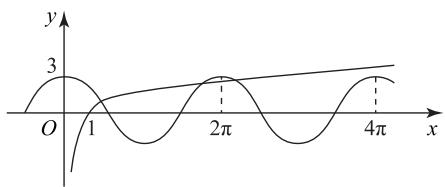

# 探究若干抽象函数模型

阿丽米热·艾尼

(新疆实验中学)

抽象函数问题具有构思新颖、概念抽象、隐蔽性强、解法灵活多变等特点，是考查学生推理论证能力、阅读理解能力以及抽象思维能力的有效载体，因而备受高考命题专家们的青睐。所谓抽象函数是指没有给出具体的函数解析式的特殊函数，它们的类型繁多、题型各异，其中有一类是比较多见的，即题中给出了特定的解析递推式和运算规则，通过类比初等函数，一般可以找到满足其条件的特殊模型。我们可以根据这个模型具有的性质，探求题目中抽象函数的有关性质，这样就容易找到解决问题的突破点。下面通过对几道典型例题的分析，介绍几个含有解析递推式的抽象函数的类型及其模型，供读者参考。

# 1 特征式 $f(x + y) = f(x) + f(y) + b$

例1 已知函数 $f(x)$ 对任意实数 $x, y$ 都满足 $f(x + y) = f(x) + f(y)$ ，且当 $x > 0$ 时， $f(x) < 0$ ， $f(1) = -2$ ，求 $f(x)$ 在区间 $[-3, 3]$ 上的最小值和最大值.

分析 由于函数 $f(x)$ 满足 $f(x + y) = f(x) + f(y)$ ，容易知道函数 $f(x) = kx (k \neq 0)$ 满足此式，故而可猜测 $f(x)$ 是单调函数.

解 设 $x_{1} < x_{2}$ ，则 $x_{2} - x_{1} > 0$ ，所以 $f(x_{2} - x_{1}) < 0$ ，于是 $f(x_{2}) = f(x_{2} - x_{1} + x_{1}) = f(x_{2} - x_{1}) + f(x_{1}) < f(x_{1})$ ，故函数 $f(x)$ 在 $[-3, 3]$ 上单调递减.

令 $x = y = 0$ ，则 $f(0) = 0$ ，再令 $y = -x$ ，则 $0 = f(0) = f(x) + f(-x)$ ，即 $f(-x) = -f(x)$ ，所以 $f(x)$ 是奇函数.由于 $f(3) = f(1) + f(2) = 3f(1) = -6$ ，则 $f(-3) = -f(3) = 6$ ，所以 $f(x)$ 在[-3,3]上的最小值是-6，最大值是6.

如果认识了此抽象函数的基本类型,那么后续的解题就有了方向,可以设法模仿或接近某个结论并为之而努力,本题涉及正比例函数模型,因此需要判断此函数的单调性和奇偶性,为后续解题做好准备.

# 2 特征式 $f(x + y) = f(x)f(y)$

例2 设函数 $f(x)$ 的定义域是 $\mathbf{R}$ ，对任意实数 $x, y$ 均有 $f(x + y) = f(x)f(y)$ ，且当 $x > 0$ 时， $0 < f(x) < 1$ ，试判断函数 $f(x)$ 在 $\mathbf{R}$ 上的单调性，并求不等式 $f(x - 2) < f(x^2 - 2x)$ 的解集.

分析 因为所给函数满足 $f(x+y)=f(x)\cdot f(y)$ ，而指数函数 $f(x)=a^{x}$ 满足这个表达式，所以可探求函数 $f(x)$ 是否具有单调性，用单调函数的定义推理判定比较方便.

解设 $x_{1} < x_{2}$ ，则 $x_{2} - x_{1} > 0$ ，依题意有 $0 < f(x_{2} - x_{1}) < 1$ ，又对任意 $x \in \mathbf{R}$ ，都有

$$
f (x) = f \left(\frac {x}{2} + \frac {x}{2}\right) = f \left(\frac {x}{2}\right) f \left(\frac {x}{2}\right) = f ^ {2} \left(\frac {x}{2}\right) > 0,
$$

所以

$$
f \left(x _ {2}\right) - f \left(x _ {1}\right) = f \left[ \left(x _ {2} - x _ {1}\right) + x _ {1} \right] - f \left(x _ {1}\right) =
$$

$$
f \left(x _ {2} - x _ {1}\right) f \left(x _ {1}\right) - f \left(x _ {1}\right) =
$$

$$
f (x _ {1}) [ f (x _ {2} - x _ {1}) - 1 ] <   0,
$$

则 $f(x_{2}) - f(x_{1}) < 0$ ，所以 $f(x)$ 在 $\mathbf{R}$ 上是减函数.从而由 $f(x - 2) < f(x^{2} - 2x)$ ，得 $x^{2} - 3x + 2 < 0$ ，解得 $1 < x < 2$

点评

从给出的抽象函数的运算规则, 可知此类函数与指数函数相似, 故而可设法证明此函数是单调的，且函数值恒为正数，有了这个提示，就为后面判断 $f(x_{1}) - f(x_{2})$ 的正负情况指明了方向.

# 3 特征式 $f(xy) = f(x) + f(y) (x > 0, y > 0)$

例3 已知定义在 $(0, +\infty)$ 上的函数 $f(x)$ ，对任意 $x, y \in (0, +\infty)$ 都有 $f(xy) = f(x) + f(y)$ 成立，且当 $x > 1$ 时， $f(x) > 0$ ，又 $f(2) = 1$ ，试问方程 $f(x) = 3\cos x$ 有几个解？

分析 由于函数 $f(x)$ 满足 $f(xy) = f(x) + f(y)$ ，而对数函数 $f(x) = \log_a x (a > 0, a \neq 1)$ 也有相似的性质。由于对数函数一般是单调函数，故应从判断函数的单调性入手，再分析函数图像并通过估算求解。

解 设 $0 < x_{1} < x_{2}$ ，则 $\frac{x_{2}}{x_{1}} > 1$ ，依题意有 $f\left(\frac{x_{2}}{x_{1}}\right) > 0$ ，所以

$$
f \left(x _ {2}\right) - f \left(x _ {1}\right) = f \left(\frac {x _ {2}}{x _ {1}} \cdot x _ {1}\right) - f \left(x _ {1}\right) =
$$

$$
f \left(\frac {x _ {2}}{x _ {1}}\right) + f \left(x _ {1}\right) - f \left(x _ {1}\right) = f \left(\frac {x _ {2}}{x _ {1}}\right) > 0,
$$

即 $f(x_{1})<f(x_{2})$ ，故 $f(x)$ 在 $(0,+\infty)$ 上是增函数.
由 $f(1)=f(1\times1)=f(1)+f(1)$ ，得 $f(1)=0$ ，所以

$$
f (4) = f (2 \times 2) = f (2) + f (2) = 2,
$$

$$
f (8) = f (4 \times 2) = f (4) + f (2) = 3.
$$

由于 $2\pi<8<4\pi$ ，所以 $f(2\pi)<f(8)<f(4\pi)$ ，又 $3\cos2\pi=3\cos4\pi=3$ ，通过画 $y=f(x)$ 与 $y=3\cos x$ 的草图，如图1所示，易知两个函数图像有三个交点，即方程 $f(x)=3\cos x$ 有三个解.

line

| x     | y |
|-------|---|
| 0     | 0 |
| 1     | 3 |
| 2π    | 3 |
| 4π    | 3 |

图1

# 点评

欲判断此方程解的个数, 即要找到函数 $y = f(x)$ 与 $y = 3\cos x$ 的图像交点的个数, 故应依据定义判断所给函数的单调性，并通过估算出几个关键函数值所在的范围进行判断.

# 4 特征式 $f(xy) = f(x)f(y)$

例4 设定义在 $(0, +\infty)$ 上的函数 $f(x)$ 满足$f(xy) = f(x)f(y),f(x) > 0$ ，且当 $x > 1$ 时， $f(x) > 1$ ，又 $f(2) = \sqrt{2}$ ，试求不等式 $f(x^{2} - 3x) > 2$ 的解.

分析 由于函数 $f(x)$ 满足 $f(xy) = f(x) \cdot f(y)$ , 容易知道幂函数 $f(x) = x^{\alpha}$ 满足此运算规则, 不同的幂函数含有不同的单调性, 而题设是求解抽象函数不等式, 故需要知道此函数的单调性.

解 设 $0 < x_{1} < x_{2}$ ，则 $\frac{x_{2}}{x_{1}} > 1$ ，依题意有 $f\left(\frac{x_{2}}{x_{1}}\right) > 1$ ，所以

$$
\begin{array}{l} f \left(x _ {1}\right) - f \left(x _ {2}\right) = f \left(x _ {1}\right) - f \left(\frac {x _ {2}}{x _ {1}} \cdot x _ {1}\right) = \\ f \left(x _ {1}\right) - f \left(\frac {x _ {2}}{x _ {1}}\right) f \left(x _ {1}\right) = f \left(x _ {1}\right) \left[ 1 - f \left(\frac {x _ {2}}{x _ {1}}\right) \right]. \\ \end{array}
$$

由于 $f(x_{1}) > 0, 1 - f\left(\frac{x_{2}}{x_{1}}\right) < 0$ ，所以 $f(x_{1}) < f(x_{2})$ ，故 $f(x)$ 在 $(0, +\infty)$ 上单调递增。又

$$
f (4) = f (2 \times 2) = f (2) f (2) = 2,
$$

所以不等式 $f(x^{2} - 3x) > 2$ ，即 $f(x^{2} - 3x) > f(4)$

故 $\left\{\begin{aligned}x^{2}-3x&>4,\\ x^{2}-3x&>0,\\ x&>0,\end{aligned}\right.$ 解得x>4.

# 点评

判断出一个抽象函数的单调性是“脱去”函数符号“f”的最有效的方法,而本题在函数单调性的证明过程中,根据定义并对所给条件进行了配凑,这是一个重要技巧,故而要把握好配凑的常用方法.

# 5 特征式 $f(x + y) = \frac{f(x)f(y)}{f(x) + f(y)}$

例5 对于任意非零实数 $x, y$ ，函数 $f(x)$ 都满足 $f(x + y) = \frac{f(x)f(y)}{f(x) + f(y)}$ ，若 $f(x)$ 在 $\mathbf{R}$ 上单调递减，且 $x_{1} + x_{2} > 0,x_{2} + x_{3} > 0,x_{1} + x_{3} > 0$ ，试判断 $f(x_{1}) + f(x_{2}) + f(x_{3})$ 的符号.

分析 由于函数 $f(x)$ 满足

$$
f (x + y) = \frac {f (x) f (y)}{f (x) + f (y)},
$$

容易知道反比例函数 $f(x)=\frac{k}{x}$ 满足此运算规则，而反比例函数是奇函数，故先应判断此函数的奇偶性.

解 因为

$$
f (1) = f (1 + x - x) = \frac {f (1 + x) f (- x)}{f (1 + x) + f (- x)} =
$$

$$
\frac {\frac {f (1) f (x)}{f (1) + f (x)} \cdot f (- x)}{\frac {f (1) f (x)}{f (1) + f (x)} + f (- x)} =
$$

$$
\frac {f (1) f (x) f (- x)}{f (1) [ f (x) + f (- x) ] + f (x) f (- x)},
$$

所以 $f(x) + f(-x) = 0$ ，即 $f(x)$ 为奇函数，由 $x_{1} + x_{2} > 0$ ，故 $x_{1} > -x_{2}$ .又 $f(x)$ 是 $\mathbf{R}$ 上单调递减，所以 $f(x_{1}) <   f(-x_{2}) = -f(x_{2})$ ，即 $f(x_{1}) + f(x_{2}) <   0.$

同理， $f(x_{2})+f(x_{3})<0$ ， $f(x_{1})+f(x_{3})<0$ ，三式相加得 $f(x_{1})+f(x_{2})+f(x_{3})<0$ ，所以 $f(x_{1})+f(x_{2})+f(x_{3})$ 为负数.

# 点评

在对给出的解析递推式进行研究后,判断出此函数与反比例函数类似,这样就获得了此函数应为奇函数的信息,进而只需努力证明此函数为奇函数.

# 6 特征式 $f(x + y) + f(x - y) = 2f(x)f(y)$

例6 已知函数 $f(x)$ 的定义域为 $\mathbf{R}$ , 对任意 $x$ ,$y$ 都满足 $f(x + y) + f(x - y) = 2f(x)f(y)$ ，并且 $f(1) = 0, f(-2) = 2, f(0) \neq 0$ ，试求 $f(2022)$ 的值.

分析 由题意很难发现 $f(x)$ 的性质, 在观察给出的解析递推式后, 可联想到三角公式, 发现 $f(x)=\cos x$ 满足 $f(x+y)+f(x-y)=2f(x)f(y)$ , 由此猜想出 $f(x)$ 是偶函数, 且为周期函数.

解 在 $f(x+y)+f(x-y)=2f(x)f(y)$ 中，令 x=y=0 ，得 $2f(0)=2f^{2}(0)$ ，又 $f(0)\neq0$ ，所以 $f(0)=1$ ；再令 x=0，则

$$
f (y) + f (- y) = 2 f (0) f (y) = 2 f (y),
$$

可得 $f(-y)=f(y)$ ，故 $f(x)$ 为偶函数.

又 $f(1) = 0$ ，所以

$$
f (x + 1 + 1) + f (x + 1 - 1) = 2 f (x + 1) f (1) = 0,
$$

即 $f(x + 2) = -f(x)$ ，所以

$$
f (x + 4) = f [ (x + 2) + 2 ] = - f (x + 2) = f (x),
$$

故 $f(x)$ 是以4为周期的函数，于是

$$
f (2 0 2 2) = f (5 0 5 \times 4 + 2) = f (2) = f (- 2) = 2.
$$

# 点评

通过用比较熟悉的函数模型猜想得出 $f(x)$

的某些性质,然后再有针对性地推理证明, 就能够得出正确的判断,从而使解题少走弯路,而采用特殊值代入验证是求解抽象函数问题的常用技巧.

# 7 特征式 $f(x + y) = \frac{f(x) + f(y)}{1 - f(x)f(y)}$

例 7 已知 $f(x)$ 是定义域为 R 的函数, 且对任意 $x, y$ 满足 $f(x + y) = \frac{f(x) + f(y)}{1 - f(x)f(y)}$ . 若 $f(x) \neq \pm 1, f(1) = 1$ , 且当 $0 < x < 2$ 时, $f(x) > 0$ , 试判断函数 $f(x)$ 在 $(-2, 2)$ 上的单调性.

分析 观察题中的解析递推式

$$
f (x + y) = \frac {f (x) + f (y)}{1 - f (x) f (y)},
$$

容易发现正切函数 $f(x)=\tan x$ 满足该条件, 故而可猜想出函数 $f(x)$ 是奇函数, 且在区间 $(-2,2)$ 上单调递增.

解 在 $f(x + y) = \frac{f(x) + f(y)}{1 - f(x)f(y)}$ 中，令 $x = y = 0$ ，得 $f(0) = \frac{2f(0)}{1 - f^2(0)}$ ，由于 $f(0)\neq \pm 1$ ，故 $f(0) =$

0; 再令 y = -x，得 $f(x) + f(-x) = 0$ ，于是 $f(x)$ 是奇函数.

设 $0 < x_{1} < x_{2} < 2$ ，则 $f(x_{1}) > 0, f(x_{2}) > 0, f(x_{2} - x_{1}) > 0$ ，由于

$$
f \left(x _ {2} - x _ {1}\right) = \frac {f \left(x _ {2}\right) + f \left(- x _ {1}\right)}{1 - f \left(x _ {2}\right) f \left(- x _ {1}\right)} =
$$

$$
\frac {f \left(x _ {2}\right) - f \left(x _ {1}\right)}{1 + f \left(x _ {2}\right) f \left(x _ {2}\right)} > 0,
$$

所以 $f(x_{2})>f(x_{1})$ ，即 $f(x)$ 在 $(0,2)$ 上单调递增。又当 $x\in(-2,0)$ 时，根据奇函数的性质，易知 $f(x)$ 单调递增，故函数 $f(x)$ 在 $(-2,2)$ 上单调递增。

# 点评

通过认真研究给出的解析递推式,并由此判断出函数的模型特征,从而根据模型的性质,容易想到解决问题的方法.

在某些含有解析递推式的抽象函数问题中, 寻找出对应的常规函数模型是一种重要的解题技巧, 因为我们可以结合该常规函数模型进一步猜测出抽象函数的基本性质, 并且根据解题的需要, 对此函数的相关性质进行推理证明. 特别需要注意的是, 所找出的模型函数只是辅助我们解题, 我们不可以直接应用该模型函数的图像和性质解题, 否则是会失分的.

# 链接练习

1. 定义在 $\mathbf{R}$ 上的函数 $f(x)$ 满足 $f(x + y) = f(x) + f(y) -$

1, $f(\frac{1}{2}) = 0$ ，且 $x > \frac{1}{2}$ 时， $f(x) < 0$ ，若 $a_{n} = f(n)(n \in$

$N^{*}$ ），求数列的前10项和.

2. 设定义在实数集的函数 $f(x)$ ，对任意实数 x, y 满足 $f(x + y) = f(x)f(y)$ ，且当 x > 0 时， $f(x) > 1$ ，若 $f(x)f(2x - x^{2}) > 1$ ，求 x 的取值范围.

3. 已知偶函数 $f(x)$ ，其定义域为 $(- \infty, 0) \cup (0, +\infty)$ ，对于定义域内的任意实数 $x, y$ ，满足 $f(xy) = f(x) + f(y)$ ，且当 $x > 0$ 时， $f(x) > 0, f(2) = 1, f(2x^2 - 1) < 2$ ，求 $x$ 的取值范围.

4. 已知函数 $f(x)$ ，对任意实数 $x, y$ 都满足 $f(xy) = f(x)f(y)$ ，且 $f(-1) = 1, f(27) = 9$ ，当 $0 \leqslant x < 1$ 时， $f(x) \in$

[0,1). 若 $x \geqslant 0$ 且 $f(x + 1) \leqslant \sqrt[3]{9}$ , 求 $x$ 的取值范围.

# 链接练习参考答案

1. -100.

2. $\{x \mid 0 < x < 3\}$ .

3. $\{x\mid -\frac{\sqrt{10}}{2} < x < \frac{\sqrt{10}}{2}$ 且 $x\neq \pm \frac{\sqrt{2}}{2}\} .$

4. $\{x \mid 0 \leqslant x \leqslant 2\}$ .

(完)