# 搭设“数”“形”阶梯,注重通性通法

——谈如何解决含参数的函数单调性问题

● 安徽省铜陵市义安区教育体育局教研室 陶俊

摘要: 函数单调性是高中函数的重点和难点, 在高考题中频繁出现, 解题的关键是结合函数图象用导数法确定在定义域内的极值点, 而搭设“数”“形”阶梯, 用导数法讨论含参数的函数单调性, 能有效地帮助学生掌握一种通性通法的能力, 也为研究函数的极值、最值、不等式恒成立、不等式存在解、函数的零点个数、参数取值等问题奠定知识基础和思想方法.

关键词: 数形结合; 导数法; 单调性; 参数; 通性通法

函数单调性是函数的重点内容,在高考函数题中频繁出现,学生得分率低,存在许多学生不知道用什么方法或知道用导数法但不会分类讨论等现象.单调性是函数在某一区间内图象上升或下降的图形特征,它反映了函数的局部性质,由此进一步研究函数的极值和最值.含参数的函数单调性,参数的不同取值影响函数的类型和函数的单调性,解题时有时需要对参数进行分类讨论.

讨论含参数的函数单调性,是高考的热点问题,因为它涉及到数学的数形结合、整体与分类、对应与转化、函数与方程等常用的思想.而不含参数的函数单调性具有具体性、特定性;含参数的函数单调性研究更具有一般性、普遍性.前者往往是高考压轴题的第(1)题,压轴题的第(2)(3)题是在第(1)题的基础上推广到一般性问题,提出许多种不同类型的问题,有函数的极值或最值、不等式恒成立或存在成立、方程有解或零点个数和参数取值等,其中就会涉及到含参数的函数单调性.

# 1 学生求解含参函数单调性问题出错的原因

学生不会解决含参数的函数单调性问题,一般有以下几个原因:没有重视具体与一般的关系,只解题,不总结经验,缺乏知识迁移、举一反三的能力;缺少观察、比较、归纳、概括的过程,难以形成一般性解题方法;对参数字母认识肤浅,总是认为参数字母为正数,忽略参数字母为0或负数的情况,从而不能正确进行分类讨论.总之,学生忘了解题的根本,基础知识不扎实,数学思想方法未掌握,没有学会最基本的数学解题方法.

# 2 解决含参函数单调性问题的通性通法

讨论含参数的函数单调性,通性是函数单调性,通法是导数法,这类问题可搭设“数”“形”阶梯,利用导数法来解决一般会变得比较简单.函数单调性的研究一般从图象与数量两方面进行,结合其导数值的正负可以反映函数图象的变化趋势,从而判断出函数的单调性及单调区间,体现数形结合的数学思想.

函数的单调性与其导数的关系: 设函数 $y = f(x)$ (除了 $y = f(x)$ 是常量函数) 在某个区间 $(a, b)$ 内可导, 则当 $f'(x) > 0$ 时, $f(x)$ 在区间 $(a, b)$ 单调递增; 当 $f'(x) < 0$ 时, $f(x)$ 在区间 $(a, b)$ 单调递减. $f(x)$ 在区间 $(a, b)$ 上单调递增的充要条件是对任意 $x \in (a, b)$ 都有 $f'(x) \geqslant 0$ 且在 $(a, b)$ 内的任一子区间上 $f'(x)$ 不恒为 0.

利用导数判断函数 $y=f(x)$ 的单调性或求单调区间的一般步骤是：

(1)确定定义域 A(A 是完整的区间).  
(2) 求 $f'(x)$ ，通常将 $f'(x)$ 化为积、商形式，便于确定决定 $f'(x)$ 正负号的函数 $g(x)$ .  
(3) 讨论函数 $y = f(x)$ 在定义域 A 内有无极值点，若有极值点，则非单调；若无极值点，则单调。判定极值有两种方法：一种是极值点的定义，看 $g(x)$ 在 $x_{0}$ （ $x_{0}$ 也是方程 $f'(x) = 0$ 的根）的两侧函数值是否异号；另一种是形的方法，看 $g(x)$ 有无“穿根”的情况。  
(4) 若函数 $g(x)$ 无“穿根”，则函数 $y = f(x)$ 在定义域内 A 内单调；若函数 $g(x)$ 有“穿根”，则根将 A

分成若干个单调区间,分区间判断 $g(x)$ 的符号,从而确定其单调性.

(5)得出结论.

总之,结合为判断导函数 $f'(x)$ 的正负号而产生的函数 $g(x)$ 的图象比较形象直观,化繁为简,把复杂函数 $y=f(x)$ 的单调性问题转化为基本函数 $g(x)$ 有无“穿根”的问题,它是决定导函数的正负号的函数,此法是通性通法.

复杂的函数,往往由基本函数——一次函数、二次函数、反比例函数、幂函数、指数函数、对数函数、三角函数等构成,有的通过加、减、乘、除的形式构成,也有的以复合函数的形式出现.

# 3 典型案例解析

以下几个典型案例,由几种基本函数通过加、减、乘、除形式构成,借助它们来说明这类问题的一般解决方法,仅供大家参考.

例 1 设函数 $f(x)=a^{2}\ln x-x^{2}+ax$ ，求 $f(x)$ 的单调区间 $^{[1]}$ .

分析: 原函数是由一次函数、二次函数、对数函数通过加、减形式构成的, $f'(x)$ 可化为积、商的形式, 它的符号由函数 $g(x) = -(x - a)(2x + a)$ 决定, $g(x)$ 是二次函数, 开口向下, 与 x 轴交于点 A(a,0), $B\left(-\frac{a}{2},0\right)$ (a=0 时, A 与 B 重合), 函数定义域是 $(0,+\infty)$ .

解: 因为 $f(x)=a^{2}\ln x-x^{2}+ax$ ，其中 x>0，所以 $f'(x)=\frac{a^{2}}{x}-2x+a=-\frac{(x-a)(2x+a)}{x}$ .

设 $g(x)=-(x-a)(2x+a),x>0.$

(1) 当 a=0 时，如图 $1, g(x) \leqslant 0$ ，则 $f'(x) \leqslant 0$ ，所以 $f(x)$ 的减区间为 $(0, +\infty)$ .  
(2) 当 a > 0 时，如图 2，当 $x \in (0, a)$ 时， $g(x) > 0$ ，则 $f'(x) > 0$ ；当 $x \in (a, +\infty)$ 时， $g(x) < 0$ ，则 $f'(x) < 0$ 。故 $f(x)$ 的单调递增区间为 $(0, a)$ ，单调递减区间为 $(a, +\infty)$ 。

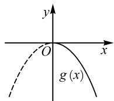  
图1

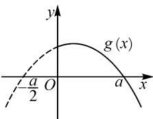

text_image

y
g(x)
-a/2 O a x

图2

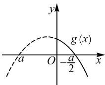

text_image

y
g(x)
-a O -a/2 x

图3

(3) 当 $a < 0$ 时, 如图3, 当 $x \in \left(0, -\frac{a}{2}\right)$ 时, $g(x) > 0$ , $f'(x) > 0$ ; 当 $x \in \left(-\frac{a}{2}, +\infty\right)$ 时, $g(x) < 0$ , 则 $f'(x) < 0$ . 故 $f(x)$ 的单调递增区间为 $\left(0, -\frac{a}{2}\right)$ , 单调递减区间为 $\left(-\frac{a}{2}, +\infty\right)$ .

因为函数 $f(x)$ 的定义域是 $(0, +\infty)$ ，所以其图象在 y 轴右侧要画实线，在 y 轴左侧要画虚线.

例 2 设函数 $f(x)=(x-1)\mathrm{e}^{x}-kx^{2}$ (其中 $k\in R$ ), 求函数 $f(x)$ 的单调区间.

分析: 原函数是由一次函数、二次函数、指数函数通过乘、减形式构成的, $f'(x)$ 可化为积、商的形式, 它的符号是由 $g(x) = x (\mathrm{e}^{x} - 2k)$ 决定的, $g(x)$ 与 x 轴交于点 $A(0,0)$ , 由积的符号法则, $f'(x)$ 的符号是由 $h(x) = \mathrm{e}^{x} - 2k$ 与 x 决定的, $h(x)$ 是指数型函数.

解: $f'(x)=\mathrm{e}^{x}+(x-1)\mathrm{e}^{x}-2kx=x\mathrm{e}^{x}-2kx=x(\mathrm{e}^{x}-2k)$ .

(1) 当 $k \leqslant 0$ 时，如图 4, $e^{x} - 2k > 0$ .  
当 $x \in (-\infty, 0)$ 时， $f'(x) < 0$ ; 当 $x \in (0, +\infty)$ 时， $f'(x) > 0$ .  
故 $f(x)$ 的单调递增区间为 $(0, +\infty)$ ，单调递减区间为 $(-∞, 0)$ .  
(2) 当 $0 < k < \frac{1}{2}$ 时，令 $f'(x) = 0$ ，得 $x_{1} = 0, x_{2} = \ln(2k)$ .

函数 $y=e^{x}-2k$ 的图象如图 5.

由 $f'(x)>0$ , 得 x>0 或 $x<\ln(2k)$ ; 由 $f'(x)<0$ , 得 $\ln(2k)<x<0$ .

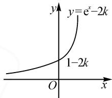

text_image

y=e^{x}-2k
1-2k
O
x

图4

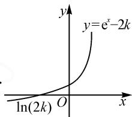

text_image

y
y=e^x-2k
ln(2k) O x

图 5

故 $f(x)$ 的单调递增区间为 $(-∞, \ln(2k))$ , $(0, +∞)$ , 单调递减区间为 $(\ln(2k), 0)$ .  
(3) 当 $k=\frac{1}{2}$ 时, 如图 6. 当 $x\in R$ 时, $f'(x)\geqslant0$ , 故 $f(x)$ 的单调递增区间为 R.

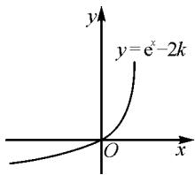

text_image

y
y=e^x-2k
O
x

图6

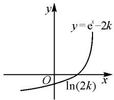

text_image

y
y=e^x-2k
O
ln(2k)
x

图 7

(4) 当 $k > \frac{1}{2}$ 时，如图 7. 令 $f'(x) = 0$ ，得 $x_{1} = 0$ ， $x_{2} = \ln(2k)$ .

由 $f'(x)>0$ ，得 $x>\ln(2k)$ ，或 x<0 ；由 $f'(x)<0$ ，得 $0<x<\ln(2k)$ 。

故 $f(x)$ 的单调递增区间为 $(\ln (2k), + \infty)$ ， $(- \infty, 0)$ ，单调递减区间为 $(0, \ln (2k))$ 。

例 3 已知函数 $f(x)=\ln x-ax+\frac{1-a}{x}(a\in\mathbb{R})$ ，讨论 $f(x)$ 的单调性.

分析: 原函数是由一次函数、反比例函数、对数函数通过加、减形式构成的, $f'(x)$ 可化为积、商的形式, 它的符号是由 $g(x) = -(ax^{2} - x + 1 - a)$ 决定的, 它的函数类型不确定, 需要分类讨论, 先讨论系数 a 的正负, 再讨论 $g(x)$ 零点的大小.

解: $f'(x)=\frac{1}{x}-a+\frac{a-1}{x^{2}}=-\frac{ax^{2}-x+1-a}{x^{2}}$ . 令 $g(x)=-(ax^{2}-x+1-a)$ ，其定义域是 $(0,+\infty)$ .

(1) 当 a=0 时, $g(x)=x-1$ , 如图 8. 当 $x\in(0,1)$ 时, $g(x)<0$ , 即 $f'(x)<0$ ; 当 $x\in(1,+\infty)$ 时, $g(x)>0$ , 即 $f'(x)>0$ .

所以 $f(x)$ 的单调递增区间为 $(1, +\infty)$ ，单调递减区间为 $(0, 1)$ .

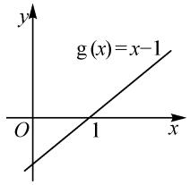

text_image

g(x)=x-1
O
1
x
y

图8

(2) 当 $a \neq 0$ 时, $g(x) = -a\left(x + 1 - \frac{1}{a}\right)(x - 1)$ 是二次函数, 令 $g(x) = 0$ , 得 $x_{1} = 1, x_{2} = \frac{1}{a} - 1$ , 其开口方向不确定, 但与 x 轴交于点 A(1,0), $B\left(\frac{1}{a} - 1, 0\right)$ (当 $a = \frac{1}{2}$ 时, 点 A 与 B 重合).

① 当 a<0 时，如图 9，当 0<x<1 时， $g(x)<0$ ，即 $f'(x)<0$ ；当 x>1 时， $g(x)>0$ ，即 $f'(x)>0$ 。故 $f(x)$ 在 $(0,1)$ 上单调递减，在 $(1,+\infty)$ 上单调递增。

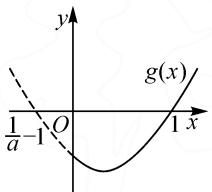

text_image

y
g(x)
1/a-1 O 1 x

图9

②当 $0 < a < \frac{1}{2}$ 时，如图 10，当 $1<x<\frac{1}{a}-1$ 时， $g(x)>0$ ，即 $f'(x)>0$ ；当 0<x<1 或 $x>\frac{1}{a}-1$ 时， $g(x)<0$ ，即 $f'(x)<0$ 。故 $f(x)$ 在

$\left(1,\frac{1}{a}-1\right)$ 上单调递增，在 $(0,1)$ , $\left(\frac{1}{a}-1,+\infty\right)$ 上单调递减.

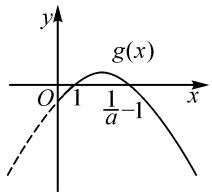

text_image

y
g(x)
O 1 1/a-1 x

图10  
③ 当 $a = \frac{1}{2}$ 时，如图 11，
图 10 $g(x)\leqslant0,f'(x)\leqslant0$ ，则 $f(x)$ 在 $(0,+\infty)$ 上单调递减.

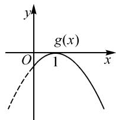

text_image

y
g(x)
O 1 x

图11

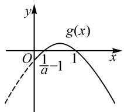

text_image

y
g(x)
O
1/a-1
1
x

图12

④当 $\frac{1}{2}<a<1$ 时，如图12，当 $\frac{1}{a}-1<x<1$ 时， $g(x)>0$ ，即 $f'(x)>0$ ；当 $0<x<\frac{1}{a}-1$ 或 x>1 时， $g(x)<0$ ，即 $f'(x)<0$ 。故 $f(x)$ 在 $\left(\frac{1}{a}-1,1\right)$ 上单调递增，在 $\left(0,\frac{1}{a}-1\right),(1,+\infty)$ 上单调递减。

⑤当 $a \geqslant 1$ 时，如图 13，当 0 < x < 1 时， $g(x) > 0$ ，即 $f'(x) > 0$ ；当 x > 1 时， $g(x) < 0$ ，即 $f'(x) < 0$ 。故 $f(x)$ 在 $(0,1)$ 上单调递增，在 $(1,+\infty)$ 上单调递减。

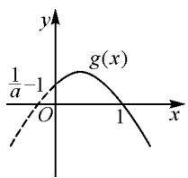

text_image

y
g(x)
1/a-1
O
1
x

图13

从以上几个案例可以看出,单调性是函数的重要性质之一,导数法是解决函数单调性问题的通性通法.搭设“数”“形”阶梯,掌握用导数法讨论含参数的函数单调性,不仅能熟练解决不含参数的函数单调性问题,而且还能解决函数的极值或最值、不等式恒成立或存在成立、方程有解或零点个数和参数取值等,此法也充分体现了函数与方程、数形结合、转化与化归的数学思想.正如章建跃老师所说,注重基础知识及其蕴含的数学思想方法,才是追求数学教学的“长期利益”[2].

# 参考文献：

[1] 宋春雨. 教材完全解读·高中数学·选修 2-2[M]. 北京：中国青年出版社，2009.

[2]章建跃.注重通性通法才是好数学教学[J].中小学数学（高中版），2011(11):50.Z