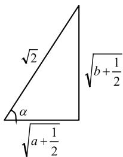

# 数学巧构造 解题亦无忧

翟 双

(山东省淄博第十一中学)

在高中数学解题中,若一些题目难以直接采取常规思维方法解答,则可考虑利用构造法.构造法是一种常用的方法,多用于解决复杂的函数问题.解题时需准确分析问题条件与结论的关系,进而构造相应的数学对象,借助新构造的对象快速解决数学问题.因此,在解题时,学生应巧妙利用构造法,对问题进行转化,提高解题的准确性和效率.

# 1 巧妙构造方程

利用构造法解题时,需要对题目进行深入分析,结合题目条件,构造相应的方程,进而找出解题的突破点,快速解决问题.

例1 已知 $a, b, c$ 为实数，且 $a = 6 - b, c^2 = ab -$ 9, 求 $a, b, c$ 的值.

对于此类含参数的数学问题,很多学生觉得题目信息少,解答的难度比较大,不知如何解答.此时,可以考虑利用构造法,构造一元二次方程,利用根与系数的关系完成解题.

由题意可知 $a + b = 6, ab = c^2 - 9$ ，根据根与系数的关系，构造出一元二次方程 $x^2 - 6x + c^2 + 9 = 0$ ，其实数根为 $a, b$ ，所以 $\Delta = 36 - 4(c^2 + 9) = -4c^2 \geqslant 0$ ，解得 $c = 0$ ，代入 $c^2 = ab - 9$ ，可得 $ab - 9 = 0$ 。因为 $a = 6 - b$ ，解得 $a = 3, b = 3$ ，所以 $a, b, c$ 的值分别是 $3, 3, 0$ 。

# 2 巧妙构造函数

在高中数学中,函数是重要的内容,有关函数的问题类型多且复杂,在解题时,有时通过构造函数,能够快速解题.因此,认真阅读题目,了解题目出题意图,准确分析函数关系,构造出相应的函数,可以降低解题难度,简化解题过程.

例 2 设 $x, y, z \in (0,1)$ ，求证：

$$
x (1 - y) + y (1 - z) + z (1 - x) <   1.
$$

直接证明本题比较难,通过对待证明的式子进行观察,将待征不等式中的 y,z 看成常量, 把 x 看成变量, 那么待证不等式就是关于 x 的一

次不等式,构造函数,借助函数的性质即可完成证明.

根据 $x(1-y)+y(1-z)+z(1-x)<1$ ，构造关于 x 的一次函数

$$
f (x) = (1 - y - z) x + (y + z - y z - 1),
$$

因为

$$
f (0) = y + z - y z - 1 = - (y - 1) (z - 1) <   0,
$$

$$
f (1) = (1 - y - z) + (y + z - y z - 1) = - y z <   0,
$$

所以当 0 < x < 1 时, 都有 $f(x) < 0$ , 则

$$
(1 - y - z) x + (y + z - y z - 1) <   0,
$$

即 $x(1 - y) + y(1 - z) + z(1 - x) < 1.$

例 3 已知函数 $f(x)=\frac{\mathrm{e}^{x}}{x}-\ln x+x-a$ .

(1) 若 $f(x) \geqslant 0$ ，求 a 的取值范围；

(2) 证明: 若 $f(x)$ 有两个零点 $x_{1}, x_{2}$ , 则 $x_{1}x_{2}<1$ .

(1) $a$ 的取值范围为 $(-\infty, \mathrm{e} + 1]$ (求解过程略).

(2)由题意得 $f(x)=\frac{\mathrm{e}^{x}}{x}+\ln\frac{\mathrm{e}^{x}}{x}-a$ . 令 $t=\frac{\mathrm{e}^{x}}{x}>1$ ，则 $f(t)=t+\ln t-a, f'(t)=1+\frac{1}{t}>0$ ，所以 $f(t)$ 在 $(1,+\infty)$ 上单调递增，故 $f(t)=0$ 只有 1 个解.

又因为 $f(x) = \frac{\mathrm{e}^x}{x} +\ln \frac{\mathrm{e}^x}{x} -a$ 有两个零点 $x_{1},x_{2}$ 所以 $t = \frac{\mathrm{e}^{x_1}}{x_1} = \frac{\mathrm{e}^{x_2}}{x_2}$ ，两边取对数得 $x_{1} - \ln x_{1} = x_{2}-$ $\ln x_2$ ，即 $\frac{x_1 - x_2}{\ln x_1 - \ln x_2} = 1.$ 又因为 $\sqrt{x_1x_2} <$ $\frac{x_1 - x_2}{\ln x_1 - \ln x_2}$ ，所以 $\sqrt{x_1x_2} <  1$ ，即 $x_{1}x_{2} <   1.$

下证 $\sqrt{x_1x_2} < \frac{x_1 - x_2}{\ln x_1 - \ln x_2}$ .

因为 $\sqrt{x_1x_2} < \frac{x_1 - x_2}{\ln x_1 - \ln x_2} \Leftrightarrow \ln x_1 - \ln x_2 < \frac{x_1 - x_2}{\sqrt{x_1x_2}} \Leftrightarrow \ln \frac{x_1}{x_2} < \sqrt{\frac{x_1}{x_2}} - \sqrt{\frac{x_2}{x_1}}$ ，不妨设 $t = \sqrt{\frac{x_1}{x_2}} > 1$ ，则只需证 $2\ln t < t - \frac{1}{t}$ .

构造 $h(t) = 2\ln t - t + \frac{1}{t}$ ，则

$$
h ^ {\prime} (t) = \frac {2}{t} - 1 - \frac {1}{t ^ {2}} = - (1 - \frac {1}{t}) ^ {2} <   0,
$$

故 $h(t) = 2\ln t - t + \frac{1}{t}$ 在 $(1, +\infty)$ 上单调递减，则 $h(t) <   h(1) = 0$ ，即 $2\ln t <   t - \frac{1}{t}$ 得证.

# 3 巧妙构造数列

数列是高中数学的重要内容,虽然学习难度不是很大,但是涉及的内容比较多,对知识应用能力有着比较高的要求.在解答与数列有关的问题时,可以根据条件和关系,通过联想、替换的方式,构造出等比数列或等差数列,进而利用数列知识完成解题.

例4 已知数列 $\{a_{n}\}$ 的前 $n$ 项和为 $S_{n}, S_{4} = 4$ ,当 $n \geqslant 2$ 时，数列 $\{a_{n}\}$ 的通项公式为 $a_{n} = \frac{1}{2} (\sqrt{S_{n}} + \sqrt{S_{n - 1}})$ ，求 $S_{n}$ 的表达式.

利用常规方式求解此题,过程复杂、烦琐,因此,考虑通过构造数列的方式.

当 $n \geqslant 2$ 时, $a_{n} = S_{n} - S_{n-1}$ , 所以

$$
S _ {n} - S _ {n - 1} = \frac {1}{2} (\sqrt {S _ {n}} + \sqrt {S _ {n - 1}}) (n \geqslant 2),
$$

即 $\frac{S_n - S_{n-1}}{\sqrt{S_n} + \sqrt{S_{n-1}}} = \frac{1}{2}$ , 即 $\sqrt{S_n} - \sqrt{S_{n-1}} = \frac{1}{2} (n \geqslant 2)$ . 因为 $S_4 = 4$ , 所以 $\sqrt{S_4} - \sqrt{S_3} = \frac{1}{2}$ , 解得 $S_3 = \frac{9}{4}$ , 同理, 可得 $S_2 = 1$ , $S_1 = \frac{1}{4}$ , 所以 $\{\sqrt{S_n}\}$ 是首项为 $\frac{1}{2}$ 、公差为 $\frac{1}{2}$ 的等差数列. 因此, $\sqrt{S_n} = \frac{1}{2} + \frac{1}{2} (n-1) = \frac{n}{2}$ , 所以 $S_n = (\sqrt{S_n})^2 = \frac{n^2}{4}$ .

# 4 巧妙构造图形

在用构造法解题时,不仅可以构造数量关系,还可以构造几何图形.构造图形是数形结合思想的重要表现形式,因此,结合题目信息构造相应的图形,将题目条件展示出来,有时可以降低问题的解答难度,提高学生解题效率.

例5 已知 $a > 0, b > 0$ ，且 $a + b = 1$ . 证明：

$$
\sqrt {2} <   \sqrt {a + \frac {1}{2}} + \sqrt {b + \frac {1}{2}} \leqslant 2.
$$

沂

在此题中,由于题目中有根式,使用常规方式求解时解题过程较为复杂.因此,可以通过构造图形的方式,简化证明过程.

因为 $a + b = 1$ ，所以

$$
(a + \frac {1}{2}) + (b + \frac {1}{2}) = 2,
$$

则 $(\sqrt{a + \frac{1}{2}})^2 + (\sqrt{b + \frac{1}{2}})^2 =$ $(\sqrt{2})^{2}$ . 由此根据勾股定理构造图形, 如图 1 所示, 由三角形的三边关系,可得 $\sqrt{2}<\sqrt{a+\frac{1}{2}}+\sqrt{b+\frac{1}{2}}$ .

text_image

√2
α
√a+1/2
√b+1/2

图1

由直角三角形的边角关系可得 $\sqrt{a + \frac{1}{2}} = \sqrt{2}\cos \alpha$ ， $\sqrt{b + \frac{1}{2}} = \sqrt{2}\sin \alpha$ ，所以

$$
\sqrt {a + \frac {1}{2}} + \sqrt {b + \frac {1}{2}} = \sqrt {2} (\cos \alpha + \sin \alpha) =
$$

$$
\sqrt {2} \times \sqrt {2} \sin (\alpha + \frac {\pi}{4}) \leqslant 2.
$$

构造法是一种常见的解题方式,用构造法解题可以简化解题过程.解题时需要根据题设条件灵活利用构造法,快速找到解题思路,提高解题效率.

# 链接练习

1. 已知 $f(x) = \begin{cases} |3 - 2x| + 1, & x > 0, \\ \frac{(x + 2)^2}{\mathrm{e}^x}, & x \leqslant 0. \end{cases}$ 若函数 $y = [f(x)]^2 - af(x) + 2$ 有8个不同的零点，则 $a$ 的取值范围是（ ）.

A. $(-2\sqrt{2}, +\infty)\cup (-\infty , - 2\sqrt{2})$

B. $(2\sqrt{2},8)$

C. $(2\sqrt{2},\frac{9}{2})$

D. $(2\sqrt{2},3)$

2.（多选题）已知 $f_{n}(x) = \sin^{2n}x + \cos^{2n}x(n\in \mathbf{N}^{*})$ ，则（ ）.

A. $f_{2}(x)$ 的最小正周期为 $\frac{\pi}{2}$

B. $f_{2}(x)$ 的图像关于点 $\left(\frac{k}{2}+\frac{\pi}{8},0\right)(k\in\mathbf{Z})$ 对称

C. $f_{n}(x)$ 的图像关于直线 $x = \frac{\pi}{2}$ 对称

D. $\frac{1}{2^{n - 1}}\leqslant f_n(x)\leqslant 1$

# 链接练习参考答案

1. D. 2. ACD.

(完)