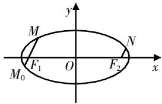
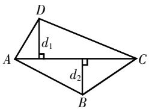
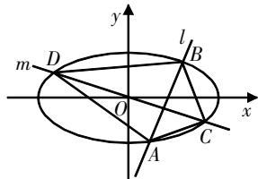

# 关于圆锥曲线中的四边形问题的探究

陆烨 江苏省常熟市浒浦高级中学 215500

[摘 要] 破解圆锥曲线问题时,要整合几何与代数知识考点,采用合理方法构建模型,利用代数分析推导结论. 文章以圆锥曲线中的四边形问题为例,开展问题评析、知识归纳、方法总结、拓展探究,并提出相应的教学建议.

[关键词] 圆锥曲线; 四边形; 模型; 面积; 方程

圆锥曲线中的四边形问题较为常见,该类问题的综合性强,涉及众多知识考点、方法模型,开展问题评析、归纳总结、拓展探究可提升学生的解题能力.本文以一道典型问题为例,展开具体评析和探究.

# 引例探究,问题评析

例题 已知椭圆 $E:\frac{x^{2}}{a^{2}}+\frac{y^{2}}{b^{2}}=1(a>b>0)$ 的左、右焦点分别为 $F_{1},F_{2}$ ，椭圆E的离心率为 $\frac{\sqrt{3}}{2}$ ，且通径长为1.

(1)求E的方程；  
(2) 直线 l 与 E 相交于 M, N 两点 (M, N 在 x 轴的同侧), 当 $F_{1}M \parallel F_{2}N$ 时, 求四边形 $F_{1}F_{2}NM$ 面积的最大值.

解析 (1)整合条件,构建方程组求解.

根据题意可得 $\left\{\begin{aligned}\frac{c}{a}&=\frac{\sqrt{3}}{2},\\ \frac{2b^{2}}{a}&=1,\end{aligned}\right.$ 结合

$a^{2}=b^{2}+c^{2}$ ，解得a=2,b=1, $c=\sqrt{3}$ ，所以

椭圆E的方程为 $\frac{x^{2}}{4}+y^{2}=1.$

(2)该问以椭圆为背景构建几何图形,探究四边形面积的最大值.可分两步求解:第一步,构建四边形面积模型;第二步,解析面积的最大值.

延长 $MF_{1}$ 交E于点 $M_{0}$ ，如图1所示。根据(1)问可知，椭圆的左、右焦点分别为 $F_{1}(-\sqrt{3},0)$ ， $F_{2}(\sqrt{3},0)$ 。

text_image

y
M
F₁ O F₂ x
M₀ N

图1

设 $M(x_{1},y_{1}),M_{0}(x_{2},y_{2}),MF_{1}$ 的方程为 $x=my-\sqrt{3}$ .联立直线与椭圆的方程,有 $\left\{\begin{aligned}&x=my-\sqrt{3}\\ &\frac{x^{2}}{4}+y^{2}=1,\end{aligned}\right.$ 整理可得 $(m^{2}+$

4) $y^{2}-2\sqrt{3}my-1=0$ ,由韦达定理可得

$$
\left\{ \begin{array}{l} y _ {1} + y _ {2} = \frac {2 \sqrt {3} m}{m ^ {2} + 4}, \\ y _ {1} y _ {2} = - \frac {1}{m ^ {2} + 4}. \end{array} \right.
$$

设 $F_{1}M$ 与 $F_{2}N$ 之间的距离为d,四边形 $F_{1}F_{2}NM$ 的面积为S,则 $S=\frac{1}{2}\left(\left|F_{1}M\right|+\right.$

$$
\left| F _ {2} N \right|) d = \frac {1}{2} \left(\left| F _ {1} M \right| + \left| F _ {1} M _ {0} \right|\right) d = \frac {1}{2} \cdot
$$

$$
\left| M M _ {0} \right| d   =   S _ {\triangle M F _ {2} M _ {0}}. \text {而} S _ {\triangle M F _ {2} M _ {0}}   =   \frac {1}{2} \cdot \left| F _ {1} F _ {2} \right| \cdot
$$

$$
\left| y _ {1} - y _ {2} \right| = \frac {1}{2} \cdot 2 \sqrt {3} \cdot \left| y _ {1} - y _ {2} \right| = \sqrt {3} \cdot
$$

$$
\sqrt {\left(y _ {1} + y _ {2}\right) ^ {2} - 4 y _ {1} y _ {2}} = \frac {4 \sqrt {3} \sqrt {m ^ {2} + 1}}{m ^ {2} + 4} =
$$

$$
\frac {4 \sqrt {3}}{\sqrt {m ^ {2} + 1} + \frac {3}{\sqrt {m ^ {2} + 1}}} \leqslant \frac {4 \sqrt {3}}{2 \sqrt {3}} = 2, \text {当且}
$$

仅当 $\sqrt{m^{2}+1}=\frac{3}{\sqrt{m^{2}+1}}$ ，即 $m=\pm\sqrt{2}$ 时，等号成立。所以四边形 $F_{1}F_{2}NM$ 面积的最大值为 2。

评析 上述例题为圆锥曲线综合题,其中第(2)问为核心之问——探究四边形的最大值. 解析按照的思路是“问题转化→模型构建→最值分析”,即先将四边形问题转化为三角形问题,然后构建面积模型,代入线段的长度,转化为关于参数的函数,最后利用均值不等式的性质求解最值. 在整个过程中, 模型的构建是解题关键, 均值不等式的性质是最值分析的核心知识.

# 知识归纳,方法总结

上述例题为圆锥曲线综合题,充分整合圆锥曲线相关知识构建模型,结合函数、不等式、方程等知识来破解. 解题中的知识、模型与思路是探究学习的关键,下面开展知识归纳、方法总结.

# 1. 知识点: 直线与曲线的方程联立

直线与曲线的方程联立是解题的常规环节,该环节中需要合理整合方程,将其转化为二次函数,方便后续设而不求、整体代入.以直线与椭圆的方程为例,整合过程如下:

对于过点 $(0,m)$ 的直线l,可设其方程为 $y=kx+m$ ,椭圆 $\frac{x^{2}}{a^{2}}+\frac{y^{2}}{b^{2}}=1(a>b>0)$ 与直线l相交于A,B两点,设 $A(x_{1},y_{1}),B(x_{2},y_{2})$ ,联立直线与椭圆的方程并整理得 $(b^{2}+k^{2}a^{2})x^{2}+2a^{2}kmx+a^{2}m^{2}-a^{2}b^{2}=0.$

注意点:若直线没有过椭圆内的一个定点,则不能说明直线与椭圆有两个交点,须确保 $\Delta>0$ ,才可满足有两个交点.

# 2. 知识点: 根的判别式和韦达定理

对于直线 $l:y = kx + m$ 与椭圆 $\frac{x^2}{a^2} +\frac{y^2}{b^2} = 1(a > b > 0)$ 相交，联立其方程并整理后可得关于 $x$ 的一元二次方程，将该一元二次方程记作 $Ax^{2} + Bx + C = 0$ ，该式的判别式 $\Delta = 4a^2 b^2 (a^2 k^2 +b^2 -m^2)$ ，记作 $4a^{2}b^{2}(A - m^{2})$ .根据韦达定理，可直接构建根与系数的关系，即 $x_{1} + x_{2} = -\frac{B}{A},$ $x_{1}x_{2} = \frac{C}{A}$

注意点:若椭圆的焦点在y轴上,只需把 $a^{2},b^{2}$ 的位置互换即可.

归纳总结 韦达定理联系了题干条件与方程中的参数,因此,在处理如向量、面积、三点共线、角度等相关问题时,可按如下步骤来完成.

第一步,挖掘题目中的核心信息,用坐标表达;

第二步,联立整合方程,用韦达定理提取根与系数的关系;

第三步,将相关代数式用韦达定理形式整体替换.

# 3. 模型构建

圆锥曲线中的四边形问题,有如下两种模型构建策略.

策略1 直接构建.

模型①: 对角线互相垂直的四边形(对角线分别为AC和BD), 面积可表示为 $S=\frac{1}{2}AC\cdot BD$ .

模型②:一般的四边形(对角线分别为AC和BD,对角线的夹角 $\alpha$ 为锐角),面积可表示为 $S=\frac{1}{2}AC\cdot BD\cdot\sin\alpha$ .

策略2 关系转化.

模型①: 分析图形是否存在“同底”或“等高”的特点, 若存在, 则可将其转化为对角线互相垂直的四边形, 再利用相应模型求解.

模型②: 割补构建模型, 即将四边形分割为两个三角形, 如图2所示的四边形ABCD, 可分割为 $\triangle ACD$ 和 $\triangle ACB$ . 四边形ABCD的面积表示为 $S=\frac{1}{2}AC\cdot(d_{1}+d_{2})$ , 在坐标系中可进一步转化为 $S=\frac{1}{2}\cdot AC\cdot\left|y_{1}-y_{2}\right|$ .

text_image

D
d₁
A
C
d₂
B

图2

归纳总结 构建四边形面积模型时,需关注图形的特点、特征,结合题设条件完成构建. 具体可按如下步骤进行:

第一步,理解题意,解析图形,挖掘其几何特征;

第二步,根据几何特征确定构建策略；

第三步,结合公式构建模型,将问题转化为关于参数的函数问题.

# 拓展探究,应用举例

上述归纳总结了破解圆锥曲线综合题的核心知识,以及四边形面积模型构建策略. 在实际探究时,要根据问题中的图形灵活调整模型构建策略.

# 1. 直接构建面积模型

例1 椭圆 $C_{1}:\frac{x^{2}}{a^{2}}+\frac{y^{2}}{b^{2}}=1(a>b>0)$ 过点 $E(1,1)$ 且离心率为 $\frac{\sqrt{2}}{2}$ ，直线l
与椭圆 $C_{1}$ 相交于A，B两点，且以AB为直径的圆过原点.

(1)求椭圆 $C_{1}$ 的方程;

(2)若过原点的直线m与椭圆 $C_{1}$ 相交于C,D两点,且 $\overrightarrow{OC}=t(\overrightarrow{OA}+\overrightarrow{OB})$ ,求四边形ACBD面积的最大值.

text_image

m
D
l
B
O
x
A
C
y

图3

分析 本题为圆锥曲线综合题, 第(1)问为常规问题, 利用条件可直接求解; 第(2)问探究的是四边形ACBD面积的最大值, 求解此问的关键是构建面积模型, 可通过“四边形的对角线相互垂直”直接构建.

解析 (1) 因为椭圆 $C_{1}: \frac{x^{2}}{a^{2}} + \frac{y^{2}}{b^{2}} = 1$ $(a > b > 0)$ 过点 $E(1,1)$ , 所以 $\frac{1}{a^2} + \frac{1}{b^2} = 1$ . 又椭圆 $C_{1}$ 的离心率为 $\frac{\sqrt{2}}{2}$ , 则 $a^2 = 2c^2$ , 所以 $a^2 = 2b^2$ , $\frac{1}{2b^2} + \frac{1}{b^2} = 1$ , 解得 $a^2 = 3$ , $b^2 = \frac{3}{2}$ . 所以椭圆 $C_{1}$ 的方程为 $\frac{x^2}{3} + \frac{2y^2}{3} = 1$ .

(2)若直线AB的斜率不存在,设以AB为直径的圆的圆心为 $(t,0)$ ,则 $(x-t)^{2}+y^{2}=t^{2}$ .不妨取 $A(t,t)$ ,则 $\frac{t^{2}}{3}+$ $\frac{2t^{2}}{3}=1$ , 解得 $t=\pm1$ , 故直线 AB 的方程为 $x=\pm1$ . 直线 CD 过 AB 的中点, 即直线 CD 为 x 轴, 得 $|AB|=2$ , $|CD|=2\sqrt{3}$ , 故 $S_{ACBD}=\frac{1}{2}|AB|\cdot|CD|=2\sqrt{3}$ .

若直线AB的斜率存在,设其方程为 $y=kx+m$ , $A(x_{1},y_{1})$ , $B(x_{2},y_{2})$ ，联立直线AB与椭圆 $C_{1}$ 的方程 $\left\{\begin{aligned}x^{2}+2y^{2}=3,\\ y=kx+m,\end{aligned}\right.$ 整理得 $(2k^{2}+1)x^{2}+4kmx+2m^{2}-3=0$ ，则 $\Delta=4(6k^{2}-2m^{2}+3)>0①$ , $x_{1}+x_{2}=-\frac{4km}{2k^{2}+1}②$ , $x_{1}x_{2}=\frac{2m^{2}-3}{2k^{2}+1}③$ 。因为以AB为直径的圆过原点，所以 $\overrightarrow{OA}\cdot\overrightarrow{OB}=x_{1}x_{2}+y_{1}y_{2}=x_{1}x_{2}+(kx_{1}+m)(kx_{2}+m)=0$ ，化简得 $(k^{2}+1)x_{1}x_{2}+km(x_{1}+x_{2})+m^{2}=0$ 。

将②③两式代入上式, 得 $(k^{2}+1)\cdot(2m^{2}-3)+km(-4km)+m^{2}(2k^{2}+1)=0$ , 整理得 $m^{2}=k^{2}+1$ ④. 将④式代入①式, 得 $\Delta=4(4k^{2}+1)>0$ 恒成立, 则 $k\in R$ .

设线段AB的中点为M，由 $\overrightarrow{OC}=t(\overrightarrow{OA}+\overrightarrow{OB})=2t\overrightarrow{OM}$ ，不妨设t>0，得 $S_{ACBD}=2S_{OACB}=4tS_{\triangle OAB}$ 。又 $S_{\triangle OAB}=\frac{1}{2}|m||x_{1}-x_{2}|=|m|\frac{\sqrt{4k^{2}+1}}{2k^{2}+1}$ ，所以 $S_{ACBD}=4t|m|\cdot\frac{\sqrt{4k^{2}+1}}{2k^{2}+1}$ 。因为 $\overrightarrow{OC}=t(\overrightarrow{OA}+\overrightarrow{OB})$ ，所以C点的坐标为 $(t(x_{1}+x_{2}),t(y_{1}+y_{2}))$ ，即 $C\left(-\frac{4km}{2k^{2}+1}t,-\frac{2m}{2k^{2}+1}t\right)$ 。将其代入椭圆方程可得 $\frac{8m^{2}t^{2}}{2k^{2}+1}=3$ ，即 $t=\sqrt{\frac{3(2k^{2}+1)}{8m^{2}}}$ 。所以 $S_{ACBD}=4tS_{\triangle OAB}=4\sqrt{\frac{3(2k^{2}+1)}{8m^{2}}}|m|\cdot\frac{\sqrt{4k^{2}+1}}{2k^{2}+1}=\sqrt{6}\sqrt{\frac{4k^{2}+1}{2k^{2}+1}}=\sqrt{6}\cdot\sqrt{2-\frac{1}{2k^{2}+1}}<2\sqrt{3}$ 。

综上所述,四边形ACBD面积的最大值为 $2\sqrt{3}$ .

评析 上述探究椭圆背景下的四边形面积最值问题时,把握“四边形的对角线互相垂直”的特性,直接构建面积模型,再结合坐标将面积模型转化为关于参数的函数,最后结合均值不等式的性质推导最值. 整个过程分三步完成:第一步,联立方程,简化推导条件;第二步,构建面积模型,将面积模型转化为关于参数的函数;第三步,利用均值不等式的性质分析面积最值.

# 2. 割补构建面积模型

例2 已知椭圆 $C:\frac{x^{2}}{4}+\frac{y^{2}}{b^{2}}=1(0<b<2)$ ，直线 $l_{1}:y=x+m$ 与椭圆C相交于A，B两点，且 $|AB|$ 的最大值为 $\frac{4\sqrt{6}}{3}$ .

(1)试求椭圆 $C$ 的方程；

(2) 当 $\left|AB\right|=\frac{4\sqrt{6}}{3}$ 时, 斜率为 -2 的直线 $l_{2}$ 交椭圆 C 于 P, Q 两点 (P, Q 两点在直线 $l_{1}$ 的异侧), 若四边形 APBQ 的面积为 $\frac{16\sqrt{6}}{9}$ , 求直线 $l_{2}$ 的方程.

分析 本题为圆锥曲线综合题,以直线与椭圆相交为背景. 第(1)问求椭圆的方程,可结合弦长公式求解. 第(2)问添补了四边形APBQ,可设定其面积求直线 $l_{2}$ 的方程,求解的关键是构建面积模型,在此采用面积割补策略.

解析 (1) 设 $A(x_{1}, y_{1}), B(x_{2}, y_{2})$ ，联立直线 $l_{1}$ 与椭圆 $C$ 的方程，可得 $\left\{ \begin{array}{l} \frac{x^{2}}{4} + \frac{y^{2}}{b^{2}} = 1, \\ y = x + m, \end{array} \right.$ 消去 $y$ 得 $(b^{2} + 4)x^{2} + 8mx + 4(m^{2} - b^{2}) = 0.$ 又 $x_{1}, x_{2}$ 是上述方程的两

个实根,所以 $\left\{\begin{aligned}x_{1}+x_{2}&=\frac{-8m}{b^{2}+4},\\ x_{1}x_{2}&=\frac{4(m^{2}-b^{2})}{b^{2}+4},\end{aligned}\right.$ $\Delta=64m^{2}-$

16 $(b^{2} + 4)(m^{2} - b^{2}) > 0$ 。由弦长公式可得 $|AB| = \sqrt{1 + k^2} \cdot |x_1 - x_2| = \sqrt{2}$ · $\sqrt{\left(\frac{-8m}{b^2 + 4}\right)^2 - 4 \cdot \frac{4(m^2 - b^2)}{b^2 + 4}} = \frac{4\sqrt{2}b}{b^2 + 4}$ · $\sqrt{b^2 + 4 - m^2}$ 。当 $m = 0$ 时， $|AB|$ 取最大值，即 $|AB|_{\max} = \frac{4\sqrt{2}b}{\sqrt{b^2 + 4}} = \frac{4}{3}\sqrt{6}$ ，解得 $b =$

$\sqrt{2}$ . 所以椭圆C的方程为 $\frac{x^{2}}{4}+\frac{y^{2}}{2}=1$ .

(2)设直线 $l_{2}$ 的方程为 $y=-2x+n$ ， $P(x_{3},y_{3}),Q(x_{4},y_{4})$ ，联立直线 $l_{2}$ 与椭圆C方程，可得 $\left\{\begin{aligned}\frac{x^{2}}{4}+\frac{y^{2}}{2}=1,\\ y=-2x+n,\end{aligned}\right.$ 整理得 $9x^{2}-$

$8nx+2n^{2}-4=0$ , 所以 $\left\{\begin{aligned}x_{3}+x_{4}&=\frac{8n}{9},\\ x_{3}x_{4}&=\frac{2n^{2}-4}{9},\end{aligned}\right.$ $\Delta=$ $(-8n)^{2}-4\cdot9\cdot(2n^{2}-4)>0,n\in(-3\sqrt{2},3\sqrt{2})$ .

对于四边形APBQ，在此采用面积割补策略构建其面积模型，即用四边形APBQ的对角线AB将其分割为 $\triangle ABP$ 和 $\triangle ABQ$ 两部分，则 $S_{APBQ}=S_{\triangle ABP}+S_{\triangle ABQ}$ 。记P,Q到直线 $l_{1}$ 的距离分别为 $d_{1},d_{2}$ ，则 $S_{APBQ}=\frac{1}{2}|AB|(d_{1}+d_{2})$ 。又 $d_{1}=\frac{|x_{3}-y_{3}|}{\sqrt{2}},d_{2}=\frac{|x_{4}-y_{4}|}{\sqrt{2}}$ ，且 $(x_{3}-y_{3})\cdot(x_{4}-y_{4})<0$ ，所以 $d_{1}+d_{1}=\frac{|x_{3}-y_{3}|}{\sqrt{2}}+\frac{|x_{4}-y_{4}|}{\sqrt{2}}=\frac{|(x_{3}-y_{3})-(x_{4}-y_{4})|}{\sqrt{2}}=\frac{3|(x_{3}-x_{4})|}{\sqrt{2}}=\frac{3}{\sqrt{2}}\cdot\sqrt{(x_{3}+x_{4})^{2}-4x_{3}x_{4}}=\frac{3}{\sqrt{2}}\cdot\sqrt{\left(\frac{8n}{9}\right)^{2}-\frac{4(2n^{2}-4)}{9}}=\frac{2\sqrt{18-n^{2}}}{3}$ ，所以 $S_{APBQ}=\frac{1}{2}|AB|(d_{1}+d_{2})=\frac{4\sqrt{6}}{9}\cdot\sqrt{18-n^{2}}$ 。又已知 $S_{APBQ}=\frac{16}{9}\sqrt{6}$ ，所以 $\frac{4\sqrt{6}}{9}\sqrt{18-n^{2}}=\frac{16\sqrt{6}}{9}$ ，整理得 $n^{2}=2$ ，解得 $n=\pm\sqrt{2}$ ，满足条件。

综上所述, 直线 $l_{2}$ 的方程为y=-2x±√2，即 $2x+y\pm\sqrt{2}=0$ .

评析 上述对四边形面积问题的探究,采用的是面积割补策略,即先将四边形拆解成两个一般三角形,再结合相关条件求解. 整个过程分为三步:第一步,联立方程,整合方程;第二步,面积割补,构建面积模型;第三步,结合韦达定理和相应条件构建关于参数的方程,解方程完成求解.

# 解后反思,教学建议

上文以一道圆锥曲线中的四边形问题为例,开展思路突破、过程解析,详细总结了四边形面积模型的构建策略,并结合实例拓展强化,总结问题破解步骤. 在解题教学中,可参考“引例分析→归纳总结→拓展应用”的思路设计教学环节,下面提几点建议.

# 1. “引例分析”中注意过程讲解

“引例分析”是解题教学的重要环节,该环节需要教师精选问题,所选问题要有代表性、典型性,问题特征要突出,解法要有广泛适用性. 教学时要注意过程讲解,即要让学生体验解题过程,掌握解题步骤. 可把握以下两点设计引例分析环节:一是按照“分析知识考点→思考解题方向→分步构建过程→解后评析反思”的思路进行设计;二是合理设问,引导学生思考解题方向.

# 2. “归纳总结”时构建知识网络

“归纳总结”是解题教学的核心环节,该环节需要教师引导学生深入反思问题,归纳总结问题的知识考点、解题方法,构建完整的知识网络.具体教学可按照如下几个阶段进行:第一阶段,让学生归纳问题特征、所涉知识点;第二阶段,引导学生关注解法,总结方法特点;第三阶段,帮助学生详细总结方法,提炼解题模型、解题策略;第四阶段,帮助学生构建同类问题的求解思路,完善知识网络. 在个各教学阶段中,教师要灵活调整策略,注意提升学生的总结归纳能力.

# 3. “拓展应用”中培养解题思维

“拓展应用”是解题教学的关键环节,该环节需要教师结合问题开展应用探究,指导学生掌握同类问题的求解思路,逐步培养学生的解题思维.具体教学时需要注意以下三点,一是适度拓展问题,不能过度发散,否则易造成学生解题障碍;二是要选取覆盖面广、代表性强、涉及知识点多的问题;三是培养学生思维,要给学生留足思考时间和空间,让学生独立思考,教师适度启发即可.

# (上接第62页)

问题来了,为什么要用这样一个定义方式来呈现函数的单调性,而不是看函数图象上升或下降呢?回答这个问题的一种比较经典的方式就是举一些图象变化趋势不明显或图象不太容易得到的函数.例如函数 $f(x)=0.000001x$ 或 $f(x)=x+\frac{1}{x}$ ,尤其是函数 $f(x)=0.000001x$ ,通过数学软件画出其图象(不给解析式),学生就不太能明确其图象是上升的还是下降的,更多会认为这是一条水平线.通过这样的“陷阱”设置,可以让学生明白代数式定义的必要性.这样的认知过程同样适用于后续的奇偶性和对称性的代数式定义.

上述概念的代数化过程让我们感觉到了“以数解形”的必要性,反过来看看这个问题:

已知函数 $f(x)=\left\{\begin{aligned}&(3-a)x-3,x\leqslant7,\\ &a^{x-6},x>7\end{aligned}\right.$ 在 $(-∞,+∞)$ 上单调递增，求实数a的取值范围.

分析 这是一个分段函数,如果只是按照单调递增的代数式定义去分析这个问题就有点不合适了。实际上，从单调递增的图象来看，需要保证整个图象都是上升趋势的，一方面各段函数都要是单调递增的，这是必要条件；另一方面，函数 $f(x)=(3-a)x-3(x\leqslant7)$ 的图象在x=7处所对应的点要在 $f(x)=a^{x-6}(x>7)$ 的图象的起始点的下方，或者两者刚好“接合”在一起，即 $\left\{\begin{aligned}3-a&>0 且 a>1,\\ 7(3-a)&-3\leqslant a,\end{aligned}\right.$ 解得 $\frac{9}{4}\leqslant a<3$ 。

上例的变式题也是比较经典的：
已知函数 $f(x)=\left\{\begin{aligned}(3-a)x-3,x&\leqslant7,\\ a^{x-6},x&>7,\end{aligned}\right.$ 数列 $\{a_{n}\}$ 满足 $a_{n}=f(n), n\in N^{*}$ ，且数列 $\{a_{n}\}$ 是递增数列，求实数a的取值范围.

分析 这个问题将连续的函数图象变成了离散的点图象,但是由于 $\{a_{n}\}$ 是递增数列,所以点的趋势也应该是“节节高”,关注到两段的“靠近处”,要求n=7对应的数值要比n=8对应的数值小,即 $a_{7}<a_{8}$ . 因此,由题意可得 $\left\{\begin{aligned}&3-a>0 且 a>1,\\ &7(3-a)-3<a^{2},\end{aligned}\right.$ 解得2<a<3.

从上述两个问题可以看出，“以形助数”的必要性不言而喻，这也是单调性定义应用过程中体现出来的，所以需要教师去挖掘这样的资源，通过这样的资源整合让学生真正理解到“数”与“形”结合起来的必要性，它的作用不仅仅是做对一道题，而是渗透数学思想方法.

通过上述几个问题的梳理,可以明确的是,“数”与“形”的结合不是“偶然”的过程,而是根据题设条件与待求结论来解决问题的“必然”过程.所以,在平时教学中,教师的确要摒弃数形结合的结论性小结,充分引导学生挖掘题目条件,分析解决方案,尤其在类似的问题中,探析用“数”解决问题的难点、切口在哪里,用“形”分析问题起到的辅助作用是什么.数形结合不是仅为了追求简化,而是真正结合数与形,多问几个“为什么”.这样解决问题,才能让学生体会数学思想的深远性与延展性,引领学生思维朝着更远大的方向发展.