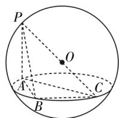
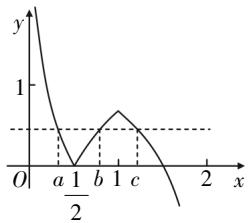

# 关于均值不等式拼凑简化方法的举例探究与思考

冯雯霞 江苏省吴江中学 215200

[摘 要] 均值不等式可用于最值问题中,具体求解时可采用合理的方法进行拼凑简化,构建满足均值不等式使用的形式. 常见的均值不等式拼凑简化方法有“定积”和“定和”、常数代换、代入消元、换元构造以及连续均值. 文章利用实例解析构建思路,结合教学实践提出相应建议.

[关键词] 均值不等式; 方法; 拼凑; 连续

均值不等式广泛应用于最值问题中,可利用其性质特征直接求解得到答案. 具体使用时需要关注问题条件,合理配凑简化方法. 均值不等式的配凑方法较多,下面结合实例具体讲解.

# 配凑简化方法的探究

方法1 “拼凑定和”与“拼凑定积”.

“拼凑定和”与“拼凑定积”，即通过拼凑补形的方法来构建均值不等式，有如下两个模型。“拼凑定和”模型: $mx + \frac{n}{x} \geqslant 2\sqrt{mn} (m > 0, n > 0)$ , 当且仅当 $x=\sqrt{\frac{n}{m}}$ 时等号成立；“拼凑定积”模型: $x(n-mx)=\frac{mx(n-mx)}{m}\leqslant\frac{1}{m}$

$$
\left(\frac {m x + n - m x}{2}\right) ^ {2} = \frac {n ^ {2}}{4 m} (m > 0, n > 0, 0 <   x <
$$

$\left.\frac{n}{m}\right)$ ，当且仅当 $x=\frac{n}{2m}$ 时等号成立.

例1 根据不同的程序,3D打印既能打印实心的几何体模型,也能打印空心的几何体模型. 如图1所示的空心模型是体积为 $\frac{17\sqrt{17}}{6}\pi cm^{3}$ 的球挖去一个三棱锥P-ABC后得到的几何体,其中 $PA\perp AB,BC\perp$ 平面PAB, BC=1 cm. 不考虑打印损耗,求当用料最省时,AC的长.

  
图1

分析 本题为立体几何中的最值问题. 用料最省, 即三棱锥 $P - ABC$ 的体积最大. 由垂直关系可确定 $PC$ 为球的直径, 由球的体积可得 $PC = \sqrt{17} (\mathrm{cm})$ . 设 $AC = x(\mathrm{cm})$ , 用其表示出三棱锥的体积, 后续通过“拼凑定和”模型求解本题.

解析 设球的半径为 $R(\mathrm{cm})$ ，由球的体积公式解得 $R=\frac{\sqrt{17}}{2}(\mathrm{cm})$ 。因为$BC \perp$ 平面PAB, 所以 $BC \perp PB, BC \perp AB, BC \perp PA$ . 因为 $PA \perp AB, AB \cap BC = B, AB, BC \subset$ 平面ABC, 所以 $PA \perp$ 平面ABC. 又 $AC \subset$ 平面ABC, 所以 $PA \perp AC$ . 所以, PC的中点O是球心, 可得 $PC = \sqrt{17} (\text{cm})$ .

设 $AC = x\mathrm{cm}(1 < x < \sqrt{17})$ ，由 $BC\perp AB$ 可知， $AC$ 为截面圆的直径．在Rt△PAC中， $PA = \sqrt{17 - x^2} (\mathrm{cm})$ ；在Rt△ABC中， $AB = \sqrt{x^2 - 1} (\mathrm{cm})$ .所以， $V_{P - ABC} = \frac{1}{3}\cdot S_{\triangle ABC}\cdot PA = \frac{1}{3}\cdot \frac{1}{2}\cdot \sqrt{x^2 - 1}$

$$
1 \cdot \sqrt {1 7 - x ^ {2}} = \frac {1}{6} \cdot \sqrt {(x ^ {2} - 1) (1 7 - x ^ {2})} (\mathrm{cm} ^ {3}).
$$

对于该式的最值,可采用“拼凑定和”模型求解,即 $\frac{1}{6}\sqrt{(x^{2}-1)(17-x^{2})}\leqslant$

$\frac{1}{6}\cdot\sqrt{\left(\frac{x^{2}-1+17-x^{2}}{2}\right)^{2}}=\frac{4}{3}$ ，当且仅当 $x^{2}-1=17-x^{2}$ ，即x=3时等号成立。所以，当用料最省时，AC=3 cm.

归纳总结 上述求解立体几何中的线段最值问题时,采用的是均值不等式的“拼凑定和”模型.使用“拼凑定和”模型与“拼凑定积”模型求最值,需要先观察积与和哪个是定值,然后根据“和定积动,积定和动”来完成.不满足模型的可以拼凑补形.对于与函数有关的题型,还可以用到配系数法、正负变法、添项法、拆项法等.

# 方法2 常数代换.

常数代换,即求解代数式最值问题时,可以通过代换其中的常数来构建均值不等式获得答案.具体模型如下:已知 $\frac{a}{x}+\frac{b}{y}=c(a,b,c>0)$ ,求解 $mx+ny(m,n>0)$ 的最小值时,先利用 $\frac{a}{cx}+\frac{b}{cy}=1$ 进行常数代换,得到 $mx+ny=\left(\frac{a}{cx}+\frac{b}{cy}\right)\cdot(mx+ny)$ ,再利用基本不等式获得答案(要关注其中等号成立的条件).

例2 点 $M(x,y)$ 在曲线 $C:x^{2}-4x+y^{2}-21=0$ 上运动, $t=x^{2}+y^{2}+12x-12y-150-a$ , 且t的最大值为b. 若 $a,b\in R^{+}$ , 则 $\frac{1}{a+1}+\frac{1}{b}$ 的最小值为\_\_\_\_.

分析 本题为圆锥曲线中的代数式最值问题. 通过分析可知, 曲线 C 是圆心为 $(2,0)$ , 半径为 5 的圆; 令 $d=\sqrt{(x+6)^{2}+(y-6)^{2}}$ , 则 $t=d^{2}-222-a;d$ 的最大值为半径与圆心到点 $(-6,6)$ 的距离之和, 利用两点间的距离公式求得 $d_{max}$ ; 后续整理转化代数式, 利用常数代换法求最小值.

解析 曲线C可整理为 $(x-2)^{2}+y^{2}=25$ ，则曲线C是圆心为(2,0)，半径为5的圆。 $t=x^{2}+y^{2}+12x-12y-150-a=(x+6)^{2}+(y-6)^{2}-222-a$ ，令 $d=\sqrt{(x+6)^{2}+(y-6)^{2}}$ ，d表示圆C上的点到(-6,6)的距离，则 $d_{\max}=15$ ，所以 $t_{\max}=15^{2}-222-a=b$ ，整理得 $a+1+b=4$ 。所以 $\frac{1}{a+1}+\frac{1}{b}=\frac{1}{4}\left(\frac{1}{a+1}+\frac{1}{b}\right)(a+1+b)=\frac{1}{4}\left(1+\frac{b}{a+1}+\frac{a+1}{b}+1\right)$ 。

又 $\frac{b}{a + 1} +\frac{a + 1}{b}\geqslant 2\sqrt{\frac{b}{a + 1}\cdot\frac{a + 1}{b}} = 2$ （当且仅当 $\frac{b}{a + 1} = \frac{a + 1}{b}$ 即 $a = 1,b = 2$ 时取等号），所以 $\frac{1}{a + 1} +\frac{1}{b}\geqslant \frac{1}{4}\times 4 = 1$ ，即 $\frac{1}{a + 1}+$ $\frac{1}{b}$ 的最小值为1.

归纳总结 本题为圆锥曲线中与特征参数相关的最值问题,解题关键是掌握圆上的点到定点距离的最值求解方法,推导a,b之间的关系,利用常数代换配凑出符合均值不等式的形式.

利用常数代换拼凑出符合均值不等式的形式,关键是找到有常数的式子(最好是结果为1的式子). 解题时需要注意两个方面:①注意目标代数式的结构特征,确认是否需要整体乘“1”;②注意常数的获得方法,可根据已知代数式的结构特征灵活处理.

# 方法3 代入消元.

代入消元,即求解多元不等式、多元函数最值问题时,先用一个参数来表示其他参数,减少变量的个数,再用均值不等式获得答案. 解题时要注意“一正、二定、三相等”这三个核心条件.

例3 已知实数 $m, n$ 满足 $\frac{1}{2} n = \sqrt{2m - m^2}$ , 则 $2m + \sqrt{3} n - 2$ 的最大值为 \_\_\_\_.

分析 本题求的是代数式的最大值,为二元问题,含有两个变量m和n.可采用代入消元的方法求解:将 $n=2\sqrt{2m-m^{2}}$ 代入 $2m+\sqrt{3}n-2$ 中,可得 $2m+\sqrt{3}n-2=2m-2+2\sqrt{3}\cdot\sqrt{2m-m^{2}}$ ,构建出符合均值不等式的形式获得答案.

解析 由 $\frac{1}{2} n = \sqrt{2m - m^2}$ 可得 $n = 2\sqrt{2m - m^2}$ , 因为 $2m - m^2 \geqslant 0$ , 所以 $0 \leqslant m \leqslant 2$ . $2m + \sqrt{3} n - 2 = 2m - 2 + 2\sqrt{3} \cdot \sqrt{2m - m^2} = 2m - 2 + 2\sqrt{6m - 3m^2} =$

$2m-2+2\sqrt{m(6-3m)}\leqslant2m-2+$ $2\sqrt{\left(\frac{m+(6-3m)}{2}\right)^{2}}=2m-2+m+(6-3m)=$ 4, 当且仅当 m=6-3m，即 $m=\frac{3}{2}$ 时取等号．所以 $2m+\sqrt{3}n-2$ 的最大值为 4.

归纳总结 上述求解代数式的最大值时,采用的是代入消元法. 代入消元的方式有多种,常用的有:①把其中一个变量用其他变量表示后代入消元;②对齐次式构造比值消元.

# 方法4 换元构造.

换元构造对圆锥曲线中的无理数问题有着广泛应用,具体求解时可先整理代数式,关注其结构特征,提取相关变量,再进行变量代换,构造符合均值不等式的形式获得答案.具体求解时还可结合圆锥曲线的相关知识构建函数,结合函数图象辅助分析.

例4 已知函数

$$
f (x) = \left\{ \begin{array}{l} | \ln 2 x |, 0 <   x <   1, \\ \ln (2 - x) + \ln 2, 1 \leqslant x <   2. \end{array} \right.
$$

若存在0<a<b<c<2使得 $f(a)=f(b)=f(c)$ ，则 $\frac{1}{ab}+\frac{1}{bc}+\frac{1}{ca}$ 的取值范围是\_\_\_\_.

分析 整理可得 $\ln(2-x)+\ln2=\ln2(2-x)$ ，易得 $y=\ln2x$ 与 $y=\ln(2-x)+\ln2$ 的图象关于直线 x=1 对称。根据 a, b, c 的大小关系易判断 $ab=\frac{1}{4}$ , $b+c=2$ ，再将 $\frac{1}{ab}+\frac{1}{bc}+\frac{1}{ca}$ 全部代换为含 a 的式子，后续构造符合均值不等式的形式，结合对勾函数的性质求解。

解析 因为 $\ln(2-x)+\ln2=\ln2(2-x)$ ，可推知 $y=\ln2x$ 与 $y=\ln(2-x)+\ln2$ 的图象关于直线 x=1 对称，作出函数 $y=f(x)$ 的大致图象（如图2所示）.

line

| Point | x | y |
|---|---|---|
| a | 0.5 | 0 |
| 1/2 | 0.5 | 0 |
| b | 1 | 0.5 |
| c | 1 | 0.5 |
| (final point) | 2 | 0 |

图2

易知 $b+c=2$ ，由 $\left|\ln2a\right|=\left|\ln2b\right|$ ，
即 $-\ln2a=\ln2b,\ln4ab=0$ ，可得 $ab=\frac{1}{4}$ .
因为 $\frac{1}{2}<b<1$ ，所以 $\frac{1}{2}<\frac{1}{4a}<1$ ，得 $\frac{1}{4}<a<\frac{1}{2}$ . 所以， $\frac{1}{ab}+\frac{1}{bc}+\frac{1}{ca}=\frac{a+b+c}{abc}=$ $\frac{a+2}{c}/4=\frac{4(a+2)}{2-\frac{1}{4a}}=\frac{16a(a+2)}{8a-1}.$

设 $t=8a-1,\quad t\in(1,3)$ ，则将上述代数式变换为 $\frac{1}{ab}+\frac{1}{bc}+\frac{1}{ca}=\frac{1}{4}\left(t+\frac{17}{t}+18\right)$ . 又 $t+\frac{17}{t}\geqslant2\sqrt{17}$ ，当且仅当 $t=\sqrt{17}$ 时取到等号，但 $t\in(1,3)$ ，无法取到等号．令 $h(t)=t+\frac{17}{t}+18$ ，分析可知 $h(t)$ 在区间 $(1,3)$ 上单调递减．又 $h(1)=36,h(3)=\frac{80}{3}$ ，所以 $\frac{1}{4}\left(t+\frac{17}{t}+18\right)\in\left(\frac{20}{3},9\right)$ ，即 $\frac{1}{ab}+\frac{1}{bc}+\frac{1}{ca}$ 的取值范围是 $\left(\frac{20}{3},9\right)$ .

归纳总结 上述求解代数式的取值范围时,采用的是换元构造法,即通过变换主元、整体代换的方式来构造符合均值不等式的形式. 常用的换元构造法有两种形式,一是代数换元,具体求解时先对等式进行拼凑补形,再进行换元,结合函数以及导数确定单调性进而求解最值;二是三角换元,具体求解时结合三角函数知识,将已知的多个变量转化和化归为三角函数,结合三角函数求最值的方法来求解.

方法5 连续均值.

连续均值,即多次使用均值不等式进行关系推导的一种方法,常用的连续均值不等式的结论为:对于非负实数a和b,有 $\frac{2}{\frac{1}{a}+\frac{1}{b}}\leqslant\sqrt{ab}\leqslant\frac{a+b}{2}\leqslant\sqrt{\frac{a^{2}+b^{2}}{2}}$ .后续使用时可充分利用该结论进行连续构造推导.

例5 设正实数x,y满足 $x>\frac{1}{2}$ ,y>1,不等式 $\frac{4x^{2}}{y-1}+\frac{y^{2}}{2x-1}\geqslant m$ 恒成立,则m的最大值为\_\_\_\_.

分析 本题求解时可先设y-1=b，2x-1=a，求出x,y的值，将其代入 $\frac{4x^{2}}{y-1}+\frac{y^{2}}{2x-1}$ 中进行化简，然后构建连续均值获得结果.

解析 设 $y - 1 = b, 2x - 1 = a$ ，可得 $y = b + 1 (b > 0), x = \frac{1}{2} (a + 1) (a > 0)$ ，所以 $\frac{4x^2}{y - 1} + \frac{y^2}{2x - 1} = \frac{(a + 1)^2}{b} + \frac{(b + 1)^2}{a} \geqslant 2\frac{(a + 1)(b + 1)}{\sqrt{ab}} = 2\frac{ab + (a + b) + 1}{\sqrt{ab}}$ 。再次利用均值不等式可得 $2\frac{ab + (a + b) + 1}{\sqrt{ab}} = 2\left(\sqrt{ab} + \frac{1}{\sqrt{ab}} + \frac{a + b}{\sqrt{ab}}\right) \geqslant 2 \cdot \left(2\sqrt{\sqrt{ab} \cdot \frac{1}{\sqrt{ab}}} + \frac{2\sqrt{ab}}{\sqrt{ab}}\right) = 8$ ，当且仅当 $a = b = 1$ ，即 $x = 2, y = 1$ 时取等号。所以， $\frac{4x^2}{y - 1} + \frac{y^2}{2x - 1}$ 的最小值是 $8, m$ 的最大值是 $8$ 。

归纳总结 上述问题主要考查均值不等式的性质,解题的关键是设y-1=b,2x-1=a,推导出 $y=b+1(b>0)$ , $x=\frac{1}{2}(a+1)(a>0)$ ,然后变元代换.在推导不等关系求最值时,采用的是连续均值法,两次使用均值不等式的性质求解.连续使用均值不等式时要注意两点:一是不等号的方向,即其方向要统一;二是连续不等式成立的条件,且取等号要有合理性.

# 解法教学探讨

上述深入探究均值不等式的使用方法,结合实例具体分析,并归纳总结方法策略. 在实际教学中,要立足不等式的性质,开展均值不等式的推理证明,引导学生理解其使用条件;归纳总结拼凑简化方法,帮助学生构建解题思路;开展应用探究,提升学生的解题能力.

# 1. 立足不等式的性质,开展均值不等式的推理证明

均值不等式对求解最值问题有重要作用,不等式的性质是建立均值不等式的基础,因此开展均值不等式的论证推导要从不等式的性质入手. 教学时要引导学生深刻理解均值不等式使用条件的含义:“一正”,指的是各项必须为正数;“二定”,指的是积为定值和有最小值,和为定值积有最大值;“三相等”,指的是用均值不等式求最值时,需要讨论等号成立的条件.

# 2. 归纳总结拼凑简化技巧,帮助学生构建解题思路

上文归纳总结了均值不等式拼凑简化五种方法,分别为“定积”和“定和”、常数代换、代入消元、换元构造以及连续均值,需要从以下三个方面探究学习:一是挖掘方法内容,总结相应模型;二是结合实例具体分析,开展过程探究;三是归纳方法技巧,总结解题注意点,形成相应的解题思路.教学中要把握方法内涵,挖掘思想方法,解题时引导学生关注问题特征,思考均值不等式拼凑简化方法,内化形成解题策略.

# 3. 开展应用探究,提升学生的解题能力

教学中要引导学生掌握方法并内化方法,充分提升学生的解题能力. 均值不等式除了可应用于参数取值、不等式恒成立等问题外,还可应用于圆锥曲线、立体几何、数列特征方程、平面向量等问题(其应用不局限于常规的最值问题). 探究教学时要注意以下三点,一是精选问题,问题要有代表性,难度适中,不宜过偏过难;二是解题时的思维引导,要给予学生充足的时间供学生充分思考;三是解后反思,要及时总结方法经验.