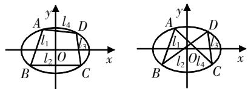
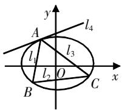
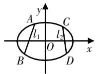
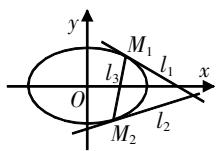

# 运用二次曲线系方程巧解高考解析几何试题

周跃佳 云南省昆明市第三中学 650500

[摘 要] 文章运用二次曲线系方程巧解高考解析几何试题,展示基本方法,优化运算过程,帮助考生积累解题经验.

[关键词] 二次曲线系方程;解析几何;高考试题

高考中的解析几何解答题一般为直线与二次曲线(椭圆、双曲线或抛物线)的位置关系问题,考生解决这类问题的常规方法是联立直线与曲线方程,利用韦达定理,使运算得到一定简化.而二次曲线系方程,为解决一类解析几何问题提供了新的思路,相比“直曲联立”法,“二次曲线方程”法计算量小,有利于提高解题效率.本文以2022年和2023年几道高考试题为例,运用二次曲线系方程巧解解析几何试题,展示基本方法,优化运算过程,帮助考生积累解题经验.

二次曲线方程的一般形式为 $Ax^{2}+By^{2}+Cxy+Dx+Ey+F=0$ 。圆、椭圆、双曲线和抛物线是几个特殊的二次曲线，圆的方程为 $x^{2}+y^{2}+Dx+Ey+F=0$ ；椭圆的方程为 $\frac{x^{2}}{a^{2}}+\frac{y^{2}}{b^{2}}=1$ ，即 $b^{2}x^{2}+a^{2}y^{2}-a^{2}b^{2}=0$ ；双曲线的方程为 $\frac{x^{2}}{a^{2}}-\frac{y^{2}}{b^{2}}=1$ ，即 $b^{2}x^{2}-a^{2}y^{2}-a^{2}b^{2}=0$ ；抛物线的方程为 $y^{2}-2px=0$ 。均为二次曲线方程。由两条直线方程乘积形成的二次曲线被视为二次曲线的退化形式，即 $\lambda(A_{1}x+B_{1}y+C_{1})(A_{2}x+B_{2}y+C_{2})=0$ 。

命题1 已知 $l_{1}(x,y)=0$ , $l_{2}(x,y)=0$ , $l_{3}(x,y)=0$ , $l_{4}(x,y)=0$ 是四条两两不重合的直线, 且 $l_{1}$ 与 $l_{2}$ 相交(设相交于点 B), $l_{2}$ 与 $l_{3}$ 相交(设相交于点 C), $l_{3}$ 与 $l_{4}$ 相交(设相交于点 D), $l_{4}$ 与 $l_{1}$ 相交(设相交于点 A), 则过这四个交点的二次曲线的方程为 $l_{1}(x,y)l_{3}(x,y)+\lambda l_{2}(x,y)l_{4}(x,y)=0$ .

text_image

A
l4 D
l1
l2 O
B C
x
y
A
l1 D
l2 O l4 C
B C
x

图1 以椭圆为例

例1（2023年新高考全国Ⅱ卷第21题）已知双曲线C的中心为坐标原点，左焦点为 $(-2\sqrt{5},0)$ ，离心率为 $\sqrt{5}$ .

(1)求C的方程；

(2) 记 C 的左、右顶点分别为 $A_{1}$ ， $A_{2}$ ，过点 $(-4,0)$ 的直线与 C 的左支交于 M, N 两点，M 在第二象限，直线 $MA_{1}$ 与 $NA_{2}$ 交于点 P. 证明：点 P 在定直线上.

解析 (1) $\frac{x^2}{4} - \frac{y^2}{16} = 1$ .

(2) 设直线 $MN: x = my - 4$ ，即 $x - my + 4 = 0$ ；直线 $A_{1}M: x = hy - 2$ ，即 $x - hy + 2 = 0$ ；直线 $A_{2}N: x = ty + 2$ ，即 $x - ty - 2 = 0$ ；直线 $A_{1}A_{2}: y = 0$ 。设过点 $M, N, A_{1}, A_{2}$ 的二次曲线的方程为 $(x - hy + 2)(x - ty - 2) + \lambda y(x - my + 4) = 0$ ，整理得 $x^{2} + (ht - \lambda m)y^{2} + (\lambda - h - t)xy + (4\lambda + 2h - 2t)y - 4 = 0$ 。又双曲线 $C: \frac{x^{2}}{4} - \frac{y^{2}}{16} = 1$ ，即 $x^{2} - \frac{1}{4}y^{2} - 4 = 0$ 。两式系数对应相等，所以 $\left\{ \begin{array}{l} \lambda - h - t = 0, \\ 4\lambda + 2h - 2t = 0, \end{array} \right.$ 得

$\left\{ \begin{array}{l} h = -\frac{1}{2}\lambda, \\ t = \frac{3}{2}\lambda, \end{array} \right.$ 所以 $A_{1}M: x = -\frac{1}{2}\lambda y - 2, A_{2}N:$

$x = \frac{3}{2}\lambda y + 2.$ 联立 $\left\{ \begin{array}{l}x = -\frac{1}{2}\lambda y - 2,\\ x = \frac{3}{2}\lambda y + 2, \end{array} \right.$ 整理得 $x = -1$

例2（2022年高考全国甲卷第20题）设抛物线 $C:y^{2}=2px(p>0)$ 的焦点为F，点 $D(p,0)$ ，过F的直线交C于M，N两点．当直线MD垂直于x轴时， $|MF|=3$ .

(1)求C的方程;

(2)设直线MD, ND与C的另一个交点分别为A, B, 记直线MN, AB的倾斜角分别为 $\alpha, \beta$ . 当 $\alpha-\beta$ 取得最大值时, 求直线AB的方程.

解析 (1) $y^{2}=4x.$

(2)设直线MN:x=my+1,即x-my-1=0;直线MD:x=m\_{1}y+2,即x-m\_{1}y-2=0;直线ND:x=m\_{2}y+2,即x-m\_{2}y-2=0;直线AB:y=kx+b,即kx-y+b=0.

设过点M,N,A,B的二次曲线的方程为 $(x-m_{1}y-2)(x-m_{2}y-2)+\lambda(x-my-1)(kx-y+b)=0$ ，整理得 $(\lambda k+1)x^{2}+(\lambda m+m_{1}m_{2})y^{2}-(\lambda km+\lambda+m_{1}m_{2})xy+(\lambda b-\lambda k-4)x+(2m_{1}+2m_{2}+\lambda-\lambda mb)y+4-\lambda b=0$ 。又抛物线C: $y^{2}=4x$ ，两式系数对应相等,所以 $\left\{\begin{aligned}1+\lambda k&=0,\\ \lambda km+\lambda+m_{1}+m_{2}&=0,\\ 2m_{1}+2m_{2}+\lambda-\lambda mb&=0,\\ 4-\lambda b&=0,\end{aligned}\right.$ 解得 $km=\frac{1}{2},b=-4k.$ 所以, $\tan\alpha=\frac{1}{m},$ $\tan\beta=k=\frac{1}{2m}.$ 当 m>0 时， $\alpha-\beta$ 取得最大值，即 $\tan(\alpha-\beta)$ 取得最大值， $\tan(\alpha-\beta)=$

$$
\frac {\tan \alpha - \tan \beta}{1 + \tan \alpha \tan \beta} = \frac {\frac {1}{m} - \frac {1}{2 m}}{1 + \frac {1}{m} \cdot \frac {1}{2 m}} = \frac {1}{2 m + \frac {1}{m}} \leqslant
$$

$\frac{\sqrt{2}}{4}$ ，当且仅当 $m=\frac{\sqrt{2}}{2}$ 时取等号.
此时 $k=\frac{1}{2m}=\frac{\sqrt{2}}{2}$ , $b=-4k=-2\sqrt{2}$ .所以直线AB: $y=\frac{\sqrt{2}}{2}x-2\sqrt{2}$ .

命题2 已知 $l_{1}(x,y)=0,l_{2}(x,y)=0,l_{3}(x,y)=0$ 是三条两两不重合的直线，且 $l_{1}$ 与 $l_{2}$ 相交(设相交于点B)， $l_{2}$ 与 $l_{3}$ 相交(设相交于点C)， $l_{3}$ 与 $l_{1}$ 相交(设相交于点A)，则过这三个交点的二

  
图2 以椭圆为例

次曲线的方程为 $l_{1}(x,y)l_{3}(x,y)+\lambda l_{2}(x,y)l_{4}(x,y)=0$ ，其中 $l_{4}$ 为过点A的二次曲线的切线.

例3（2023年高考全国乙卷第20题）已知椭圆 $C:\frac{y^{2}}{a^{2}}+\frac{x^{2}}{b^{2}}=1(a>b>0)$ 的离心率是 $\frac{\sqrt{5}}{3}$ ，点 $A(-2,0)$ 在C上.

(1)求C的方程;

(2) 过点 $(-2,3)$ 的直线交 C 于 P, Q 两点, 直线 AP, AQ 与 y 轴的交点分别为 M, N, 证明: 线段 MN 的中点为定点.

解析 (1) $\frac{y^{2}}{9}+\frac{x^{2}}{4}=1.$

(2)设直线 $PQ:y=k(x+2)+3,AP:y=k_{1}(x+2),AQ:y=k_{2}(x+2)$ ，过点A的曲线的切线为x=-2。设过点A,P,Q的二次曲线的方程为 $\left[y-k_{1}(x+2)\right]\left[y-k_{2}(x+2)\right]+\lambda(x+2)\left[y-k(x+2)-3\right]=0$ ，整理得 $(k_{1}k_{2}-\lambda k)x^{2}+y^{2}+(\lambda-k_{1}-k_{2})xy+(4k_{1}k_{2}-4\lambda k-3\lambda)x+(2\lambda-2k_{1}-2k_{2})y+4k_{1}k_{2}-4\lambda k-6\lambda=0$ 。又椭圆 $C:\frac{y^{2}}{9}+\frac{x^{2}}{4}=1$ ，即 $\frac{9}{4}x^{2}+y^{2}-9=0$ ，两式系数对应相等，

所示 $\left\{ \begin{array}{ll}k_{1}k_{2} - \lambda k = \frac{9}{4},\\ \lambda -k_{1} - k_{2} = 0,\\ 4k_{1}k_{2} - 4\lambda k - 3\lambda = 0, \end{array} \right.$ 解得 $k_{1} + k_{2} = 3$ 又 $M(0,2k_{1}),N(0,2k_{2})$ ，所以MN的中点为定点 $(0,3)$ .

例4（2022年新高考全国Ⅰ卷第21题）已知点A(2,1)在双曲线 $C:\frac{x^{2}}{a^{2}}-\frac{y^{2}}{a^{2}-1}=1(a>1)$ 上，直线l交C于P,Q两点，直线AP,AQ的斜率之和为0.

(1)求l的斜率;

(2)若 $\tan\angle PAQ=2\sqrt{2}$ ，求 $\triangle PAQ$ 的面积.

解析 (1) 求得双曲线 $C: \frac{x^2}{2} - y^2 = 1$ , 设直线 $AP: y - 1 = k(x - 2)$ , 即 $kx - y - 2k + 1 = 0$ ; 直线 $AQ: y - 1 = -k(x - 2)$ , 即 $-kx - y + 2k + 1 = 0$ ; 直线 $PQ: y = tx + m$ , 即 $tx - y + m = 0$ ; 过点 $A$ 的双曲线的切线方程为 $\frac{2x}{2}-1\cdot y=1$ ，即x-y-1=0.

设过点A,P,Q的二次曲线的方程为 $(kx-y-2k+1)\cdot(-kx-y+2k+1)+\lambda(tx-y+m)(x-y-1)=0$ ，整理得 $(-k^{2}+\lambda t)x^{2}+(\lambda+1)y^{2}-\lambda(t+1)xy+(4k^{2}-\lambda t+\lambda m)x+(\lambda-\lambda m-2)y+1-4k^{2}-\lambda m=0$ 。又双曲线 $C:\frac{x^{2}}{2}-y^{2}=1$ ，两式系数对应相

等,所以 $\left\{\begin{aligned}-k^{2}+\lambda t &= \frac{1}{2}, \\-\lambda(t+1)=0, \\4k^{2}-\lambda t+\lambda m=0,\end{aligned}\right.$ 解得 t=-1. 所以直线l的斜率为-1.

(2)不妨设k>0, 设直线AP的倾斜角为 $\alpha$ , 则 $\tan\angle PAQ=\tan(\pi-2\alpha)=-\tan2\alpha$ . 又 $\tan\angle PAQ=2\sqrt{2}$ , 故 $\tan2\alpha=-2\sqrt{2}$ , 即 $\frac{2\tan\alpha}{1-\tan^{2}\alpha}=-2\sqrt{2}$ , 得 $\tan\alpha=\sqrt{2}$ 或 $\tan\alpha=-\frac{\sqrt{2}}{2}$ (舍), 所以 $k=\sqrt{2}$ . 将其代入(1)问中的方程组, 可得 $m=\frac{5}{3}$ , 直线 $l:y=-x+\frac{5}{3}$ , 求得弦长 $|PQ|=\frac{16}{3}$ , 点A到直线l的距离 $d=\frac{2\sqrt{2}}{3}$ , $\triangle APQ$ 的面积为 $S=\frac{1}{2}|PQ|d=\frac{16\sqrt{2}}{9}$ .

命题3 过两条直线 $l_{1}, l_{2}$ 与一条二次曲线 $f(x, y)=0$ 的四个交点的二次曲线的方程为 $l_{1}(x, y)l_{2}(x, y)+\lambda f(x, y)=0$ .

  
图3 以椭圆为例

推论 过两条直线 $l_{1}, l_{2}$ 与一条曲线 $f(x, y)=0$ 的两个交点的曲线的方程为 $l_{1}(x, y)l_{2}(x, y)+\lambda f(x, y)=0$ .

例5（2022年新高考全国Ⅱ卷第21题）已知双曲线 $C:\frac{x^{2}}{a^{2}}-\frac{y^{2}}{b^{2}}=1(a>0,b>0)$ 的右焦点为 $F(2,0)$ ，渐近线方程为 $y=\pm\sqrt{3}x$ .

(1)求C的方程;

(2) 过 $F$ 的直线与 $C$ 的两条渐近线分别交于 $A, B$ 两点，点 $P(x_{1}, y_{1})$ ， $Q(x_{2}, y_{2})$ 在 $C$ 上，且 $x_{1} > x_{2} > 0, y_{1} > 0$ . 过 $P$ 且斜率为 $-\sqrt{3}$ 的直线与过 $Q$ 且斜率为 $\sqrt{3}$ 的直线交于点 $M$ . 从下面①②③中选取两个作为条件，证明另外一个成立.

①M在AB上；② $PQ \parallel AB$ ；③ $|MA| = |MB|$ .

解析 (1) $x^{2}-\frac{y^{2}}{3}=1.$

(2)选择①③,证明②.

设线段AB的中点 $M(x_{0},y_{0})$ ，直线 $PM:y-y_{0}=-\sqrt{3}(x-x_{0})$ ，即 $\sqrt{3}x+y-y_{0}-\sqrt{3}x_{0}=0$ ；直线 $QM:y-y_{0}=\sqrt{3}(x-x_{0})$ ，即 $\sqrt{3}x-y+y_{0}-\sqrt{3}x_{0}=0$ 。设过点P,Q的曲线的方程为 $(\sqrt{3}x+y-y_{0}-$

$$
\begin{array}{l} \sqrt {3} x _ {0}) (\sqrt {3} x - y + y _ {0} - \sqrt {3} x _ {0}) + \lambda \left(x ^ {2} - \right. \\ \frac {y ^ {2}}{3} - 1) = 0. \end{array}
$$

当 $\lambda = -3$ 时，得 $PQ: -6x_0x + 2y_0y + 3x_0^2 - y_0^2 + 3 = 0, k_{PQ} = \frac{3x_0}{y_0}$ . 设 $A(x_1, y_1)$ ，

$B(x_{2},y_{2})$ ，则 $\left\{ \begin{array}{ll}x_1^2 -\frac{y_1^2}{3} = 0,\\ x_2^2 -\frac{y_2^2}{3} = 0, \end{array} \right.$ 两式相减，得

$x_{1}^{2} - x_{2}^{2} = \frac{y_{1}^{2}}{3} -\frac{y_{2}^{2}}{3}$ ，也就是 $(x_{1} + x_{2})(x_{1} - x_{2}) =$ $\frac{(y_1 + y_2)(y_1 - y_2)}{3}$ 所以 $k_{AB} = \frac{y_1 - y_2}{x_1 - x_2} = \frac{3(x_1 + x_2)}{y_1 + y_2} =$ $\frac{3x_0}{y_0}$ 所以 $PQ / / AB.$

命题4 直线 $M_{1}M_{2}$ 与二次曲线相交于 $M_{1},M_{2}$ 两点，过 $M_{1},M_{2}$ 分别作二次曲线的切线 $l_{1}(x,y)$ 和 $l_{2}(x,y)$ ，则二次曲线的方程为 $l_{1}(x,y)l_{2}(x,y)+\lambda l_{3}^{2}(x,y)=0$ ，其中 $l_{3}(x,y)$ 为直线 $M_{1}M_{2}$ 的方程.

  
图4 以椭圆为例

# 总结

二次曲线系方程是有共同特征的曲线方程的集合,命题背景是通过参数调整来确定二次曲线方程. 解决此类问题的通常方法是:先写出过某些点或交点的二次曲线系方程,然后对比已知的具有同样性质的二次曲线方程(包括退化的二次曲线),得到系数之间的关系后求解.

# (上接第90页)

证明 设过T的直线为 $x=my+t$ ，与 $y^{2}=2px$ 联立，得 $y^{2}-2pmy-2pt=0$ 。设 $A(x_{1},y_{1}),B(x_{2},y_{2})$ ，则 $y_{1}+y_{2}=2pm,y_{1}y_{2}=-2pt$ 。将直线OA: $y=\frac{y_{1}}{x_{1}}x$ 与x=-t联立，得 $M(-t,y_{2})$ ，同理 $N(-t,y_{1})$ 。又 $T(t,0)(t>0)$ ，则

(1) $k_{MT} \cdot k_{NT} = \frac{y_2}{2t} \cdot \frac{y_1}{2t} = \frac{y_1 y_2}{4t^2} = \frac{-2pt}{4t^2} = -\frac{p}{2t}$ ;

(2) $\overrightarrow{MT} \cdot \overrightarrow{NT} = (2t, -y_2) \cdot (2t, y_1) = 4t^2 + y_1y_2 = 4t^2 - 2pt$ ;

(3)以MN为直径的圆的方程为 $(x+t)(x+t)+(y-y_{1})(y-y_{2})=0$ ，令y=0，则 $(x+t)(x+t)=-y_{1}y_{2}=2pt$ ，所以 $x+t=\pm\sqrt{2pt}$ ， $x=-t\pm\sqrt{2pt}$ ．所以，以MN为直径的圆过定点 $(-t\pm\sqrt{2pt},0)$ .

推论3 已知抛物线 $y^{2}=2px(p>0)$ 的顶点为O，过焦点 $F\left(\frac{p}{2},0\right)$ 且斜率不为0的直线交抛物线于A，B两点，连接OA，OB并分别延长交直线 $x=-\frac{p}{2}$ 于M，N两点，连接MT，NT，其斜率分别为 $k_{MT},k_{NT}$ ，则

(1) $k_{MF} \cdot k_{NF} = -1$ ;

(2) $\overrightarrow{MT} \cdot \overrightarrow{NT} = 0;$

(3)以MN为直径的圆过焦点 $\left(\frac{p}{2},0\right)$ .

# 结束语

数学关键能力包括逻辑思维能力、运算求解能力、空间想象能力、数学建模能力和创新能力[1]。高考试题命制以素养为导向，以考查、培养学生的关键能力为目标。由本文研究过程可知，例题参数一般化有三个不同角度的结论，而不同结论在相同条件下特殊化可回到相同背景上来，这体现了圆锥曲线结论的美妙；椭圆的结论体系类比到双曲线、抛物线中，这个过程展现出圆锥曲线结论体系的独特魅力。掌握这种思考研究方法，有助于学生求解题目、发现奥秘、热爱数学，也有助于教师命制圆锥曲线试题。就解析几何教学而言，教师不能仅仅简单地表述解答分析和解答过程，更应该在深层次上重视知识的背景与关联、特殊与一般、类比与推广、来源与发展，这样才能有效培养学生更高的学科素养和关键能力，才能结合考题做到立德树人、服务选材、引导教学，实现高考的核心功能[2]。

# 参考文献：

[1] 中华人民共和国教育部. 普通高中数学课程标准(2017年版2020年修订)[S]. 北京: 人民教育出版社, 2020.

[2] 教育部考试中心. 中国高考评价体系[S]. 北京: 人民教育出版社, 2019.