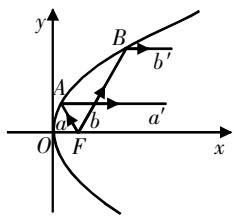
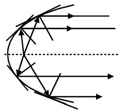
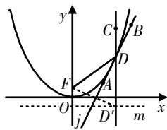
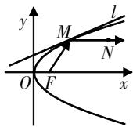
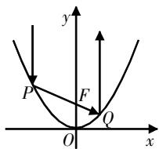
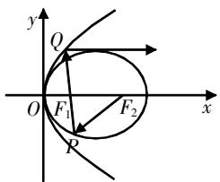

# 光学性质剖析,实例探究思考

# ——以抛物线的光学性质为例

陆琪 江苏省吴江中学 215200

[摘 要] 众多圆锥曲线含有光学性质,探究特性、总结规律、生成结论,有助于分析推理圆锥曲线问题. 文章以抛物线为例,探究总结其光学性质并证明归纳,结合实例应用探究,提出教学建议.

[关键词] 圆锥曲线;光学性质;抛物线;平行;等角

众多圆锥曲线含有光学性质,常见的有抛物线、双曲线、椭圆和圆,其光学性质可广泛应用于问题条件的推导,可降低思维难度.下面以抛物线的光学性质为例,分三个环节进行探究:环节1,引例探究,挖掘特性;环节2,特性探究,证明分析;环节3,应用探究,实例剖析.

# 引例探究

以抛物线为例,其具有以下光学性质:从焦点发出的光线经抛物线反射后平行于抛物线的对称轴.该特性在实际生产中的应用非常广泛.

问题 如图1所示,从抛物线 $y^{2}=2px(p>0)$ 的焦点F发出的两条光线a,b分别经抛物线上的A,B两点反射,已知两条入射光线a,b与x轴的夹角均为 $60^{\circ}$ ,且两条反射光线 $a'$ 和 $b'$ 之间的距离为 $\frac{4\sqrt{3}}{3}$ ,则p的值为\_\_\_\_.

text_image

y
B
b'
A
a
b
a'
O
F
x

图1

解析 抛物线 $y^{2}=2px(p>0)$ 的焦点 $F\left(\frac{p}{2},0\right)$ . 由于 $\angle OFA=60^{\circ}$ ，所以直线AF的方程为 $y-0=-\sqrt{3}\left(x-\frac{p}{2}\right)$ ，即 $y=-\sqrt{3}\left(x-\frac{p}{2}\right)$ . 联立直线AF与抛物线的方程，有 $\left\{\begin{aligned}y&=-\sqrt{3}\left(x-\frac{p}{2}\right),\\ y^{2}&=2px,\end{aligned}\right.$ 整理得 $3\left(x-\frac{p}{2}\right)^{2}=2px$ ，解得 $x=\frac{p}{6}$ 或 $x=\frac{3p}{2}$ ，可得 $A\left(\frac{p}{6},\frac{\sqrt{3}p}{3}\right)$ .

同理直线BF的方程为 $y-0=\sqrt{3}\cdot\left(x-\frac{p}{2}\right)$ ，即 $y=\sqrt{3}\left(x-\frac{p}{2}\right)$ 。联立直线BF与抛物线的方程，有 $\left\{\begin{aligned}y&=\sqrt{3}\left(x-\frac{p}{2}\right),\\ y^{2}&=2px,\end{aligned}\right.$ 可得 $B\left(\frac{3p}{2},\sqrt{3}p\right)$ 。

所以 $\left|y_{B}-y_{A}\right|=\frac{2\sqrt{3}}{3}p=\frac{4\sqrt{3}}{3}$ ,
解得p=2.

评析 上述问题的图象涉及抛物线的光学性质,解析时可采用联立方程求点的方法,确定关键点的坐标,进而推导出特征参数p的值.

# 光学性质探究

上述引例围绕抛物线的光学性质构建,下面具体探究其光学性质,并从几何、代数两大视角出发加以证明.

# 1. 光学性质的描述

光学性质:从抛物线的焦点发出的光线,经过抛物线上一点反射后,反射光线与抛物线的对称轴平行,如图2所示.反之,平行于抛物线的对称轴的光线照射到抛物线上,经反射后都通过抛物线的焦点.

natural_image

Pure optical ray diagram showing light paths through a curved mirror (no text or symbols)

图2

# 2. 光学性质的证明

(1)几何证明(以y轴为对称轴的抛物线为例)

根据抛物线的光学性质可知,其中涉及光线的反射知识,显然入射角等于反射角,存在几何等角关系.

已知:如图3所示,抛物线 $C:x^{2}=2py(p>0)$ ,焦点 $F\left(0,\frac{p}{2}\right)$ ,j是过抛物

线上一点 $D(x_{0},y_{0})$ 的切线,A,B是直线j上的两点(不同于点D),直线DC平行于y轴.求证: $\angle FDA=\angle CDB$ (入射角等于反射角).

text_image

y
C
B
D
F
A
O
j
D'
m
x

图3

证明 作抛物线的准线 $m:y=-\frac{p}{2}$ ，延长CD交m于点 $D'\left(x_{0},-\frac{p}{2}\right)$ ，则 $|DF|=|DD'|$ 。由于 $C:x^{2}=2py(p>0)$ ，可得C： $y=\frac{x^{2}}{2p}$ 。下面讨论 $x_{0}$ 取值下的情况：

①当 $x_{0}\neq0$ 时,直线j的斜率 $k_{j}=\frac{x_{0}}{p}$ ,

直线 $FD'$ 的斜率 $k_{FD'} = \frac{-\frac{p}{2} - \frac{p}{2}}{x_0} = -\frac{p}{x_0}$ , 两条直线的斜率之积为-1, 所以直线j垂直平分线段 $FD'$ , 则 $\angle FDA = \angle D'DA = \angle CDB$ .

②当 $x_{0}=0$ 时,点 $D(0,0)$ ,此时直线j为x轴,结论显然成立.

综上所述,结论成立.

(2)代数证明(以x轴为对称轴的抛物线为例)

根据抛物线的光学性质可知,从抛物线的焦点发出的光线照射到抛物线上,经反射后的光线平行于x轴,即斜率为0.

已知:如图4所示,抛物线 $C:y^{2}=2px(p>0)$ ,F是抛物线的焦点,从抛物线的焦点发出的光线照射到抛物线上的点M处.求证:经反射后的光线平行于x轴.

  
图4

证明 设 $M\left(\frac{y_0^2}{2p}, y_0\right)$ , 过点 $M$ 的抛物线的切线为 $l: x = t(y - y_0) + \frac{y_0^2}{2p}$ , 入射光线

$FM$ 的反射光线为 $MN$ . 由 $\left\{ \begin{array}{l} y^{2} = 2px, \\ x = t(y - y_{0}) + \frac{y_{0}^{2}}{2p} \end{array} \right.$ 得 $y^{2} - 2pty + 2pty_{0} - y_{0}^{2} = 0$ ，故 $\Delta = 4p^{2}t^{2} - 8pty_{0} + 4y_{0}^{2} = 0$ ，得 $t = \frac{y_{0}}{p}$ ，所以切线 $l$ 的斜率 $k = \frac{p}{y_{0}}$ .

设直线l与直线FM的夹角为 $\alpha$ ，直线MN与直线l的夹角为 $\beta$ ，则由 $\tan\alpha=\tan\beta$ 可得 $\frac{k_{FM}-k}{1+k_{FM}\cdot k}=\frac{k-k_{MN}}{1+k\cdot k_{MN}}$ ，所以

$\frac{\frac{y_0}{x_0 - \frac{p}{2}} - \frac{p}{y_0}}{1 + \frac{y_0}{x_0 - \frac{p}{2}} \cdot \frac{p}{y_0}} = \frac{\frac{p}{y_0} - k_{MN}}{1 + \frac{p}{y_0} \cdot k_{MN}}$ ，解得 $k_{MN} =$

0, 即经反射后的光线平行于 x 轴.

# 综合应用

抛物线的光学性质是高中数学的特殊内容,在实际考查时有多种形式,常从知识综合角度命题,下面结合实例探究其综合应用.

# 1. 给定平行距离, 探求方程

例1 光学是当今科技的前沿和最活跃的领域之一,抛物线有如下光学性质:由其焦点射出的光线经抛物线反射后,沿平行于抛物线对称轴的方向射出. 今有抛物线 $C:x^{2}=2py(p>0)$ ,一平行于y轴的光线从上方射向抛物线上的点P处,经抛物线两次反射后,又沿平行于y轴方向射出. 已知两平行光线间的最小距离为8.

(1)求抛物线C的方程;

(2)若直线 $l:y=x+m$ 与抛物线C相交于A,B两点,以点A为顶点作 $\triangle ABN$ ,使 $\triangle ABN$ 的外接圆圆心T的坐标为 $\left(3,\frac{49}{8}\right)$ ,求弦AB的长.

  
图5

思路分析 本题以抛物线的光学性质为背景,构建直线、三角形,开展综合探究. 可通过把握其光学性质,结合圆锥曲线的相关知识进行转化,构建思路.

(1)由题意设直线PQ的方程为 $y=kx+\frac{p}{2}(k\in\mathbf{R})$ ，然后联立直线PQ与抛物线C的方程并整理为二次方程，后续运用韦达定理得 $x_{1}+x_{2}=2pk,x_{1}x_{2}=-p^{2}$ 。又两平行光线间的距离 $d=\left|x_{1}-x_{2}\right|=\sqrt{4p^{2}k^{2}+4p^{2}}\geqslant2p$ ，所以2p=8，进而求得抛物线C的方程。  
(2) 设 $A(x_{3}, y_{3})$ , $B(x_{4}, y_{4})$ , A, B 两点的中点 $M(x_{0}, y_{0})$ ，联立直线 AB 与抛物线 C 的方程，把握其中的垂直关系 $(MT \perp AB)$ ，将其转化为斜率之积等于 -1 的条件，从而构建方程，利用弦长公式求得结果.

过程解析 (1) 设 $P(x_{1}, y_{1}), Q(x_{2}, y_{2})$ , 抛物线的焦点坐标 $F\left(0, \frac{p}{2}\right)$ . 设直线 $PQ$ 的方程为 $y = kx + \frac{p}{2} (k \in \mathbf{R})$ , 联立直线 $PQ$ 与抛物线 $C$ 的方程, 有 $\left\{ \begin{array}{l} x^{2} = 2py, \\ y = kx + \frac{p}{2}, \end{array} \right.$ 整理得 $x^{2} - 2pkx - p^{2} = 0$ . 由韦达定理得 $x_{1} + x_{2} = 2pk, x_{1}x_{2} = -p^{2}$ , 则两平行光线间的距离 $d = |x_{1} - x_{2}| = \sqrt{4p^{2}k^{2} + 4p^{2}} \geqslant 2p$ , 所以 $2p = 8$ , 得抛物线 $C$ 的方程为 $x^{2} = 8y$ .

(2) 设 $A(x_{3}, y_{3}), B(x_{4}, y_{4}), A, B$ 两点的中点 $M(x_{0}, y_{0})$ . 联立 $AB$ 与抛物线 $C$ 的方程, 有 $\left\{ \begin{array}{l} x^{2} = 8y, \\ y = x + m, \end{array} \right.$ 整理得 $x^{2} - 8x - 8m = 0$ , 则其判别式 $\Delta > 0 \Rightarrow m > -2$ . 由中点坐标公式可得 $x_{0} = \frac{x_{3} + x_{4}}{2} = 4, y_{0} = 4 + m$ . 因为

$MT \perp AB$ , 故 $k_{MT} \cdot k_{AB} = -1$ , 即 $\frac{m + 4 - \frac{49}{8}}{4 - 3} \cdot 1 = -1$ , 解得 $m = \frac{9}{8}$ . 所以, $x^{2} - 8x - 9 = 0 \Rightarrow x_{3} = -1, x_{4} = 9$ . 由弦长公式可得 $|AB| = \sqrt{1 + 1^{2}} |x_{3} - x_{4}| = 10\sqrt{2}$ .

评析 上述问题以抛物线的光学性质为背景,给定入射光线与出射光线之间的距离,求解抛物线的方程.问题涉及联立方程法、直线与抛物线的位置关系,以及韦达定理等知识.

# 2. 综合光学性质,探求弦长

例2 圆锥曲线有着令人惊奇的光学性质,这些性质均与它们的焦点有关. 例如,从椭圆的一个焦点发出的光线照射到椭圆上,经反射后的光线通过椭圆的另一个焦点;从抛物线的焦点发出的光线照射到抛物线上,经反射后的光线平行于抛物线的对称轴. 某市进行科技展览,其中一个展品就利用了圆锥曲线的光学性质,此展品的一个截面由一条抛物线 $C_{1}$ 和一个“开了小孔”的椭圆 $C_{2}$ 构成(小孔在椭圆的左上方). 如图6所示,椭圆与抛物线均关于x轴对称,且抛物线和椭圆的左端点都在坐标原点, $F_{1}$ , $F_{2}$ 为椭圆 $C_{2}$ 的焦点,同时 $F_{1}$ 也为抛物线 $C_{1}$ 的焦点,椭圆的短轴长为 $2\sqrt{3}$ , 在 $F_{2}$ 处放置一个光源,其中一条光线经过椭圆两次反射后再次回到 $F_{2}$ , 经过的路程为8. 由 $F_{2}$ 发出的某些光线经椭圆反射后穿过小孔,再由抛物线反射后不会被椭圆挡住.

(1)求抛物线 $C_{1}$ 的方程;  
(2)若由 $F_{2}$ 发出的一条光线经椭圆 $C_{2}$ 上的点P反射后穿过小孔,再经抛物线 $C_{1}$ 上的点Q反射后刚好与椭圆相切,求此时的线段 $QF_{1}$ 的长;  
(3)在(2)的条件下,求线段PQ的长.

text_image

y
Q
O
F₁
F₂
x
P

图6

思路分析 本题同样以抛物线的光学性质为背景构建模型,融合了抛物线、椭圆、直线等图形. 本题共三问,分别设有条件,各问既相互独立,又存在一定的联系.

(1)该问求抛物线 $C_{1}$ 的方程,需求出其焦点的坐标.

(2)该问设定光线在抛物线与椭圆中的反射形式,探究线段 $QF_{1}$ 的长,可结合抛物线的光学性质推导条件.设点Q的坐标,先代入抛物线 $C_{1}$ 的方程求出其坐标,然后结合两点间的距离公式求解.  
(3)该问是在第(2)问条件下的进一步分析,求线段PQ的长可分三步:第一,先求出直线 $QF_{1}$ 的斜率,进而求出 $\tan\angle QF_{1}F_{2}=-4\sqrt{3}$ ;第二,结合 $\angle QF_{1}F_{2}+\angle PF_{1}F_{2}=\pi$ 推得 $\tan\angle PF_{1}F_{2}=4\sqrt{3}$ ,再求出 $\cos\angle PF_{1}F_{2}=\frac{1}{7}$ ;第三,结合余弦定理求出线段PQ的长.

过程解析 (1) 设椭圆 $C_2$ 的长轴长为 $2a$ , 短轴长为 $2b$ , 焦距为 $2c$ , 由题意可知 $2b = 2\sqrt{3}, 4a = 8$ , 得 $b = \sqrt{3}, a = 2$ , 则 $c = \sqrt{a^2 - b^2} = 1$ . 所以, 抛物线 $C_1$ 的焦点为 $F_1(1,0)$ , 可得抛物线 $C_1$ 的方程为 $y^2 = 4x$ .

(2) 因为光线经过抛物线的焦点, 根据抛物线的光学性质可知, 光线经抛物线反射后平行于 x 轴, 所以点 Q 的纵坐标为 $\sqrt{3}$ , 故设 $Q(x_{0}, \sqrt{3})$ , 代入抛物线 $C_{1}$ 的方程得 $x_{0} = \frac{3}{4}$ , 即 $Q\left(\frac{3}{4}, \sqrt{3}\right)$ . 又 $F_{1}(1, 0)$ , 所以 $\left|QF_{1}\right| = \sqrt{\left(\frac{3}{4} - 1\right)^{2} + \left(0 - \sqrt{3}\right)^{2}} = \frac{7}{4}$ .  
(3)由第(2)问可知, $QF_{1}$ 所在直线的斜率为 $k_{QF_{1}}=-4\sqrt{3}$ ，即 $\tan\angle QF_{1}F_{2}=-4\sqrt{3}$ 。结合 $\angle QF_{1}F_{2}+\angle PF_{1}F_{2}=\pi$ 得 $\tan\angle PF_{1}F_{2}=4\sqrt{3}$ ， $\angle PF_{1}F_{2}\in(0,\pi)$ ，所以 $\cos\angle PF_{1}F_{2}=\frac{1}{7}$ 。

设 $\left|PF_{1}\right|=x$ ，则 $\left|PF_{2}\right|=4-x$ ，已知 $\left|F_{1}F_{2}\right|=2$ 。在 $\triangle PF_{1}F_{2}$ 中，由余弦定理可得 $\left|PF_{2}\right|^{2}=\left|PF_{1}\right|^{2}+\left|F_{1}F_{2}\right|^{2}-2\left|PF_{1}\right|\cdot\left|F_{1}F_{2}\right|\cdot\cos\angle PF_{1}F_{2}$ 。所以， $(4-x)^{2}=x^{2}+4-2x\cdot2\cdot\frac{1}{7}$ ，求得 $x=\frac{21}{13}$ 。所以，线段 $|PQ|$ 的长为 $\frac{21}{13}+\frac{7}{4}=\frac{175}{52}$ 。

评析 上述问题涉及抛物线的“光线平行”的性质,以及椭圆的“光线过焦点”的性质. 需要利用性质推理几何条件,简化解题过程. 对于其中求弦长或线段长的问题,可结合弦长公式、解三角形等通过转化求解.

# 教学思考

上述探究的是抛物线的光学性质在相应问题中的综合应用,是对新课标中关于“发展学生的数学应用意识”要求的贯彻. 在教学探究中,要立足模型,总结结论,结合实例应用分析. 下面提出几点教学建议.

建议1 注重模型解读,强调推理证明.

教学中探究抛物线的光学性质,建议关注两点:一是注重模型解读,即结合具体的模型来阐述光学性质,让学生充分理解特性内容;二是强调推理证明,对于抛物线的光学性质,要从几何与代数两大视角开展过程分析、推理证明,让学生深刻理解其定理结论.

建议2 注重性质应用,强化思路构建.

利用抛物线的光学性质,可直接推理入射光线与出射光线的平行关系,从而确定直线斜率与角度之间的关系. 解题时合理利用抛物线的光学性质可直接推理条件,简化解析过程. 因此,建议教学中注意抛物线的光学性质的应用讲解,引导学生归纳总结构建思路,掌握和运用解题策略.

建议3 实例分析探讨,适度拓展特性.

在抛物线的光学性质的教学探究中,要注意结合实例分析探讨,并适度拓展特性,从而提升学生的解题能力. 教学可分三个阶段:阶段1,引例剖析,设计常规问题,让学生初步感知光学性质;阶段2,综合探究,设计综合性问题,让学生强化应用光学性质;阶段3,拓展探究,设计拓展性问题(由于众多圆锥曲线具有光学性质,因此可构建复合模型引导学生拓展探究).