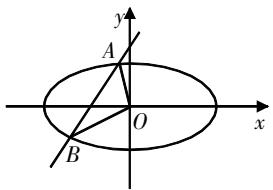
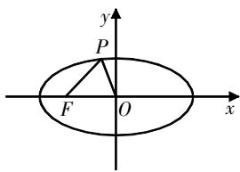
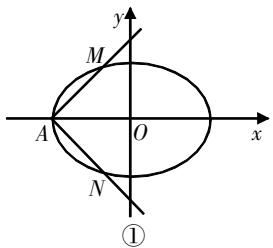
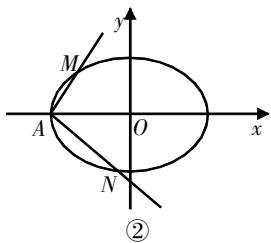

# 关于圆锥曲线中的斜率 取值问题的探究

石琪瑶 江苏省吴江中学 215200

[摘 要] 文章围绕圆锥曲线中的斜率取值问题开展解题探究与教学思考,并提出相应的教学建议.
[关键词] 圆锥曲线;斜率;取值范围;思想方法

# 问题综述

圆锥曲线中的斜率取值问题较为常见,但问题的综合性极强,涉及函数、不等式、直线和圆锥曲线等相关知识. 圆锥曲线中的斜率取值问题的解析过程通常分为三个阶段:

阶段一,开展圆锥曲线位置关系、圆锥曲线特征的分析,挖掘信息条件;

阶段二,围绕问题进行推理转化,结合已知条件构建斜率模型;

阶段三,将斜率取值问题转化为函数或不等式取值问题,结合信息条件完成求解.

斜率取值问题的求解一般有两种思路:一是构建函数,将斜率取值问题转化为与参数相关的取值问题,利用函数的性质来推理求解;二是构建不等式,将斜率取值问题转化为与参数相关的不等式取值问题,结合圆锥曲线知识探寻不等关系求解.

# 实例探究

上述针对圆锥曲线中的斜率取值问题进行综述分析,总结了相应的解题策略,形成了两大求解思路,下面结合实例探究不同类型问题的解法.

# 1. 解析角度,破解取值

例1 设 $F_{1}, F_{2}$ 分别是椭圆 $E: \frac{x^{2}}{4} + \frac{y^{2}}{b^{2}} = 1 (b > 0)$ 的左、右焦点，若P是该椭圆上的一个动点，且 $\overrightarrow{PF_{1}} \cdot \overrightarrow{PF_{2}}$ 的最大值为1.

(1)求椭圆E的方程;  
(2)设直线l:x=ky-1与椭圆E相交于不同的两点A,B,且 $\angle AOB$ 为锐角(O为坐标原点),求k的取值范围.

text_image

y
A
O
x
B

图1

思路分析 本题为涉及动点的圆锥曲线综合题. 第(2)问设定直线l, 求其斜率的取值范围, 核心条件为“ $\angle AOB$ 为锐角”, 可以利用向量积与角度的相关性构建不等式求解.

过程解析 (1)由条件可知 $a = 2$ , $c = \sqrt{4 - b^2}$ , $b^2 < 4$ , 所以点 $F_1(-\sqrt{4 - b^2}, 0)$ , $F_2(\sqrt{4 - b^2}, 0)$ . 设点 $P(x, y)$ , 则 $\overrightarrow{PF_1} \cdot \overrightarrow{PF_2} = (-\sqrt{4 - b^2} - x, -y) \cdot (\sqrt{4 - b^2} - x, -y) = \left(1 - \frac{b^2}{4}\right)x^2 + 2b^2 - 4$ . 由于 $x \in [-2, 2]$ , 分析可知, 当 $x = \pm 2$ , 即点 $P$ 为椭圆的长轴端点时, $\overrightarrow{PF_1} \cdot \overrightarrow{PF_2}$ 可取最大值 1, 解得 $b^2 = 1$ , 所以椭圆 $E$ 的方程为 $\frac{x^2}{4} + y^2 = 1$ .

(2)设点 $A(x_{1},y_{1}),B(x_{2},y_{2})$ ，联立直线l与椭圆E的方程，整理得 $(k^{2}+4)y^{2}-2ky-3=0$ ，则 $\Delta=(-2k)^{2}+12(4+k^{2})=16k^{2}+48>0,y_{1}+y_{2}=\frac{2k}{k^{2}+4},y_{1}\cdot y_{2}=\frac{-3}{k^{2}+4}.$

因为 $\angle AOB$ 为锐角，所以 $\overrightarrow{OA} \cdot \overrightarrow{OB} = x_1x_2 + y_1y_2 = (1 + k^2)y_1y_2 - k(y_1 + y_2) + 1 = \frac{-3}{k^2 + 4}(1 + k^2) - \frac{2k^2}{k^2 + 4} + 1 = \frac{1 - 4k^2}{k^2 + 4} > 0$ ，解得 $-\frac{1}{2} < k < \frac{1}{2}$ . 所以 $k$ 的取值范围为 $\left(-\frac{1}{2}, \frac{1}{2}\right)$ .

解后评析 第(2)问结合角度条件,将斜率取值问题转化为不等式取值问题,再解析不等式获得答案.求解的关键是把握锐角条件,结合向量积知识构建不等式.解题分两步进行:第一步,把握角度条件,设定关键点的坐标;第二步,联立直线与曲线的方程,利用向量积知识构建不等式,将斜率取值问题转化为不等式取值问题,再解析不等式获得答案.

# 2. 解析斜率,破解取值

例2 已知椭圆 $\frac{x^{2}}{a^{2}}+\frac{y^{2}}{b^{2}}=1(a>b>0)$ 的左焦点为 $F(-c,0)$ ，离心率为 $\frac{\sqrt{3}}{3}$ ，点 M 在椭圆上且位于第一象限，直线 FM 被圆 $x^{2}+y^{2}=\frac{b^{2}}{4}$ 截得的线段的长为 c， $|FM|=\frac{4\sqrt{3}}{3}$ .

(1)求直线FM的斜率;

(2)求椭圆的方程;

(3)设动点P在椭圆上,若直线FP的斜率大于 $\sqrt{2}$ ,求直线OP(O为原点)的斜率的取值范围.

text_image

y
P
F O x

图2

思路分析 本题为以椭圆为背景的综合题,第(3)问探究直线OP的斜率的取值范围,其核心条件是“直线FP的斜率大于 $\sqrt{2}$ ”.可设直线OP的斜率,将其转化为与坐标参数相关的函数,结合已知条件以及函数的性质推导取值.

过程解析 (1)(简答)直线FM的斜率为 $\frac{\sqrt{3}}{3}$ .

(2) 可设椭圆的方程为 $\frac{x^{2}}{3c^{2}} + \frac{y^{2}}{2c^{2}} = 1$ ，直线 FM 的方程为 $y = \frac{\sqrt{3}}{3}(x + c)$ ，联立椭圆与直线的方程，并整理得 $3x^{2} + 2cx - 5c^{2} = 0$ ，解得 $x = -\frac{5}{3}c$ 或 x = c。由于点 M 在第一象限上，推理可得点 M 的坐标为 $\left(c, \frac{2\sqrt{3}}{3}c\right)$ 。所以， $|FM| = \sqrt{(c + c)^{2} + \left(\frac{2\sqrt{3}}{3}c - 0\right)^{2}} = \frac{4\sqrt{3}}{3}$ ，解得 c = 1，则椭圆的方程为 $\frac{x^{2}}{3} + \frac{y^{2}}{2} = 1$ 。

(3)设点P的坐标为 $(x,y)$ ，直线FP的斜率为t，则 $t=\frac{y}{x+1}$ ，即 $y=t(x+1)(x\neq-1)$ 。联立直线FP与椭圆的方程，并整理得 $2x^{2}+3t^{2}(x+1)^{2}=6$ ，结合已知条件可得 $t=\sqrt{\frac{6-2x^{2}}{3(x+1)^{2}}}<\sqrt{2}$ ，解得 $-\frac{3}{2}<x<-1$ 或 $-1<x<0$ 。

设直线OP的斜率为m,则可将其表示为 $y=mx(x\neq0)$ ，与椭圆的方程联立，并整理得 $m^{2}=\frac{2}{x^{2}}-\frac{2}{3}$ ，可将其视为关于x的函数，利用函数的性质分别讨论.

①当 $-\frac{3}{2}<x<-1$ 时，则 $y=t(x+1)<0, m>0$ ，所以 $m=\sqrt{\frac{2}{x^{2}}-\frac{2}{3}}$ ，可得 $m\in$

$$
\left(\frac {\sqrt {2}}{3}, \frac {2 \sqrt {3}}{3}\right).
$$

②当-1<x<0时，则 $y=t(x+1)>0$ ，m<0，所以 $m=-\sqrt{\frac{2}{x^{2}}-\frac{2}{3}}$ ，可得 $m\in(-\infty,-\frac{2\sqrt{3}}{3})$ .

解后评析 第(3)问将斜率取值问题转化为函数取值问题,借用函数的性质获得答案. 求解的关键是联立直线与椭圆的方程,构建关于坐标参数的函数. 解题分两步进行:第一步,解析直线与椭圆的位置关系,设定关键点的坐标,联立方程;第二步,建立关于坐标参数的函数,利用函数的性质推导取值.

# 3. 解析线段,破解取值

例3 如图3所示, 已知A是椭圆E: $\frac{x^{2}}{t} + \frac{y^{2}}{3} = 1 (t > 3)$ 的左顶点, 斜率为 $k (k > 0)$ 的直线交E于A, M两点, 点N在E上, $MA \perp NA$ .

text_image

y
M
A O x
N
①

text_image

y
M
A
O
x
N
②

图3

(1) 当 t=4, $\left|AM\right|=\left|AN\right|$ 时, 求 $\triangle AMN$ 的面积;  
(2) 当 $2|AM|=|AN|$ 时, 求 k 的取值范围.

思路分析 本题为以椭圆为背景的综合题,题干设定直线与椭圆相交.

第(2)问是关于斜率k的取值范围问题,解析重点是线段之间的关系,即 $2|AM|=|AN|$ ,求解时可设定关键点的坐标,联立方程进行转化,结合相关条件构建不等式,推导斜率的取值范围.

过程解析 (1)(简答)构建面积模型, $\triangle AMN$ 的面积可以表示为 $S = \frac{1}{2} |MN| \cdot d$ , 其中 $d$ 表示点 $A$ 到直线 $MN$ 的距离, 求得 $\triangle AMN$ 的面积 $S = \frac{144}{49}$ .

(2)由题意知 $t > 3, k > 0, A(-\sqrt{t}, 0)$ , 联立直线 $AM$ 与椭圆的方程, 并整理得 $(3 + tk^2)x^2 + 2\sqrt{t} \cdot tk^2x + t^2k^2 - 3t = 0$ . 设 $M(x_1, y_1)$ , 则 $x_1 \cdot (-\sqrt{t}) = \frac{t^2k^2 - 3t}{3 + tk^2}$ , 即 $x_1 = \frac{\sqrt{t}(3 - tk^2)}{3 + tk^2}$ , 推理可得 $|AM| = \frac{6\sqrt{t(1 + k^2)}}{3 + tk^2}$ . 根据题设可知, 直线 $AN$ 的方程可表示为 $y = -\frac{1}{k}(x + \sqrt{t})$ , 同理可得 $|AN| = \frac{6k\sqrt{t(1 + k^2)}}{t + 3k^2}$ . 已知 $2|AM| = |AN|$ , 故 $\frac{2}{3 + tk^2} = \frac{k}{t + 3k^2}$ , 即 $(k^3 - 2)t = 3k(2k - 1)$ . 分析可知, 当 $k = \sqrt[3]{2}$ 时, 上式不成立, 因此 $t = \frac{3k(2k - 1)}{k^3 - 2}$ . 由于 $t > 3$ , 可得 $\frac{3k(2k - 1)}{k^3 - 2} > 3$ , 整理可得 $\frac{k - 2}{k^3 - 2} < 0$ , 即 $\left\{ \begin{array}{l} k - 2 > 0, \\ k^3 - 2 < 0, \end{array} \right.$ 或 $\left\{ \begin{array}{l} k - 2 < 0, \\ k^3 - 2 > 0, \end{array} \right.$ 解得 $\sqrt[3]{2} < k < 2$ . 所以斜率 $k$ 的取值范围为 $(\sqrt[3]{2}, 2)$ .

解后评析 第(2)问将斜率取值问题转化为不等式取值问题,利用不等式的性质获得答案.其中的核心条件为线段关系—— $2|AM|=|AN|$ ,故解析关键是联立方程，构建斜率k与参数t之间的关系. 求解分两步进行: 第一步, 联立方程构建线段关系式, 提取参数之间的关系; 第二步, 围绕所求问题, 建立两个参数之间的等量关系, 将斜率取值问题转化为不等式取值问题, 再利用不等式的性质获得答案.

# 解后思考

上文提出了圆锥曲线中的斜率取值问题的解题思路,并围绕常见的考查题型开展了实例探究,所总结的方法策略对于圆锥曲线中的斜率取值问题的破解有一定的帮助.下面结合实践提出几点教学建议.

# 建议1: 典例探究需要注意问题 特征的解读

开展问题特征的解读有助于提升学生的解题能力. 在解读时,建议分阶段循序推进,引导学生解读问题的特征,把握问题的特点,让学生明晰考查的重点,为后续的解法探究做铺垫. 解读时要注意以下三点:一是要准确定位问题,归纳问题所涉及的知识重点和知识考点,如上述问题就涉及函数、不等式、圆锥曲线、几何等相关知识以及模型构建方法;二是挖掘特征时要逐渐深入,包括模型构建方法、常见的设问情形等;三是要合理拆解问题,注意引导梳理,一般按照基本信息、核心条件、重点问题来分别梳理.

# 建议2: 典例探究需要注意破题策略的总结

破题策略的总结是典例探究的重要环节,在该环节中需要立足问题的特征结构开展解法思路探究,引导学生“知其缘由,明晰何故”,深刻理解解题的方法策略.该环节建议结合以下三点来开展:一是挖掘问题的本质,构建解题思路.二是总结分步方法,形成系统策略.如上述探究中,针对斜率取值问题,结合圆锥曲线的知识特点,构建问题破解三步策略,将解析过程分为三个阶段,思路清晰明了.三是梳理总结解题过程所涉及数学思想方法,如上述问题的求解就用到了数形结合、分类讨论、模型构造、化归与转化等数学思想方法,教学中要重点讲解数学思想方法,让学生逐步体会数学思想方法的内涵.

# 建议3: 典例探究需要注意解题 过程中的问题引导

解题过程中的问题引导可培养学生的数学思维,是有效提升学生解题能力的重要途径. 在解题教学中,需要精选问题引导学生开展问题探究,让学生充分体验解题过程,积累解题经验. 解题教学可分四个阶段:阶段一,给定问题,引导学生解析问题,剖析关键条件;阶段二,引导学生思考解题思路,探索解题方向;阶段三,引导学生构建解题过程;阶段四,开展解后评析,引导学生反思解题过程,归纳总结解法. 整个解题过程中教师可采用“设问引导”的方法,利用问题引导学生思考,关注学生的思维变化,充分把握学情,合理灵活调整教学方式.

# 写在最后

圆锥曲线中的斜率取值问题的探究,可按照“特征分析—方法解读—典例探究—解后反思”的流程来设计. 教学中教师要引导学生关注问题特点,思考解题方法,形成解题策略,从而拓展学生的数学思维,提升学生的数学素养.