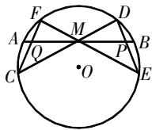
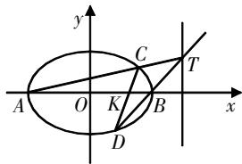
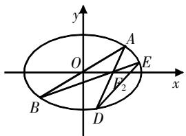
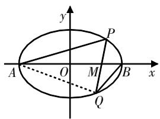
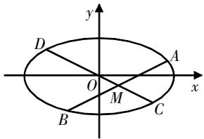

# 关于椭圆中的蝴蝶 模型问题的探究与思考

邱富金 福建省三明市清流县第一中学 365300

[摘 要] 蝴蝶模型在解析几何中十分常见,开展模型解读、挖掘模型本质、总结模型问题十分必要.文章以椭圆中的蝴蝶模型为例,开展模型深度探究,并结合教学实践,提出教学建议.

[关键词] 解析几何; 蝴蝶模型; 特征; 考点; 解法

# 蝴蝶模型解读

蝴蝶模型是解析几何的重点模型,从外形来看,模型形如两个三角形对顶角相接,因形似蝴蝶的翅膀,故称为蝴蝶模型. 蝴蝶模型在解析几何中十分常见,是几何与函数相结合的典型代表. 探究解析需要把握模型特征,总结模型结论. 下面探究椭圆中的蝴蝶模型.

# 1. 蝴蝶模型

在图1所示的 $\odot O$ 中, $\triangle CFM$ 和 $\triangle DEM$ 有共顶点 $M$ ,两三角形的其他顶点 $F,C,D,E$ 位于 $\odot O$ 上. 蝴蝶模型中隐含着相应定理,即蝴蝶定理:点 $M$ 是弦 $AB$ 的中点,两条弦 $CD$ 和 $EF$ 过点 $M$ ,连接 $DE,CF$ ,与 $AB$ 分别相交于点 $P,Q$ ,则点 $M$ 为线段 $PQ$ 的中点.

  
图1

# 2. 本质探究

高考中直接考查蝴蝶定理的情形并不多见,常将蝴蝶模型与解析几何相结合,对其赋予“数”与“形”的特征.

蝴蝶模型背景下的椭圆综合题中,注重考查直线与椭圆的位置关系. 该类问题本质上是研究椭圆的内接四边形,即两对接三角形的四个顶点构成的四边形. 其中形如蝴蝶的四边形通常由椭圆的两条相交弦来构建. 在实际问题中,并不会直接给定弦,而是设定两条弦过定点,或由某固定线的斜率来确定.

椭圆问题常围绕蝴蝶模型来构建,基于相交弦设定问题,如定点问题、定值问题、斜率问题等. 在具体求解时,注意分析模型特征,充分利用蝴蝶定理来推导条件,通过数形结合分析转化.

# 典例探究

椭圆中的蝴蝶模型问题多样,常见的有定点定值问题、斜率问题、弦长关系问题等. 下面结合实例具体探究,总结方法策略.

# 1. 蝴蝶模型中的定点问题

例1 在平面直角坐标系中, 已知圆 $O: x^{2} + y^{2} = 9$ , Q 是圆 O 上任意一点, Q 在 x 轴上的投影是点 $Q'$ , 点 P 满足 $\overrightarrow{Q'}P = \frac{\sqrt{5}}{3}\overrightarrow{Q'}\overrightarrow{Q}$ , 设点 P 的轨迹为曲线 E.

(1)求曲线E的方程;  
(2) 若 $A(-3,0)$ , $B(3,0)$ ，过直线 x=9 上任意一点 T (不在 x 轴上) 作两条直线 TA, TB 与曲线 E 分别相交于点 $C(x_{1},y_{1})$ , $D(x_{2},y_{2})$ (异于点 A 和 B)，求证：直线 CD 过定点.

text_image

y
C
T
A O K B x
D

图2

解析 本题为椭圆综合题,问(2)中的弦AB与CD相交于点K,构成了蝴蝶模型,可将其归为椭圆中的蝴蝶模型问题.

(1)该问求曲线E的方程,设点 $P(x,y),Q(x_{0},y_{0})$ ，由 $\overrightarrow{Q^{\prime}P}=\frac{\sqrt{5}}{3}\overrightarrow{Q^{\prime}Q}$ 推知 $x_{0}=x,y_{0}=\frac{3}{\sqrt{5}}y$ ，将其代入方程 $x_{0}^{2}+y_{0}^{2}=9$ ，可得 $\frac{x^{2}}{9}+\frac{y^{2}}{5}=1$ 。所以，曲线E的方程为 $\frac{x^{2}}{9}+\frac{y^{2}}{5}=1$ 。

(2)该问求证直线CD过定点,可根据韦达定理,采用“整体代换”的方法解析,具体如下:

设直线 $CD$ 的方程为 $x = my + t (t \neq 0)$ , 与椭圆 $\frac{x^2}{9} + \frac{y^2}{5} = 1$ 联立, 并整理得 $(5m^2 + 9)y^2 + 10mty + 5t^2 - 45 = 0$ , 由韦达定理得 $y_1 + y_2 = \frac{-10mt}{5m^2 + 9}, y_1y_2 = \frac{5t^2 - 45}{5m^2 + 9}, \Delta = 180(5m^2 + 9 - t^2) > 0$ .

利用点坐标表示蝴蝶模型中两条弦所在直线的解析式，则 $AC:y=\frac{y_{1}}{x_{1}+3}(x+3)$ ，当x=9时， $y_{T}=\frac{12y_{1}}{x_{1}+3}$ ；BD： $y=\frac{y_{2}}{x_{2}-3}(x-3)$ ，当x=9时， $y_{T}=\frac{6y_{2}}{x_{2}-3}$ 。所以， $\frac{12y_{1}}{x_{1}+3}=\frac{6y_{2}}{x_{2}-3}$ ，化简得 $2x_{2}y_{1}-x_{1}y_{2}=3y_{2}+6y_{1}①$ 。又 $x_{2}y_{1}+x_{1}y_{2}=2my_{1}y_{2}+t(y_{1}+y_{2})=\frac{9(y_{1}+y_{2})}{t}②$ 。综合①和②可得 $\left\{\begin{aligned}&x_{2}y_{1}=\left(\frac{3}{t}+2\right)y_{1}+\left(\frac{3}{t}+1\right)y_{2},\\ &x_{1}y_{2}=\left(\frac{6}{t}-2\right)y_{1}+\left(\frac{6}{t}-1\right)y_{2}\end{aligned}\right.$ 在直线CD

的方程 $y-y_{1}=\frac{y_{2}-y_{1}}{x_{2}-x_{1}}(x-x_{1})$ 中，令y=0，
则 $x=\frac{x_{1}y_{2}-x_{2}y_{1}}{y_{2}-y_{1}}=\frac{\left(\frac{3}{t}-4\right)y_{1}+\left(\frac{3}{t}-2\right)y_{2}}{y_{2}-y_{1}}.$ 分析可知，当 $\left(\frac{3}{t}-4\right)+\left(\frac{3}{t}-2\right)=0$ ，即t=1时，直线CD过定点(1,0).

评析 上述为蝴蝶模型中的定点问题,解析时把握模型特征,采用传统的待定系数法来代换简化. 问题解析有两大关键点:一是把握蝴蝶模型中的两条特殊弦,结合相关点分设直线方程;二是灵活构造对称式方程,形成对应的方程组,巧妙化简求解.

# 2. 蝴蝶模型中的斜率比值问题

例2 已知椭圆 $C:\frac{x^{2}}{a^{2}}+\frac{y^{2}}{b^{2}}=1(a>b>0)$ 的左、右焦点分别为 $F_{1},F_{2},M$ 在椭圆C上， $\triangle MF_{1}F_{2}$ 的周长为 $2\sqrt{5}+4$ ，其面积的最大值为2，试解决下列问题.

(1)求椭圆C的方程;

(2) 直线 $y=kx (k>0)$ 与椭圆 C 相交于 A 和 B，连接 $AF_{2}, BF_{2}$ ，并延长交椭圆 C 于 D 和 E，连接 DE，则 AB 与 DE 的斜率之比是否为定值？说明理由.

text_image

y
O
A
E
x
B
D
F₂

图3

解析 本题为椭圆中的蝴蝶模型问题,其中 $\triangle ABF_{2}$ 和 $\triangle DEF_{2}$ 共顶点 $F_{2}$ ,由椭圆的两条相交弦构建.

题设两问,第(1)问求椭圆C的方程,转化 $\triangle MF_{1}F_{2}$ 的周长和面积最值条件即可求出椭圆方程的特征参数.第(2)问是关于蝴蝶模型中两条关键弦的斜率之比的问题,探索其值是否为定值,可采用“设而不求”“整体代换”的方法构建斜率之比.

(1)已知 $\triangle MF_1F_2$ 的周长为 $2\sqrt{5} + 4$ ，则 $\left|F_1F_2\right| + \left|MF_2\right| + \left|MF_1\right| = 2a + 2c = 2\sqrt{5} +4,$ 其最大面积 $S_{\mathrm{max}} = \frac{1}{2}\cdot 2c\cdot b = bc = 2$ ，解得 $a = \sqrt{5},b = 1$ ，所以椭圆 $C$ 的方程为 $\frac{x^2}{5} +y^2 = 1.$

(2)第一步,设定点坐标:设点A的坐标为 $(x_{0},y_{0})$ ,则点B的坐标为 $(-x_{0},-y_{0})$ .

第二步,构建方程:推得直线AD的方程为 $x=\frac{x_{0}-2}{y_{0}}y+2$ ,将其代入椭圆C的方程,整理得 $\left[(x_{0}-2)^{2}+5y_{0}^{2}\right]y^{2}+4(x_{0}-2)y_{0}y-y_{0}^{2}=0①$ .又 $\frac{x_{0}^{2}}{5}+y_{0}^{2}=1$ ,代入方程①,化简得 $(9-4x_{0})y^{2}+4(x_{0}-2)y_{0}y-y_{0}^{2}=0$ .

第三步,斜率推导:设点D的坐标为 $(x_{1},y_{1})$ ，点E的坐标为 $(x_{2},y_{2})$ ，则 $y_{0}y_{1}=\frac{-y_{0}^{2}}{9-4x_{0}}$ ，所以 $y_{1}=\frac{-y_{0}}{9-4x_{0}},x_{1}=\frac{x_{0}-2}{y_{0}}y_{1}+2$ 。直线BE的方程可以表示为 $x=\frac{x_{0}+2}{y_{0}}y+2$ ，同理可得 $y_{2}=\frac{y_{0}}{9+4x_{0}},x_{2}=\frac{x_{0}+2}{y_{0}}y_{2}+2$ 。所以，直线DE的斜率为 $k_{DE}=\frac{y_{1}-y_{2}}{x_{1}-x_{2}}=\frac{1}{\frac{x_{0}}{y_{0}}-\frac{2}{y_{0}}\cdot\frac{y_{1}+y_{2}}{y_{1}-y_{2}}}=9\cdot\frac{y_{0}}{x_{0}}=9k$ ，即 $k_{DE}:k=9:1$ 。

评析 上述蝴蝶模型中的斜率比值问题,属于解析几何中的斜率问题,探究解析时关注模型特点,采用“设而不求”“整体代入”的方法简化斜率比值. 问题突破有两大关键点:一是把握蝴蝶模型的相交弦的位置关系,推导所在直线的方程;二是充分利用类比推导简化的方法,整体代入化简直线斜率比值.

实际上,可推广上述椭圆蝴蝶模型中的直线斜率比值结论,在求解相应问题时直接使用.具体如下:

如图4所示,在椭圆 $C:\frac{x^{2}}{a^{2}}+\frac{y^{2}}{b^{2}}=1$ (a>b>0)中,其左、右顶点为A,B,椭圆C的弦PQ过定点 $M(t,0)$ ,则 $k_{AP}\cdot k_{AQ}=\left(-\frac{b^{2}}{a^{2}}\right)\cdot\frac{a-t}{b-t}$ .

text_image

y
P
A O M B x
Q

图4

# 3. 蝴蝶模型中的弦长关系问题

例3 如图5所示,已知椭圆 $E:\frac{x^{2}}{a^{2}}+\frac{y^{2}}{b^{2}}=1(a>b>0)$ 的一个焦点与短轴的两个端点是正三角形的三个顶点,点 $P\left(\sqrt{3},\frac{1}{2}\right)$ 在椭圆E上.

(1)求椭圆E的方程;

(2)设不过原点O且斜率为 $\frac{1}{2}$ 的直线l与椭圆E相交于不同的两点A和B,线段AB的中点为M,直线OM与椭圆E相交于不同的两点C和D,求证: $|MA|\cdot|MB|=|MC|\cdot|MD|$ .

text_image

y
D
O
A
x
M
B
C

图5

解析 本题同样为椭圆中的蝴蝶模型问题,椭圆的两条弦CD和AB构成蝴蝶模型. 本题第(2)问为核心之问,求证弦长之间的关系,涉及四条弦,探究解析可采用“联立方程”“整体代换”的策略,即设点的坐标,推导线段的长,再整理化简.

(1)把握几何特征,可得a=2b,再结合 $P\left(\sqrt{3},\frac{1}{2}\right)$ 在椭圆E上,可得椭圆E的方程为 $\frac{x^{2}}{4}+y^{2}=1$ .  
(2)设直线l的方程为 $y=\frac{1}{2}x+m$ $(m\neq0)$ ，点 $A(x_{1},y_{1}),B(x_{2},y_{2})$ ，联立直线与椭圆的方程，有 $\left\{\begin{aligned}&y=\frac{1}{2}x+m,\\&\frac{x^{2}}{4}+y^{2}=1,\end{aligned}\right.$ 整

理得 $x^{2}+2mx+2m^{2}-2=0$ 。结合韦达定理得 $x_{1}+x_{2}=-2m,x_{1}x_{2}=2m^{2}-2$ ，且 $\Delta=4(2-m^{2})>0$ ，可知参数m的取值范围为 $(- \sqrt{2},\sqrt{2})$ 。由点M的坐标 $\left(-m,\frac{m}{2}\right)$

推得直线OM的方程为 $y=-\frac{1}{2}x$ ，与椭圆

的方程联立，有 $\left\{ \begin{array}{l} y = -\frac{1}{2} x, \\ x^2 + 4y^2 - 4 = 0, \end{array} \right.$ 可得点

$$
C \left(- \sqrt {2}, \frac {\sqrt {2}}{2}\right), D \left(\sqrt {2}, - \frac {\sqrt {2}}{2}\right).
$$

结合点的距离公式得 $|MC|\cdot|MD|=$ $\frac{\sqrt{5}}{2}(-m+\sqrt{2})\cdot\frac{\sqrt{5}}{2}(m+\sqrt{2})=$ $\frac{5}{4}(2-m^{2}),|MA|\cdot|MB|=\frac{1}{4}|AB|^{2}=$ $\frac{5}{16}(x_{1}+x_{2})^{2}-\frac{5}{4}x_{1}x_{2}=\frac{5}{4}(2-m^{2})$ ，所以 $|MA|\cdot|MB|=|MC|\cdot|MD|$ ，得证.

评析 上述蝴蝶模型中的弦长关系问题,证明弦长乘积相等. 解析采用的是“联立方程”“整体代换”的策略,即设点的坐标,联立直线与椭圆的方程,借助韦达定理推导参数条件,将弦长乘积问题转化为与坐标参数相关的代数问题. 问题解析有两个关键点:一是挖掘其中的隐含模型,即蝴蝶模型,把握模型中的两条弦的特点;二是联立方程,设而不求,简化运算过程.

# 教学思考

上述深入探究了椭圆中的蝴蝶模型,剖析模型特征,结合实例探究常见问题,并探索解题过程,总结破题关键点.下面对教学探究提出几点建议.

1. 解析模型特征,挖掘模型本质
蝴蝶模型是高中几何中常见的

模型,教学探究要注意模型特征的解析,挖掘模型本质,让学生认识、理解、掌握模型.上述模型探究按照“特征解析-本质挖掘-考点探究”来开展,探究过程具有连贯性、系统性,循序渐进、逐步深入.教学时需要注意两点:一是模型解析中的数形结合,即探究时结合直观的模型图象,引导学生关注其几何特征;二是挖掘本质立足知识考点,即引导学生挖掘、理解模型的本质,掌握对应的知识考点.

# 2. 关注模型考点,总结解题方法

教学时教师要深入剖析模型的知识重点,围绕模型开展考点探究,精选问题,总结解题方法. 上述蝴蝶模型的探究,围绕三大典例问题开展,分析了定点问题、斜率比值问题、弦长关系问题的破解思路,总结了相应的解题方法. 教学引导时要注意两点:一是解题过程中的思维引导,即引导学生思考,锻炼学生思维能力;二是解法的归纳总结,即开展解后反思,让学生充分认识问题,掌握解题策略.

# 3. 渗透数学思想方法,提升学生综合素养

模型问题的探究教学要注意渗透数学思想方法,以提升学生的综合素养. 以上述蝴蝶模型的探究为例,其涉及了数形结合、模型构建、方程思想等,教学可分三个阶段进行:第一,讲解数学思想方法的内涵,引导学生初步理解数学思想方法;第二,结合模型解析渗透数学思想方法,引导学生感悟数学思想方法,体会数学思想方法的作用;第三,升华数学思想方法,促使学生独立使用数学思想方法构建解题思路,提升学生的思维能力.