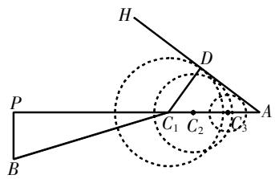
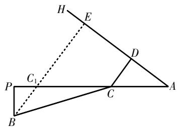

# 用母函数求解排列问题

方重友 江苏省震泽中学 215200

[摘 要] 母函数是组合数学中的一个重要概念,用母函数来处理中学数学中的一些排列问题,其可操作性强,学生容易理解. 文章先介绍指数型母函数的相关内容和定理,然后结合实例给出其应用.

[关键词] 排列问题;母函数;指数型母函数;理解;应用

计数问题在日常生活、生产中普遍存在. 计数问题属于组合问题, 而组合中有一个重要概念——母函数(也叫发生函数、生成函数) $^{[1]}$ . 指数型母函数(简称指母函数)正是将复杂的计数问题简单化的一个工具, 利用指母函数可以轻松求解排列问题.

# 预备知识

定义1 设 $a_{0},a_{1},\cdots,a_{n},\cdots$ 是一个给定的数列,我们称形式幂级数

$$
f (x) = \sum_ {n = 0} ^ {\infty} \frac {a _ {n}}{n !} x ^ {n} = a _ {0} + a _ {1} x + \frac {a _ {2}}{2 !} x ^ {2} +
$$

$$
\frac {a _ {3}}{3 !} x ^ {3} + \dots + \frac {a _ {n}}{n !} x ^ {n} + \dots ①
$$

为这个数列的指数型母函数,简称指母函数 $^{[2]}$ .

例如,数列1,1,1,…,1,…的指母函数是 $f(x)=\sum_{n=0}^{\infty}\frac{1}{n!}x^{n}=1+x+\frac{x^{2}}{2!}+\cdots+\frac{x^{n}}{n!}+\cdots$ . 这个指母函数非常重要,我们专门用 $f(x)=\mathrm{e}^{x}$ 来记它,即 $f(x)=\mathrm{e}^{x}=1+$

$$
x + \frac {x ^ {2}}{2 !} + \dots + \frac {x ^ {n}}{n !} + \dots .
$$

规定: 在进行这些运算时, 把形式幂级数看成幂级数, 然后按照幂级数的运算法则去运算.

定义2 设 $f(x)=\sum_{n=0}^{\infty}\frac{a_{n}}{n!}x^{n}$ 和 $g(x)=\sum_{n=0}^{\infty}\frac{b_{n}}{n!}x^{n}$ 是两个形式幂级数,则

$$
f (x) \pm g (x) = \sum_ {n = 0} ^ {\infty} \frac {a _ {n} \pm b _ {n}}{n !} x ^ {n}, f (x) \cdot
$$

$$
g (x)   =   \sum_ {n = 0} ^ {\infty}   \frac {c _ {n}}{n !} x ^ {n}   (\text {其中} c _ {n}   =   \sum_ {n = 0} ^ {\infty}   \mathrm{C} _ {n} ^ {k} a _ {k} b _ {n - k}).
$$

定理1 $e^{x} \cdot e^{y} = e^{x+y}$ .

在定理1中,取y=x,则 $\left(\mathrm{e}^{x}\right)^{2}=\mathrm{e}^{2x}$ ,即 $\left(\sum_{n=0}^{\infty}\frac{x^{n}}{n!}\right)^{2}=\sum_{n=0}^{\infty}\frac{2^{n}}{n!}x^{n}.$

推论1 $(\mathrm{e}^{x})^{m} = \mathrm{e}^{mx}$ ，即 $\left(\sum_{n = 0}^{\infty}\frac{x^n}{n!}\right)^m =$ $\sum_{n = 0}^{\infty}\frac{m^n}{n!} x^n.$

在定理1中,取y=-x,则 $e^{x}\cdot e^{-x}=1$ ,
即 $\frac{1}{e^{x}}=e^{-x}$ . 由 $e^{x}=1+x+\frac{x^{2}}{2!}+\cdots+\frac{x^{n}}{n!}+\cdots$ $e^{-x}=1-x+\frac{x^{2}}{2!}-\cdots+(-1)^{n}\frac{x^{n}}{n!}+\cdots$ , 得到:

推论2 $e^{x}+e^{-x}=2\left[1+\frac{x^{2}}{2!}+\frac{x^{4}}{4!}+\cdots+\frac{x^{2n}}{(2n)!}+\cdots\right]$ , $e^{x}-e^{-x}=2\left[x+\frac{x^{3}}{3!}+\frac{x^{5}}{5!}+\cdots+\frac{x^{2n+1}}{(2n+1)!}+\cdots\right]$ .

注：对于指数幂 $a^x (a > 0$ ，且 $a\neq$ 1)，显然 $a^x\cdot a^y = a^{x + y}$ .从定理1可以看出， $\mathrm{e}^x\cdot \mathrm{e}^y = \mathrm{e}^{x + y}$ 具有指数幂的运算性质．这就是称式①为指母函数的原因.

# 用指母函数求解排列问题

排列问题,困难在于对问题背景的理解,这是一个数学化过程,需要通过不同情境加强训练、加深理解.我们先来看看下列三类排列问题.

问题1 (不许重复的排列)从n个不同的物体中,任意取出r个作排列,不许重复,问有多少种不同的排法?

问题2（允许无限重复的排列）从n个不同的物体中,任意取出r个作排列,允许重复,问有多少种不同的排法?

问题3 (允许有限重复的排列)设n个物体中,有 $n_{1}$ 个物体 $A_{1},n_{2}$ 个物体 $A_{2},\cdots,n_{k}$ 个物体 $A_{k},n_{1}+n_{2}+\cdots+n_{k}=n$ ,现从中任取r个作排列,问有多少种不同的排法? [3]

分析 问题1的解答很简单,不同的排列的总数为 $A_{n}^{r}=n(n-1)\cdots(n-r+1)$ . 特别地,当r=n时,不同的排列的总数为 $A_{n}^{n}=n(n-1)\cdots3\times2\times1=n!$ . 这在中学课本上已经很熟悉了.

问题2的解答也不困难. 因为允许重复, 所以每个排列的 $r$ 个位置上都有可能放 $n$ 个不同物体中的任何一个, 即每个位置都有 $n$ 种可能, 因此不同的排列的总数为 $n^{[4]}$ .

解答困难的是问题3,因为每个物体重复的次数是有限的,这给问题带来了复杂性.但如果考虑r=n的情形,问题还不算太难.

定理2 设n个物体中,有 $n_{1}$ 个物体 $A_{1},n_{2}$ 个物体 $A_{2},\cdots,n_{k}$ 个物体 $A_{k},n_{1}+n_{2}+\cdots+n_{k}=n$ ,则这n个物体不同的排列的总数为 $\frac{n!}{n_{1}!n_{2}!\cdots n_{k}!}$ .

证明 由于对每个排列来说, $n_{1}$ 个物体 $A_{1},n_{2}$ 个物体 $A_{2},\cdots,n_{k}$ 个物体 $A_{k}$ 都出现在排列中,因此n个物体排列的总数为n!,而在这n!个排列中有很多的排列是一样的,例如 $n_{1}$ 个物体 $A_{1}$ 任意交换位置,若其他物体不动,这样得到的排列全是一样的,这种相同的排列有 $n_{1}!$ 个.同理,对物体 $A_{2},A_{3},\cdots,A_{k}$ ,也会有同类情况.去掉这些相同的排列后,真正不同的排列的总数为 $\frac{n!}{n_{1}!n_{2}!\cdots n_{k}!}$ .

注:这是问题3中当r=n时的解答.最困难的是r<n的情形,这没有一般公式,而指母函数是解决这类问题的有力工具.

定理3 设n个物体中,有 $n_{1}$ 个物体 $A_{1},n_{2}$ 个物体 $A_{2},\cdots,n_{k}$ 个物体 $A_{k},n_{1}+n_{2}+\cdots+n_{k}=n$ ,从这n个物体中任取 $r(r<$ $n)$ 个物体, 不同的排列的总数记为 $a_{r}$ , 则数列 $\{a_{r}\}$ 的指母函数为 $f(x)=\left(1+x+\frac{x^{2}}{2!}+\cdots+\frac{x^{n_{1}}}{n!}\right)\left(1+x+\frac{x^{2}}{2!}+\cdots+\frac{x^{n_{2}}}{n_{2}!}\right)\cdots\left(1+x+\frac{x^{2}}{2!}+\cdots+\frac{x^{n_{k}}}{n_{k}!}\right)$ ②.

证明 让第i个括号代表第i个物体 $A_{i}(i=1,2,\cdots,k)$ .从第一个括号中取出项 $\frac{x^{3}}{3!}$ ，解释为“取出3个物体 $A_{1}$ ”；从第二个括号中取出项 $\frac{x^{4}}{4!}$ ，解释为“取出4个物体 $A_{2}$ ”；其余类似.

现在研究式②的展开式中 $\frac{x^{r}}{r!}$ 的系数.

合并同类项前,式②的展开式中的 $\frac{x^{r}}{r!}$ 是由各个括号中的项相乘而来的: $\frac{x^{m_{1}}}{m_{1}!}\cdot\frac{x^{m_{2}}}{m_{2}!}\cdots\cdot\frac{x^{m_{k}}}{m_{k}!}=\frac{x^{m_{1}+m_{2}+\cdots+m_{k}}}{m_{1}!m_{2}!\cdots m_{k}!}$ ,这里 $0\leqslant m_{1}\leqslant n_{1},0\leqslant m_{2}\leqslant n_{2},\cdots,0\leqslant m_{k}\leqslant n_{k}$ ,而且 $m_{1}+m_{2}+\cdots+m_{k}=r$ .故 $\frac{x^{m_{1}}}{m_{1}!}\cdot\frac{x^{m_{2}}}{m_{2}!}\cdots\cdot\frac{x^{m_{k}}}{m_{k}!}=\frac{r!}{m_{1}!m_{2}!\cdots m_{k}!}\cdot\frac{x^{r}}{r!}$ .由此可知, $\frac{x^{r}}{r!}$ 的系数是 $\frac{r!}{m_{1}!m_{2}!\cdots m_{k}!}$ ③,而且 $m_{1}+m_{2}+\cdots+m_{k}=r$ .

根据定理2可知,式③恰好就是这r个物体不同的排列的总数:在这r个物体中有 $m_{1}$ 个 $A_{1},m_{2}$ 个 $A_{2},\cdots,m_{k}$ 个 $A_{k}$ ,这说明乘积 $\frac{x^{m_{1}}}{m_{1}!}\cdot\frac{x^{m_{2}}}{m_{2}!}\cdots\cdot\frac{x^{m_{k}}}{m_{k}!}$ 就对应一种排列.由于 $m_{i}(i=1,2,\cdots,k)$ 可以取遍0,1,2, $\cdots,n_{i}(i=1,2,\cdots,k)$ 中的所有整数,因此合并同类项后, $\frac{x^{r}}{r!}$ 的系数就表示从这n个物体中取出r个物体的不同的排列的总数.这就证明了式②就是数列 $\{a_{r}\}$ 的指母函数.

在此我们可以把定理3推广到更一般的情形：

定理4 设 $A=\left\{a_{1},a_{2},\cdots,a_{n}\right\},M_{1}$ ,$M_{2},\cdots,M_{n}$ 均为非负整数集的子集，从A中可重复地选取r个元素作排列。如果 $a_{k}$ 可重复选取的全部次数为 $M_{k}(k=1,2,\cdots,n)$ ，记所有可能的排列数为 $e_{r}$ ，则数列 $\{e_{r}\}(r\geqslant0)$ 的指母函数为 $f(x)=\left(\sum_{i_{1}\in M_{1}}\frac{x^{i_{1}}}{i_{1}!}\right)\left(\sum_{i_{2}\in M_{2}}\frac{x^{i_{2}}}{i_{2}!}\right)\cdots\left(\sum_{i_{n}\in M_{n}}\frac{x^{i_{n}}}{i_{n}!}\right)$ 。将指母函数解析式展开， $\frac{x^{r}}{r!}$ 的系数就是所求的排列数 $e_{r}$ 。

证明留给读者完成.

# 指母函数应用举例

题1 将8个不同的球分发给4个不同的班级,要求每个班至少分得一个球,问有多少种不同的分法?

解析 将8个不同的球排成一列，4个班依次编号为1,2,3,4.对于一个满足条件的分法，若把某个球分给编号为i的班，就在该球所排的位置上填上i，则得到 $\{1,2,3,4\}$ 的一个“8可重”排列（即从集合 $\{1,2,3,4\}$ 中可重复地选取8个元素作成排列）。由于每个班至少分得一个球，所以每个数至少出现一次，即每个数出现的次数都属于集合 $\{1,2,3,\cdots\}$ 。将n个不同的球分给4个不同的班且每个班至少分得一个球的分法数记为 $a_{n}$ ，由定理4可知数列 $\{a_{n}\}(n\geqslant1)$ 的指母函数为 $f(x)=\left(x+\frac{x^{2}}{2!}+\frac{x^{3}}{3!}+\cdots\right)^{4}=(e^{x}-1)^{4}=e^{4x}-4e^{3x}+6e^{2x}-4e^{x}+1=\sum_{n=0}^{\infty}\frac{4^{n}}{n!}x^{n}-4\sum_{n=0}^{\infty}\frac{3^{n}}{n!}x^{n}+6\sum_{n=0}^{\infty}\frac{2^{n}}{n!}x^{n}-4\sum_{n=0}^{\infty}\frac{1}{n!}x^{n}+1=\sum_{n=0}^{\infty}(4^{n}-4\times3^{n}+6\times2^{n}-4)\frac{x^{n}}{n!}+1$ 。由此可得， $\frac{x^{8}}{8!}$ 的系数 $a_{8}=4^{8}-4\times3^{8}+6\times2^{8}-4=40824$ 。所以，共有40824种不同的分法。

题2 用数字1,2,3,4作六位数，每个数字在六位数中出现的次数不得大于2,问可作出多少个不同的六位数?

解析 这是排列问题,每个数字出现的次数都属于集合 $\{0,1,2\}$ . 设所求为N，由定理4可知，N是指母函数 $f(x)=\left(1+x+\frac{x^{2}}{2!}\right)^{4}$ 的展开式中 $\frac{x^{6}}{6!}$ 的系数，而 $\left(1+x+\frac{x^{2}}{2!}\right)^{4}=\frac{1}{16}\left[x^{2}+(2x+2)\right]^{4}=\frac{1}{16}\left[x^{8}+4x^{6}(2x+2)+6x^{4}(2x+2)^{2}+4x^{2}(2x+2)^{3}+(2x+2)^{4}\right]$ ，所以 $N=\frac{6!}{16}(4\times2+6\times2^{2})=1440$ .

题3 把 $n(n \geqslant 1)$ 个彼此不同的球放到4个不同的盒子 $A_{1}, A_{2}, A_{3}, A_{4}$ 中，要求 $A_{1}$ 有奇数个球， $A_{2}$ 有偶数个球，问不同的放球方法有多少种？

解析 设不同的放球方法有 $a_{n}$ 种. 因为要求 $A_{1}$ 有奇数个球, $A_{2}$ 有偶数个球, $A_{3}, A_{4}$ 中球的个数没有限制, 所以 $A_{1}$ 盒子出现的球的个数属于集合

$\{1,3,5,\cdots\},A_{2}$ 盒子出现的球的个数属于集合 $\{0,2,4,\cdots\},A_{3},A_{4}$ 盒子出现的球的个数都属于集合 $\{0,1,2,3,\cdots\}$ .

由定理4可知,数列 $\{a_{n}\}$ 的指母函数是 $f(x)=\left(x+\frac{x^{3}}{3!}+\frac{x^{5}}{5!}+\cdots\right)\left(1+\frac{x^{2}}{2!}+\frac{x^{4}}{4!}+\cdots\right)\left(1+x+\frac{x^{2}}{2!}+\frac{x^{3}}{3!}+\cdots\right)$ .

由推论1和推论2可得 $f(x)=\frac{\mathrm{e}^{x}-\mathrm{e}^{-x}}{2}\cdot\frac{\mathrm{e}^{x}+\mathrm{e}^{-x}}{2}\cdot(\mathrm{e}^{x})^{2}=\frac{1}{4}(\mathrm{e}^{4x}-1)=\frac{1}{4}\cdot\sum_{n=1}^{\infty}\frac{4^{n}x^{n}}{n!}=\sum_{n=1}^{\infty}\frac{4^{n-1}x^{n}}{n!}$ . 比较 $\frac{x^{n}}{n!}(n\geqslant1)$ 的系数,得 $a_{n}=4^{n-1}$ .

# 结束语

母函数分为普通型母函数(简称普母函数)和指数型母函数(简称指母函数). 普母函数主要应用于求解组合问题,而指母函数则主要应用于求解排列问题. 高中阶段的排列问题,有些是难以处理的,这时可借助指母函数来求解. 利用指母函数求解排列问题,学生容易理解,而且可操作性强,是处理排列问题的好方法.

# 参考文献：

[1] 李鸿昌, 徐章韬. 用母函数理解组合问题 [J]. 数学通讯, 2023(10): 59-61+66.  
[2] 曹汝成. 组合数学[M]. 广州: 华南理工大学出版社, 2000.  
[3] 刘会科. 母函数在组合计数中的应用[J]. 数理化解题研究, 2016(13): 16-17.  
[4] 高仕学. 用母函数法统一解决三类排列与组合问题[J]. 课程教育研究, 2017(07): 161.

# (上接第76页)

如此设问,就是从问题的实际背景出发,利用几何关系求函数的最小值. 由于 $t(x)=\frac{1}{3}\left[\sqrt{x^{2}+4}+\frac{3(12-x)}{5}\right]=\frac{1}{3}\left(\left|BC\right|+\frac{3}{5}\left|AC\right|\right)$ ，若能将 $\frac{3}{5}\left|AC\right|$ 转化为一条线段的长,问题即可获解. 将 $\frac{3}{5}\left|AC\right|$ 转化为一条线段的长,不妨从满足 $\left|CD\right|=\frac{3}{5}\left|AC\right|$ 的点D的轨迹入手. 在AP上任选一点C,以点C为圆心, $\frac{3}{5}\left|AC\right|$ 为半径作圆,则圆上所有的点均满足 $\left|CD\right|=\frac{3}{5}\left|AC\right|$ . 通过取不同的点C,可以获得一组拥有共同切线AH的圆(如图4所示). 由此,原题可以转化为求 $\left|BC\right|+\left|CD\right|$ 的最小值.解题时,教师可以引导学生画出图5所示的简图. 至此,原题就转化成了学生熟悉的问题,最终求得 $\left[t(x)\right]_{\min}=t\left(\frac{3}{2}\right)=\frac{44}{15}$ .

text_image

H
D
P
C₁ C₂ C₃
A
B

图4

text_image

H
E
D
C₁
P
C
A
B

图5

在上述探究活动中,教师引导学生先将现实问题抽象为数学问题,然后用数学思维去思考和解决现实问题,让学生充分体验直观想象和数学抽象的魅力,从而提高学生的数学应用能力. 在此过程中,教师利用环环相扣的问题,引导学生建立数与形的联系,通过问题解决感悟数形结合思想、转化思想的重要价值,教会学生用数学思维去思考,用数学语言去表达,增强学生的数学应用意识,提高学生的数学应用能力.

总之,在数学教学中,教师要提供机会和时间给学生从生活实际中去发现、去提炼、去应用数学知识,以此感悟“学以致用”的本质,从而提高学生运用数学知识解决问题的能力.