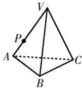
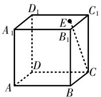
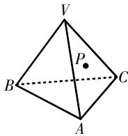
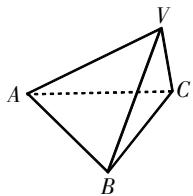
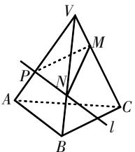
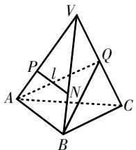
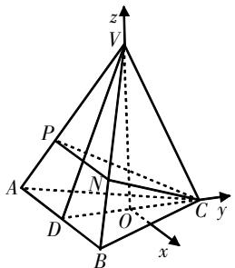
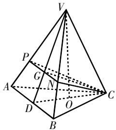
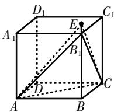

# 溯教材之源,探直观想象培养

黄锦哲 福建省厦门市同安实验中学 361100

林财福 福建省厦门市新店中学 361100

[摘 要] 文章从2022年福建省质检的一道立体几何题入手,探究试题的背景,分析学生存在的问题,反思教学过程中存在的不足,提出教学改进策略.

[关键词] 空间向量;立体几何;直观想象;课堂教学

2022年3月,福建省举行了一次高三诊断性检测,这是福建省使用《普通高中数学课程标准实验教科书》的最后一届. 在《普通高中数学课程标准（2017年版2020年修订）》(简称新课标)的指导下,以立德树人和学科核心素养为焦点的课程改革正在稳步推进,命题理念也发生了变化. 笔者对2022年福建省高三诊断性检测第19题进行了探究与反思,现结合“空间向量与立体几何”的教学,与大家一起探讨教学策略.

# 试题呈现

试题 如图1所示,在三棱锥V-ABC中, $\triangle VAB$ 和 $\triangle ABC$ 均是边长为4的等边三角形. P是棱VA上的点, $VP=\frac{2}{3}VA$ ,过P的平面 $\alpha$ 与直线VC垂直,且平面 $\alpha\cap$ 平面VAB=l.

  
图1

(1)在图中画出l,写出画法并说明理由；

(2)若直线VC与平面ABC所成角的大小为 $\frac{\pi}{3}$ ，求过l及点C的平面与平面ABC所成的锐二面角的余弦值.

# 试题探源

题源1（2019人教A版必修第二册教材P170第8题）如图2所示，一块正方体形木料的上底面有一点E.若经过点E在上底面上面一条直线与CE垂直，则应该怎样画？[1]

  
图2

  
图3

题源2（2019人教A版必修第二册教材P144第12题）一木块如图3所示，点P在平面VAC内，过点P将木块锯开，使截面平行于直线VB和AC，在木块表面应该怎样画线？[1]

题源3（2019人教A版必修第二册教材P164第18题）如图4所示，在三棱锥V-ABC中，VA=VB=AB=AC=BC=2,VC=1，作出二面角V-AB-C的平面角,并求出它的余弦值. $^{[1]}$

  
图4

试题的几何模型取自题源1和题源3,第(1)问的作图与题源2的本质是一样的,都是利用直线与平面垂直得到直线与直线垂直;第(2)问与题源3极其相似,差别在于题源3主要考查综合几何方法.试题取材于新教材,符合新课改的课程理念.

# 解题思路

# 1. 第(1)问

思路1 如图5所示, 在 $\triangle VAC$ 内过 P 作 $PM \perp VC$ , 垂足为 M, 在 $\triangle VBC$ 内过 M 作 $MN \perp VC$ 交 VB 于 N, 连接 PN, 则直线 PN 即为直线 l. 理由: 因为 $PM \perp VC, MN \perp VC, PM \cap MN = M$ , 所以 $VC \perp$ 平面 PMN. 又平面 $PMN \cap$ 平面 VAB = PN, 所以直线 PN 即为直线 l.

思路2 如图6所示,在 $\triangle VAB$ 内过P作PN//AB,交VB于N,则直线PN即为直线l.理由:取VC的中点Q,因为

text_image

V
M
P
N
A
C
l
B

图5

text_image

V
P
l
Q
A
N
B
C

图6

$VA=VC,VB=BC$ ,所以 $AQ\perp VC,BQ\perp VC$ ,所以 $VC\perp$ 平面ABQ.因为 $VC\perp$ 平面 $\alpha$ ,所以平面 $\alpha\parallel$ 平面ABQ.因为平面 $\alpha\cap$ 平面VAB=l,平面 $ABQ\cap$ 平面VAB=AB,所以 $AB\parallel l$ .所以直线PN即为直线l.

# 2. 第(2)问

思路1 向量方法.

如图7所示,取AB的中点D,连接VD,CD. 因为 $\triangle VAB$ 和 $\triangle ABC$ 均为等边三角形,所以 $AB\perp VD,AB\perp CD$ ,所以 $AB\perp$ 平面VCD,所以平面 $ABC\perp$ 平面VCD. 在 $\triangle VCD$ 中,作 $VO\perp CD$ ,垂足为O,所以 $VO\perp$ 平面ABC. 所以 $\angle VCD$ 是直线VC与平面ABC所成的角,故 $\angle VCD=\frac{\pi}{3}$ ,所以 $\triangle VCD$ 为等边三角形,O为CD的中点. 以O为坐标原点,建立空间直角坐标系,分别求出平面ABC与平面PCN的法向量即可求出两平面所成的锐二面角的余弦值为 $\frac{5\sqrt{7}}{14}$ .

text_image

z
V
P
A
N
D
O
C y
x
B

图7

思路2 综合几何方法.

如图8所示,取AB的中点D,连接VD交PN于G,连接CG,CD. 因为 $\triangle VAB$

text_image

Geometric diagram of a pyramid with labeled vertices and internal points, used in spatial geometry problems.

图8

和 $\triangle ABC$ 均为等边三角形,所以 $AB\perp VD,AB\perp CD$ ,所以 $AB\perp$ 平面VCD,平面 $ABC\perp$ 平面VCD.在 $\triangle VCD$ 中,作 $VO\perp CD$ ,垂足为O,由面面垂直的性质定理可得 $VO\perp$ 平面ABC,所以 $\angle VCD$ 是直线VC与平面ABC所成的角,故 $\angle VCD=\frac{\pi}{3}$ ,所以 $\triangle VCD$ 为等边三角形.

由(1)知,过l及点C的平面为平面CPN,因为 $AB\parallel PN$ ,所以 $AB\parallel$ 平面CPN.设平面 $CPN\cap$ 平面 $ABC=l'$ ,由线面平行的性质定理可得 $AB\parallel l'$ .因为 $AB\perp$ 平面VCD,所以 $AB\perp CG$ , $AB\perp CD$ ,所以 $CG\perp l',CD\perp l'$ .所以 $\angle GCD$ 为平面CPN与平面ABC所成的锐二面角的平面角.在 $\triangle GCD$ 中,由余弦定理得 $\cos\angle GCD=\frac{CG^{2}+DC^{2}-DG^{2}}{2CG\cdot DC}=\frac{5\sqrt{7}}{14}$ .所以过l及点C的平面与平面ABC所成的锐二面角的余弦值为 $\frac{5\sqrt{7}}{14}$ .

# 失分原因

本题主要考查直线与直线、直线与平面、平面与平面之间的位置关系，以及直线与平面所成的角、二面角等基础知识；考查空间想象、逻辑推理、运算求解等基本能力；考查函数与方程、化归与转化、数形结合等思想；考查直观想象、逻辑推理、数学运算等素养；体现了基础性和综合性。本题满分12分，属中档题。厦门市高三全体考生的均分只有2.1分，0分的占比很大。第(1)问，很多学生不会作图，部分学生画出了直线 $l$ 但不会说明理由；第(2)问，大部分学生用的是向量方法，但由于没能准确建系或建系后没能准确地写出点的坐标，因此无法用向量方法解决空间角的问题。学生的答题情况暴露出立体几何教学所存在的问题。教师方面：部分教师在立体几何教学过程中，对基础知识的讲解常常以“灌输”的方法为主，并依靠“题海”战术来提升学生的基本技能。学生方面：对基础知识的掌握不扎实，思维僵化，方法使用模式化，直观想象素养不高，识图能

力较弱,不善于利用空间图形理解和解决数学问题. 空间向量为解决立体几何图形中的位置关系与度量问题提供了一个有效方法,已成为高中生解决空间几何问题的重要工具. 但无论使用的是向量方法还是综合几何方法,它们都有一个共同的使用前提,即直观想象素养,所以本题得分低的主要原因就是学生缺失直观想象素养. 因此,在“空间向量与立体几何”的教学中,教师应该认真思考如何更好地培养学生直观想象素养.

# 教学启示

在“空间向量与立体几何”的教学中,新课标指出:“应重视以下两个方面:第一,引导学生运用类比的方法,经历向量及其运算由平面向空间的推广过程,探索空间向量与平面向量的共性与差异,引发学生思考维数增加带来的影响;第二,鼓励学生灵活选择运用向量方法与综合几何方法,从不同角度解决立体几何问题(如距离问题),通过对比体会向量方法的优势.”[2]新课标对“空间向量与立体几何”的学习内容和学习方法进行了较为详细的说明,下面笔者就如何在本章教学中培养学生直观想象素养,与大家共同探讨.

# 1. 加强类比教学,为学生创造更大的自主学习空间

在必修课程的学习中,学生已经学过平面向量的概念、运算、平面向量基本定理及坐标表示,并用向量方法研究了三角形的边角关系,推导出余弦定理、正弦定理等重要公式. 向量是有大小又有方向的量,这一概念适用于平面向量,同样也适用于空间向量. 平面上的向量可以看作空间中的向量,因此空间向量的概念、表示与平面向量没有本质区别. 由于空间中的两个向量可以平移到同一个平面内,所以空间中两个向量的运算可以看成平面上两个向量的运算,它们的加法、减法、数乘、数量积运算也没有本质区别. 当然,因为维数的不同,所以空间向量和平面向量也有差异. 在本章的教学活动中,教师要帮助学生通过类比平面向量的内容、过程和方法来学习空间向量,并用它解决立体几何问题;还要帮助学生自主学习空间向量,引导他们思考空间向量与平面向量的异同点,让学生切身体验维数的增加所带来的影响,从而提升学生的空间想象力.

# 2. 加强向量方法的使用, 培养学生直观想象素养

由于学生在必修课程中已经学过立体几何,所以本章通过解决具体的立体几何问题,来体现用向量方法解决立体几何问题的优势,加强学生对向量方法的认识.因此,本章的教学,特别是“空间向量的应用”的教学,应把具体的立体几何问题作为学习向量方法的载体,通过解决立体几何问题来加深学生对向量方法和立体几何内容的理解.强化用向量方法来解决立体几何问题体现了时代发展对数学课程改革的要求,但部分教师认为这会把立体几何演化为“算的几何”,从而削弱其培养学生空间想象能力的作用.笔者认为,这种想法是错误的.我们知道,完整的向量方法是:先用几何眼光进行观察,再用向量运算进行解决.这里先要分析清楚面对的几何问题的基本特征,以及几何图形的基本元素、基本关系,然后选择适当的基底,并利用选择好的基底表示出相应的几何元素和基本关系,最后进行运算.在“用几何眼光进行观察”的过程中,就需要空间想象、几何直观等能力.例如,解决试题的第(2)问时,学生要想建立空间直角坐标系,就必须具备一定的空间想象能力,除了以O为原点建立空间直角坐标系外,还可以D为原点建立空间直角坐标系,学生通过计算比较,积累更多的建系经验.教师可以利用各种不规则几何体,引导学生探索不同的建系方法,从而培养学生直观想象素养.

# 3. 加强信息技术的应用,打破学生的空间思维壁垒

新课标的基本理念指出：“注重信息技术与数学课程的深度融合，提高教学的时效性。”[2]人教A版(2019)教科书,有多个地方出现了“信息技术与应用”栏目,这些内容都用GeoGe-bra软件动态呈现出来. 用“形”的直观来呈现问题的各种信息, 借“形”的直观来理解抽象的“数”, 以“形”的直观产生对数量关系及事物本质属性的感知, 几何直观有利于学生对数学问题的理解, 寻找解决问题的思路. 例如, 在表示试题中的点的坐标时, 教师可以利用GeoGebra软件的3D功能, 转换不同的视角, 带领学生一起探究该三棱锥各个顶点的坐标, 从而实现三维问题“可视化”和“直观化”, 突破学生的思维壁垒, 发展学生的直观想象素养.

# 4. 注重试题的变式拓展,提升学生思维能力

数学教育家波利亚说过，“在你找到第一个蘑菇(或做出第一个发现)后,要环顾四周,因为它们总是成堆成长的”[3]. 在讲完试题后,要对试题进行变式拓展和归纳总结,促使学生对试题的本质认识提升到一个新的高度,从而提高学生解决问题的能力. 对于上述试题,可以提出相应变式题:

变式题1: 如图1所示, 在三棱锥 V-ABC 中, $\triangle VAB$ 和 $\triangle ABC$ 均是边长为4的等边三角形. P 是棱 VA 上的点, $VP = \frac{2}{3} VA$ , 过 P, B 两点的平面 $\alpha$ 与直线 VC 平行.

(1)在图中画出平面 $\alpha$ 与三棱锥V-ABC表面的交线,写出画法并说明理由;  
(2)若直线VC与平面ABC所成角的大小为 $\frac{\pi}{3}$ ，求平面 $\alpha$ 与平面ABC所成的锐二面角的余弦值.

变式题2:如图1所示,在三棱锥V-ABC中, $\triangle VAB$ 和 $\triangle ABC$ 均是边长为4的等边三角形. P是棱VA上的点, $VP=\frac{2}{3}VA$ ,过P,B两点的平面 $\alpha$ 与直线VC平行.

(1)在图中画出平面 $\alpha$ 与三棱锥V-ABC表面的交线,写出画法并说明理由;  
(2)若直线VC与平面ABC所成角的大小为 $\frac{\pi}{3}$ ，求点C到平面 $\alpha$ 的距离.

也可以改编题源如下:(多选题)如图9所示,在正方体 $ABCD-A_{1}B_{1}C_{1}D_{1}$ 中,点E在平面 $A_{1}B_{1}C_{1}D_{1}$ 内,满足 $\overrightarrow{A_{1}E}=\lambda\overrightarrow{A_{1}D_{1}}+\mu\overrightarrow{A_{1}B_{1}}$ ,其中 $\lambda\in[0,1],\mu\in[0,1]$ ,则()

A. 当 $\lambda=\mu$ 时, 三棱锥 $E-B_{1}AC$ 的体积为定值  
B. 当 $\lambda=\mu$ 时, $\triangle EAC$ 的周长为定值  
C. 当 $\mu=0$ 时, 有且仅有一点 E, 使得 CE 与平面 $B_{1}AC$ 的夹角为 $\frac{\pi}{4}$   
D. 当 $\lambda=0$ 时, 有且仅有一点 E, 使得平面 $CD_{1}E \perp$ 平面 $B_{1}AC$

  
图9

通过对试题探究拓展,使学生在探究过程中得到数学知识与技能,收获数学经验与方法,同时在问题的解决过程中巩固和发展“四基”,提升直观想象素养.

# 结束语

综上所述,空间向量与立体几何相遇,为立体几何问题的解决开拓了一片新的天地. 这不仅培养学生的空间想象能力,同时也降低了学生学习立体几何的难度,体现了时代发展对数学课程改革的要求. 教师应理解好新课标对应用空间向量的教学要求,以教材为载体,加强学生直观想象素养和空间想象能力的培养,从而有效落实立德树人根本任务.

# 参考文献：

[1] 人民教育出版社, 课程教材研究所, 中学数学课程教材研究开发中心. 普通高中教科书·数学·必修第二册A版(2019)[M]. 北京: 人民教育出版社, 2019.  
[2] 中华人民共和国教育部. 普通高中数学课程标准(2017年版2020年修订)
[S]. 北京: 人民教育出版社, 2020.  
[3] G. 波利亚. 怎样解题 [M]. 涂泓, 冯承天, 译. 上海: 上海科技教育出版社, 2002.