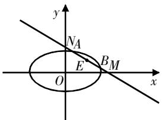
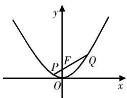

# 问题解读多解探索,方法总结应用拓展

# ——以一道圆锥曲线问题为例

陶贤 江苏省张家港市沙洲中学 215600

[摘 要] 多解探索是高中数学常用的教学方式,即引导学生从不同视角审视问题,探索解法,构建思路. 教学中需要注意考点分析、过程引导、方法总结,并适度拓展. 文章以一道圆锥曲线问题为例,开展多解探索,并提一提教学建议,谈一谈思考.

[关键词] 圆锥曲线; 多解; 点差法; 韦达定理

# 问题综述

解题教学探究是提升学生解析问题能力的重要方式,教学中需要注意两点:一是总结概括类型题的解法思路,实现“解一题,通类题”的效果;二是从不同视角,使用不同方法来探索多解问题.

在问题选取上,教师要慎重考虑.问题选取不宜过难过偏,否则不仅对备考没有帮助,还会打击学生的学习信心.问题选取建议围绕高考考点实施,可选取高考真题或模拟考题,也可选取教材中的经典例题或习题.

在问题探究中,建议教师分环节开展:环节1,引导学生分析问题,定位考点;环节2,过程引导,多维视角探究;环节3:解法探索,总结方法策略;环节4,教学探索,应用拓展.

# 问题解读

问题 已知直线 l 与椭圆 $\frac{x^{2}}{6} + \frac{y^{2}}{3} =$

1在第一象限相交于A,B两点,l与x轴、y轴分别相交于M,N两点,且 $|MA|=|NB|$ , $|MN|=2\sqrt{3}$ ,则l的方程为\_\_\_\_.

解读 本题以直线与椭圆相交为背景设定条件,求解直线l的方程. 本题的核心条件有两个:一是线段相等( $|MA|=|NB|$ ),二是线段的长( $|MN|=2\sqrt{3}$ ). 教学中需要指导学生慎重处理这两个核心条件,转化或提取关键信息. 本题涉及直线、椭圆、点之间的位置关系,但没有给定图象,属于复合型圆锥曲线问题,建议教学时先指导学生绘制相应的图象,再从不同视角加以解读分析.

根据题干条件可知,椭圆的焦点在x轴上,直线l与椭圆在第一象限相交于点A,B,同时直线l与x轴、y轴分别相交于点M,N.若设AB的中点为E,则可据此绘制如图1所示的图象.

对于本题,可将其归为直线与椭圆相交的弦长问题,解析两者的关系

text_image

y
NA
E
BM
O
x

图1

是重点. 教学中可以引导学生采用如下两种方法破解: 一是点差法; 二是常规的联立方程法.

# 多解探索

指导学生对问题进行多解探索,可以设置多个教学环节:环节1,指导学生从不同视角审视问题,探索解法;环节2,构建解题过程,呈现具体过程;环节3,解后反思,深度分析解法.下面从两大视角探索问题解法,构建解题策略.

# 解法1: 弦中点解析, 点差法破解

引导学生审视直线l与椭圆的相交情形,从弦中点视角看待问题,可知AB是直线l与椭圆的相交弦,点E为其中点,则问题可归为弦中点问题,因此采用点差法破解.

总体上分为两个阶段:第一,设点A,B的坐标,将点的坐标代入椭圆的方程,简化求解斜率的条件;第二,转化核心条件,求直线的特征参数.解题教学可采用分步构建策略.

# (1)过程构建

解析过程构建分三步,具体如下:

第一步,点差法推导斜率条件.

设AB的中点为E，已知 $|MA|=|NB|$ ，所以 $|ME|=|NE|$ 。设 $A(x_{1},y_{1})$ ， $B(x_{2},y_{2})$ ，由于A，B均在椭圆上，因此 $\left\{\begin{aligned}\frac{x_{1}^{2}}{6}+\frac{y_{1}^{2}}{3}&=1,\\ \frac{x_{2}^{2}}{6}+\frac{y_{2}^{2}}{3}&=1.\end{aligned}\right.$ 两式相减，可得 $\frac{x_{1}^{2}}{6}-\frac{x_{2}^{2}}{6}+\frac{y_{1}^{2}}{3}-$ $\frac{y_{2}^{2}}{3}=0$ , 即 $\frac{(x_{1}-x_{2})(x_{1}+x_{2})}{6}+\frac{(y_{1}+y_{2})(y_{1}-y_{2})}{3}=0$ , 整理得 $\frac{(y_{1}+y_{2})(y_{1}-y_{2})}{(x_{1}-x_{2})(x_{1}+x_{2})}=-\frac{1}{2}$ , 即 $k_{OE}\cdot k_{AB}=-\frac{1}{2}.$

第二步,求解点E的坐标.

设直线 $AB:y = kx + m, k < 0, m > 0.$ 令 $x = 0$ ，得 $y = m$ ；令 $y = 0$ ，得 $x = -\frac{m}{k}$ 所以 $M\left(-\frac{m}{k}, 0\right), N(0, m), E\left(-\frac{m}{2k}, \frac{m}{2}\right)$ .

第三步,推导求解直线的特征参数.

根据第一步的关系式,可得 $k\cdot\frac{\frac{m}{2}}{-\frac{m}{2k}}=-\frac{1}{2}$ ,解得 $k=-\frac{\sqrt{2}}{2}$ 或 $k=\frac{\sqrt{2}}{2}$ (舍去). 又 $|MN|=2\sqrt{3}$ ，即 $|MN|=\sqrt{m^{2}+(\sqrt{2}m)^{2}}=2\sqrt{3}$ ，解得 m=2 或 m=-2（舍去）. 所以，直线 AB: y=- $\frac{\sqrt{2}}{2}$ x+2，即 AB: $x+\sqrt{2}y-2\sqrt{2}=0$ .

# (2)解法总结

上述从弦中点视角审视问题,利用点差法构建思路. 点差法常用于求解圆锥曲线的弦长问题,其基本策略是先设点坐标,将其代入相应方程,构建综合方程式,再替换斜率表达式进行解析.具体求解时可采用如下分步构建策略.

第一步,设点坐标,分别代入曲线方程构建方程组.

若点 $A(x_{1},y_{1}),B(x_{2},y_{2})$ 是椭圆 $\frac{x^{2}}{a^{2}}+\frac{y^{2}}{b^{2}}=1(a>b>1)$ 上两个不重合的
点,则 $\left\{\begin{aligned}\frac{x_{1}^{2}}{a^{2}}+\frac{y_{1}^{2}}{b^{2}}&=1,\\ \frac{x_{2}^{2}}{a^{2}}+\frac{y_{2}^{2}}{b^{2}}&=1.\end{aligned}\right.$

第二步,整合变形方程,构建综合方程式.

将上述方程组中的两式相减, 可得 $\frac{(x_{1}+x_{2})(x_{1}-x_{2})}{a^{2}}+\frac{(y_{1}+y_{2})(y_{1}-y_{2})}{b^{2}}=0.$

第三步,化简方程式,推导关键条件.

由于 $\frac{y_{1}-y_{2}}{x_{1}-x_{2}}$ 是直线AB的斜率k， $\left(\frac{x_{1}+x_{2}}{2},\frac{y_{1}+y_{2}}{2}\right)$ 为线段AB的中点 $(x_{0},y_{0})$ ，因此上述方程式化简得 $\frac{y_{1}+y_{2}}{x_{1}+x_{2}}\cdot\frac{y_{1}-y_{2}}{x_{1}-x_{2}}=-\frac{b^{2}}{a^{2}}\Rightarrow\frac{y_{0}}{x_{0}}\cdot k=-\frac{b^{2}}{a^{2}}.$

# (3)拓展应用

从上述总结可知,若已知相交弦中点、直线斜率、椭圆方程中的任意两个条件,均可以利用点差法及其结论推导出另一条件,故点差法及其结论可用于求直线的斜率、相交弦中点的坐标参数、圆锥曲线的特征参数等.

例1 已知椭圆 $\frac{x^{2}}{a^{2}} + \frac{y^{2}}{b^{2}} = 1 (a > b > 0)$ ，点 F 为左焦点，点 P 为下顶点，平行于 FP 的直线 l 交椭圆于 A, B 两点，且 AB 的中点为 $M\left(1, \frac{1}{2}\right)$ ，则椭圆的离心率为 \_\_\_\_.

解析 本题已知相交弦中点, 求椭圆的离心率, 可以采用点差法求解.
设 $A(x_{1},y_{1}), B(x_{2},y_{2})$ ，因为AB的中点为 $M\left(1,\frac{1}{2}\right)$ ，所以 $y_{1}+y_{2}=1,x_{1}+x_{2}=$ 2. 由题意知，点A,B均在椭圆上，所以 $\left\{\begin{aligned}\frac{x_{1}^{2}}{a^{2}}+\frac{y_{1}^{2}}{b^{2}}&=1,\\ \frac{x_{2}^{2}}{a^{2}}+\frac{y_{2}^{2}}{b^{2}}&=1,\end{aligned}\right.$ 两式相减可得 $\frac{y_{1}+y_{2}}{x_{1}+x_{2}}$ . $\frac{y_{1}-y_{2}}{x_{1}-x_{2}}=-\frac{b^{2}}{a^{2}}$ . 因为 $k_{AB}=\frac{y_{1}-y_{2}}{x_{1}-x_{2}}=k_{FP}=-\frac{b}{c},k_{OM}=\frac{y_{1}+y_{2}}{x_{1}+x_{2}}=\frac{1}{2}$ ，所以 $\frac{b}{c}=\frac{2b^{2}}{a^{2}}$ ，即 $a^{2}=2bc$ . 等式两边平方得 $a^{4}=4(a^{2}-c^{2})c^{2}$ ，即 $\frac{c^{2}}{a^{2}}=\frac{1}{2}$ ，所以椭圆的离心率 $e=\frac{c}{a}=\frac{\sqrt{2}}{2}$ .

# 解法2: 圆锥曲线综合分析, 常规方法应用突破

上述问题为圆锥曲线综合题,解析直线与椭圆的相交问题是重点.该类问题可以采用“联立方程—代入转化”的策略求解.

总体上分为两个阶段:第一,设直线的方程,联立曲线的方程,整合方程组;第二,梳理条件,整体代入,简化求解.

# (1)过程构建

解析过程构建分两步,具体如下:
第一步,联立方程.

由题意可知,点E既为线段AB的中点,又是线段MN的中点.

设 $A(x_{1},y_{1}),B(x_{2},y_{2})$ ，直线AB： $y=kx+m, k<0, m>0$ ，则 $M\left(-\frac{m}{k},0\right)$ , $N(0,m),E\left(-\frac{m}{2k},\frac{m}{2}\right).$

联立直线AB与椭圆的方程,有 $\left\{\begin{aligned}y=kx+m,\\ \frac{x^{2}}{6}+\frac{y^{2}}{3}=1,\end{aligned}\right.$ 整理得 $(1+2k^{2})x^{2}+4mkx+$

$2m^{2}-6=0$ , 其中 $\Delta=(4mk)^{2}-4(1+2k^{2})\cdot(2m^{2}-6)>0$ , 由韦达定理得 $x_{1}+x_{2}=-\frac{4mk}{1+2k^{2}}$ .

第二步,整体代入,简化求解.

已知 $|MN| = 2\sqrt{3}$ , 所以 $|OE| = \sqrt{3}$ . 根据韦达定理推导的代数式可知, $AB$ 的中点 $E$ 的横坐标为 $x_{E} = -\frac{2mk}{1 + 2k^{2}}$ . 又知 $E\left(-\frac{m}{2k}, \frac{m}{2}\right)$ , 所以 $x_{E} = -\frac{2mk}{1 + 2k^{2}} = -\frac{m}{2k}$ .

因为k<0,m>0,所以 $k=-\frac{\sqrt{2}}{2}$ .
又 $\left|OE\right|=\sqrt{\left(-\frac{m}{2k}\right)^{2}+\left(\frac{m}{2}\right)^{2}}=\sqrt{3}$ ，解得 m=2。所以，直线 AB: $y=-\frac{\sqrt{2}}{2}x+2$ ，即 $AB: x+\sqrt{2}y-2\sqrt{2}=0$ 。

# (2)解法总结

上述解法为常用的联立方程法, 解法的核心内容为: 联立直线与曲线的方程, 整合方程组, 提取代数式, 整体代入, 简化求解. 具体求解时分三步构建思路:

第一步,设直线与曲线的交点坐标,以及直线的方程,推导相关点坐标.

第二步,联立直线与曲线的方程,整合方程组,获得方程式,结合判别式、韦达定理求解相关代数式和条件式.

第三步,整体代入,简化求解.

# (3)拓展应用

用联立方程法求解圆锥曲线问题,核心思想是“设而不求”和“整体替换”,使用该方法求解时需要注意两点:一是直线的斜率是否存在,必要时需要分类讨论;二是直线与曲线的交点个数,讨论 $\Delta$ 的符号.联立方程法在圆锥曲线问题的求解中有着广泛应用,如求解最值、定值,以及判断存在性等问题.

例2 过抛物线 $y=ax^{2}(a>0)$ 的焦点F作一直线交抛物线于P,Q两点,若线段PF与FQ的长分别为p,q,则 $\frac{1}{p}+\frac{1}{q}=$ \_\_\_\_.

解析 本题可以采用联立方程法求解.

设 $P(x_{1},y_{1}),Q(x_{2},y_{2})$ ，绘制图2所示的图象.

text_image

y
P F Q
O x

图2

将抛物线 $y=ax^{2}(a>0)$ 转化成标准方程 $x^{2}=\frac{1}{a}y$ ，可得其焦点 $F\left(0,\frac{1}{4a}\right)$ ，准线方程 $y=-\frac{1}{4a}$ .

设过点 $F\left(0,\frac{1}{4a}\right)$ 的直线方程为 $y=kx+\frac{1}{4a}$ ，联立直线与抛物线的方程，有 $\left\{\begin{aligned}y=kx+\frac{1}{4a},\\ y=ax^{2},\end{aligned}\right.$ 整理得 $ax^{2}-kx-\frac{1}{4a}=0.$ 由韦达定理得 $x_{1}x_{2}=-\frac{1}{4a^{2}},x_{1}+x_{2}=\frac{k}{a}$ 所以 $y_{1}+y_{2}=k(x_{1}+x_{2})+\frac{1}{2a}=\frac{k^{2}}{a}+\frac{1}{2a},y_{1}y_{2}=\left(kx_{1}+\frac{1}{4a}\right)\left(kx_{2}+\frac{1}{4a}\right)=\frac{1}{16a^{2}}.$ 根据抛物线的性质可知， $p=y_{1}+\frac{1}{4a},p=y_{2}+\frac{1}{4a}$ ，所

$$
\text {以} \frac {1}{p} + \frac {1}{q} = \frac {p + q}{p q} = \frac {y _ {1} + y _ {2} + \frac {1}{2 a}}{\left(y _ {1} + \frac {1}{4 a}\right) \left(y _ {2} + \frac {1}{4 a}\right)} =
$$

$$
\frac {\frac {k ^ {2} + 1}{a}}{\frac {k ^ {2} + 1}{4 a}} = 4 a, \text {即} \frac {1}{p} + \frac {1}{q} \text {的值为} 4 a.
$$

# 教学思考

开展问题多解探究,引导学生总结方法策略,是复习备考的重要教学策略. 上文围绕一道圆锥曲线典型问题,从不同视角解析,总结了点差法和联立方程法. 下面结合教学实践谈一谈思考.

# 1. 审视整合问题,引导充分探究

圆锥曲线知识内容具有两大特性:一是代数特性,涉及直线、曲线的解析式变形转化运算;二是几何特性,即对应的图象具有几何特性.在探究教学中,要将问题分析、知识内容整合放在首位,引导学生把握问题特征、理清知识考点,然后在此基础上联系教材知识探索解法.在多解探究教学中,要引导学生明晰解法,选取常用的、熟悉的且具有代表性的解法;要引导学生参与解题探究,互动交流,充分思考,感悟解法,体验解题过程.在此提出两点建议:一是教师要充分了解学情,根据学生的情况来开展教学指导;二是鼓励学生自主探究,促使学生发现问题特征、探索解题方法.

# 2. 多解方法总结,适度拓展探索

圆锥曲线作为高中数学的重难点内容,其问题解法并不唯一,从不同视角审视问题可以获得不同的求解思路. 因此,在解题教学中,引导学生探索解法时,教师要注意多解方法的概括总结,包括解法特性、思路构建、解题过程,以及解法的适用范围、常见问题等;引导学生拓展知识时,教师要注意精选问题,开拓学生的解题思维.

总之,采用多解探索的教学方式,在引导学生认清知识、理解问题、掌握解法的同时,通过“再创造”,促进学生解题能力的提升.