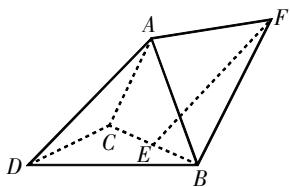
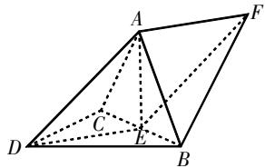
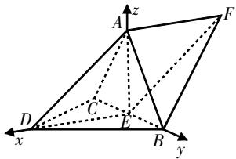
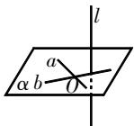
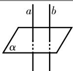
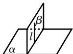
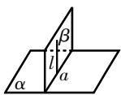
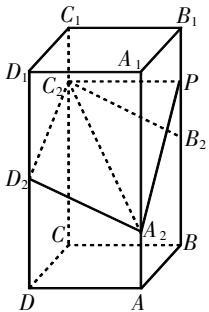
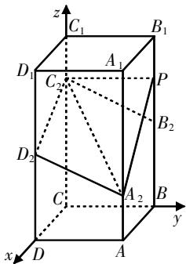

# 关于一道立体几何 考题的探究总结与教学思考

钱梦迪 江苏省常熟市中学 215500

[摘 要] 立体几何是高中数学知识的核心, 是高考的考查重点, 围绕考题开展探究总结有助于提升学生的解题能力. 同时, 考题的求解思路和方法的构建, 对学生的复习备考有一定的指导作用. 文章结合考题开展解题探究、方法总结, 并提出相应的教学建议.

[关键词] 立体几何;证明;二面角;向量法

# 问题综述

立体几何常作为高考压轴题,综合考查学生对知识定理的掌握情况,以及推理分析立体几何的能力,对学生的立体几何观有较高的要求.

立体几何考题的第(1)问通常为几何位置关系的证明问题,可采用传统的几何分析法解决,问题涉及平行和垂直关系,或者体积、表面积等.

第(2)问通常为核心之问,可通过建系,利用向量法解决,问题常涉及线面角、二面角的求解,或者已知线面角、面面角,求参数的值.

# 考题探究

# 1. 考题呈现,思路引导

考题1（2023年新高考Ⅱ卷第20题）如图1所示，三棱锥A-BCD中，

text_image

Geometric diagram of a parallelogram with labeled vertices A, B, C, D, E, F and internal diagonals

图1

$DA = DB = DC, BD \perp CD, \angle ADB = \angle ADC = 60^{\circ}, E$ 为 $BC$ 的中点.

(1)证明: $BC \perp DA$ ;   
(2) 点 F 满足 $\overrightarrow{EF} = \overrightarrow{DA}$ ，求二面角 D-AB-F 的正弦值.

思路引导 本题为立体几何综合题,题设两问,建议基于立体几何知识来引导思路.

(1)该问证明两直线垂直,总体思路是证明BC垂直DA所在的平面ADE. 具体思路引导如下:E为BC的中点→BC⊥DE;△ACD,△ABD为等边三角形→AB=AC→BC⊥AE→BC⊥平面ADE→BC⊥DA.   
(2)该问求解的是二面角的正弦值,属于二面角问题.可采用空间向量法,即建立空间直角坐标系,得到两平面的法向量,根据对应公式求解.具体思路引导如下:求 $DE,AE\rightarrow AE$ ,BC,DE两两垂直→建立空间直角坐标系→点的坐标→平面ABD的法向量和平面ABF的法向量→二面角D-AB-F的正弦值.

# 2. 过程构建,解后思考

(1)根据上述总结的解题思路，

下面分步进行证明.

第一步,证明等边,提取特性.

因为DB=DC, 点E为BC的中点, 所以 $BC \perp DE$ (等腰三角形的性质——“三线合一”, 是解题的关键). 因为DA=DB=DC, $\angle ADB = \angle ADC = 60^{\circ}$ , 所以 $\triangle ABD$ , $\triangle ACD$ 均为等边三角形, 所以AB=AC. 又点E为BC的中点, 所以 $BC \perp AE$ .

第二步,应用定理,证明垂直.

连接AE, DE, 如图2所示. 由于 AE, DE ⊂ 平面 ADE, AE ∩ DE = E, 所以 BC ⊥ 平面 ADE. 又 AD ⊂ 平面 ADE, 所以 BC ⊥ DA. (证明异面直线垂直的基本方法是: 转化为线面垂直)

text_image

Geometric diagram of a polyhedron with labeled vertices A, B, C, D, E, F and solid/dashed edges indicating hidden edges.

图2

(2)求解二面角的正弦值,可采用空间向量法. 下面同样采用分步策略.

第一步,分析几何,推导条件.

设BC=2,由已知得DA=DB=DC= $\sqrt{2}$ . 由于DE为等腰直角三角形BCD斜边BC的中线,所以DE=1. 由已知得AB=AC= $\sqrt{2}$ , $AB^{2}+AC^{2}=BC^{2}$ ,所以 $\triangle ABC$ 也为等腰直角三角形,则AE=1. 所以 $AE^{2}+DE^{2}=AD^{2}$ ,逆推可得 $AE\perp DE$ . 由(1)可知 $BC\perp DE$ , $BC\perp AE$ ,所以AE,BC,DE两两垂直.

第二步,构建空间直角坐标系,
推导法向量.

以E为原点,ED,EB,EA所在直线分别为x轴、y轴、z轴,建立如图3所示的空间直角坐标系.

text_image

3D geometric diagram of a pyramid with labeled vertices and coordinate axes (x, y, z)

图3

根据线段长可得 $A(0,0,1),B(0,1,0),C(0,-1,0),D(1,0,0),E(0,0,0)$ 所以 $\overrightarrow{AB} = (0,1, - 1)$ .因为 $\overrightarrow{EF} = \overrightarrow{DA} =$ $(-1,0,1)$ ，所以 $F(-1,0,1),\overrightarrow{BF} = (-1,$ $-1,1)$

设平面ABD的法向量 $m=(x,y,z)$ ，则 $\left\{\begin{aligned}\boldsymbol{m}\cdot\overrightarrow{AB}&=0,\\ \boldsymbol{m}\cdot\overrightarrow{DA}&=0,\end{aligned}\right.$ 即 $\left\{\begin{aligned}y-z&=0,\\ -x+z&=0,\end{aligned}\right.$ 解得 $\left\{\begin{aligned}x&=z,\\ y&=z.\end{aligned}\right.$ 令z=1，可得平面ABD的一个法向量 $m=(1,1,1)$ .

设平面ABF的法向量 $n=(u,v,w)$ ，则 $\left\{\begin{aligned}\boldsymbol{n}\cdot\overrightarrow{AB}=0,\\ \boldsymbol{n}\cdot\overrightarrow{BF}=0,\end{aligned}\right.$ 即 $\left\{\begin{aligned}v-w=0,\\ -u-v+w=0,\end{aligned}\right.$ 解得 $\left\{\begin{aligned}u=0,\\ v=w.\end{aligned}\right.$ 令w=1，可得平面ABF的一个法向量 $n=(0,1,1)$ .

第三步,应用定理,求解二面角.

设二面角D-AB-F的平面角的大小为 $\theta$ ，可得 $|\cos\theta|=\frac{|m\cdot n|}{|m|\cdot|n|}=\left|\frac{(1,1,1)\cdot(0,1,1)}{\sqrt{3}\cdot\sqrt{2}}\right|=\frac{\sqrt{6}}{3}$ ，所以 $\sin\theta=\sqrt{1-\cos^{2}\theta}=\frac{\sqrt{3}}{3}$ ，即二面角D-AB-F的正弦值为 $\frac{\sqrt{3}}{3}$ .

解后反思 上述问题为立体几何解析证明题,其中第(2)问为核心之问,分三步解析. 第一步为关键的几何分析,推导垂直条件;第二步根据垂直条件构建空间直角坐标系,推导出法向量;第三步根据法向量求解二面角的正弦值. 解析二面角问题时需要理解以下三点.

①用法向量求二面角的大小或三角函数值. 先分别求出二面角的两个半平面所在平面的法向量, 然后利用向量数量积公式完成运算. 要注意结合实际图形来判断所求二面角是锐二面角还是钝二面角.  
②方向向量法. 分别在二面角的两个半平面内找到与二面角的棱垂直且以垂足为起点的两个向量, 则可确定这两个向量的夹角的大小就是二面角的大小.  
③二面角的夹角特点. 二面角的平面角的大小与两平面的法向量的夹角可能相等,也可能互补.

# 知识总结

上述考题,涉及几何位置关系的证明和二面角的运算,这是该类问题最常见的考查.具体求解时,可利用立体几何的性质定理来证明第(1)问的位置关系,利用空间向量法来解析第(2)问的二面角的正弦值.下面进行知识衔接和总结.

# 1. 几何位置关系的总结

证明线面位置关系在立体几何题中十分重要,具体分析时需要把握以下两点:一是证明线面平行、垂直关系的指导思想是线线、线面、面面关系的相互转化,交替使用平行、垂直的判定定理和性质定理;二是线线关系是线面关系、面面关系的基础,证明过程中要注意利用平面几何中的一些结论,如证明平行时常用的中位线定理、平行线分线段成比例定理,证明垂直时常用的等腰三角形中线定理等.

(1)直线与平面垂直的判定定理和性质定理见表1.   
(2)平面与平面垂直的判定定理和性质定理见表2.   
(3)垂直间的三种转化关系:线线垂直 $\xrightarrow{判定定理}$ 线面垂直 $\xrightarrow{判定定理}$ 面面垂直.

# 2. 向量法解析空间夹角

# (1)思路构建

立体几何中的夹角有多种类型，常见的有：异面直线的夹角、直线与平面所成的角、两平面所成的角（二面角）。对于后两个夹角问题，可使用向量法来求解。分步构建思路如下：

第一步,常规的几何分析,即推导线段长、几何位置关系;

第二步,根据几何特征,构建空间直角坐标系,并推导关键点的空间坐标;

表1

<table><tr><td></td><td>文字语言</td><td>图形语言</td><td>符号语言</td></tr><tr><td>判定定理</td><td>一条直线与一个平面内的两条相交直线都垂直,则该直线与此平面垂直</td><td></td><td> $\left.\begin{matrix}a,b\subset\alpha \\a\cap b=0\\l\perp a\\l\perp b\end{matrix}\right\} \Rightarrow l\perp\alpha$ </td></tr><tr><td>性质定理</td><td>垂直于同一个平面的两条直线平行</td><td></td><td> $\left.\begin{matrix}a\perp\alpha \\b\perp\alpha\end{matrix}\right\} \Rightarrow a//b$ </td></tr></table>

表2

<table><tr><td></td><td>文字语言</td><td>图形语言</td><td>符号语言</td></tr><tr><td>判定定理</td><td>一个平面过另一个平面的垂线,则这两个平面垂直</td><td></td><td> $\left. \begin{array}{l} l \perp \alpha \\ l \subset \beta \end{array} \right\} \Rightarrow \alpha \perp \beta$ </td></tr><tr><td>性质定理</td><td>两个平面垂直,则一个平面内垂直于交线的直线与另一个平面垂直</td><td></td><td> $\left. \begin{array}{l} \alpha \perp \beta \\ l \subset \beta \\ \alpha \cap \beta = a \\ l \perp a \end{array} \right\} \Rightarrow l \perp \alpha$ </td></tr></table>

第三步,获得直线的方向向量和平面的法向量,具体求解时可通过除参数化简方向向量和法向量;

第四步,结合向量法中的公式定理求解直线与平面所成的角或两平面所成的角(二面角).

# (2)公式定理

直线与平面所成的角:设直线l的方向向量为a,平面 $\alpha$ 的一个法向量为n,直线l与平面 $\alpha$ 所成的角为 $\theta$ ,则① $\cos\langle a,n\rangle=\frac{a\cdot n}{|a||n|}$ ;② $\sin\theta=|\cos\langle a,n\rangle|$ .

平面与平面所成的角(二面角): 平面 $\alpha$ 的一个法向量为 $n_{1}$ ，平面 $\beta$ 的一个法向量为 $n_{2}$ ，平面 $\alpha$ 与平面 $\beta$ 所成的角为 $\theta$ ，则① $\cos\langle n_{1},n_{2}\rangle=\frac{n_{1}\cdot n_{2}}{|n_{1}||n_{2}|}$ ；② $\cos\theta=\pm\cos\langle n_{1},n_{2}\rangle$ .

# 拓展探究

上述总结了立体几何综合题的求解思路及方法,下面结合考题进一步开展探究分析.

考题2（2023年新高考Ⅰ卷第18题）如图4所示，在正四棱柱ABCD- $A_{1}B_{1}C_{1}D_{1}$ 中，AB=2, $AA_{1}=4$ . 点 $A_{2},B_{2},C_{2},D_{2}$ 分别在棱 $AA_{1},BB_{1},CC_{1},DD_{1}$ 上， $AA_{2}=1,BB_{2}=DD_{2}=2,CC_{2}=3$ .

(1)证明: $B_{2}C_{2}//A_{2}D_{2};$

(2) 点 P 在棱 $BB_{1}$ 上, 当二面角 $P-A_{2}C_{2}-D_{2}$ 为 $150^{\circ}$ 时, 求 $B_{2}P$ .

text_image

C₁
B₁
D₁
A₁
C₂
P
B₂
D₂
C
A₂
B
D
A

图4

分析 (1) 可以利用平行四边形的性质证明线线平行, 也可以利用向量共线定理证明线线平行.

(2)建立空间直角坐标系,利用求二面角的公式定理列方程求解.

解析 (1)(解法1)取 $DD_{2}$ 的中点E, 取 $CC_{1}$ 的中点F, 则CF=2, 连接EF, $FB_{2}, B_{2}A_{2}, EA_{2}$ . 根据题意得 $ED\parallel AA_{2}$ , 且 $ED=AA_{2}$ , 所以四边形 $AA_{2}ED$ 是平行四边形, 所以 $A_{2}E\parallel AD$ , 且 $A_{2}E=AD$ . 同理 $B_{2}F\parallel BC$ , 且 $B_{2}F=BC$ . 因为四边形ABCD是正方形, 所以 $BC\parallel AD$ , 且 $BC=AD$ . 所以 $A_{2}E\parallel B_{2}F$ , 且 $A_{2}E=B_{2}F$ . 所以四边形 $A_{2}EFB_{2}$ 是平行四边形. 所以 $A_{2}B_{2}\parallel EF$ , 且 $A_{2}B_{2}=EF$ . 同理, 四边形 $C_{2}FED_{2}$ 是平行四边形. 所以 $D_{2}C_{2}\parallel EF$ , 且 $D_{2}C_{2}=EF$ . 根据传递性可得 $D_{2}C_{2}\parallel A_{2}B_{2}$ , 且 $D_{2}C_{2}=A_{2}B_{2}$ . 所以四边形 $D_{2}C_{2}B_{2}A_{2}$ 是平行四边形. 所以 $B_{2}C_{2}\parallel A_{2}D_{2}$ .

(解法2)以C为原点,CD,CB, $CC_{1}$ 所在直线分别为x轴、y轴、z轴建立空间直角坐标系,如图5所示,则 $\overrightarrow{B_{2}C_{2}}=(0,-2,1),\overrightarrow{A_{2}D_{2}}=(0,-2,1)$ ,所以 $\overrightarrow{B_{2}C_{2}}=\overrightarrow{A_{2}D_{2}}$ .所以 $B_{2}C_{2}\parallel A_{2}D_{2}$ .

(2)以C为原点,CD,CB, $CC_{1}$ 所在直线分别为x轴、y轴、z轴建立空间直角坐标系，如图5所示.设 $P(0,2,\lambda)$ $(0\leqslant\lambda\leqslant4)$ ，则 $\overrightarrow{A_{2}C_{2}}=(-2,-2,2),\overrightarrow{PC_{2}}=(0,-2,3-\lambda),\overrightarrow{D_{2}C_{2}}=(-2,0,1)$ .

text_image

z
C₁
B₁
D₁
A₁
P
C₂
B₂
D₂
C
A₂
B
y
x
D
A

图5

设平面 $PA_{2}C_{2}$ 的法向量 $\boldsymbol{n}=(x,y,$ $z)$ ，则 $\left\{\begin{aligned}\boldsymbol{n}\cdot\overrightarrow{A_{2}C_{2}}=-2x-2y+2z=0,\\ \boldsymbol{n}\cdot\overrightarrow{PC_{2}}=-2y+(3-\lambda)z=0.\end{aligned}\right.$ 令 z=2，

得 $y=3-\lambda,x=\lambda-1$ ，所以 $n=(\lambda-1,3-\lambda,2)$ .

设平面 $A_{2}C_{2}D_{2}$ 的法向量 $m=(a,b,$ c)，则 $\left\{\begin{aligned}\boldsymbol{m}\cdot\overrightarrow{A_{2}C_{2}}=-2a-2b+2c=0,\\ \boldsymbol{m}\cdot\overrightarrow{D_{2}C_{2}}=-2a+c=0.\end{aligned}\right.$ 令 a=1，

得b=1,c=2,则 $m=(1,1,2)$ .

由此可得 $|\cos \langle n, m \rangle| = \frac{|n \cdot m|}{|n||m|} =$

$$
\frac {6}{\sqrt {6} \sqrt {4 + (\lambda - 1) ^ {2} + (3 - \lambda) ^ {2}}} = | \cos 1 5 0 ^ {\circ} | =
$$

$\frac{\sqrt{3}}{2}$ ，化简得 $\lambda^{2}-4\lambda+3=0$ ，解得 $\lambda=1$ 或 $\lambda=3$ 。所以点 $P(0,2,1)$ 或 $P(0,2,3)$ 。所以 $B_{2}P=1$ 。

评析 上述考题同为立体几何综合题,第(1)问是基础题,考查常规的直线平行关系. 第(2)问是二面角问题,逆向设定二面角的大小,求解线段长. 同样采用空间向量法,利用求二面角的公式定理列方程,解出参数后求得线段长.

# 教学思考

立体几何是高中数学的重点知识,探究教学中需要教师结合图形开展知识指导,引导学生深刻理解其中的性质定理,并构建解析证明思路.下面提出三点建议.

# 建议1: 数形结合, 知识解读

立体几何知识内容具有很强的逻辑性,学生学习时存在一定的困难,需要教师结合图形开展知识指导,引导学生从空间视角审视其中的位置关系,通过设定特殊模型理解其中的性质定理. 知识解读可以分为三个环节:一是模型构建,数形分析;二是特例分析,理解定理;三是语言转化,深刻理解.

# 建议2: 方法总结, 思路构建

立体几何题型多样,但对其分析可以汇总成相应的类型题. 教学中教师可以针对类型题来总结方法,构建解题思路策略. 以上述考题为例,涉及几何位置关系和二面角,探究教学中教师可以结合问题特征梳理方法,如线线垂直、线面垂直、面面垂直,以及向量法证明几何位置关系、求解二面角,形成分步构建策略.

# 建议3:适度拓展,发散思维

拓展探究是解题教学的重要环节之一,教学中需要教师结合考题适度拓展,引导学生深刻理解知识,发散思维. 拓展探究建议分三个阶段:一是结合核心知识精选问题,引导学生分析问题特点,挖掘本质;二是让学生自主思考,探索解题方法;三是引导学生解后反思方法,总结经验.