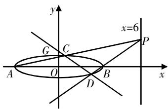
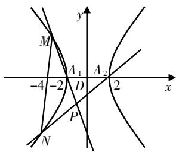
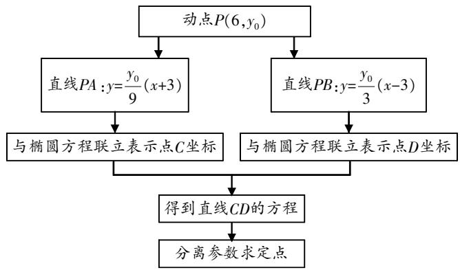
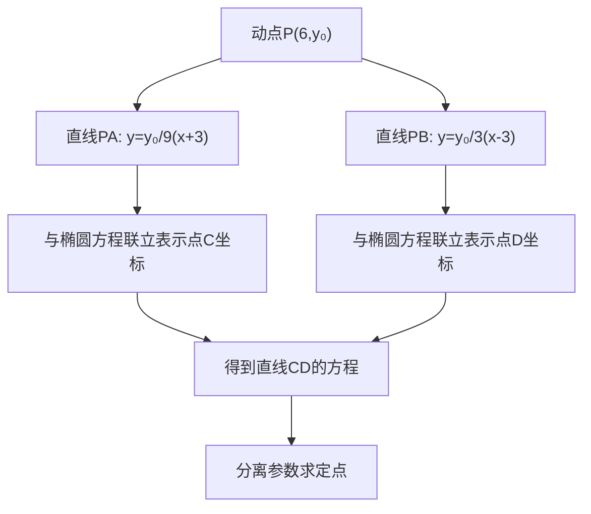
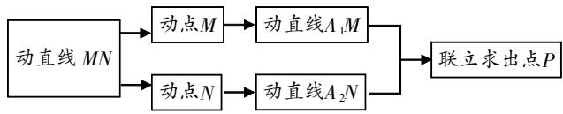
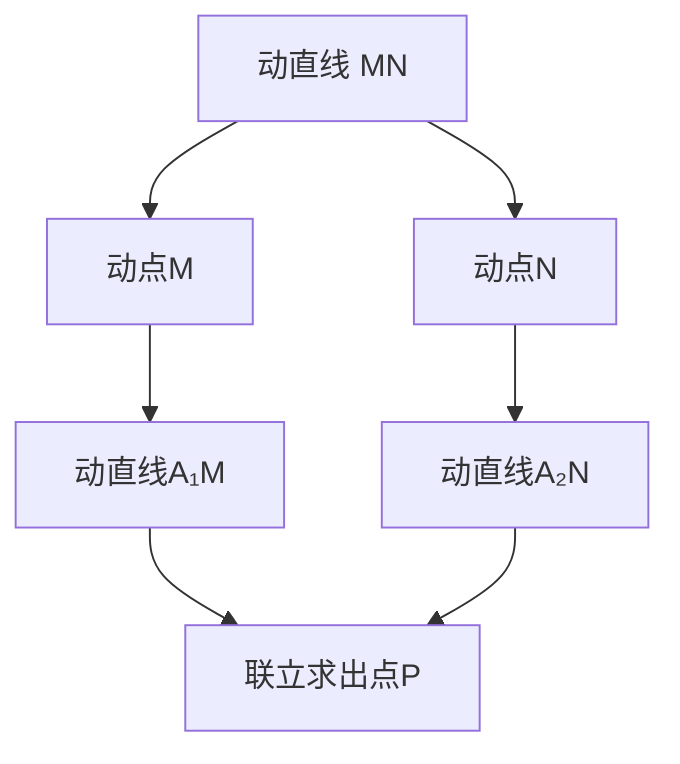
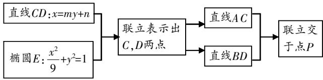
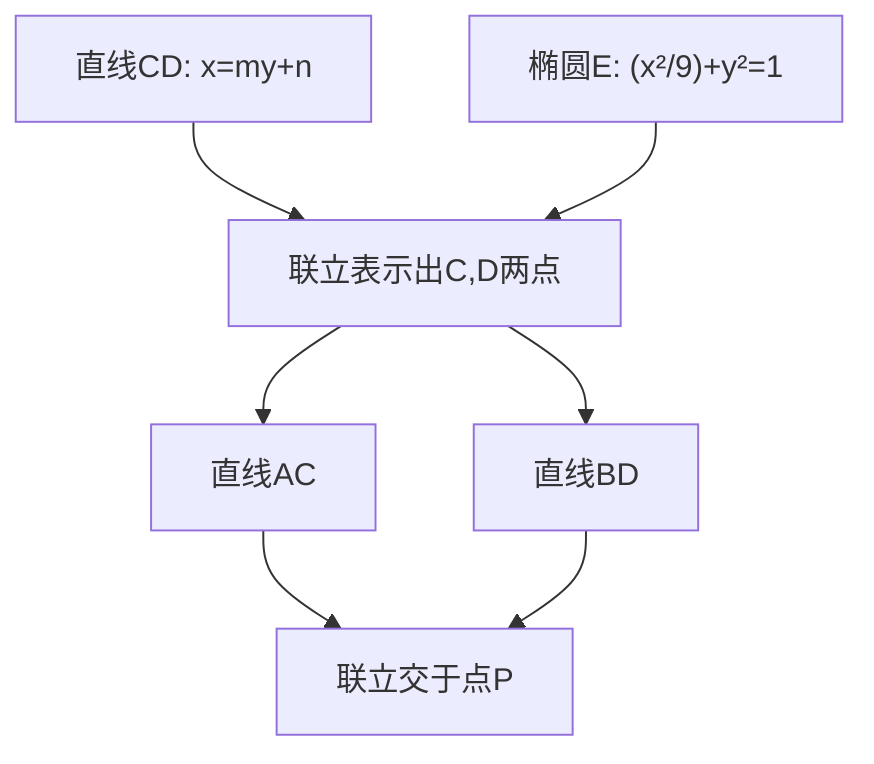
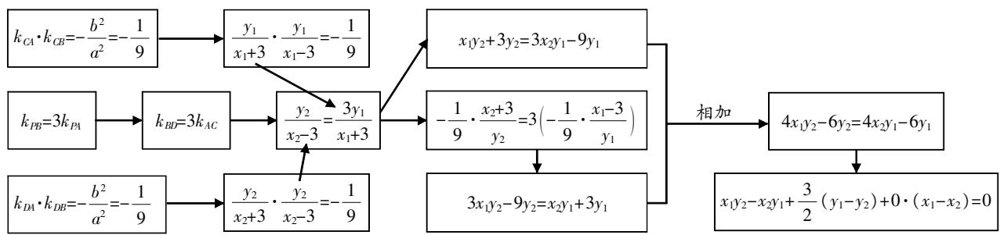
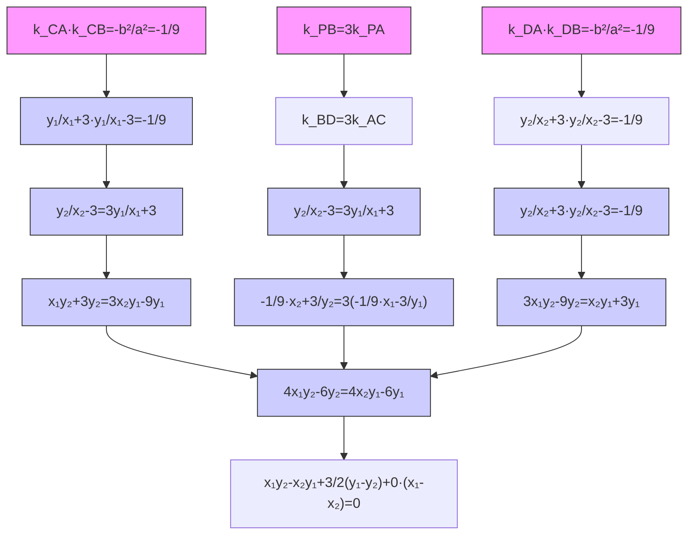

# 多视角探究高考解析几何问题

周跃佳 云南省昆明市第三中学 650500

[摘 要] 文章以两道高考解析几何试题为载体,多角度探究解决方法.从运动变化的源头上由因导果,顺势而为;以目标为导向由果索因,逆向思考;从斜率双用的角度建立直线方程;从二次曲线系的角度用一次(直线)建构二次;通过平移齐次化建构直线斜率的和积关系;通过二次曲线的极点、极线来解决定点、定直线问题.

[关键词] 解析几何;多视角;定点;定直线

解析几何的研究对象是几何,研究方法是解析法,对象的载体是直线与圆锥曲线. 在点或线的运动变化中蕴藏着的不变性成为高考解析几何试题探究的主要内容,就是这种变与不变为高考命题增添了新意,为考生解题增加了挑战. 为方便高三师生在二轮、三轮复习或高考冲刺阶段从多维度、多视角拓宽解题思路,提高解题效率,笔者以两道高考解析几何试题为例,展开多视角探究,与同行交流.

# 试题呈现

例1（2020年高考全国Ⅰ卷理科第20题）已知A,B分别为椭圆 $E:\frac{x^{2}}{a^{2}}+y^{2}=1(a>1)$ 的左、右顶点,G为E的上顶点, $\overrightarrow{AG}\cdot\overrightarrow{GB}=8,P$ 为直线x=6上的动点,PA与E的另一交点为C,PB与E的另一交点为D.

(1)求E的方程；  
(2)证明:直线CD过定点.

例2（2023年高考全国Ⅱ卷第21题）已知双曲线C的中心为坐标原点，左焦点为 $(-2\sqrt{5},0)$ ，离心率为 $\sqrt{5}$ .

(1)求C的方程;  
(2)记C的左、右顶点分别为 $A_{1},A_{2}$ ，过点 $(-4,0)$ 的直线与C的左支交于M,N两点，M在第二象限，直线 $MA_{1}$ 与 $NA_{2}$ 交于点P，证明：点P在定直线上.

text_image

y
x=6
G C
P
A O B x
D

图1

text_image

M
-4 -2 A₁ D A₂ 2 x
P
N
y

图2

# 多视角分析(例1、例2的第(2)问)

# 视角1 从源头来看

例1的源头是动点 $P(6,y_{0})$ : 点P的变化引起直线PA和PB的变化, 而直线PA和PB的变化引起交点C,D的变化, 即直线CD随之变化. 顺着以上思路完成以下工作(见图3), 即可解决这个问题.

证明 设 $P(6, y_0)$ , 则直线 $AP$ 的方程为 $y = \frac{y_0 - 0}{6 - (-3)} (x + 3)$ , 即 $y = \frac{y_0}{9} (x + 3)$ .

联立直线AP的方程与椭圆的方程,有 $\left\{\begin{aligned}\frac{x^{2}}{9}+y^{2}=1,\\ y=\frac{y_{0}}{9}(x+3),\end{aligned}\right.$ 整理

flowchart

图3

得 $(y_0^2 + 9)x^2 + 6y_0^2x + 9y_0^2 - 81 = 0$ ，解得 $x = -3$ 或 $x = \frac{-3y_0^2 + 27}{y_0^2 + 9}$ .

将 $x=\frac{-3y_{0}^{2}+27}{y_{0}^{2}+9}$ 代入直线 $y=\frac{y_{0}}{9}(x+3)$ ，得 $y=\frac{6y_{0}}{y_{0}^{2}+9}$ 。所以点C的坐标为 $\left(\frac{-3y_{0}^{2}+27}{y_{0}^{2}+9},\frac{6y_{0}}{y_{0}^{2}+9}\right)$ 。同理可得点D的坐标为 $\left(\frac{3y_{0}^{2}-3}{y_{0}^{2}+1},\frac{-2y_{0}}{y_{0}^{2}+1}\right)$ 。

当 $y_{0}^{2}\neq3$ 时，直线CD的方程为 $y+\frac{2y_{0}}{y_{0}^{2}+1}=\frac{\frac{6y_{0}}{y_{0}^{2}+9}+\frac{2y_{0}}{y_{0}^{2}+1}}{\frac{-3y_{0}^{2}+27}{y_{0}^{2}+9}-\frac{3y_{0}^{2}-3}{y_{0}^{2}+1}}\cdot\left(x-\frac{3y_{0}^{2}-3}{y_{0}^{2}+1}\right)$ ，整理得 $y+\frac{2y_{0}}{y_{0}^{2}+1}=\frac{8y_{0}(y_{0}^{2}+3)}{6(9-y_{0}^{2})}\left(x-\frac{3y_{0}^{2}-3}{y_{0}^{2}+1}\right)=\frac{8y_{0}}{6(3-y_{0}^{2})}\cdot\left(x-\frac{3y_{0}^{2}-3}{y_{0}^{2}+1}\right)$ ，即 $y=\frac{4y_{0}}{3(3-y_{0}^{2})}x+\frac{2y_{0}}{y_{0}^{2}-3}=\frac{4y_{0}}{3(3-y_{0}^{2})}\left(x-\frac{3}{2}\right)$ ，所以直线CD过定点 $\left(\frac{3}{2},0\right)$ .

当 $y_{0}^{2}=3$ 时, 直线CD的方程为 $x=\frac{3}{2}$ , 所以直线CD过定点 $\left(\frac{3}{2},0\right)$ .

综上所述,直线CD过定点 $\left(\frac{3}{2},0\right)$ .

例2的源头是动直线MN: 直线MN的变化引起点M和N的变化, 于是直线 $A_{1}M$ 和 $A_{2}N$ 随之而变, 两直线的交点P也随之而变. 顺着以上思路完成以下工作(见图4), 即可解决这个问题.

flowchart

图4

证明 由第(1)问可得 $A_{1}(-2,0)$ , $A_{2}(2,0)$ , 设 $M(x_{1},y_{1})$ ,$N(x_{2},y_{2})$ ，显然直线MN的斜率不为0，所以设直线MN的方程为x=my-4，且 $-\frac{1}{2}<m<\frac{1}{2}$ ，与 $\frac{x^{2}}{4}-\frac{y^{2}}{16}=1$ 联立可得 $(4m^{2}-1)y^{2}-32my+48=0$ ，则 $\Delta=64(4m^{2}+3)>0,y_{1}+y_{2}=\frac{32m}{4m^{2}-1},y_{1}y_{2}=\frac{48}{4m^{2}-1}$ .

直线 $MA_{1}$ 的方程为 $y=\frac{y_{1}}{x_{1}+2}(x+2)$ ，直线 $NA_{2}$ 的方程为 $y=\frac{y_{2}}{x_{2}-2}(x-2)$ 。联立直线 $MA_{1}$ 与直线 $NA_{2}$ 的方程，得 $\frac{x+2}{x-2}=$ $\frac{y_{2}(x_{1}+2)}{y_{1}(x_{2}-2)}=\frac{y_{2}(my_{1}-2)}{y_{1}(my_{2}-6)}=\frac{my_{1}y_{2}-2(y_{1}+y_{2})+2y_{1}}{my_{1}y_{2}-6y_{1}}=$ $\frac{m\cdot\frac{48}{4m^{2}-1}-2\cdot\frac{32m}{4m^{2}-1}+2y_{1}}{m\cdot\frac{48}{4m^{2}-1}-6y_{1}}=\frac{-16m}{4m^{2}-1}+2y_{1}}{\frac{48m}{4m^{2}-1}-6y_{1}}=-\frac{1}{3}.$

由 $\frac{x+2}{x-2}=-\frac{1}{3}$ ，得x=-1，即 $x_{P}=-1$ 。因此，点P在定直线x=-1上。

# 视角2 从目标来看

例1的目标是直线CD, 直线CD与椭圆交于C, D两点, 直线AC与BD交于点P. 顺着以上思路完成以下工作(见图5), 即可解决这个问题.

flowchart

图5

上述思路可行,但是通过求C,D两点的坐标去求直线AC和BD的方程,运算较为复杂,有没有简化运算,绕开求C,D两点坐标的方法呢?可以尝试将C,D两点与已知点B联系起来.由于 $k_{CA}=\frac{y_{0}}{9},k_{CA}\cdot k_{CB}=-\frac{1}{9}$ ,因此 $k_{CB}=-\frac{1}{y_{0}}$ .又 $k_{BD}=\frac{y_{0}}{3}$ ,所以 $k_{BC}\cdot k_{BD}=-\frac{1}{3}$ ,即 $k_{BC}\cdot k_{BD}=\frac{y_{1}}{x_{1}-3}\cdot\frac{y_{2}}{x_{2}-3}=\frac{y_{1}y_{2}}{x_{1}x_{2}-3(x_{1}+x_{2})+9}=-\frac{1}{3}$ .这样就不需要求出C,D两点的坐标,使用韦达定理即可.

# 视角3 从直线斜率双用来看

例1 由 $k_{PB}=3k_{PA}$ ，得 $k_{BD}=3k_{AC}, x_{1}y_{2}+3y_{2}=3x_{2}y_{1}-9y_{1}$ ，由 $k_{CA}\cdot k_{CB}=-\frac{b^{2}}{a^{2}}=-\frac{1}{9}$ 和 $k_{DA}\cdot k_{DB}=-\frac{b^{2}}{a^{2}}=-\frac{1}{9}$ ，对 $k_{BD}=3k_{AC}$ 进行斜率双用替换，最终得到直线CD的一般式方程，进而发现直线CD

过定点(见图6).

斜率双用的前提结论：

(1) 若 $A(x_{1}, y_{1})$ ， $B(x_{2}, y_{2})$ 是椭圆 $\frac{x^{2}}{a^{2}} + \frac{y^{2}}{b^{2}} = 1 (a > b > 0)$ 上任意两点，则 $k_{AB} = \frac{y_{1} - y_{2}}{x_{1} - x_{2}} = -\frac{b^{2}}{a^{2}} \cdot \frac{x_{1} + x_{2}}{y_{1} + y_{2}}$ ;

若 $A(x_{1},y_{1})$ ， $B(x_{2},y_{2})$ 是双曲线 $\frac{x^{2}}{a^{2}}-\frac{y^{2}}{b^{2}}=1(a>0,b>0)$ 上任意两点，则 $k_{AB}=\frac{y_{1}-y_{2}}{x_{1}-x_{2}}=\frac{b^{2}}{a^{2}}\cdot\frac{x_{1}+x_{2}}{y_{1}+y_{2}}$ ;

若 $A(x_{1},y_{1}),B(x_{2},y_{2})$ 是抛物线 $y^{2}=2px$ 上任意两点，则 $k_{AB}=\frac{y_{1}-y_{2}}{x_{1}-x_{2}}=\frac{2p}{y_{1}+y_{2}}.$

(2) 直线 l 过 $P_{1}(x_{1}, y_{1})$ , $P_{2}(x_{2}, y_{2})$ 两点, $P(x, y)$ 为直线 l 上任意点, 则直线 l 的两点式方程为 $\frac{y - y_{1}}{y_{2} - y_{1}} = \frac{x - x_{1}}{x_{2} - x_{1}} \Leftrightarrow (y_{1} - y_{2})x - (x_{1} - x_{2})y + x_{1}y_{2} - x_{2}y_{1} = 0$ .

# 视角4 从二次曲线系来看(二次曲线系方程的相关结论见文[1])

例1 设直线 $CD: x = my + n$ ，即 $x - my - n = 0$ ；直线 $CA: y = \frac{t}{9}(x + 3)$ ，即 $tx - 9y + 3t = 0$ ；直线 $BD: y = \frac{t}{3}(x - 3)$ ，即 $x - 3y - 3t = 0$ ；直线 $AB: y = 0$ 。

设过点A,B,C,D的二次曲线方程为 $(tx-9y+3t)(x-3y-3t)+\lambda y(x-my-n)=0$ ，整理得 $x^{2}+\frac{27-m\lambda}{t^{2}}y^{2}+\frac{\lambda-12t}{t^{2}}xy+\frac{18t-n\lambda}{t^{2}}y-9=0①$ 。椭圆 $E:\frac{x^{2}}{9}+y^{2}=1$ ，即 $x^{2}+9y^{2}-9=0②$ 。

由①②两式的系数对应相等, 得 $\left\{\begin{aligned}\lambda-12t=0,\\ 18t-n\lambda=0,\end{aligned}\right.$ 整理得 18t-12tn=0, 所以 $n=\frac{3}{2}$ , CD: $x=my+\frac{3}{2}$ , 所以直线 CD 过定点 $\left(\frac{3}{2},0\right)$ .

另外,也可以这样解答:

设 $P(6,t)$ ，则直线PA的方程为 $y=\frac{t}{9}(x+3)$ ，即tx-9y+3t=0.同理可得直线PB的方程为tx-3y-3t=0.

经过直线PA和直线PB的方程可写为 $(tx-9y+3t)(tx-3y-3t)=0$ ，化为 $t^{2}(x^{2}-9)+27y^{2}-12txy+18ty=0①$ .

易知A,B,C,D四点满足上述方程,同时A,B,C,D四点又在椭圆 $E:x^{2}-9=-9y^{2}$ 上,将其代入①式得 $(27-9t^{2})y^{2}-12txy+18ty=0$ ,即 $y[(27-9t^{2})y-12tx+18t]=0$ ,可得y=0或 $(27-9t^{2})y-12tx+18t=0$ .其中y=0表示直线AB,而 $(27-9t^{2})y-12tx+18t=0$ 表示直线CD.令y=0,得 $x=\frac{3}{2}$ ,即直线CD过定点 $\left(\frac{3}{2},0\right)$ .

例2 设直线MN:x=my-4, 即x-my+4=0; 直线 $A_{1}M$ : x=hy-2, 即 $x-hy+2=0$ ; 直线 $A_{2}N$ : x=ty+2, 即x-ty-2=0; 直线 $A_{1}A_{2}$ : y=0.

设过点M,N, $A_{1},A_{2}$ 的二次曲线方程为 $(x-hy+2)(x-ty-2)+\lambda y(x-my+4)=0$ ，整理得 $x^{2}+(ht-\lambda m)y^{2}+(\lambda-h-t)xy+(4\lambda+2h-2t)y-4=0①$ .双曲线 $C:\frac{x^{2}}{4}-\frac{y^{2}}{16}=1$ ，即 $x^{2}-\frac{1}{4}y^{2}-4=0②$ .

由①②两式的系数对应相等, 得 $\left\{\begin{aligned}\lambda-h-t=0,\\4\lambda+2h-2t=0,\end{aligned}\right.$ 即 $\left\{\begin{aligned}h&=-\frac{1}{2}\lambda,\\ t&=\frac{3}{2}\lambda.\end{aligned}\right.$ 所以 $A_{1}M:x=-\frac{1}{2}\lambda y-2,A_{2}N:x=\frac{3}{2}\lambda y+2.$ 联立 $A_{1}M,A_{2}N,$ 有 $\left\{\begin{aligned}x&=-\frac{1}{2}\lambda y-2,\\ x&=\frac{3}{2}\lambda y+2,\end{aligned}\right.$ 整理得x=-1.所以,点P在定直线x=-1上.

# 视角5 从平移齐次化来看

例1 将椭圆 $E:\frac{x^{2}}{9}+y^{2}=1$ 和直线x=6整体向左平移3个单

flowchart

图6

位,椭圆E的右顶点为坐标原点,得到曲线 $E^{\prime}:\frac{(x+3)^{2}}{9}+y^{2}=1$ (整理为 $x^{2}+9y^{2}+6x=0$ )和直线x=3.设直线CD经过同样的平移后的直线 $l^{\prime}:mx+ny=1$ ,将其代入 $x^{2}+9y^{2}+6x=0$ ,得 $x^{2}+9y^{2}+6x(mx+ny)=0$ ,整理得 $9\left(\frac{y}{x}\right)^{2}+6n\left(\frac{y}{x}\right)+6m+1=0$ .

令 $k=\frac{y}{x}$ ，方程 $9k^{2}+6nk+6m+1=0$ 的两根即 $B^{\prime}C^{\prime},B^{\prime}D^{\prime}$ 的斜率.据题意得 $k_{1}k_{2}=\frac{6m+1}{9}=-\frac{1}{3}$ ，解得 $m=-\frac{2}{3}$ ，所以直线 $l^{\prime}$ ： $-\frac{2}{3}x+ny=1$ ，过定点 $M^{\prime}\left(-\frac{3}{2},0\right)$ ，则直线CD过定点 $M\left(\frac{3}{2},0\right)$ .

例2 将双曲线 $C: \frac{x^{2}}{4}-\frac{y^{2}}{16}=1$ 和直线MN整体向右平移2个单位，双曲线的左顶点平移至坐标原点，得到曲线C： $\frac{(x-2)^{2}}{4}-\frac{y^{2}}{16}=1$ ，整理为 $4x^{2}-y^{2}-16x=0$ 。设直线MN经过同样的平移后的直线 $M^{\prime}N^{\prime}:mx+ny=1$ ，将其代入 $4x^{2}-y^{2}-16x=0$ ，得 $4x^{2}-y^{2}-16x(mx+ny)=0$ ，整理得 $\left(\frac{y}{x}\right)^{2}+16n\left(\frac{y}{x}\right)+16m-4=0$ 。

令 $k=\frac{y}{x}$ ，方程 $k^{2}+16nk+16m-4=0$ 的两根 $k_{1},k_{2}$ 即 $A_{1}^{\prime}M^{\prime}$ ， $A_{1}^{\prime}N^{\prime}$ 的斜率。据题意得 $k_{1}+k_{2}=-16n,k_{1}k_{2}=16m-4$ 。因为直线 $M^{\prime}N^{\prime}:mx+ny=1$ 过点 $(-2,0)$ ，所以 $m=-\frac{1}{2},k_{1}k_{2}=-12$ 。

令 $k_{3}=k_{N'A'}$ ，则 $k_{2}k_{3}=\frac{b^{2}}{a^{2}}=4$ ，所以 $\frac{k_{1}}{k_{3}}=-3$ 。设直线 $MA_{1}:y=k_{1}(x+2),NA_{2}:y=k_{3}(x-2)$ ，两式联立得 $k_{1}(x+2)=k_{3}(x-2)$ ， $\frac{x-2}{x+2}=\frac{k_{1}}{k_{3}}=-3,x=-1$ 。所以，点P在定直线x=-1上。

总结 已知平面内一定点 $A(m,n)$ 和圆锥曲线上两个动点P,Q, 当 $k_{AP}+k_{AQ}=k$ 或 $k_{AP}\cdot k_{AQ}=k$ 时, 可以用平移齐次化方法来解决, 解决步骤整理如下:

第一步,将直线与圆锥曲线平移,使题设中给定的点成为坐标原点.对于平移后的方程可以这样书写:x“左加右减”,y“下加上减”.

第二步,将平移后的直线方程设为 $mx+ny=1$ ,这样方便下一步代换“1”.

第三步,化简平移后的圆锥曲线方程,按各项次数排列整理为整系数方程后,将“mx+ny”乘到一次项上得到齐二次方程.两边同时除以 $x^{2}$ 得到关于k的一元二次方程,进而利用韦达定理解决问题.

# 视角6 从极点极线来看

例1 据题意可知, 直线CD所过定点与点P所在定直线是关于椭圆E的一组极点与极线. 直线CD过定点 $M(x_{0},0)$ ，椭圆 $E:\frac{x^{2}}{9}+y^{2}=1$ ，点P所在定直线为 $\frac{x_{0}x}{9}+0\cdot y=1$ ，即 $x=\frac{9}{x_{0}}$ ，即 $\frac{9}{x_{0}}=6$ ，所以 $x_{0}=\frac{3}{2}$ . 所以直线CD过定点 $M\left(\frac{3}{2},0\right)$ .

例2 据题意可知, 直线MN所过定点与点P所在定直线是关于双曲线C的一组极点与极线. 直线MN过定点 $M(-4,0)$ ，双曲线 $C:\frac{x^{2}}{4}-\frac{y^{2}}{16}=1$ ，点P所在定直线为 $\frac{-4x}{4}-\frac{0\cdot y}{16}=1$ ，即点P在定直线x=-1上.

极点、极线的相关结论：

已知圆锥曲线 $C:Ax^{2}+By^{2}+2Dx+2Ey+F=0(A^{2}+B^{2}\neq0)$ 的极点为 $A(x_{0},y_{0})$ ，极线 $l:Ax_{0}x+By_{0}y+D(x_{0}+x)+E(y_{0}+y)+F=0.$

(1)已知椭圆 $C:\frac{x^{2}}{a^{2}}+\frac{y^{2}}{b^{2}}=1(a>b>0)$ ，若点 $A(x_{0},y_{0})$ 是椭圆C上任意一点，其对应极线为：直线 $\frac{x_{0}x}{a^{2}}+\frac{y_{0}y}{b^{2}}=1$ ；  
(2)已知双曲线 $C:\frac{x^{2}}{a^{2}}-\frac{y^{2}}{b^{2}}=1(a>0,b>0)$ ，若点 $A(x_{0},y_{0})$ 是双曲线C上任意一点，其对应极线为：直线 $\frac{x_{0}x}{a^{2}}-\frac{y_{0}y}{b^{2}}=1$ ;  
(3)已知抛物线 $C:y^{2}=2px$ ，若点 $A(x_{0},y_{0})$ 是抛物线C上任意一点，其对应极线为：直线 $y_{0}y=p(x+x_{0})$ .

# 教学建议

针对上述六个不同视角,建议教师在日常教学中将视角1和视角2下的解决路径和运算过程示范到位,落实到位.有必要亲眼“目睹”学生的思考过程和运算过程,需要拿出“算不出结果誓不罢休”的气魄,因为这是考生必须熟练掌握的通性通法.对于视角3和视角4,需要教会学生其适用范围,识别试题特征,夯实基础知识.视角5是倍受学生喜爱的方法,建议以本文为例,找出近些年高考中的相关试题供学生专项训练.视角6则只适用于以极点、极线为背景设置的问题,虽然适用范围较窄,但考生如果熟悉,在解答相关问题时可以做到未卜先知,游刃有余.

# 参考文献：

[1] 周跃佳. 运用二次曲线系方程巧解高考解析几何试题[J]. 数学教学通讯, 2024(15): 91-93.