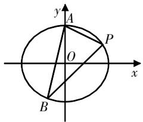
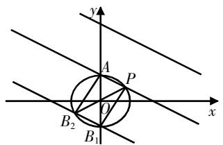
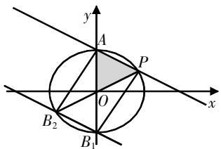
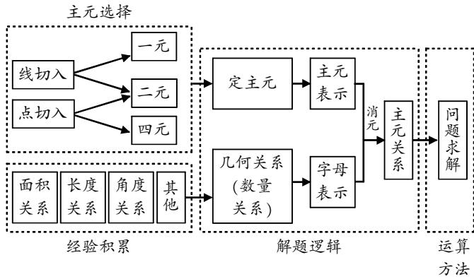
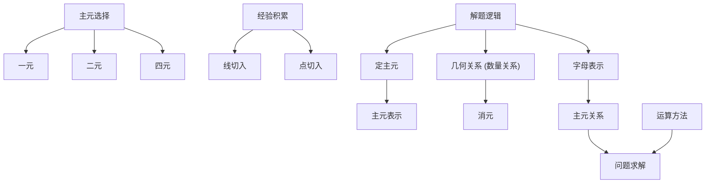

# 2024年高考数学新课标Ⅰ卷第16题的深度剖析和教学思考

邱志定 广东省韶关市第一中学 512000

[摘 要] 文章从代数和几何两个视角对2024年高考数学新课标Ⅰ卷第16题的解法进行分析,提出注重试题研究,构建解析几何问题的思维框架;注重多想少算,深化先几何后代数的思维习惯;注意通性通法,强化解析化思维的主元优选意识.

[关键词] 高考数学;解析几何;教学思考

# 真题再现

(2024年高考数学新课标Ⅰ卷第16题)已知A(0,3)和 $P\left(3,\frac{3}{2}\right)$ 为椭圆C: $\frac{x^{2}}{a^{2}}+\frac{y^{2}}{b^{2}}=1(a>b>0)$ 上两点.

(1)求C的离心率;   
(2)若过P的直线l交C于另一点B,且 $\triangle ABP$ 的面积为9,求l的方程.

试题分析 试题以椭圆为载体,综合考查椭圆的标准方程、椭圆的离心率、直线与椭圆的位置关系、三角形的面积公式、点到直线的距离公式等必备知识;着重考查直观想象能力、数学运算能力等关键能力;突出考查理性思维等学科素养.新课标Ⅰ卷调整了解析几何题的位置,提高了试题的灵活性,减少了死记硬背和机械刷题的引导,鼓励学生发散思维,打破唯一答案的限制.

# 解法分析

试题第(1)问体现了高考试题的“低起点”，突出对基础知识的考查；试题第(2)问体现了高考试题的“多层次”，突出对理性思维的考查。下文重在讨论试题第(2)问的解法。

# 1. 视角1:代数主导

将几何关系“ $\triangle ABP$ 的面积为9”转化为代数关系的主要策略是: 将两点间的距离确定为三角形的“底”, 另外一点到底边的距离确定为三角形的“高”。具体求解时可以直线 $PB$ 为主导, 即将直线 $PB$ 的斜率作为主元设取未知数;也可以直线AB为主导,即将直线AB的斜率作为主元设取未知数;还可以直线AP为主导,即将点B的坐标作为主元设取未知数.具体解法如下:

text_image

y
A
O
P
x
B

图1

(1)“线切入”的主元选择

解法1 将直线PB的斜率作为主元设取未知数.

若l的斜率不存在,则 $l:x=3,B\left(3,-\frac{3}{2}\right)$ , $|PB|=3,A$ 到PB的距离d=3,此时 $S_{\triangle ABP}=\frac{1}{2}\times3\times3=\frac{9}{2}\neq9$ ,不满足条件.

若l的斜率存在,设 $PB:y-\frac{3}{2}=k(x-3)$ , $P(x_{1},y_{1})$ , $B(x_{2},y_{2})$ .联立直线l和椭圆C的方程,得 $\left\{\begin{aligned}y&=k(x-3)+\frac{3}{2},\\ \frac{x^{2}}{12}&=\frac{y^{2}}{9}=1,\end{aligned}\right.$ 消除y得$(4k^{2} + 3)x^{2} - (24k^{2} - 12k)x + 36k^{2} - 36k - 27 = 0.$ 由韦达定理得 $\left\{ \begin{array}{l}x_{1} + x_{2} = \frac{24k^{2} - 12k}{4k^{2} + 3},\\ x_{1}x_{2} = \frac{36k^{2} - 36k - 27}{4k^{2} + 3}, \end{array} \right.$ 所以 $|PB| = \sqrt{k^2 + 1}\sqrt{(x_1 + x_2)^2 - 4x_1x_2} =$

$$
\frac {4 \sqrt {3} \sqrt {k ^ {2} + 1} \sqrt {3 k ^ {2} + 9 k + \frac {2 7}{4}}}{4 k ^ {2} + 3}.
$$

又点A到直线PB的距离 $d=\frac{\left|3k+\frac{3}{2}\right|}{\sqrt{k^{2}+1}}$ ，所以 $S_{\triangle PAB}=$ $\frac{1}{2}\cdot\frac{4\sqrt{3}\sqrt{k^{2}+1}\sqrt{3k^{2}+9k+\frac{27}{4}}}{4k^{2}+3}\cdot\frac{\left|3k+\frac{3}{2}\right|}{\sqrt{k^{2}+1}}=9$ ，整理得 $4k^{2}-8k+3=0$ , 解得 $k=\frac{1}{2}$ 或 $\frac{3}{2}$ . 经检验, 符合 $\Delta>0$ . 所以 l:y= $\frac{1}{2}x$ 或 $y=\frac{3}{2}x-3$ , 即 l:3x-2y-6=0 或 x-2y=0.

解法2 将直线AB的斜率作为主元设取未知数.

若直线AB的斜率不存在,则 $B(0,-3)$ , $S_{\triangle PAB}=\frac{1}{2}\times6\times3=9$ ,符合题意,直线l的方程为 $y=\frac{3}{2}x-3$ ,即3x-2y-6=0.

若直线AB的斜率存在,设直线AB的方程为 $y=kx+3$ .
联立直线AB和椭圆C的方程,得 $\left\{\begin{aligned}y&=kx+3,\\ \frac{x^{2}}{12}&+\frac{y^{2}}{9}=1,\end{aligned}\right.$ 消除y得 $(4k^{2}+3)x^{2}+24kx=0$ , 解得x=0或 $x=\frac{-24k}{4k^{2}+3}$ .

令 $x=\frac{-24k}{4k^{2}+3}$ ，则 $y=\frac{-12k^{2}+9}{4k^{2}+3}$ ， $B\left(\frac{-24k}{4k^{2}+3},\frac{-12k^{2}+9}{4k^{2}+3}\right)$ ，所以 $k_{AP}=\frac{3-\frac{3}{2}}{0-3}=-\frac{1}{2}$ ，直线AP的方程为 $y=-\frac{1}{2}x+3$ ，即 $x+2y-6=0$ .

又点B到直线PA的距离 $d=\frac{\left|\frac{-24k}{4k^{2}+3}+2\cdot\frac{-12k^{2}+9}{4k^{2}+3}-6\right|}{\sqrt{1^{2}+2^{2}}}=\frac{|48k^{2}+24k|}{\sqrt{5}(4k^{2}+3)}$ ， $|AP|=\sqrt{(0-3)^{2}+\left(3-\frac{3}{2}\right)^{2}}=\frac{3\sqrt{5}}{2}$ ，所以 $S_{\triangle PAB}=\frac{1}{2}\cdot\frac{3\sqrt{5}}{2}\cdot\frac{|48k^{2}+24k|}{\sqrt{5}(4k^{2}+3)}=9$ ，整理得2k=3。所以 $k=\frac{3}{2}$ 。经检验，符合 $\Delta>0$ 。所以 $B(-3,-\frac{3}{2})$ 。所以直线l的方程为 $y=\frac{1}{2}x$ ，即x-2y=0。

综上所述,直线l的方程为3x-2y-6=0或x-2y=0.

(2)“点切入”的主元选择

解法3 将点B的坐标作为主元设取未知数.

设 $B(x_{0},y_{0})$ ，点B在椭圆C上，则 $\frac{x_{0}^{2}}{12}+\frac{y_{0}^{2}}{9}=1$ .

由已知得 $k_{AP}=\frac{3-\frac{3}{2}}{0-3}=-\frac{1}{2}$ ，则直线AP的方程为 $y=-\frac{1}{2}x+$

3, 即 $x + 2y - 6 = 0$ . 所以点 $B$ 到直线 $PA$ 的距离 $d = \frac{|x_0 + 2y_0 - 6|}{\sqrt{1^2 + 2^2}} = \frac{|x_0 + 2y_0 - 6|}{\sqrt{5}}$ .

因为 $|AP| = \sqrt{(0 - 3)^2 + \left(3 - \frac{3}{2}\right)^2} = \frac{3\sqrt{5}}{2}$ ，所以 $S_{\triangle PAB} = \frac{1}{2} \cdot \frac{3\sqrt{5}}{2} \cdot \frac{|x_0 + 2y_0 - 6|}{\sqrt{5}} = 9$ ，整理得 $|x_0 + 2y_0 - 6| = 12$ ，则 $\left\{\begin{aligned}&|x_0 + 2y_0 - 6|=12,\\&\frac{x_0^2}{12} +\frac{y_0^2}{9}=1,\end{aligned}\right.$ 解得 $\left\{\begin{aligned}&x_0=-3,\\&y_0=-\frac{3}{2},\end{aligned}\right.$ 或 $\left\{\begin{aligned}&x_0=0,\\&y_0=-3,\end{aligned}\right.$ 即 $B(0,-3)$ 或 $(-3,-\frac{3}{2})$ .

当 $B(0,-3)$ 时，直线l的方程为 $y=\frac{3}{2}x-3$ ，即3x-2y-6=0；
当 $B\left(-3,-\frac{3}{2}\right)$ 时，直线l的方程为 $y=\frac{1}{2}x$ ，即x-2y=0.

综上所述,直线l的方程为3x-2y-6=0或x-2y=0.

解法4 将点B的坐标(椭圆的参数方程)作为主元设取未知数.

设 $B(2\sqrt{3}\cos\theta,3\sin\theta)$ ，其中 $\theta\in[0,2\pi)$ ，同解法3一样得到直线AP的方程为 $x+2y-6=0$ ，所以点B到直线AP的距离 $d=\frac{\left|2\sqrt{3}\cos\theta+6\sin\theta-6\right|}{\sqrt{5}}$ 。又 $|AP|=\frac{3\sqrt{5}}{2}$ ，所以 $S_{\triangle PAB}=\frac{1}{2}\cdot\frac{3\sqrt{5}}{2}\cdot\frac{\left|2\sqrt{3}\cos\theta+6\sin\theta-6\right|}{\sqrt{5}}=9$ ，整理得 $2\sqrt{3}\cos\theta+6\sin\theta-6|=12$ 。结合 $\cos^{2}\theta+\sin^{2}\theta=1$ ，解得 $\left\{\begin{aligned}\cos\theta&=-\frac{\sqrt{3}}{2},\\ \sin\theta&=-\frac{1}{2}\end{aligned}\right.$ 或 $\left\{\begin{aligned}\cos\theta&=0,\\ \sin\theta&=-1.\end{aligned}\right.$ 所以 $B(0,-3)$ 或 $\left(-3,-\frac{3}{2}\right)$ 。下同解法3。

# 2. 视角2: 几何主导

以“ $\triangle ABP$ 的面积为9”为几何关系,其中 $A(0,3)$ 和 $P\left(3,\frac{3}{2}\right)$ 是 $\triangle ABP$ 的两个顶点,几何主导视角,需要尽可能利用好已知定点 $A,P$ 的信息.若观察到 $AP$ 定长 $\frac{3\sqrt{5}}{2}$ ,则 $\triangle ABP$ 在边 $AP$ 上的高为定值 $\frac{12\sqrt{5}}{5}$ ,即点 $B$ 的运动轨迹是与直线 $AP$ 平行且距离为 $\frac{12\sqrt{5}}{5}$ 的直线,进而先求点 $B$ 的坐标,再求直线 $PB$ 的方程;若观察到 $\triangle AOP$ 的面积为 $\frac{9}{2}$ ,即9的一半,则可用对称性直接求出点 $B$ 的坐标,再求直线 $PB$

的方程.具体解法如下:

解法5 以点B的运动轨迹为切入视角.

因为 $A(0,3),P\left(3,\frac{3}{2}\right)$ ，所以 $|AP|=\sqrt{(0-3)^{2}+\left(3-\frac{3}{2}\right)^{2}}=\frac{3\sqrt{5}}{2}$ ，所以 $k_{AP}=\frac{3-\frac{3}{2}}{0-3}=-\frac{1}{2}$ ，直线AP的方程为 $y=-\frac{1}{2}x+3$ ，即 $x+2y-6=0$ 。设点B到直线AP的距离为d，由 $S_{\triangle APB}=\frac{1}{2}|AP|\cdot d=9$ ，得 $d=\frac{2\times9}{\frac{3\sqrt{5}}{2}}=\frac{12\sqrt{5}}{5}$ 。

将直线AP沿着与AP垂直的方向平移 $\frac{12\sqrt{5}}{5}$ 个单位即可得到满足条件的点B的轨迹(如图2所示). 设点B的轨迹(直线)方程为 $x+2y+C=0$ , 则 $\frac{|C+6|}{\sqrt{5}}=\frac{12\sqrt{5}}{5}$ , 解得C=6或C=-18.

text_image

y
A
P
O
x
B₂
B₁

图2

text_image

y
A
P
O
x
B₂
B₁

图3

当 $C = 6$ 时，联立 $\left\{ \begin{array}{l} \frac{x^2}{12} + \frac{y^2}{9} = 1, \\ x + 2y + 6 = 0, \end{array} \right.$ 解得 $\left\{ \begin{array}{l} x = 0, \\ y = -3 \end{array} \right.$ 或 $\left\{ \begin{array}{l} x = -3, \\ y = -\frac{3}{2}, \end{array} \right.$ 即 $B(0, -3)$ 或 $\left(-3, -\frac{3}{2}\right)$ .

当 $B(0,-3)$ 时, 直线l的方程为 $y=\frac{3}{2}x-3$ , 即3x-2y-6=0;

当 $B\left(-3,-\frac{3}{2}\right)$ 时，直线l的方程为 $y=\frac{1}{2}x$ ，即x-2y=0.

当 C = -18 时，联立 $\left\{\begin{aligned}\frac{x^{2}}{12} + \frac{y^{2}}{9} &= 1, \\ x + 2y - 18 &= 0,\end{aligned}\right.$ 得 $2y^{2} - 27y + 117 = 0$ ， $\Delta=27^{2}-4\times2\times117=-207<0$ ,该直线与椭圆无交点.

综上所述,直线l的方程为3x-2y-6=0或x-2y=0.

解法6 以 $\triangle APB$ 与 $\triangle AOP$ 的面积关系为切入视角.

观察可得 $\triangle AOP$ 的面积为 $\frac{9}{2}$ ，所以 $S_{\triangle ABP}=2S_{\triangle AOP}$

由图3可知,点B所在的直线与直线PA关于坐标原点对称.

因为点B在椭圆C上,所以由椭圆的对称性可得点B的坐标为 $(0,-3)$ 或 $\left(-3,-\frac{3}{2}\right)$ .

当 $B(0,-3)$ 时, 直线l的方程为 $y=\frac{3}{2}x-3$ , 即3x-2y-6=0;

当 $B\left(-3,-\frac{3}{2}\right)$ 时, 直线l的方程为 $y=\frac{1}{2}x$ , 即x-2y=0.

综上所述,直线l的方程为3x-2y-6=0或x-2y=0.

# 教学思考

# 1. 注重试题研究,构建解析几何问题的思维框架

解析几何试题是沟通几何与代数的重要学习媒介. 在教学中, 教师应基于真题研究, 从代数、几何两个角度引导学生积极思考, 逐步形成思维框架, 帮助学生积累数学活动经验, 并将这些经验文本化. 图4概括了上文所述的6种解法, 提炼出“代数视角的主元选择、几何视角的经验积累、代数与几何汇集后的解题逻辑、目标关系出现后的问题求解”的几何解答题的思维框架. 在教学中, 教师要积极引导学生应用思维框架自主探索解题思路, 学会科学思考.

flowchart

图4 几何解答题的思维框架

# 2. 注重多想少算,深化先几何后代数的思维习惯

“数”与“形”是解析几何的本质体现, 几何是缘起, 也是归宿. 在解析几何问题求解过程中“代数好想不好算, 几何好算不好想”, 教学要引导学生充分挖掘题目隐藏的几何条件, 努力实现代数表征的简洁表达, 以实现运算量的大幅降低. 因此, 教学中要注重培养学生的作图能力. 图形是应用数形结合思想的基础, 也是培养学生几何图形分析能力的关键. 培养良好作图能力后, 选题要尽可能保障每个题目都能从几何或代数视角进行求解, 以深化“先几何后代数”的思维习惯的培养.

# 3. 注意通性通法, 强化解析化思维的主元优选意识

解析化思维作为解析几何问题的通性通法,与运算能力紧密相关,指向学生数学运算素养的培养. 运算对象的明晰和运算程序的设计是影响解析几何运算量的关键环节. 教学时要引导学生思考不同研究对象对应的不同变量的关系表征,初步判断运算量的大小,进而筛选出运算量较小的解题思路. 因此,教师要不断引导学生从主元的角度切入,培养学生优选主元的意识.