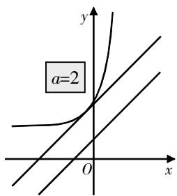

# 关于一道函数与不等式 考题的溯源与解法探究

——以2023年高考新课标Ⅰ卷第19题为例

许秋峰 江苏省张家港市沙洲中学 215600

[摘 要] 探究函数与不等式综合题,建议分五大环节进行:考点定位、溯源分析、过程解析、方法总结、拓展探究. 研究者以2023年高考新课标Ⅰ卷第19题为例,深入剖析函数与不等式综合题的求解教学策略,并提出相应的教学建议.

[关键词] 函数与不等式;溯源;解法探究

# 探究综述

高考真题凝聚众多优秀教师的智慧,其命制思路和解法策略具有一定的代表性,对教学备考具有一定的参考价值,因此教学中建议教师精选高考典型试题开展教学探究,引导学生明晰考题定位,掌握解题思路,总结解题方法,生成解题策略,以实现“解题通法”的效果.

函数与不等式综合题常作为高考压轴题,融合函数、不等式、导数、方程等知识内容,对学生的解题思维有较高要求,可综合考查学生的知识与方法技巧.探究教学可分为五个环节:

环节1 考题呈现,考点定位.

分析考题,确定知识点和考查重点. 解读时关注题干和问题两部分.

环节2 考题溯源,命题分析.

探索考题的来源和知识基础,了解其设计过程. 帮助学生理解考题背景和出题者的思路,并在需要时用图表直观展示.

环节3 过程解析,多解探究.

该环节旨在探究考题解析,特别是函数与不等式综合题的多种解法,引导学生使用不同的方法来解题.

环节4 知识汇总,方法总结.

该环节涉及考题解答后的知识和方法总结,是探究解题的关键,引导学生掌握考题的知识和方法背景,并总结归纳出类型题的解题策略.

环节5 类题探究,思维强化.

该环节旨在强化解题,引导学生深入探究题型,体验解题过程,独立运用知识和方法解决问题,加强解题思维.

# 考题呈现

(2023年高考新课标Ⅰ卷第19题)已知函数 $f(x)=a(\mathrm{e}^{x}+a)-x$ .

(1)讨论 $f(x)$ 的单调性；

(2) 证明: 当 a > 0 时, $f(x) > 2 \ln a + \frac{3}{2}$ .

本题是函数与不等式综合题,条件简洁,解析难度高. 题干给出一个含参函数 $f(x)$ ,并提出两个问题:第(1)问讨论函数 $f(x)$ 的单调性,涉及函数与导数的知识内容;第(2)问是不等式恒成立问题,考查不等式的证明方法. 总体上,本题涉及函数、导数和不等式等知识,求解时,可运用分类讨论以及转化与化归等思想方法.

# 考题溯源

本题的第(2)问为核心之问,其设计依托于凸函数的“切线不等式”原理,要求学生深入理解相关知识点,并掌握题目的构建方式.

# 1. 知识背景

知识内容:(凸函数的“切线不等式”)若 $f(x)$ 是区间I上的可微凸函数,则经过点 $(x_{0},f(x_{0}))(x_{0}\in I)$ 的切线一定在曲线 $y=f(x)$ 的下方,即不等式 $f(x)\geqslant f(x_{0})+f'(x_{0})(x-x_{0}),\forall x\in I$

成立.

若 $f(x)$ 为严格凸函数,则上述不等式取等号的充要条件是 $x=x_{0}$ .

简证 将上述不等式的右侧移项到左侧, 由拉格朗日中值定理可得 $f(x) - f(x_0) - f'(x_0)(x - x_0) = (f'(\xi) - f'(x_0))(x - x_0)$ , 其中 $\xi \in (x_0, x)$ . 因为 $f(x)$ 为区间 $I$ 上的可微凸函数, 所以 $f'(\xi) - f'(x_0) \geqslant 0$ . 又 $x > x_0$ , 所以 $(f'(\xi) - f'(x_0))(x - x_0) \geqslant 0$ . 所以 $f(x) \geqslant f(x_0) + f'(x_0)(x - x_0)$ .

若 $f(x)$ 为严格凸函数,则 $f'(x)$ 在I上严格单调递增.因此,当且仅当 $x=x_{0}$ 时,等号成立.

# 2. 命题构建

本题第(2)问就是基于上述凸函数的知识内容来构建的,下面探究其构建过程.

当a>0时,给定函数 $g(x)=ae^{x}+a^{2}-2\ln a$ ,在点 $\left(\ln\frac{1}{a},g\left(\ln\frac{1}{a}\right)\right)$ 处的切线方程为 $y=x+1+a^{2}-\ln a$ ,该切线与 $y=x+\frac{3}{2}$ 为平行关系,并且始终在 $y=x+\frac{3}{2}$ 的上方.

过程简述: $a^{2}-a+\frac{1}{2}=\left(a-\frac{1}{2}\right)^{2}+\frac{1}{4}>0\Rightarrow1+a^{2}-\ln a>\frac{3}{2}\Rightarrow x+1+a^{2}-\ln a>x+\frac{3}{2}.$

同时, 当 a > 0 时, $g'(x) = ae^{x} > 0$ , $g''(x) = ae^{x} > 0$ , 所以 $g(x) = ae^{x} + a^{2} - 2\ln a$ 为增函数且为“下凸函数”. 由凸函数的“切线不等式”可知, $g(x) = ae^{x} + a^{2} - 2\ln a \geqslant x + 1 + a^{2} - \ln a > x + \frac{3}{2}$ , 即 $ae^{x} + a^{2} - 2\ln a > x + \frac{3}{2}$ , 即 $a(e^{x} + a) - x > 2\ln a + \frac{3}{2}$ . 这正是本题第(2)问需要证明的结果. 另外, 问题还可以借助图1来解析.

# 过程解析

接下来详细阐述解题方法.

# 1. 分类讨论函数的单调性

第(1)问涉及函数的单调性,可用分类讨论法解决. 先对原函数求导, 再分类讨论 $a \leqslant 0$ 与a>0两种情况, 结合导数与函数单调性的关系求解.

text_image

a=2
y
O
x

图1

因为 $f(x)=a(\mathrm{e}^{x}+a)-x$ ，定义域为R，所以 $f'(x)=ae^{x}-1$ .

①当 $a\leqslant0$ 时，由于 $e^{x}>0$ ，则 $ae^{x}\leqslant0$ ，故 $f'(x)=ae^{x}-1<0$ 恒成立，所以 $f(x)$ 在R上单调递减.  
②当a>0时，令 $f'(x)=ae^{x}-1=0$ ，解得 $x=-\ln a$ 。当 $x<-\ln a$ 时， $f'(x)<0$ ， $f(x)$ 在 $(-∞,-\ln a)$ 上单调递减；当 $x>-\ln a$ 时， $f'(x)>0,f(x)$ 在 $(-ln a,+\infty)$ 上单调递增。

综上可知, 当 $a \leqslant 0$ 时, $f(x)$ 在 R 上单调递减; 当 a > 0 时, $f(x)$ 在 $(-\infty, -\ln a)$ 上单调递减, 在 $(-\ln a, +\infty)$ 上单调递增.

# 2. 证明不等式的方法多样

方法1 结合第(1)问的结论,将问题转化为证明 $a^{2}-\frac{1}{2}-\ln a>0$ 恒成立,再构造函数 $g(a)=a^{2}-\frac{1}{2}-\ln a(a>0)$ ,利用导数证得 $g(a)>0$ .

由第(1)问可得 $f(x)_{\min}=f(-\ln a)=a(e^{-\ln a}+a)+\ln a=1+a^{2}+\ln a.$ 要证 $f(x)>2\ln a+\frac{3}{2}$ ，即证 $1+a^{2}+\ln a>2\ln a+\frac{3}{2}$ ，即证 $a^{2}-\frac{1}{2}-\ln a>0.$

令 $g(a) = a^2 -\frac{1}{2} -\ln a(a > 0)$ ，则 $g^{\prime}(a) = 2a - \frac{1}{a} = \frac{2a^{2} - 1}{a}$ .令 $g^{\prime}(a) <   0$ ，则 $0 <   a <   \frac{\sqrt{2}}{2}$ ；令 $g^{\prime}(a) > 0$ ，则 $a > \frac{\sqrt{2}}{2}$ 所以 $g(a)$ 在 $\left(0,\frac{\sqrt{2}}{2}\right)$ 上单调递减，在 $\left(\frac{\sqrt{2}}{2},+\infty\right)$ 上单调递增．所以 $g(a)_{\min}=g\left(\frac{\sqrt{2}}{2}\right)=\left(\frac{\sqrt{2}}{2}\right)^{2}-\frac{1}{2}-\ln\frac{\sqrt{2}}{2}=\ln\sqrt{2}>0.$ 所以 $g(a)>0$ 恒成立．所以，当a>0时， $f(x)>2\ln a+\frac{3}{2}$ 恒成立，证毕.

评析 证明不等式时,采用了转化问题和构建函数的方法,通过分析函数性质来确定最值,从而完成证明. 解析过程中需理解函数最值与不等式的关系.

方法2 构造函数 $h(x)=\mathrm{e}^{x}-x-1$ ，从而证得 $e^{x}\geqslant x+1$ ，可得 $f(x)\geqslant x+\ln a+1+a^{2}-x$ ，将问题转化为证明 $a^{2}-\frac{1}{2}-\ln a>0$ ，再利用导函数分析函数的性质，完成不等式证明.

令 $h(x)=\mathrm{e}^{x}-x-1$ ，则 $h'(x)=\mathrm{e}^{x}-1$ ，由于 $y=\mathrm{e}^{x}$ 在R上单调递增，所以 $h'(x)=\mathrm{e}^{x}-1$ 在R上单调递增。又 $h'(0)=\mathrm{e}^{0}-1=0$ ，所以，当x<0时， $h'(x)<0$ ；当x>0时， $h'(x)>0$ 。所以 $h(x)$ 在 $(-∞,0)$ 上单调递减，在 $(0,+∞)$ 上单调递增。所以 $h(x)\geqslant h(0)=0,\mathrm{e}^{x}\geqslant x+1$ ，当且仅当x=0时，等号成立。

因为 $f(x)=a\left(\mathrm{e}^{x}+a\right)-x=ae^{x}+a^{2}-x=\mathrm{e}^{x+\ln a}+a^{2}-x\geqslant x+\ln a+1+a^{2}-x$ ，当且仅当 $x+\ln a=0$ ，即 $x=-\ln a$ 时，等号成立。所以，要证 $f(x)>2\ln a+\frac{3}{2}$ ，即证 $x+\ln a+1+a^{2}-x>2\ln a+\frac{3}{2}$ ，即证 $a^{2}-\frac{1}{2}-\ln a>0$ 。

令 $g(a)=a^{2}-\frac{1}{2}-\ln a(a>0)$ ，则 $g'(a)=2a-\frac{1}{a}=\frac{2a^{2}-1}{a}$ . 令 $g'(a)<0$ , 则 $0<a<\frac{\sqrt{2}}{2}$ ; 令 $g'(a)>0$ , 则 $a>\frac{\sqrt{2}}{2}$ .
所以 $g(a)$ 在 $\left(0, \frac{\sqrt{2}}{2}\right)$ 上单调递减，
在 $\left(\frac{\sqrt{2}}{2}, +\infty\right)$ 上单调递增，所以

$g(a)_{\min}=g\left(\frac{\sqrt{2}}{2}\right)=\left(\frac{\sqrt{2}}{2}\right)^{2}-\frac{1}{2}-\ln\frac{\sqrt{2}}{2}=\ln\sqrt{2}>0.$ 所以 $g(a)>0$ 恒成立. 所以, 当a>0时, $f(x)>2\ln a+\frac{3}{2}$ 恒成立, 证毕.

评析 上述证明采用的是“化归与转化+导函数分析”法: 先构造新函数, 然后转化问题, 利用导函数分析证明.

# 总结拓展

# 1. 方法总结

单调性问题为一般性问题,具体求解时常采用导数分析法,需要把握导函数的类型,根据类型确定不同解法,具体如下:

①导函数有效部分为一次函数型(或可化为一次函数型): 观察法.  
②导函数有效部分为二次函数可因式分解型(或可化为二次函数可因式分解型): 因式分解讨论法.  
③导函数有效部分为二次函数不可因式分解型: $\Delta$ 判别法.

函数与不等式综合题,具有函数与不等式的问题属性,求解时需要构建或引入新函数并应用相关知识.具体方法如下:

①最值分析法,即“化归与转化+导函数分析”策略,借助条件构造转化问题,借助导函数分析函数的性质,利用函数的性质求解.  
②超越不等式:先证后用,主要采用放缩方法,分为两种类型.对数型超越放缩: $\frac{x-1}{x}\leqslant\ln x\leqslant x-1(x>0)$ ;
指数型超越放缩: $x+1\leqslant e^{x}\leqslant\frac{1}{1-x}(x<1)$ .  
③数形结合法,即分步构造函数,将问题转化为两个函数的取值问题,借助函数图象分析转化.

# 2. 拓展衔接

上述总结了函数与不等式综合题的求解方法,不同类型问题对应不同解法,进一步探究如下:

已知函数 $f(x)=\frac{1}{2}ax^{2}-(2a+1)x+2\ln x(a\in\mathbf{R})$ .

(1) 当 a > 0 时, 求函数 $f(x)$ 的单调递增区间;  
(2) 当 a=0 时, 证明: $f(x)<2e^{x}-x-4$ (其中 e 为自然对数的底数).

解析 (1) $f(x)$ 的定义域为 $(0,+\infty)$ , $f'(x)=ax-(2a+1)+\frac{2}{x}=\frac{(ax-1)(x-2)}{x}.$

当 $0 < \frac{1}{a} < 2$ ，即 $a > \frac{1}{2}$ 时， $f(x)$ 在 $\left(0, \frac{1}{a}\right), (2, +\infty)$ 上单调递增；当 $\frac{1}{a} = 2$ ，即 $a = \frac{1}{2}$ 时， $f(x)$ 在 $(0, +\infty)$ 上单调递增；当 $\frac{1}{a} > 2$ ，即 $0 < a < \frac{1}{2}$ 时， $f(x)$ 在 $(0, 2), \left(\frac{1}{a}, +\infty\right)$ 上单调递增.

综上可知, 当 $a > \frac{1}{2}$ 时, $f(x)$ 的递增区间为 $\left(0, \frac{1}{a}\right)$ , $(2, +\infty)$ ; 当 $a = \frac{1}{2}$ 时, $f(x)$ 的递增区间为 $(0, +\infty)$ ; 当 $0 < a < \frac{1}{2}$ 时, $f(x)$ 的递增区间为 $(0, 2)$ , $\left(\frac{1}{a}, +\infty\right)$ .

(2) 当 a=0 时，由 $f(x)<2e^{x}-x-4$ ，化简得 $e^{x}-\ln x-2>0$ 。构造函数 $h(x)=e^{x}-\ln x-2(x>0)$ ，则 $h'(x)=e^{x}-\frac{1}{x}$ ， $h''(x)=e^{x}+\frac{1}{x^{2}}>0$ 。分析可知 $h'(x)$ 在 $(0,+\infty)$ 上单调递增， $h'\left(\frac{1}{2}\right)=\sqrt{e}-2<0$ ， $h'(1)=e-1>0$ ，因此存在 $x_{0}\in\left(\frac{1}{2},1\right)$ ，使得 $h'(x_{0})=0$ ，即 $e^{x_{0}}=\frac{1}{x_{0}}$ 。

当 $x\in(0,x_{0})$ 时, $h'(x)<0,h(x)$ 单调递减;当 $x\in(x_{0},+\infty)$ 时, $h'(x)>0$ ,$h(x)$ 单调递增．所以， $h(x_0)$ 为极小值，也是最小值．又 $h(x_0) = \mathrm{e}^{x_0} - \ln x_0 - 2 =$ $\frac{1}{x_0} -\ln \frac{1}{\mathrm{e}^{x_0}} -2 = \frac{1}{x_0} +x_0 - 2 > 2\sqrt{\frac{1}{x_0}\cdot x_0} -2 =$ 0,所以 $h(x) = \mathrm{e}^x -\ln x - 2 > 0.$ 所以 $f(x) <   2\mathrm{e}^{x} - x - 4.$

评析 上述证明采用的是最值分析法, 即“化归与转化+导函数分析”法: 先将问题 $f(x) > g(x)$ 转化为 $f(x) - g(x) > 0$ , 再构造新函数, 利用导函数分析证明.

# 教学建议

函数与不等式综合题常作为高考压轴题,考查学生综合运用相关知识与解法.这类问题运算过程复杂,要求学生具备较强的解析思维和运算能力.针对这类问题的探究,建议教学如下:

# 建议1 融合知识,构建体系.

函数与不等式综合题融合多个数学领域知识,包括函数、方程、不等式和导数等. 在教学中,教师应关注关键考点,总结知识点,明确它们之间的联系,并帮助学生建立知识结构,为解决类似问题打下基础.

# 建议2 总结方法,梳理流程.

函数与不等式综合题的解法多样,因此教师在教学过程中应指导学生总结解法,并整理出相应的解题步骤.此外,教师通过典型例题的讲解,帮助学生掌握各种方法的适用条件和具体操作步骤.通过练习和总结,学生可以逐渐形成自己的解题思路,提高解决函数与不等式综合题的能力.

# 建议3 理解策略,提升素养.

解决函数与不等式综合题的关键在于掌握解题策略,包括多种方法技巧,如转化与化归、构建函数模型、分类讨论以及数形结合等.在教学实践中,应当注重解题过程,引导学生深入理解解题策略,从而提高他们的综合素养.