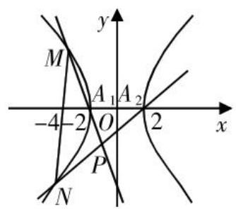
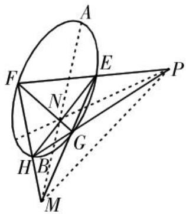

# 解析几何中非对称式化归的探究与思考

刘荣军 浙江省青田县中学 323900

[摘 要] 解析几何解答题主要考查学生的数学运算、逻辑推理等核心素养和能力,可见数学运算是教学重点.由于圆锥曲线题计算量比较大,因此也是学习难点.处理非对称式问题学生往往无从下手,如果能够发现算式的结构特点,采用减元的数学思想方法,可以简化问题,迎刃而解.从一道高考题出发进行探究与拓展,能够达到举一反三、触类旁通的目的.

[关键词] 解析几何;非对称式;减元思想;化归探究;教学思考

数学高考全国卷中的解析几何解答题往往计算量比较大,并且有一定的难度. 试题的“难”隐藏在问题结构特征里,隐藏在数学思想方法里,隐藏在知识本质里,考查学生的逻辑推理、数学运算等核心素养和能力. 解答这类题目往往要“入乎其内”,即解析几何中常出现非对称式的代数结构,用减元思想去解决;又要“出乎其外”,即跳出问题看问题,需从题目中追本溯源,发现一般化拓展,探究问题的本真. 本文以2023年新高考卷Ⅱ第21题为例,用减元思想谈谈如何挖掘非对称式的本质特性,愿与各位分享,以期抛砖引玉.

# 初探——思路受阻产生疑惑

题目 已知双曲线C的中心为坐标原点,左焦点 $F_{1}(-2\sqrt{5},0)$ ,离心率为 $\sqrt{5}$ .

(1)求C的方程;

(2)记C的左、右顶点分别为 $A_{1},A_{2}$ ，过点(-4,0)的直线与C的左支交于M,N两点，M在第二象限，直线 $MA_{1}$ 与 $NA_{2}$ 交于P，证明：P在定直线上.

分析 容易求出C的方程为 $\frac{x^{2}}{4}-\frac{y^{2}}{16}=1$ ，如图1所示，由对称性可知P在定直线x=a上。根据题意，设直线 $l_{MN}$ ：

text_image

M
A₁ A₂
-4 -2 O 2 x
P
N

图1

$x = ty - 4, M(x_{1},y_{1}), N(x_{2},y_{2})$ ，联立直线 $MN$ 与双曲线 $C$ 的方程，可得 $(4t^{2} - 1)y^{2} - 32ty + 48 = 0$ ，所以 $y_{1} + y_{2} = \frac{32t}{4t^{2} - 1}, y_{1}y_{2} = \frac{48}{4t^{2} - 1}$ ， $-\frac{1}{2} < t < \frac{1}{2}$ ，则 $l_{MA_{1}}: y = \frac{y_{1}}{x_{1} + 2}(x + 2), l_{NA_{2}}: y = \frac{y_{2}}{x_{2} - 2}(x - 2)$ . 联立直线 $MA_{1}$ 与直线 $NA_{2}$ 的方程，可得 $\frac{x + 2}{x - 2} = \frac{y_{2}(x_{1} + 2)}{y_{1}(x_{2} - 2)} = \frac{ty_{1}y_{2} - 2y_{2}}{ty_{1}y_{2} - 6y_{1}}$ ①.

①式为非对称式,无法直接利用韦达定理减元,但从目标来看,P在定直线x=a上,因此非对称的代数结构一定可以进行转化.这说明①式的分子、分母有一定的倍数关系,由此可以通过整体约分得到常数.这是将一个问题由难化易、由繁化简的转化与化归过程.

# 试探——尝试用减元思想解题

方法1(利用求根公式消 $y_{1},y_{2}$ ): $y_{1}=\frac{16t-4\sqrt{4t^{2}+3}}{4t^{2}-1},y_{2}=$ $\frac{16t+4\sqrt{4t^{2}+3}}{4t^{2}-1}$ ，可得 $\frac{ty_{1}y_{2}-2y_{2}}{ty_{1}y_{2}-6y_{1}}=\frac{\frac{48t}{4t^{2}-1}-2\frac{16t+4\sqrt{4t^{2}+3}}{4t^{2}-1}}{\frac{48t}{4t^{2}-1}-6\frac{16t-4\sqrt{4t^{2}+3}}{4t^{2}-1}}=$ $\frac{16t-8\sqrt{4t^{2}+3}}{-48t+24\sqrt{4t^{2}+3}}=-\frac{1}{3}$ ，即 $\frac{x+2}{x-2}=-\frac{1}{3},x=-1.$

方法2(利用韦达定理消 $y_{2}$ ):根据 $y_{1}+y_{2}=\frac{32t}{4t^{2}-1}$ 消 $y_{2}$ ，则 $\frac{ty_{1}y_{2}-2y_{2}}{ty_{1}y_{2}-6y_{1}}=\frac{ty_{1}y_{2}-2\left(\frac{32t}{4t^{2}-1}-y_{1}\right)}{ty_{1}y_{2}-6y_{1}}=\frac{\frac{-16t}{4t^{2}-1}+2y_{1}}{\frac{48t}{4t^{2}-1}-6y_{1}}=-\frac{1}{3}$ ，即 $\frac{x+2}{x-2}=$ $-\frac{1}{3},x=-1.$

方法3(利用韦达定理消 $y_{1}$ ):基本思路仿照方法2(略).

方法4(利用韦达定理消t):根据 $y_{1}+y_{2}=\frac{32t}{4t^{2}-1},y_{1}y_{2}=$ $\frac{48}{4t^{2}-1}$ ，可得 $t=\frac{3}{2}\cdot\frac{y_{1}+y_{2}}{y_{1}y_{2}},\frac{ty_{1}y_{2}-2y_{2}}{ty_{1}y_{2}-6y_{1}}=\frac{\frac{3}{2}(y_{1}+y_{2})-2y_{2}}{\frac{3}{2}(y_{1}+y_{2})-6y_{1}}=-\frac{1}{3}$ 即 $\frac{x+2}{x-2}=-\frac{1}{3},x=-1.$

方法1学生容易想到,思路比较简单,属于“硬算”,但学生常会望“计算”而却步,半途放弃.其他三种方法的计算量相对较少,但学生不容易想到.当出现非对称的代数结构无法直接利用韦达定理简化运算时,基本求解思路是先减元,然后整体约分,最后得到定值.

# 细探——构造结构巧解

方法5(利用曲线方程构造对称结构):由于点M,N在曲线 $\frac{x^{2}}{4}-\frac{y^{2}}{16}=1$ 上,因此 $x_{1}^{2}-4=\frac{y_{1}^{2}}{4},x_{2}^{2}-4=\frac{y_{2}^{2}}{4}$ .所以, $\frac{x+2}{x-2}=\frac{y_{2}(x_{1}+2)}{y_{1}(x_{2}-2)}=$ $\frac{y_{2}\cdot\frac{y_{1}^{2}}{4}}{y_{1}(x_{1}-2)(x_{2}-2)}=\frac{y_{1}y_{2}}{4(x_{1}-2)(x_{2}-2)}=\frac{y_{1}y_{2}}{4[x_{1}x_{2}-2(x_{1}+x_{2})+4]}$ .

于是将非对称的代数结构转化为了对称的代数结构,然后用韦达定理整体代换求值即可.利用曲线方程进行减元处理,对学生来说,思维量多,计算量少.

方法6(曲线关系变形后消 $y_{1},y_{2}$ ):对 $\frac{x+2}{x-2}=\frac{y_{2}(x_{1}+2)}{y_{1}(x_{2}-2)}$ 的两边平方,可得 $\left(\frac{x+2}{x-2}\right)^{2}=\frac{y_{2}^{2}(x_{1}+2)^{2}}{y_{1}^{2}(x_{2}-2)^{2}}=\frac{(4x_{2}^{2}-16)(x_{1}+2)^{2}}{(4x_{1}^{2}-16)(x_{2}-2)^{2}}=\frac{(x_{1}+2)(x_{2}+2)}{(x_{1}-2)(x_{2}-2)}=\frac{x_{1}x_{2}+2(x_{1}+x_{2})+4}{x_{1}x_{2}-2(x_{1}+x_{2})+4}$ .根据韦达定理可知, $x_{1}+x_{2}=t(y_{1}+y_{2})-8=\frac{8}{4t^{2}-1},x_{1}\cdot x_{2}=(ty_{1}-4)(ty_{2}-4)=\frac{-16t^{2}-16}{4t^{2}-1}$ .所以, $\left(\frac{x+2}{x-2}\right)^{2}=\frac{1}{9},x=-1$ .

方法7(利用双曲线的第三定义构造对称结构): 观察 $\frac{y_{2}(x_{1}+2)}{y_{1}(x_{2}-2)}$ 的几何意义, 可得 $\frac{y_{2}(x_{1}+2)}{y_{1}(x_{2}-2)}=\frac{\frac{y_{2}}{x_{2}-2}}{\frac{y_{1}}{x_{1}+2}}=\frac{k_{NA_{2}}}{k_{MA_{1}}}$ . 由双曲

线的第三定义可知, $k_{MA_{1}}\cdot k_{MA_{2}}=e^{2}-1=4$ ,所以 $\frac{x+2}{x-2}=\frac{y_{2}(x_{1}+2)}{y_{1}(x_{2}-2)}=$ $\frac{\frac{y_{2}}{x_{2}-2}}{\frac{y_{1}}{x_{1}+2}}=\frac{k_{NA_{2}}}{k_{MA_{1}}}=\frac{k_{NA_{2}}}{\frac{4}{k_{MA_{2}}}}=\frac{k_{NA_{2}}\cdot k_{MA_{2}}}{4}=\frac{1}{4}\cdot\frac{y_{1}\cdot y_{2}}{(x_{1}-2)(x_{2}-2)}=\frac{1}{4}\cdot$ $\frac{y_{1}\cdot y_{2}}{(ty_{1}-6)(ty_{2}-6)}$ .于是将非对称的代数结构转化为了对称的代数结构,然后利用韦达定理整体代换求值即可.

# 再探——追本溯源,推广拓展

# 1. 追本溯源

命题背景从极点和极线的定义来分析.

代数视角:已知圆锥曲线 $\Gamma:Ax^{2}+Cy^{2}+2Dx+2Ey+F=0$ ，则称点 $P(x_{0},y_{0})$ 和直线 $l:Ax_{0}x+Cy_{0}y+D(x+x_{0})+E(y+y_{0})+F=0$ 是圆锥曲线 $\Gamma$ 的一对极点和极线.

几何视角:如图2所示,设点P不在圆锥曲线上,过点P引两条割线依次交圆锥曲线于四点E,F,G,H,连接EH,FG交于N,连接EG,FH交于M,则MN为点P对应的极线,PM为点N对应的极线,PN为点M对应的极线.

text_image

Geometric diagram with labeled points and lines, likely from a math problem or proof

图2

方法8(极点、极线定理的运用):

由题意可知,点 $(-4,0)$ 不在双曲线C上,过点 $(-4,0)$ 的直线 $A_{1}A_{2}$ 和MN交双曲线C于点 $A_{1},A_{2},M,N$ ,直线 $MA_{1}$ 与 $NA_{2}$ 交于P,则点 $(-4,0)$ 对应的极线为过点P的直线,方程为 $\frac{x(-4)}{4}-\frac{y\times0}{16}=1$ ,即x=-1. $(NA_{1},MA_{2}$ 的交点也在定直线x=-1上)

# 2. 推广拓展

一般拓展: 双曲线 $C: \frac{x^{2}}{a^{2}} - \frac{y^{2}}{b^{2}} = 1 (a > 0, b > 0)$ ，中心为坐标原点，记其左、右顶点分别为 $A_{1}, A_{2}$ ，过不与顶点重合的点 B (m, 0) 的直线交 C 于点 M, N，则直线 $MA_{1}$ 与 $NA_{2}$ 的交点 P 在定直线 $x = \frac{a^{2}}{m}$ 上.

类比拓展:椭圆 $C:\frac{x^{2}}{a^{2}}+\frac{y^{2}}{b^{2}}=1(a>b>0)$ ，中心为坐标原点，记其左、右顶点分别为 $A_{1},A_{2}$ ，过不与顶点重合的点 $B(m,0)$ 的直线交C于点M,N，则直线 $MA_{1}$ 与 $NA_{2}$ 的交点P在定直线 $x=\frac{a^{2}}{m}$ 上.

逆向拓展: 双曲线 $C: \frac{x^{2}}{a^{2}} - \frac{y^{2}}{b^{2}} = 1 (a > 0, b > 0)$ ，中心为坐标原点,记其左、右顶点分别为 $A_{1},A_{2}$ ,在直线 $x=\frac{a^{2}}{m}$ 上有一点P,连接 $PA_{1},PA_{2}$ ,交双曲线C于点M,N,则直线MN过定点.

# 思考

从题目的结构、背景、解法等多方面进行探究,注重算理、渗透思想. 学生遇到对称结构式就习以为常地利用韦达定理进行整体代换,但一旦问题“略施粉黛”呈现的是非对称结构式就束手无策了. 数学解题并没有固定不变的套路,只有不变的数学本质和思想方法. 非对称式问题的解法多样,但其本质离不开减元. 教学应强化通法、算理的渗透,细化计算过程的探究,深化数学思想方法的运用,而不是利用套路使学生成为解题的复刻者. 正如马丘斯金所说:“题目解决不是终点,而是思考的起点.”解决一个题目就停止进一步的思考,为解题而解题的观念要不得. 应该对问题一探到底,揭示问题的本质,弄清问题的来龙去脉,真正做到“做一题、学一法、会一类、通一片”. 尊重知识发生、发展的过程,注重学生思维内化、深化的过程,让逻辑推理、数学运算等核心素养和能力在数学教学中落地生根.

# (上接第79页)

该生尚未说完,其他学生就呈现出了恍然大悟的表情. 学生自主在坐标系内画出定点与单位圆的位置,并列出相应的方程,y的值域便一目了然.

在教学中,如果学生出现了“懂而不会”的现象,这就是思维遇到了障碍的表现. 教师要抓住这个细节,结合教学内容的特征与学生的实际情况,通过适当的启发与引导,帮助学生突破思维障碍. 切忌对学生的思维障碍视而不见,或利用“题海战术”来突破思维障碍. 事实证明,只有帮助学生从真正意义上理解问题的根源,才能让学生获得举一反三的能力.

# 重视教学评价过程

评价为学生的成长服务。如今的课堂评价不仅要注重学生的解题情况,还要发现并挖掘学生在其他方面的潜能,充分了解学生的实际学习需求,帮助学生更好地认识并建立自我意识,让学生在原有的认知水平上获得进一步的发展。

鉴于此,教师应建立以学生发展为目标的评价体系,将结果评价与过程评价相结合,尊重学生的个体差异,保护学生的自尊,让评价充分发挥激励作用.

拿课后作业来说,作业批改是对学生解题结果的反馈方式,教师若单纯地给出对与错,并不能让学生重视自己存在的问题. 新课改背景下的教师,应重视作业批改的细节,因为作业批改是师生互动的一种方式. 教师在作业批改过程中留下的指导意见对于学生而言,就是点拨、鼓励、交流,丰富的作业批改方式能够拉近师生间的心理距离.

案例4 “不等式”的作业批改.

求证: $\sqrt{(a-c)^{2}+(b-d)^{2}}\leqslant\sqrt{a^{2}+b^{2}}+\sqrt{c^{2}+d^{2}}$ .

在作业批改时,笔者发现部分学生将式子的两边同时平方,运算越来越复杂,最终没能完成本题.为了启发学生的思维,笔者在这些学生的本子上写到:“遇到平方的和开方的问题,我们常常能够想到些什么?”

果不其然,在这句评语的点拨下,
多位学生表示自己会解这道题了,即把 $\sqrt{a^{2}+b^{2}}$ 视为点 $(a,b)$ 与原点之间的距离, 同理得到其他两段距离. 从三角形的几何知识出发, 可顺利证明本题.

师:为什么之前你们没有想到这种方法呢?

生3: 主要还是对距离公式的应用不够灵活, 对于知识间的联系的掌握还不够透彻.

师:看来你们已经找到了问题的症结,数学本身就是一门系统学科,讲究整体性,我们在建构新知时,一定要将新旧知识联系起来记忆,只有吃透知识间的联系,才能以不变应万变.

从作业批改这个细节出发,不仅能点拨学生的思维,还能让学生从中悟出更多的道理. 因此,教师要特别注重教学评价这个环节,这是对学生学习成效的客观反馈方式,也是促进学生自省的重要方式.

总之,细节决定成败. 借助细节来挖掘学生的潜能,帮助学生突破思维障碍,可让整个教学过程充满灵性与智慧. 作为教师应从细节出发,探寻促进学生发展的途径,引导学生更加积极地投身于学习中,为落实核心素养夯实基础.