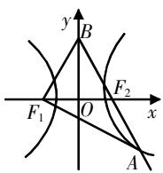
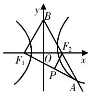
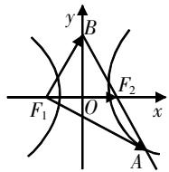

# 分析几何图形的特征，探索解决问题的思路

# ——以2023年高考数学新课标Ⅰ卷第16题为例

张志峰 广东省深圳市罗湖区教育科学研究院 518001

[摘 要] 2023年全国高考数学新课标Ⅰ卷第16题是一道圆锥曲线试题,研究者重点分析其几何特征,探索解决思路,并给出教学建议,以期通过优化教学策略,充分利用教材例题、习题和高考真题来提高学生的解题能力,培养学生的数学学科核心素养.

[关键词] 几何特征;解题思路;教学建议

# 题目呈现

题目:(2023年全国高考数学新课标Ⅰ卷第16题)已知双曲线 $C:\frac{x^{2}}{a^{2}}-\frac{y^{2}}{b^{2}}=1(a>0,b>0)$ 的左、右焦点分别为 $F_{1},F_{2}$ ，点A在C上，点B在y轴上， $\overrightarrow{F_{1}A}\perp\overrightarrow{F_{1}B},\overrightarrow{F_{2}A}=-\frac{2}{3}\overrightarrow{F_{2}B}$ ，则C的离心率为\_\_\_\_.

# 试题分析

本题涉及的课标要求是:能够从多种角度理解向量的概念和运算法则,掌握向量基本定理;能够用向量方法解决简单的平面几何问题,知道数学运算与逻辑推理的关系;了解双曲线的定义、几何图形和标准方程及简单的几何性质.

借助三维细目表,即从“考查载体”“考查内容”“考查要求”对本题进行分析(见表1).

表1

<table><tr><td colspan="3">考查载体</td><td colspan="4">考查内容</td><td colspan="4">考查要求</td><td>学业质量</td></tr><tr><td>情境分类</td><td>情境层次</td><td>具体情境</td><td>必备知识</td><td>关键能力</td><td>学科素养</td><td>核心价值</td><td>基础性</td><td>应用性</td><td>综合性</td><td>创新性</td><td>水平</td></tr><tr><td>探索创新情境</td><td>关联与综合</td><td>双曲线与向量</td><td>双曲线的定义与几何性质、向量的运算</td><td>逻辑思维与运算能力</td><td>理性思维与数学探索</td><td>理性思维与科学精神</td><td></td><td></td><td>√</td><td></td><td>二</td></tr></table>

# 思路探索

本题涉及解析几何内容,处于填空压轴题的位置,与往年高考一样,没有给几何图形,要求学生理解试题情境中的几何特征及其解释,运用数形结合思想画出相应的几何图形,寻找解题思路,选择合理简洁的运算途径.

# 1. 分析关键信息

本题的关键信息是两个平面向量的关系“ $\overrightarrow{F_{1}A}\perp\overrightarrow{F_{1}B}$ ”和“ $\overrightarrow{F_{2}A}=-\frac{2}{3}\overrightarrow{F_{2}B}$ ”，其中 $\overrightarrow{F_{1}A}\perp\overrightarrow{F_{1}B}$ 表示 $F_{1}A$ 与 $F_{1}B$ 所在直线互相垂直， $\overrightarrow{F_{2}A}=-\frac{2}{3}\overrightarrow{F_{2}B}$ 表示A,B, $F_{2}$

三点共线,且A,B两点在 $F_{2}$ 的两侧,满足 $|\overrightarrow{F_{2}A}|=\frac{2}{3}|\overrightarrow{F_{2}B}|$ .

# 2. 画出几何图形

基于题目关键信息的分析,建系画双曲线,过点 $F_{2}$ 作直线AB,交y轴于点B,交双曲线于点A,连接 $F_{1}A$ 和 $F_{1}B$ ,使得 $\overrightarrow{F_{1}A}\perp\overrightarrow{F_{1}B}$ ,得到相应的几何图形(如图1所示).

# 3. 分析几何特征

结合情境描述图形的几何特征: 图形主要涉及一些三角形, 其中 $\triangle ABF_{1}$ 是直角三角形, 由对称性易知 $\triangle BF_{1}F_{2}$ 是等腰三角形,且 $\left|BF_{1}\right|=\left|BF_{2}\right|,\triangle AF_{1}F_{2}$ 是焦点三角形.

  
图1

用代数语言描述图形的几何特征:由 $\left|\overrightarrow{F_{2}A}\right|=\frac{2}{3}\left|\overrightarrow{F_{2}B}\right|$ ，可设 $\left|\overrightarrow{F_{2}B}\right|=3m$ ，则 $\left|\overrightarrow{F_{2}A}\right|=2m,\left|AB\right|=5m,\left|BF_{1}\right|=3m.$ 在直角三角形 $ABF_{1}$ 中，由勾股定理得 $\left|F_{1}A\right|=4m.$ 因为 $\triangle AF_{1}F_{2}$ 是焦点三角形，由双曲线的定义得 $\left|AF_{1}\right|-\left|AF_{2}\right|=2m=2a$ ，所以m=a。所以， $\left|BF_{1}\right|=\left|BF_{2}\right|=3a,\left|F_{1}A\right|=4a,\left|AB\right|=5a.$

# 4. 探索解题思路

借助图形几何特征,得到本题的解决思路:本题求的是双曲线的离心率,即寻找参数a,b,c之间的关系.根据上述图形几何特征的分析,结合等腰三角形 $BF_{1}F_{2}$ 或焦点三角形 $AF_{1}F_{2}$ 的性质,利用解三角形的知识求解.

思路1 在直角三角形 $ABF_{1}$ 中, 根据三角函数的定义可得 $\cos B=\frac{3a}{5a}=\frac{3}{5}$ . 在等腰三角形 $BF_{1}F_{2}$ 中, 由余弦定理得 $\left|F_{1}F_{2}\right|^{2}=\left|BF_{1}\right|^{2}+\left|BF_{2}\right|^{2}-2\left|BF_{1}\right|\left|BF_{2}\right|\cdot\cos B$ , 即 $4c^{2}=9a^{2}+9a^{2}-2\times9a^{2}\times\frac{3}{5}=\frac{36}{5}a^{2}$ , 所以 $e=\frac{c}{a}=\frac{3\sqrt{5}}{5}$ .

思路2 过点 $F_{2}$ 作 $PF_{2}\perp AF_{1}$ 于P，如图2所示.

  
图2

根据 $\triangle APF_{2} \sim \triangle AF_{1}B$ ，得 $|PF_{2}| = \frac{6a}{5}, |PF_{1}| = \frac{12a}{5}$ .

在直角三角形 $PF_{1}F_{2}$ 中,由勾股定理得 $\left|F_{1}F_{2}\right|^{2}=\left|PF_{1}\right|^{2}+\left|PF_{2}\right|^{2}$ ，即 $4c^{2}=$ $\left(\frac{12a}{5}\right)^{2}+\left(\frac{6a}{5}\right)^{2}$ ，所以 $e=\frac{c}{a}=\frac{3\sqrt{5}}{5}$ .

点评 上述两种解题思路都是基于图形几何特征,利用解三角形的知识求解的.

思路3 基于本题的求解目标构造向量 $\overrightarrow{F_{1}F_{2}},\overrightarrow{F_{1}B},\overrightarrow{F_{1}A}$ ，由向量线性运算得 $\overrightarrow{F_{1}F_{2}}=\frac{2}{5}\overrightarrow{F_{1}B}+\frac{3}{5}\overrightarrow{F_{1}A}$ ，即 $|\overrightarrow{F_{1}F_{2}}|=\left|\frac{2}{5}\overrightarrow{F_{1}B}+\frac{3}{5}\overrightarrow{F_{1}A}\right|$ ，两边平方得 $|\overrightarrow{F_{1}F_{2}}|^{2}=\frac{4}{25}|\overrightarrow{F_{1}B}|^{2}+\frac{9}{25}|\overrightarrow{F_{1}A}|^{2}+\frac{12}{25}\overrightarrow{F_{1}A}\cdot\overrightarrow{F_{2}B}$ ，即 $4c^{2}=\frac{36}{25}a^{2}+\frac{144}{25}a^{2}=\frac{36}{5}a^{2}$ ，所以 $e=\frac{c}{a}=\frac{3\sqrt{5}}{5}$ .

  
图3

点评 思路3体现了平面向量的工具性作用.

平面向量与解析几何都是高中数学的教学重点,两者存在很多的内在联系,是数形结合的产物. 平面向量与解析几何的结合,还有重要的一点,就是坐标表示,因此本题可以通过设点,将向量坐标化,利用方程思想求解.

思路4 设 $F_{1}(-c,0)$ , $F_{2}(c,0)$ , $B(0,y)$ ，则 $\overrightarrow{F_{2}B}=(-c,y)$ 。由 $\overrightarrow{F_{2}A}=-\frac{2}{3}\overrightarrow{F_{2}B}=$ $\left(\frac{2}{3}c,-\frac{2}{3}y\right)$ 得 $A\left(\frac{5}{3}c,-\frac{2}{3}y\right)$ ，由 $\overrightarrow{F_{1}A}\perp\overrightarrow{F_{1}B}$ 得 y=2c，所以 $A\left(\frac{5}{3}c,-\frac{4}{3}c\right)$ 。

将点A的坐标代入双曲线方程得 $\frac{25c^{2}}{9a^{2}}-\frac{16c^{2}}{9b^{2}}=1$ ，即 $25c^{2}b^{2}-16c^{2}a^{2}=9a^{2}b^{2}$ 。又 $b^{2}=c^{2}-a^{2}$ ，代入上式，整理得 $25c^{4}-50c^{2}a^{2}+9a^{4}=0$ 。两边同时除以 $a^{4}$ ，得 $25e^{4}-50e^{2}+9=0$ ，解得 $e^{2}=\frac{1}{5}$ 或 $e^{2}=\frac{9}{5}$ 。又 $e=\frac{c}{a}>1$ ，所以 $e=\frac{3\sqrt{5}}{5}$ .

# 教学建议

# 1. 解析几何的教学定位

解析几何是数学发展过程中的标志性成果,是微积分创立的基础,而从数学内部来看,则出于对数学方法的追求.因此,解题教学中应以圆锥曲线与方程为载体,掌握坐标法这一工具去解决一些几何、代数问题,注意代数运算与几何直观相互为用.引导学生先用平面几何的眼光观察相应几何图形的特征,认识确定几何图形的要素,再用坐标法解决问题,将数形结合思想、坐标思想贯穿教学始终.

# 2. 优化解题思路,简化运算

学生在学习解析几何的过程中,常常因为不能顺利完成代数运算而失败.为了让学生更好地把握坐标法的基本思想,优化运算,建议用几何眼光观察、分析几何图形的要素及基本关系,再用代数语言进行表达,借助图形的几何特征及图形间的关系优化解题思路,选择合理简捷的运算途径.

# 3. 加强高考试题研究

用好教科书中的例题和习题,通过适当的变式、拓展,可以帮助学生深入理解圆锥曲线的几何特征,感悟解析几何蕴含的数学思想;还应该加强高考题目的研究,从中寻找关联点和通性,关注题目蕴含的知识内容,将知识点有机融合,形成微专题复习.如2019年高考全国I卷理科数学第16题“已知双曲线 $C:\frac{x^{2}}{a^{2}}-\frac{y^{2}}{b^{2}}=1(a>0,b>0)$ 的左、右焦点分别为 $F_{1},F_{2}$ ,过 $F_{1}$ 的直线与C的两条渐近线分别交于A,B两点,若 $\overrightarrow{F_{1}A}=\overrightarrow{AB},\overrightarrow{F_{1}B}\cdot\overrightarrow{F_{2}B}=0$ ,则C的离心率为\_\_\_\_”也属于探索创新情境,以双曲线为载体,综合平面向量,重点考查双曲线的几何性质,以及学生的逻辑思维、运算求解能力、理性思维能力和数学探索能力.