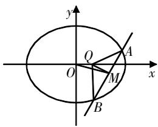
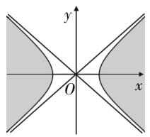
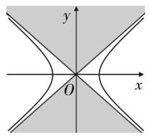
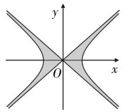

# 圆锥曲线中平面几何特征的灵活应用

吴明飞 江苏省苏州市苏州湾实验初级中学 215200

[摘 要] 圆锥曲线中经常涉及几何图形问题,其中直线与圆锥曲线的位置关系至关重要,是解析几何中重要的题型之一. 另外,特殊的几何图形的性质也要深入挖掘,这样才能更有效地解决问题.

[关键词] 圆锥曲线; 中点弦; 等腰三角形; 斜率

解析法是求解圆锥曲线问题最基本的方法,但往往有烦琐的推理和计算过程.而平面几何特征通常能够提供非常简洁的方法,帮助优化解题过程.笔者借助实例,探究平面几何特征对解决圆锥曲线问题的作用,下文是教学中笔者的一些实践和思考.

# 试题呈现

已知椭圆 $C:\frac{x^{2}}{4}+\frac{y^{2}}{3}=1$ ，设直线l: $y=kx+m(k\neq0)$ 与椭圆C相交于A，B两点，点 $Q\left(\frac{1}{4},0\right)$ ，若AQ=BQ( $\triangle ABQ$ 为等腰三角形)，求实数k的取值范围.

# 方法解析

解法1 设 $A(x_{1},y_{1}),B(x_{2},y_{2})$ ，联立 $\left\{\begin{aligned}\frac{x^{2}}{4}+\frac{y^{2}}{3}&=1,\\ y=kx+m,\end{aligned}\right.$ 消去y，可得 $(3+4k^{2})x^{2}+8kmx+4m^{2}-12=0$ ，则 $x_{1}+x_{2}=\frac{-8km}{3+4k^{2}},x_{1}x_{2}=\frac{4m^{2}-12}{3+4k^{2}},\Delta=48(3+4k^{2}-m^{2})>0①.$

设A,B的中点为 $M(x_{0},y_{0})$ ，则 $x_{0}=\frac{x_{1}+x_{2}}{2}=\frac{-4km}{3+4k^{2}},y_{0}=kx_{0}+m=\frac{3m}{3+4k^{2}}$ 。因为AQ=BQ，所以 $AB\perp QM$ ，即 $k\cdot k_{QM}=k\cdot\frac{\frac{3m}{3+4k^{2}}}{\frac{-4km}{3+4k^{2}}-\frac{1}{4}}=-1$ ，解得 $m=-\frac{3+4k^{2}}{4k}$ ②。

把②式代入①式，得 $3+4k^{2}>\left(-\frac{3+4k^{2}}{4k}\right)^{2}$ ，整理得 $16k^{4}+8k^{2}-3>0$ ，即 $(4k^{2}-1)(4k^{2}+3)>0$ ，解得 $k<-\frac{1}{2}$ 或 $k>\frac{1}{2}$ 。故实数k的取值范围是 $\left(-\infty,-\frac{1}{2}\right)\cup\left(\frac{1}{2},+\infty\right)$ 。

注 由等腰三角形可得其底边的中线与弦垂直,这里就涉及弦中点问题. 上述解法先联立直线与椭圆的方程,运用韦达定理求出弦中点的坐标,然后通过直线垂直建立参数的等量关系,最后由 $\Delta>0$ 求出k的取值范围. 此解法思路明确,但运算量不小. 进一步思考以上求解过程,发现可以优化解题步骤. 对于弦中点问题,我们常常利用点差法求解,更容易找到中点与已知条件之间的关系.下面介绍由点差法得到的一个重要结论(结论1).

结论1 已知椭圆 $C:\frac{x^{2}}{a^{2}}+\frac{y^{2}}{b^{2}}=1(a>b>0)$ ，O为坐标原点，设直线AB与椭圆C相交于A，B两点，M为A，B的中点，则 $k_{OM}\cdot k_{AB}=-\frac{b^{2}}{a^{2}}^{[1]}$ .

对于上述试题,可以从直线斜率的角度出发,设A,B的中点为M,直线QM的斜率、直线OM的斜率都与直线l的斜率有关系,由此得到解法2.

解法2 如图1所示, 因为直线l的斜率为k, 所以直线QM的斜率为 $-\frac{1}{k}$ .

由结论1可得直线OM的斜率为 $-\frac{b^{2}}{a^{2}k}=-\frac{3}{4k}$ , 所以直线QM的方程为 $y=-\frac{1}{k}\cdot$

text_image

y
O
Q
A
x
M
B

图1

$\left(x-\frac{1}{4}\right)$ ，直线OM的方程为 $y=-\frac{3}{4k}x$ .
联立 $\left\{\begin{aligned}y&=-\frac{1}{k}\left(x-\frac{1}{4}\right),\\ y&=-\frac{3}{4k}x,\end{aligned}\right.$ 得中点 $M\left(1,-\frac{3}{4k}\right)$ .

直线l与椭圆有两个交点,所以点M在椭圆内部,所以 $\frac{1}{4}+\frac{\left(-\frac{3}{4k}\right)^{2}}{3}<1$ ,解得 $k<-\frac{1}{2}$ 或 $k>\frac{1}{2}$ .故实数k的取值范围是 $\left(-\infty,-\frac{1}{2}\right)\cup\left(\frac{1}{2},+\infty\right)$ .

注 上述解法运用了结论1和等腰三角形的性质. 等腰三角形可以转化到直线垂直, 从而刻画出直线斜率的数量关系, 而中点弦也含有直线斜率间的关系, 故将直线斜率作为桥梁, 能更加有效、简洁地解决问题.

用解法2很好地解决了椭圆中的等腰三角形问题,对于双曲线中的等腰三角形问题,情况又是怎么样的呢?下面继续研究利用直线斜率间的关系解决双曲线中的等腰三角形问题,首先观察下面这个结论(结论2).

结论2 已知双曲线 $C: \frac{x^2}{a^2} - \frac{y^2}{b^2} = 1$ $(a > 0, b > 0)$ , $O$ 为坐标原点, 设直线 $AB$ 与双曲线 $C$ 相交于 $A$ , $B$ 两点, 点 $M$ 为 $A$ , $B$ 的中点, 则 $k_{OM} \cdot k_{AB} = \frac{b^2}{a^2}$ [1].

椭圆中的弦中点在椭圆内部,可以保证直线与椭圆有两个交点,而双曲线是不封闭的曲线,那么弦中点落到双曲线哪个区域可以保证直线与双曲线有两个交点呢?这是必须解决的双曲线中点弦存在性问题.

结论3 $^{[2]}$ 已知双曲线 $C:\frac{x^{2}}{a^{2}}-\frac{y^{2}}{b^{2}}=1(a>0,b>0)$ 和坐标平面上任意一点 $P(x_{0},y_{0})$ .

(1) 当 $\frac{x_{0}^{2}}{a^{2}} - \frac{y_{0}^{2}}{b^{2}} > 1$ ，即 $b^{2}x_{0}^{2} - a^{2}y_{0}^{2} > a^{2}b^{2}$ ，点 P 在双曲线的内部（含焦点的区域，即图2中的阴影区域),此时 $\Delta>0$ ,存在以P为中点的弦AB,两个交点在同支上,并且这样的直线l是唯一的.

  
图2

(2) 当 $\frac{x_{0}^{2}}{a^{2}} - \frac{y_{0}^{2}}{b^{2}} < 0$ ，即 $b^{2}x_{0}^{2} - a^{2}y_{0}^{2} < 0$ ，点 P 在图 3 中的阴影区域，此时 $\Delta > 0$ ，两个交点分别在左、右支上，并且这样的直线 l 也是唯一的.

  
图3

(3) 当 $0 < \frac{x_{0}^{2}}{a^{2}} - \frac{y_{0}^{2}}{b^{2}} < 1$ ，即 $0 < b^{2}x_{0}^{2} - a^{2}y_{0}^{2} < a^{2}b^{2}$ ，点 P 在图4中的阴影区域，此时 $\Delta < 0$ ，不存在以点 P 为中点的弦 AB.

  
图4

(4) 当 $\frac{x_{0}^{2}}{a^{2}} - \frac{y_{0}^{2}}{b^{2}} = 0$ ，即 $b^{2}x_{0}^{2} - a^{2}y_{0}^{2} = 0$ ，点 P 在渐近线上（非原点），此时 $\Delta = 0$ ，不存在以点 P 为中点的弦 AB.

例 已知双曲线C: $\frac{x^{2}}{4}-\frac{y^{2}}{3}=1$ , 设直线 $l:y=kx+m(k\neq0)$ 与双曲线C相交于A,B两点, 点 $Q\left(\frac{1}{4},0\right)$ , 若AQ=BQ ( $\triangle ABQ$ 为等腰三角形), 求实数k的取值范围.

解析 直线l的斜率为 $k(k\neq0)$ ，由结论2得 $k_{OM}=\frac{3}{4k}$ 。因为AQ=BQ,M为中点，所以 $k_{QM}=-\frac{1}{k}$ ，所以直线QM

的方程为 $y=-\frac{1}{k}\left(x-\frac{1}{4}\right)$ ，直线OM的

方程为 $y=\frac{3}{4k}x$ . 联立 $\left\{\begin{aligned}y&=-\frac{1}{k}\left(x-\frac{1}{4}\right),\\ y&=\frac{3}{4k}x,\end{aligned}\right.$

得中点 $M\left(\frac{1}{7},\frac{3}{28k}\right)$ . 由结论3得 $\frac{\left(\frac{1}{7}\right)^{2}}{4}-\frac{\left(\frac{3}{28k}\right)^{2}}{3}>1$ 或 $\frac{\left(\frac{1}{7}\right)^{2}}{4}-\frac{\left(\frac{3}{28k}\right)^{2}}{3}<0$ , 计算得 $-\frac{\sqrt{3}}{2}<k<0$ 或 $0<k<\frac{\sqrt{3}}{2}$ .

巩固练习 已知椭圆 $C: x^{2} + \frac{y^{2}}{b^{2}} = 1$ $(b > 0, b \neq 1)$ 与直线 y = x + m 相交于 M, N 两点, B 为上顶点, 若 BM = BN, 求椭圆 C 离心率的取值范围.

# 教学反思

# 1. 把握数学本质,强化几何特征

中点弦与等腰三角形相结合的问题,可借助平面几何特征,通过有效转化(将直线斜率作为桥梁),把该问题变得简单清晰,从而顺利地解决了该问题.从解析几何的性质突破,拓宽解题思路,化繁为简,才能使得解法灵活多样.

# 2. 凸显内在联系,挖掘思想方法

在教学中,要凸显圆锥曲线和特殊几何图形的性质以及内在逻辑联系,挖掘其隐含的思想方法,以发展学生数学学科核心素养为导向,启发学生思考,引导学生把握平面几何特征和本质,提倡学生独立思考,合作交流,激发学生的兴趣,提高教学的实效性.

# 参考文献：

[1] 林丽娟, 杨万江. 关于圆锥曲线弦中点问题的解法再探 [J]. 中学数学, 2000(05): 21-23.

[2] 黄富春. 双曲线中有关中点弦存在性问题的探索[J]. 中学数学研究, 2006(03):40-41.