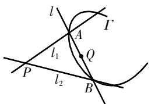
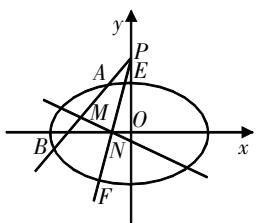

# 一类圆锥曲线问题的“齐次化” 解法溯源与应用

张伟峰 周鸿高 广东省佛山市南海区南海中学 528211

[摘 要] 文章从方程角度出发解读“齐次化”解法,阐述“齐次化”解法的应用题型及特点,以期让“齐次化”解法发挥更大作用.

[关键词] 齐次化;斜率和;斜率积;定点;定值

文[1]、文[2]、文[3]均是有关圆锥曲线问题的“齐次化”解法的文章，但主要阐述的是“齐次化”解法的解答过程，或是圆锥曲线定点定值问题的相关结论，即着重于怎样用“齐次化”解法。而对“齐次化”解法的本质、运用“齐次化”解法的题型特点并没有进行解读，即为什么可以用“齐次化”解法，何时用“齐次化”解法。本文借此对“齐次化”解法进行解读和阐述。

# “齐次化”解法示例

例1（2017年高考数学全国Ⅰ卷理数第20题）已知椭圆 $C:\frac{x^{2}}{a^{2}}+\frac{y^{2}}{b^{2}}=1(a>b>0)$ ，四点 $P_{1}(1,1)$ ， $P_{2}(0,1)$ ， $P_{3}\left(-1,\frac{\sqrt{3}}{2}\right)$ ， $P_{4}\left(1,\frac{\sqrt{3}}{2}\right)$ 中恰有三点在椭圆C上.

(1)求C的方程;

(2)设直线l不经过 $P_{2}$ 点且与C相交于A,B两点. 若直线 $P_{2}A$ 与直线 $P_{2}B$ 的斜率的和为-1,证明:l过定点.

解析 (1) $\frac{x^2}{4} + y^2 = 1$ .

(2)“齐次化”解法示例.

直线l不经过点 $P_{2}(0,1)$ ，可设l: $mx+n(y-1)=1$ 。由 $\frac{x^{2}}{4}+y^{2}=1$ ，得 $x^{2}+4[(y-1)+1]^{2}-4=0$ ，则 $x^{2}+4(y-1)^{2}+8(y-1)\cdot[mx+n(y-1)]=0$ ，即 $x^{2}+(4+8n)(y-1)^{2}+8mx(y-1)=0(*)$ 。

设 $k=\frac{y-1}{x}$ ，方程(\*)两边同时除以 $x^{2}$ ，并整理得 $(4+8n)k^{2}+8mk+1=0$ 。因为直线 $P_{2}A$ 的斜率 $k_{1}$ 与直线 $P_{2}B$ 的斜率 $k_{2}$ 是此方程的两根，所以 $k_{1}+k_{2}=-\frac{8m}{4+8n}=-1$ ，即 $m=\frac{4+8n}{8}$ 。所以，直线l的方程为 $\frac{4+8n}{8}x+n(y-1)=1$ ，整理得 $n(8x+8y-8)+4x-8=0$ 。由 $\left\{\begin{aligned}&4x-8=0,\\ &8x+8y-8=0,\end{aligned}\right.$ 得 $\left\{\begin{aligned}&x=2,\\ &y=-1.\end{aligned}\right.$ 因此，直线l过定点 $(2,-1)$ 。

评析 本题可作为圆锥曲线定点问题的基本模型,也是“齐次化”解法适合的题型. 上述解题过程呈现了“齐次化”解法的基本步骤:①设直线方程;②由圆锥曲线方程构造齐次方程;③将齐次方程转化为关于斜率k的二次方程;④结合已知条件和韦达定理得到直线方程的两个参数m,n之间的关系;⑤分类整理直线方程的参系数,结合恒成立条件得到定点的坐标.

# 对“齐次化”解法的理解

由例1可以明显感觉到:用“齐次化”解法处理这类涉及斜率和、斜率积的圆锥曲线定点问题,能够极大简化运算过程,快速解决问题,且准确性也明显提升.为什么这类问题可以用“齐次化”解法解决呢?遇到类似的圆锥曲线定点定值问题时,怎样知道是否可以用“齐次化”解法解决呢?如果不能直接使用“齐次化”解法,是否可以转化后使用“齐次化”解法呢?

# 1. 对直线方程、圆锥曲线方程的再认识

直线可由“两点”或“一点+斜率”确定,直线方程有点斜式、斜截式、两点式、截距式、一般式等多种形式,其中前面四种形式各有局限性.如斜截式方程 $y=kx+b$ 不能表示斜率不存在的情况,为什么不能表示呢?众所周知,斜率不存在的直线方程为x=a,而 $y=kx+b$ 无法写成这样的形式,若增加参数,如 $my=kx+b$ 就能表示所有情况下的直线,这是直线的一般方程.

在圆锥曲线问题中,常常已知直线过一定点,如直线过点 $P(x_{0},y_{0})$ ,则可设直线方程为 $m(x-x_{0})+n(y-y_{0})=0$ ,表示过点 $P(x_{0},y_{0})$ 的所有直线(直线方程 $m(x-x_{0})+n(y-y_{0})=1$ 表示不过点 $P(x_{0},y_{0})$ 的所有直线).

从方程角度来看, 直线方程是关于x,y的二元一次方程, 圆锥曲线方程是关于x,y的二元二次方程, 利用直线方程 $m(x-x_{0})+n(y-y_{0})=1$ 可把圆锥曲线方程转化为关于 $(x-x_{0}),(y-y_{0})$ 的齐二次方程. 如椭圆方程 $\frac{x^{2}}{a^{2}}+\frac{y^{2}}{b^{2}}=1$ (设点 $P(x_{0},y_{0})$ 在椭圆上), 变形为 $b^{2}\left[(x-x_{0})+x_{0}\right]^{2}+a^{2}\left[(y-y_{0})+y_{0}\right]^{2}=a^{2}b^{2}$ , 展开齐次化得 $b^{2}(x-x_{0})^{2}+2b^{2}x_{0}(x-x_{0})\cdot\left[m(x-x_{0})+n(y-y_{0})\right]+a^{2}(y-y_{0})^{2}+2a^{2}y_{0}\cdot(y-y_{0})\left[m(x-x_{0})+n(y-y_{0})\right]=0$ , 化简整理得 $(1+2mx_{0})b^{2}(x-x_{0})^{2}+(2nb^{2}x_{0}+2ma^{2}y_{0})(x-x_{0})(y-y_{0})+(1+2ny_{0})a^{2}(y-y_{0})^{2}=0$ .

# 2. 对斜率和、斜率积的理解

圆锥曲线定点问题,常常涉及斜率和、斜率积,其本质是弦张定角问题.如图1所示,直线l交曲线 $\Gamma$ 于点A,B,过点A,B分别作斜率为 $k_{1},k_{2}$ 的直线 $l_{1},l_{2}$ 交于点P,则 $\angle APB=\theta$ 称为弦AB的张角.可知 $\tan\theta=\left|\frac{k_{1}-k_{2}}{1+k_{1}k_{2}}\right|=\frac{\sqrt{(k_{1}+k_{2})^{2}-4k_{1}k_{2}}}{\left|1+k_{1}k_{2}\right|}(\theta<90^{\circ})$ ,这与斜率和、斜率积自然联系起来.其实,斜率和、斜率积是弦张定角问题的简化和弱化.

text_image

l
Γ
A
l₁
Q
P
l₂
B

图1

由斜率公式 $k=\frac{y_{1}-y_{2}}{x_{1}-x_{2}}$ 可知,斜率是一个比值,即 $(x_{1}-x_{2})$ 与 $(y_{1}-y_{2})$ 之间的关系.因此,如果是关于 $(x_{1}-x_{2})$ ,$(y_{1}-y_{2})$ 的齐次方程, 就可以转化为关于k的方程; 如果是关于k的一元二次方程, 就可以运用韦达定理, 得到斜率和、斜率积的关系式. 例如, 对于齐次方程 $Ax^{2}+Bxy+Cy^{2}=0$ , 若 $x\neq0$ , 两边同时除以 $x^{2}$ , 得 $C\left(\frac{y}{x}\right)^{2}+B\cdot\frac{y}{x}+A=0$ . 设 $k=\frac{y}{x}$ , 则 $Ck^{2}+Bk+A=0$ . 若 $C\neq0$ , 则为关于k的二次方程, 于是有 $k_{1}+k_{2}=-\frac{B}{C}, k_{1}k_{2}=\frac{A}{C}$ .

# 3. 用“齐次化”解法的题型特点

由上述分析不难发现,用“齐次化”解法得到直线AB过定点Q的题型特点为:

(1) 直线 PA, PB 过定点 $P(x_{0}, y_{0})$ ;  
(2)点A,B在已知曲线Γ上;   
(3)已知 $k_{PA}, k_{PB}$ 的和或积.

另外,若已知直线AB过定点Q,也可用“齐次化”解法得到 $k_{PA},k_{PB}$ 的和或积.

例1显然满足上述(1)(2)(3)点,所以可以运用“齐次化”解法,大大简化运算过程. 然而有些试题,题设条件并不直接满足上述几点,如果经过转化能够达成上述几点,也可以运用“齐次化”解法求解.

# “齐次化”解法应用题型

例2（2022年佛山一模数学第21题）已知双曲线C的渐近线方程为 $y=\pm\frac{\sqrt{3}}{3}x$ ，且过点 $P(3,\sqrt{2})$ .

(1)求C的方程;  
(2)设 $Q(1,0)$ ，直线 $x=t(t\in\mathbf{R})$ 不经过P点且与C相交于A,B两点，若直线BQ与C相交于另一点D，求证：直线AD过定点.

解析 (1) $\frac{x^{2}}{3}-y^{2}=1.$

(2) 由 B, Q, D 三点共线, 得 $k_{BQ} = k_{DQ}$ . 又点 A, B 关于 x 轴对称, 则 $k_{AQ} = -k_{BQ}$ , $k_{QA} + k_{QD} = 0$ .

由于直线AD不经过点 $Q(1,0)$ ，
可设 $AD:m(x-1)+ny=1$ 。由 $\frac{x^{2}}{3}-y^{2}=1$ ，

得 $\left[(x-1)+1\right]^{2}-3y^{2}-3=0$ ，则 $(x-1)^{2}+2(x-1)\cdot\left[m(x-1)+ny\right]-3y^{2}-2\left[m(x-1)+ny\right]^{2}=0$ ，即 $(1+2m-2m^{2})(x-1)^{2}-(3+2n^{2})y^{2}+(2n-4mn)(x-1)y=0(*)$ .

设 $k=\frac{y}{x-1}$ ，方程(\*)两边同时除以 $(x-1)^{2}$ ，整理得 $(3+2n^{2})k^{2}-(2n-4mn)\cdot k-(1+2m-2m^{2})=0$ ， $k_{QA},k_{QD}$ 是此方程的两根。所以， $k_{QA}+k_{QD}=\frac{2n-4mn}{3+2n^{2}}=0$ ，得 $m=\frac{1}{2}$ 。所以，直线AD的方程为 $\frac{1}{2}\cdot(x-1)+ny=1$ ，整理得 $2ny+x-3=0$ 。由 $\left\{\begin{aligned}&2y=0,\\&x-3=0,\end{aligned}\right.$ 得 $\left\{\begin{aligned}&x=3,\\&y=0.\end{aligned}\right.$ 因此，直线AD过定点(3,0)。

评析 本题中的直线AB与DB相交于点B,而点B不是定点,不满足特点(1). 注意到直线AQ与DQ相交于定点Q(1,0),而且点A,B关于x轴对称,B,Q,D三点共线,可得 $k_{AQ}=-k_{BQ}$ , $k_{BQ}=k_{DQ},k_{QA}+k_{QD}=0$ ,于是顺利转化为满足特点(1)(2)(3)的题型,运用“齐次化”解法即可方便快捷地解决.

例3（2020年高考数学全国Ⅰ卷理数第20题）已知A,B分别为椭圆E: $\frac{x^{2}}{a^{2}}+y^{2}=1(a>1)$ 的左、右顶点,G为E的上顶点, $\overrightarrow{AG}\cdot\overrightarrow{GB}=8,P$ 为直线x=6上的动点,PA与E的另一交点为C,PB与E的另一交点为D.

(1)求E的方程;  
(2)证明:直线CD过定点.

解析 (1) $\frac{x^{2}}{9}+y^{2}=1.$

(2) 设 $C(x_{1}, y_{1}), D(x_{2}, y_{2}), P(6, t)$ ，又 $A(-3, 0), B(3, 0)$ ，则 $k_{AC} = k_{AP} = \frac{t - 0}{6 + 3} = \frac{t}{9}, k_{BD} = k_{BP} = \frac{t - 0}{6 - 3} = \frac{t}{3}$ ，所以 $k_{AC} = \frac{k_{BD}}{3}$ 。又 $k_{AD} \cdot k_{BD} = \frac{y_{2} - 0}{x_{2} + 3} \cdot \frac{y_{2} - 0}{x_{2} - 3} = \frac{y_{2}^{2}}{x_{2}^{2} - 9} = \frac{1 - \frac{x_{2}^{2}}{9}}{x_{2}^{2} - 9} = -\frac{1}{9}$ ，则 $k_{AC} \cdot k_{AD} = -\frac{1}{27}$ 。

若直线CD过点A,则直线CD方程为y=0.

若直线CD不过点A,设直线CD:

$m(x+3)+ny=1$ . 由 $\frac{x^{2}}{9}+y^{2}=1$ , 得 $[(x+3)-3]^{2}+9y^{2}-9=0$ , 则 $(x+3)^{2}-6(x+3)[m(x+3)+ny]+9y^{2}=0$ , 即 $(1-6m)(x+3)^{2}-6n(x+3)y+9y^{2}=0(*)$ .

设 $k=\frac{y}{x+3}$ ，方程(\*)两边同时除以 $(x+3)^{2}$ ，整理得 $9k^{2}-6nk+(1-6m)=0, k_{AC}, k_{AD}$ 是此方程的两根。所以， $k_{AC}\cdot k_{AD}=\frac{1-6m}{9}=-\frac{1}{27}$ ，得 $m=\frac{2}{9}$ 。所以，直线CD的方程为 $\frac{2}{9}(x+3)+ny=1$ ，整理得 $9ny+2x-3=0$ 。由 $\left\{\begin{aligned}&9y=0,\\ &2x-3=0,\end{aligned}\right.$ 得 $\left\{\begin{aligned}&x=\frac{3}{2},\\ &y=0.\end{aligned}\right.$ ，因此，直线CD过定点 $\left(\frac{3}{2},0\right)$ 。

若CD的方程为y=0,其也过定点 $\left(\frac{3}{2},0\right)$ .

综上所述,直线CD过定点 $\left(\frac{3}{2},0\right)$ .

评析 本题中的直线CP与DP相交于动点P,而直线CP过定点A(-3,0),直线DP过定点B(3,0),定点A,B不是同一个点,不满足特点(1).但注意到 $k_{AC}=\frac{1}{3}k_{BD}$ ,点A,B关于原点O对称,可得 $k_{AD}\cdot k_{BD}=-\frac{1}{9},k_{AC}\cdot k_{AD}=-\frac{1}{27}$ ,对应直线AC,AD相交于定点A(-3,0),于是顺利转化为满足特点(1)(2)(3)的题型,运用“齐次化”解法大大简化了运算过程.

例4 已知椭圆 $C:\frac{x^{2}}{a^{2}}+\frac{y^{2}}{b^{2}}=1(a>b>0)$ 的左、右焦点为 $F_{1},F_{2}$ ，上、下端点为 $B_{1},B_{2}$ ，若从 $F_{1},F_{2},B_{1},B_{2}$ 中任选三点所构成的三角形均为面积等于2的直角三角形.

(1)求椭圆C的方程;

(2)如图2所示,过点 $P(0,2)$ 作两条不重合且斜率之和为2的直线分别与椭圆相交于A,B,E,F四点,若线段AB,EF的中点分别为M,N,试问直线MN是否过定点?如果是,求出定点坐标;如果不是,请说明理由.

text_image

y
P
A
E
M
O
B
N
x
F

图2

解析 (1) $\frac{x^{2}}{4}+\frac{y^{2}}{2}=1.$

(2)设过点 $P(0,2)$ 的直线l与椭圆C相交于点 $S(x_{1},y_{1}),T(x_{2},y_{2})$ ，设弦ST的中点为 $Q(x,y)$ .

则 $k_{ST}=k_{PQ}$ ，得 $\frac{y_{1}-y_{2}}{x_{1}-x_{2}}=\frac{y-2}{x}\left(x=\frac{x_{1}+x_{2}}{2}\right)$

$y=\frac{y_{1}+y_{2}}{2}$ . 由 $\left\{\begin{aligned}\frac{x_{1}^{2}}{4}+\frac{y_{1}^{2}}{2}&=1,\\ \frac{x_{2}^{2}}{4}+\frac{y_{2}^{2}}{2}&=1,\end{aligned}\right.$ 得 $\frac{1}{4}(x_{1}+x_{2})\cdot$

$(x_{1} - x_{2}) + \frac{1}{2}(y_{1} + y_{2})(y_{1} - y_{2}) = 0$ ，所以 $\frac{1}{4}\cdot 2x + \frac{1}{2}\cdot 2y\cdot \frac{y - 2}{x} = 0,$ 整理得 $x^{2} + 2y^{2}-$ $4y = 0.$ 若直线 $l$ 的斜率不存在，ST的中点(0,0)也满足此式，则ST中点的轨迹方程为 $x^{2} + 2y^{2} - 4y = 0.$ 依题意可知，点M,N满足轨迹方程 $x^{2} + 2y^{2} - 4y = 0.$

直线MN不经过点P,可设直线MN: $mx+n(y-2)=1$ . 由 $x^{2}+2y^{2}-4y=0$ , 得 $x^{2}+2[(y-2)+2]^{2}-4[(y-2)+2]=0$ , 所以 $x^{2}+2(y-2)^{2}+4(y-2)[mx+n(y-2)]=0$ , 即 $x^{2}+(2+4n)(y-2)^{2}+4mx(y-2)=0(*)$ .

设 $k=\frac{y-2}{x}$ ，方程(\*)两边同时除以 $x^{2}$ ，整理得 $(2+4n)k^{2}+4mk+1=0$ ， $k_{PM}$ ， $k_{PN}$ 是此方程的两根。所以， $k_{PM}+k_{PN}=-\frac{4m}{2+4n}=2$ ，即 $m=-(1+2n)$ 。所以，直线MN的方程为 $-(1+2n)x+n(y-2)=1$ ，整理可得 $n(-2x+y-2)-x-1=0$ 。由 $\left\{\begin{aligned}-2x+y-2&=0,\\ -x-1&=0,\end{aligned}\right.$ 得 $\left\{\begin{aligned}x&=-1,\\ y&=0.\end{aligned}\right.$ 因此，直线MN过定点 $(-1,0)$ 。

评析 本题中的直线PM与PN相交于定点P，而且 $k_{PM}+k_{PN}=2$ ，满足特点(1)(2)，但是点M,N不在已知曲线上，不能直接对椭圆方程齐次化，所以必须先求出点M,N所在的轨迹方程。注意到点M,N分别是弦AB,EF的中点,可运用点差法求出点M,N所在曲线的方程为 $x^{2}+2y^{2}-4y=0$ ,从而转化为满足特点(1)(2)(3)的题型,运用“齐次化”解法顺利解决问题.

例5（2018年高考数学全国Ⅰ卷理数第19题）设椭圆 $C:\frac{x^{2}}{2}+y^{2}=1$ 的右焦点为F，过F的直线l与C相交于A，B两点，点M的坐标为(2,0).

(1) 当 l 与 x 轴垂直时, 求直线 AM 的方程;

(2) 设 O 为坐标原点, 证明: $\angle OMA = \angle OMB.$

解析 (1) $y=\pm\frac{\sqrt{2}}{2}(x-2)$ .

(2) 直线 l 不经过点 $M(2,0)$ ，可设 $l: m(x-2) + ny = 1$ 。直线 l 经过点 $F(1,0)$ ，得 -m = 1，即 m = -1。所以 $l: ny - (x-2) = 1$ 。

由 $\frac{x^2}{2} + y^2 = 1$ ，得 $[(x - 2) + 2]^2 + 2y^2 - 2 = 0$ ，则 $(x - 2)^2 + 4(x - 2)[ny - (x - 2)] + 2y^2 - 2[ny - (x - 2)]^2 = 0$ ，即 $-(x - 2)^2 + (2 + 2n^2)y^2 = 0(*)$ .

设 $k=\frac{y}{x-2}$ ，方程(\*)两边同时除以 $(x-2)^{2}$ ，整理得 $(2+2n^{2})k^{2}-1=0$ ，直线AM的斜率 $k_{1}$ 与直线BM的斜率 $k_{2}$ 是此方程的两根，所以 $k_{1}+k_{2}=0$ ，直线AM的倾斜角 $\alpha$ 与直线BM的倾斜角 $\beta$ 满足 $\alpha+\beta=\pi$ 。又 $\left\{\begin{aligned}\angle OMA&=\alpha,\\ \angle OMB&=\pi-\beta,\end{aligned}\right.$ 或 $\left\{\begin{aligned}\angle OMA&=\pi-\alpha,\\ \angle OMB&=\beta,\end{aligned}\right.$ 所以 $\angle OMA=\angle OMB.$

评析 本题满足特点(1)(2)(4)，运用“齐次化”解法得到 $k_{1}+k_{2}=0$ ，而这与 $\angle OMA=\angle OMB$ 是等价的，即角相等的代数化.

# 参考文献：

[1] 项海圆, 黄永明. 巧用齐次化方法解圆锥曲线问题 [J]. 中学数学教学参考, 2021(07): 40-42.

[2] 赵立春. 齐次化联立方程, 简化圆锥曲线解题运算 [J]. 中学数学月刊, 2020(08): 57-58.

[3] 蒋亚军. 巧用“齐次化”解决圆锥曲线中的定点定值问题[J]. 中学数学研究, 2022(03):40-42.