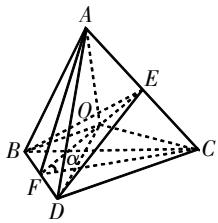
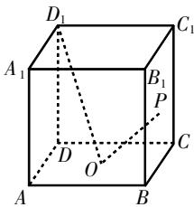
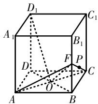
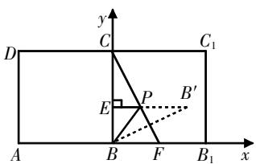
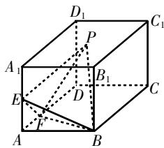
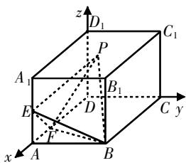
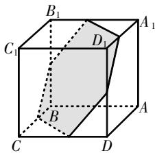

# 关于立体几何最值问题的解法 探究与教学建议

徐静 江苏省张家港市塘桥高级中学 215600

[摘 要] 立体几何最值问题是高中数学的重难点问题,探究解析问题、总结解题方法、生成解题策略是课堂教学重点. 文章引例探究,总结解法,结合实例强化应用,并提出相应的教学建议.

[关键词] 立体几何;最值;构造;参数;特殊位置

立体几何最值问题较为常见,问题类型众多,如空间角最值、体积最值、空间距离最值、面积最值等. 探究解析时需要把握几何体特征,结合相关知识转化,采用合理方法开展.

# 引例探究

# 1. 例题呈现

已知菱形ABCD, AB=BD=2, 现将 $\triangle ABD$ 沿对角线BD向上翻折, 得到三棱锥A-BCD. 若点E是AC的中点, $\triangle BDE$ 的面积为 $S_{1}$ , 三棱锥A-BCD的外接球被平面BDE截得的截面面积为 $S_{2}$ , 则 $S_{1}\cdot S_{2}$ 的最小值为 \_\_\_\_.

# 2. 探究解析

本题以菱形为背景,通过翻折构建空间几何模型,设定图形面积,探究面积乘积的最小值. 解析突破需要分三个阶段进行:第一阶段,分析空间几何性质,推理几何条件;第二阶段,构建面积模型,推导面积乘积关系式;第三阶段,充分利用不等式的相关性质,分析面积乘积最值.

如图1所示,取BD的中点F,连接EF,DE,BE,CF,AF, $CF=AF=\sqrt{3}$ . 因为E是中点,所以 $EF\perp AC$ . 设 $\angle EFC=\alpha\left(0<\alpha<\frac{\pi}{2}\right)$ ，则 $EF=\sqrt{3}\cos\alpha$ . 对于 $\triangle BDE$ ,其面积可表示为 $S_{1}=\frac{1}{2}BD\cdot EF=\sqrt{3}\cos\alpha$ .

text_image

Geometric diagram of a tetrahedron with labeled vertices and internal points, showing edges and angles.

图1

由 $AC \perp BE, AC \perp DE$ , 可得 $AC \perp$ 平面 $BDE$ . 由球心 $O$ 到点 $A, C$ 的距离相等, 可知球心 $O$ 在平面 $BDE$ 上. 又球心 $O$ 到点 $B, D$ 的距离相等, 可得球心 $O$ 在直线 $EF$ 上. 所以, 三棱锥 $A-BCD$ 的外接球被平面 $BDE$ 截得的截面圆的半径等于球的半径, 设为 $R$ , 则 $R^2 = OF^2 + FD^2 = OE^2 + AE^2$ , 所以 $1 + OF^2 = (\sqrt{3} \cos \alpha - OF)^2 + 3 \sin^2 \alpha$ , 可得 $OF = \frac{1}{\sqrt{3} \cos \alpha}$ . 所以, $R^2 = \frac{1}{3 \cos^2 \alpha} + 1$ , 截面面积 $S_2 = \pi \left( \frac{1}{3 \cos^2 \alpha} + 1 \right)$ .

综上可得, $S_{1}\cdot S_{2}=\sqrt{3}\pi\left(\frac{1}{3\cos^{2}\alpha}+\right.$

$$
1) \cdot \cos \alpha = \sqrt {3} \pi \left(\frac {1}{3 \cos \alpha} + \cos \alpha\right) \geqslant 2 \pi .
$$

分析可知, 当 $\cos\alpha=\frac{\sqrt{3}}{3}$ 时等号成立, 故 $S_{1}\cdot S_{2}$ 的最小值为 $2\pi$ .

# 3. 解后评析

本题通过翻折将平面几何与立体几何相融合,探究截面面积之积的最小值,考查空间解析转化、几何性质定理以及最值分析方法.问题难度中等,解析突破需要把握菱形与三棱锥性质之间的关系,构建面积模型,采用均值不等式.其中最值问题的解析方法是探究学习的关键.

# 方法总结

本文在此总结立体几何最值问题的解析方法,构建分析思路,形成对应的解题策略.

# 策略1:侧面展开,巧求最值

将平面图形空间化是立体几何问题构建的重要形式,对于该类立体几何最值问题,可将空间图形平面化,降低思维难度,利用平面几何相关知识来解析. 该策略适用于折叠型空间几何问题、规则型空间几何问题. 解析过程分两步:

第一步,把握几何特征,展开图形;

第二步,把握性质间的关系,利用几何知识解析最值.

# 策略2:构造函数,妙求最值

函数也可作为解析工具,应用于立体几何最值问题的求解中,即利用函数的性质(函数的值域、单调性等)分析最值,或构造函数后利用均值不等式求最值. 解析过程分两步:

第一步,分析几何条件,设定变量,构造该变量的函数;

第二步,根据函数特征,确定求解方法,如“配方法”“求导法”“单调性法”“均值不等式法”等,解析最值.

# 策略3: 特殊位置, 确定最值

对于空间几何最值问题,还可以通过研究特殊位置来解析,如通过分析动点、动线段的轨迹求最值. 解析过程也分两步:

第一步,分析几何运动,准确把握运动中的临界点、极限点,构建模型;

第二步,根据模型分析运动变化,确定最值情形,求解最值.

# 应用探究

上面总结了三种立体几何最值问题解析策略,下面结合实例展开应用探究.

# 1. 侧面展开,巧求最值

例1 如图2所示,在棱长为2的正方体 $ABCD-A_{1}B_{1}C_{1}D_{1}$ 中,O为底面ABCD的中心,点P在侧面 $BCC_{1}B_{1}$ 内运动且 $D_{1}O\perp OP$ ,则点P到底面ABCD的距离与它到点B的距离之和最小是

分析 本题以正方体为背景,构建空间动态模型,求解距离之和的最

text_image

D₁
A₁
C₁
B₁
P
D
O
C
A
B

图2

小值. 求解时可采用“侧面展开”策略，将正方体展开为平面图形, 利用空间与平面的性质关系，构建距离模型，解析最值.

详解 取 $BB_{1}$ 的中点F, 连接AC,
FA, FC, BD, FO, 如图3所示. 由 $\frac{DD_{1}}{OB}=\frac{2}{\sqrt{2}}=\sqrt{2}$ , $\frac{DO}{BF}=\frac{\sqrt{2}}{1}=\sqrt{2}$ , $\angle D_{1}DO = \angle FBO = 90^{\circ}$ 可知 $\triangle D_{1}DO \sim \triangle OBF$ ，则 $\angle D_{1}OD = \angle OFB$ .

text_image

D₁
A₁
C₁
B₁
D
F
P
C
O
A
B

图3

由 $\angle D_{1}OD + \angle D_{1}OF + \angle BOF = 180^{\circ}$ 可知 $\angle D_{1}OF = 90^{\circ}$ ，即 $D_{1}O \perp OF$ 。因为 $AC \subset$ 平面 $ABCD, B_{1}B \perp$ 平面 $ABCD$ ，所以 $AC \perp B_{1}B$ 。又 $AC \perp BD, BD \cap B_{1}B = B$ ，所以 $AC \perp$ 平面 $BDD_{1}B_{1}$ 。

由于 $D_{1}O\subset$ 平面 $BDD_{1}B_{1}$ ，则 $AC\perp D_{1}O$ 。又 $AC\cap OF=O$ ，所以 $D_{1}O\perp$ 平面ACF。由于 $D_{1}O\perp OP$ ，则 $OP\subset$ 平面ACF， $P\in$ 平面ACF。由于点P在侧面 $BCC_{1}B_{1}$ 内，故 $P\in CF$ （平面 $ACF\cap$ 平面 $BCC_{1}B_{1}=CF$ ）。因为平面 $BCC_{1}B_{1}\perp$ 平面ABCD，且交线为BC，所以点P到平面ABCD的距离即点P到BC的距离。

将平面 $BCC_{1}B_{1}$ 沿BC翻折到与平面ABCD共面，如图4所示， $B,B^{\prime}$ 关于CF对称，过 $B^{\prime}$ 作 $B^{\prime}E\perp BC$ 于E，则 $|B^{\prime}E|$ 即点P到底面ABCD的距离与它到点B的距离之和的最小值．以B为原点，建立图4所示的坐标系，则 $B(0,0),F(1,0),C(0,2)$ ，直线CF的方程为 $\frac{x}{1}+\frac{y}{2}=1$ ，即 $2x+y-2=0$ 。设 $B^{\prime}(x_{0},$

$$
y _ {0}), \text {则} \left\{ \begin{array}{l l} \frac {y _ {0}}{x _ {0}} \cdot (- 2) = - 1, \\ 2 \cdot \frac {x _ {0}}{2} + \frac {y _ {0}}{2} - 2 = 0 \end{array} \Rightarrow \left\{ \begin{array}{l l} x _ {0} = \frac {8}{5}, \\ y _ {0} = \frac {4}{5}, \end{array} \right. \right. \text {所以}
$$

$$
\left| B ^ {\prime} E \right| = x _ {0} = \frac {8}{5}.
$$

text_image

y
C
D
C₁
E
P
B′
A
B
F
B₁
x

图4

评析 上述求解采用的是“侧面展开”策略. 首先解析空间几何特征性质, 确定几何位置关系; 其次把空间图形展开成平面图形, 将空间距离问题转化成平面距离问题; 最后构建坐标系, 利用平面几何相关知识求解最值.

# 2. 构造函数,妙求最值

例2 如图5所示,在长方体ABCD- $A_{1}B_{1}C_{1}D_{1}$ 中,已知点E是 $AA_{1}$ 的中点,点F是AD上一点, $AB=AA_{1}=2,BC=3,AF=1$ ,动点P在上底面 $A_{1}B_{1}C_{1}D_{1}$ 上,且满足三棱锥P-BEF的体积等于1,则直线CP与 $DD_{1}$ 所成角的正切值的最小值为\_\_\_\_.

text_image

D₁
P
C₁
A₁
B₁
E
D
C
F
A
B

图5

分析 本题以长方体为背景构建动态模型,求解异面直线所成角的正切值的最小值. 解析突破可采用“空间向量”与“构造函数”相结合的方法,分两步完成:第一步,建立空间直角坐标系,利用向量法以及异面直线夹角公式构建函数;第二步,利用函数的性质求解最值.

详解 以 D 为原点, DA, DC, $DD_{1}$ 所在直线为 x 轴、y 轴、z 轴建立图6所示的空间直角坐标系, 则 $F(2,0,0)$ , $E(3,0,1)$ , $B(3,2,0)$ , $C(0,2,0)$ , $D_{1}(0,0,2)$ .

text_image

z
D₁
C₁
P
A₁
B₁
E
D
C y
F
A
B
x

图6

设 $P(m,n,2)(0\leqslant m\leqslant3,0\leqslant n\leqslant2)$ ，则 $\overrightarrow{FB}=(1,2,0),\overrightarrow{FE}=(1,0,1),\overrightarrow{CP}=(m,n-2,2),\overrightarrow{DD_{1}}=(0,0,2).$

设平面BFE的法向量为 $a=(x,y,z)$ ，则 $\left\{\begin{aligned}a\cdot\overrightarrow{FB}&=x+2y=0,\\ a\cdot\overrightarrow{FE}&=x+z=0.\end{aligned}\right.$ ，令x=2，则z=-2，y=-1，所以平面BFE的一个法向量为 $a=(2,-1,-2)$ .

由于 $\overrightarrow{EP}=(m-3,n,1)$ ，故点P到平面BFE的距离 $d=\frac{\left|\boldsymbol{a}\cdot\overrightarrow{EP}\right|}{\left|\boldsymbol{a}\right|}=\frac{\left|2m-8-n\right|}{3}$ .
因为 $EF = \sqrt{1^{2} + 1^{2}} = \sqrt{2}$ ，BF = BE = $\sqrt{1^{2} + 2^{2}} = \sqrt{5}$ ，所以在等腰三角形BEF中，FE上的高为 $\sqrt{(\sqrt{5})^{2}-\left(\frac{\sqrt{2}}{2}\right)^{2}} = \frac{3\sqrt{2}}{2}$ ，所以 $S_{\triangle BFE} = \frac{1}{2} \times \sqrt{2} \times \frac{3\sqrt{2}}{2} = \frac{3}{2}$ .

因为 $V_{P-BFE}=\frac{1}{3}\times S_{\triangle BFE}\times d=\frac{1}{3}\times\frac{3}{2}\times$ d=1,所以 $d=\frac{|2m-n-8|}{3}=2$ ,即2m-n=2
或2m-n=14(舍去).设直线CP与 $DD_{1}$ 所成的角为 $\theta$ ,则 $\theta\in\left[0,\frac{\pi}{2}\right]$ ,可得 $\cos\theta=$ $\frac{\left|\overrightarrow{CP}\cdot\overrightarrow{DD_{1}}\right|}{\left|\overrightarrow{CP}\right|\left|\overrightarrow{DD_{1}}\right|}=\frac{4}{2\times\sqrt{m^{2}+(n-2)^{2}+4}}=$ $\frac{2}{\sqrt{m^{2}+(2m-4)^{2}+4}}=\frac{2}{\sqrt{5m^{2}-16m+20}}=$ $\frac{2}{\sqrt{5\left(m-\frac{8}{5}\right)^{2}+\frac{36}{5}}}$ .

令 $h(m) = 5\left(m - \frac{8}{5}\right)^2 +\frac{36}{5}$ . 分析可知, 当 $m = \frac{8}{5}$ 时, $h(m)$ 取得最小值 $\frac{36}{5}$ , 对应的 $\cos \theta$ 取得最大值 $\frac{\sqrt{5}}{3}$ , 此时 $\theta$ 最小, $\tan \theta$ 最小. 结合 $\sin^2\theta +\cos^2\theta = 1,\theta \in \left[0,\frac{\pi}{2}\right]$ , 求得 $\sin \theta = \frac{2}{3}$ , 所以 $\tan \theta = \frac{\frac{2}{3}}{\frac{\sqrt{5}}{3}} = \frac{2\sqrt{5}}{5}$ , 即直线 $CP$ 与 $DD_{1}$ 所成

角的正切值的最小值为 $\frac{2\sqrt{5}}{5}$ .

评析 上述求解采用的是“空间向量”与“构造函数”相结合的方法，即先利用空间向量法推导直线CP与 $DD_{1}$ 所成角的正切值的代数式，再构造函数，利用函数的性质求解最小值.

# 3. 特殊位置,确定最值

例3 已知正方体的棱长为1,每条棱所在直线与平面 $\alpha$ 所成的角都相等,则 $\alpha$ 截此正方体所得截面面积的最大值为\_\_\_\_.

分析 本题设定正方体的棱长, 构建截面模型, 探究截面面积的最大值, 可采用“特殊位置分析推理”的策略求解. 本题背景具有一般性, 可先绘制空间几何模型, 关注截面变化, 总结规律, 再确定最值情形, 进而求解最值.

解析 根据题意可知,平面 $\alpha$ 与正方体的一条体对角线垂直. 记正方体为 $ABCD-A_{1}B_{1}C_{1}D_{1}$ , 不妨设平面 $\alpha$ 与 $AC_{1}$ 垂直, 且交于点M; 平面 $A_{1}BD$ 、平面 $B_{1}D_{1}C$ 与直线 $AC_{1}$ 分别交于点P, Q, 正方体的中心为O.

易证: M从A运动到P, 截面为三角形且周长逐渐增大; M从P运动到Q, 截面为六边形且周长不变; M从Q运动到 $C_{1}$ , 截面为三角形且周长逐渐减小.

我们熟知周长一定的多边形中,正多边形的面积最大,因此当M运动到O时,截面是边长为 $\frac{\sqrt{2}}{2}$ 的正六边形,截面面积最大,为 $6\times\frac{\sqrt{3}}{4}\times\left(\frac{\sqrt{2}}{2}\right)^{2}=\frac{3\sqrt{3}}{4}$ .

text_image

B₁
C₁
D₁
A₁
B
C
D

图7  
评析 上述求解先设定具体几何

模型,分析点的运动轨迹,以及图形周长的变化规律,然后结合几何周长与面积之间的关系确定最值情形.

# 教学建议

上面针对立体几何最值问题展开解法探究,总结了三种常用策略,下面结合教学实践提几点建议.

# 1. 挖掘问题特征,提取几何模型

立体几何最值问题是高中数学的重难点问题,其题设条件、图形特征较为特殊,串联了代数与几何相关知识.探究解析时要理解立体条件,挖掘特性特征,结合关联知识转化问题;要注意提取几何模型,如上述提取的翻折模型、正方体截面模型等.教学引导分三个阶段:第一阶段,理解题干条件,读懂空间几何;第二阶段,挖掘几何特征、性质;第三阶段,数形结合,构建解题模型.

# 2. 总结问题解法,形成解题策略

立体几何最值问题类型多样,解法也不唯一(上述探究就总结了三种常用策略). 因此,在解题教学中,教师要引导学生主动总结问题解法,完善对应策略. 方法探究总结可按如下思路进行:引例探究→解后分析→方法总结→应用强化. 即提炼解法,生成策略,拓展应用,强化解法. 方法探究总结要注意两点:一是探究总结要包括方法含义、解题思路、问题题型等内容;二是细化构建过程,完善分步策略.

# 3. 感悟解题方法,体会数学思想

解法探究是拓展学生思维、提升学生解题能力的重要方式。在探究教学中，教师要引导学生感悟解法，体会其中的数学思想。例如“构造函数”策略，就隐含了构造思想、化归与转化思想等。教学引导可从以下三个方面进行：一是从思路过程进行引导，让学生思考构造函数的方法；二是从思想内涵进行引导，让学生感悟“构造”的含义；三是从思维层面进行引导，让学生体验构造过程，感知应用思想方法解题的便利。