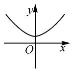
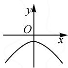
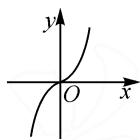
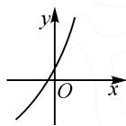
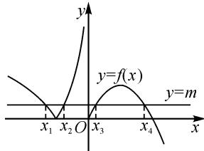
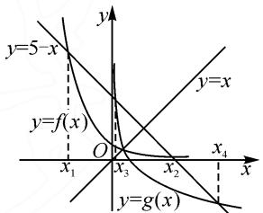
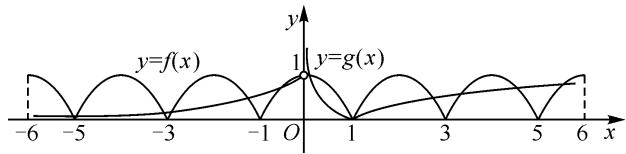

# 数形结合思想巧解题,对数函数图象妙应用

# ● 安徽省蒙城第二中学 王琼

摘要: 正确理解并掌握对数函数的图象与性质, 借助数形结合思想来分析或处理与对数函数的图象和性质相关的问题, 成为对数函数模块知识考查的一个重要方向. 本文中以对数函数图象为依托, 结合典型实例, 应用数形结合思想处理一些与之相关的综合应用问题, 归纳总结解题技巧与策略.

关键词: 对数函数; 图象; 数形结合; 参数; 方程

对数函数是高中数学中基本的初等函数模型之一,是继幂函数、指数函数后又一重要的函数模型,是中学基本初等函数中非常重要的一种函数形式,更是高考数学试卷中必考的基本内容之一.巧妙借助数形结合思想来处理涉及对数函数的基本性质及其相应的综合应用问题,成为学习的重点与难点.在对数函数的图象与性质问题中,可巧妙“以数助形”或“以形助数”,通过数形结合实现对数函数中相关综合应用问题的突破与求解.

# 1 图象识别

图象识别是借助对数函数的图象与性质等信息，正确识别与之对应的对数函数图象或与之相关的其他函数图象等，巧妙“以数助形”，数形结合转化，正确进行图象识别与图象应用等.

例 1 函数 $f(x)=\log_{2}(4^{x}+1)-x$ 的部分图象大致为().

  
A

  
B

  
C

  
D

解析:依题,对任意的 $x \in R$ , 恒有 $4^{x} + 1 > 0$ 成立, 则函数 $f(x) = \log_{2}(4^{x} + 1) - x$ 的定义域为 R.

又因为 $f(x) = \log_2(4^x + 1) - x = \log_2(4^x + 1) - \log_22^x = \log_2\frac{4^x + 1}{2^x} = \log_2(2^x + 2^{-x})$ ，则 $f(-x) = \log_2(2^{-x} + 2^x) = f(x)$ . 结合偶函数的定义，可知函数 $f(x)$ 为偶函数，则函数 $f(x)$ 的图象关于 $y$ 轴对称，由此可以排除选项 C, D.

由基本不等式, 可得 $f(x)=\log_{2}(2^{x}+2^{-x})\geqslant \log_{2}(2\sqrt{2^{x}\cdot2^{-x}})=1$ , 当且仅当 $2^{x}=2^{-x}$ , 即 x=0 时, 等号成立, 所以函数 $f(x)$ 有最小值, 由此可以排除选项 B.

故选答案:A.

点评:解决此类涉及对数函数中图象识别及其应用问题,关键在于从对数函数的图象与性质入手,从对数函数中相关参数的确定与应用切入,合理进行图象的平移、变换等处理.特别是,在识别对数函数图象时,要善于利用对数函数的性质、函数图象上的特殊点(与坐标轴的交点、最高点、最低点等)排除不符合要求的选项.

# 2 参数取值

参数取值是借助对数函数的图象与性质等信息，联系对应的函数基本性质与图象结构特征，合理构建联系，数形结合，为参数的最值或取值范围的确定创造条件.

例 2 已知函数 $f(x)=\left\{\begin{aligned}&|\log_{2}(-x)|,&x<0,\\&-x^{2}+2ax,x\geqslant0,\end{aligned}\right.$ 若方程 $f(x)-m=0$ 的 4 个解为 $x_{1},x_{2},x_{3},x_{4}$ ，且满足 $0<x_{1}x_{2}x_{3}x_{4}<2$ ，则实数 a 的取值范围为 \_\_\_\_.

解析:依题,若 $a \leqslant 0$ , 由方程 $f(x) - m = 0$ , 可知直线 y = m 与函数 $f(x) = -x^{2} + 2ax = -(x - a)^{2} + a^{2}(x \geqslant 0)$ 最多只有一个交点, 显然不符合题意, 故 a > 0.

画出函数 $f(x)=\left\{\begin{aligned}&|\log_{2}(-x)|,&x<0,\\&-x^{2}+2ax,x\geqslant0\end{aligned}\right.$ 的图象,如图1所示.

不妨假设 $x_{1}<x_{2}<0<x_{3}<x_{4}$ . 当 x<0 时，$\log_{2}(-x_{1})=-\log_{2}(-x_{2})$ ，则 $x_{1}x_{2}=1$ 。

text_image

y
y=f(x)
y=m
x₁ x₂ O x₃ x₄
x

图1

当 $x \geqslant 0$ 时， $f(x)_{\max} = f(a) = a^2$ ，所以 $0 < m < a^2$ .

令 $-x^{2}+2ax-m=0$ ，由根与系数的关系可知 $x_{3}x_{4}=m$ ，即 $0<x_{3}x_{4}<a^{2}$ ，所以 $x_{1}x_{2}x_{3}x_{4}$ 的取值范

围是 $(0,a^{2})$ .

又 $0 < x_{1}x_{2}x_{3}x_{4} < 2$ ，所以 $a^2 \leqslant 2.$ 又 $a > 0$ ，所以 $0 < a \leqslant \sqrt{2}$ .

所以实数 a 的取值范围为 $(0, \sqrt{2}]$ .

点评: 解决此类涉及对数函数中的参数取值及其应用问题时, 关键在于构建函数的解析式与图象之间的联系, 在数形结合应用的同时, 要注意兼顾“以形助数”与“以数助形”的联系, 给参数值的确定提供条件, 特别是端点处的取值情况, 以确定参数取值范围的准确性.

# 3 方程的解

方程的解是借助对数函数的图象与性质等信息，将对数方程或与之相关的方程转化为对应的函数问题，通过两个函数图象的交点情况与位置等，利用数形结合法求解对应的方程的解及其应用问题.

例 3 设方程 $\left(\frac{1}{2}\right)^{x}+x-5=0$ 的解为 $x_{1},x_{2}$ ，方程 $\log_{\frac{1}{2}}x+x-5=0$ 的解为 $x_{3},x_{4}$ ，则 $x_{1}+x_{2}+x_{3}+x_{4}=$ \_\_\_\_.

解析:由方程 $\left(\frac{1}{2}\right)^{x}+x-5=0$ ,得 $\left(\frac{1}{2}\right)^{x}=5-x$ .
由方程 $\log_{\frac{1}{2}}x+x-5=0$ ，得 $\log_{\frac{1}{2}}x=5-x$ .

在同一平面直角坐标系中作出函数 $f(x) = \left(\frac{1}{2}\right)^x, g(x) = \log_{\frac{1}{2}} x, y = 5 - x$ 的图象，不妨设 $x_1 < x_3 < x_2 < x_4$ ，如图2所示.

text_image

y=5-x
y=f(x)
O
x₁
x₃
x₂
x₄
y=g(x)

图2

因为函数 $f(x) = \left(\frac{1}{2}\right)^x$ 与 $g(x) = \log_{\frac{1}{2}}x$ 的

图象关于直线 y = x 对称，则可得点 $\left(x_{1}, \frac{1}{2^{x_{1}}}\right)$ 与点 $(x_{4}, \log_{\frac{1}{2}} x_{4})$ ，点 $\left(x_{2}, \frac{1}{2^{x_{2}}}\right)$ 与点 $(x_{3}, \log_{\frac{1}{2}} x_{3})$ 分别都关于直线 y = x 对称.

由 $\left\{ \begin{array}{l} y = x, \\ y = 5 - x, \end{array} \right.$ 解得 $\left\{ \begin{array}{l} x = \frac{5}{2}, \\ y = \frac{5}{2}, \end{array} \right.$ 即两直线的交点为 $\left( \frac{5}{2}, \frac{5}{2} \right)$ , 则 $\frac{x_1 + x_4}{2} = \frac{5}{2}, \frac{x_2 + x_3}{2} = \frac{5}{2}$ .

所以 $x_{1}+x_{2}+x_{3}+x_{4}=10.$

点评: 解决此类涉及对数函数中方程的解及其应用问题时,关键在于合理转化对应的方程,将方程问题转化为两个函数的图象交点问题,进而借助对数函数的图象与直线及其他相关的简单函数图象加以数形结合,利用图象的结构特征与基本性质来分析与解决方程的解的应用问题.

# 4 零点情况

零点情况是借助对数函数的图象与性质等信息，将对应的零点问题转化，借助对数函数的图象，以及其他相关的函数与图象加以直观分析，数形结合来确定零点的个数.

例 4 若函数 $y=f(x)(x\in\mathbf{R})$ 满足 $f(x+1)=-f(x)$ ，且 $x\in[-1,1]$ 时， $f(x)=1-x^{2}$ ，已知函数 $g(x)=\left\{\begin{aligned}&|\lg x|,&x>0,\\&\mathrm{e}^{x},&x<0,\end{aligned}\right.$ 则函数 $h(x)=f(x)-g(x)$ 在区间 $[-6,6]$ 内的零点个数为（）.

A.14

B.13

C.12

D.11

解析:依题,因为 $f(x+1)=-f(x)$ , 则 $f(x+2)=-f(x+1)=f(x)$ , 所以 $y=f(x)(x\in\mathbf{R})$ 是周期为 2 的周期函数.

对于函数 $y=g(x)$ ，当 x<0 时， $g(x)\in(0,1)$ 且单调递增；当 0<x<1 时， $g(x)\in(0,+\infty)$ 且单调递减；当 $x\geqslant1$ 时， $g(x)\in[0,+\infty)$ 且单调递增.

依题, 可得 $f(-6)=f(0)=1>g(-6)$ , $f(1)=g(1)=0$ , $f(6)=f(0)=1>g(6)$ , 则 $y=f(x)$ , $y=g(x)$ 的图象如图 3 所示.

line

| x   | y=f(x) | y=g(x) |
| --- | ------ | ------ |
| -6  | 0      | 0      |
| -5  | 1      | 0      |
| -4  | 0      | 0      |
| -3  | 1      | 0      |
| -2  | 0      | 0      |
| -1  | 1      | 0      |
| 0   | 0      | 1      |
| 1   | 1      | 0      |
| 2   | 0      | 0      |
| 3   | 1      | 0      |
| 4   | 0      | 0      |
| 5   | 1      | 0      |
| 6   | 0      | 1      |

图3

数形结合,由图直观分析可知在区间 $[-6,6]$ 上,函数 $f(x)$ 与 $g(x)$ 图象的交点共有12个.

点评: 解决此类涉及对数函数中的零点情况及其应用问题时, 关键在于对相应的函数加以合理拆分, 转化为两个简单的基本初等函数的图象与性质问题, 通过两个函数图象间的交点情况、交点位置等来确定对应函数的零点个数、参数的取值情况等.

依托对数函数的图象与性质,特别是基于对数函数及其相关函数的图象,有时可巧妙整合幂函数、指数函数及一次函数、二次函数的图象等,合理数形结合,通过以形助数或以数助形的处理,直观想象,综合对数函数中的图象特征及相应的几何性质,给相应综合问题的切入与应用创造条件,实现直观分析、解决与对数函数相关的综合应用问题. Z