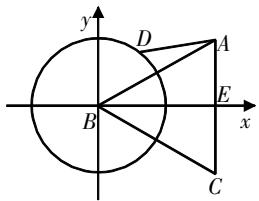
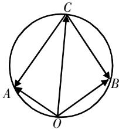
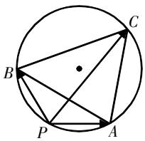
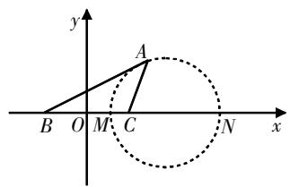

# 整合圆的特性,探索向量“隐圆”

王 耶 江苏省苏州实验中学 215004

[摘 要] 在解决向量问题时,构建隐圆模型同样适用. 在探究该知识点时,教师应指导学生把握构建模型的核心逻辑,基于几何圆的性质定理来构建向量隐圆模型,并通过具体实例强化学生的应用能力,使学生从本质上理解向量隐圆模型.

[关键词] 向量;隐圆模型;圆的特性

# 探究综述

在初中阶段,学生整合探究了几何与曲线中的隐圆,对隐圆模型有了一定的了解. 在高中阶段,向量知识将代数的运算性质和图形的直观感知进行了融合,参照几何与曲线中的隐圆,向量中必然也含有隐圆模型. 若能总结向量隐圆模型的构建原理,确定动点的轨迹,并直观感知向量的变化趋势,则能高效解决问题.

向量隐圆模型的构建,关键点是处理与向量条件相关的动点与定点.在教学中,教师应引导学生把握其核心逻辑,可总结为十二个字:以定找动,以量限动,以动构圆.具体内容如下:

以定找动——运动是相对的,探寻动点的前提为先给动点找到一个不动的参照点;

以量限动——动点的运动是受题干的等量或不等关系限制的,正是这种限制使得动点有“迹”可循,问题目标存在最值;

以动构圆——在正式构建圆形时,要以动点为目标,围绕限制条件进行构建.

# 模型探究

基于上述构建隐圆的核心逻辑,向量隐圆模型的构建可以从多个角度展开. 构建过程涉及整合处理向量关系,笔者建议教师进行归纳总结,逐一呈现,并结合实例进行指导以深化学生的理解.

# 模型一: 模长定值构“隐圆”

根据几何圆的特性知识可知,圆上任意一点到圆心的距离相等,即半径相等.从向量视角来看,则为模长相等,因此可以利用模长来构建隐圆模型.在教学中,建议设定模型条件,指导学生构建过程,揭示隐圆中的向量性质.

模型构建 记 $A, B, C$ 为定点，若出现 $\left|\overrightarrow{AP}\right| = \lambda, \left|\overrightarrow{AP} \pm \overrightarrow{AC}\right| = \lambda, \left|\overrightarrow{AP} - \overrightarrow{AB} - \overrightarrow{AC}\right| = \lambda$ ，都可以得出隐圆。此外，若出现 $\left|c - a - b\right| = \lambda$ ，我们可以设 $a = \overrightarrow{OA}, b = \overrightarrow{OB}, c = \overrightarrow{OC}$ ，这样可以转化成上述的第三种形式。

例1 已知 $\triangle ABC$ 为等边三角形，且边长为 2， $\overrightarrow{AB}$ 与 $\overrightarrow{BC}$ 的夹角大小为 $120^{\circ}$ . 若 $\left|\overrightarrow{BD}\right|=1,\overrightarrow{CE}=\overrightarrow{EA}$ ，则 $\overrightarrow{AD}\cdot\overrightarrow{BE}$ 的最小值为 \_\_\_\_.

模型解析 本例题探究的是向量数量积的最小值. 在教学中, 建议指导学生关注核心条件“ $\left|\overrightarrow{BD}\right|=1$ ”, 并根据题设条件, 设点B为定点, 点D为动点. 已知 $\left|\overrightarrow{BD}\right|=1$ , 显然模长为定值, 以量限动, 构建隐圆. 具体思路为: 先构建平面直角坐标系, 设定点B为圆心, 再以动构圆.

过程指导 已知 $\triangle ABC$ 是边长为 2 的等边三角形, 且 $\overrightarrow{CE} = \overrightarrow{EA}$ , 则点 E 为

AC的中点,可推知 $BE\perp AC$ . 现以点B为坐标原点, $\overrightarrow{BE},\overrightarrow{EA}$ 分别为x轴、y轴的正方向建立如图1所示的平面直角坐标系. 由于 $|\overrightarrow{BD}|=1$ ,因此动点D在以点B为圆心,边长为1的圆上.

text_image

y
D
A
B
E
x
C

图1

根据坐标系可确定 $A(\sqrt{3},1)$ ， $E(\sqrt{3},0),B(0,0)$ .设点 $D(\cos \theta ,$ $\sin \theta)$ ，则 $\overrightarrow{BE} = (\sqrt{3},0),\overrightarrow{AD} = (\cos \theta -$ $\sqrt{3},\sin \theta -1)$ ，所以 $\overrightarrow{AD}\cdot \overrightarrow{BE} = \sqrt{3}\cdot$ $(\cos \theta -\sqrt{3})\geqslant -\sqrt{3} -3.$ 分析可知，当且仅当 $\cos \theta = -1$ 时等号成立．因此， $\overrightarrow{AD}\cdot \overrightarrow{BE}$ 的最小值为 $-\sqrt{3} -3.$

方法总结 基于模长构建隐圆模型,其核心在于提取“模长定值”这一关键条件. 构建过程分两步:①根据题设条件确立动点和定点,以定点为圆心构建平面直角坐标系;②确定动点的轨迹圆,推导相关点的坐标,求解问题.

# 模型二: 定边定角构“隐圆”

几何中可以利用定边定角来构建隐圆,若转换到向量问题中,则可以指导学生构建外接圆模型:若两个或三个向量可以构造出一个三角形,且给出了一边一对角的条件,则可以考虑构造外接圆模型.

模型构建 若 $\left|a\pm b\right|,\langle a,b\rangle$ 均为定值,则可以构建隐圆.

例2 设向量a,b,c满足 $|a|=|b|=2,a\cdot b=-2,\langle a-c,b-c\rangle=60^{\circ}$ ，则 $|c|$ 的最大值等于\_\_\_\_.

模型解析 本例题设定了三个向量,以及相关向量的夹角. 解决此题需要特别关注其中的两个条件, 即 $a \cdot b = -2$ 和 $\langle a - c, b - c \rangle = 60^\circ$ , 分析其是否可以确定 $|a \pm b|$ 和 $\langle a, b \rangle$ 均为定值, 然后根据定边定角构建隐圆.

过程指导 已知 $\left|a\right|=\left|b\right|=2,a\cdot b=-2$ ，则 $\cos\langle a,b\rangle=\frac{a\cdot b}{\left|a\right|\cdot\left|b\right|}=-\frac{1}{2}$ ， $\langle a,b\rangle=120^{\circ}$ 。分析可知，能构建一个隐圆。设 $\overrightarrow{OA}=a,\overrightarrow{OB}=b,\overrightarrow{OC}=c$ ，则 $\overrightarrow{CA}=a-c,\overrightarrow{CB}=b-c,\angle AOB=120^{\circ},\angle ACB=60^{\circ}$ ，所以 $\angle AOB+\angle ACB=180^{\circ}$ 。由此可知 A, O, B, C 四点共圆，如图2所示。

text_image

C
A
O
B

图2

可设该圆为M, 因为 $\overrightarrow{AB}=b-a$ , 所以 $\overrightarrow{AB^{2}}=a^{2}-2a\cdot b+b^{2}=12$ , 则 $\left|\overrightarrow{AB}\right|=2\sqrt{3}$ . 由正弦定理可得 $\triangle AOB$ 的外接圆 M 的直径为 $2R=\frac{\left|\overrightarrow{AB}\right|}{\sin\angle AOB}=4$ , 所以当 $\left|\overrightarrow{OC}\right|$ 为圆 M 的直径时, $|c|$ 取得最大值 4.

方法总结 根据定边定角构建隐圆,其核心条件是 $|a\pm b|$ 和 $\langle a,b\rangle$ 均为定值. 在实际情形中,这两个向量条件不会直接给出,因此需要学生进行灵活的向量运算,逐一推导. 在构建模型时,需要注意两点:①明确定边以及相对应的定角;②根据向量条件推导出几何角,并明确哪些点共圆.

# 模型三: 对角互补构“隐圆”

根据圆的特性可知,圆内接四边形的对角互补. 反之,若某四边形的对角和为 $180^{\circ}$ ,则该四边形的四个顶点共圆. 这是从几何角度出发构建隐圆的思路. 而从向量的角度进行分析, 只需三个向量, 选取一个共同起点, 再加上三个终点, 便能构成一个四边形. 若该四边形满足上述条件, 便能构造出一个隐圆模型.

例3 已知平面向量 $a, b, c$ 满足 $|a| = 1, |b| = 2$ , 且 $a \cdot b = -1$ , 若向量 $a - c, b - c$ 的夹角为 $60^\circ$ , 则 $|c|$ 的最大值是 \_\_\_\_.

模型解析 本例题设定了三个向量,给出了相应的向量条件. 引导学生分析其中的向量数量积 $a \cdot b = -1$ , 得到 $a, b$ 的夹角为 $120^{\circ}$ , 然后根据 $a - c$ , $b - c$ 的夹角为 $60^{\circ}$ , 构建一个隐圆.

过程指导 设 $a=\overrightarrow{PA},b=\overrightarrow{PB},c=\overrightarrow{PC}$ . 已知 $|a|=1,|b|=2$ , 且 $a\cdot b=-1$ , 可得 $\cos\langle a,b\rangle=\frac{-1}{2\times1}=-\frac{1}{2}$ , 所以 $\angle APB=120^{\circ}$ . 因为向量 a-c, b-c 的夹角为 $60^{\circ}$ , 即 $\angle ACB=60^{\circ}$ , 所以在四边形 APBC 中, $\angle APB$ 与 $\angle ACB$ 互补. 通过对角互补构隐圆的思路可确定 A, P, B, C 四点共圆, 点 C 在优弧 $\widehat{AB}$ 上运动, 构建如图3所示的模型.

  
图3

分析可知, $|c|$ 的最大值为 $\triangle ABC$ 的外接圆的直径,于是将原问题转化为求解圆的直径的问题.因为 $AB=\sqrt{4+1-2\times2\times1\times\left(-\frac{1}{2}\right)}=\sqrt{7}$ ,结合正弦定理可得 $2R=\frac{\sqrt{7}}{\sin120^{\circ}}=\frac{2\sqrt{21}}{3}$ ,所

以 $|c|$ 的最大值是 $\frac{2\sqrt{21}}{3}$ .

方法总结 根据对角互补构建隐圆,其核心是基于题设条件推导两个对角为互补关系. 构建过程分两步: ①根据题设的三个向量来构建四边形; ②在向量条件的计算推导中, 提取对角互补的关系,以确定“四点共圆”, 即四边形的四个顶点位于同一个圆上.

# 模型四:构建比例圆

比例圆,又称阿波罗尼斯圆,在几何中较为常见.核心内容为:在平面上给定两点A,B,设点P满足 $\frac{|PA|}{|PB|}=\lambda$ ,则当 $\lambda>0$ 且 $\lambda\neq1$ 时,点P的轨迹是一个圆.

从向量的角度来看,则为 $|a|=\lambda|b|(\lambda>0$ 且 $\lambda\neq1)$ ,即当两个向量的模长为一定的比例时,可以考虑构造阿波罗尼斯圆.在教学中,引导学生先关注两个向量的模长比例关系,再考虑是否可以构建隐圆,从而确定动点的轨迹.

例4 在 $\triangle ABC$ 中, 已知 $BC = 2$ , 若 $AB = \sqrt{2} AC$ , 则 $\overrightarrow{BC} \cdot \overrightarrow{BA}$ 的取值范围是

模型解析 本例题以三角形为基础构建向量,给定了两个条件,求解向量数量积的取值范围. 在教学中,引导学生重点关注题目中线段间的关系,并建立平面直角坐标系,利用比例圆的构造原理来分析点A的运动轨迹.

过程指导 以BC的中点O为原点,BC所在的直线为x轴建立平面直角坐标系,如图4所示,可以推知 $B(-1,0)$ , $C(1,0)$ .

设点 $A(x,y)(y\neq0)$ ，已知AB= $\sqrt{2}AC$ ，则 $(x+1)^{2}+y^{2}=2[(x-1)^{2}+y^{2}]$ ，

text_image

y
A
B O M C N x

图4

化简可得 $(x-3)^{2}+y^{2}=(2\sqrt{2})^{2}(y\neq0)$ . 所以, 点A的轨迹为圆(不包含与x轴的交点). 记圆 $(x-3)^{2}+y^{2}=(2\sqrt{2})^{2}$ 与x轴的交点分别为M和N(点M在N的左侧), 则 $|BM|=4-2\sqrt{2}$ , $|BN|=4+2\sqrt{2}$ , 所以 $\overrightarrow{BC}\cdot\overrightarrow{BA}=\left|\overrightarrow{BC}\right|\cdot\left|\overrightarrow{BA}\right|\cdot\cos\angle ABC>\left|\overrightarrow{BC}\right|\cdot\left|\overrightarrow{BM}\right|=8-4\sqrt{2}$ , $\overrightarrow{BC}\cdot\overrightarrow{BA}<\left|\overrightarrow{BC}\right|\cdot\left|\overrightarrow{BN}\right|=8+4\sqrt{2}$ . 所以, $\overrightarrow{BC}\cdot\overrightarrow{BA}$ 的取值范围是 $(8-4\sqrt{2},8+4\sqrt{2})$ .

方法总结 构建比例圆的关键在于线段的比例关系,而在向量问题中则体现为向量模的比例关系. 在应用过程中,需要遵循两个步骤:①建立坐标系并构建向量;②依据向量模的比例关系构建隐圆模型,以确定动点的轨迹. 在构建隐圆时,应专注于动点的轨迹,排除与位置无关的因素.

# 教学反思

上文探究了向量问题中的四种隐圆模型,整合了这些模型的基础原理和构建过程,并结合实例进行了指导强化.如果学生掌握了这四种隐圆模型,那么就能够有效提升解题能力.接下来,笔者结合教学实践,提出三点建议.

# 建议一: 模型构建立足几何圆的特性

在初中阶段,学生已经掌握了构建几何隐圆模型的方法和技巧,具备一定的知识基础. 在构建向量隐圆模型的过程中,教师应引导学生立足几何圆的特性,围绕圆的知识定理进行向量转化,实现自然过渡,帮助学生深入理解;应引导学生从圆的定理和性质入手,探索向量转化的思路,从而完成向量隐圆的构建.

# 建议二: 模型构建融合数形结合方法

向量隐圆模型同样具有“代数”与“几何”的双重特性. 在构建向量隐圆模型的过程中, 教师应引导学生采用数形结合的方法, 从向量条件入手, 构建直观图形, 并结合图形来解读向量条件, 从而充分掌握向量隐圆模型. 在教学中, 需注意两点: ① 注意模型构建的过程讲解, 充分解析向量条件, 构建与几何特性的关联; ② 在绘制图形时, 指导学生思考建立坐标系的思路.

# 建议三:应用强化关注思路引导

模型应用的强化有助于学生深入理解,在该教学阶段中,教师应专注于培养学生的数学思维,并指导他们构建解题思路. 具体分为三个环节:首先是题设分析和思路引导;其次是过程构建和模型构建;最后是解后反思和方法总结. 学生从“解题分析”过渡到“过程构建”,并进行“反思总结”,有助于充分掌握向量隐圆问题的基本解决方法.

# 写在最后

在探究向量隐圆模型的过程中,教师需要精通初中与高中数学知识的衔接点,从而引导学生从几何圆的基本性质和定理出发,深入探索向量隐圆模型. 整个教学过程应立足方法和原理,整合向量条件,使学生能从本质上理解向量隐圆模型.