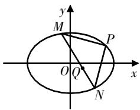

# 斜率之积(和)为定值时 定点、定向问题的求解及推广

周亮 陈国清 浙江省杭州市富阳区新登中学 311404

[摘 要] 研究者以斜率之积(和)为定值的试题为切入点,探究得到圆锥曲线中两直线斜率之积(和)为定值时,动弦所在的直线过定点或定向,揭示了其本质为圆锥曲线动弦的“保值性”,并利用“保值性”秒求试题答案.这一探究过程提示教师应从试题的背景出发,引导学生挖掘试题背后的深层含义,揭示其本质和规律,让学生能够举一反三、触类旁通,从而优化思维品质,提升核心素养.

[关键词] 斜率之积;斜率之和;定点;定向

斜率之积(和)为定值的问题是解析几何的一个重要题型. 它不仅能够检验学生对解析几何知识的掌握程度, 还能考查他们运用数形结合、转化与化归等数学思想的能力, 从而全面考查学生的逻辑推理、数学运算等核心素养. 这类问题具有较高的区分度与选拔性, 是高考中的一个热门考点. 本文拟就斜率之积(和)为定值时定点、定向问题的求解方法进行总结和推广.

# 试题呈现

例1 已知椭圆 $C:\frac{x^{2}}{a^{2}}+\frac{y^{2}}{b^{2}}=1(a>b>0)$ 的离心率为 $\frac{\sqrt{2}}{2}$ ，且过点 $A(2,1)$ .

(1)求C的方程；

(2) 点 M, N 在 C 上, 且 $AM \perp AN, AD \perp MN, D$ 为垂足. 证明: 存在定点 Q, 使得 $|DQ|$ 为定值.

解析 (1) $\frac{x^{2}}{6}+\frac{y^{2}}{3}=1$ (略).

(2)①若MN的斜率存在,设MN:y=kx+m,与椭圆联立

得 $(1 + 2k^{2})x^{2} + 4kmx + 2m^{2} - 6 = 0.$ 设 $M(x_{1},y_{1}),N(x_{2},y_{2})$ ，则 $x_{1}+$ $x_{2} = -\frac{4km}{1 + 2k^{2}},x_{1}x_{2} = \frac{2m^{2} - 6}{1 + 2k^{2}}.$ 又 $k_{AM}\cdot k_{AN} = \frac{(kx_1 + m - 1)(kx_2 + m - 1)}{(x_1 - 2)(x_2 - 2)} =$

-1, 化简得 $(2k + 3m + 1)(2k + m - 1) = 0$ (※), 故 $m = -\frac{2k + 1}{3}$ 或 $m = 1 - 2k$ . 所以, $MN: y = k\left(x - \frac{2}{3}\right) - \frac{1}{3}$ 或 $y = k(x - 2) + 1$ , 其过定点 $E\left(\frac{2}{3}, -\frac{1}{3}\right)$ 或 $(2,1)$ (舍).

②若MN的斜率不存在,设MN:x=m,与椭圆联立得 $y^{2}=3-\frac{m^{2}}{2}$ . 设 $M(m,y_{1})$ ,则 $N(m,-y_{1})$ . 由 $k_{AM}\cdot k_{AN}=\frac{(y_{1}-1)(-y_{1}-1)}{(m-2)(m-2)}=-1$ 化简得 $\frac{3}{2}m^{2}-8m+4=0$ ,解得 $m=\frac{2}{3}$ 或2(舍). 因此,MN:x= $\frac{2}{3}$ ,其过定点 $E\left(\frac{2}{3},-\frac{1}{3}\right)$ .

综上所述, 直线MN过定点 $E\left(\frac{2}{3}, -\frac{1}{3}\right)$ . 因为 $|AE|$ 为定值, 且为Rt△ADE的斜边, 所以存在线段AE的中点

$Q\left(\frac{4}{3},\frac{1}{3}\right)$ ，使得 $|QD|$ 为定值( $|AE|$ 长度的一半).

点评 第(2)问考查了直线垂直的双重含义:①垂直直线的斜率之积为-1;②在直角三角形中,斜边上的中线长度等于斜边长度的一半.本题将定值问题与定点问题合二为一,表面上看似是一个定值问题,实质上是斜率之积为定值的内接三角形动弦过定点问题.

例2 已知点 $A(2,1)$ 在双曲线 $C:\frac{x^{2}}{a^{2}}+-\frac{y^{2}}{a^{2}-1}=1(a>1)$ 上, 直线l交C于P,Q两点, 直线AP与AQ的斜率之和为0.求直线l的斜率.

解析 因为 $\frac{2^{2}}{a^{2}}-\frac{1^{2}}{a^{2}-1}=1$ ，所以 $a^{2}=2, C:\frac{x^{2}}{2}-y^{2}=1$ 。设 l:y=kx+m，与 C 联立得 $(1-2k^{2})x^{2}-4kmx-2m^{2}-2=0$ 。设 $P(x_{1},y_{1})$ ， $Q(x_{2},y_{2})$ ，则 $x_{1}+x_{2}=\frac{4km}{1-2k^{2}}, x_{1}x_{2}=\frac{-2m^{2}-2}{1-2k^{2}}$ 。由 $k_{AP}+k_{AQ}=\frac{kx_{1}+m-1}{x_{1}-2}+\frac{kx_{2}+m-1}{x_{2}-2}=0$ ，化简得 $(k+1)(2k+m-1)=0$ （※），解得 k=-1 或 m=-2k+1。若 m=-2k+1，则 $l:y=k(x-2)+1$ ，过定点 $(2,1)$ ，故舍去。因此，k=-1。

点评 在例1和例2中,如何将表达式因式分解为(※)式是解题的难点和关键所在. 这一步骤不仅考查学生对代数运算的熟练程度,还检验其逻辑思维和数学直觉. 通过细致的观察和推理,可以发现表达式中的隐藏规律,进而将其转化为更易处理的形式. 这种因式分解的技巧在解决斜率之积(和)为定值的问题时尤为重要,它能够帮助学生快速找到解题的突破口. 因此,在备考过程中,应加强学生对此类因式分解技巧的练习,以便在考试中能够迅速准确地应用.

# 引申拓展

如图1所示,从圆锥曲线上一定点P引出两条斜率之积(和)为定值的直线PM,PN,这种情形类似于手电筒发出的光线,故被形象地称为“手电筒”模型.研究发现该模型具有以下性质:

text_image

y
M
P
O Q x
N

图1

定理1 已知 $P(x_{0},y_{0})$ 是圆锥曲线 $\Gamma:Ax^{2}+By^{2}+Cx+Dy+E=0$ 上的一个定点, $k_{1},k_{2}$ 分别是 $\Gamma$ 的任意两条动弦PM,PN的斜率.

(1) $k_{1}\cdot k_{2}=\lambda\left(\lambda\neq\frac{A}{B}\right)$ 的充要条件是直线MN过定点 $Q\left(-\frac{(A+\lambda B)x_{0}+C}{A-\lambda B},\frac{(A+\lambda B)y_{0}+\lambda D}{A-\lambda B}\right);$   
(2) $k_{1}\cdot k_{2}=\lambda\left(\lambda=\frac{A}{B}\right)$ 的充要条件是直线MN有定向,即 $k_{MN}=\frac{-\lambda(2By_{0}+D)}{2Ax_{0}+C}$ ，或当 $2Ax_{0}+C=0$ 时， $MN\perp x$ 轴；  
(3) $k_{1}+k_{2}=\lambda(\lambda B\neq0)$ 的充要条件是直线MN过定点 $Q\left(\frac{\lambda Bx_{0}-2By_{0}-D}{\lambda B},\frac{-2Ax_{0}-\lambda By_{0}-C-\lambda D}{\lambda B}\right);$   
(4) $k_{1}+k_{2}=\lambda(\lambda B=0)$ 的充要条件是直线MN有定向,即 $k_{MN}=\frac{2Ax_{0}+C+\lambda D}{2By_{0}+D}$ ,或当 $2By_{0}+D=0$ 时,直线 $MN\perp x$ 轴.

证明 令 $x - x_0 = u, y - y_0 = v$ ，则 $x = u + x_0, y = v + y_0, \Gamma: A(u + x_0)^2 + B(v + y_0)^2 + C(u + x_0) + D(v + y_0) + E = 0$ ①.

因为 $Ax_{0}^{2}+By_{0}^{2}+Cx_{0}+Dy_{0}+E=0$ ，所以①式整理得 $Au^{2}+Bv^{2}+(C+2Ax_{0})u+(D+2By_{0})v=0$ .

设 $M(x_{1},y_{1}),N(x_{2},y_{2}),MN:mu+nv=1$ ，则 $Au^{2}+Bv^{2}+\left[(C+2Ax_{0})u+(D+2By_{0})v\right](mu+nv)=0$ ，整理得 $(B+2nBy_{0}+nD)\cdot\left(\frac{v}{u}\right)^{2}+(2nAx_{0}+2mBy_{0}+nC+mD)\cdot\frac{v}{u}+(A+2mA x_{0}+mC)=0$ ，且 $k_{1}=\frac{y_{1}-y_{0}}{x_{1}-x_{0}}=\frac{v_{1}}{u_{1}},k_{2}=\frac{v_{2}}{u_{2}}.$ 因此，若 $k_{1}\cdot k_{2}=\frac{A+2mA x_{0}+mC}{B+2nBy_{0}+nD}=\lambda$ ，则 $n=\frac{A+2mA x_{0}-\lambda B+mC}{\lambda(2By_{0}+D)},MN:mu+\frac{A+2mA x_{0}-\lambda B+mC}{\lambda(2By_{0}+D)}v=1$ ，即 $MN:m(2Ax_{0}v+2\lambda By_{0}u+Cv+\lambda Du)+(A-\lambda B)v-2\lambda By_{0}-\lambda D=0.$

(1) 若 $\lambda \neq \frac{A}{B}$ , 则 $\left\{ \begin{array}{l} 2Ax_{0}v + 2\lambda By_{0}u + Cv + \lambda Du = 0, \\ (A - \lambda B)v - 2\lambda By_{0} - \lambda D = 0, \end{array} \right.$ 解得 $\left\{ \begin{array}{l} u = -\frac{2Ax_{0} + C}{A - \lambda B}, \\ v = \frac{2\lambda By_{0} + \lambda D}{A - \lambda B}, \end{array} \right.$ 即 $MN$ 过定点 $y = v + y_{0} = \frac{(A + \lambda B)y_{0} + \lambda D}{A - \lambda B}$ .

$Q\left(-\frac{(A+\lambda B)x_{0}+C}{A-\lambda B},\frac{(A+\lambda B)y_{0}+\lambda D}{A-\lambda B}\right)$ . 上述证明可逆, 故为充要条件.

(2) 若 $\lambda = \frac{A}{B}$ , 则 $MN: m(2Ax_0v + 2\lambda By_0u + Cv + \lambda Du) - 2\lambda By_0 - \lambda D = 0$ , 故 $\lambda (2By_0 + D)u = -(2Ax_0 + C)v$ . 若 $2Ax_0 + C \neq 0$ , 则 $k_{MN} = \frac{v}{u} = \frac{-\lambda(2By_0 + D)}{2Ax_0 + C}$ ; 若 $2Ax_0 + C = 0$ , 则 $MN \perp x$ 轴. 上述证明可逆, 故为充要条件.  
(3) 若 $k_{1} + k_{2} = -\frac{2nAx_{0} + 2mBy_{0} + nC + mD}{B + nD + 2nBy_{0}} = \lambda$ ，可得 $n = \frac{-m(2By_{0} + D) - \lambda B}{2Ax_{0} + 2\lambda By_{0} + C + \lambda D}$ ，MN: $m[(2Ax_{0} + C + 2\lambda By_{0} + \lambda D)u - (2By_{0} + D)v] - \lambda Bv - 2Ax_{0} - 2\lambda By_{0} - C - \lambda D = 0.$ 若 $\lambda B \neq 0$ ，则

$$
\left\{ \begin{array}{l} (2 A x _ {0} + C + 2 \lambda B y _ {0} + \lambda D) u = (2 B y _ {0} + D) v, \\ \lambda B v = - 2 A x _ {0} - 2 \lambda B y _ {0} - C - \lambda D \end{array} \Rightarrow \left\{ \begin{array}{l} u = - \frac {2 B y _ {0} + D}{\lambda B}, \\ v = \frac {- 2 A x _ {0} - 2 \lambda B y _ {0} - C - \lambda D}{\lambda B}, \end{array} \right. \right.
$$

$$
\left\{ \begin{array}{l} x = \frac {\lambda B x _ {0} - 2 B y _ {0} - D}{\lambda B}, \\ y = \frac {- 2 A x _ {0} - \lambda B y _ {0} - C - \lambda D}{\lambda B}. \end{array} \text {即} M N \text {过定点} Q \left(\frac {\lambda B x _ {0} - 2 B y _ {0} - D}{\lambda B}, \right. \right.   \left. \frac {- 2 A x _ {0} - \lambda B y _ {0} - C - \lambda D}{\lambda B}\right). \text {上述证明可逆，故为充要条件.}
$$

(4) 若 $\lambda B = 0$ ，则 $MN: m[(2Ax_0 + C + \lambda D)u - (2By_0 + D)v] - 2Ax_0 - C - \lambda D = 0$ ，故 $(2Ax_0 + C + \lambda D)u = (2By_0 + D)v$ 。若 $2By_0 + D \neq 0$ ，则 $k_{MN} = \frac{2Ax_0 + C + \lambda D}{2By_0 + D}$ ；若 $2By_0 + D = 0$ ，则 $MN \perp x$ 轴。上述证明可逆，故为充要条件。

# 揭示本质

动弦MN过定点Q时, 直线PQ和曲线在点P处的切线l与动弦PM, PN在方向上具有一致的定值; 动弦MN有定向时, 动弦MN和曲线在点P处的切线l与动弦PM, PN在方向上也具有一致的定值. 这些结论揭示了圆锥曲线中一些优美的几何关系, 被称为圆锥曲线动弦的“保值性”, 即:

定理2 设P为圆锥曲线 $\Gamma$ 上的一个定点, $\Gamma$ 在点P处的切线为 $l,k_{1},k_{2}$ 分别是动弦PM,PN的斜率.

(1) 当 $k_{1} \cdot k_{2} = \lambda$ 时, 直线 MN 若过定点 Q, 则 $k_{PQ} \cdot k_{l} = \lambda$ ; 直线 MN 若有定向, 则 $k_{MN} \cdot k_{l} = \lambda$ ;  
(2) 当 $k_{1} + k_{2} = \lambda$ 时，直线 MN 若过定点 Q，则 $k_{PQ} + k_{l} = \lambda$ ；直线 MN 若有定向，则 $k_{MN} + k_{l} = \lambda$ .

证明 设曲线 $\Gamma: Ax^{2} + By^{2} + Cx + Dy + E = 0$ ，点 $P(x_{0}, y_{0})$ ，则切线 $l: Ax_{0}x + By_{0}y + \frac{C}{2}(x_{0} + x) + \frac{D}{2}(y_{0} + y) + E = 0, k_{l} = -\frac{2Ax_{0} + C}{2By_{0} + D}.$

(1) 当 $k_{1} \cdot k_{2} = \lambda$ 时, 若直线 MN 过定点 Q, 则由定理 1 可知 $Q\left(-\frac{(A + \lambda B)x_{0} + C}{A - \lambda B}, \frac{(A + \lambda B)y_{0} + \lambda D}{A - \lambda B}\right)$ , $k_{PQ} = \frac{y_{Q} - y_{0}}{x_{Q} - x_{0}} = -\frac{\lambda(2By_{0} + D)}{2Ax_{0} + C}$ , $k_{PQ} \cdot k_{l} = -\frac{\lambda(2By_{0} + D)}{2Ax_{0} + C} \cdot \left(-\frac{2Ax_{0} + C}{2By_{0} + D}\right) = \lambda$ . 若直线 MN 有定向, 则由定理 1 可知 $k_{MN} = \frac{-\lambda(2By_{0} + D)}{2Ax_{0} + C}$ , $k_{MN} \cdot k_{l} = -\frac{\lambda(2By_{0} + D)}{2Ax_{0} + C} \cdot \left(-\frac{2Ax_{0} + C}{2By_{0} + D}\right) = \lambda$ .  
(2) 当 $k_{1} + k_{2} = \lambda$ 时，若直线 MN 过定点 Q，则由定理 1 可知 $Q\left(\frac{\lambda B x_{0} - 2 B y_{0} - D}{\lambda B}, \frac{-2 A x_{0} - \lambda B y_{0} - C - \lambda D}{\lambda B}\right)$ ， $k_{PQ} = \frac{y_{Q} - y_{0}}{x_{Q} - x_{0}} = \frac{2 A x_{0} + C + \lambda (2 B y_{0} + D)}{2 B y_{0} + D}$ ， $k_{PQ} + k_{l} = \frac{2 A x_{0} + C + \lambda (2 B y_{0} + D)}{2 B y_{0} + D} - \frac{2 A x_{0} + C}{2 B y_{0} + D} = \lambda$ 。若直线 MN 有定向，则由定理 1 可知 $k_{MN} = \frac{2 A x_{0} + C + \lambda (2 B y_{0} + D)}{2 B y_{0} + D}$ ， $k_{MN} + k_{l} = \frac{2 A x_{0} + C + \lambda (2 B y_{0} + D)}{2 B y_{0} + D} - \frac{2 A x_{0} + C}{2 B y_{0} + D} = \lambda$ 。

根据定理2,例1和例2可以迅速求解.

例1: 设AM:y=1,AN:x=2,则M(-2,1),N(2,-1),MN: $y=-\frac{1}{2}x$ . 椭圆 $\frac{x^{2}}{6}+\frac{y^{2}}{3}=1$ 在点A(2,1)的切线l为 $\frac{2x}{6}+\frac{y}{3}=1$ , 即 $y=-x+3$ . 过点A(2,1)且与切线l垂直的方程为y=x-1,联立MN得定点 $E\left(\frac{2}{3},-\frac{1}{3}\right)$ .

例2: 双曲线 $C: \frac{x^{2}}{2}-y^{2}=1$ 在点 A(2,1) 的切线 l 为 $\frac{2x}{2}-y=1$ ，即 y=x-1。又 $k_{PQ}+k_{l}=0$ ，故 $k_{PQ}=-1$ 。

# 试题启示

对于新课改理念下的高考试题,教师不应局限于试题本身,而应从试题的背景出发,引导学生挖掘试题背后的深层含义,揭示其本质和规律,让学生能够举一反三、触类旁通,从而优化思维品质,提升核心素养.