# 极化恒等式应用举例

陈晓明

(安徽省宁国中学)

平面向量是高考数学考查的重要内容之一,而且近几年对平面向量的考查越来越灵活,题型多样,解法多变,让人捉摸不定,其中对平面向量数量积的考查显得尤为突出.涉及平面向量数量积的有关问题,运用极化恒等式求解有时能起到出奇制胜的效果.当遇到两个同起点且角度不定、模长不定的向量,要求它们的数量积时,可以考虑利用极化恒等式这一重要结论,这也体现了数形结合这一重要的数学思想在解题中的应用.

# 1 极化恒等式

# 1.1 极化恒等式的定义

极化恒等式指的是平面向量基本关系式:对于平面向量 a, b, 通过恒等变形可得 $a \cdot b = \frac{1}{4} \left[ (a + b)^{2} - (a - b)^{2} \right]$ . 极化恒等式可以将平面向量的数量积运算转化为平面向量线性运算的模, 如果将平面向量换成实数, 那么上述公式也叫“广义平方差”公式.

# 1.2 极化恒等式的几何意义

如图 1 所示, 对于平面内一组不共线向量的数量积, 它可以表示为以这组向量为邻边的平行四边形“和对角线长”与“差对角线长”平方差的 $\frac{1}{4}$ ，即

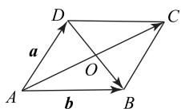  
图1

$$
\boldsymbol {a} \cdot \boldsymbol {b} = \frac {1}{4} [ (\boldsymbol {a} + \boldsymbol {b}) ^ {2} - (\boldsymbol {a} - \boldsymbol {b}) ^ {2} ] =
$$

$$
\frac {1}{4} \left(\overrightarrow {A C ^ {2}} - \overrightarrow {D B ^ {2}}\right) = \overrightarrow {A O ^ {2}} - \overrightarrow {O B ^ {2}},
$$

也可以看成以这组向量为邻边的平行四边形“半和对角线长”与“半差对角线长”的平方差(即 $\triangle ABD$ 的中线长AO与半底边长OB的平方差).

# 1.3 极化恒等式的三角形模式

如图 2 所示,由上述极化恒等式的几何意义易知,在 $\triangle ABC$ 中,若点 M 是 BC 的中点,则

$$
\overrightarrow {A B} \cdot \overrightarrow {A C} = \overrightarrow {A M ^ {2}} - \overrightarrow {M C ^ {2}}.
$$

这样极化恒等式就将平面向量的数量积关系转化为两个平面向量的长度关系,使不可度量的向量数量积关系转化为可度量、可计算的数量关系,其意义非同凡响.

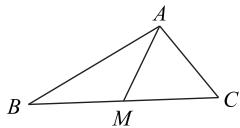  
图2

下面通过实例说明如何通过具体的问题情境,灵活运用极化恒等式解决问题.

# 2 应用举例

# 2.1 求值问题

例 1 （2014 年全国Ⅱ卷理 3）设向量 a, b 满足 $b \mid =\sqrt{10}$ , $|a - b| = \sqrt{6}$ , 则 $a \cdot b = (\quad)$ .

A. 1

B. 2

C. 3

D. 5

由极化恒等式得

解析

$$
\boldsymbol {a} \cdot \boldsymbol {b} = \frac {1}{4} [ (\boldsymbol {a} + \boldsymbol {b}) ^ {2} - (\boldsymbol {a} - \boldsymbol {b}) ^ {2} ] =
$$

$$
\frac {1}{4} \left[ | \boldsymbol {a} + \boldsymbol {b} | ^ {2} - | \boldsymbol {a} - \boldsymbol {b} | ^ {2} \right] = \frac {1}{4} (1 0 - 6) = 1,
$$

故选 A.

例 2 （2016 年江苏卷 13）如图 3 所示, 在 $\triangle ABC$ 中, D 是 BC 的中点, E, F 是 AD 上的两个三等分点, $\overrightarrow{BA} \cdot \overrightarrow{CA} = 4$ , $\overrightarrow{BF} \cdot \overrightarrow{CF} = -1$ , 则 $\overrightarrow{BE} \cdot \overrightarrow{CE}$ 的值是 \_\_\_\_.

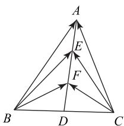

flowchart

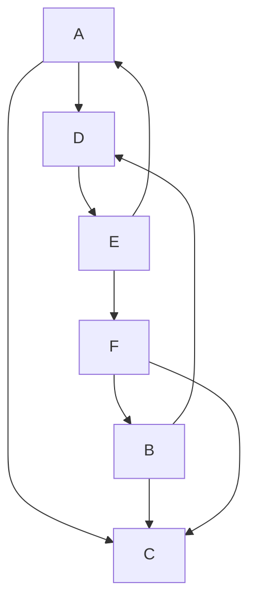

图3

析

如图 3 所示, 令 BD = m, DF = n, 由极化恒等式的三角形模式知

$$
\overrightarrow {B A} \cdot \overrightarrow {C A} = \overrightarrow {A B} \cdot \overrightarrow {A C} =
$$

$$
\overrightarrow {A D} ^ {2} - \overrightarrow {D C} ^ {2} = 9 n ^ {2} - m ^ {2} = 4,
$$

$$
\overrightarrow {B F} \cdot \overrightarrow {C F} = \overrightarrow {F B} \cdot \overrightarrow {F C} =
$$

$$
\overrightarrow {F D} ^ {2} - \overrightarrow {D C} ^ {2} = n ^ {2} - m ^ {2} = - 1,
$$

联立解得 $m^2 = \frac{13}{8}, n^2 = \frac{5}{8}$ , 进一步有

$$
\overrightarrow {B E} \cdot \overrightarrow {C E} = \overrightarrow {E B} \cdot \overrightarrow {E C} = \overrightarrow {E D} ^ {2} - \overrightarrow {D C} ^ {2} = 4 n ^ {2} - m ^ {2} = \frac {7}{8}.
$$

# 点评

本题考查向量数量积的运算,考查考生的运算求解能力.运用极化恒等式的三角形模式将问题转化为线段的长度运算显得更为简单.

# 2.2 最值问题

例 3 （2020 年天津卷 15）如图 4 所示，在四边形ABCD 中， $B=60^{\circ}$ ，AB=3，BC=6，且 $\overrightarrow{AD}=\lambda\overrightarrow{BC}$ ， $\overrightarrow{AD}\cdot\overrightarrow{AB}=-\frac{3}{2}$ ，则实数 $\lambda$ 的值为 \_\_\_\_，若 M, N 是线段 BC 上的动点，且 $|\overrightarrow{MN}|=1$ ，则 $\overrightarrow{DM}\cdot\overrightarrow{DN}$ 的最小值为 \_\_\_\_。

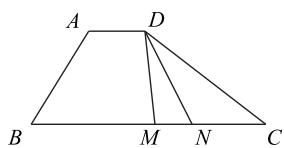

text_image

A
D
B
M
N
C

图4

# 析

由题意可得 $\overrightarrow{AD} \cdot \overrightarrow{AB} = |\overrightarrow{AD}| |\overrightarrow{AB}| \times$ $\cos \angle BAD = |\overrightarrow{AD}| \times 3 \times (-\frac{1}{2}) = -\frac{3}{2}$ , 所以 $|\overrightarrow{AD}| = 1$ ，又 $|\overrightarrow{BC}| = 6, \overrightarrow{AD} = \lambda \overrightarrow{BC}$ ，所以 $\lambda = \frac{1}{6}$ . 如图5所示，取线段 $MN$ 的中点 $T$ ，连接 $DT$ ，由极化恒等式的三角形模式知 $\overrightarrow{DM} \cdot \overrightarrow{DN} = \overrightarrow{DT^2} - \overrightarrow{TN^2} = \overrightarrow{DT^2} - \frac{1}{4}$ . 当 $DT \perp BC$ 时（由已知条件易知这样的点 $T$ 是存在的）， $DT$ 取得最小值 $DT = AB \cdot \sin 60^\circ = \frac{3\sqrt{3}}{2}$ ，此时 $\overrightarrow{DM} \cdot \overrightarrow{DN}$ 取得最小值 $(\frac{3\sqrt{3}}{2})^2 - \frac{1}{4} = \frac{13}{2}$ .

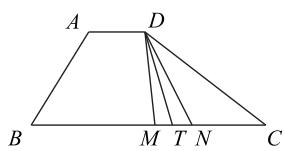

text_image

A
D
B
M
T
N
C

图5

# 点评

也可以选择基底将本题的第二个空转化为向量的线性运算求解,但比较烦琐.同时,在平面向量的运算中，尤其是最值问题，如果能够建立平面直角坐标系将原问题转化为向量的坐标运算，会使问题变得简单。而我们运用极化恒等式的方法进行求解，问题变得更为简单，而且无需利用 $AD$ 和 $BC$ 的长度，只要能判断 $DT \perp BC$ 时点 $T$ 的存在性即可。

例 4 （2017 年全国Ⅱ卷理 12）已知△ABC 是边长为 2 的等边三角形, P 为平面 ABC 内一点, 则 $\overrightarrow{PA} \cdot (\overrightarrow{PB} + \overrightarrow{PC})$ 的最小值是().

80

数理化

A.-2

B. $-\frac{3}{2}$

C. $-\frac{4}{3}$

D.-1

# 解析

如图 6 所示, 取 BC 的中点 D, 连接 AD, PD, 取中线 AD 的中点 E, 连接 PE, 则由极化恒等式的三角形模式知

$$
\overrightarrow {P A} \cdot (\overrightarrow {P B} + \overrightarrow {P C}) = 2 \overrightarrow {P A} \cdot \overrightarrow {P D} =
$$

$$
2 \left(\overrightarrow {P E} ^ {2} - \overrightarrow {E D} ^ {2}\right) = 2 \left[ \overrightarrow {P E} ^ {2} - \left(\frac {\sqrt {3}}{2}\right) ^ {2} \right] = 2 \overrightarrow {P E} ^ {2} - \frac {3}{2}.
$$

当点 P 与点 E 重合时， $\overrightarrow{PA} \cdot (\overrightarrow{PB} + \overrightarrow{PC})$ 取得最小值 $-\frac{3}{2}$ ，故选 B.

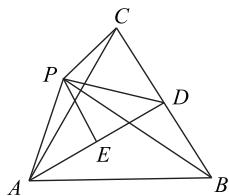

text_image

Geometric diagram of triangle ABC with internal points P, D, E and connecting lines forming smaller triangles

图6

例 5 如图 7 所示, 正方形 ABCD 的边长为 1,A, D 分别在 x 轴, y 轴的正半轴(含原点)上滑动, 则 $\overrightarrow{OC} \cdot \overrightarrow{OB}$ 的最大值是 \_\_\_\_.

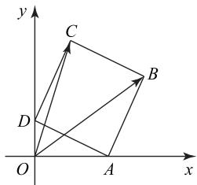

text_image

y
C
B
D
O
A
x

图7

# 解析

如图 8 所示, 取 BC 的中点 M, AD 的中点 N,连接 MN, ON, OM, 则 $\overrightarrow{OC} \cdot \overrightarrow{OB} = \overrightarrow{OM^{2}} - \frac{1}{4}$ , 因为 $OM \leqslant ON + NM = \frac{1}{2} AD + AB = \frac{3}{2}$ ，当且仅当 O，N, M 三点共线时，等号成立，所以 $\overrightarrow{OC} \cdot \overrightarrow{OB}$ 的最大值为 $(\frac{3}{2})^{2} - \frac{1}{4} = 2$ .

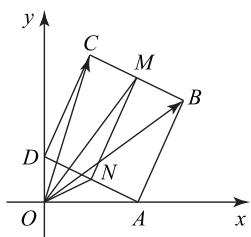

text_image

y
C
M
B
D
N
O
A
x

图8

# 点评

本题若用坐标法(三角换元)进行求解要复杂一些,利用极化恒等式解决问题更为简捷.

# 2.3 取值范围问题

例6 已知 $\triangle ABC$ 是边长为2的等边三角形， $P$

为 $\triangle ABC$ 三边上的一动点，求 $\overrightarrow{PA}\cdot(\overrightarrow{PB}+\overrightarrow{PC})$ 的取值范围.

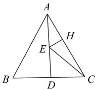

text_image

A
H
E
B
D
C

图9

如图 9 所示, 取中线 AD 的中点 E, 则由极化恒等式的三角形模式知

$$
\overrightarrow {P A} \cdot (\overrightarrow {P B} + \overrightarrow {P C}) = 2 \overrightarrow {P A} \cdot \overrightarrow {P D} =
$$

$$
2 \left(\overrightarrow {P E} ^ {2} - \overrightarrow {E D} ^ {2}\right) = 2 \left[ \overrightarrow {P E} ^ {2} - \left(\frac {\sqrt {3}}{2}\right) ^ {2} \right] = 2 \overrightarrow {P E} ^ {2} - \frac {3}{2}.
$$

当点 P 与点 C（或点 B）重合时， $\overrightarrow{PA}\cdot(\overrightarrow{PB}+\overrightarrow{PC})$ 取得最大值 $2\overrightarrow{CE^{2}}-\frac{3}{2}=2\left[1^{2}+(\frac{\sqrt{3}}{2})^{2}\right]-\frac{3}{2}=2$ 。过 E 作 $EH\perp AC$ ，垂足为 H，当点 P 与点 H 或 $H'$ （其中点 $H'$ 为点 H 关于 AD 的对称点）重合时， $\overrightarrow{PA}\cdot(\overrightarrow{PB}+\overrightarrow{PC})$ 取得最小值 $2\overrightarrow{HE^{2}}-\frac{3}{2}=2(\frac{\sqrt{3}}{2}\sin30^{\circ})^{2}-\frac{3}{2}=-\frac{9}{8}$ 。

综上， $\overrightarrow{PA} \cdot (\overrightarrow{PB} + \overrightarrow{PC})$ 的取值范围是 $[- \frac{9}{8}, 2]$ .

本题若采用坐标法进行求解,则问题将变得较为复杂,而且有一定的运算量.而采取极化恒等式求解,问题变得简单多了,只需熟悉一些简单的平面几何知识即可.

例 7 如图 10 所示, 正方体 $ABCD-A_{1}B_{1}C_{1}D_{1}$ 的棱长为 2, MN 是它的内切球的一条弦(我们把球面上任意两点之间的线段称为球的弦), P 为正方体表面上的动点, 当弦 MN 的长度最大时, $\overrightarrow{PM} \cdot \overrightarrow{PN}$ 的取值范围是 \_\_\_\_.

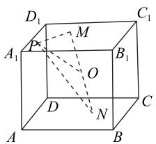

text_image

D₁
M
A₁
P
O
B₁
C₁
D
N
A
B

图10

由正方体的棱长为 2, 可得内切球的半径为 1, 正方体的体对角线长为 $2\sqrt{3}$ . 当弦 MN 的长度最大时，MN 为球的直径. 设内切球的球心为 O，则由极化恒等式的三角形模式知

$$
\overrightarrow {P M} \cdot \overrightarrow {P N} = \overrightarrow {P O} ^ {2} - \overrightarrow {O N} ^ {2} = \overrightarrow {P O} ^ {2} - 1.
$$

由于 P 为正方体表面上的动点, 所以 $1 \leqslant |\overrightarrow{PO}| \leqslant \sqrt{3}$ ,

进一步求得 $\overrightarrow{PM}\cdot\overrightarrow{PN}$ 的取值范围是[0,2].

  
点评

本题若不采用极化恒等式来求解,则很难入手,而利用向量的极化恒等式可以快速对向积进行转化,体现了向量的几何属性.极化恒适用于求解以三角形为载体、涉及线段中点题.  

例 8 如图 11 所示, 设正方形 ABCD 的边长为点 P 在以 AB 为直径的圆弧 APB 上, 则 $\overrightarrow{PC} \cdot \overrightarrow{PD}$ 值范围是 \_\_\_\_.

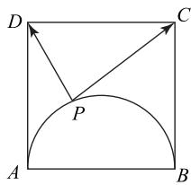

text_image

D
C
P
A
B

图11

  
解析

如图 12 所示, 取 CD 的中点 E, 由极化恒等式的三角形模式得 $\overrightarrow{PC} \cdot \overrightarrow{PD} = \overrightarrow{PE}^{2} - \overrightarrow{ED}^{2} =$ $\overrightarrow{PE}^2 - 4$ ，由图知 $2 \leqslant |\overrightarrow{PE}| \leqslant 2\sqrt{5}$ ，故 $\overrightarrow{PC} \cdot \overrightarrow{PD}$ 的取值范围是[0,16].

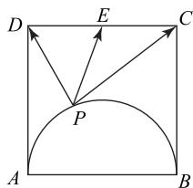

text_image

D
E
C
P
A
B

图12

通过前面的实例,我们可以看到,当遇到两个同起点且角度不定、模长不定的向量,要求它们的数量积时,可以考虑利用极化恒等式这一重要结论,这也体现了数形结合的重要数学思想.俗话说,没有思想就没有高立意.因为数学知识的教学只是信息的传递,而数学思想方法的教学,才能使学生形成观点和技能,数学学习的根本目的在于掌握某种具有普遍意义和广泛迁移价值的策略性知识.要想让学生真正从思想深处接受、领悟并掌握一种数学思想方法,必须让学生有一个体验、感悟、浸润的过程.在教学中,教师要更多地关注学生对数学思想方法感悟的充分性与全面性,要创造更多的机会给学生思考、探究、总结、提炼,让数学思想方法在教学中能真正落到实处.

(完)