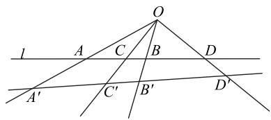
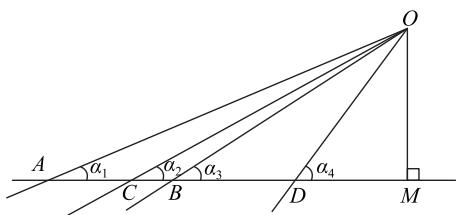
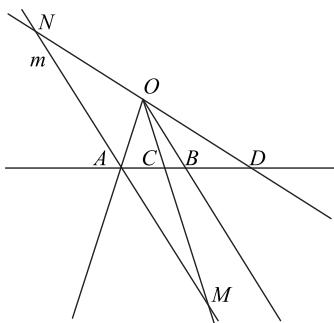
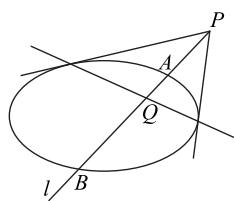
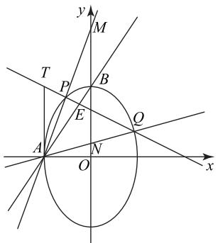
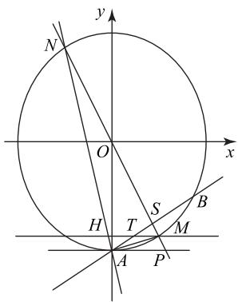
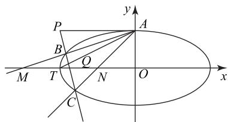
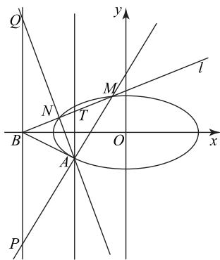

# 极点、极线调和性视角下的高考试题分析

卢恩良 $^{1}$ 黄芳 $^{2}$

(1. 江西省九江市第三中学 2. 江西省湖口中学)

在近几年高考中,以极点、极线知识为背景的试题频繁出现,这是学生学习的难点,也是教师教学的巨大的挑战.解析几何中的定点问题是高考的热点,因其逻辑推理要求高,数学运算量大,成为学生学习的难点.本文介绍极点、极线的调和性以及调和线束的性质,剖析高考命题人如何据此设计试题,以便能较快地得到答案,降低思维难度,增强学生信心.

# 1 几个概念和性质

调和点列:对于线段 AB 的内分点 C 和外分点 D, 若满足 $\frac{AC}{BC} = \frac{AD}{BD}$ , 则称点 C, D 调和分割线段 AB, 即点列 A, C, B, D 成调和点列, 如图 1 所示. 调和线束: 若直线 l 上四点 A, C, B, D 成调和点列, 任取一

点 $O \notin l$ ，则直线 OA, OC, OB, OD 成调和线束.

text_image

l
A
C
B
D
A'
C'
B'
D'

图1

任意直线 $l'$ 交调和线束 OA, OC, OB, OD 于点 $A', C', B', D'$ ，则点列 $A', C', B', D'$ 也成调和点列.

性质 1 直线 OA, OC, OB, OD 成调和线束, 记直线 OA, OC, OB, OD 的斜率分别为 $k_{1}, k_{2}, k_{3}, k_{4}$ , 则 $\frac{k_{2}-k_{1}}{k_{4}-k_{1}}=\frac{k_{2}-k_{3}}{k_{3}-k_{4}}$ .

证明 如图 2 所示, 不妨记直线 OA, OC, OB, OD 与 x 轴分别交于点 A, C, B, D, 则 A, C, B, D 四

# 3.2 重视数学素养与建模能力的培养

# 1) 勤思考, 重理解

数学源于对现实世界的抽象,基于抽象结构,通过符号运算、形式推理、模型构建等,理解和表达现实世界中事物的本质、关系和规律.这就要求学生在数学学习过程中亲自参与数学知识的发生、发展过程中,只有这样才能深入了解数学知识的来龙去脉.

# 2) 善于总结与反思

数学能力的培养绝非一朝一夕之功,需要学生反复理解定义、定理的内涵与本质,温故而知新.在每次回归课本的过程中都可能产生新的理解与感悟,这时需要及时将经验总结记录下来,填充进数学知识网络中,扎牢数学基本功.学生在运用数学知识过程中,碰到了易错点与重难点,也需要及时总结,将类似的题目归类并进行反思总结,体会题目的命题意图、考查的知识点、解题的逻辑过程、渗透的数学思想等,并举一反三.学生可以运用“费曼学习法”将自己的解题感悟主动分享给有需要的同学,在复述讲解的过程中深化对知识的理解,若讲解过程中出现困难,则说明对该部分的知识理解不够深入,这样也为日后的复习提供了方向.

# 3) 多动手, 勤建模

纵观 2023 年高考数学试题,新高考在数学建模核心素养上的考查力度比全国卷大,体现了新课标对数学建模的重视程度.该类试题的考查目的不仅仅是考查学生对基础知识的理解,更多的是结合生活情境考查学生的数学建模核心素养,要求学生能够有意识地用数学语言表达现实世界,发现和提出问题,感悟数学与现实之间的关联.学生在掌握一定知识的基础上,应切身体会用数学模型解决实际问题的全过程,迁移运用所学知识,积累数学建模实践的经验,增强创新意识和科学精神.此外,鉴于高考常以跨学科知识为背景进行命题,学生应广泛涉猎科学、社会、医疗、工程技术等诸多领域的知识,感悟跨学科的交融,用数学的眼光观察现实世界,用数学的思维思考现实世界,用数学的语言表达现实世界.

(完)

点成调和点列, 满足 $\frac{AC}{AD} = \frac{BC}{BD}$ . 作 $OM \perp x$ 轴, 垂足为M.由图可得 $\frac{AM - CM}{AM - DM} = \frac{CM - BM}{BM - DM}$ 即 $\frac{\frac{OM}{k_1} - \frac{OM}{k_2}}{\frac{OM}{k_1} - \frac{OM}{k_4}} =$ $\frac{\frac{OM}{k_{2}}-\frac{OM}{k_{3}}}{\frac{OM}{k_{3}}-\frac{OM}{k_{4}}}$ ，整理得 $\frac{k_{2}-k_{1}}{k_{4}-k_{1}}=\frac{k_{2}-k_{3}}{k_{3}-k_{4}}$ .

text_image

A
α₁
C
α₂
B
α₃
D
α₄
O
M

图2

以上证明仅说明斜率为正的情况下,实际上对直线斜率的其他情况也是成立的,感兴趣的读者可尝试证明.

性质 2 若一条直线与调和线束中的某条线平行, 则它与其他三条线相交得到的三个点存在中点关系.

证明 如图 3 所示, 已知 A, C, B, D 四点成调和点列, 过点 A 的直线 m 平行于直线 OB, 与直线 OC, OD 分别交于点 M, N, 下证 A 是线段 MN 的中点.

text_image

N
m
O
A C B D
M

图3

因为 A, C, B, D 四点成调和点列，所以 $\frac{AC}{BC} = \frac{AD}{BD}$ . 因为 $m \parallel OB$ ，所以 $\triangle ACM \sim \triangle BCO, \triangle AND \sim \triangle BOD$ ，故 $\frac{AC}{BC} = \frac{AM}{BO}, \frac{AN}{BO} = \frac{AD}{BD}$ . 又 $\frac{AC}{BC} = \frac{AD}{BD}$ ，所以 $\frac{AM}{BO} = \frac{AN}{BO}$ ，即 AM = AN, A 为线段 MN 的中点.

性质 3 当点 P 不在椭圆上时, 过点 P 的直线 l 与椭圆交于 A, B 两点, 与 P 对应的极线交于点 Q, 如图 4 所示, 则点 P, A, Q, B 成调和点列.

text_image

P
A
Q
l B

图4

# 2 高考真题剖析

2022 年和 2023 年全国乙卷解析几何解答题一脉相承，以极点、极线知识为背景，考查定点问题。教师既要以“接地气”的方式讲解试题，又要站在更高的视角研究试题，让学生在掌握基本方法的基础上有一定的知识拓展。

例 1 （2023 年全国乙卷理 20）已知椭圆 C:$\frac{y^{2}}{a^{2}}+\frac{x^{2}}{b^{2}}=1\ (a>b>0)$ 的离心率是 $\frac{\sqrt{5}}{3}$ ，点 A(-2,0)
在 C 上.

(1)求 C 的方程;

(2) 过点 $(-2,3)$ 的直线交 C 于 P, Q 两点, 直线 AP, AQ 与 y 轴的交点分别为 M, N, 证明: 线段 MN 的中点为定点.

解 (1) $\frac{y^2}{9} + \frac{x^2}{4} = 1$ (求解过程略).

(2) 解法 1 由题意可知直线 PQ 的斜率存在, 设直线 PQ 的方程为 $y = kx + m$ , 则 m - 2k = 3. 联立 $\left\{\begin{aligned}y=kx+m,\\ 4y^{2}+9x^{2}-36=0,\end{aligned}\right.$ 得

$$
(4 k ^ {2} + 9) x ^ {2} + 8 m k x + 4 m ^ {2} - 3 6 = 0.
$$

设 $P(x_{1},y_{1}),Q(x_{2},y_{2})$ ，所以 $x_{1} + x_{2} = -\frac{8mk}{4k^{2} + 9},x_{1}x_{2} = \frac{4m^{2} - 36}{4k^{2} + 9}$ 易知直线AP方程为 $y = \frac{y_1}{x_1 + 2}(x + 2)$ ，令 $x = 0$ ，得 $y_{M} = \frac{2y_{1}}{x_{1} + 2}$ ；同理，可得 $y_{N} = \frac{2y_{2}}{x_{2} + 2}$ 因为线段MN的中点的纵坐标为

$$
\frac {y _ {M} + y _ {N}}{2} = \frac {y _ {1}}{x _ {1} + 2} + \frac {y _ {2}}{x _ {2} + 2} =
$$

$$
\frac {\left(k x _ {1} + m\right) \left(x _ {2} + 2\right) + \left(k x _ {2} + m\right) \left(x _ {1} + 2\right)}{x _ {1} x _ {2} + 2 \left(x _ {1} + x _ {2}\right) + 4} =
$$

$$
\frac {2 k x _ {1} x _ {2} + (2 k + m) \left(x _ {1} + x _ {2}\right) + 4 m}{x _ {1} x _ {2} + 2 \left(x _ {1} + x _ {2}\right) + 4} =
$$

$$
\frac {\frac {8 k m ^ {2} - 7 2 k}{4 k ^ {2} + 9} - \frac {1 6 m k ^ {2} + 8 k m ^ {2}}{4 k ^ {2} + 9} + 4 m}{\frac {4 m ^ {2} - 3 6}{4 k ^ {2} + 9} - \frac {1 6 m k}{4 k ^ {2} + 9} + 4} =
$$

$$
\frac {9 m - 1 8 k}{m ^ {2} - 4 m k + 4 k ^ {2}} = \frac {9 (m - 2 k)}{(m - 2 k) ^ {2}} = \frac {9}{m - 2 k} = 3,
$$

所以线段 MN 的中点为定点 $(0,3)$ .

解法 1 属于常规解法,虽然对学生思维要求低,但对学生数学运算素养要求较高.若注意到直线 PQ 过定点 $T(-2,3)$ ，由此入手，则会发现不一样的“风景”。下面从高等数学视角提供解法 2。

解法 2 如图 5 所示，不妨记椭圆的上顶点为 $B(0,3)$ ，点 $T(-2,3)$ ，则点 T 对应的极线即为直线 $AB:\frac{3y}{9}+\frac{-2x}{4}=1$ ，记直线 PQ 与极线 AB 交于点 E。由性质 3 可知点列 T, P, E, Q 为调和点列。因为 $A\notin PQ$ ，所以直线 AT, AP，AE, AQ 为调和线束. 而直线 $AT \parallel y$ 轴, 且直线 AP, AE, AQ 与 y 轴依次交于点 M, B, N, 由性质 2 可知 B 为 MN 的中点, 故线段 MN 的中点为定点 (0, 3).

text_image

y
M
T
P
B
E
Q
A
N
O
x

图5

试题实质是极点、极线的调和性,我们可以记忆为“中点模型”.如果我们把调和线束AT, AP, AE, AQ 的斜率依次记为 $k_{1}, k_{2}, k_{3}, k_{4}$ ，由性质 1 有 $\frac{k_{2}-k_{1}}{k_{4}-k_{1}}=\frac{k_{2}-k_{3}}{k_{3}-k_{4}}$ 。在本题中， $k_{1}$ 不存在（理解为无穷）， $k_{3}=k_{AB}=\frac{3}{2}$ 。由洛必达法则知 $\lim_{k_{1}\to\infty}\frac{k_{2}-k_{1}}{k_{4}-k_{1}}=1$ ，所以 $\frac{k_{2}-k_{3}}{k_{3}-k_{4}}=1, k_{2}+k_{4}=2k_{3}=3$ ，即直线 AP，AQ 的斜率之和为定值 3。此时的 $k_{2}+k_{4}=2k_{3}$ 情形我们可以记忆为“斜率等差模型”。因此，试题还可改编为“证明：直线 AP，AQ 的斜率之和为定值”。下面从研究直线斜率的角度提供解法 3。

解法 3 设直线 AP 的方程为 $y = k_{1}(x + 2)$ ，直线 AQ 方程为 $y = k_{2}(x + 2)$ ，易得 $y_{M} = 2k_{1}, y_{N} = 2k_{2}$ ，所以线段 MN 的中点坐标为 $(0, k_{1} + k_{2})$ 。

易知直线 $PQ$ 不经过点 $A(-2,0)$ ，则可设直线 $PQ$ 的方程为 $m(x + 2) + ny = 1$ ，又直线 $PQ$ 经过点 $(-2,3)$ ，所以 $3n = 1, n = \frac{1}{3}$ . 联立

$$
\left\{ \begin{array}{l} m (x + 2) + \frac {y}{3} = 1, \\ 4 y ^ {2} + 9 [ (x + 2) - 2 ] ^ {2} - 3 6 = 0, \end{array} \right.
$$

整理得 $4y^{2}+9(x+2)^{2}-36(x+2)=0$ ，将 $m(x+2)+\frac{y}{3}=1$ 代入，有 $4y^{2}+9(x+2)^{2}-36(x+2)\cdot[m(x+2)+\frac{y}{3}]=0$ ，整理得 $4y^{2}-12(x+2)y+(9-$

$36m)(x+2)^{2}=0$ ，易知 $x \neq -2$ ，两边同时除以 $(x+2)^{2}$ ，得 $4\left(\frac{y}{x+2}\right)^{2}-\frac{12y}{x+2}+9-36m=0$ ，故 $k_{1}+k_{2}=3$ .

综上,线段 MN 的中点为 $(0,3)$ .

点评

齐次化方法是研究圆锥曲线上两条共点直线斜率关系的有效方法.一般地,设不经过点$(x_{0},y_{0})$ 的直线的方程为 $m(x-x_{0})+n(y-y_{0})=1$ .

例2 (2022年全国乙卷理20)已知椭圆 $E$ 的中心为坐标原点,对称轴为 x 轴、y 轴,且过 $A(0,-2)$ , $B(\frac{3}{2},-1)$ 两点.

(1)求 E 的方程;

(2)设过点 $P(1,-2)$ 的直线交 E 于 M, N 两点，过 M 且平行于 x 轴的直线与线段 AB 交于点 T，点 H 满足 $\overrightarrow{MT}=\overrightarrow{TH}$ ，证明：直线 HN 过定点.

解 (1) $\frac{x^{2}}{3}+\frac{y^{2}}{4}=1$ (求解过程略).

(2) 解法 1 如图 6 所示, 容易求得直线 AB 的方程为 $y = \frac{2}{3} x - 2$ , 点 $P(1, -2)$ 对应的极线为 $\frac{-2y}{4} + \frac{x}{3} = 1$ , 即为直线 AB, 所以点 P 与直线 AB 为对应的极点和极线. 记直线 MN 与极线 AB 交于点 S. 由性质 3 可知点列 P,

text_image

y
N
O
x
H T S B
M
A P

图6

$M, S, N$ 为调和点列. 因为 $A \notin MN$ , 所以直线 $AP$ , $AM, AS, AN$ 为调和线束. 因为 $MT \parallel AP$ , 且直线 $MT$ 与直线 $AM, AS, AN$ 依次交于点 $M, T, H'$ , 由性质2可知 $T$ 为 $MH'$ 的中点. 因为 $\overrightarrow{MT} = \overrightarrow{TH}$ , 所以 $T$ 为 $MH$ 的中点, 即 $H$ 与 $H'$ 重合, 点 $H$ 在直线 $AN$ 上, 直线 $HN$ 过定点 $A(0, -2)$ .

点评

例 2 与例 1 本质一致,也是依据“中点模型”设计试题,方法独特.我们把调和线束 AP,$AM, AS, AN$ 的斜率依次记为 $k_{1}, k_{2}, k_{3}, k_{4}$ , 由性质 1 有 $\frac{k_{2} - k_{1}}{k_{4} - k_{1}} = \frac{k_{2} - k_{3}}{k_{3} - k_{4}}$ . 在本题中, $k_{1} = 0, k_{3} = k_{AB} = \frac{2}{3}$ ,故 $\frac{k_{2}}{k_{4}}=\frac{k_{2}-k_{3}}{k_{3}-k_{4}}$ ，整理得 $\frac{1}{k_{2}}+\frac{1}{k_{4}}=\frac{2}{k_{3}}=3$ ，蕴含着“斜率倒数等差模型”。因此，试题还可改编为“证明：存在实数 $\lambda$ ，使得 $k_{2}+k_{4}=\lambda k_{2}k_{4}$ 成立”。仿照例1的解法3，下面采用齐次化方法研究直线的斜率.

解法 2 设直线 MN 的方程为 $x-t(y+2)=1$ ， $M(x_{1},y_{1}), N(x_{2},y_{2})$ ，将椭圆 $\frac{x^{2}}{3}+\frac{y^{2}}{4}=1$ 化为

$$
4 x ^ {2} + 3 (y + 2) ^ {2} - 1 2 (y + 2) = 0,
$$

将 $x-t(y+2)=1$ 代入,有

$$
4 x ^ {2} + 3 (y + 2) ^ {2} - 1 2 (y + 2) [ x - t (y + 2) ] = 0,
$$

整理得 $4x^{2} + (3 + 12t)(y + 2)^{2} - 12x(y + 2) = 0$ ，易知 $y \neq -2$ ，则 $4\left(\frac{x}{y + 2}\right)^2 - \frac{12x}{y + 2} + 3 + 12t = 0$ ，所以$\frac{1}{k_{AM}}+\frac{1}{k_{AN}}=3.$ 易知 $k_{AT}=\frac{y_{T}-y_{A}}{x_{T}-x_{A}}=k_{AB}=\frac{2}{3}$ ，因为

$k_{AH} = \frac{y_A - y_H}{x_A - x_H} = \frac{y_A - y_T}{x_A - x_H}, k_{AM} = \frac{y_A - y_M}{x_A - x_M} = \frac{y_A - y_T}{x_A - x_M},$

所以 $\frac{1}{k_{AH}} + \frac{1}{k_{AM}} = \frac{2x_{A} - (x_{M} + x_{H})}{y_{A} - y_{T}}$ . 因为 T 是线段 HM 的中点, 所以 $2x_{T} = x_{H} + x_{M}$ , 即

$$
\frac {1}{k _ {A H}} + \frac {1}{k _ {A M}} = \frac {2 (x _ {A} - x _ {T})}{y _ {A} - y _ {T}} = \frac {2}{k _ {A T}} = 3.
$$

由以上可知 $\frac{1}{k_{AM}}+\frac{1}{k_{AN}}=\frac{1}{k_{AH}}+\frac{1}{k_{AM}}=3$ ，即 $k_{AH}=k_{AN}$ ，所以直线HN过定点A(0,-2).

比较例 1 和例 2, 发现两者的区别在于调和线束中一条直线水平, 一条直线竖直, 而且都有一条斜率固定的直线,从而两题结论略有区别:“斜率倒数等差模型”和“斜率等差模型”.

全国卷高考经常以极点极线知识为背景设计试题,地方卷也是如此.下面从极点极线与调和性的角度再分析两道北京高考题.

例3（2022年北京卷19）已知椭圆 $E:\frac{x^2}{a^2} +$ $\frac{y^2}{b^2} = 1(a > b > 0)$ 的一个顶点为 $A(0,1)$ ，焦距为 $2\sqrt{3}$ .

(1)求椭圆 E 的方程;

(2) 过点 $P(-2,1)$ 作斜率为 k 的直线与椭圆 E 交于不同的两点 B, C, 直线 AB, AC 分别与 x 轴交于点 M, N, 当 $|MN|=2$ 时, 求 k 的值.

简析 (1) $\frac{x^{2}}{4}+y^{2}=1.$

(2)如图7所示,设椭圆的左顶点为 $T(-2,0)$ ,点 $P(-2,1)$ 对应的极线方程为 $\frac{-2x}{4}+y=1$ ,即直线AT.记直线BC与直线AT交于点Q,则P,B,Q,C成调和点列,直线AP,AB,AQ,AC成调和线束.因

为直线 AP 平行于 x 轴，直线 AB, AQ, AC 与 x 轴依次交于点 M, T, N，由性质 2 知点 $T(-2,0)$ 是 MN 的中点。当 $|MN| = 2$ 时， $|TM| = |TN| =$

text_image

P
y
A
B
O
M
T
N
O
x
C

图7

1. 不妨取 $N(-1,0)$ ，则直线 AN 的方程为 $y = x + 1$ 。联立直线 AN 与椭圆 E 的方程，解得点 C 的坐标为 $(- \frac{8}{5}, -\frac{3}{5})$ ，所以直线 BC 的斜率 k = -4。

例4（2020年北京卷20）已知椭圆 $C:\frac{x^2}{a^2} +\frac{y^2}{b^2} = 1$ 过点 $A(-2,-1)$ ，且 a=2b。

(1)求椭圆 C 的方程;

(2) 过点 $B(-4,0)$ 的直线 l 交椭圆 C 于点 M, N, 直线 MA, NA 分别交直线 x = -4 于点 P, Q, 求

$\frac{|PB|}{|BQ|}$ 的值.

简析 (1) $\frac{x^{2}}{8}+\frac{y^{2}}{2}=1.$

(2) 如图 8 所示, 点 $B(-4,0)$ 对应的极线为 $x = -2$ . 设直线 $l$ 与极线 $x = -2$ 交于点 $T$ , 则点 $B, N, T, M$ 成调和点列, 直线 $AB, AN, AT, AM$ 成调和线束. 因为直线 $x =$

text_image

Q
y
l
N
T
M
B
O
x
A
P

图8

-4与直线 $AT$ 平行，且与直线 $AM, AB, AN$ 依次交于点 $P, B, Q$ ，所以点 $B$ 是 $PQ$ 的中点，即 $\frac{|PB|}{|BQ|} = 1$ .

以上两道北京高考题如出一辙,均以性质2为命题依据.2020年的北京高考题考查比较“直白”,容易猜到是中点关系,2022年的北京高考题另辟蹊径,试题隐藏着中点关系,问题却是求值,别出心裁.

# 3 小结

通过对以上高考真题的研究,发现很多解析几何试题都是以极点、极线知识的相关性质为背景设计的.虽然极点、极线的知识不属于高考考查范围要求,但是若能掌握相关知识,可以帮助教师和学生拓宽视野,打开思路,培养学生自主探究数学问题的能力.

(完)