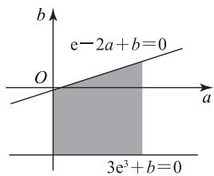

# 构造点线距离巧解一类最小值问题

林国红

(广东省佛山市乐从中学)

近年来,与参数有关的最值问题在高考试题中反复出现,相关题型变化多样,通常考查分类讨论、转化与化归的数学思想,解法灵活,难度较大.若题目涉及两个或多个参数的最值问题,则难度会直线上升.本文着重介绍构造点线距离的方法解决一类“双参数”的最小值问题,供大家参考.

# 1 引例的呈现与解答

引例 设 $a > 0, b \in \mathbf{R}$ , 已知函数 $f(x) = x\mathrm{e}^{x} + a(x - 3) + b$ 在[1,3]上有且仅有一个零点, 则 $a^2 + b^2$ 的最小值为( ).

A. $\frac{e^{2}}{6}$

B. $\frac{e^{2}}{3}$

C. $\frac{e^{2}}{4}$

D. $\frac{e^{2}}{5}$

解法 1 因为 $f'(x)=\mathrm{e}^{x}(x+1)+a$ ，且 a>0，所以 $f'(x)>0$ 在 $[1,3]$ 上恒成立，故 $f(x)$ 在 $[1,3]$ 上单调递增.

又因为 $f(x)$ 在 $[1,3]$ 上有且仅有一个零点，所以 $\left\{ \begin{array}{l} f(1) = \mathrm{e} - 2a + b \leqslant 0, \\ f(3) = 3\mathrm{e}^3 + b \geqslant 0. \end{array} \right.$ 在平面直角坐标系 $aOb$ 中，作出直线 $\mathrm{e} - 2a + b = 0$ 与 $3\mathrm{e}^3 + b = 0$ ，则不等式组 $\left\{ \begin{array}{l} \mathrm{e} - 2a + b \leqslant 0, \\ 3\mathrm{e}^3 + b \geqslant 0, \\ a > 0 \end{array} \right.$ 表示的区域如图1所示的阴影部分.

text_image

b
e-2a+b=0
O
a
3e³+b=0

图1

设点 $P(a,b)$ 为阴影部分任意一点，则 $a^{2}+b^{2}$ 的几何意义为点 P 到原点 O 的距离的平方。由图 1 可知， $a^{2}+b^{2}$ 的最小值为点 O 到直线 $e-2a+b=0$ 的距离的平方，所以 $a^{2}+b^{2}$ 的最小值为

$$
(\frac {\mathrm{e}}{\sqrt {(- 2) ^ {2} + 1 ^ {2}}}) ^ {2} = \frac {\mathrm{e} ^ {2}}{5}.
$$

此时直线 OP 与直线 $e-2a+b=0$ 垂直，易得直线 OP 的方程为 $b=-\frac{1}{2}a$ ，联立 $\left\{\begin{aligned}b&=-\frac{1}{2}a,\\ e&-2a+b=0,\end{aligned}\right.$ 解得 a= $\frac{2e}{5},b=-\frac{e}{5}.$

综上, $a^{2}+b^{2}$ 的最小值为 $\frac{e^{2}}{5}$ ，故选D.

解法 1 利用函数 $f(x)$ 的单调性, 结合函数零点存在定理, 得到以 a, b 为变量的不等式组，再由线性规划的相关知识得到不等式组所表示的区域，观察图形可以看出 $a^2 + b^2$ 的最小值是原点 $O$ 到直线 $\mathrm{e} - 2a + b = 0$ 的距离的平方。本解法主要有两个难点：一是所需的知识较多，需要具备较高的思维能力；二是新教材已删除线性规划的相关内容，学生并不熟悉这方面的内容。

解法 2 设 t 为函数 $f(x)$ 在 $[1,3]$ 的零点，则 $t \in [1,3]$ ，且 $t e^{t} + a(t-3) + b = 0$ 。

设 $P(a, b)$ 为直线 $l: (t-3)x + y + t\mathrm{e}^t = 0$ 上的任意一点（其中 $a > 0$ ），且 $P$ 到原点 $O$ 的距离 $|OP| = \sqrt{a^2 + b^2}$ ，即 $|OP|^2 = a^2 + b^2$ 。设原点 $O$ 到直线 $l$ 的距离为 $h$ ，则 $h = \frac{|te^t|}{\sqrt{(t-3)^2 + 1^2}}$ 。由垂线段最短，得 $|OP| \geqslant h$ ，即 $|OP|^2 \geqslant h^2$ ，所以 $a^2 + b^2 \geqslant \frac{t^2\mathrm{e}^{2t}}{(t-3)^2 + 1}$ 。

令 $g(t) = \frac{t^2\mathrm{e}^{2t}}{(t - 3)^2 + 1} (t\in [1,3])$ ，则

$$
g ^ {\prime} (t) = \frac {2 t \mathrm{e} ^ {2 t} \left(t ^ {3} - 6 t ^ {2} + 7 t + 1 0\right)}{\left(t ^ {2} - 6 t + 1 0\right) ^ {2}}.
$$

设 $h(t) = t^3 - 6t^2 + 7t + 10 (t \in [1,3])$ ，则

$h'(t)=3t^{2}-12t+7=3(t-2)^{2}-5<0(t\in[1,3])$ ,
从而 $h(t)$ 在 $[1,3]$ 上单调递减，于是 $h(t)\geqslant h(3)=4>0$ ，故 $g'(t)>0$ ，即 $g(t)$ 在 $[1,3]$ 上单调递增，所以 $g(t)\geqslant g(1)=\frac{\mathrm{e}^{2}}{5}$ ，即 $a^{2}+b^{2}\geqslant\frac{e^{2}}{5}$ . 当 t=1 时， $-2a+b+e=0$ ，联立 $\left\{\begin{aligned}-2a+b+e&=0,\\ a^{2}+b^{2}&=\frac{e^{2}}{5},\end{aligned}\right.$ 解得 $a=\frac{2e}{5}, b=$

$-\frac{e}{5}.$

综上, $a^{2}+b^{2}$ 的最小值为 $\frac{e^{2}}{5}$ ，故选D.

解法 2 的解题思路是构造点线距离: 将零点作为常数, 则零点所对应的方程是关于参数a, b 的直线方程 l，且 $\left|OP\right|^{2}=a^{2}+b^{2}$ . 设原点 O 到直线 l 的距离为 h，由定理“直线外一点与直线上各点连线中，垂线段最短”，可得 $\left|OP\right|^{2}\geqslant h^{2}$ ，再利用函数的知识求得 $h^{2}$ 的最小值（常用导数作为工具）. 本解法思路巧妙，合理利用转化与化归、数形结合的解题思想，可降低思维难度，避免转化过程中的难点与易错点，是一种“优秀”解法.

# 2 应用举例

下面再举几例来展示构造点线距离的方法在此类最小值问题中的应用.

例1 若关于 $x$ 的方程 $x^{2} + ax + \frac{1}{x^{2}} +\frac{a}{x} +b+$ 2=0 有实根, 则 $a^{2}+b^{2}$ 的最小值为 \_\_\_\_.

设 t 为方程 $x^{2} + ax + \frac{1}{x^{2}} + \frac{a}{x} + b + 2 = 0$ 的实根，则 $t^2 + at + \frac{1}{t^2} + \frac{a}{t} + b + 2 = 0$ ，即

$$
(t + \frac {1}{t}) a + b + (t + \frac {1}{t}) ^ {2} = 0.
$$

设 $P(a,b)$ 为直线 $l:(t+\frac{1}{t})x+y+(t+\frac{1}{t})^{2}=0$ 上的任意一点，且 P 到原点 O 的距离 $\left|OP\right|=\sqrt{a^{2}+b^{2}}$ ，即 $\left|OP\right|^{2}=a^{2}+b^{2}$ 。设原点 O 到直线 l 的距离为 h，则 $h = \frac{(t + \frac{1}{t})^{2}}{\sqrt{(t + \frac{1}{t})^{2} + 1}}$ . 由垂线段最短，得$|OP|\geqslant h$ ，即 $|OP|^{2}\geqslant h^{2}$ ，所以

$$
a ^ {2} + b ^ {2} \geqslant \frac {(t + \frac {1}{t}) ^ {4}}{(t + \frac {1}{t}) ^ {2} + 1}.
$$

设 $m = (t + \frac{1}{t})^2 = t^2 +\frac{1}{t^2} +2$ ，则 $m\geqslant 4$ ，于是

$$
a ^ {2} + b ^ {2} \geqslant \frac {m ^ {2}}{m + 1} = \frac {1}{\frac {1}{m ^ {2}} + \frac {1}{m}} \geqslant \frac {1}{\frac {1}{1 6} + \frac {1}{4}} = \frac {1 6}{5}.
$$

综上, $a^{2}+b^{2}$ 的最小值为 $\frac{16}{5}$ .

例2 已知函数 $f(x) = a(\ln x - 1) + (b + 1)x$ 在 $[e, e^3]$ 上存在零点，则 $a^2 + b^2$ 的最小值为 \_\_\_\_.

设 $t$ 为函数 $f(x)$ 在 $[\mathrm{e},\mathrm{e}^3 ]$ 的零点，则 $t\in [\mathrm{e},$ $e^{3}$ ，且 $f(t)=a(\ln t-1)+(b+1)t=0$ ，即

$$
(\ln t - 1) a + t b + t = 0.
$$

设 $P(a,b)$ 为直线 $l:(\ln t - 1)x + ty + t = 0$ 上的任意一点，且 $P$ 到原点 $O$ 的距离 $\vert OP\vert = \sqrt{a^2 + b^2}$ ，即 $\vert OP\vert^2 = a^2 +b^2.$ 设原点 $O$ 到直线 $l$ 的距离为 $h$ ，则 $h = \frac{|t|}{\sqrt{(\ln t - 1)^2 + t^2}}.$ 由垂线段最短，得 $\vert OP\vert \geqslant h$ ，即 $\vert OP\vert^2\geqslant h^2$ ，所以 $a^2 +b^2\geqslant \frac{t^2}{(\ln t - 1)^2 + t^2}.$

令 $g(t) = \frac{t^2}{(\ln t - 1)^2 + t^2} (t\in [\mathrm{e},\mathrm{e}^3])$ ，则

$$
g ^ {\prime} (t) = \frac {2 t (\ln t - 1) (\ln t - 2)}{\left[ (\ln t - 1) ^ {2} + t ^ {2} \right] ^ {2}}.
$$

当 $e<t<e^{2}$ 时， $g'(t)<0, g(t)$ 单调递减；当 $e^{2}<t<e^{3}$ 时， $g'(t)>0, g(t)$ 单调递增，则 $g_{\min}(t)=g(e^{2})=\frac{e^{4}}{e^{4}+1}$ ，即 $a^{2}+b^{2}\geqslant\frac{e^{4}}{e^{4}+1}$ .

综上, $a^{2}+b^{2}$ 的最小值为 $\frac{e^{4}}{e^{4}+1}$ .

例3 已知函数 $f(x) = \frac{\mathrm{e}^x}{x} + a(x - 1) + b$ 在[1,3]上总存在零点,则 $a^{2}+b^{2}$ 的最小值为 \_\_\_\_.

设 $t$ 为函数 $f(x)$ 在 $[1,3]$ 上的零点，则 $t \in$ [1,3], 且 $f(t) = \frac{\mathrm{e}^t}{t} + a(t - 1) + b = 0$ , 即

$$
(t - 1) a + b + \frac {\mathrm{e} ^ {t}}{t} = 0.
$$

设 $P(a,b)$ 为直线 $l:(t-1)x+y+\frac{\mathrm{e}^{t}}{t}=0$ 上的任意一点，且 P 到原点 O 的距离 $\left|OP\right|=\sqrt{a^{2}+b^{2}}$ ，即 $\left|OP\right|^{2}=a^{2}+b^{2}$ 。设原点 O 到直线 l 的距离为 h，则 $h=\frac{\left|\frac{\mathrm{e}^{t}}{t}\right|}{\sqrt{(t-1)^{2}+1}}$ 。由垂线段最短，得 $\left|OP\right|\geqslant h$ ，即 $\left|OP\right|^{2}\geqslant h^{2}$ ，所以 $a^{2}+b^{2}\geqslant\frac{\mathrm{e}^{2t}}{t^{2}\left[(t-1)^{2}+1\right]}$ 。

令 $g(t) = \frac{\mathrm{e}^{2t}}{t^2[(t - 1)^2 + 1]} (t\in [1,3])$ ，则

$$
g ^ {\prime} (t) = \frac {2 \mathrm{e} ^ {2 t} (t - 1) ^ {2} (t - 2)}{t ^ {3} [ (t - 1) ^ {2} + 1 ] ^ {2}}.
$$

当 1<t<2 时， $g'(t)<0$ ， $g(t)$ 单调递减；当 2<t<3 时， $g'(t)>0$ ， $g(t)$ 单调递增，从而 $g_{\min}(t)=g(2)=\frac{\mathrm{e}^{4}}{8}$ ，即 $a^{2}+b^{2}\geqslant\frac{\mathrm{e}^{4}}{8}$ .

综上, $a^{2}+b^{2}$ 的最小值为 $\frac{e^{4}}{8}$ .

例4 已知函数 $f(x) = a\sqrt{x - 1} + b - \ln x - 1$ ，若关于 $x$ 的方程 $f(x) = 0$ 在 $[\mathrm{e},\mathrm{e}^2 ]$ 上存在实根，则 $a^2 +b^2$ 的最小值为

设 $t$ 为方程 $f(x) = a\sqrt{x - 1} + b - \ln x - 1 =$ 析 0在 $[\mathrm{e},\mathrm{e}^2 ]$ 上的实根，则 $t\in [\mathrm{e},\mathrm{e}^2 ]$ ，且

$$
f (t) = a \sqrt {t - 1} + b - \ln t - 1 = 0.
$$

设 $P(a,b)$ 为直线 $l:\sqrt{t - 1} x + y - \ln t - 1 = 0$ 上的任意一点，且 $P$ 到原点 $O$ 的距离 $|OP| = \sqrt{a^2 + b^2}$ 即 $|OP|^2 = a^2 +b^2.$ 设原点 $O$ 到直线 $l$ 的距离为 $h$ ，则 $h = \frac{|\ln t + 1|}{\sqrt{t}}.$ 由垂线段最短，得 $|OP|\geqslant h$ ，即 $|OP|^2\geqslant h^2$ ，所以 $a^2 +b^2\geqslant \frac{(\ln t + 1)^2}{t}.$

令 $g(t) = \frac{(\ln t + 1)^2}{t} (t\in [\mathrm{e},\mathrm{e}^2 ])$ ，则 $g^{\prime}(t) =$ $\frac{(\ln t + 1)(1 - \ln t)}{t^2}\leqslant 0$ ，故 $g(t)$ 在 $[\mathrm{e},\mathrm{e}^2 ]$ 上单调递减，从而 $g_{\min}(t) = g(\mathrm{e}^2) = \frac{9}{\mathrm{e}^2}$ ，即 $a^2 +b^2\geqslant \frac{9}{\mathrm{e}^2}$

综上, $a^{2}+b^{2}$ 的最小值为 $\frac{9}{e^{2}}$ .

例5 已知函数 $f(x) = a\sqrt{x - \frac{1}{4}} + \frac{b}{2} - \mathrm{e}^{\sqrt{x}}$ 有零点,则当 $a^{2}+b^{2}$ 取最小值时, $\frac{b}{a}$ 的值为().

A. $\frac{\sqrt{3}}{2}$

B. $\frac{\sqrt{3}}{3}$

C. $\frac{\sqrt{3}}{4}$

D. $\frac{2\sqrt{3}}{3}$

设 t 为函数 $f(x)$ 的零点，则 $f(t)=$

$$
a \sqrt {t - \frac {1}{4}} + \frac {b}{2} - \mathrm{e} ^ {\sqrt {t}} = 0.
$$

设 $P(a,b)$ 为直线 $l:\sqrt{t-\frac{1}{4}}x+\frac{1}{2}y-e^{\sqrt{t}}=0$ 上的任意一点，且 P 到原点 O 的距离 $\left|OP\right|=\sqrt{a^{2}+b^{2}}$ ，即 $\left|OP\right|^{2}=a^{2}+b^{2}$ 。设原点 O 到直线 l 的距离为 h，则

$h=\frac{e^{\sqrt{t}}}{\sqrt{t}}$ . 由垂线段最短，得 $\left|OP\right|\geqslant h$ ，即 $\left|OP\right|^{2}\geqslant h^{2}$ ，所以 $a^{2}+b^{2}\geqslant h^{2}$ . 设 $m=\sqrt{t}>0$ ，则 $h=\frac{e^{m}}{m}$ ，令 $g(m)=\frac{e^{m}}{m}$ (m>0)，则 $g'(m)=\frac{e^{m}(m-1)}{m^{2}}$ . 当 0<m<1 时， $g'(m)<0$ , $g(m)$ 单调递减；当 m>1 时， $g'(m)>0$ , $g(m)$ 单调递增，从而 $g_{\min}(m)=g(1)=e$ ，即 $a^{2}+b^{2}\geqslant h^{2}\geqslant e^{2}$ . 当 t=1 时， $\frac{\sqrt{3}}{2}a+\frac{b}{2}-e=0$ ，联立 $\left\{\frac{\sqrt{3}}{2}a+\frac{b}{2}-e=0,\right.$ 消去 e 得 $a^{2}-2\sqrt{3}ab+3b^{2}=0$ ，即 $a^{2}+b^{2}=e^{2}$ ， $(a-\sqrt{3}b)^{2}=0$ ，从而得 $a-\sqrt{3}b=0$ ，故 $\frac{b}{a}=\frac{\sqrt{3}}{3}$ .

综上，当 $a^2 + b^2$ 取最小值时， $\frac{b}{a}$ 的值为 $\frac{\sqrt{3}}{3}$ ，故选B.

# 点评

从以上几道例题不难发现,利用构造点线距离的方法解决此类 $a^2 + b^2$ 的最小值问题，能降低思维强度,简化推理过程,解题方法新颖独到.另外,数学问题的解决,需要在平时的学习中善于钻研,重视方法的积累和知识的储备.

# 3 构造点线距离方法的思路提炼

此类问题的特点: 已知含有一次双参数 a, b 的函数 $f(x)$ 有零点, 求 $a^{2} + b^{2}$ 的最小值.

解题的步骤：

1) 设函数 $f(x)$ 的零点为 $t$ ，则可得到关于 $t$ 的方程，把 $t$ 作为常数，将方程转化为参数 $a, b$ 的直线方程 $l$ .

2) 设 $P(a, b)$ ，由两点间的距离公式，可知 $\left|OP\right|^{2}=a^{2}+b^{2}$ .

3) 设原点 O 到直线 l 的距离为 h，由点到直线的距离公式，建立 h 与 t 的关系式.

4) 设 $g(t)=h^{2}$ ，利用函数知识求得 $g(t)$ 的最小值.

5) $P(a,b)$ 在直线 l 上，由“直线外一点与直线上各点连线中，垂线段最短”，可得 $\left|OP\right|^{2}=a^{2}+b^{2}\geqslant h^{2}$ ，即可求得 $a^{2}+b^{2}$ 的最小值.

(完)