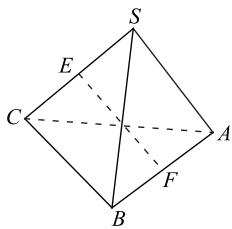
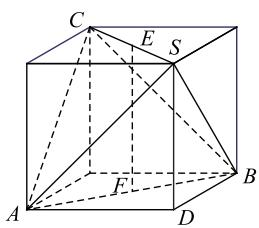
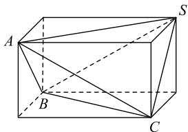
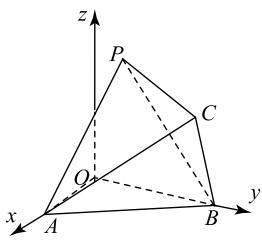
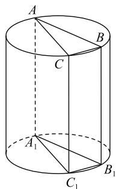

# 构造特殊几何体在立体几何中的应用例析

张伟

(山东省邹城市实验中学)

立体几何是高考命题的主干内容之一,是考查学生空间想象能力的重要载体.通过对近年高考试题进行分析,不难发现相关命题中所涉及的几何体大多都可以看作是由特殊的几何体(如正方体、长方体、球、圆柱)构成的,所以在解答此类问题时,如果能够恰当地构造相应的特殊几何体,可使解题事半功倍.

# 1 构造正方体

正方体的十二条棱相等,六个面均为正方形,又称为正六面体.若题目条件中所涉及的几何体与正方体的性质相吻合,则可将其还原到正方体中,从而利用正方体的性质解题.

例 1 如图 1 所示, 在正

三棱锥 S-ABC 中, SC = AC, SC 与 AB 的中点分别为 E, F, 则异面直线 EF 与 SA 所成角为 \_\_\_\_.

text_image

S
E
C
A
F
B

图1

题目条件中所给的几

解析 何体为正三棱锥,且侧棱与底面的边长相等,故为正四面体.因为正四面体的对棱垂直,所以可将其还原到正方体中解决问题.

将三棱锥 S-ABC 置于正方体中, 如图 2 所示. 由正方体的性质可知 $EF \parallel SD$ , 所以异面直线 EF 与 SA 所成角即为 SA 与 SD 所成角, 显然 $\angle ASD = \frac{\pi}{4}$ , 所以异面直线 $EF$ 与 $SA$ 所成角为 $\frac{\pi}{4}$ .

text_image

Geometric diagram of a cube with labeled vertices and internal points, used for spatial geometry problems.

图2

# 点评

若直接在图1中通过构造线线平行来确定两条异面直线所成角难度大，将正四面体置于正方体中,彰显两者之间的本质联系,使所求问题变得直观简洁.

变式 已知 PA, PB, PC 是以 P 为端点的三条射线，且每两条射线的夹角均为 $\frac{\pi}{3}$ ，则直线 PC 与平面 PAB 所成角的余弦值为 \_\_\_\_.

答案 $\frac{\sqrt{3}}{3}$ .

# 2 构造长方体

长方体是底面为矩形的直四棱柱，以同一顶点为端点的三条棱分别为长方体的长、宽、高，相对的两个面是全等的矩形。若题目条件中所涉及的几何体具有与长方体相符的性质，则可构造相应的长方体求解。

例 2 在三棱锥 S-ABC 中, 已知 SC = AB =$\sqrt{m}$ , $SB = AC = \sqrt{n}$ , $SA = BC = \sqrt{10}$ , 且 $AB + AC = 4$ , 则三棱锥 S-ABC 的外接球面积的最小值为 ( ).

A. $\frac{29\pi}{2}$

B. $2\sqrt{33}\pi$

C. $14\pi$

D. $9\pi$

由已知得三棱锥 S-ABC 的三组对棱分别相等, 故可将此三棱锥置于长方体中.

如图 3 所示, 长方体的三个面的对角线长分别为 $\sqrt{m}$ , $\sqrt{n}$ 和 $\sqrt{10}$ . 设长方体的长、宽、高分别 a, b, c, 则 $a^{2} + b^{2} = 10$ , $b^{2} + c^{2} = m$ , $a^{2} + c^{2} = n$ , 将三式相加得

natural_image

Geometric diagram of a cube with labeled vertices A, B, C, S and internal diagonals (no text or symbols)

图3

$a^2 + b^2 + c^2 = \frac{m + n}{2} + 5$ ，即为长方体对角线的平方，即为三棱锥 $S-ABC$ 外接球的直径的平方.

因为 $AB + AC = 4$ ，即 $\sqrt{m} + \sqrt{n} = 4$ ，由基本不等式得 $\frac{m + n}{2} + 5 \geqslant \left(\frac{\sqrt{m} + \sqrt{n}}{2}\right)^{2} + 5 = 9$ ，所以三棱锥 S-ABC 外接球的直径的最小值为 3，半径最小值为 $\frac{3}{2}$ ，所以三棱锥 S-ABC 的外接球面积的最小值为

$4\pi\times(\frac{3}{2})^{2}=9\pi$ , 故选 D.

# 点评

由于三棱锥相对的三组棱长分别相等,进而可将其置于相应的长方体中,结合长方体的性质,利用两者的外接球相同,使问题获解.

变式 已知 A, B, C, D 是半径为 2 的球的表面上的四个点，且 AB = CD = 2，那么四面体 ABCD 的体积的最大值为（）.

A. $\frac{2\sqrt{3}}{3}$

B. $\frac{4\sqrt{3}}{3}$

C. $2\sqrt{3}$

D. $\frac{8\sqrt{3}}{3}$

答案 B.

# 3 构造球

空间中到一个点的距离为定值的点的轨迹是球，球面上的点到球心的距离相等；用一个平面截球，截面为圆，圆心与球心的连线垂直于截面圆.

例3 已知正四面体P-ABC 的棱长为 4，将顶点 A, B 分别在空间直角坐标系中的 x 轴、y 轴上移动，其中 O 为坐标原点（如图 4），则 | OP | 的取值范围为（）.

text_image

z
P
C
O
x
A
B
y

图4

A. $[1,4]$

B. $[2\sqrt{3} - 2, 2\sqrt{3} + 2]$

C. $\left[2\sqrt{3}-2,4\right]$

D. $[2, 2\sqrt{3} + 2]$

若固定正四面体 P-ABC 的位置, 设 AB 的析中点为 D, 因为 $\triangle AOB$ 是直角三角形, 所以$|OD|=\frac{1}{2}|AB|=2$ ，即点O到点D的距离为定值，所以点O在以D为球心、AB为直径的球面上，则 $|OP|$ 的几何意义是球面上的点到球外一点的距离，最大值为 $|PD|+r$ ，最小值为 $|PD|-r$ 。因为四面体P-ABC的棱长为4，所以 $|PD|=2\sqrt{3}$ ，则 $|OP|$ 的最小值为 $2\sqrt{3}-2$ ，最大值为 $2\sqrt{3}+2$ ，故选B。

变式 已知一个圆锥的底面直径为 $6\sqrt{2}$ , 高为 $3\sqrt{6}$ , 在该圆锥内放置一个棱长为 $a$ 的正四面体, 且正四面体可以在该圆锥内任意转动, 则 $a$ 的最大值为 \_\_\_\_.

答案 4.

# 4 构造圆柱

圆柱是由矩形绕着一条边旋转一周得到的几何

54

数理化

体,其轴截面也是一个矩形,轴截面对角线的交点即为圆柱的中心,也是其外接球的球心,利用母线与底面直径可求得轴截面对角线的长,即外接球的半径.

例4 在直三棱柱 $ABC - A_{1}B_{1}C_{1}$ 中， $AA_{1} = 4$ $\cos \angle ACB = \frac{1}{3}$ . 若该三棱柱的外接球的体积为 $\frac{52\sqrt{13}}{3}\pi$ ，则该三棱柱体积的最大值为 \_\_\_\_.

# 析

因为已知三棱柱为直三棱柱,故可构造其外接圆柱,如图5所示,两个几何体具有相同的外接球.设外接球的半径为R,由 $\frac{52\sqrt{13}}{3}\pi=\frac{4}{3}\pi R^{3}$ ,可得 $R=\sqrt{13}$ .设圆柱的底面半径为r,由于三棱柱的高即圆柱的母线为4,则 $(2R)^{2}=(2r)^{2}+4^{2}$ ,即2r=6.设

text_image

A
B
C
A₁
C₁
B₁

图5

$\triangle ABC$ 三个内角所对的边分别为 $a, b, c$ ，在 $\triangle ABC$ 中，由 $\cos \angle ACB = \frac{1}{3}$ ，得 $\sin \angle ACB = \frac{2\sqrt{2}}{3}$ ，再由正弦定理得 $\frac{c}{\sin \angle ACB} = 2r, c = 2r\sin \angle ACB = 4\sqrt{2}$ ，所以

$$
S _ {\triangle A B C} = \frac {1}{2} a b \sin \angle A C B = \frac {\sqrt {2}}{3} a b.
$$

在 $\triangle ABC$ 中,由余弦定理得

$$
3 2 = a ^ {2} + b ^ {2} - \frac {2}{3} a b \geqslant 2 a b - \frac {2}{3} a b = \frac {4}{3} a b,
$$

所以 $ab \leqslant 24$ ，则 $(S_{\triangle ABC})_{\max} = 8\sqrt{2}$ ，故三棱柱 $ABC - A_1B_1C_1$ 体积的最大值为 $4 \times 8\sqrt{2} = 32\sqrt{2}$ .

# 点评

除了直三棱柱外，对于有棱垂直于底面，且底面不是直角三角形的三棱锥，也可以构造圆柱辅助求解.

变式 在三棱锥 P-ABC 中， $PA \perp$ 平面 ABC， $AB = AC = PA = 2$ ，且在 $\triangle ABC$ 中， $\angle BAC = 120^{\circ}$ ，则三棱锥 P-ABC 的外接球的体积为 \_\_\_\_.

答案 $\frac{20\sqrt{5}}{3}\pi.$

特殊的几何体中存在特殊的点、线、面的关系,构造特殊几何体解题的前提是要熟知特殊几何体的性质以及不同几何体之间的关系,解题中要准确挖掘隐含条件,寻找两者的联系,从而将一般问题特殊化.

(完)

54