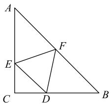

# 柯西不等式在解三角形中的应用

王中学 杨智

(安徽省合肥一六八中学)

解三角形中的最值问题一直是高中数学的重要内容,也是近几年高考和竞赛的热点、难点.这类题的技巧性、综合性强,可借助柯西不等式进行求解.在利用柯西不等式解题时,要灵活根据柯西不等式自身的结构,对题目条件或结论中的相关代数式进行适当转化与变形,为利用柯西不等式创造条件.因此,熟练掌握柯西不等式的各种变式及其推论是很有必要的.本文通过几道例题,浅谈柯西不等式在解三角形最值问题中的应用,特别是条件的配凑和分拆,以期对读者有所帮助.

# 1 角的拆分组合

例1 在 $\mathrm{Rt}\triangle ABC$ 中， $BC = a, CA = b, \angle ACB =$ $90^{\circ}$ , 点 $D, E, F$ 分别在边 $BC, CA, AB$ 上, 若 $\triangle DEF$ 是等边三角形,求 $\triangle DEF$ 面积的最小值.

如图1所示，设析 $\triangle DEF$ 的边长为 $x$ $\angle CED = \theta$ ，则 $EC = x\cos \theta .$ 在 $\triangle AEF$ 中，易得

text_image

Geometric diagram with labeled points A, B, C, D, E, F forming triangles and quadrilaterals

图1

$$
\angle A F E = \frac {\pi}{3} - A + \theta ,
$$

则

$$
\frac {A E}{\sin \left(\frac {\pi}{3} - A + \theta\right)} = \frac {x}{\sin A} \Rightarrow A E = \frac {x \sin \left(\frac {\pi}{3} - A + \theta\right)}{\sin A},
$$

所以

$$
b = x \cos \theta + \frac {x \sin (\frac {\pi}{3} - A + \theta)}{\sin A} \Rightarrow
$$

$$
x = \frac {b \sin A}{\sin A \cos \theta + \sin \left(\frac {\pi}{3} - A + \theta\right)} =
$$

$$
\frac {b \sin A}{[ \sin A + \sin (\frac {\pi}{3} - A) ] \cos \theta + \cos (\frac {\pi}{3} - A) \sin \theta} =
$$

64

数理化

$$
\begin{array}{l} \frac {b \sin A}{(\frac {\sqrt {3}}{2} \cos A + \frac {1}{2} \sin A) \cos \theta + (\frac {1}{2} \cos A + \frac {\sqrt {3}}{2} \sin A) \sin \theta} \geqslant \\ \frac {b \sin A}{\sqrt {\left(\frac {\sqrt {3}}{2} \cos A + \frac {1}{2} \sin A\right) ^ {2} + \left(\frac {1}{2} \cos A + \frac {\sqrt {3}}{2} \sin A\right) ^ {2}}}. \\ \frac {1}{\sqrt {\sin^ {2} \theta + \cos^ {2} \theta}} = \frac {b \sin A}{\sqrt {1 + \sqrt {3} \sin A \cos A}}, \\ \end{array}
$$

故

$$
S _ {\triangle D E F} = \frac {\sqrt {3}}{4} x ^ {2} \geqslant \frac {\sqrt {3}}{4} \cdot \frac {b ^ {2} \sin^ {2} A}{1 + \sqrt {3} \sin A \cos A} =
$$

$$
\frac {\sqrt {3}}{4} \cdot \frac {b ^ {2} \cdot \frac {a ^ {2}}{a ^ {2} + b ^ {2}}}{1 + \sqrt {3} \cdot \frac {a b}{a ^ {2} + b ^ {2}}} = \frac {\sqrt {3} a ^ {2} b ^ {2}}{4 (a ^ {2} + b ^ {2} + \sqrt {3} a b)}.
$$

例 2 已知 $\triangle ABC$ 的内角 A, B, C 的对边分别为 $a, b, c$ ，求证：

$$
\frac {3}{2} \leqslant \frac {a ^ {2}}{b ^ {2} + c ^ {2}} + \frac {b ^ {2}}{c ^ {2} + a ^ {2}} + \frac {c ^ {2}}{a ^ {2} + b ^ {2}} \leqslant
$$

$$
2 \left(\cos^ {2} A + \cos^ {2} B + \cos^ {2} C\right).
$$

证明 左边略.

下面证右边.

$$
\frac {a ^ {2}}{b ^ {2} + c ^ {2}} = \frac {\sin^ {2} A}{\sin^ {2} B + \sin^ {2} C} = \frac {\sin^ {2} (B + C)}{\sin^ {2} B + \sin^ {2} C} =
$$

$$
\frac {(\sin B \cos C + \cos B \sin C) ^ {2}}{\sin^ {2} B + \sin^ {2} C} \leqslant
$$

$$
\frac {(\sin^ {2} B + \sin^ {2} C) (\cos^ {2} C + \cos^ {2} B)}{\sin^ {2} B + \sin^ {2} C} = \cos^ {2} B + \cos^ {2} C.
$$

同理可得

$$
\frac {b ^ {2}}{c ^ {2} + a ^ {2}} \leqslant \cos^ {2} C + \cos^ {2} A,
$$

$$
\frac {c ^ {2}}{a ^ {2} + b ^ {2}} \leqslant \cos^ {2} A + \cos^ {2} B,
$$

三式相加得

$$
\frac {a ^ {2}}{b ^ {2} + c ^ {2}} + \frac {b ^ {2}}{c ^ {2} + a ^ {2}} + \frac {c ^ {2}}{a ^ {2} + b ^ {2}} \leqslant
$$

$$
2 \left(\cos^ {2} A + \cos^ {2} B + \cos^ {2} C\right).
$$

例3 设 $A, B, C$ 为 $\triangle ABC$ 的三个内角，则$\cos A(3\sin B + 4\sin C)$ 的最小值为

要使 $\cos A(3\sin B+4\sin C)$ 取得最小值, 则

$\cos A < 0$ ，即 $A \in (\frac{\pi}{2}, \pi)$ ，所以

$$
3 \sin B + 4 \sin C = 3 \sin B + 4 \sin (A + B) =
$$

$$
3 \sin B + 4 \sin A \cos B + 4 \cos A \sin B =
$$

$$
(3 + 4 \cos A) \sin B + 4 \sin A \cos B \leqslant
$$

$$
\sqrt {(3 + 4 \cos A) ^ {2} + (4 \sin A) ^ {2}} \cdot \sqrt {\sin^ {2} B + \cos^ {2} B} =
$$

$$
\sqrt {2 5 + 2 4 \cos A},
$$

当且仅当 $\frac{3 + 4\cos A}{4\sin A} = \frac{\sin B}{\cos B} = \tan B$ ，即 $\cos A > -\frac{3}{4}$ 时，等号成立.

因此，有

$$
\cos A (3 \sin B + 4 \sin C) \geqslant \cos A \sqrt {2 5 + 2 4 \cos A} =
$$

$$
- \sqrt {1 2 (\frac {2 5}{1 2} + 2 \cos A) (- \cos A) (- \cos A)} \geqslant
$$

$$
- \sqrt {1 2 (\frac {\frac {2 5}{1 2} + 2 \cos A - \cos A - \cos A}{3}) ^ {3}} = - \frac {1 2 5 \sqrt {3}}{1 0 8},
$$

当且仅当 $\frac{25}{12} + 2\cos A = -\cos A$ ，即 $\cos A = -\frac{25}{36}$ 时，等号成立，即 $\cos A(3\sin B + 4\sin C)$ 的最小值为 $-\frac{125\sqrt{3}}{108}$ .

# 点评

以上三道题都是涉及三角形中的角的重组，关键是利用 $A + B + C = \pi$ 进行正余弦的切换，再结合 $\sin^{2}\alpha + \cos^{2}\alpha = 1$ 进行化简，达到利用柯西不等式求解相应最值问题的目的，而其中角的重组难度较大，灵活性强.

# 2 边的配凑拆分

例 4 在 $\triangle ABC$ 中, AB=2AC, 且 $\triangle ABC$ 的面积为 1, 则 BC 的最小值为().

A. 2

B. $\sqrt{3}$

C. 1

D. $\sqrt{7}$

设 $\triangle ABC$ 的内角A,B,C的对边分别为a,b,c,则

$$
\left\{ \begin{array}{l} c = 2 b, \\ \frac {b c \sin A}{2} = 1 \end{array} \Rightarrow b ^ {2} = \frac {1}{\sin A}, \right.
$$

由余弦定理得

$$
a ^ {2} = b ^ {2} + c ^ {2} - 2 b c \cos A =
$$

$$
5 b ^ {2} - 4 b ^ {2} \cos A = \frac {5 - 4 \cos A}{\sin A},
$$

即

$$
5 = a ^ {2} \sin A + 4 \cos A \leqslant
$$

$$
\sqrt {\left(a ^ {4} + 1 6\right) \left(\sin^ {2} A + \cos^ {2} A\right)} = \sqrt {a ^ {4} + 1 6},
$$

所以 $a \geqslant \sqrt{3}$ ，故选 B.

例5 在 $\triangle ABC$ 中， $AB = 2, C = \frac{\pi}{6}$ ，则 $AC +$ $\sqrt{3}BC$ 的最大值为 \_\_\_\_.

# 析

设 $\triangle ABC$ 的内角 $A, B, C$ 的对边分别为 $a, b, c$ , 由余弦定理得

$$
\cos C = \frac {a ^ {2} + b ^ {2} - 4}{2 a b} \Rightarrow a ^ {2} + b ^ {2} - \sqrt {3} a b = 4,
$$

所以 $(a - \frac{\sqrt{3}}{2} b)^2 + (\frac{b}{2})^2 = 4$ ，则

$$
A C + \sqrt {3} B C = \sqrt {3} a + b = \sqrt {3} (a - \frac {\sqrt {3}}{2} b) + 5 (\frac {b}{2}),
$$

故

$$
(\sqrt {3} a + b) ^ {2} \leqslant [ (\sqrt {3}) ^ {2} + 5 ^ {2} ] \cdot
$$

$$
\left[ (a - \frac {\sqrt {3}}{2} b) ^ {2} + (\frac {b}{2}) ^ {2} \right] = 2 8 \times 4 = 1 1 2,
$$

即 $\sqrt{3} a + b \leqslant 4\sqrt{7}$ ，当且仅当 $\sqrt{3}\left(\frac{b}{2}\right) = 5\left(a - \frac{\sqrt{3}}{2} b\right)$ ， $a^2 + b^2 - \sqrt{3} ab = 4$ ，即 $a = \frac{6\sqrt{21}}{7}, b = \frac{10\sqrt{7}}{7}$ 时，等号成立.

# 点评

求解例 4 的关键是结合余弦定理将已知条件进行转化,建立边长与对应角之间的等式关系，进而利用柯西不等式求解边长的最值.例5是把 $a^2 +b^2 -\sqrt{3} ab = 4$ 转化，再根据 $AC + \sqrt{3} BC$ 即 $\sqrt{3} a+$ $b$ 的特点将其拆分及配凑，进而利用柯西不等式解题.

例6 在 $\triangle ABC$ 中， $AB = c,C = \theta$ ，若 $c,\theta ,m$ 为正数,求证: $b+ma$ 的最大值为

$$
\frac {c}{\sin \theta} \sqrt {m ^ {2} + 2 m \cos \theta + 1},
$$

当且仅当 $\frac{m + \cos\theta}{\sin\theta} (b - a\cos \theta) = a\sin \theta$ 时，等号成立.

证明 令 $b + ma = x(b - a\cos \theta) + y(a\sin \theta) = xb + a(y\sin \theta -x\cos \theta)$ ，取 $x = 1,y = \frac{m + \cos\theta}{\sin\theta}$ 则

$$
b + m a = (b - a \cos \theta) + \frac {m + \cos \theta}{\sin \theta} (a \sin \theta).
$$

又由余弦定理可得 $(b - a\cos \theta)^2 +(a\sin \theta)^2 = c^2$ ，所以由柯西不等式可得

$$
(b + m a) ^ {2} \leqslant [ 1 ^ {2} + (\frac {m + \cos \theta}{\sin \theta}) ^ {2} ] [ (b - a \cos \theta) ^ {2} +
$$

$$
(a \sin \theta) ^ {2} ] \Rightarrow (b + m a) ^ {2} \leqslant \frac {m ^ {2} + 2 m \cos \theta + 1}{\sin^ {2} \theta} c ^ {2},
$$

即 $b + ma \leqslant \frac{c}{\sin \theta} \sqrt{m^2 + 2m \cos \theta + 1}$ ，当且仅当 $\frac{m + \cos \theta}{\sin \theta} (b - a \cos \theta) = a \sin \theta$ 时，等号成立.

# 3 边角组合的配凑拆分

例7 若 $a, b, c$ 为 $\triangle ABC$ 的三边， $S$ 为 $\triangle ABC$ 的面积,求证 $a^{2}+b^{2}+c^{2}\geqslant4\sqrt{3}S$ ,并求出等号何时成立.

证明 由余弦定理得

$$
a ^ {2} + b ^ {2} + c ^ {2} = 2 \left(a ^ {2} + b ^ {2}\right) - 2 a b \cos C \geqslant
$$

$$
4 a b - 2 a b \cos C = 2 a b (2 - \cos C) =
$$

$$
2 a b \left(\sqrt {\left[ (\sqrt {3}) ^ {2} + 1 ^ {2} \right] \left(\sin^ {2} C + \cos^ {2} C\right)} - \cos C\right) \geqslant
$$

$$
2 a b (\sqrt {3} \times \sin C + 1 \times \cos C - \cos C) =
$$

$$
2 \sqrt {3} a b \sin C = 4 \sqrt {3} S,
$$

当且仅当 $a = b, \frac{1}{\cos C} = \frac{\sqrt{3}}{\sin C}$ , 即 $a = b = c$ , 也就是 $\triangle ABC$ 为正三角形时, 等号成立.

例8 若 $\triangle ABC$ 的三边为 $a, b, c$ , 满足 $a^2 + b^2 +$ $3c^{2}=7$ , 则 $\triangle ABC$ 面积的最大值为 \_\_\_\_.

由余弦定理得

$$
a ^ {2} + b ^ {2} + 3 c ^ {2} = 4 \left(a ^ {2} + b ^ {2}\right) - 6 a b \cos C \geqslant
$$

$$
8 a b - 6 a b \cos C = 2 a b (4 - 3 \cos C) =
$$

$$
2 a b \left(\sqrt {\left[ (\sqrt {7}) ^ {2} + 3 ^ {2} \right] \left(\sin^ {2} C + \cos^ {2} C\right)} - 3 \cos C\right) \geqslant
$$

$$
2 a b (\sqrt {7} \times \sin C + 3 \times \cos C - 3 \cos C) =
$$

$$
2 \sqrt {7} a b \sin C = 4 \sqrt {7} S,
$$

所以 $7 \geqslant 4\sqrt{7} S \Rightarrow S \leqslant \frac{\sqrt{7}}{4}$ ，当且仅当 a = b， $\frac{\sqrt{7}}{\sin C} = \frac{3}{\cos C}$ 时，等号成立，即 $\triangle ABC$ 面积的最大值为 $\frac{\sqrt{7}}{4}$ .

# 点评

以上两道例题属同一类型, 利用 $\sin^{2}\alpha +$ $\cos^{2}\alpha=1$ , 将系数进行拆分, 得到可利用柯西不等式的形式,即可得到面积的最值,系数的拆分具有一定的技巧性.此外两道题都是外森比克不等式的特殊形式.

例9 已知 $a, b, c$ 为 $\triangle ABC$ 的三边， $S$ 为

66

数理化

$\triangle ABC$ 的面积, 若 $x > 0, y > 0, z > 0$ , 求证:

$$
x a ^ {2} + y b ^ {2} + z c ^ {2} \geqslant 4 S \sqrt {x y + y z + z x},
$$

当且仅当 $\frac{a^{2}}{y+z}=\frac{b^{2}}{z+x}=\frac{c^{2}}{x+y}$ 时，等号成立.

证明 由余弦定理得 $xa^2 + yb^2 + zc^2 = (x + z) \cdot a^2 + (y + z)b^2 - 2zab\cos C$ ，所以

$$
x a ^ {2} + y b ^ {2} + z c ^ {2} \geqslant 2 \sqrt {(x + z) (y + z)} a b - 2 z a b \cos C \Rightarrow
$$

$$
x a ^ {2} + y b ^ {2} + z c ^ {2} \geqslant 2 a b \sqrt {x y + y z + x z + z ^ {2}} \cdot
$$

$$
\sqrt {\sin^ {2} C + \cos^ {2} C} - 2 z a b \cos C \geqslant
$$

$$
2 a b (\sqrt {x y + y z + x z} \cdot \sin C + z \cos C) - 2 z a b \cos C =
$$

$$
2 a b \sqrt {x y + y z + x z} \cdot \sin C = 4 S \sqrt {x y + y z + x z},
$$

当且仅当 $\left\{ \begin{array}{l} (x + z)a^2 = (y + z)b^2, \\ \frac{\sqrt{xy + yz + zx}}{\sin C} = \frac{z}{\cos C}, \end{array} \right.$ 即 $\frac{a^2}{y + z} =$

$\frac{b^{2}}{z+x}=\frac{c^{2}}{x+y}$ 时，等号成立.

# 4 小结

使用柯西不等式求解三角形最值问题时,要能正确识别题设中关系的结构特征,结合柯西不等式的形式对关系式进行巧妙灵活的转化、配凑、拆分、组合,从而利用柯西不等式求出三角形中的最值,且在使用该方法时能够同时求得取得最值的条件,便于学生更好地判断取最值时三角形的形状、大小以及角之间的关系等.

# 链接练习

1. 在 $\triangle ABC$ 中，内角 $A, B, C$ 的对边分别为 $a, b, c$ ，且满足 $a^2 + b^2 + 3c^2 = 7$ ， $S$ 为 $\triangle ABC$ 的面积，若 $3a^2 = 2b^2 + c^2$ ，求 $\frac{S}{a^2}$ 的最大值。

2. 在 $\triangle ABC$ 中，内角A, B, C的对边分别为a, b, c.

(1) 判定 $b + c - a, c + a - b, a + b - c$ 的符号；  
(2) 求证: $\frac{a^2}{b + c - a} + \frac{b^2}{c + a - b} + \frac{c^2}{a + b - c} \geqslant a + b + c$ .

3. 在 $\triangle ABC$ 中，内角 $A, B, C$ 的对边分别为 $a, b, c$ ，已知 $(2a - c)\cos B - b\cos C = 0$ .

(1) 求角 B 的大小;  
(2)已知 $b=\sqrt{3}$ ，求 $\frac{1}{2}a+2c$ 的最大值.

# 链接练习参考答案

1. $\frac{\sqrt{7}}{6}$ . 2. 略. 3. (1) $\frac{\pi}{3}$ . (2) $\sqrt{21}$ .

(完)

66