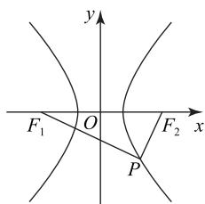
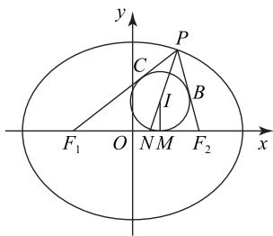

# 椭圆与双曲线焦点三角形的美丽性质

甘志国(正高级教师 特级教师)

(北京市丰台区第二中学甘志国特级教师工作室)

本文的定理 1、定理 2 与例 5 给出了椭圆与双曲线的焦点三角形的美丽性质，并介绍了其应用.

定义 设 $F_{1}, F_{2}$ 是椭圆(双曲线) $\Gamma$ 的两个焦点，P 是椭圆(双曲线) $\Gamma$ 上的任意一点但不在直线 $F_{1}F_{2}$ 上，把 $\triangle F_{1}PF_{2}$ 叫作椭圆(双曲线) $\Gamma$ 的一个焦点三角形.

下面的定理 1 给出了椭圆(双曲线)焦点三角形的面积公式.

定理 1 （1）设椭圆的两个焦点分别是 $F_{1}, F_{2}$ ，短半轴长是 b，点 P 在该椭圆上且 $\angle F_{1}PF_{2} = \theta (0 < \theta < \pi)$ ，则 $S_{\triangle F_{1}PF_{2}} = b^{2} \tan \frac{\theta}{2}$ ;

(2)设双曲线的两个焦点分别是 $F_{1}, F_{2}$ ，虚半轴长是 b，点 P 在该双曲线上且 $\angle F_{1}PF_{2} = \theta (0 < \theta < \pi)$ ，则 $S_{\triangle F_{1}PF_{2}} = \frac{b^{2}}{\tan \frac{\theta}{2}}$ .

证明 (1) 设椭圆的长半轴长是 $a$ ，由椭圆的定义得

$$
\mid P F _ {1} \mid + \mid P F _ {2} \mid = 2 a,
$$

$$
\left| P F _ {1} \right| ^ {2} + \left| P F _ {2} \right| ^ {2} + 2 \left| P F _ {1} \right| \cdot \left| P F _ {2} \right| = 4 a ^ {2}. \tag {①}
$$

易知椭圆的半焦距 $c=\sqrt{a^{2}-b^{2}}$ ，由题设及余弦定理得

$$
\mid P F _ {1} \mid^ {2} + \mid P F _ {2} \mid^ {2} - 2 \mid P F _ {1} \mid \bullet \mid P F _ {2} \mid \cos \theta =
$$

$$
\mid F _ {1} F _ {2} \mid^ {2} = 4 c ^ {2}. \tag {②}
$$

由①一②，可得 $2|PF_{1}|\cdot |PF_{2}|(1 + \cos \theta) = 4b^{2}$ ，则

$$
S _ {\triangle F _ {1} P F _ {2}} = \frac {1}{2} | P F _ {1} | \cdot | P F _ {2} | \sin \theta = \frac {b ^ {2} \sin \theta}{1 + \cos \theta} = b ^ {2} \tan \frac {\theta}{2}.
$$

(2)设双曲线的实半轴长是 a，由双曲线的定义得

$$
\mid \mid P F _ {1} \mid - \mid P F _ {2} \mid = 2 a,
$$

$$
\left| P F _ {1} \right| ^ {2} + \left| P F _ {2} \right| ^ {2} - 2 \left| P F _ {1} \right| \cdot \left| P F _ {2} \right| = 4 a ^ {2}. \tag {③}
$$

易知双曲线的半焦距 $c=\sqrt{a^{2}+b^{2}}$ ，由题设及余弦定理可得②在这里也成立.

由②一③,可得

$$
2 \left| P F _ {1} \right| \cdot \left| P F _ {2} \right| (1 - \cos \theta) = 4 b ^ {2},
$$

$$
S _ {\triangle F _ {1} P F _ {2}} = \frac {1}{2} | P F _ {1} | \bullet | P F _ {2} | \sin \theta =
$$

$$
\frac {b ^ {2} \sin \theta}{1 - \cos \theta} = \frac {b ^ {2}}{\tan \frac {\theta}{2}}.
$$

推论1 设椭圆(双曲线)的两个焦点分别是 $F_{1}$ , $F_{2}$ , 短半轴长(虚半轴长)是 $b$ , 点 $P$ 在该椭圆(双曲线)上且 $PF_{1} \perp PF_{2}$ , 则 $S_{\triangle F_{1}PF_{2}} = b^{2}$ .

定理 2 （1）设椭圆的两个焦点分别是 $F_{1}, F_{2}$ ，长半轴长、短半轴长分别是 a, b，点 P 在该椭圆上且 $\angle F_{1}PF_{2} = \theta (0 \leqslant \theta < \pi)$ ，则 $|PO|^{2} = a^{2} - b^{2}\tan^{2}\frac{\theta}{2}$ ，其中点 O 是椭圆的中心；

(2) 设双曲线的两个焦点分别是 $F_{1}, F_{2}$ ，实半轴长、虚半轴长分别是 a, b，点 P 在该双曲线上且 $\angle F_{1}PF_{2} = \theta (0 < \theta \leqslant \pi)$ ，则 $|PO|^{2} = a^{2} + \frac{b^{2}}{\tan^{2}\frac{\theta}{2}}$ ，其

中点 O 是椭圆的中心.

证明 (1) 当 $\theta = 0$ 时, 可得 $|PO| = a$ , 所以结论成立.

下面证明当 $0<\theta<\pi$ 时, 结论也成立.

易知①在这里也成立,所以

$$
\left(\left| P F _ {1} \right| ^ {2} + \left| P F _ {2} \right| ^ {2}\right) \cos \theta +
$$

$$
2 \mid P F _ {1} \mid \bullet \mid P F _ {2} \mid \cos \theta = 4 a ^ {2} \cos \theta . \tag {④}
$$

又椭圆的半焦距 $c=\sqrt{a^{2}-b^{2}}$ ，②在这里也成立，则由④+②，可得

$$
\left| P F _ {1} \right| ^ {2} + \left| P F _ {2} \right| ^ {2} =
$$

$$
4 \cdot \frac {a ^ {2} \cos \theta + \left(a ^ {2} - b ^ {2}\right)}{1 + \cos \theta} = 4 \left(a ^ {2} - \frac {b ^ {2}}{2 \cos^ {2} \frac {\theta}{2}}\right).
$$

在 $\triangle F_{1}PF_{2}$ 中，由中线长公式可得

$$
(2 | P O |) ^ {2} + (2 c) ^ {2} = 2 \left(\left| P F _ {1} \right| ^ {2} + \left| P F _ {2} \right| ^ {2}\right) =
$$

$$
4 \left(2 a ^ {2} - \frac {b ^ {2}}{\cos^ {2} \frac {\theta}{2}}\right),
$$

$$
\mid P O \mid^ {2} = 2 a ^ {2} - \frac {b ^ {2}}{\cos^ {2} \frac {\theta}{2}} - c ^ {2} =
$$

$$
a ^ {2} + b ^ {2} \left(1 - \frac {1}{\cos^ {2} \frac {\theta}{2}}\right) = a ^ {2} - b ^ {2} \tan^ {2} \frac {\theta}{2}.
$$

综上,结论成立.

(2) 当 $\theta = \pi$ 时, 可得 $|PO| = a$ , 则结论成立.

下面证明当 $0<\theta<\pi$ 时, 结论也成立.

易知③在这里也成立,所以

$$
\left(\left| P F _ {1} \right| ^ {2} + \left| P F _ {2} \right| ^ {2}\right) \cos \theta -
$$

$$
2 \mid P F _ {1} \mid \bullet \mid P F _ {2} \mid \cos \theta = 4 a ^ {2} \cos \theta , \tag {⑤}
$$

又双曲线的半焦距 $c=\sqrt{a^{2}+b^{2}}$ ，②在这里也成立，则由②—⑤，可得

$$
\left| P F _ {1} \right| ^ {2} + \left| P F _ {2} \right| ^ {2} =
$$

$$
4 \cdot \frac {(a ^ {2} + b ^ {2}) - a ^ {2} \cos \theta}{1 - \cos \theta} = 4 (a ^ {2} + \frac {b ^ {2}}{2 \sin^ {2} \frac {\theta}{2}}).
$$

在 $\triangle F_{1}PF_{2}$ 中，由中线长公式可得

$$
(2 | P O |) ^ {2} + (2 c) ^ {2} = 2 \left(\left| P F _ {1} \right| ^ {2} + \left| P F _ {2} \right| ^ {2}\right) =
$$

$$
4 \left(2 a ^ {2} + \frac {b ^ {2}}{\sin^ {2} \frac {\theta}{2}}\right),
$$

$$
\left| P O \right| ^ {2} = 2 a ^ {2} + \frac {b ^ {2}}{\sin^ {2} \frac {\theta}{2}} - c ^ {2} =
$$

$$
a ^ {2} + b ^ {2} \left(\frac {1}{\sin^ {2} \frac {\theta}{2}} - 1\right) = a ^ {2} + \frac {b ^ {2}}{\tan^ {2} \frac {\theta}{2}}.
$$

综上,结论成立.

推论 2 设椭圆(双曲线)的两个焦点分别是 $F_{1}$ ， $F_{2}$ ，长半轴长(实半轴长)、短半轴长(虚半轴长)、半焦距分别是 a, b, c，点 P 在该椭圆(双曲线)上且 $PF_{1} \perp PF_{2}$ ，则 $|PO| = c$ .

例 1 （2024 年天津卷 8）已知双曲线 $\frac{x^{2}}{a^{2}} - \frac{y^{2}}{b^{2}} = 1$ (a > 0, b > 0) 的左、右焦点分别为 $F_{1}, F_{2}, P$ 是该双曲线右支上一点，且直线 $PF_{2}$ 的斜率为 2， $\triangle PF_{1}F_{2}$ 是面积为 8 的直角三角形，则双曲线的方程为（）.

A. $\frac{x^{2}}{8}-\frac{y^{2}}{2}=1$

B. $\frac{x^2}{8} -\frac{y^2}{4} = 1$

C. $\frac{x^2}{2} -\frac{y^2}{8} = 1$

D. $\frac{x^2}{4} -\frac{y^2}{8} = 1$

由推论 1 可得 $b^{2}=8$ . 如图 1 所示, 点 P 在第四象限, $\angle F_{1}PF_{2}=90^{\circ}$ . 在 Rt△ $F_{1}PF_{2}$ 中,

由题设可得 $\tan \angle PF_{2}F_{1} = \frac{|PF_{1}|}{|PF_{2}|} = 2, |PF_{1}| =$

$2\mid PF_{2}\mid$ .由双曲线的定义可得

$$
2 a = \left| P F _ {1} \right| - \left| P F _ {2} \right| = \left| P F _ {2} \right|,
$$

所以 $\left|PF_{1}\right|=4a,\left|F_{1}F_{2}\right|=2c=$ $2\sqrt{5}a.$ 由 $(2c)^{2}=(2a)^{2}+(2b)^{2}$ ,
可得 $(2\sqrt{5}a)^{2}=(2a)^{2}+4\times8$ ，解得 $a^{2}=2$ ，则双曲线的方程为$\frac{x^{2}}{2}-\frac{y^{2}}{8}=1$ , 故选 C.

text_image

y
F₁ O F₂ x
P

图1

例 2 已知 $F_{1}, F_{2}$ 是双曲线 C 的两个焦点, 若线 C 上存在一点 P, 使得 $\left|PF_{1}\right|=2\left|PF_{2}\right|$ , 则双 C 的离心率的取值范围是 \_\_\_\_.

析 设双曲线 $\frac{x^2}{a^2} -\frac{y^2}{b^2} = 1(a > 0,b > 0)$ ，则

$F_{1}(-c,0), F_{2}(c,0)$ ，其中 $c = \sqrt{a^2 + b^2}$ . 由 $|PF_1| = 2|PF_2|$ ，可得点 $P$ 在双曲线 $C$ 的右支上.

由双曲线的定义, 可得 $2a = |PF_{1}| - |PF_{2}| = |PF_{2}|$ , 所以 $|PF_{1}| = 4a$ . 设 $\angle F_{1}PF_{2} = \theta (0 < \theta \leqslant \pi)$ , 由定理 1 的 (2) 可得当 $0 < \theta < \pi$ 时, 有

$$
S _ {\triangle F _ {1} P F _ {2}} = \frac {b ^ {2}}{\tan \frac {\theta}{2}} = \frac {c ^ {2} - a ^ {2}}{\sin \frac {\theta}{2}} \cos \frac {\theta}{2} =
$$

$$
\frac {1}{2} \left| P F _ {1} \right| \cdot \left| P F _ {2} \right| \sin \theta = \frac {1}{2} \cdot 4 a \cdot 2 a \sin \theta =
$$

$$
4 a ^ {2} \sin \theta = 8 a ^ {2} \sin \frac {\theta}{2} \cos \frac {\theta}{2},
$$

所以 $\frac{c^2 - a^2}{\sin \frac{\theta}{2}}\cos \frac{\theta}{2} = 8a^2\sin \frac{\theta}{2}\cos \frac{\theta}{2},$

$$
\frac {c ^ {2} - a ^ {2}}{8 a ^ {2}} = \sin^ {2} \frac {\theta}{2}. \tag {6}
$$

当 $\theta = \pi$ ，即 $P$ 是双曲线 $C$ 的右顶点时，有 $\left|PF_{1}\right| + \left|PF_{2}\right| = \left|F_{1}F_{2}\right|$ ，即 $4a + 2a = 2c, c = 3a$ ，也即⑥成立.由⑥及 $0 < \theta \leqslant \pi$ ，可得 $0 < \frac{c^2 - a^2}{8a^2} \leqslant 1$ ，所以 $a < c \leqslant 3a$ ，则双曲线 $C$ 的离心率的取值范围是(1,3].

例3 已知椭圆 $\frac{x^2}{3} + y^2 = 1$ 的左、右焦点分别为

$F_{1}, F_{2}$ ，点 P 在该椭圆上，且 $\angle F_{1}PF_{2}=60^{\circ}$ ，O 是坐标原点，则 $|PO|=$ \_\_\_\_.

析 由定理2的(1)得 $|PO|^{2}=3-\tan^{2}\frac{60^{\circ}}{2}=\frac{8}{3}$ ,

所以 $|PO|=\frac{2\sqrt{6}}{3}$ .

例4 已知椭圆 $\Gamma: \frac{x^2}{a^2} + \frac{y^2}{b^2} = 1 (a > b > 0)$ 的左、右焦点分别为 $F_{1}, F_{2}$ , 过点 $F_{1}$ 作倾斜角为 $30^{\circ}$ 的直线与椭圆 $\Gamma$ 在第一象限的交点为 $P$ . 若 $\overrightarrow{F_{1}F_{2}} \cdot \overrightarrow{PF_{2}} = 0$ , 求椭圆 $\Gamma$ 的离心率.

易得椭圆 $\Gamma$ 的半焦距为 $c = \sqrt{a^2 - b^2}$ . 由题设可得 $PF_{2} \perp x$ 轴， $\angle F_{1}PF_{2} = 60^{\circ}, |F_{1}F_{2}| =$ $2c, |PF_{1}| = \frac{4}{\sqrt{3}} c, |PF_{2}| = \frac{2}{\sqrt{3}} c$ ，所以

$$
S _ {\triangle F _ {1} P F _ {2}} = \frac {1}{2} | F _ {1} F _ {2} | \cdot | P F _ {2} | = \frac {1}{2} \cdot 2 c \cdot \frac {2}{\sqrt {3}} c = \frac {2}{\sqrt {3}} c ^ {2}.
$$

由定理1的(1)可得 $S_{\triangle F_1PF_2} = b^2\tan 30^\circ = \frac{b^2}{\sqrt{3}}$ ，所以 $\frac{b^2}{\sqrt{3}} = \frac{2}{\sqrt{3}} c^2$ ，则 $a^2 -c^2 = b^2 = 2c^2,a = \sqrt{3} c$ ，因而椭圆 $\Gamma$ 的离心率 $e = \frac{c}{a} = \frac{\sqrt{3}}{3}.$

例 5 如图 2 所示, 在平面直角坐标系 $xOy$ 中，已知 $F_{1}, F_{2}$ 分别是椭圆 $\Gamma: \frac{x^{2}}{a^{2}} + \frac{y^{2}}{b^{2}} = 1 (a > b > 0)$ 的左、右焦点，椭圆 $\Gamma$ 的离心率是 $e$ ，点 $P(x_0,y_0)$

text_image

y
P
C
I
B
F₁ O N M F₂ x

图2

$(y_0 \neq 0)$ 在椭圆 $\Gamma$ 上， $\triangle PF_1F_2$ 的内切圆是圆 $I$ ，圆 $I$ 与三边 $PF_2, PF_1, F_1F_2$ 分别相切于点 $B, C, M$ ，射线 $PI$ 交 $F_1F_2$ 于点 $N$ ，求证：

(1) $|PB|=|PC|=a-c;$

(2) $e=\frac{|NF_{1}|}{|PF_{1}|}=\frac{|NF_{2}|}{|PF_{2}|}=\frac{|NI|}{|PI|};$

(3) 设点 $I$ 的横坐标、纵坐标分别是 $x_{I}, y_{I}$ ，则 $x_{I} = ex_{0}, y_{I} = \frac{e}{e + 1} y_{0}$ ；三点 $P, I, N$ 的横坐标成公比为 $e$ 的等比数列；

(4)当两条直线 $IF_{1}, IF_{2}$ 的斜率 $k_{1}, k_{2}$ 均存在时， $k_{1}k_{2}=\frac{e-1}{e+1}$ ;

(5) 点 $I$ 的轨迹方程是 $\frac{x^2}{c^2} + \frac{y^2}{\left(\frac{bc}{a + c}\right)^2} = 1 (y \neq 0)$ .

证明 (1)由切线长定理及椭圆的定义,可得

$$
2 a = \left| P F _ {1} \right| + \left| P F _ {2} \right| =
$$

$$
(| P C | + | F _ {1} M |) + (| P B | + | F _ {2} M |) =
$$

$$
(| P C | + | P B |) + \left| F _ {1} F _ {2} \right| = 2 | P B | + 2 c,
$$

故 $|PB|=|PC|=a-c.$

(2)由 $PN$ 平分 $\angle F_{1}PF_{2}$ ，可得 $\frac{|NF_1|}{|PF_1|} = \frac{|NF_2|}{|PF_2|}$ ，所以 $\frac{|NF_1|}{|PF_1|} = \frac{|NF_2|}{|PF_2|} = \frac{|NF_1| + |NF_2|}{|PF_1| + |PF_2|} = \frac{2c}{2a} = e.$ 连接 $F_{2}I$ ，因为 $I$ 是 $\triangle PF_{1}F_{2}$ 的内心，所以 $F_{2}I$ 为 $\angle NF_{2}P$ 的角平分线，由三角形的角平分线定理可得

$$
\frac {| N I |}{| P I |} = \frac {| N F _ {2} |}{| P F _ {2} |} = e.
$$

(3) 易得 $\triangle PF_{1}F_{2}$ 的内切圆半径

$$
\mid y _ {I} \mid = \frac {2 S _ {\triangle P F _ {1} F _ {2}}}{\mid P F _ {1} \mid + \mid P F _ {2} \mid + \mid F _ {1} F _ {2} \mid} =
$$

$$
\frac {S _ {\triangle P F _ {1} F _ {2}}}{a + c} = \frac {c | y _ {0} |}{a + c} = \frac {e}{e + 1} | y _ {0} |,
$$

再由 $y_{I}$ 与 $y_{0}$ 同号，可得 $y_{I} = \frac{e}{e + 1} y_{0}$ . 由椭圆的焦半径公式，可得 $|PF_{1}| = a + ex_{0}$ . 由(2)可知 $e = \frac{|NF_1|}{|PF_1|}$ ，则 $|NF_{1}| = c + e^{2}x_{0}$ ，则 $N(e^{2}x_{0},0)$ . 由 $P(x_0,y_0)(y_0\neq 0),I(x_I,\frac{e}{e + 1} y_0),N(e^2 x_0,0)$ 三点共线，可得 $x_{I} = ex_{0}$ ，所以结论成立.

(4)由题设及(3)可得

$$
k _ {1} k _ {2} = \frac {\frac {e}{e + 1} y _ {0}}{e x _ {0} + c} \cdot \frac {\frac {e}{e + 1} y _ {0}}{e x _ {0} - c} =
$$

$$
\frac {(\frac {c}{c + a}) ^ {2} \frac {a ^ {2} - c ^ {2}}{a ^ {2}} (a ^ {2} - x _ {0} ^ {2})}{(\frac {c}{a}) ^ {2} x _ {0} - c ^ {2}} = \frac {e - 1}{e + 1}.
$$

(5)由(3)可得 $P\left(\frac{x_{I}}{e}, \frac{(e+1)y_{I}}{e}\right)$ ，将其代入椭圆的方程化简可得点 I 的轨迹为

$$
\frac {x ^ {2}}{c ^ {2}} + \frac {y ^ {2}}{\left(\frac {b c}{a + c}\right) ^ {2}} = 1 (y \neq 0).
$$

椭圆与双曲线的焦点好比其“眼睛”，所以椭圆与双曲线的焦点三角形必定还有很多美丽的性质，等待有志之士去欣赏和开发.

本文系北京市教育学会“十三五”教育科研滚动立项课题“数学文化与高考研究”（课题编号：FT2017GD003）阶段性研究成果之一.

(完)