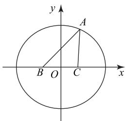
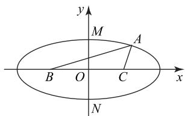
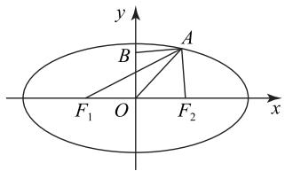
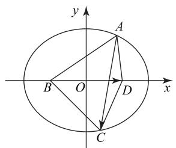

# 椭圆的定义在非解析几何问题中的应用

郭国生

(福建省仙游县榜头中学)

对于有些非解析几何问题,如果运用椭圆的定义进行分析,有时可能会发现一种巧妙解法.本文结合具体例子谈谈椭圆的定义在非解析几何问题中的应用,希望对大家有所启发.

# 1 解三角形问题

当在解三角形问题中出现两边之和为定值时,可考虑运用椭圆的定义将其转化为解析几何问题.

例1 已知 $\triangle ABC$ 的内角 $A, B, C$ 的对边分别为 a, b, c，若 $b + 2\cos B + b\cos A = 6, a = 2$ ，则 $\triangle ABC$ 面积的最大值为 \_\_\_\_.

在 $\triangle ABC$ 中,由余弦定理得

$$
b + a \cdot \frac {a ^ {2} + c ^ {2} - b ^ {2}}{2 a c} + b \cdot \frac {b ^ {2} + c ^ {2} - a ^ {2}}{2 b c} = 6,
$$

所以 $b+c=6$ ，即 $\left|AB\right|+\left|AC\right|=6$ 。又 $\left|BC\right|=2$ ，所以点 A 在以 B，C 为焦点、长轴长为 6 的椭圆上（不在直线 BC 上）。如图 1 所示，以 BC 所在直线为 x 轴，线段 BC 的中垂线为 y 轴，建立平面直角坐标系。

text_image

y
A
B O C x

图1

设椭圆的方程为 $\frac{x^{2}}{a_{1}^{2}}+\frac{y^{2}}{b_{1}^{2}}=1(a_{1}>b_{1}>0)$ ，则 $a_{1}=3,c_{1}=1$ ，所以 $b_{1}=\sqrt{a_{1}^{2}-c_{1}^{2}}=2\sqrt{2}$ 。当A是椭圆短轴的顶点时，点A到BC的距离的最大值为 $b_{1}=2\sqrt{2}$ ，所以 $\triangle ABC$ 面积的最大值为 $\frac{1}{2}\times2\times2\sqrt{2}=2\sqrt{2}$ 。

根据余弦定理将已知条件化简为 $|AB|+$ $|AC|=6$ , 可知点 A 在以 B, C 为焦点、长轴长为 6 的椭圆上(除去与 B, C 共线的点)，因此当点 A 是椭圆的上顶点或下顶点时，点 A 到 BC 的距离最

大,由此可求得 $\triangle ABC$ 面积的最大值.

例 2 已知△ABC 的周长为 16，且 $\left|BC\right|=6$ ，则 BC 面积的最大值为 \_\_\_\_.

如图 2 所示, 以 BC 所在直线为 x 轴, 线段析 BC 的垂直平分线为 y 轴, 建立平面直角坐标系.因为 $\triangle ABC$ 的周长为16，且 $|BC| = 6$ ，所以

$$
\vert A B \vert + \vert A C \vert = 1 6 - 6 = 1 0 > \vert B C \vert = 6,
$$

所以动点 A 的轨迹是椭圆(去掉与 B, C 共线的点)，且椭圆的焦距 2c=6、长轴长 2a=10，所以 c=3, a=5。设椭圆的短轴长为 2b，则 $b^{2}=a^{2}-c^{2}=16$ ，所以 b=4，故椭圆方程为 $\frac{x^{2}}{25}+\frac{y^{2}}{16}=1$ 。结合图形易知，当动点 A 与椭圆的上顶点 M 或下顶点 N 重合时， $\triangle ABC$ 的面积取得最大值，故 $\triangle ABC$ 面积的最大值为

$$
\frac {1}{2} \times 2 c \times b = \frac {1}{2} \times 6 \times 4 = 1 2.
$$

text_image

y
M
A
B O C x
N

图2

根据题意可知 $\left|AB\right|+\left|AC\right|=16-6=10>$ $\left|BC\right|=6$ ，由此联想到椭圆的定义，进而运用椭圆的定义将题目中的几何条件进行转化,从而建立平面直角坐标系并求出椭圆方程,为后续求解三角形面积的最大值奠定基础.

# 2 平面向量问题

在平面向量问题中,当题目条件中的线段关系或平面向量关系式的几何意义蕴含椭圆的定义时,一般可考虑将向量问题转化为解析几何问题.

例3 已知平面向量 $a, b, e$ 满足 $|b| = |e| = 1$ ,$b \cdot e = 0, |a + e| + |a - e| = 4$ , 则 $|a - b| + |a - e|$ 的最小值为 \_\_\_\_.

解析 如图 3 所示, 设 $\overrightarrow{OA} = a, \overrightarrow{OF_{2}} = e = (1, 0)$ , $\overrightarrow{OF_{1}} = -e = (-1, 0), \overrightarrow{OB} = b = (0, 1)$ . 由已知条件可得 $\left|\overrightarrow{F_{2}A}\right| = \left|a - e\right|, \left|\overrightarrow{F_{1}A}\right| = \left|a + e\right|$ , 则 $\left|\overrightarrow{F_{1}A}\right| + \left|\overrightarrow{F_{2}A}\right| = 4$ , 故点 A 的轨迹是以 $F_{1}, F_{2}$ 为焦点、长轴长为 4 的椭圆, 所以

$$
\vert \boldsymbol {a} - \boldsymbol {b} \vert + \vert \boldsymbol {a} - \boldsymbol {e} \vert = \vert \overrightarrow {B A} \vert + \vert \overrightarrow {F _ {2} A} \vert .
$$

text_image

y
B
A
F₁ O F₂ x

图3

由椭圆的定义可得

$$
\vert \boldsymbol {a} - \boldsymbol {b} \vert + \vert \boldsymbol {a} - \boldsymbol {e} \vert = \vert \overrightarrow {B A} \vert + 4 - \vert \overrightarrow {F _ {1} A} \vert =
$$

$$
4 - (| \overrightarrow {F _ {1} A} | - | \overrightarrow {B A} |) \geqslant 4 - | B F _ {1} | = 4 - \sqrt {2},
$$

当且仅当 A, B, $F_{1}$ 共线，且点 B 在线段 $AF_{1}$ 上时，等号成立，所以 $|a - b| + |a - e|$ 的最小值为 $4 - \sqrt{2}$ .

本题主要考查平面向量的数量积、模的计算以及椭圆的定义.在解决本题时,需构造向量，将已知条件转化为 $|\overrightarrow{F_1A}| + |\overrightarrow{F_2A}| = 4$ ，进而运用椭圆的定义将原问题转化为平面几何问题.

例 4 已知平面四边形 ABCD 中， $|AB|=5$ ，$|BC| = 4, |CD| = 3, |AD| = 2$ ，则 $\overrightarrow{AC} \cdot \overrightarrow{BD} = \underline{\quad}$ .

由题意知 $|AB| + |AD| = |BC| + |CD| =$ 7, 联想到椭圆的定义, 故将平面四边形ABCD 放置在椭圆内, 其中 B, D 分别为椭圆的左、右焦点, 焦距为 2c, 如图 4 所示. 设 $A(x_{1}, y_{1})$ , $C(x_{2}, y_{2})$ , 易知 2a = 7, 则 $B(-c, 0)$ , $D(c, 0)$ , 故 $\overrightarrow{AC} = (x_{2} - x_{1}, y_{2} - y_{1})$ , $\overrightarrow{BD} = (2c, 0)$ , 所以

$$
\overrightarrow {A C} \cdot \overrightarrow {B D} = (x _ {2} - x _ {1}, y _ {2} - y _ {1}) \cdot (2 c, 0) = 2 c (x _ {2} - x _ {1}).
$$

text_image

y
A
B O D x
C

图4

设该椭圆的离心率为 e，由焦半径公式可得

$$
\mid A B \mid = e x _ {1} + a = 5, \tag {①}
$$

$$
| B C | = e x _ {2} + a = 4. \tag {②}
$$

由②-①得 $e(x_{2} - x_{1}) = -1$ ，故

$$
\overrightarrow {A C} \cdot \overrightarrow {B D} = 2 c (x _ {2} - x _ {1}) = 2 c \cdot \frac {- 1}{e} = - 2 a = - 7.
$$

  
点评

根据两组边长之和相等,可将原问题转化为椭圆问题.设出A,B,C,D的坐标,并表示出$\overrightarrow{AC},\overrightarrow{BD}$ ，进而结合平面向量的数量积的坐标运算即可求解.

# 3 复数问题

两个复数差的模可以用来表示两点间的距离,而椭圆的定义是动点到两个定点的距离之和为定值,且该定值大于两定点间的距离.当复数问题的条件中出现两个复数的模之和为定值时,一般可采用数形结合法,应用椭圆知识来求解.

例5 已知复数 $z$ 满足 $\vert z + \sqrt{3}\vert +\vert z - \sqrt{3}\vert = 4$ 则 $|z - \mathrm{i}|$ 的最大值是

设 $z = x + y\mathrm{i}(x,y\in \mathbf{R})$ .由 $|z + \sqrt{3}| + |z -$ $\sqrt{3}|=4$ , 得

$$
\sqrt {(x + \sqrt {3}) ^ {2} + y ^ {2}} + \sqrt {(x - \sqrt {3}) ^ {2} + y ^ {2}} = 4 > 2 \sqrt {3}.
$$

在复平面内, 复数 z 对应的点 $Z(x, y)$ 在以 $(\pm\sqrt{3}, 0)$ 为焦点、长轴长为 4 的椭圆上, 则椭圆的方程为 $\frac{x^{2}}{4} + y^{2} = 1. |z - i|$ 表示点 $Z(x, y)$ 与点 $(0, 1)$ 的距离, 不妨设 $Z(2\cos \theta, \sin \theta)$ , 则点 $Z(2\cos \theta, \sin \theta)$ 与点 $(0, 1)$ 的距离为

$$
d = \sqrt {(2 \cos \theta) ^ {2} + (\sin \theta - 1) ^ {2}} =
$$

$$
\sqrt {- 3 \sin^ {2} \theta - 2 \sin \theta + 5} = \sqrt {- 3 (\sin \theta + \frac {1}{3}) ^ {2} + \frac {1 6}{3}},
$$

当 $\sin\theta=-\frac{1}{3}$ 时， $d_{\max}=\frac{4\sqrt{3}}{3}$ ，故 $|z-i|$ 的最大值是 $\frac{4\sqrt{3}}{3}$ .

  
点评

根据复数的模长公式、复数的几何意义及椭圆的定义可知复数 $z$ 对应的点 $Z(x,y)$ 在椭圆$\frac{x^{2}}{4}+y^{2}=1$ 上，进而结合条件运用三角代换求出结果，体现了椭圆定义的妙用.

在求解某些非解析几何问题时,应重视椭圆的定义在解题中的应用.只有认真学好定义、恰当合理地回归定义,才能形成良好的数学思维习惯和思维品质,提升数学学科核心素养.

(完)