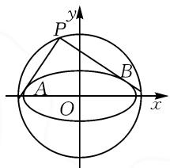
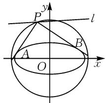
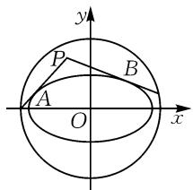
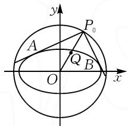
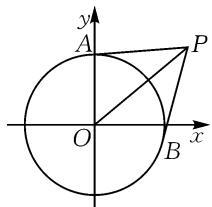

# 椭圆的蒙日圆证明及其应用

# ● 江汉大学人工智能学院 杨盛宇 许楠稀 柯圆圆(通讯作者)

摘要:2014年之后许多模拟卷和高考卷中均出现过以“蒙日圆”为背景的试题.本研究主要通过对蒙日圆的定义、定义的符号语言、证明以及典型例题的探讨,阐述不同的证明方法,给出解题思路,更好地培养学生的逻辑思维和运算能力.

关键词: 椭圆; 蒙日圆; 证明; 应用

# 1 椭圆的蒙日圆定义

在椭圆中,任意两条互相垂直的切线的交点都在同一个圆上,它的圆心是椭圆的中心,半径等于椭圆长半轴与短半轴平方和的算术平方根,这个圆就叫蒙日圆,如图1.

text_image

y
P
A
O
B
x

图1

# 1.1 椭圆蒙日圆定义的符号语言

椭圆 $\frac{x^{2}}{a^{2}}+\frac{y^{2}}{b^{2}}=1(a>b>0)$ 两条互相垂直的切线PA,PB交点P的轨迹是蒙日圆: $x^{2}+y^{2}=a^{2}+b^{2}$ .

# 1.2 椭圆蒙日圆定义的证明

甘志国 $^{[1]}$ 、尤新兴 $^{[2]}$ 、纪定春 $^{[3]}$ 采用解析几何证法和平面几何证法，对该定义进行证明，本文在此基础上主要采用消参法进行证明.

证明 1: 将求交点转化为联立点所满足的方程, 整体消参数.

若两条切线中有斜率不存在或斜率为0的直线，则可得点 $P$ 的坐标是 $(\pm a, b)$ ，或 $(\pm a, -b)$ 。它必在圆 $x^{2} + y^{2} = a^{2} + b^{2}$ 上。

若两条相互垂直的切线其斜率均存在且不为0，可设点 $P$ 的坐标是 $(x_0, y_0) (x_0 \neq \pm a, \text{且} y_0 \neq \pm b)$ ，设切线 $PA, PB$ 的方程分别为

$$
y = k x + m _ {1}, y = - \frac {1}{k} x + m _ {2}.
$$

将切线方程与椭圆方程联立消元得一元二次方程，由 $\Delta = 0$ ，可得 $\left\{ \begin{array}{l} b^{2} + a^{2}k^{2} - m_{1}^{2} = 0, \\ b^{2} + \frac{a^{2}}{k^{2}} - m_{2}^{2} = 0. \end{array} \right.$

于是，有 $\left\{ \begin{array}{l} m_{1}^{2} = b^{2} + a^{2}k^{2}, \\ m_{2}^{2} = b^{2} + \frac{a^{2}}{k^{2}}. \end{array} \right.$

又 $\left\{\begin{aligned}m_{1}&=y-kx,\\ m_{2}&=y+\frac{x}{k}\end{aligned}\right.$ 可得 $\left\{\begin{aligned}(y-kx)^{2}&=b^{2}+a^{2}k^{2},\\ (y+\frac{x}{k})^{2}&=b^{2}+\frac{a^{2}}{k^{2}}.\end{aligned}\right.$

整理，得

$$
(1 + k ^ {2}) y ^ {2} + (1 + k ^ {2}) x ^ {2} = (1 + k ^ {2}) \left(a ^ {2} + b ^ {2}\right).
$$

故 $x^{2} + y^{2} = a^{2} + b^{2}$

证明 2: 略, 可扫码查看.

# 2 蒙日圆在椭圆中的应用

例 1 已知椭圆 $C:\frac{x^{2}}{6}+\frac{y^{2}}{3}=1$ ,若直线 $l: mx - 2y - m + 8 = 0 (m \in \mathbb{R})$ 上存在点 $P$ , 使得过点 $P$ 作椭圆 $C$ 的两条切线, 且这两条切线互相垂直, 则 $m$ 的取值范围是 \_\_\_\_.

  
扫码查看

解析:要使过点 P 作的椭圆 C 的两条切线互相垂直,则点 P 在椭圆 C 的蒙日圆 $x^{2}+y^{2}=9$ 上(如图 2),所以问题等价于直线 l 与圆 $x^{2}+y^{2}=9$ 有公共点,从而圆心 O 到直线 l 的距离满足 $d=\frac{|-m+8|}{\sqrt{m^{2}+4}}\leqslant3$ , 解得 $m\geqslant1+\frac{3\sqrt{2}}{2}$ ,

text_image

y
P
l
A
O
B
x

图2

或 $m \leqslant 1 - \frac{3\sqrt{2}}{2}$ . 故 $m$ 的取值范围是 $\left(+\infty, -1 - \frac{3\sqrt{2}}{2}\right) \cup \left[-1 + \frac{3\sqrt{2}}{2}, +\infty\right)$ .

变式 1 已知椭圆 $C: \frac{x^{2}}{6} + \frac{y^{2}}{3} = 1$ ，若直线 l: mx - 2y - m + 8 = 0 ( $m \in R$ ) 上存在点 P，使得过点 P 作椭圆 C 的两条切线 PA, PB，其中 A, B 为切点，且 $\angle APB$ 是钝角，则 m 的取值范围是 \_\_\_\_.

解析:要使 $\angle APB$ 为钝角,则点P应落在如图3

所示的蒙日圆 $x^{2}+y^{2}=9$ 内，椭圆C外的部分，所以只需直线l与蒙日圆相交即可，从而圆心O到直线l的距离

$$
d = \frac {| - m + 8 |}{\sqrt {m ^ {2} + 4}} <   3.
$$

text_image

y
P
B
A
O
x

图3

解得 $m > -1 + \frac{3\sqrt{2}}{2}$ , 或 $m < -1 - \frac{3\sqrt{2}}{2}$ .

所以， $m$ 的取值范围是 $m < -1 - \frac{3\sqrt{2}}{2}$ ，或 $m > -1 + \frac{3\sqrt{2}}{2}$ .

变式 2 已知椭圆 $C: \frac{x^{2}}{6} + \frac{y^{2}}{3} = 1$ 和点 $Q(1, \sqrt{2})$ ，若 P 为一动点，且过 P 作椭圆 C 的两条切线 PA，PB，其中 A, B 为切点，且 $\angle APB$ 是锐角，若 $|PQ| \geqslant d$ 恒成立，则 d 的最大值是 \_\_\_\_.

text_image

y
P₀
A
Q
B
O
x

图 4

解析:要使 $\angle APB$ 为锐角,则点P应落在蒙日圆 $x^{2}+y^{2}=9$ 外,延长OQ交蒙日圆于点 $P_{0}$ ,如图4,显然蒙日圆到点Q的距离的最小值为 $|P_{0}Q|=|OP_{0}|-|OQ|=3-\sqrt{3}$ ,则当点P在蒙日圆外运动时, $|PQ|$ 的取值范围是 $(3-\sqrt{3},+\infty)$ .要使 $|PQ| \geqslant d$ 恒成立，则 $d \leqslant 3 - \sqrt{3}$ ，故 $d_{\max} = 3 - \sqrt{3}$ .

点评:以上三道题目涉及圆锥曲线中未知数的范围、最值问题,以蒙日圆为出题和解题背景,通过改变切线所成角的大小,命制新的问题,但其本质仍是利用蒙日圆相关知识得到蒙日圆方程,将范围、最值等问题,通过数形结合,转化为点与直线的距离问题.

例 2 设椭圆 $\frac{x^{2}}{4} + y^{2} = 1$ 的两条互相垂直的切线的交点轨迹为 C，曲线 C 的两条切线 PA，PB 交于点 P，且与 C 分别切于 A，B 两点，求 $\overrightarrow{PA} \cdot \overrightarrow{PB}$ 的最小值.

分析: 先根据条件求出 C 的方程, 作图(如图 5), 分析图中的几何关系, 确定参数即可求解.

text_image

y
A
P
O
x
B

图5

解析:设椭圆的两切线为 $l_{1}$ ， $l_{2}$ ，椭圆两切线的交点为 D.

(i) 当 $l_{1} \perp x$ 轴或 $l_{1} \parallel x$ 轴时，
对应 $l_{2} \parallel x$ 轴或 $l_{2} \perp x$ 轴，可知两
切线的交点坐标为 $D(\pm2,1)$ 或 $(\pm2,-1)$ ;  
(ii) 当 $l_{1}$ 与 x 轴不垂直且不平行，即 $x \neq \pm 2$ 时，设点 D 的坐标是 $(x_{0}, y_{0}) (x_{0} \neq \pm 2, \text{且 } y_{0} \neq \pm 1)$ ; $l_{1}: y = kx + m, l_{2}: y = -\frac{1}{k}x + n.$

将切线方程分别与椭圆方程联立,消元得一元二

次方程，由 $\Delta=0$ 得 $\left\{\begin{aligned}1+4k^{2}-m^{2}=0,\\ 1+\frac{4}{k^{2}}-n^{2}=0.\end{aligned}\right.$

整理, 得 $\left\{\begin{aligned}m^{2}&=1+4k^{2},\\ n^{2}&=1+\frac{4}{k^{2}}.\end{aligned}\right.$

于是有

$$
\left\{ \begin{array}{l l} y ^ {2} - 2 k x y + k ^ {2} x ^ {2} = 4 k ^ {2} + 1, & \\ k ^ {2} y ^ {2} + 2 k x y + x ^ {2} = k ^ {2} + 4. & \end{array} \right. \tag {①}
$$

①+②，得 $(1+k^{2})y^{2}+(1+k^{2})x^{2}=5(1+k^{2})$ ，即 $x^{2}+y^{2}=5$ .

因此，交点 D 的轨迹方程为 $x^{2} + y^{2} = 5 (x \neq \pm 2)$ .

易知点 $(\pm2,\pm1)$ 也满足上式.

综上可知,轨迹 C 的方程为 $x^{2} + y^{2} = 5$ .

设 PA = PB = x, $\angle APB = \theta$ ，则在 $\triangle AOB$ 与 $\triangle APB$ 中由余弦定理可知，

$$
\begin{array}{l} A B ^ {2} = O A ^ {2} + O B ^ {2} - 2 O A \cdot O B \cdot \cos \angle A O B \\ = P A ^ {2} + P B ^ {2} - 2 P A \cdot P B \cdot \cos \angle A P B, \\ \end{array}
$$

即 $(\sqrt{5})^2 + (\sqrt{5})^2 - 2 \times \sqrt{5} \times \sqrt{5} \cos (180^\circ - \theta) = x^2 + x^2 - 2x^2 \cos \theta.$

解得 $x^{2}=\frac{5(1+\cos\theta)}{1-\cos\theta}$ .

易知 $\overrightarrow{PA} \cdot \overrightarrow{PB} = |\overrightarrow{PA}| |\overrightarrow{PB}| \cos \angle APB = x \cdot x \cos \theta = \frac{5(1 + \cos \theta) \cos \theta}{1 - \cos \theta}$ .

令 $t = 1 - \cos \theta \in (0,2]$ ，则

$$
\overrightarrow {P A} \cdot \overrightarrow {P B} = \frac {5 (2 - t) (1 - t)}{t} = 5 \left(t + \frac {2}{t} - 3\right) \geqslant 5 \times
$$

$$
\left(2 \sqrt {t \times \frac {2}{t}} - 3\right) = 5 (2 \sqrt {2} - 3),
$$

当且仅当 $t=\frac{2}{t}$ ，即 $t=\sqrt{2}$ 时， $\overrightarrow{PA}\cdot\overrightarrow{PB}$ 取得最小值.

综上， $\overrightarrow{PA}\cdot\overrightarrow{PB}$ 的最小值为 $5(2\sqrt{2}-3)$ .

该题考查向量数量积的最值问题,很明显涉及余弦定理,所以解决此题的关键在于求得轨迹 C 的方程.若学生有“蒙日圆”相关知识的了解和积累,就能很快得到轨迹 C 的方程并完整写出求解步骤.

蒙日圆作为一个独特的几何概念,丰富了几何学的理论体系,它揭示了圆锥曲线与其切线之间的深层次关系.同时,蒙日圆作为圆锥曲线中重要的拓展知识,具有广泛的应用价值,在解决一些复杂的几何问题中发挥着关键作用.所以,学生应该了解并掌握蒙日圆相关证明与概念,解这类题型时,学生只要能读懂题意,知晓其考查意图和知识点,再结合椭圆和圆的相关知识,就可以顺利解答.

# 参考文献：

[1]甘志国.蒙日圆及其证明[J].河北理科教学研究,2015(5):11-13.  
[2] 尤新兴. 圆锥曲线的“蒙日圆”[J]. 中学生数学, 2021(17): 6-7.   
[3]纪定春.蒙日圆中的几个优美结论及推广[J].中学数学研究,2020(6):39-42.Z