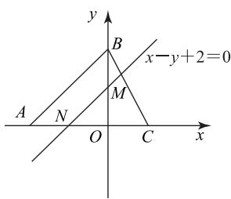
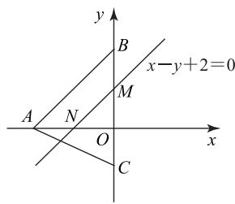
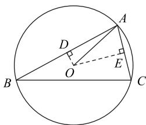
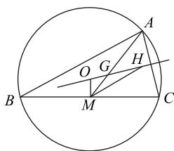
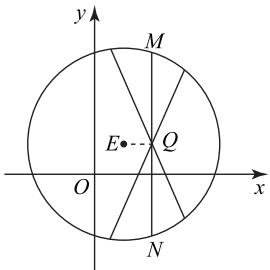
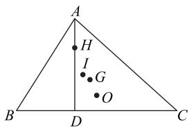

# 欧拉线——悄然兴起的高考热点

陈靖逸 杜晓霞 卜君

(湖北省襄阳市第一中学)

瑞士数学家欧拉 1765 年在其所著的《三角形的几何学》一书中提出:三角形的外心、重心、垂心依次位于同一直线上,且重心到外心的距离是重心到垂心的距离的一半,此直线被称为三角形的欧拉线,该定理被称为欧拉线定理.在各地新高考模拟试卷中,涉及欧拉线的试题频频“闪亮登场”,它们构思精巧、韵味十足、魅力四射,是考查考生的学科素养和关键能力的极好素材.下面精选一些例题加以剖析,旨在探索题型规律,揭示解题方法(通常试题会给出欧拉线的定义,本文不再赘述).

# 1 单选题——夯实基础

例1 已知 $\triangle ABC$ 的顶点 $A(4,0), B(0,2)$ ,$C(0, -3)$ , 则 $\triangle ABC$ 的欧拉线方程为 ( ).

A. $x + 2y - 3 = 0$

B. $2x + y - 3 = 0$

C. $x - 2y - 3 = 0$

D. 2x - y - 3 = 0

析 由题可得 $\triangle ABC$ 的重心为 $G\left(\frac{4}{3}, -\frac{1}{3}\right)$ . 直

线 AB 的斜率为 $-\frac{1}{2}$ ，所以边 AB 上的高所在直线的斜率为 2，则边 AB 上的高所在直线的方程为 2x-y-3=0。直线 AC 的斜率为 $\frac{3}{4}$ ，所以边 AC 上的高所在直线的斜率为 $-\frac{4}{3}$ ，则边 AC 上的高所在直线的方程为 $4x+3y-6=0$ ，联立

$$
\left\{ \begin{array}{l} 2 x - y - 3 = 0, \\ 4 x + 3 y - 6 = 0, \end{array} \right.
$$

解得 $\left\{\begin{aligned}x&=\frac{3}{2},\\ y&=0,\end{aligned}\right.$ 则垂心H的坐标为 $(\frac{3}{2},0)$ ，因此直线GH的斜率为2，则直线GH的方程为2x-y-3=0，所以 $\triangle ABC$ 的欧拉线方程为2x-y-3=0，故选D.

本题考查已知三角形三个顶点坐标求三角形的欧拉线方程,可先求出重心坐标和垂心坐标,进而求出三角形的欧拉线方程.

例 2 已知点 A(0,2) 和点 B(1,0) 为 $\triangle ABC$ 的，则“ $\triangle ABC$ 的欧拉线方程为 x=1”是“点 C 的为 (2,2)”的（）.

A. 充分不必要条件  
B. 必要不充分条件  
C. 充要条件

D. 既不充分也不必要条件

# 解析

当 $C(2,2)$ 时， $|AB| = |BC| = \sqrt{5}$ ， $\triangle ABC$ 是以 AC 为底边的等腰三角形, 边 AC 的垂直平分线即是 $\triangle ABC$ 的欧拉线,易知边 $AC$ 的垂直平分线方程为 $x=1$ ,所以 $\triangle ABC$ 的欧拉线方程为 $x=1$ ,即“点 $C$ 的坐标为 $(2,2)$ ” $\Rightarrow$ “ $\triangle ABC$ 的欧拉线方程为 $x=1$ ”.

当 $\triangle ABC$ 的欧拉线方程为 $x=1$ 时,设 $C(m,n)$ ,则 $\triangle ABC$ 的重心坐标为 $(\frac{m+1}{3},\frac{n+2}{3})$ ,代入欧拉线方程 $x=1$ ,得 $\frac{m+1}{3}=1$ ,解得

$$
m = 2. \tag {①}
$$

AB 的中点坐标为 $\left(\frac{1}{2},1\right)$ , $k_{AB}=\frac{2-0}{0-1}=-2$ ，所以 AB 的垂直平分线方程为 $y=\frac{1}{2}x+\frac{3}{4}$ ，联立 $\left\{\begin{aligned}&x=1,\\ &y=\frac{1}{2}x+\frac{3}{4},\end{aligned}\right.$ 解得 $\left\{\begin{aligned}&x=1,\\ &y=\frac{5}{4},\end{aligned}\right.$ 所以 $\triangle ABC$ 的外心坐标为 $(1,\frac{5}{4})$ ，则

$$
(m - 1) ^ {2} + (n - \frac {5}{4}) ^ {2} = (1 - 1) ^ {2} + (0 - \frac {5}{4}) ^ {2}. \tag {②}
$$

联立①②解得 $\left\{\begin{aligned}m=2,\\ n=2\end{aligned}\right.$ 或 $\left\{\begin{aligned}m=2,\\ n=\frac{1}{2},\end{aligned}\right.$ 则点C的坐标为(2,2)或 $(2,\frac{1}{2})$ ，即“△ABC的欧拉线方程为 $x=1$ ”≠“点C的坐标为(2,2)”.

综上，“ $\triangle ABC$ 的欧拉线方程为 $x = 1$ ”是“点 $C$

的坐标为(2,2)”的必要不充分条件,故选 B.

本题将三角形的欧拉线与充分必要条件的判断交会考查,命题角度新颖别致,考查考生的逻辑推理能力和运算求解能力.

# 2 多选题——检测素养

例 3 在平面直角坐标系 xOy 中, 已知 $\triangle ABC$ 的顶点 $A(-4,0), B(0,4)$ ，其欧拉线方程为 $x - y + 2 = 0$ ，则下列说法正确的是（ ）.

A. $\triangle ABC$ 的重心坐标为 $(- \frac{1}{3}, \frac{2}{3})$ 或 $(- \frac{2}{3}, \frac{1}{3})$

B. $\triangle ABC$ 的垂心坐标为 $(0,2)$ 或 $(-2,0)$

C. $\triangle ABC$ 的顶点 C 的坐标为 $(2,0)$ 或 $(0,-2)$

D. 欧拉线将 $\triangle ABC$ 分成的两部分中, 较小部分与较大部分的面积的比值为 $\frac{4}{5}$

# 解析

由题意知 AB 的中点坐标为 $(-2,2)$ ，AB 的中垂线方程为 $x + y = 0$ .

由 $\left\{\begin{aligned}x+y=0,\\ x-y+2=0,\end{aligned}\right.$ 解得 $\left\{\begin{aligned}x&=-1,\\ y&=1,\end{aligned}\right.$ 所以 $\triangle ABC$ 外心的坐标为 $(-1,1)$ .

设 $C(m,n)$ ，则 $\triangle ABC$ 的重心坐标为 $(\frac{-4 + m}{3},$ $\frac{4 + n}{3})$ ，代入欧拉线方程得 $\frac{-4 + m}{3} -\frac{4 + n}{3} +2 = 0$ ，即

$$
m - n - 2 = 0. \tag {①}
$$

因为 $\triangle ABC$ 的外心坐标为 $(-1, 1)$ ，所以 $(m + 1)^2 + (n - 1)^2 = (-4 + 1)^2 + (0 - 1)^2 = 10$ ，整理得

$$
m ^ {2} + n ^ {2} + 2 m - 2 n = 8. \tag {②}
$$

联立①②，得 $m = 2, n = 0$ 或 $m = 0, n = -2$ ，所以顶点 $C$ 的坐标为(2,0)或 $(0, - 2)$ ，故C正确.

$\triangle ABC$ 重心的坐标为 $(- \frac{2}{3}, \frac{4}{3})$ 或 $(- \frac{4}{3}, \frac{2}{3})$ 故A错误.

设 $\triangle ABC$ 的垂心坐标为 $(a, b)$ ，则 $\left\{ \begin{array}{l} a - b + 2 = 0, \\ \frac{b}{a - 2} \cdot \frac{4}{4} = -1 \end{array} \right.$ 或 $\left\{ \begin{array}{l} a - b + 2 = 0, \\ \frac{b + 2}{a} \cdot \frac{4}{4} = -1, \end{array} \right.$ 解得 $\left\{ \begin{array}{l} a = 0, \\ b = 2 \end{array} \right.$ 或$\left\{\begin{aligned}a&=-2,\\ b&=0,\end{aligned}\right.$ 所以 $\triangle ABC$ 的垂心坐标为(0,2)或(-2,0).如图1所示，其中 $N(-2,0),M(0,2)$ ，故B正确.

因为直线 AB 与欧拉线平行, 所以 $\triangle ABC$ 被分

成的两部分中,较小部分与较大部分的面积的比值是 $\frac{NC^{2}}{AC^{2}-NC^{2}}=\frac{16}{36-16}=\frac{4}{5}$ 或 $\frac{MC^{2}}{BC^{2}-MC^{2}}=\frac{16}{36-16}=\frac{4}{5}$ ，故D正确.

综上,选 BCD.

text_image

y
B
x-y+2=0
A
N
M
O
C
x

甲

text_image

y
B
x-y+2=0
A N M
O C
x

乙  
图1

# 点评

本题以欧拉线为载体,考查考生的信息迁移能力和运算求解能力,领悟欧拉线的实质,明晰三角形的重心、外心、垂心的定义及性质是解决问题的关键.

例 4 若 $\triangle ABC$ 满足 AC=BC，顶点 A(0,1)，$B(2, - 1)$ ，且其欧拉线与圆 $M:(x - 4)^{2} + y^{2} = r^{2}$ $(r>0)$ 相切,则下列结论正确的是().

A. $\triangle ABC$ 的欧拉线方程为 x-y-1=0  
B. 圆 $M$ 上的点到直线 $x - y = 0$ 的最小距离为 $\frac{\sqrt{2}}{2}$   
C. 若圆 $M$ 与圆 $x^{2} + (y - a)^{2} = 8$ 有公共点，则 $a \in [-4, 4]$   
D. 若点 $(x, y)$ 在圆 M 上，则 $\frac{y}{x+1}$ 的最大值是 $\frac{3\sqrt{41}}{41}$

# 解析

由题意可知 $\triangle ABC$ 的欧拉线即 $AB$ 的垂直平分线，因为 $A(0,1),B(2, - 1)$ ，所以 $AB$ 的中点坐标为 $(1,0), k_{AB} = -1$ ，则 $AB$ 的垂直平分线方程为 $x - y - 1 = 0$ ，故 A 正确.

因为欧拉线与圆 $M: (x - 4)^2 + y^2 = r^2 (r > 0)$ 相切，且圆心 $M(4,0)$ 到直线 $x - y - 1 = 0$ 的距离为 $\frac{|4 - 0 - 1|}{\sqrt{1 + 1}} = \frac{3\sqrt{2}}{2}$ ，则 $r = \frac{3\sqrt{2}}{2}$ . 又圆 $M$ 的方程为 $(x -$ $4)^{2} + y^{2} = \frac{9}{2}$ ，圆心 $M(4,0)$ 到直线 $x - y = 0$ 的距离为 $d = \frac{|4 - 0|}{\sqrt{1 + 1}} = 2\sqrt{2}$ ，所以圆 $M$ 上的点到直线 $x -$

$y = 0$ 的最小距离为 $d - r = 2\sqrt{2} - \frac{3\sqrt{2}}{2} = \frac{\sqrt{2}}{2}$ , 故 B 正确.

若圆 $M$ 与圆 $x^{2} + (y - a)^{2} = 8$ 有公共点，则 $2\sqrt{2} -\frac{3\sqrt{2}}{2}\leqslant \sqrt{(4 - 0)^{2} + (0 - a)^{2}}\leqslant 2\sqrt{2} +\frac{3\sqrt{2}}{2}$ ，解得 $-\frac{\sqrt{34}}{2}\leqslant a\leqslant \frac{\sqrt{34}}{2}$ ，故C错误.

$\frac{y}{x + 1}$ 的几何意义为圆 $M$ 上的点 $(x,y)$ 与定点 $P(-1,0)$ 连线的斜率，设过 $P(-1,0)$ 与圆 $M$ 相切的直线方程为 $y = k(x + 1)$ ，即 $kx - y + k = 0$ ，由 $\frac{|4k + k|}{\sqrt{k^2 + 1}} = \frac{3\sqrt{2}}{2}$ ，解得 $k = \pm \frac{3\sqrt{41}}{41}$ ，所以 $\frac{y}{x + 1}$ 的最大值是 $\frac{3\sqrt{41}}{41}$ 故D正确.

综上,选 ABD.

本题考查欧拉线方程的求解,点、直线、圆与圆的位置关系,代数式最值的求解方法,考逻辑推理能力和运算求解能力.

例 5 已知 $\triangle ABC$ 的外心为 O，重心为 G，垂心，M 为 BC 的中点，且 AB = 4, AC = 2，则下列各确的有（）.

A. $\overrightarrow{AG} \cdot \overrightarrow{BC} = 4$   
B. $\overrightarrow{AO} \cdot \overrightarrow{BC} = -6$   
C. $\overrightarrow{OH} = \overrightarrow{OA} +\overrightarrow{OB} +\overrightarrow{OC}$   
D. $\overrightarrow{AB} +\overrightarrow{AC} = 4\overrightarrow{OM} +2\overrightarrow{HM}$

由 $G$ 是 $\triangle ABC$ 的重心可得

$$
\begin{array}{c} \overrightarrow {A G} = \frac {2}{3} \overrightarrow {A M} = \frac {2}{3} \times (\frac {1}{2} \overrightarrow {A B} + \frac {1}{2} \overrightarrow {A C}) = \\ \frac {1}{3} (\overrightarrow {A B} + \overrightarrow {A C}), \end{array}
$$

所以

$$
\begin{array}{l} \overrightarrow {A G} \cdot \overrightarrow {B C} = \frac {1}{3} (\overrightarrow {A B} + \overrightarrow {A C}) \cdot (\overrightarrow {A C} - \overrightarrow {A B}) = \\ \frac {1}{3} \left(\left| \overrightarrow {A C} \right| ^ {2} - \left| \overrightarrow {A B} \right| ^ {2}\right) = - 4, \\ \end{array}
$$

故 A 错误.

过 $\triangle ABC$ 的外心O分别作AB,AC的垂线,垂足分别为D,E,如图2所示,易知D,E分别

text_image

Geometric diagram of a circle with inscribed triangle ABC and auxiliary lines, labeled points O, D, E, and right-angle symbols.

图2

是 $AB, AC$ 的中点，则

$$
\begin{array}{l} \overrightarrow {A O} \cdot \overrightarrow {B C} = \overrightarrow {A O} \cdot (\overrightarrow {A C} - \overrightarrow {A B}) = \overrightarrow {A O} \cdot \overrightarrow {A C} - \overrightarrow {A O} \cdot \overrightarrow {A B} = \\ | \overrightarrow {A O} | | \overrightarrow {A C} | \cos \angle O A E - | \overrightarrow {A O} | | \overrightarrow {A B} | \cos \angle O A D = \\ | \overrightarrow {A E} | \cdot | \overrightarrow {A C} | - | \overrightarrow {A D} | \cdot | \overrightarrow {A B} | = \\ \frac {1}{2} | \overrightarrow {A C} | ^ {2} - \frac {1}{2} | \overrightarrow {A B} | ^ {2} = - 6, \\ \end{array}
$$

故 B 正确.

因为 G 是 $\triangle ABC$ 的重心, 所以 $\overrightarrow{GA} + \overrightarrow{GB} + \overrightarrow{GC} = 0$ , 故

$$
\begin{array}{l} \overrightarrow {O A} + \overrightarrow {O B} + \overrightarrow {O C} = \\ (\overrightarrow {O G} + \overrightarrow {G A}) + (\overrightarrow {O G} + \overrightarrow {G B}) + (\overrightarrow {O G} + \overrightarrow {G C}) = \\ 3 \overrightarrow {O G} + \overrightarrow {G A} + \overrightarrow {G B} + \overrightarrow {G C} = 3 \overrightarrow {O G}, \\ \end{array}
$$

由欧拉线定理可得 $\overrightarrow{GH}=2\overrightarrow{OG}$ ，所以 $\overrightarrow{OH}=3\overrightarrow{OG}$ ，故C正确.

如图 3 所示, 由 $\overrightarrow{OH} = 3\overrightarrow{OG}$ , 可得 $\overrightarrow{MG} = \frac{2}{3}\overrightarrow{MO} + \frac{1}{3}\overrightarrow{MH}$ , 即 $\overrightarrow{GM} = \frac{2}{3}\overrightarrow{OM} + \frac{1}{3}\overrightarrow{HM}$ , 则

text_image

Geometric diagram of a circle with inscribed triangle ABC and internal points M, G, H, O, showing chords and intersections.

图3

$$
\overrightarrow {A B} + \overrightarrow {A C} = 2 \overrightarrow {A M} = 6 \overrightarrow {G M} =
$$

$$
6 \left(\frac {2}{3} \overrightarrow {O M} + \frac {1}{3} \overrightarrow {H M}\right) = 4 \overrightarrow {O M} + 2 \overrightarrow {H M},
$$

故 D 正确.

综上,选 BCD.

点评

本题以欧拉线和欧拉线定理为依托,考查平面向量的线性运算和数量积运算.

例6 直线 $l$ 与 $y$ 轴及双曲线 $\frac{x^2}{a^2} -\frac{y^2}{b^2} = 1(a > 0,$

$b > 0$ )的两条渐近线的三个不同交点构成集合 $M$ ，且 $M$ 恰为某三角形的外心、重心、垂心所成集合，若 $l$ 的斜率为1，则该双曲线的离心率 $\pmb{e}$ 可能是（ ）.

A. $\frac{\sqrt{26}}{5}$

B. $\frac{\sqrt{5}}{2}$

C. $\sqrt{2}$

D. $\sqrt{10}$

设直线 l 的方程为 $y = x + t$ (不妨设 t > 0)，析令 x = 0，可得 y = t，则直线 l 与 y 轴的交点为 $A(0,t)$ . 双曲线的渐近线方程为 $y = \pm \frac{b}{a} x$ , 将之与直线 $y = x + t$ 联立, 可得

$$
B \left(\frac {a t}{b - a}, \frac {b t}{b - a}\right), C \left(- \frac {a t}{a + b}, \frac {b t}{a + b}\right).
$$

当 A, B, C 依次为三角形的外心、重心、垂心，且

它们依次位于同一条直线上时，可得 $\overrightarrow{AB} = \frac{1}{2}\overrightarrow{BC}$ ，即 $\frac{at}{b - a} = \frac{1}{2}\cdot (-\frac{at}{a + b} -\frac{at}{b - a})$ ，则 $a = -2b$ ，不成立.

当 A, C, B 依次为三角形的外心、重心、垂心，且它们依次位于同一条直线上时，可得 $\overrightarrow{AC} = \frac{1}{2}\overrightarrow{CB}$ ，即

$$
- \frac {a t}{a + b} = \frac {1}{2} \cdot \left(\frac {a t}{b - a} + \frac {a t}{a + b}\right),
$$

则 $a = 2b, e = \frac{c}{a} = \sqrt{1 + \frac{b^2}{a^2}} = \frac{\sqrt{5}}{2}$ , 故 B 正确.

当 B, C, A 依次为三角形的外心、重心、垂心，且它们依次位于同一条直线上时，可得 $\overrightarrow{BC} = \frac{1}{2}\overrightarrow{CA}$ ，即 $-\frac{at}{a + b} - \frac{at}{b - a} = \frac{1}{2} \cdot (0 + \frac{at}{a + b})$ ，则 $a = 5b, e = \frac{c}{a} = \sqrt{1 + \frac{b^{2}}{a^{2}}} = \frac{\sqrt{26}}{5}$ ，故 A 正确.

当 B, A, C 依次为三角形的外心、重心、垂心，且它们依次位于同一条直线上时，可得 $\overrightarrow{BA} = \frac{1}{2}\overrightarrow{AC}$ ，即 $-\frac{at}{b-a} = \frac{1}{2} \cdot (-\frac{at}{a+b} - 0)$ ，则 b = -3a，不成立。

当 C, A, B 依次为三角形的外心、重心、垂心，且它们依次位于同一条直线上时，可得 $\overrightarrow{CA} = \frac{1}{2}\overrightarrow{AB}$ ，即 $\frac{at}{a + b} = \frac{1}{2} \cdot (\frac{at}{b - a} - 0)$ ，则 $b = 3a, e = \frac{c}{a} = \sqrt{1 + \frac{b^{2}}{a^{2}}} = \sqrt{10}$ ，故 D 正确.

当 C, B, A 依次为三角形的外心、重心、垂心，且它们依次位于同一条直线上时，可得 $\overrightarrow{CB} = \frac{1}{2} \overrightarrow{BA}$ ，即 $\frac{at}{b - a} + \frac{at}{a + b} = \frac{1}{2} \cdot (0 - \frac{at}{b - a})$ ，则 a = -5b，不成立.

综上,选 ABD.

本题以欧拉线定理和欧拉线为背景考查双曲线的离心率的求解方法,对考生的阅读理运算求解能力要求较高.

# 3 填空题——创新情境

例 7 已知 $\triangle ABC$ 的三个顶点是 A(5,2), B(6,

7), $C(0,3)$ , 其欧拉线与圆 $M:(x-1)^{2}+(y-\frac{3}{2})^{2}=$ 15 相交于 E, F 两点，则 $\triangle ABC$ 的欧拉线方程为

44

数理化

\_\_\_\_，弦长 $|EF| =$ \_\_\_\_.

由于 $|AB|=\sqrt{26}$ ， $|AC|=\sqrt{26}$ ， $|BC|=2\sqrt{13}$ ，所以 $\triangle ABC$ 是以BC为底边的等腰三角形, BC 的中点坐标为 $(3,5)$ , $k_{BC}=\frac{2}{3}$ , 所以边 BC 的垂直平分线方程为 $3x+2y-19=0$ , 在 $\triangle ABC$ 中, 边 BC 的垂直平分线、高线所在的直线、中线所在的直线为同一条直线, 即直线 $3x+2y-19=0$ 经过其重心、外心以及垂心, 故欧拉线方程为 $3x+2y-19=0$ . 因为圆心 $M(1,\frac{3}{2})$ 到直线 $3x+2y-19=0$ 的距离为 $d=\sqrt{13}$ , 所以弦长

$$
\left| E F \right| = 2 \sqrt {r ^ {2} - d ^ {2}} = 2 \sqrt {(\sqrt {1 5}) ^ {2} - (\sqrt {1 3}) ^ {2}} = 2 \sqrt {2}.
$$

点评

本题以双空题的形式考查等腰三角形的欧拉线方程的求解及弦长的计算方法,考查考求解能力.

例8 在平面直角坐标系中,已知 $\triangle ABC$ 的顶点1,1),C(3,5),且 $AB=AC$ ,过其欧拉线上一点圆 $O:x^{2}+y^{2}=4$ 的两条切线,切点分别为M, $|MN|$ 的最小值为\_\_\_\_.

因为线段 BC 的中点坐标为 $(1,3)$ ，欧拉线的斜率为 $k = -\frac{1}{k_{BC}} = -1$ ，所以欧拉线方程为

$x + y - 4 = 0.$ 又点 $O$ 到直线 $x + y - 4 = 0$ 的距离 $d = 2\sqrt{2} > 2$ ，即欧拉线与圆 $O$ 相离，要使 $|MN|$ 最小，则在 $\mathrm{Rt}\triangle PMO$ 与 $\mathrm{Rt}\triangle PNO$ 中， $\angle MOP = \angle NOP$ 最小，即 $\angle MPN$ 最大，而当 $OP$ 与欧拉线垂直时， $\angle MPN$ 最大，所以 $d = |OP| = 2\sqrt{2}$ ，则

$|MN|=2r\sin\angle NOP$ (r 为圆 O 的半径),

且 $r = 2, \cos \angle NOP = \frac{r}{d} = \frac{\sqrt{2}}{2}$ , 所以 $\sin \angle NOP = \frac{\sqrt{2}}{2}$ , 即 $|MN|_{\min} = 2\sqrt{2}$ .

点评

本题考查欧拉线方程的求解、直线与圆的位置关系及弦长的最值问题,考查考生的运算和逻辑推理能力.

例 9 在平面直角坐标系中, 已知 $\triangle ABC$ 为直角三角形, 直角顶点 C 在 x 轴上, 点 $D(\frac{\pi}{4}, 1)$ 是斜边 AB 上一点, 其欧拉线是正切函数 $y = \tan x$ 在点 $D(\frac{\pi}{4}, 1)$ 处的切线, 则点 C 的坐标为 \_\_\_\_.

因为 $\triangle ABC$ 是直角三角形,所以垂心为直角顶点C,外心为斜边AB的中点.设 $C(m$ ,0), AB 的中点为 M, 故 $\triangle ABC$ 的欧拉线即为直线 MC.

由题意可知直线 $MC$ 为正切函数 $y = \tan x$ 在点 $D(\frac{\pi}{4},1)$ 处的切线，又点 $D(\frac{\pi}{4},1)$ 在斜边 $AB$ 上，所以 $\triangle ABC$ 的外心 $M$ 即为点 $D(\frac{\pi}{4},1)$ . 又切线的斜率为

$$
k = (\tan x) ^ {\prime} \mid_ {x = \frac {\pi}{4}} = (\frac {\sin x}{\cos x}) ^ {\prime} \mid_ {x = \frac {\pi}{4}} = \frac {1}{\cos^ {2} \frac {\pi}{4}} = 2,
$$

所以欧拉线方程为 $y - 1 = 2 \times (x - \frac{\pi}{4})$ . 注意到点 $C(m,0)$ 在欧拉线上，则 $0 - 1 = 2 \times (m - \frac{\pi}{4})$ ，解得 $m = \frac{\pi}{4} - \frac{1}{2}$ ，所以点 $C$ 的坐标为 $(\frac{\pi - 2}{4}, 0)$ .

点评

本题将欧拉线与导数的几何意义巧妙交会，命题情境新颖别致、超凡脱俗。

例 10 古希腊著名数学家阿波罗尼斯与欧几里可基米德齐名. 他发现: 平面内到两个定点 A, B 离之比为定值 $\lambda (\lambda > 0 \text{ 且 } \lambda \neq 1)$ 的点的轨迹是圆. , 人们将这个圆以他的名字命名, 称为阿波罗尼, 简称阿氏圆. 在平面直角坐标系 xOy 中, 已知 BC 的顶点 A(-2,0), B(2,4), 其欧拉线方程为 =0, 则 $\triangle ABC$ 的外接圆 E 的方程为 \_\_\_\_.已知直线 $l: (\lambda + 2\mu)x + (\lambda - \mu)y - 3\lambda - 3\mu = 0(\lambda, \mu$ 为常数)交圆 $E$ 于 $M, N$ 两点， $y_M \geqslant y_N (y_M, y_N$ 分别为点 $M, N$ 的纵坐标)， $P$ 为 $l$ 外一动点，且 $|MP| = 2|NP|$ ，则当 $|MN|$ 最小时， $\triangle MNP$ 面积的最大值为 \_\_\_\_.

由题意得线段 AB 的中点坐标为 $(0,2)$ ，
析 $k_{AB}=1$ ，所以线段 AB 的垂直平分线的斜率为-1,则线段AB的垂直平分线的方程为 $x+y-2=0$ .因为 $\triangle ABC$ 的外心同时在直线 $x+y-2=0$ 与直线x-y=0上，所以由 $\left\{\begin{aligned}x+y-2&=0,\\ x-y&=0,\end{aligned}\right.$ 得 $\left\{\begin{aligned}x&=1,\\ y&=1,\end{aligned}\right.$ 即 $\triangle ABC$ 的外心坐标为(1,1).因为 $\triangle ABC$ 的外接圆E的半径为

$$
R = \sqrt {[ 1 - (- 2) ] ^ {2} + (1 - 0) ^ {2}} = \sqrt {1 0},
$$

所以 $\triangle ABC$ 的外接圆 $E$ 的方程为

$$
(x - 1) ^ {2} + (y - 1) ^ {2} = 1 0.
$$

由直线 $l:(\lambda+2\mu)x+(\lambda-\mu)y-3\lambda-3\mu=0$ , 得

$$
\lambda (x + y - 3) +
$$

$$
\mu (2 x - y - 3) = 0,
$$

令 $\left\{\begin{aligned}x+y-3=0,\\ 2x-y-3=0,\end{aligned}\right.$ 得 $\left\{\begin{aligned}x=2,\\ y=1,\end{aligned}\right.$ 所以直线 l 过定点 Q(2,1). 如图 4 所示，连接 EQ，当 $EQ \perp$ MN 时, 点 E 到直线 l 的距离最大, $|MN|$ 最小, 此时 $M(2,4)$ , $N(2,-2)$ .

text_image

y
M
E•--
Q
O
x
N

图4

设 $P(x, y) (x \neq 2)$ ，由 $|MP| = 2 |NP|$ ，得 $\sqrt{(x - 2)^2 + (y - 4)^2} = 2\sqrt{(x - 2)^2 + (y + 2)^2}$ ，两边同时平方并整理得 $x^2 + y^2 - 4x + 8y + 4 = 0$ ，即 $(x - 2)^2 + (y + 4)^2 = 16$ ，所以点 $P$ 的轨迹为圆（去掉横坐标为 2 的点）。因为 $|MN|_{\min} = 6$ ，所以要使 $|MN|$ 最小时 $\triangle MNP$ 的面积最大，只需使点 $P$ 到直线 $MN$ （即 $x = 2$ ）的距离最大，易知最大距离为 4，则 $\triangle MNP$ 面积的最大值为 $\frac{1}{2} \times 6 \times 4 = 12$ 。

点评

本题将欧拉线与阿波罗尼斯圆巧妙交会，考查三角形的外接圆方程的求解、直线过定点、阿波罗尼斯圆、三角形面积的最值等，是一道优秀的创新题.

# 4 解答题——甄别能力

例11 已知 $\triangle ABC$ 的三个顶点分别为 $A(-1,$ 5), $B(-3,3)$ , $C(0,2)$ , 圆 E 的圆心 E 在 $\triangle ABC$ 的欧拉线上, 且满足 $\overrightarrow{AE} \cdot \overrightarrow{BE} = 0$ , 直线 $x + y - 6 = 0$ 被圆 E 截得的弦长为 $2\sqrt{3}$ .

(1)求 $\triangle ABC$ 的欧拉线方程；  
(2)求圆 E 的标准方程.

析

(1)由 $A(-1,5), B(-3,3), C(0,2)$ , 可得

$\triangle ABC$ 的重心 $G(-\frac{4}{3}, \frac{10}{3})$ . 因为 $k_{AB} = 1$ ,$k_{AC}=-3$ ，所以边 AB 上的高所在直线为 $y+x-2=0$ ，边 AC 上的高所在直线为 $x-3y+12=0$ 。

由 $\left\{\begin{aligned}y+x-2=0,\\ x-3y+12=0,\end{aligned}\right.$ 得 $\left\{\begin{aligned}x&=-\frac{3}{2},\\ y&=\frac{7}{2},\end{aligned}\right.$ 即 $\triangle ABC$ 的垂

心 $H(-\frac{3}{2}, \frac{7}{2})$ ，连接 $GH$ ，则 $GH$ 所在直线为 $\triangle ABC$

的欧拉线.因为 $k_{GH} = -1$ ，所以 $\triangle ABC$ 的欧拉线方程为 $x + y - 2 = 0$ .

(2) 设 $E(a, 2 - a)$ ，圆 E 的半径为 r，因为 $\overrightarrow{AE} = (a + 1, -a - 3)$ ， $\overrightarrow{BE} = (a + 3, -a - 1)$ ，所以 $\overrightarrow{AE} \cdot \overrightarrow{BE} = (a + 1)(a + 3) + (-a - 3)(-a - 1) = 0$ ，解得 a = -3 或 -1.

当 a = -3 时， $E(-3,5)$ ，圆心 E 到直线 $x + y - 6 = 0$ 的距离 $d = 2\sqrt{2}$ ，则 $2\sqrt{r^{2} - d^{2}} = 2\sqrt{r^{2} - 8} = 2\sqrt{3}$ ，解得 $r = \sqrt{11}$ ，故圆 E 的方程为

$$
(x + 3) ^ {2} + (y - 5) ^ {2} = 1 1.
$$

当 a = -1 时， $E(-1,3)$ ，圆心 E 到直线 $x + y - 6 = 0$ 的距离 $d = 2\sqrt{2}$ ，则 $2\sqrt{r^{2} - d^{2}} = 2\sqrt{r^{2} - 8} = 2\sqrt{3}$ ，解得 $r = \sqrt{11}$ ，故圆 E 的方程为

$$
(x + 1) ^ {2} + (y - 3) ^ {2} = 1 1.
$$

综上，圆 E 的标准方程为 $(x+3)^{2}+(y-5)^{2}=11$ 或 $(x+1)^{2}+(y-3)^{2}=11$ .

本题考查三角形的欧拉线方程的求解方法、直线与圆的位置关系、平面向量的坐标运算、弦长公式等，考查分类讨论思想、逻辑推理能力和运算求解能力.

例 12 如图 5 所示, 已知 a, b, c 分别为 $\triangle ABC$ 的三个内角 A, B, C 的对边，且 c = 4, b = 5, a = 6，线段 BC 边上的高为 AD， $\triangle ABC$ 的内心、重心、外心、垂心依次为点 I, G, O, H.

text_image

A
H
I
G
O
B
D
C

图5

(1)求 $\triangle ABC$ 的高AD的长；

(2) 欧拉线定理: 设 ABC 的重心、外心、垂心分别是点 G, O, H, 则 G, O, H 三点共线, 且 OH = 3OG, 请合理运用欧拉线定理, 求 $\overrightarrow{AH} \cdot \overrightarrow{AI}$ 的值.

(1)由于 $c = 4, b = 5, a = 6$ ，故 $\cos \angle BAC =$ $\frac{b^{2}+c^{2}-a^{2}}{2bc}=\frac{1}{8}$ ，则

$$
\sin \angle B A C = \sqrt {1 - \cos^ {2} \angle B A C} = \frac {3 \sqrt {7}}{8},
$$

又 $S_{\triangle ABC} = \frac{1}{2} AD\cdot BC = \frac{1}{2} bc\sin \angle BAC$ ，所以

$$
A D = \frac {b c \sin \angle B A C}{a} = \frac {4 \times 5}{6} \times \frac {3 \sqrt {7}}{8} = \frac {5 \sqrt {7}}{4}.
$$

(2)如图6所示,连接AI并延长交BC于点E,则AE平分 $\angle BAC$ ,根据角平分线定理可知 $\frac{AB}{AC}=$

$\frac{BE}{CE}=\frac{4}{5}$ ，所以 $\overrightarrow{BE}=\frac{4}{5}\overrightarrow{EC}$ ，

则 $\overrightarrow{AE} -\overrightarrow{AB} = \frac{4}{5} (\overrightarrow{AC} -$

$$
\overrightarrow {A E}), \overrightarrow {A E} = \frac {5}{9} \overrightarrow {A B} + \frac {4}{9} \overrightarrow {A C}.
$$

连接 $BI$ ，则 $BI$ 平分

$\angle ABC$ ,根据角平分线定理可知

$$
\frac {A B}{B E} = \frac {A I}{I E} = \frac {4}{6 \times \frac {4}{9}} = \frac {3}{2},
$$

则

$$
\overrightarrow {A I} = \frac {3}{5} \overrightarrow {A E} = \frac {3}{5} \left(\frac {5}{9} \overrightarrow {A B} + \frac {4}{9} \overrightarrow {A C}\right) = \frac {1}{3} \overrightarrow {A B} + \frac {4}{1 5} \overrightarrow {A C}.
$$

因为 G, O, H 三点共线, $\overrightarrow{OH} = 3\overrightarrow{OG}$ , 又

$$
\overrightarrow {A G} = \frac {2}{3} \times \frac {1}{2} (\overrightarrow {A B} + \overrightarrow {A C}) = \frac {1}{3} (\overrightarrow {A B} + \overrightarrow {A C}),
$$

所以

$$
\overrightarrow {A H} = \overrightarrow {A O} + \overrightarrow {O H} = \overrightarrow {A O} + 3 \overrightarrow {O G} =
$$

$$
\begin{array}{l} \overrightarrow {A O} + 3 (\overrightarrow {O A} + \overrightarrow {A G}) = - 2 \overrightarrow {A O} + 3 \overrightarrow {A G} = \\ - 2 \overrightarrow {A O} + \overrightarrow {A B} + \overrightarrow {A C}, \\ \end{array}
$$

则

$$
\begin{array}{l} \overrightarrow {A H} \cdot \overrightarrow {A I} = [ - 2 \overrightarrow {A O} + (\overrightarrow {A B} + \overrightarrow {A C}) ] \cdot \overrightarrow {A I} = \\ - 2 \overrightarrow {A O} \cdot \overrightarrow {A I} + (\overrightarrow {A B} + \overrightarrow {A C}) \cdot \overrightarrow {A I}. \\ \end{array}
$$

又

$$
\overrightarrow {A O} \cdot \overrightarrow {A I} = \overrightarrow {A O} \cdot \left(\frac {1}{3} \overrightarrow {A B} + \frac {4}{1 5} \overrightarrow {A C}\right) =
$$

$$
\begin{array}{l} \frac {1}{3} \times \frac {1}{2} \overrightarrow {A B ^ {2}} + \frac {4}{1 5} \times \frac {1}{2} \overrightarrow {A C ^ {2}} = \frac {1}{3} \times 8 + \frac {4}{1 5} \times \frac {2 5}{2} = 6, \\ \overrightarrow {A B} \cdot \overrightarrow {A C} = | \overrightarrow {A B} | \cdot | \overrightarrow {A C} | \cos \angle B A C = \\ 4 \times 5 \times \frac {1}{8} = \frac {5}{2}, \\ \end{array}
$$

$$
(\overrightarrow {A B} + \overrightarrow {A C}) \cdot \overrightarrow {A I} = (\overrightarrow {A B} + \overrightarrow {A C}) \cdot \left(\frac {1}{3} \overrightarrow {A B} + \frac {4}{1 5} \overrightarrow {A C}\right) =
$$

$$
\frac {1}{3} \overrightarrow {A B ^ {2}} + \frac {4}{1 5} \overrightarrow {A C ^ {2}} + \frac {3}{5} \overrightarrow {A B} \cdot \overrightarrow {A C} =
$$

$$
\frac {1}{3} \times 1 6 + \frac {4}{1 5} \times 2 5 + \frac {3}{5} \times \frac {5}{2} = \frac {2 7}{2},
$$

则 $\overrightarrow{AH} \cdot \overrightarrow{AI} = -2 \times 6 + \frac{27}{2} = \frac{3}{2}$ .

本题考查余弦定理及等面积法求三角形的高、欧拉线定理的运用、角平分线定理及平面向量的线性运算及数量积运算.求解本题有一定的难度,极富思考性和挑战性.

(完)