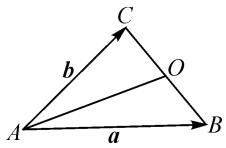
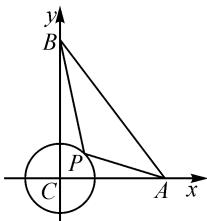
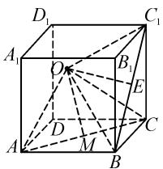
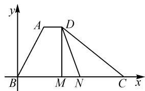
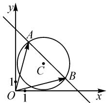
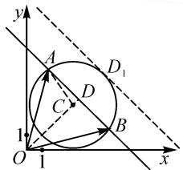

# 用极化恒等式巧解数量积取值范围

# 佛山市顺德区青云中学 林伟湛

摘要:平面向量虽然不是高中数学的主干知识,但它也是高考考查的重要内容,利用平面向量这一工具可以解决很多其他章节的问题.其中数量积是平面向量的重要知识之一,是高考考查的重点,新教材中涉及数量积的计算主要以定义法、坐标法为主,而基底法与投影法也有所渗透,然而只掌握以上四种方法来解决数量积问题有时会出现非常复杂的情况,特别是运算量比较大,学生难以掌握.定义法与坐标法有点脱离“形”,基底法与投影法虽涉及到“形”,但如果运用得不充分,有时不能起到简化运算的效果.如果能利用课本一道习题的结论——极化恒等式,则往往能起到简化运算的效果.

关键词: 极化恒等式; 数量积; 取值范围

# 1 极化恒等式的来源及证明

(2019年人教A版数学教材“平面向量”一章第22页练习第3题)求证: $(a + b)^2 - (a - b)^2 = 4a \cdot b$ .

证明： $(a+b)^{2}-(a-b)^{2}=(|a|^{2}+|b|^{2}+2a\cdot b)-(|a|^{2}+|b|^{2}-2a\cdot b)=4a\cdot b.$

这就是极化恒等式,可以将其变形为 $a \cdot b = \frac{1}{4}[(a + b)^{2} - (a - b)^{2}]$ . 它是计算数量积的一种重要的方法,往往能够化繁为简,令人拍案叫绝. 它能弥补定义法、坐标法、投影法、基底法四种数量积计算方法的缺陷——不能完美结合图形,极化恒等式能通过充分发挥几何图形的直观性,简化运算,特别是在求数量积的取值范围上简单快捷,有时甚至零运算.

下面先看看极化恒等式的数形结合所在: 如图 1 所示, 若 O 为 BC 的中点, 则 $\overrightarrow{AB} \cdot \overrightarrow{AC} = a \cdot b = \frac{1}{4}[(a + b)^2 - (a - b)^2] =$

  
图1

$$
\frac {1}{4} \left[ (2 \overrightarrow {A O}) ^ {2} - (2 \overrightarrow {O B}) ^ {2} \right] = | \overrightarrow {A O} | ^ {2} - | \overrightarrow {O B} | ^ {2}.
$$

上述结果表明, 同起点的两个向量的数量积 $\overrightarrow{AB} \cdot \overrightarrow{AC}$ 的大小只与 OA, OB 的长度有关. 这样数量积的问题就转化为两个距离的平方差问题, 从而只需研究第三边的边长及第三边上的中线长即可, 需注意, A, B, C 三点可以共线.

# 2 求数量积的常规方法存在的问题

在研究极化恒等式前有必要先研究其他几种方法的缺点(下面以求数量积的取值范围为例说明它们的缺点),这样才能更好地说明学会极化恒等式的必要性,也能更准确地判断何时运用极化恒等式求解数量积的取值范围更快捷.

(1) 定义法: $a \cdot b = |a||b|\cos\langle a, b\rangle$ , 参与运算的变量有三个, 有两个变量为定值时才好用.  
(2) 坐标法: $\boldsymbol{a} = (x_{1}, y_{1})$ , $\boldsymbol{b} = (x_{2}, y_{2})$ , $a \cdot b = x_{1}x_{2} + y_{1}y_{2}$ ，参与运算的变量有四个，容易建系且较多定量，或者变量之间存在等量关系时才好用，通常有一定的运算量.  
(3) 投影法: $a \cdot b = |a| \cdot (|b| \cos \langle a, b \rangle)$ 或 $a \cdot b = c \cdot b$ (c 为 a 在 b 上的投影向量), 主要适合于有一个向量为定向量, 从而转化为求投影向量的模的范围问题, 遇到两个动向量时作用不大.  
(4) 基底法: 运用向量加法、减法的运算法则, 将两个向量用同一组基底表示出来, 从而转化为几个数量积的和, 此方法参与运算的量较多, 通常运算量较大, 耗时甚多, 容易出错, 另外, 选哪一组向量作为基底也须花时间考虑.

# 3 利用极化恒等式求解数量积取值范围

# 3.1 模型一: 两向量起点为动点, 两终点为定点

例 1 （2022 年北京高考）在 $\triangle ABC$ 中，AC = 3，BC = 4， $\angle C = 90^{\circ}$ . P 为 $\triangle ABC$ 所在平面内的动点，且 PC = 1，则 $\overrightarrow{PA} \cdot \overrightarrow{PB}$ 的取值范围是 \_\_\_\_.

解法 1: 坐标法.

如图 2 所示建立平面直角坐标系. 因为 PC=1, 所以点 P 在以 C 为圆心, 1 为半径的圆上运动. 设 $P(\cos \theta, \sin \theta), \theta \in [0, 2\pi)$ , 则可得 $\overrightarrow{PA} = (3 - \cos \theta, -\sin \theta), \overrightarrow{PB} = (-\cos \theta, 4 - \sin \theta)$ .

text_image

y
B
P
C
A
x

图 2

所以 $\overrightarrow{PA} \cdot \overrightarrow{PB} = (-\cos \theta) \times$

$$
(3 - \cos \theta) + (4 - \sin \theta) \times (- \sin \theta) = \cos^ {2} \theta - 3 \cos \theta -
$$

$4\sin\theta+\sin^{2}\theta=1-3\cos\theta-4\sin\theta=1-5\sin(\theta+\varphi)$ ，其中 $\sin\varphi=\frac{3}{5},\cos\varphi=\frac{4}{5}$ .

因为 $-1 \leqslant \sin (\theta + \varphi) \leqslant 1$ ，所以可得 $-4 \leqslant 1 - 5 \sin (\theta + \varphi) \leqslant 6$ ，即 $\overrightarrow{PA} \cdot \overrightarrow{PB} \in [-4, 6]$ .

解法 2: 极化恒等式.

由 PC=1，可知点 P 在以 C 为圆心，1 为半径的圆上运动。设 AB 的中点为 D，易知 $\left|\overrightarrow{BD}\right|=\frac{5}{2}$ ，则 $\overrightarrow{PA}\cdot\overrightarrow{PB}=\left|\overrightarrow{PD}\right|^{2}-\left|\overrightarrow{BD}\right|^{2}=\left|\overrightarrow{PD}\right|^{2}-\left(\frac{5}{2}\right)^{2}=\left|\overrightarrow{PD}\right|^{2}-\frac{25}{4}$ 。

易知 $|\overrightarrow{PD}|_{\max} = |\overrightarrow{CD}| + 1 = |\overrightarrow{BD}| + 1 = \frac{7}{2},$ $|\overrightarrow{PD}|_{\min} = |\overrightarrow{CD}| - 1 = \frac{3}{2}$ ，所以 $\overrightarrow{PA}\cdot \overrightarrow{PB}\in [-4,6]$

评析:经过各种常规方法的缺点分析,解法1择优选用了坐标法,若设 $P(x,y)$ ,则变量有两个,不好处理,故用三角代换,然而未知量虽然只有 $\theta$ ,但运算量较大,且涉及到三角恒等变换的知识.而解法2采用极化恒等式,只有 $|\overrightarrow{PD}|$ 一个变量,从而转化为圆上的动点到圆外定点的距离问题,是一个一元函数的值域问题,非常简单,运算量极少.

极化恒等式不但能解决平面向量的数量积问题，还能解决空间向量的数量积问题.

例 2 已知棱长为 2 的正方体 $ABCD-A_{1}B_{1}C_{1}D_{1}$ 中，点 A 在空间直角坐标系 O-xyz 的 x 轴上移动，点 C 在平面 yOz 上移动，则 $\overrightarrow{OC_{1}} \cdot \overrightarrow{OB}$ 的最大值是 \_\_\_\_.

分析:本题为空间向量数量积问题,用定义法会有三个变量,由于两个向量都不定,投影法也不好处理,坐标法困难更大,因为坐标系是动的,哪怕建立一个常规的以 D 为原点的空间直角坐标系也不好处理,因为横、纵、竖三个坐标都是变量,虽然能得到它们之间的一个等量关系,但还是相当于有两个变量,列出的数量积的目标函数也相当复杂.但如果考虑极化恒等式,变量就只有一个,只要搞清楚原点的轨迹,此变量的最值就可轻松得到,从而问题迎刃而解.

解:如图3,连接 OC, $BC_{1}$ , 取 $BC_{1}$ 的中点为 E, 连接 OE, AC, 取 AC 的中点 M, 连接 OM. 易得 $|AM| = |CM| = |BE| = \sqrt{2}$ .

由极化恒等式, 得 $\overrightarrow{OC_{1}} \cdot \overrightarrow{OB} = |\overrightarrow{OE}|^{2} - |\overrightarrow{BE}|^{2} = |\overrightarrow{OE}|^{2} - 2.$

text_image

D₁
A₁
O
B₁
E
A
D
M
B
C₁

图3

依题意, $OA \perp OC$ ,则原点O的轨迹是以AC的中点 M 为球心, AC 为直径的球, 可得 $\left|\overrightarrow{OE}\right|_{\max} = \left|\overrightarrow{ME}\right| + \frac{1}{2}\left|\overrightarrow{AC}\right| = \sqrt{2} + \sqrt{2} = 2\sqrt{2}$ .

所以 $(\overrightarrow{OC_1} \cdot \overrightarrow{OB})_{\max} = |\overrightarrow{OE}|_{\max}^2 - 2 = (2\sqrt{2})^2 - 2 = 6.$

评析:本题若用常规方法求解,难度实在太大,但是利用极化恒等式后,借助轨迹思想,转化为一个一元二次函数的最值问题,相当简单.

小结:对于起点为动点,两终点为定点的两个向量的数量积取值范围问题,最终转化为求动点的轨迹到某定点的距离的最值问题.

# 3.2 模型二: 两向量起点为定点, 两终点为动点

例 3 （天津高考题改编）在四边形 ABCD 中， $\angle B=60^{\circ}, AB=3, \overrightarrow{AD}=\frac{1}{6}\overrightarrow{BC}$ ，若 M, N 是线段 BC 上的动点，且 $\left|\overrightarrow{MN}\right|=1$ ，则 $\overrightarrow{DM} \cdot \overrightarrow{DN}$ 的最小值为 \_\_\_\_.

解法 1: 坐标法.

如图 4, 以 B 为坐标原点, BC 所在直线为 x 轴建立平面直角坐标系.

由 BC=6，得 $C(6,0)$ .

由 $|AB|=3,\angle ABC=$

text_image

y
A D
B M N C x

图4

$60^{\circ}$ , 得点 $A$ 的坐标为 $\left(\frac{3}{2}, \frac{3\sqrt{3}}{2}\right)$ .

由 $\overrightarrow{AD} = \frac{1}{6}\overrightarrow{BC}$ ，可知 $D\left(\frac{5}{2},\frac{3\sqrt{3}}{2}\right)$ .设 $M(x,0)$ ，则 $N(x + 1,0)$ （其中 $0\leqslant x\leqslant 5$ ).于是可得 $\overrightarrow{DM} =$ $\left(x - \frac{5}{2}, - \frac{3\sqrt{3}}{2}\right),\overrightarrow{DN} = \left(x - \frac{3}{2}, - \frac{3\sqrt{3}}{2}\right)$ ，则

$$
\begin{array}{c} \overrightarrow {D M} \cdot \overrightarrow {D N} = \left(x - \frac {5}{2}\right) \left(x - \frac {3}{2}\right) + \left(- \frac {3 \sqrt {3}}{2}\right) ^ {2} = \\ x ^ {2} - 4 x + \frac {2 1}{2} = (x - 2) ^ {2} + \frac {1 3}{2}. \end{array}
$$

所以，当 x=2 时， $\overrightarrow{DM}\cdot\overrightarrow{DN}$ 取得最小值 $\frac{13}{2}$ .

解法 2: 极化恒等式 $^{[1]}$ .

取 MN 的中点为 E, 则有

$$
\overrightarrow {D M} \cdot \overrightarrow {D N} = | \overrightarrow {D E} | ^ {2} - | \overrightarrow {M E} | ^ {2} = | \overrightarrow {D E} | ^ {2} - \left(\frac {1}{2}\right) ^ {2},
$$

易知当 $DE \perp BC$ 时， $|\overrightarrow{DE}|_{\min}=|\overrightarrow{AB}|\sin60^{\circ}=\frac{3\sqrt{3}}{2}$ .

所以 $(\overrightarrow{DM} \cdot \overrightarrow{DN})_{\min} = \left(\frac{3\sqrt{3}}{2}\right)^2 - \left(\frac{1}{2}\right)^2 = \frac{13}{2}$ .

评析:对本题来说,常规方法中只有坐标法容易入手,虽然数量积最终可化为一个简单的二次函数,但是运算量偏大,若用极化恒等式,则能快速得到一个二次函数,并且自变量的范围可以通过数形结合得知,从而数量积的最值迎刃而解.

例 4 （2022 年顺德二模）如图 5，已知直线 $l: x + y - c = 0$ 与圆 $C: (x - 3)^{2} + (y - 3)^{2} = 8$ 相交于不重合的 A, B 两点，O 为坐标原点，求 $\overrightarrow{OA} \cdot \overrightarrow{OB}$ 的取值范围.

text_image

y
A
C
B
1
O
1
x

图5

解法 1: 坐标法.

设 $A(x_{1},y_{1}), B(x_{2},y_{2})$ .

由 $\left\{\begin{aligned}(x-3)^{2}+(y-3)^{2}&=8,\\ x+y-c&=0,\end{aligned}\right.$ 得

$$
2 x ^ {2} - 2 c x + c ^ {2} - 6 c + 1 0 = 0.
$$

由 $\Delta=(-2c)^{2}-8(c^{2}-6c+10)>0$ , 可得 $c^{2}-12c+20<0$ , 解得 2<c<10.

由韦达定理，得 $x_{1} + x_{2} = c, x_{1}x_{2} = \frac{c^{2} - 6c + 10}{2}$ .

于是， $y_{1}y_{2} = (c - x_{1})(c - x_{2}) = c^{2} - c(x_{1} + x_{2})+$ $x_{1}x_{2} = x_{1}x_{2}$

所以 $\overrightarrow{OA} \cdot \overrightarrow{OB} = x_{1}x_{2} + y_{1}y_{2} = 2x_{1}x_{2} = c^{2} - 6c + 10 = (c - 3)^{2} + 1.$

因为 2<c<10，所以 $\overrightarrow{OA} \cdot \overrightarrow{OB} \in [1,50)$ .

解法 2: 极化恒等式.

如图 6, 设 AB 的中点为 D, 连接 OD, AC. 由 $k_{l} = -1$ , $OD \perp l$ , 得 $k_{OD} = 1$ , 又 $k_{OC} = 1$ , 所以 O, C, D 三点共线. 则由极化恒等式得

text_image

y
A
D₁
C
D
B
1
O
1
x

图6

$$
\begin{array}{l} \overrightarrow {O A} \cdot \overrightarrow {O B} = | \overrightarrow {O D} | ^ {2} - | \overrightarrow {A D} | ^ {2} = \\ | \overrightarrow {O D} | ^ {2} - (| \overrightarrow {A C} | ^ {2} - | \overrightarrow {C D} | ^ {2}) = \\ \left| \overrightarrow {O D} \right| ^ {2} + \left| \overrightarrow {C D} \right| ^ {2} - 8. \\ \end{array}
$$

当直线 l 位于圆心 C 的上方，向上平移直到与圆 C 相切（不妨设切点为 $D_{1}$ ），易知 $CD_{1}=2\sqrt{2}, OD_{1}=5\sqrt{2}, OC=3\sqrt{2}. |\overrightarrow{OD}|^{2}$ 与 $|\overrightarrow{CD}|^{2}$ 都在增大，故 $\overrightarrow{OA} \cdot \overrightarrow{OB}<|\overrightarrow{OD_{1}}|^{2}+|\overrightarrow{CD_{1}}|^{2}-8=(5\sqrt{2})^{2}+8-8=50.$

当直线 l 位于圆心 C 的下方时， $\overrightarrow{OA} \cdot \overrightarrow{OB} = |\overrightarrow{OD}|^{2} + |\overrightarrow{CD}|^{2} - 8 \geqslant \frac{1}{2} (|\overrightarrow{OD}| + |\overrightarrow{CD}|)^{2} - 8 = \frac{1}{2} |\overrightarrow{OC}|^{2} - 8 = \frac{1}{2} \times (3\sqrt{2})^{2} - 8 = 1.$

所以 $\overrightarrow{OA}\cdot\overrightarrow{OB}$ 的取值范围是[1,50).

评析:对本题来说,常规方法中的定义法、投影法与基底法都不好处理,于是同样采用了坐标法,表面上是四个变量,但是利用方程组及设而不求的思想转化为只有一个变量c,但是同样避免不了运算量大的问题,有点小题大做.而解法2用极化恒等式把数量积转化为两个距离的平方差,再利用函数的单调性或者基本不等式的推论 $a^{2}+b^{2}\geqslant\frac{(a+b)^{2}}{2}$ 求得范围,运算量特别小.

# 3.3 模型三: 两向量起点与终点都为动点

例 5 已知 AB 为椭圆 $C: \frac{x^{2}}{4} + y^{2} = 1$ 的过原点 O 的弦，点 P 为直线 $l: 3x + 4y - 15 = 0$ 上的任意一点，则 $\overrightarrow{PA} \cdot \overrightarrow{PB}$ 的最小值为 \_\_\_\_.

解:由椭圆的对称性可知 OA=OB，由极化恒等式，得 $\overrightarrow{PA} \cdot \overrightarrow{PB} = |\overrightarrow{PO}|^{2} - |\overrightarrow{OA}|^{2}$ .

而 $|\overrightarrow{PO}|$ 的最小值为点 $O$ 到直线 $l$ 的距离 $d = \frac{| - 15|}{\sqrt{3^2 + 4^2}} = 3, |\overrightarrow{OA}|$ 的最大值为椭圆半长轴长，即 $|\overrightarrow{OA}|_{\max} = 2$ ，故 $(\overrightarrow{PA} \cdot \overrightarrow{PB})_{\min} = 3^2 - 2^2 = 5.$

评析:由于本题三个点均为动点,用常规方法避免不了变量众多的情况.若用坐标法,借助椭圆的参数方程,再设点P的坐标,也会存在三个变量,虽然可以求解,但明显存在运算量大的特点,然而用极化恒等式转化为两个独立的距离的最值问题,可谓接近零运算,快捷且不容易出错.

# 4 结束语

关于同起点的两个向量的数量积的取值范围问题,我们除了抓住常规方法外,若想得到更进一步的自我提升,提高解题效率,则需要掌握极化恒等式的方法.需明白,当两向量的终点为定点,起点为动点时,求数量积问题就转化为两向量起点到两终点所连线段的中点的距离问题,也就是转化为研究动点的轨迹到定点的距离的范围问题,基本上能通过数形结合解决;当起点为定点,两终点均为动点或者三个点均为动点时,数量积问题就转化为两线段长的平方差问题,本质就是将问题转化为一个一元或二元函数的值域(有时可消元转化为一元函数)问题,可以利用函数的单调性来解决.当然,极化恒等式并非万能,当转化为一个二元函数,难以求值域时,还是应该从四大常规方法入手求解.倘若两向量起点不同,可以考虑通过平移等方法转化为起点相同,尝试用极化恒等式来解.

# 参考文献：

[1]房善亮.思维巧切入方法妙求解——一道高考试题的解法探索[J].中学数学教学参考,2022(24):55-56.Z