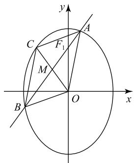

# 由一道椭圆中三角形面积问题引发的微探究

陈立刚 郑拴平(特级教师) 刘 刚

(北京市第十二中学)

在高中数学的习题教学中,如何引导学生深入探究问题,如何有效提升学生数学核心素养,数学问题微探究或许是一种有效的方法.数学问题微探究是指在教学中利用较少的时间(一两节课或是课后的十几分钟),完成一道题的解法探究或命题的推广.这在学生学习过程中,可以加深学生对内容的理解,同时,可以提高学生提出数学问题和建立模型的能力,无论是在帮助学生形成数学思想和方法方面,还是在提升学生数学学科核心素养方面都有着长远意义.

本文通过一道椭圆中三角形面积题目的展示,尝试说明如何在学习过程中实践数学问题微探究.

# 1 问题展示

题目 如图 1 所示, 已知椭圆 $E: \frac{y^{2}}{a^{2}} + \frac{x^{2}}{b^{2}} = 1$ $(a > b > 0)$ 的一个焦点为 $F_{1}(0,1)$ , 离心率为 $\frac{\sqrt{2}}{2}$ .

(1)求椭圆 E 的方程;

(2) 过点 $F_{1}$ 作斜率为 k 的直线交椭圆 E 于 A, B 两点, AB 的中点为 M. 设 O 为原点, 射线 OM 交椭圆 E 于点 C. 当 $\triangle ABC$ 与 $\triangle ABO$ 的面积相等时, 求 k 的值.

text_image

y
A
C
F₁
M
B
O
x

图1

分析 试题考查了椭

圆的标准方程及几何性质、直线与椭圆的位置关系、三角形面积等内容，重点培养学生化归与转化的数学思想方法，发展学生直观想象、数学运算、逻辑推理等核心素养，培养学生分析问题与解决问题的能力。试题解法灵活，为学生搭建了施展能力的广阔舞台，是一道有研究性学习价值的题目。

# 2 解法探究

(1)由题设得 $c = 1, \frac{c}{a} = \frac{\sqrt{2}}{2}, a^2 = b^2 + c^2$ ，解得

$a=\sqrt{2},b=1$ ,所以椭圆的方程为 $\frac{y^{2}}{2}+x^{2}=1$ .

（2）直线 $AB$ 的方程为 $y = kx + 1$ 。由 $\left\{ \begin{array}{l} y = kx + 1, \\ \frac{y^2}{2} + x^2 = 1, \end{array} \right.$ 得 $(k^2 + 2)x^2 + 2kx - 1 = 0.$

设 $A(x_{1},y_{1}),B(x_{2},y_{2})$ ，则 $x_{1} + x_{2} = \frac{-2k}{k^{2} + 2},$ $x_{1}x_{2} = \frac{-1}{k^{2} + 2},y_{1} + y_{2} = \frac{4}{k^{2} + 2}.$

方法1 因为 $\triangle ABC$ 与 $\triangle ABO$ 的面积相等，所以点 $C$ 和点 $O$ 到直线 $AB$ 的距离相等，又点 $M$ 为线段 $OC$ 的中点，所以 $AB$ 的中点 $M$ 的坐标为 $(\frac{-k}{k^2 + 2}, \frac{2}{k^2 + 2})$ ，则点 $C$ 的坐标为 $(\frac{-2k}{k^2 + 2}, \frac{4}{k^2 + 2})$ ，代入椭圆方程得 $\frac{8}{(k^2 + 2)^2} + \frac{4k^2}{(k^2 + 2)^2} = 1$ ，解得 $k = \pm \sqrt{2}$ .

方法2 同方法1可得 $AB$ 的中点 $M$ 的坐标为 $(\frac{-k}{k^2 + 2},\frac{2}{k^2 + 2})$ ，OM的方程为 $y = -\frac{2}{k} x$ ，与椭圆方程联立得 $x_{c} = \frac{\pm k}{\sqrt{k^{2} + 2}}.$ 因为点 $C$ 在射线 $OM$ 上，所以点 $C$ 与点 $M$ 横坐标同号，得到点 $C$ 的坐标为 $(\frac{-k}{\sqrt{k^2 + 2}},\frac{2}{\sqrt{k^2 + 2}})$ ，因为△ABC与△ABO的面积相等，所以点 $C$ 和点 $O$ 到直线 $AB$ 的距离相等，则 $\frac{| - k^2 - 2|}{\sqrt{k^2 + 2}} +1|\frac{|1|}{\sqrt{k^2 + 1}} = \frac{|1|}{\sqrt{k^2 + 1}}$ ，解得 $k = \pm \sqrt{2}$

方法3 因为 $\triangle ABC$ 与 $\triangle ABO$ 的面积相等，所以点 $C$ 和点 $O$ 到直线 $AB$ 的距离相等，故点 $M$ 为线段 $OC$ 的中点，即四边形 $OACB$ 为平行四边形.设 $C(x_0,y_0)$ ，因为 $\overrightarrow{OC} = \overrightarrow{OA} +\overrightarrow{OB}$ ，所以 $x_0 = x_1 + x_2 =$ $\frac{-2k}{k^2 + 2},y_0 = y_1 + y_2 = \frac{4}{k^2 + 2}$ ，将上述两式代入椭圆方程得到 $\frac{8}{(k^2 + 2)^2} +\frac{4k^2}{(k^2 + 2)^2} = 1$ ，解得 $k = \pm \sqrt{2}$

方法 1 的解题思路是由两个三角形面积相等, 转化得到点 M 为线段 OC 的中点, 利用根与系数的关系得到点 M 的坐标, 再由比例关系得到点 C 的坐标, 代入椭圆方程, 最后解得 k 值. 这种方法中规中矩, 简单易行, 属于通性通法.

方法 2 的解题思路是由根与系数的关系得到点 M 的坐标, 进而求出 OM 的方程, 与椭圆方程联立得到点 C 的坐标, 由两个三角形面积相等, 转化得到点 C 和点 O 到直线 AB 的距离相等, 利用点到直线的距离公式, 建立关于 k 的方程, 最后解得 k 值. 这种方法想法最简单直接, 但运算量相对来说较大.

方法 3 由两个三角形面积相等, 转化得到点 M 为线段 OC 的中点, 进而得到四边形 OACB 为平行四边形, 再借助向量运算得到点 C 的坐标, 代入椭圆方程, 最后得到 k 值. 向量的运用十分巧妙, 为问题的解决提供新的角度.

上述三种解法的探究从不同角度切入解决问题，各具特色，互为补充，能培养学生的发散思维，帮助学生理解问题.

解法探究是数学问题微探究的一个基本操作,通过探究题目的不同解法能加深对题目的理解、开阔解题的思路,是进一步深入探究的基础.

# 3 推论探究

在解法探究的基础上,我们可以将题目条件一般化,探求题目背后“隐情”,得到题目结论的推广.

推论 1 已知椭圆 $E: \frac{y^{2}}{a^{2}} + \frac{x^{2}}{b^{2}} = 1 (a > b > 0)$ 的一个焦点为 $F_{1}(0, c)$ ，过点 $F_{1}$ 作斜率为 k 的直线交椭圆 E 于 A, B 两点，AB 的中点为 M。设 O 为原点，射线 OM 交椭圆 E 于点 C。当 $\triangle ABC$ 与 $\triangle ABO$ 的面积相等时， $k^{2} = \frac{4c^{2} - a^{2}}{b^{2}}$ 。

证明 直线 $AB$ 的方程为 $y = kx + c$ ，由 $\left\{ \begin{array}{l} y = kx + c, \\ \frac{y^2}{a^2} + \frac{x^2}{b^2} = 1, \end{array} \right.$ 得

$$
\left(b ^ {2} k ^ {2} + a ^ {2}\right) x ^ {2} + 2 b ^ {2} c k x + b ^ {2} c ^ {2} - a ^ {2} b ^ {2} = 0.
$$

设 $A(x_{1},y_{1}),B(x_{2},y_{2})$ ，则

$$
x _ {1} + x _ {2} = \frac {- 2 b ^ {2} c k}{b ^ {2} k ^ {2} + a ^ {2}},
$$

$$
x _ {1} x _ {2} = \frac {b ^ {2} c ^ {2} - a ^ {2} b ^ {2}}{b ^ {2} k ^ {2} + a ^ {2}},
$$

$$
y _ {1} + y _ {2} = \frac {2 a ^ {2} c}{b ^ {2} k ^ {2} + a ^ {2}}.
$$

因为点 M 为 AB 的中点, 所以点 M 的坐标为 $\left(\frac{-b^{2}ck}{b^{2}k^{2}+a^{2}}, \frac{a^{2}c}{b^{2}k^{2}+a^{2}}\right)$ , 又因为 $\triangle ABC$ 与 $\triangle ABO$ 的面积相等, 所以点 C 和点 O 到直线 AB 的距离相等, 故点 M 为 OC 的中点, 则点 C 的坐标为 $\left(\frac{-2b^{2}ck}{b^{2}k^{2}+a^{2}}, \frac{2a^{2}c}{b^{2}k^{2}+a^{2}}\right)$ , 代入椭圆方程 $\frac{y^{2}}{a^{2}} + \frac{x^{2}}{b^{2}} = 1$ , 得

$$
\frac {4 a ^ {4} c ^ {2}}{a ^ {2} \left(b ^ {2} k ^ {2} + a ^ {2}\right) ^ {2}} + \frac {4 b ^ {4} c ^ {2} k ^ {2}}{b ^ {2} \left(b ^ {2} k ^ {2} + a ^ {2}\right) ^ {2}} = 1,
$$

化简得

$$
b ^ {4} k ^ {4} + \left(2 a ^ {2} b ^ {2} - 4 b ^ {2} c ^ {2}\right) k ^ {2} + a ^ {4} - 4 a ^ {2} c ^ {2} = 0,
$$

解得 $k^{2}=-\frac{a^{2}}{b^{2}}$ (舍) 或 $\frac{4c^{2}-a^{2}}{b^{2}}$ .

将 $\triangle ABC$ 与 $\triangle ABO$ 的面积相等这一条件进一步一般化, 可以得到推论2.

推论 2 已知椭圆 $E: \frac{y^{2}}{a^{2}} + \frac{x^{2}}{b^{2}} = 1 (a > b > 0)$ 的一个焦点为 $F_{1}(0, c)$ ，过点 $F_{1}$ 作斜率为 k 的直线交椭圆 E 于 A, B 两点，AB 的中点为 M。设 O 为原点，射线 OM 交椭圆 E 于点 C。当 $\triangle ABC$ 与 $\triangle ABO$ 的面积之比为 m 时， $k^{2} = \frac{(m+1)^{2}c^{2} - a^{2}}{b^{2}}$ 。

证明 直线 $AB$ 的方程为 $y = kx + c$ ，由 $\left\{ \begin{array}{l} y = kx + c, \\ \frac{y^2}{a^2} + \frac{x^2}{b^2} = 1, \end{array} \right.$ 得

$$
\left(b ^ {2} k ^ {2} + a ^ {2}\right) x ^ {2} + 2 b ^ {2} c k x + b ^ {2} c ^ {2} - a ^ {2} b ^ {2} = 0.
$$

设 $A(x_{1},y_{1}),B(x_{2},y_{2})$ ，则

$$
x _ {1} + x _ {2} = \frac {- 2 b ^ {2} c k}{b ^ {2} k ^ {2} + a ^ {2}},
$$

$$
x _ {1} x _ {2} = \frac {b ^ {2} c ^ {2} - a ^ {2} b ^ {2}}{b ^ {2} k ^ {2} + a ^ {2}},
$$

$$
y _ {1} + y _ {2} = \frac {2 a ^ {2} c}{b ^ {2} k ^ {2} + a ^ {2}}.
$$

因为点 M 为 AB 的中点, 所以点 M 的坐标为 $\left(\frac{-b^{2}ck}{b^{2}k^{2}+a^{2}}, \frac{a^{2}c}{b^{2}k^{2}+a^{2}}\right)$ . 又因为 $\triangle ABC$ 与 $\triangle ABO$ 的面积之比为 m, 所以点 C 的坐标为 $\left(\frac{-(m+1)b^{2}ck}{b^{2}k^{2}+a^{2}}, \frac{(m+1)a^{2}c}{b^{2}k^{2}+a^{2}}\right)$ , 代入椭圆方程 $\frac{y^{2}}{a^{2}} + \frac{x^{2}}{b^{2}} = 1$ , 得

$$
\frac {(m + 1) ^ {2} a ^ {4} c ^ {2}}{a ^ {2} \left(b ^ {2} k ^ {2} + a ^ {2}\right) ^ {2}} + \frac {(m + 1) ^ {2} b ^ {4} c ^ {2} k ^ {2}}{b ^ {2} \left(b ^ {2} k ^ {2} + a ^ {2}\right) ^ {2}} = 1,
$$

化简得

$$
b ^ {4} k ^ {4} + \left[ 2 a ^ {2} b ^ {2} - (m + 1) ^ {2} b ^ {2} c ^ {2} \right] k ^ {2} +
$$

$$
a ^ {4} - (m + 1) ^ {2} a ^ {2} c ^ {2} = 0,
$$

解得 $k^2 = -\frac{a^2}{b^2}$ (舍)或 $\frac{(m + 1)^2c^2 - a^2}{b^2}$ .

通过以上探究,我们发现 $\triangle ABC$ 与 $\triangle ABO$ 的面积之比是一个变量,这个比值一旦确定,那么直线AB的位置也随之确定, $\triangle ABC$ 与 $\triangle ABO$ 的面积之比与直线AB的斜率存在关联,两者的数量关系即为上述得到的 $k^{2}=\frac{(m+1)^{2}c^{2}-a^{2}}{b^{2}}$ .

推论探究是微探究的核心,通过将数字变成字母,特殊化为一般,可以发现数据背后之间的规律.

# 4 逆命题探究

我们可以换一个角度研究这个问题,置换条件结论,寻求反之是否成立,如此,可以得到这个问题的逆命题.

逆命题 已知椭圆 $E: \frac{y^2}{a^2} + \frac{x^2}{b^2} = 1 (a > b > 0)$ 的一个焦点为 $F_1(0, c)$ ，过点 $F_1$ 作斜率为 $k$ 的直线交椭圆 $E$ 于 $A, B$ 两点， $AB$ 的中点为 $M$ . 设 $O$ 为原点，射线 $OM$ 交椭圆 $E$ 于点 $C, \triangle ABC$ 与 $\triangle ABO$ 的面积之比为 $\frac{|c - \sqrt{b^2 k^2 + a^2}|}{c}$ .

证明 直线 $AB$ 的方程为 $y = kx + c$ ，由 $\left\{ \begin{array}{l} y = kx + c, \\ \frac{y^2}{a^2} + \frac{x^2}{b^2} = 1, \end{array} \right.$ 得

$$
\left(a ^ {2} + b ^ {2} k ^ {2}\right) x ^ {2} + 2 k c b ^ {2} x + b ^ {2} c ^ {2} - a ^ {2} b ^ {2} = 0.
$$

设 $A(x_{1},y_{1}),B(x_{2},y_{2})$ ，则

$$
x _ {1} + x _ {2} = \frac {- 2 b ^ {2} c k}{b ^ {2} k ^ {2} + a ^ {2}},
$$

$$
x _ {1} x _ {2} = \frac {b ^ {2} c ^ {2} - a ^ {2} b ^ {2}}{b ^ {2} k ^ {2} + a ^ {2}},
$$

$$
y _ {1} + y _ {2} = \frac {2 a ^ {2} c}{b ^ {2} k ^ {2} + a ^ {2}},
$$

由于点 M 为 AB 中点, 故点 M 的坐标为 $\left(\frac{-b^{2}ck}{b^{2}k^{2}+a^{2}}, \frac{a^{2}c}{b^{2}k^{2}+a^{2}}\right)$ , 所以直线 OM 的方程为 $y=-\frac{a^{2}}{b^{2}k}x$ , 与椭

圆的方程联立解得点 C 的坐标为 $\left(\frac{-b^{2}k}{\sqrt{b^{2}k^{2}+a^{2}}}, \frac{a^{2}}{\sqrt{b^{2}k^{2}+a^{2}}}\right)$ . $\triangle ABC$ 与 $\triangle ABO$ 的面积之比即为点 C 和点 O 到直线 AB 的距离之比，即

$$
S _ {\triangle A B C}: S _ {\triangle A B O} = \left| \frac {- b ^ {2} k ^ {2}}{\sqrt {b ^ {2} k ^ {2} + a ^ {2}}} - \frac {a ^ {2}}{\sqrt {b ^ {2} k ^ {2} + a ^ {2}}} + c \right|: c,
$$

化简得 $S_{\triangle ABC}:S_{\triangle ABO}=\frac{|c-\sqrt{b^{2}k^{2}+a^{2}}|}{c}$ .

通过探究逆命题,我们发现直线 AB 的位置一旦确定, $\triangle ABC$ 与 $\triangle ABO$ 的面积之比也随之确定.通过逆命题的研究,我们可以更深入地了解此题的动态变化过程,体会圆锥曲线问题中量与量之间的内在联系.

在数学中有些命题及其逆命题都是真命题,可以置换一些条件和结论得到新的命题,对一个问题从正、反两个角度去思考,通过探究逆命题,可以进一步提升数学思维能力.

# 5 小结

圆锥曲线是平面解析几何的核心内容，是高考重点考查的内容。微探究不仅能提升学生的直观想象、逻辑推理、数学运算核心素养，还能培养学生克服困难、勇于挑战的探究精神。本文通过对一道椭圆中三角形面积问题的微探究，尝试说明探究圆锥曲线问题的一般思路：多角度、多方法解题，由特殊到一般对问题进行一般化推理探究，对结论的逆命题进行证明，由浅入深、由表及里探究问题本质，帮助学生体会其中的转化与化归、数形结合等数学思想方法。

将微探究融入教学可以帮助学生积累数学活动经验,提升学生数学学科核心素养,增强学生创新意识、钻研精神.微探究的过程是深度学习的过程,通过积极创设探究情境,引导学生主动探究,能够启发学生用数学眼光观察世界,用数学思维思考世界,用数学语言表达世界,使学生体会探究过程中的无穷乐趣.

(完)

text_image

高中27
数理化

