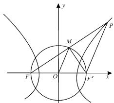
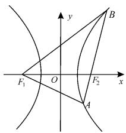
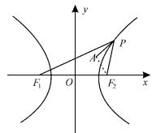
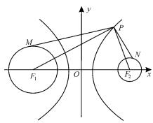

# 盘点双曲线定义的应用

# ■江苏省太仓高级中学

定义法是数学解题最基本的方法之一，巧妙利用定义，往往能起到凸显问题本质，“四两拨千斤”的作用，那么双曲线的定义有哪些应用呢？下面我们来盘点一下。

# 一、利用双曲线定义求轨迹方程

例 1 （1）已知曲线 C 上任意一点 $P(x, y)$ 满足方程 $\left|\sqrt{(x+\sqrt{3})^{2}+y^{2}}-\sqrt{(x-\sqrt{3})^{2}+y^{2}}\right|=2$ ，则曲线 C 的方程为 \_\_\_\_。

(2)已知动圆 P 过点 $N(-2,0)$ ，且与圆 $M:(x-2)^{2}+y^{2}=8$ 外切，则动圆 P 的圆心 $P(x,y)$ 的轨迹方程为 \_\_\_\_。

分析:(1)根据双曲线的定义分析求解即可得出答案。(2)设动圆 P 的半径为 r, 则 $\left|PN\right|=r$ , 由两圆外切得到 $\left|PM\right|=2\sqrt{2}+r$ , 进而得到 $\left|PM\right|-\left|PN\right|=2\sqrt{2}<\left|MN\right|=4$ , 可利用双曲线的定义求解。

解：(1) 设 $F_{1}(-\sqrt{3},0)$ ， $F_{2}(\sqrt{3},0)$ ，则 $\left|\sqrt{(x+\sqrt{3})^{2}+y^{2}}-\sqrt{(x-\sqrt{3})^{2}+y^{2}}\right|=2$ 等价于 $\left|\left|PF_{1}\right|-\left|PF_{2}\right|\right|=2<\left|F_{1}F_{2}\right|$ 。

曲线 C 为以 $F_{1}, F_{2}$ 为焦点的双曲线，且实轴长为 2，焦距为 $2\sqrt{3}$ ，所以 2a = 2, 2c = $2\sqrt{3}$ ，即 $a = 1, c = \sqrt{3}, b = \sqrt{(\sqrt{3})^{2} - 1^{2}} = \sqrt{2}$ 。

故曲线 C 的方程为 $x^{2}-\frac{y^{2}}{2}=1$ 。

(2) 圆 M 的圆心为 $(2,0)$ ，与 $N(-2,0)$ 关于原点对称。

设动圆 P 的半径为 r，则 $\left|PN\right|=r$ 。

因为与圆 $M:(x-2)^{2}+y^{2}=8$ 外切，所以 $\left|PM\right|=2\sqrt{2}+r$ ，即 $\left|PM\right|-\left|PN\right|=2\sqrt{2}<\left|MN\right|=4$ 。

故点 P 的轨迹是以 M, N 为焦点的双曲线的左支, $a = \sqrt{2}$ , c = 2, $b^{2} = c^{2} - a^{2} = 2$ 。

点 $P$ 轨迹方程为 $\frac{x^2}{2} -\frac{y^2}{2} = 1(x\leqslant$

# 李倩 陈健

$-\sqrt{2}$ ，即 $x^{2}-y^{2}=2(x\leqslant-\sqrt{2})$ 。

# 二、利用双曲线定义求与距离有关的题

例 2 (1) 已知双曲线 $\frac{x^{2}}{9}-\frac{y^{2}}{16}=1$ 上的点 P 到点 $(5,0)$ 的距离为 15，则点 P 到点 $(-5,0)$ 的距离为（）。

A. 9

B. 6

C.6或36

D. 9 或 21

(2)已知双曲线 $\frac{x^{2}}{4}-\frac{y^{2}}{5}=1$ 左焦点为F,P为双曲线右支上一点,若FP的中点在以 $|OF|$ 为半径的圆上,则点P的横坐标为\_\_\_\_。

分析:(1)利用双曲线的定义可得答案。(2)根据中位线的性质求出 $|PF'|=2|OM|=6$ ;根据双曲线的定义求出 $|PF|=10$ ,从而在Rt△MFF'中求出 $\cos\angle MFF'=\frac{5}{6}$ ,然后根据 $x_{P}+3=|PF|\cos\angle MFF'$ 即可求出答案。

解:(1)设 $F_{1}(-5,0)$ , $F_{2}(5,0)$ , $F_{1}$ , $F_{2}$ 为双曲线的焦点。则由双曲线的定义可知 $\left|\left|PF_{1}\right|-\left|PF_{2}\right|\right|=2a=6$ 。

而 $\left|PF_{2}\right|=15,\left|PF_{1}\right|\geqslant5-3=2$ ，所以 $\left|PF_{1}\right|=9$ 或21。选D。

(2) 如图 1, 设 M 为 PF 的中点, $F'$ 为双曲线的右焦点, 易知 a=2, b= $\sqrt{5}$ , c=3。

因为 M 为 PF 的中点, 所以 $\left|PF'\right|=2\left|OM\right|=2\left|OF\right|=6$ 。

text_image

y
M
P
F
O
x
F'

图1

由双曲线的定义, 知 $\left|PF\right|=\left|PF'\right|+4=10$ 。

连接 $MF'$ ，则 $\angle FMF' = \frac{\pi}{2}$ ， $|MF| = 5$ ，
所以 $\cos\angle MFF'=\frac{5}{6}$ 。

因此， $x_{P} + 3 = 10\cos \angle MFF^{\prime} = \frac{25}{3}$ ，即

$$
x _ {P} = \frac {2 5}{3} - 3 = \frac {1 6}{3} 。
$$

# 三、利用双曲线定义解焦点三角形

例 3 (1) 已知 $F_{1}, F_{2}$ 为双曲线 $\frac{x^{2}}{4}-\frac{y^{2}}{8}=1$ 的左右焦点，点 P 在双曲线上，满足 $\left|PF_{1}\right|=2\left|PF_{2}\right|$ ，求 $\triangle PF_{1}F_{2}$ 的面积为 \_\_\_\_。

(2)已知双曲线 $C:\frac{x^{2}}{a^{2}}-\frac{y^{2}}{b^{2}}=1(a>0,$ b>0)的左右焦点分别为 $F_{1},F_{2}$ ，过点 $F_{2}$ 的直线与双曲线的右支相交于A，B两点， $|BF_{1}|=2|BF_{2}|=4|AF_{2}|$ ，且 $\triangle ABF_{1}$ 的周长为10，则双曲线C的焦距为\_\_\_\_。

分析:(1)根据双曲线的定义及 $\left|PF_{1}\right|=2\left|PF_{2}\right|$ 可求出 $\left|PF_{1}\right|,\left|PF_{2}\right|,\left|F_{1}F_{2}\right|$ ，由勾股定理知 $\angle F_{1}F_{2}P=\frac{\pi}{2}$ ，即可求出三角形面积；(2)根据双曲线的定义，解得 $\left|AF_{1}\right|=3m$ ，然后根据 $\triangle ABF_{1}$ 的周长为10，解得各边长，最后根据余弦定理求解即可。

解:由题意得 $\left|PF_{1}\right|=2\left|PF_{2}\right|$ 。

又 $\left|PF_{1}\right|-\left|PF_{2}\right|=4$ ，所以 $\left|PF_{1}\right|=8$ ， $\left|PF_{2}\right|=4$ 。

又 $\left|F_{1}F_{2}\right|=4\sqrt{3}$ ，所以 $\left|PF_{1}\right|^{2}=$ $\left|PF_{2}\right|^{2}+\left|F_{1}F_{2}\right|^{2},\angle F_{1}F_{2}P=\frac{\pi}{2}$ 。

因此， $S_{\triangle PF_{1}F_{2}}=\frac{1}{2}\cdot\left|PF_{2}\right|\cdot\left|F_{1}F_{2}\right|=\frac{1}{2}\times4\times4\sqrt{3}=8\sqrt{3}$ 。

(2)如图2，设 $\left|AF_{2}\right|=m$ ，则 $\left|BF_{2}\right|=2m,\left|BF_{1}\right|=4m$ 。

根据双曲线的定义可知 $\left|BF_{1}\right|-\left|BF_{2}\right|=\left|AF_{1}\right|-\left|AF_{2}\right|$ ，故 $\left|AF_{1}\right|=3m$ 。

text_image

y
B
F₁ O F₂ x
A

图 2

于是 $m+2m+3m+4m=10$ ，解得 m=1。

在 $\triangle AF_{1}F_{2}$ 和 $\triangle BF_{1}F_{2}$ 中，由余弦定理得 $\cos\angle AF_{2}F_{1}+\cos\angle BF_{2}F_{1}=0$ ，即：

$\frac{4c^{2}+1-9}{4c}+\frac{4c^{2}+4-16}{8c}=0,$ 解得 $c=\frac{\sqrt{21}}{3}$ 。

可得双曲线的焦距为 $\frac{2\sqrt{21}}{3}$ 。

# 四、利用双曲线定义求线段的和、差及与焦半径有关的代数式的最值

例 4 （1）如图 3，已知 $F_{1}$ 是双曲线 $\frac{x^{2}}{16}-\frac{y^{2}}{9}=1$ 的左焦点， $A(4,4)$ ，P 是双曲线右支上的动点，则 $\left|PF_{1}\right|+\left|PA\right|$ 的最小值为 \_\_\_\_。

  
图3

(2)如图4， $P$ 为双曲线 $x^{2} - \frac{y^{2}}{15} = 1$ 右支

上一点，M, N 分别是圆 $(x+4)^{2} + y^{2} = 4$ 和 $(x - 4)^{2} + y^{2} = 1$ 上的点，则 $|PM| - |PN|$ 的最大值为 \_\_\_\_。

text_image

M
F₁
O
P
N
F₂
x
y

图4

(3)已知双曲线 $C:\frac{x^{2}}{a^{2}}-$

$\frac{y^{2}}{b^{2}}=1(a>0,b>0)$ 的渐近线方程为 $y=\pm\frac{1}{2}x,F_{1}(-\sqrt{5},0),F_{2}(\sqrt{5},0)$ 分别为双曲线C的左右焦点，若动点P在双曲线C的右支上，则 $\frac{|PF_{1}|^{2}}{|PF_{2}|}$ 的最小值是\_\_\_\_。

分析:(1)利用双曲线定义将 $\left|PF_{1}\right|$ 转化,用P到右焦点的距离表示,点A与右焦点位于双曲线右支异侧,利用两点之间线段最短可得最小值。(2)由题意及圆的性质知 $\left|PM\right|_{\max}=\left|PF_{1}\right|+2,\left|PN\right|_{\min}=\left|PF_{2}\right|-1$ ,结合双曲线定义求 $\left|PM\right|-\left|PN\right|$ 的最大值。(3)首先根据双曲线的渐近线方程和焦点坐标,求出双曲线的标准方程;再设 $\left|PF_{2}\right|=m$ ,根据双曲线的定义可知 $\left|PF_{1}\right|=4+m$ ,从而利用基本不等式求出 $\frac{\left|PF_{1}\right|^{2}}{\left|PF_{2}\right|}$ 的最小值。

解:(1)由题意知,a=4,b=3,c=5。

设双曲线的右焦点为 $F_{2}$ ，由 P 是双曲线右支上的点，则 $\left|PF_{1}\right|-\left|PF_{2}\right|=2a=8$ 。

故 $\left|PF_{1}\right|+\left|PA\right|=8+\left|PF_{2}\right|+\left|PA\right|\geqslant8+\left|AF_{2}\right|$ ，当且仅当A,P, $F_{2}$ 三点共线时，等号成立。

又 $A(4,4), F_2(5,0)$ ，则 $|AF_2| = \sqrt{(4 - 5)^2 + (4 - 0)^2} = \sqrt{17}$ 。

(下转第36页)

内一定点,经过点 P 引一条弦交椭圆于 A,B 两点,且此弦被点 P 平分,求此弦所在的直线方程。

命题意图:有关弦的中点问题涉及弦的中点与直线的斜率问题,一般考虑“点差法”,构造出 $k_{AB}=\frac{y_{1}-y_{2}}{x_{1}-x_{2}}$ 和 $x_{1}+x_{2}, y_{1}+y_{2}$ , 整体代换,求出中点或斜率,体现“设而不求”的思想。

解析:(方法一)易知此弦所在直线的斜率存在,所以设其方程为 $y-1=k(x-1)$ , $A(x_{1},y_{1})$ , $B(x_{2},y_{2})$ 。

联立 $\left\{\begin{aligned}y-1&=k(x-1),\\ \frac{x^{2}}{4}&+\frac{y^{2}}{2}=1,\end{aligned}\right.$ 消去 y 得，

$$
(2 k ^ {2} + 1) x ^ {2} - 4 k (k - 1) x + 2 \left(k ^ {2} - 2 k - 1\right) = 0 。
$$

则 $x_{1} + x_{2} = \frac{4k(k - 1)}{2k^{2} + 1}$ 。

又 $x_{1} + x_{2} = 2$ ，故 $\frac{4k(k - 1)}{2k^2 + 1} = 2$ ，解得 $k = -\frac{1}{2}$ 。

故此弦所在的直线方程为 $y - 1 = -\frac{1}{2} (x - 1)$ ，即 $x + 2y - 3 = 0$ 。

(方法二)易知此弦所在直线的斜率存在,所以设斜率为 $k, A(x_{1}, y_{1}), B(x_{2}, y_{2})$ 。

则 $\frac{x_{1}^{2}}{4}+\frac{y_{1}^{2}}{2}=1$ 。①

$$
\frac {x _ {2} ^ {2}}{4} + \frac {y _ {2} ^ {2}}{2} = 1 。 \tag {②}
$$

①—②得：

$$
\frac {(x _ {1} + x _ {2}) (x _ {1} - x _ {2})}{4} + \frac {(y _ {1} + y _ {2}) (y _ {1} - y _ {2})}{2} = 0 。
$$

因为 $x_{1} + x_{2} = 2, y_{1} + y_{2} = 2$ ，所以 $\frac{x_{1}-x_{2}}{2}+y_{1}-y_{2}=0,k=\frac{y_{1}-y_{2}}{x_{1}-x_{2}}=-\frac{1}{2}$

故此弦所在的直线方程为 $y - 1 = -\frac{1}{2} (x - 1)$ ，即 $x + 2y - 3 = 0$ 。

素养点评:处理中点弦问题常用的两种方法。

1. 点差法。

设出弦的两端点坐标后,代入圆锥曲线方程,并将两式相减,式中含有 $x_{1}+x_{2}, y_{1}+y_{2}, \frac{y_{1}-y_{2}}{x_{1}-x_{2}}$ 三个未知量,这样就直接联系了中点和直线的斜率,借用中点公式即可求得斜率。

2. 根与系数的关系。

联立直线与圆锥曲线的方程得到方程组,化为一元二次方程后由根与系数的关系求解。

中点弦问题常用的两种求解方法各有弊端:根与系数的关系在解题过程中易产生漏解,需关注直线的斜率;点差法在确定范围方面略显不足。

(责任编辑 徐利杰)

(上接第34页)

所以， $\left|PF_{1}\right|+\left|PA\right|$ 的最小值为 $8+\sqrt{17}$ 。

(2) 双曲线的两个焦点 $F_{1}(-4,0)$ ， $F_{2}(4,0)$ 分别为两圆的圆心，两圆的半径分别为 $r_{1}=2, r_{2}=1$ 。

易知 $\left|PM\right|_{\max}=\left|PF_{1}\right|+2,\left|PN\right|_{\min}=\left|PF_{2}\right|-1$ ，故 $\left|PM\right|-\left|PN\right|$ 的最大值为 $\left|PF_{1}\right|+2-(\left|PF_{2}\right|-1)=\left|PF_{1}\right|-\left|PF_{2}\right|+3=2+3=5$ 。

(3) 因为双曲线的渐近线方程为 $y = \pm \frac{1}{2} x$ ，焦点坐标为 $F_{1}(-\sqrt{5}, 0)$ ， $F_{2}(\sqrt{5}, 0)$ ，所以 $\frac{b}{a} = \frac{1}{2}$ ， $c = \sqrt{5}$ ，即 a = 2, b = 1。

因此，双曲线方程为 $\frac{x^{2}}{4}-y^{2}=1$ 。

设 $\left|PF_{2}\right|=m$ ，则 $\left|PF_{1}\right|=4+m$ ，且 $m\geqslant\sqrt{5}-2$ 。

$$
\frac {\left| P F _ {1} \right| ^ {2}}{\left| P F _ {2} \right|} = \frac {(4 + m) ^ {2}}{m} = \frac {1 6}{m} + m + 8 \geqslant
$$

$2\sqrt{\frac{16}{m}\cdot m}+8=16$ ，当且仅当 $\frac{16}{m}=m$ ，即m=4时等号成立。

所以 $\frac{|PF_{1}|^{2}}{|PF_{2}|}$ 的最小值是16。

(责任编辑 徐利杰)