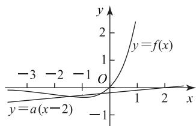

# 直击含参不等式恒成立或有解问题

杨亚刚

(甘肃省甘谷县第四中学)

含参不等式恒成立或有解问题, 是各类考试中的“常客”, 这类问题通常可以转化为函数问题来解决, 如 $f(x) \geqslant m$ 恒成立, 可以转化为 $f_{\min}(x) \geqslant m$ ; 存在实数 x, 使得 $f(x) \geqslant m$ 成立, 可以转化为 $f_{\max}(x) \geqslant m$ . 有时这类问题还可以转化为两个函数的图像位置关系来解决. 那么, 求解这类问题有哪几种视角呢? 本文举例说明.

# 1 同构视角

例1 已知对任意 $x_{1}, x_{2} \in (0, +\infty)$ ，且当 $x_{1} <$ $x_{2}$ 时，都有 $\frac{a(\ln x_{2}-\ln x_{1})}{x_{2}-x_{1}}<1+\frac{1}{x_{1}x_{2}}$ ，则 a 的取值范围是 \_\_\_\_.

# 解析

因为对任意 $x_{1}, x_{2} \in (0, +\infty)$ ，且当 $x_{1} < x_{2}$ 时， $\frac{a(\ln x_{2}-\ln x_{1})}{x_{2}-x_{1}}<1+\frac{1}{x_{1}x_{2}}$ ，所以$a\ln x_{2} - a\ln x_{1} <   x_{2} - x_{1} + \frac{x_{2} - x_{1}}{x_{1}x_{2}}$ ，则 $a\ln x_2 -$ $a\ln x_{1}<x_{2}-x_{1}+\frac{1}{x_{1}}-\frac{1}{x_{2}}$ ，即 $a\ln x_{2}-x_{2}+\frac{1}{x_{2}}<$ $a\ln x_{1}-x_{1}+\frac{1}{x_{1}}.$ 令 $f(x)=a\ln x-x+\frac{1}{x}(x\in(0,$ $+\infty)$ ，则当 $x_{1}<x_{2}$ 时， $f(x_{2})<f(x_{1})$ ，所以 $f(x)$ 在 $(0, +\infty)$ 上单调递减，则 $f'(x) = -\frac{x^2 - ax + 1}{x^2} \leqslant 0$ 在 $(0, +\infty)$ 上恒成立，故 $x^{2} - ax + 1 \geqslant 0$ 在 $(0, +\infty)$ 上恒成立，即 $a \leqslant x + \frac{1}{x}$ 在 $(0, +\infty)$ 上恒成立. 又 $x +$ $\frac{1}{x}\geqslant2\sqrt{x\cdot\frac{1}{x}}=2$ ，当且仅当 $x=\frac{1}{x}$ ，即x=1时，等号成立,则 a 的取值范围是 $(-∞,2]$ .

求解本题的关键是将式子变形得到 $a\ln x_{2}-$ $x_{2} + \frac{1}{x_{2}} < a\ln x_{1} - x_{1} + \frac{1}{x_{1}}$ 对任意 $x_{1}, x_{2} \in$ $(0, + \infty)$ 且 $x_{1} <   x_{2}$ 恒成立，从而将问题转化为函数在区间上单调递减求参数问题.

# 2 隐零点视角

例2 若不等式 $x\mathrm{e}^x - x + a \geqslant \ln x - 2$ 恒成立，则实数 a 的取值范围为 \_\_\_\_.

将不等式移项可得 $a \geqslant \ln x - 2 - x\mathrm{e}^x + x$ 。设$f(x) = \ln x - 2 - x\mathrm{e}^{x} + x (x > 0)$ ，则$f^{\prime}(x) = -(\mathrm{e}^{x} + x\mathrm{e}^{x}) + 1 + \frac{1}{x} = (x + 1)\cdot \frac{1 - x\mathrm{e}^{x}}{x}.$ 设$g(x)=1-x\mathrm{e}^{x}(x>0)$ ，则 $g'(x)=-(\mathrm{e}^{x}+x\mathrm{e}^{x})<0$ 所以函数 $g(x)$ 在 $(0, +\infty)$ 上单调递减. 因为 $g(0) = 1, g(1) = 1 - \mathrm{e} < 0$ ，故存在 $x_0 \in (0, 1)$ ，使得

$$
g \left(x _ {0}\right) = 0 \Rightarrow 1 - x _ {0} \mathrm{e} ^ {x _ {0}} = 0 \Rightarrow \mathrm{e} ^ {x _ {0}} = \frac {1}{x _ {0}}, \quad ①
$$

当 $0 < x < x_0$ 时， $f'(x) > 0, f(x)$ 单调递增；当 $x > x_0$ 时， $f'(x) < 0, f(x)$ 单调递减，故

$$
f _ {\max} (x) = f \left(x _ {0}\right) = - x _ {0} \mathrm{e} ^ {x _ {0}} + x _ {0} + \ln x _ {0} - 2,
$$

将式①代入可得

$$
f _ {\max} (x) = - x _ {0} \cdot \frac {1}{x _ {0}} + x _ {0} + \ln \frac {1}{\mathrm{e} ^ {x _ {0}}} - 2 = - 3,
$$

所以 $a \geqslant -3$ ，则实数 a 的取值范围为 $[-3, +\infty)$ .

# 点评

对于隐零点问题,可求导后通过分析特殊值找到隐零点的大概区间,再以隐零点为分界点分析函数的单调性.

# 3 双层复合视角

例3 若不等式 $a\mathrm{e}^{x + 2}\geqslant \ln \frac{x}{a} -2(x\in (0,\mathrm{e}])$ 恒成立,则实数 a 的取值范围是 \_\_\_\_.

析 由 $a\mathrm{e}^{x + 2}\geqslant \ln \frac{x}{a} -2$ ，可得 $\mathrm{e}^{x + \ln a + 2}\geqslant \ln x-$ $\ln a - 2$ ，即 $\mathrm{e}^{x + \ln a + 2} + x + \ln a + 2\geqslant \mathrm{e}^{\ln x} + \ln x.$ 设$f(x) = \mathrm{e}^{x} + x$ ，则 $f(x + \ln a + 2)\geqslant f(\ln x)$ .因为函数 $y=e^{x}$ , y=x 在 R 上都单调递增, 所以函数 $f(x)$ 在 R 上单调递增, 则 $x + \ln a + 2 \geqslant \ln x$ , 故 $\ln a \geqslant$ $\ln x - x - 2.$ 设 $g(x) = \ln x - x - 2(x\in (0,\mathrm{e}])$ ，则

$g'(x)=\frac{1-x}{x}$ . 当 $x\in(0,1)$ 时， $g'(x)>0$ ， $g(x)$ 单调递增，当 $x\in[1,e]$ 时， $g'(x)<0$ ， $g(x)$ 单调递减，所以 $g_{\max}(x)=g(1)=-3$ ，则 $\ln a\geqslant-3$ ，所以 $a\geqslant\frac{1}{e^{3}}$ ，故实数 a 的取值范围是 $\left[\frac{1}{e^{3}},+\infty\right)$ .

# 点评

求解这类问题通常要把不等式转化为复合函数问题,一般需构造两个函数:内层函数和外层函数,进而通过研究这两个函数的单调性来解决问题.

# 4 换元视角

例4 已知不等式 $\mathrm{e}^{x - \frac{1}{a} + 1} - 2ax \geqslant b$ 对任意的实数 x 恒成立, 则 $\frac{b}{a}$ 的最大值为 \_\_\_\_.

析 令 $t = x - \frac{1}{a} + 1$ ，则 $x = t - 1 + \frac{1}{a}$ ，不等式可化为 $\mathrm{e}^t - 2a(t - 1 + \frac{1}{a}) \geqslant b$ ，即 $\mathrm{e}^t - 2at + 2a - b - 2 \geqslant 0$ .

设 $f(t) = \mathrm{e}^t - 2at + 2a - b - 2$ ，则 $f'(t) = \mathrm{e}^t - 2a$ . 当 $a \leqslant 0$ 时， $f'(t) > 0, f(t)$ 在 $\mathbf{R}$ 上单调递增，不符合题意. 当 $a > 0$ 时，由 $f'(t) = \mathrm{e}^t - 2a = 0$ ，可得 $t = \ln(2a)$ . 当 $t < \ln(2a)$ 时， $f'(t) < 0, f(t)$ 单调递减；当 $t > \ln(2a)$ 时， $f'(t) > 0, f(t)$ 单调递增，则当 $t = \ln(2a)$ 时， $f_{\min}(t) = f(\ln(2a)) = 4a - 2a\ln(2a) - b - 2$ . 因为 $f(t) \geqslant 0$ 对任意的实数 $x$ 恒成立，故 $f_{\min}(t) = f(\ln(2a)) = 4a - 2a\ln(2a) - b - 2 \geqslant 0$ ，即 $b \leqslant 4a - 2a\ln(2a) - 2$ ，则

$$
\frac {b}{a} \leqslant 4 - 2 \ln (2 a) - \frac {2}{a}.
$$

令 $g(a) = 4 - 2\ln (2a) - \frac{2}{a} (a > 0)$ ，则

$$
g ^ {\prime} (a) = - \frac {2}{a} + \frac {2}{a ^ {2}} = \frac {2 (1 - a)}{a ^ {2}}.
$$

当 $0 < a < 1$ 时， $g'(a) > 0, g(a)$ 单调递增；当 $a > 1$ 时， $g'(a) < 0, g(a)$ 单调递减，故 $g_{\max}(a) = g(1) = 2 - 2 \ln 2$ ，即 $\frac{b}{a} \leqslant 2 - 2 \ln 2$ .

综上, $\frac{b}{a}$ 的最大值为 $2-2\ln2$ .

# 点评

本题主要考查由不等式恒成立求解参数取值范围问题,属于难题.解题的关键在于通过

令 $t = x - \frac{1}{a} + 1$ 进行换元，将不等式化转成 $\mathrm{e}^t - 2at + 2a - b - 2 \geqslant 0.$ 设函数 $f(t) = \mathrm{e}^t - 2at + 2a - b - 2$ ，分析得到 $f_{\min}(t) = 4a - 2a\ln(2a) - b - 2 \geqslant 0$ ，然后分离出 $\frac{b}{a} \leqslant 4 - 2\ln(2a) - \frac{2}{a}$ ，将问题转化为求函数 $g(a) = 4 - 2\ln(2a) - \frac{2}{a} (a > 0)$ 的最大值即得.

# 5 数形结合视角

例 5 已知 $a \in R$ ，关于 x 的不等式 $a(x-2)$ .$e^{-x}-x>0$ 的解集中有且仅有1个负整数，则a的取值范围是\_\_\_\_.

原不等式可化为 $a(x - 2) > x\mathrm{e}^x$ .令 $f(x) =$ $x\mathrm{e}^{x},f^{\prime}(x) = (x + 1)\mathrm{e}^{x}.$ 当 $x <   - 1$ 时，$f'(x)<0,f(x)$ 单调递减；当x>-1时， $f'(x)>0$ ， $f(x)$ 单调递增，所以 $f_{\min}(x)=f(-1)=-\frac{1}{e}$ ，且当 $x\to-\infty$ 时， $f(x)\to0$ ，当 $x\to+\infty$ 时， $f(x)\to+\infty$ 。在同一平面直角坐标系中，作出 $y=f(x)$ 与 $y=a(x-2)$ 的图像，如图1所示。

line

| x    | y = f(x) | y = a(x - 2) |
| ---- | -------- | ------------ |
| -3   | -1       | -1           |
| -2   | 0        | -1           |
| -1   | 1        | -1           |
| 0    | 2        | 0            |
| 1    | 3        | 0            |
| 2    | 4        | 0            |

图1

由图可知,满足题意的整数解为-1,此时应满足 $\left\{\begin{aligned}-2\mathrm{e}^{-2}&\geqslant a(-2-2),\\-\mathrm{e}^{-1}&<a(-1-2),\\0&>-2a,\end{aligned}\right.$ 解得 $\frac{1}{2e^{2}}\leqslant a<\frac{1}{3e}$ ，故 a 的取值范围是 $\left[\frac{1}{2e^{2}},\frac{1}{3e}\right)$ .

# 点评

本题考查含参不等式问题,解题的关键是将不等式适当变形,转化为两个函数的交点问题.

此类问题本质上是考查导数的应用和函数图像与性质.因此,求解这类问题的基本方法是转化,基本思想是函数思想,函数的单调性与最值是破解这类问题的“撒手锏”.

(完)