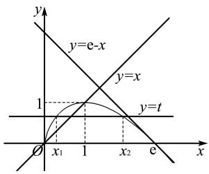

# 破解极值点偏移问题的几种新思路

# 康同芳

(安徽省太和中学, 安徽 阜阳 236600)

摘 要: 导数试题中的极值点偏移问题的常规解题思路是构造对称差函数. 文章结合一道经典的极值点偏移问题, 从同构法、不等式放缩、对数平均不等式和二次函数偏移构造等新思路来探索破解极值点偏移问题之法.

关键词: 导数压轴题; 极值点偏移问题; 新思路

中图分类号：G632

文献标识码:A

极值点偏移问题是高考的热点和难点问题,常常作为压轴题出现.常规的解法是构造对称差函数,但遇到复杂的函数时,其对称差函数的导数比较复杂.经过探究,笔者给出破解极值点偏移问题的几种新思路,其思路简明易懂且证明过程简洁.

# 1 极值点偏移问题

题目 已知函数 $f(x)=x(1-\ln x)$ .

(1) 讨论 $f(x)$ 的单调性;  
(2) 设 $a, b$ 为两个不相等的正数, 且 $b \ln a - a \ln b = a - b$ , 证明: $2 < \frac{1}{a} + \frac{1}{b} < e$ .

# 2 试题分析

试题以对数型函数为载体,考查导数在判断函数单调性和证明不等式问题中的应用.主要涉及导数运算法则、函数单调性、零点以及对数函数的基本性质等知识点,综合考查考生的逻辑推理、数学运算等数学学科核心素养.

第(2)问是以证明不等式为载体的“极值点偏移”问题,是较为经典的导数压轴问题.对于式子文章编号:1008-0333(2024)36-0024-03

“ $b\ln a - a\ln b = a - b$ ”, 先将两个参数 a, b 分离至等式两侧, 得到 $\frac{1}{a} + \frac{1}{a}\ln a = \frac{1}{b} + \frac{1}{b}\ln b$ . 考虑到题目条件中函数结构为 $f(x) = x - x\ln x$ , 故将等式同构转化为 $\frac{1}{a} - \frac{1}{a}\ln \frac{1}{a} = \frac{1}{b} - \frac{1}{b}\ln \frac{1}{b}$ , 即 $f(\frac{1}{a}) = f(\frac{1}{b})$ .

# 3 破解极值点偏移问题的新思路

(1) 由题意可知, 函数定义域为 $(0, +\infty)$ , $f'(x) = -\ln x$ . 令 $f'(x) > 0$ , 则 $0 < x < 1$ ; 令 $f'(x) < 0$ , 则 $x > 1$ . 故 $f(x)$ 在 $(0, 1)$ 上单调递增, 在 $(1, +\infty)$ 上单调递减.

第(2)问是“极值点偏移”问题,下面作重点探究.

(2) 由 $b \ln a - a \ln b = a - b$ 得 $\frac{1}{a} - \frac{1}{a} \ln \frac{1}{a} = \frac{1}{b} - \frac{1}{b} \ln \frac{1}{b}$ . 令 $x_{1} = \frac{1}{a}, x_{2} = \frac{1}{b}, x_{1} \neq x_{2}$ , 则 $f(x_{1}) = f(x_{2})$ . 不妨设 $x_{1} < x_{2}$ , 由 (1) 可知 $f'(1) = 0$ , 且有 $f(\mathrm{e}) = 0$ . 易知, $0 < x_{1} < 1 < x_{2} < \mathrm{e}$ .

于是原不等式等价于 $2 < x_{1} + x_{2} < \mathrm{e}^{[1]}$ .

证法1 （同构法）因为 $x_{1} - x_{1}\ln x_{1} = x_{2} -$

收稿日期:2024-09-25

作者简介:康同芳(1990.2—),女,安徽省阜阳市人,硕士,中学一级教师,从事高中数学教学研究.

$x_{2}\ln x_{2}$ ，所以 $\frac{x_2\ln x_2 - x_1\ln x_1}{x_2 - x_1} = 1,0 <   x_1 <   1 <   x_2 <   \mathrm{e.}$ 要证 $x_{1} + x_{2} > 2$ ，只需证 $x_{1} + x_{2} > 2\times \frac{x_{2}\ln x_{2} - x_{1}\ln x_{1}}{x_{2} - x_{1}}.$

即证 $x_{2}^{2} - 2x_{2}\ln x_{2} > x_{1}^{2} - 2x_{1}\ln x_{1}$

令 $g(x)=x^{2}-2x\ln x$ ，即证 $g(x_{2})>g(x_{1})$ 。又 $g'(x)=2x-2\ln x-2=2(x-1-\ln x)\geqslant0$ ，所以 $g(x)$ 在 $(0,+\infty)$ 上单调递增，则 $g(x_{2})>g(x_{1})$ 。

要证 $x_{1} + x_{2} < \mathrm{e}$ , 需证 $x_{1} + x_{2} - \mathrm{e} < 0$ . 又 $0 < x_{1} < 1 < x_{2} < \mathrm{e}$ , 只需证 $(x_{2} - x_{1})(x_{1} + x_{2} - \mathrm{e}) < 0$ . 所以 $x_{2}^{2} - \mathrm{e}x_{2} < x_{1}^{2} - \mathrm{e}x_{1}$ . 即证 $x_{2} - \mathrm{e} < \frac{x_{1}}{x_{2}} (x_{1} - \mathrm{e})$ .

因为 $\frac{x_1}{x_2} = \frac{1 - \ln x_2}{1 - \ln x_1}$ , 所以需证 $x_2 - \mathrm{e} < \frac{1 - \ln x_2}{1 - \ln x_1} \cdot (x_1 - \mathrm{e})$ . 即证 $\frac{x_2 - \mathrm{e}}{1 - \ln x_2} < \frac{x_1 - \mathrm{e}}{1 - \ln x_1}$ .

构造函数 $h(x) = \frac{x - \mathrm{e}}{1 - \ln x} (0 < x < \mathrm{e})$ ，则

$$
h ^ {\prime} (x) = \frac {2 x - \mathrm{e} - x \ln x}{x (1 - \ln x) ^ {2}}.
$$

记 $t(x) = 2x - \mathrm{e} - x\ln x(0 < x < \mathrm{e})$ ，则 $t^{\prime}(x) = 2 - 1 - \ln x = 1 - \ln x > 0.$ 所以 $t(x)$ 在 $(0,\mathrm{e})$ 上单调递增.所以 $t(x) < t(\mathrm{e}) = 0.$ 所以 $h(x)$ 在 $(0,\mathrm{e})$ 上单调递减.故 $h(x_{2}) = \frac{x_{2} - \mathrm{e}}{1 - \ln x_{2}} < \frac{x_{1} - \mathrm{e}}{1 - \ln x_{1}} = h(x_{1}).$

证法2（不等式放缩）记函数 $g(x) = \ln x - \frac{1}{2} (x - \frac{1}{x})$ ，则 $g'(x) = \frac{-(x - 1)^2}{2x^2} \leqslant 0$ . 所以 $g(x)$ 在 $(0, +\infty)$ 上单调递增. 又因为 $g(1) = 0$ ，所以 $\ln x < \frac{1}{2} (x - \frac{1}{x})(x > 1), \ln x > \frac{1}{2} (x - \frac{1}{x})(0 < x < 1)$ .

所以 $\ln x_{2} < \frac{1}{2}(x_{2} - \frac{1}{x_{2}}), \ln x_{1} > \frac{1}{2}(x_{1} - \frac{1}{x_{1}})$ .

即 $x_{2}\ln x_{2}<\frac{1}{2}(x_{2}^{2}-1)$ , $x_{1}\ln x_{1}>\frac{1}{2}(x_{1}^{2}-1)$ .

所以 $x_{2}\ln x_{2}-x_{1}\ln x_{1}=x_{2}-x_{1}<\frac{1}{2}(x_{2}^{2}-1)-$ $\frac{1}{2}(x_{1}^{2}-1)=\frac{(x_{2}-x_{1})(x_{1}+x_{2})}{2}.$

所以 $x_{1} + x_{2} > 2$ .

因为 $x_{1}-x_{1}\ln x_{1}>x_{1}$ ,

所以 $x_{1} + x_{2} <   x_{1} - x_{1}\ln x_{1} + x_{2} = 2x_{2} - x_{2}\ln x_{2}.$

记 $h(x) = 2x - x\ln x(1 < x < \mathrm{e})$ ，则 $h^{\prime}(x) = 1-$ $\ln x$ ，所以 $h(x)$ 在 $(1,\mathrm{e})$ 上单调递增.所以 $h(x) < h(\mathrm{e}) = \mathrm{e}$ .故 $h(x_{2}) = 2x_{2} - x_{2}\ln x_{2} <   \mathrm{e}.$ 所以 $x_{1} + x_{2} <   \mathrm{e}.$

点评 不等式放缩法,借助重要的函数不等式“ $\ln x<\frac{1}{2}(x-\frac{1}{x})(x>1)$ , $\ln x>\frac{1}{2}(x-\frac{1}{x})(0<x<1)$ ”, 对对数部分进行放缩, 大大简化了左侧不等式的证明过程. 证明右侧时, 借助变量自身范围进行放缩, 将二元问题转化为一元问题, 利用函数的最值证明.

证法 3 （对数平均不等式 + 切割线放缩）

记 $f(x_{1})=f(x_{2})=t\in(0,1)$ ，则 $x_{1}-x_{1}\ln x_{1}=x_{2}-x_{2}\ln x_{2}=t.$ 所以 $1-\ln x_{1}=\frac{t}{x_{1}},1-\ln x_{2}=\frac{t}{x_{2}}.$

两式相减, 得 $\ln x_{2}-\ln x_{1}=\frac{t(x_{2}-x_{1})}{x_{1}x_{2}}$ .

所以 $\frac{x_2 - x_1}{\ln x_2 - \ln x_1} = \frac{x_1x_2}{t} >\sqrt{x_1x_2}.$

两式相加, 得 $2 - \ln x_{1}x_{2} = t \cdot \frac{x_{1} + x_{2}}{x_{1}x_{2}}$ .

所以 $x_{1} + x_{2} = \frac{x_{1}x_{2}}{t}(2 - \ln x_{1}x_{2}) > \sqrt{x_{1}x_{2}}(2 - \ln x_{1}x_{2})$ 恒成立.

记函数 $g(x)=2x-2x\ln x(0<x<\sqrt{e})$ ，所以 $g'(x)=-2\ln x$ 。所以 $g(x)$ 在 $(0,1)$ 上单调递增， $(1,\sqrt{\mathrm{e}})$ 上单调递减。所以 $g(x)\leqslant g(1)=2$ 。所以 $g(\sqrt{x_{1}x_{2}})=\sqrt{x_{1}x_{2}}(2-\ln x_{1}x_{2})\leqslant2$ 。所以 $x_{1}+x_{2}>2$ 。

如图1所示,作直线 y = x 和 y = e - x 分别与 $y = t (0 < t < 1)$ 相交, 易证明 $\mathrm{e} - x > f(x)$ 对 $\forall x \in (1, \mathrm{e})$ 恒成立, 且 $x < f(x)$ 对 $\forall x \in (0, 1)$ 恒成立. 又因为 $f(x_{1}) = f(x_{2}) = t$ , 故 $\mathrm{e} - x_{2} > f(x_{2}) = t, x_{1} < f(x_{1}) = t$ . 所以 $x_{1} + x_{2} < t + e - t = e$ .

点评 对数平均不等式 $\sqrt{x_{1}x_{2}} < \frac{x_{2}-x_{1}}{\ln x_{2}-\ln x_{1}} < \frac{x_{1}+x_{2}}{2}(x_{1}<x_{2})$ 处理极值点偏移问题的本质是将二元问题转化为一元问题, 借助“消元”的思想处理. 极值点的偏移问题多数与指数或对数有关, 利用对数平均不等式转化的关键有以下几步:(1)根据 $f(x_{1})=f(x_{2})$ 建立等式;(2)如果含有参数,则消参;如果等式中含有指数式,则两边取对数;(3)通过恒等变形转化为对数平均 $\frac{x_{1}-x_{2}}{\ln x_{1}-\ln x_{2}}$ ,利用对数平均不等式求解.

text_image

y
y=e-x
y=x
1
y=t
O x₁ 1 x₂ e x

图1 证法3图

证法 4 （二次函数偏移构造）令 $g(x)=1-\frac{1}{2}(x-1)^{2}, F(x)=f(x)-g(x)=x-x\ln x+\frac{1}{2}(x-1)^{2}-1$ ，则 $F(1)=0, F'(x)=x-1-\ln x$ 。记 $t(x)=F'(x)=x-1-\ln x$ ，则 $t'(x)=\frac{x-1}{x}$ 。故 $t(x)$ 在 $(0,1)$ 上单调递减， $(1,+\infty)$ 上单调递增。所以 $t(x)\geqslant t(1)=0$ 。故 $F(x)$ 在 $(0,+\infty)$ 上单调递增。因此，当 $x\in(0,1)$ 时， $F(x)=f(x)-g(x)<0$ ，当 $x\in(1,+\infty)$ 时， $F(x)=f(x)-g(x)>0$ 。又 $f(x_{1})=f(x_{2})$ ，所以 $g(x_{2})<f(x_{2})=f(x_{1})<g(x_{1})$ 。

即 $-\frac{1}{2} (x_2 - 1)^2 + 1 < -\frac{1}{2} (x_1 - 1)^2 + 1.$

化简整理得 $x_{1} + x_{2} > 2$ .

令 $h(x)=\frac{1}{1-\mathrm{e}}x(x-\mathrm{e})$ , $G(x)=f(x)-h(x)=x\left[\frac{1}{\mathrm{e}-1}(x-1)-\ln x\right]$ ，则 $G(1)=0$ 。记 $m(x)=\frac{1}{\mathrm{e}-1}\cdot(x-1)-\ln x(0<x<\mathrm{e})$ ，则 $m'(x)=\frac{1}{\mathrm{e}-1}-\frac{1}{x}$ 。故 $m(x)$ 在 $(0,\mathrm{e}-1)$ 上单调递减， $(\mathrm{e}-1,\mathrm{e})$ 上单调递增。又 $m(1)=0$ , $m(\mathrm{e})=0$ ，故 $m(x)$ 在 $(0,\mathrm{e}-1)$ 上为正，在 $(\mathrm{e}-1,\mathrm{e})$ 上为负。

因此当 $x \in (0,1)$ 时， $G(x) = f(x) - h(x) > 0$ ，当 $x \in (1,\mathrm{e})$ 时， $G(x) = f(x) - h(x) < 0$ . 又 $f(x_{1}) = f(x_{2})$ ，所以 $h(x_{2}) > f(x_{2}) = f(x_{1}) > h(x_{1})$ .

即 $\frac{1}{1 - \mathrm{e}} x_2(x_2 - \mathrm{e}) > \frac{1}{1 - \mathrm{e}} x_1(x_1 - \mathrm{e})$ .

化简整理得 $x_{1} + x_{2} <   \mathrm{e}.$

点评 顶点偏移构造基本步骤: (1) 求出 $f(x)$ 极值点坐标 $(x_{0}, f(x_{0}))$ ; (2) 构造二次函数 $g(x) = m(x - x_{0})^{2} + f(x_{0})$ ; (3) 设 $h(x) = f(x) - g(x)$ ，利用 $h''(x_{0}) = 0$ 求出 $m = \frac{1}{2} f''(x_{0})$ （前三步是分析过程，考试时不必写出，直接给出 $g(x)$ 的表达式即可）；(4) 判断函数 $h(x)$ 的正负；(5) 根据函数 $h(x)$ 的正负和 $f(x_{1}) = f(x_{2})$ 得到 $g(x_{1}) - g(x_{2}) > 0$ 或 $g(x_{1}) - g(x_{2}) < 0$ ; (6) 对二次函数进行因式分解可得 $x_{1} + x_{2} > 2x_{0}$ 或 $x_{1} + x_{2} < 2x_{0}$ .

零点偏移构造基本步骤:(1)求出 $f(x)$ 零点坐标 $(a,0),(b,0)$ ;(2)构造二次函数 $g(x)=m(x-a)(x-b)$ ;(3)代入 $(x_{0},f(x_{0}))$ ,求出参数m(前三步是分析过程,考试时不必写出,直接给出 $g(x)$ 的表达式即可);(4)判断函数 $h(x)$ 的正负;(5)根据函数 $h(x)$ 的正负和 $f(x_{1})=f(x_{2})$ 得到 $g(x_{1})-g(x_{2})>0$ 或 $g(x_{1})-g(x_{2})<0$ ;(6)对二次函数进行因式分解可得 $x_{1}+x_{2}>a+b$ 或 $x_{1}+x_{2}<a+b$ .

# 4 结束语

极值点偏移问题是高考的热点问题,上文给出了几种不常见但操作性极强且容易理解的新思路,为破解极值点偏移问题提供了新的方法.建议一线教师在讲授极值点偏移问题时,不要受限于参考答案的束缚,要大胆地给学生提供以上几种新思路,引导学生去探索.这样不仅可以让学生理解极值点偏移问题的本质、开拓学生的解题思路、锻炼学生的学习能力,还可以发展学生的数学学科核心素养.

# 参考文献：

[1] 李鸿昌. 一道新高考导数压轴题的解法探究 [J]. 高中数学教与学, 2021(15): 22-23.

[责任编辑:李璟]