# 空间几何体外接、内切球问题解法荟萃

# 袁安

(广东广州大同中学)

空间几何体外接、内切球问题是近年高考的常考考点，也是学生眼中的难点。本文通过对平面圆与空间球相关知识、方法的类比学习，厘清确定球心及半径的性质及方法，并根据性质和方法对空间几何体模型的外接球和内切球问题进行系统的归纳和总结，从而在本质上帮助学生主动精准分析和解决问题。

# 1 利用“类比推理”找到球体相关的 3 个性质

授人以鱼,不如授人以渔.这类问题令学生感到难的最大原因是教材中没有详细地介绍空间几何体外接、内切球的判断方法,所以我们应立足学生的最近发展区,引导学生通过类比的方法,从平面圆的垂径定理和切线性质出发,得到空间球的性质.

性质 1 在空间球中, 过截面圆心, 且垂直于截面的直线过球心.

性质 2 在空间球中,垂直平分弦的平面过球心.

性质 3 平面与球相切时, 切点与球心的连线与平面垂直.

# 2 空间几何体外接球问题

运用性质 1 和性质 2 解决外接球问题时,问题可以归纳为 3 种模型,下面分类探究解决问题的最优方法,并推导出对应的计算公式,简化求解过程.

# 类型 1 利用线面交点定球心

从学生的最近发展区出发，对圆柱、直棱柱、有一条侧棱垂直于底面的棱锥进行化归推导，发现三者有相同的外接球公式 $R=\sqrt{r^{2}+(\frac{h}{2})^{2}}$ 。圆柱外接球的球心一定在母线 $AA_{1}$ 的中垂面上（如图1），且该球心在过底面圆的圆心 $O_{1}$ 的垂线 $O_{1}O_{2}$ 上，从而我们得到球心为垂面与垂线的交点也就是线段 $O_{1}O_{2}$ 的中点O，所以半径R就是球心O到上、下底面圆上的任意一点的距离，即 $R=\sqrt{r^{2}+(\frac{h}{2})^{2}}$ （其中 $r=O_{1}A,h=O_{1}O_{2}$ ）。在圆柱内以 $AA_{1}$ 为侧棱，在底面圆 $O_{1}$ 内作内接△ABC，构建直棱柱 $ABC-A_{1}B_{1}C_{1}$ ，其外接球与

圆柱的外接球相同.同理,在以 $AA_{1}$ 为侧棱,在底面圆 $O_{1}$ 内作内接 $\triangle ABC$ , 构成的棱锥 $A_{1}-ABC$ , 也有相同的外接球.

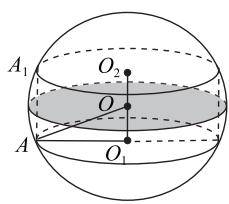

text_image

A₁
O₂
O
O₁
A

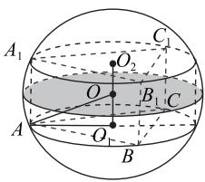

text_image

A₁
O₂
C₁
O
B₁
C
A
O
B

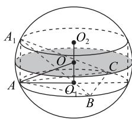

text_image

A₁
O₂
O
C
A
O
B

图1

抽象出具体的模型(如图 2).

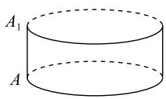  
圆柱

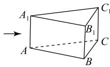  
直棱柱

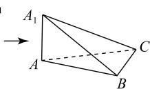  
有一条侧棱垂直于底面的棱锥  
图2

结论 若一个几何体为圆柱、直棱柱或有一条侧棱垂直于底面的棱锥，则其外接球半径公式为 $R = \sqrt{r^2 + (\frac{h}{2})^2}$ （其中 $r$ 为底面多边形的外接圆半径， $h$ 为几何体的高）.

1) 斜棱柱无外接球, 因为过上、下底面外接圆圆心的垂线相互平行、无交点(如图 3), 所以没有任何一点(球心)到上、下各顶点的距离相等, 所以斜棱柱无外接球.  
2) 上、下底面外接圆圆心连线不垂直于上、下底面的棱台也没有外接球(如图 4).  
3) 底面多边形没有外接圆的棱锥、棱柱、棱台都没有外接球(如图 5).

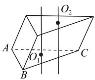  
图3

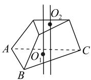  
图4

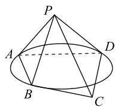

text_image

P
A
D
B
C

图5

例 1 已知三棱锥 P-ABC 中， $PA \perp$ 平面 ABC， $\angle BAC = 120^{\circ}$ ，PA = AB = AC = 2，则该三棱锥外接球的表面积为 \_\_\_\_.

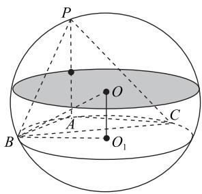

text_image

P
O
A
B
O₁
C

图6

由于 $PA \perp$ 平面

解析 ABC, 则球心 O 必在垂直平分线段 PA 的平面上, 平面与底面 ABC 平行(如图 6). 又因为球心 O 在过底面 $\triangle ABC$ 外接圆圆心 $O_{1}$ 且垂直于底面的垂线 $OO_{1}$ 上, 所以垂面与垂线的交点就是外接球的球心 O. 连接顶点 B、球心 O、圆心 $O_{1}$ 构成直角三角形, 用勾股定理解决问题.

易知 $OO_{1} = \frac{PA}{2}, BO_{1} = r$ （底面外接圆半径）， $BO = R$ （球的半径），由勾股定理可得 $R = \sqrt{\left(\frac{PA}{2}\right)^{2} + r^{2}}$ ，由余弦定理可得

$$
B C = \sqrt {A B ^ {2} + A C ^ {2} - 2 A B \cdot A C \cos \angle B A C} = 2 \sqrt {3},
$$

再由正弦定理得 $\frac{BC}{\sin\angle BAC}=2r$ ，则r=2，其外接球半径 $R=\sqrt{\left(\frac{2}{2}\right)^{2}+2^{2}}=\sqrt{5}$ ，所以该三棱锥外接球的表面积为 $S=4\pi R^{2}=20\pi$ .

此类模型的特点: 在棱锥中有一条侧棱垂直于底面时, 可应用性质 1 和性质 2 解题. 再结合 $R = \sqrt{r^2 + (\frac{h}{2})^2}$ ，求得其外接球半径，其中 $r$ 为锥体底面多边形的外接圆半径， $h$ 为该棱锥垂直于底面的侧棱长（也就是棱锥的高）。此类题型也常和平面几何中的正弦定理、余弦定理相结合。

例 2 已知三棱锥 P-ABC 中，PA ⊥ 平面 ABC，$\angle BAC = 150^{\circ}, PA = 6, BC = 3$ ，则三棱锥 $P - ABC$ 的外接球的半径为（ ）.

A. 3

B. $3\sqrt{2}$

C. $3\sqrt{3}$

D. 6

在三棱锥 P-ABC 中， $PA \perp$ 平面 ABC，则其

外接球半径 $R=\sqrt{r^{2}+(\frac{h}{2})^{2}}$ ，由正弦定理可知 $\frac{BC}{\sin\angle BAC}=\frac{3}{\sin150^{\circ}}=6=2r$ ，则 r=3，所以 $R=\sqrt{3^{2}+(\frac{6}{2})^{2}}=3\sqrt{2}$ ，故选 B.

例3 已知三棱锥 $P - ABC$ 的四个顶点都在球 $O$ 的球面上， $PB = PC = 2\sqrt{5}$ ， $AB = AC = 4$ ， $PA = BC = 2$ ，则球 $O$ 的表面积为（ ）.

A. $\frac{316}{15}\pi$

B. $\frac{79}{15}\pi$

C. $\frac{158}{5}\pi$

D. $\frac{79}{5}\pi$

三棱锥 P-ABC 如图 7 所示, 由勾股定理得$PB^{2} = PA^{2} + AB^{2}, PC^{2} = PA^{2} + AC^{2}$ ，则$PA \perp AB, PA \perp AC, AB \cap AC = A$ ，所以 $PA \perp$ 平面 ABC.

取 BC 的中点 E，连接 AE，则 $AE = \sqrt{4^{2} - 1^{2}} = \sqrt{15}$ ， $\sin \angle ABC = \frac{AE}{AB} = \frac{\sqrt{15}}{4}$ .

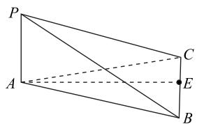

text_image

Geometric diagram of a triangular prism with labeled vertices and internal points, including dashed lines indicating hidden edges.

图 7

由正弦定理得

$$
2 r = \frac {A C}{\sin \angle A B C} = \frac {1 6}{\sqrt {1 5}},
$$

$$
R = \sqrt {r ^ {2} + (\frac {h}{2}) ^ {2}} \Rightarrow R ^ {2} = (\frac {8}{\sqrt {1 5}}) ^ {2} + 1 = \frac {7 9}{1 5},
$$

则外接球的表面积为 $S = 4\pi R^2 = \frac{316}{15}\pi$ ，故选A.

类型 2 利用垂线方程定球心

例 4 （2022 年新高考Ⅱ卷 7）已知正三棱台的高为 1，上、下底面边长分别为 $3\sqrt{3}$ 和 $4\sqrt{3}$ ，其顶点都在同一球面上，则该球的表面积为（）.

A. $100\pi$

B. $128\pi$

C. $144\pi$

D. $192\pi$

如图 8 所示,根据题意可知球心在过正三棱台上、下底面外接圆圆心 $O_{1}, O_{2}$ 且与底面垂直的直线上,也就是直线 $O_{1}O_{2}$ 上.通过已知条件可以求出正三棱台上、下底面的外接圆半径 $r_{1}, r_{2}$ ,再根据球心距、外接圆半径以及球的半径之间的关系,即可解出球的半径,从而得出球的表面积.

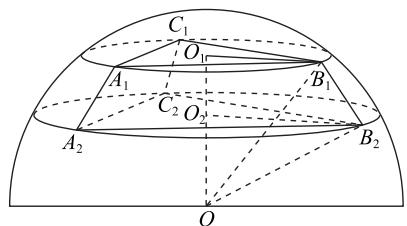

text_image

C₁
O₁
A₁
C₂
O₂
A₂
B₁
B₂
O

图8

由正弦定理得 $2r_{1} = \frac{3\sqrt{3}}{\sin 60^{\circ}}, 2r_{2} = \frac{4\sqrt{3}}{\sin 60^{\circ}}$ ，即

$$
r _ {1} = 3, r _ {2} = 4.
$$

设球心 O 到上、下底面的距离分别为 $d_{1}, d_{2}$ ，球的半径为 R，所以 $d_{1} = \sqrt{R^{2} - 9}, d_{2} = \sqrt{R^{2} - 16}$ ，故 $\left|d_{1} - d_{2}\right| = 1$ 或 $d_{1} + d_{2} = 1$ ，解得 $R^{2} = 25$ ，所以球的表面积为 $S = 4\pi R^{2} = 100\pi$ ，故选 A.

# 点评

解决正棱台(圆台)外接球问题的关键点:过上、下底面外接圆圆心且垂直于上、下底面的直线(高线)过球心,利用球心与两圆心及所在平面的一个顶点构成两个直角三角形,结合勾股定理可以求出半径.同理,圆锥(正棱锥)外接球球心的位置在过底面外心和顶点的连线(高线)上,再利用球心到底面任意一点的距离等于外接球的半径,结合勾股定理可以求出半径.因此,可以用上面的方法推导出圆柱(直棱柱)、圆台(正棱台)、圆锥(正棱锥)的外接球半径公式,并通过极限思想找到三者的联系与区别如图9所示.

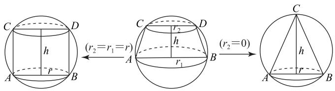

text_image

C D
h
A B
(r₂=r₁=r)
A C D
r₂
h
B
(r₂=0)
C
h
A B
r

$$
R = \sqrt {r ^ {2} + (\frac {h}{2}) ^ {2}} \xleftarrow {(r _ {2} = r _ {1} = r)}
$$

$$
R = \sqrt {r _ {2} ^ {2} + (\frac {h ^ {2} + r _ {1} ^ {2} - r _ {2} ^ {2}}{2 h}) ^ {2}} \xrightarrow {(r _ {2} = 0 , r _ {1} = r)} R = \frac {h ^ {2} + r ^ {2}}{2 h}.
$$

图9  

例 5 （2020 年全国 I 卷 10）已知 A, B, C 为球$O$ 的球面上的三个点，圆 $O_{1}$ 为 $\triangle ABC$ 的外接圆，若圆 $O_{1}$ 的面积为 $4\pi, AB = BC = AC = OO_{1}$ ，则球 $O$ 的表面积为（ ）.

A. $64\pi$

B. $48\pi$

C. $36\pi$

D. $32\pi$

# 解析

设圆 $O_{1}$ 的半径为r, 球的半径为 R (如图10)，由圆 $O_{1}$ 的面积为 $4\pi$ 得 $\pi r^2 = 4\pi$ ，所以 $r = 2.$ 因为 $\triangle ABC$ 为等边三角形，由正弦定理得 $AB = 2r\sin 60^{\circ} =$ $2\sqrt{3}$ ，而 $O_{1}A = 2$ ，所以 $OO_{1} =$

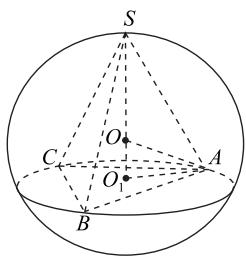

text_image

S
O
C
O
A
B

图10

$AB=2\sqrt{3}$ ，根据球的截面性质 $OO_{1}\perp$ 平面 ABC，得

$$
R = O A = \sqrt {O O _ {1} ^ {2} + O _ {1} A ^ {2}} = \sqrt {1 2 + 4} = 4,
$$

108

数理化

所以球 O 的表面积为 $S=4\pi R^{2}=64\pi$ ，故选 A.

例6 求棱长为 $a$ 的三棱锥 $A - BCD$ 外接球的

# 解析

将三棱锥还原到
正方体中(如图11), 三棱锥的棱就是正方体的面对角线, 其长为 a,故正方体的棱长为 $\frac{\sqrt{2}}{2}a$ ,
可求出外接球的直径为$2R=\sqrt{3}\times\frac{\sqrt{2}}{2}a$ ，则 $R=\frac{\sqrt{6}}{4}a$ .

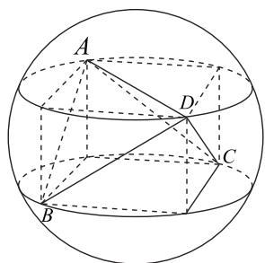

text_image

A
D
C
B

图11

# 点评

此类模型的特点:三棱锥的三组对棱长度全部相同,把三棱锥还原到正方体中.同理,已知三棱锥A-BCD的三组对棱分别为 $BC = AD = x$ ， $AB = CD = y, AC = BD = z$ ，求三棱锥A-BCD外接球的半径.

我们可以把三棱锥A-BCD还原到长、宽、高分别为a,b,c的长方体中（如图12），则长方体与三棱锥有相同的外接球.设三棱锥A-BCD外接球的半径为R，则 $2R=\sqrt{a^{2}+b^{2}+c^{2}}$ .易知

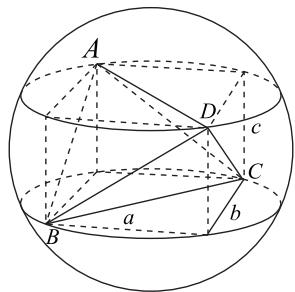

text_image

A
D'
c
C
B
a
b

图12

$$
x ^ {2} = a ^ {2} + b ^ {2}, y ^ {2} = c ^ {2} + b ^ {2}, z ^ {2} = a ^ {2} + c ^ {2},
$$

则 $8R^{2} = x^{2} + y^{2} + z^{2}$ ，所以

$$
R = \sqrt {\frac {x ^ {2} + y ^ {2} + z ^ {2}}{8}} = \frac {\sqrt {2}}{4} \sqrt {x ^ {2} + y ^ {2} + z ^ {2}}.
$$

例 7 在三棱锥 A-BCD 中，AC=BD=6，其余棱长均为 7，求三棱锥 A-BCD 外接球的半径.

# 解析

方法1 因为三棱锥 $A - BCD$ 中三组对棱分别是 $BC = AD = 7, AB = CD = 7, AC =$

$BD = 6$ ，所以

$$
R = \frac {\sqrt {2}}{4} \sqrt {7 ^ {2} + 7 ^ {2} + 6 ^ {2}} = \frac {\sqrt {6 7}}{2}.
$$

方法 2 将三棱锥还原到正四棱柱中, 可以得到上、下底面的正方形对线长为 6, 四个侧面的对角线分别为 5, 从而底面边长全部为 $3\sqrt{2}$ , 高为 $\sqrt{31}$ , 所以正四棱柱的体对角线 $2R = \sqrt{18 + 18 + 31} = \sqrt{67}$ , 即三棱锥外接球半径 $R = \frac{\sqrt{67}}{2}$ .

# 类型 3 利用线线交点定球心

二面角 A-BD-C 的平面角大小为 $\theta, BD = 2a$ ， $\triangle CBD$ 和 $\triangle ABD$ 外接圆半径分别为 $r_{1}, r_{2}$ （如图 13），求其外接球半径时，取 BD 的中点 E，则 $EO_{1} = \sqrt{r_{1}^{2} - a^{2}}, EO_{2} = \sqrt{r_{2}^{2} - a^{2}}$ ，易知 $O_{1}, O, O_{2}, E$ 四点共圆，该圆的半径为 OE，结合正弦定理和余弦定理知

$$
O E = \frac {\sqrt {r _ {1} ^ {2} + r _ {2} ^ {2} - 2 a ^ {2} - 2 \sqrt {r _ {1} ^ {2} - a ^ {2}} \cdot \sqrt {r _ {2} ^ {2} - a ^ {2}} \cdot \cos \theta}}{\sin \theta},
$$

$$
R ^ {2} = O B ^ {2} = O E ^ {2} + E B ^ {2} =
$$

$$
\frac {r _ {1} ^ {2} + r _ {2} ^ {2} + (\sin^ {2} \theta - 2) a ^ {2} - 2 \sqrt {\left(r _ {1} ^ {2} - a ^ {2}\right) \left(r _ {2} ^ {2} - a ^ {2}\right)} \cdot \cos \theta}{\sin^ {2} \theta}. \tag {①}
$$

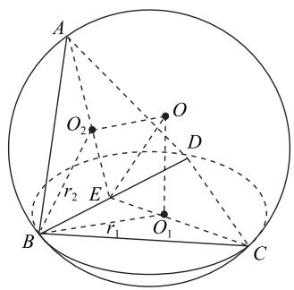

text_image

A
O₂
O
D
r₂ E
r₁ O₁
B
C

图13

特别地,有以下两个结论.

1) 在三棱锥 A-BCD 中, 若二面角 A-BD-C 是由以 BD 为斜边的直角三角形, 即 $\triangle ABD$ 与 $\triangle BCD$ 是直角三角形 (如图 14), 则二面角 A-BD-C 的平面角大小无论何值时, 其三棱锥 A-BCD 的外接球直径都是 BD. 由线线交点定球心的解法可知 $\triangle BCD$ 与 $\triangle ABD$ 是有公共斜边的直角三外形, 外接圆圆心 O 重合, 也就是球心, 且点 O 到各个顶点的距离都为 $\frac{BD}{2}$ , 所以也可以说明 O 就是球心, $R = \frac{BD}{2}$ .

2) 当二面角 A-BD-C 的平面角为 $90^{\circ}$ 时（如图 15），四边形 $EO_{1}OO_{2}$ 为矩形，则

$$
R ^ {2} = O B ^ {2} = O E ^ {2} + E B ^ {2} =
$$

$$
d _ {1} ^ {2} + d _ {2} ^ {2} + a ^ {2} = r _ {1} ^ {2} + r _ {2} ^ {2} - a ^ {2}.
$$

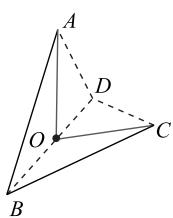

text_image

A
D
O
C
B

图14

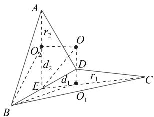

text_image

A
r₂
O
O₂
d₂
D
E
d₁
r₁
B
C
O₁

图15

例 8 在边长为 $2\sqrt{3}$ 的菱形 ABCD 中， $D=60^{\circ}$ ，沿对角线 BD 折成二面角 A-BD-C 为的四面体 A-BCD，则此四面体的外接球体积 \_\_\_\_.

# 析

易知 $\triangle ABD$ 和 $\triangle CBD$ 为等边三角形（如图16），取 $BD$ 的中点 $M$ ，连接 $AM, CM$ ，有$AM \perp BD, CM \perp BD$ ，所以 $\angle CMA$ 为二面角 A-BD-C 的平面角，则 $\angle CMA = 120^{\circ}, \triangle ABD$ 与 $\triangle CBD$ 的外接圆半径为 $r_{1} = r_{2} = \frac{2}{3} AM = 2, \triangle ABD$ 和 $\triangle CBD$ 的外心 $O_{1}, O_{2}$ 到弦 BD 的距离（弦心距）为 $d_{1} = d_{2} = 1$ ，连接 OM，则 $\triangle OMO_{2} \cong \triangle OMO_{1}, OM = 2, R = \sqrt{OM^{2} + MB^{2}} = \sqrt{7}$ ，所以四面体的外接圆体积为

$$
V = \frac {4}{3} \pi R ^ {3} = \frac {2 8 \sqrt {7}}{3} \pi .
$$

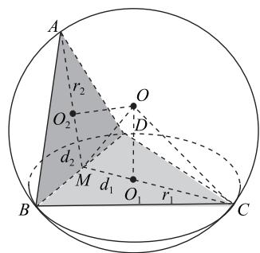

text_image

A
r₂
O₂
d₂
M
d₁
O₁
r₁
B
C
D

图16

# 点评

此类模型的特点:根据已知条件可以求出两个相邻多边形的外接圆半径、公共棱长度及二面角的平面角大小,通过使用过截面圆心且垂直于截面的直线过球心,即线线交点定球心解决问题.

例 9 在三棱锥 P-ABC 中, $\triangle ABC$ 为等腰直角形, AB = AC = 2, $\triangle PAC$ 为正三角形, 且二面角 C-B 的平面角为 $\frac{\pi}{6}$ , 则三棱锥 P-ABC 的外接球积为 \_\_\_\_.

# $\therefore m = \frac{3}{11}$

方法1 因为 $\triangle ABC$ 为直角三角形, AB = AC = 2, 所以 $BC = 2\sqrt{2}$ (如图 17). 因为 $\triangle PAC$ 为正三角形, 所以 PA = PC = AC = 2, 取 AC 的中点 D, BC 的中点 E, 连接 PD, DE, 则 $PD \perp AC$ ,$DE \perp AC$ , 所以 $\angle PDE$ 为二面角 P-AC-B 的平面角,

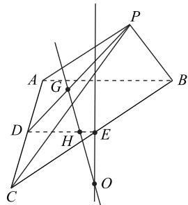

text_image

Geometric diagram with labeled points and lines, likely from a math problem or proof

图17

$$
\angle P D E = 3 0 ^ {\circ}.
$$

因为 $\triangle ABC$ 为直角三角形， $E$ 为 $BC$ 的中点，所以点 $E$ 为 $\triangle ABC$ 的外接圆圆心。设 $G$ 为 $\triangle PAC$ 的中心，则 $G$ 为 $\triangle PAC$ 的外接圆圆心。过 $E$ 作平面 $ABC$ 的垂线，过 $G$ 作平面 $PAC$ 的垂线，两垂线交于 $O$ ，则 $O$ 为三棱锥 $P-ABC$ 的外接球球心。 $GO$ 与 $DE$ 交于点 $H$ ，则 $GD = \frac{1}{3} PD = \frac{\sqrt{3}}{3}$ ， $DH = \frac{GD}{\cos 30^\circ} = \frac{2}{3}$ ，所以

$$
H E = D E - D H = \frac {1}{3}, O E = H E \times \tan 6 0 ^ {\circ} = \frac {\sqrt {3}}{3},
$$

所以 $R^{2}=CO^{2}=CE^{2}+OE^{2}=2+\frac{1}{3}=\frac{7}{3}$ ，则三棱锥 P-ABC 的外接球表面积为

$$
S = 4 \pi R ^ {2} = \frac {2 8}{3} \pi .
$$

方法2 由方法1知 $\triangle BAC$ 与 $\triangle PAC$ 的外接圆半径为 $r_1 = \sqrt{2}, r_2 = \frac{2}{3} PD = \frac{2\sqrt{3}}{3}$ ，二面角 $P - AC - B$ 的平面角为 $\theta = \frac{\pi}{6}$ ，公共棱长为 $AC = 2a = 2$ ，由①得

$$
R ^ {2} = \frac {2 + \frac {4}{3} + (\frac {1}{4} - 2) - 2 \sqrt {1 \times \frac {1}{3}} \times \frac {\sqrt {3}}{2}}{\frac {1}{4}} = \frac {7}{3},
$$

所以三棱锥 $P - ABC$ 的外接球表面积为

$$
S = 4 \pi R ^ {2} = \frac {2 8}{3} \pi .
$$

# 3 空间几何体内切球问题

求解空间几何体内切球问题应类比平面几何图形求内切圆的方法.

1) 利用性质 3(当平面与球相切时, 切点与球心的连线与平面垂直) 来解决问题.

2) 利用等体积法求内切球的半径.

已知球的外接 n 面体的体积为 V，表面积为 S，各顶点与球心连接后，把原多面体分成了 n 个以球心 O 为顶点的锥体，每个锥体的高就是球心到各面的距离 r，则多面体的体积为

$$
V = V _ {1} + V _ {2} + \dots + V _ {n} = \frac {1}{3} S _ {1} r + \frac {1}{3} S _ {2} r + \dots + \frac {1}{3} S _ {n} r.
$$

又因为 $S_{1}+S_{2}+\cdots+S_{n}=S, V=\frac{1}{3}Sr$ ，所以内切球半径为 $r=\frac{3V}{S}$ .

例 10 六氟化硫是一种无机化合物,化学式为 $SF_{6}$ , 常温常压下为无色无臭无毒不燃的稳定气体, 密度约为空气密度的 5 倍, 是强电负性气体, 广泛用于超高压和特高压电力系统. 六氟化硫分子结构呈正八面体排布 (8 个面都是正三角形). 若此正八面体的表面积为 $32\sqrt{3}$ , 则该正八面体的内切球的体积为 \_\_\_\_.

方法 1 设该正八面体的棱长为 a (如图18)，表面积为 $S = 8\times$ $\frac{1}{2} a^2\times \sin \frac{\pi}{3} = 32\sqrt{3}$ ，解得 $a = 4.$ 取 $BC$ 的中点 $D$ ，连接 $OD,OA,AD$ ，则 $\triangle AOD$ 是直角三角形， $OD = 2,AD =$ $2\sqrt{3}$ ，所以 $OA = 2\sqrt{2}$ ，正八面

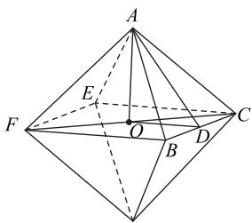

text_image

Geometric diagram of a tetrahedron with labeled vertices and internal points, used for spatial geometry problems.

图18

$$
V = 2 V _ {\text {棱锥} A - B C E F} = 2 \times \frac {1}{3} \times B C ^ {2} \times O A = \frac {6 4 \sqrt {2}}{3},
$$

故该八面体的内切球半径为 $r = \frac{3V}{S} = \frac{64\sqrt{2}}{32\sqrt{3}} = \frac{2\sqrt{6}}{3}$ ，则体积为 $\frac{64\sqrt{6}}{27}\pi.$

方法2 由方法1可知 $a = 4$

如图 19 所示, 取 BC 的中点 D, 连接 OD, OA, AD, 可知 BC ⊥ 平面 AOD, $OD = 2$ , $AD = 2\sqrt{3}$ , 所以$OA = 2\sqrt{2}$ ，过点 $O$ 作直线 $AD$ 的垂线 $OH$ ，且 $OH \perp$ 平面 $ABC$ ，所以 $OH$ 就是内切圆的半径，则

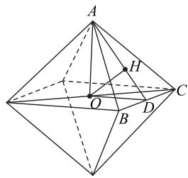

text_image

Geometric diagram of a tetrahedron with labeled vertices and internal points, used for spatial geometry problems.

图19

$$
S _ {\triangle A O D} = \frac {1}{2} O D \times O A = \frac {1}{2} A D \times O H,
$$

$$
O H = \frac {O D \times O A}{A D} = \frac {2 \times 2 \sqrt {2}}{2 \sqrt {3}} = \frac {2 \sqrt {6}}{3},
$$

则正八面体的内切球体积为 $\frac{64\sqrt{6}}{27}\pi.$

例 11 （2020 年新课标Ⅲ卷 15）已知圆锥的底面半径为 1，母线长为 3，则该圆锥内半径最大的球的体积为 \_\_\_\_.

方法 1 因为圆锥内半径最大的球为该圆锥的内切球(如图 20). 圆锥母线为 AC=3，底

# 平面向量数量积的五种常见求法

周江红 沈申文

(浏阳市田家炳实验中学)

向量数量积作为平面向量的重要内容,是近几年高考的热点,常在选择题、填空题中出现.向量数量积的求解方法多、思维灵活,学生在实际应用向量知识求解问题时,往往只停留在知识的层面,缺乏对各种方法的研究与思考,难以适应新高考低起点、多层次、高落差的特点.基于此,本文力求透过现象看本质,提炼出求解与平面向量数量积有关问题的五种常用方法,以期帮助读者更好地理解向量数量积,并在各类题型中选择合理的方法,高效作答.

# 1 定义法

定义 已知两个非零向量 a 与 b，它们的夹角为 $\theta$ ，则把 $|a||b|\cos\theta$ 叫做 a 与 b 的数量积，记作 $a \cdot b$ 。利用定义解题时需要注意以下几点。

1) $\theta \in [0, \pi]$ , 且 $a \cdot a = |a|^2$ .   
2) $\theta=\langle a,b\rangle=\langle b,a\rangle.$   
3) 判断两个向量的夹角, 一定要将两个向量的起点移到同一起点.

# 1.1 链接教材

例 1 （2019 年人教 A 版《普通高中教科书数学必修第二册》23页习题11，节选)已知 $|a|=3,|b|=4$ ，且a与b的夹角 $\theta=150^{\circ}$ ，求 $a\cdot b,(a+b)^{2},|a+b|$ .

依题意可得

$$
\boldsymbol {a} \cdot \boldsymbol {b} = | \boldsymbol {a} | | \boldsymbol {b} | \cos 1 5 0 ^ {\circ} = 3 \times 4 \times (- \frac {\sqrt {3}}{2}) = - 6 \sqrt {3}.
$$

$$
(a + b) ^ {2} = a ^ {2} + 2 a \cdot b + b ^ {2} =
$$

$$
9 + 2 \times (- 6 \sqrt {3}) + 1 6 = 2 5 - 1 2 \sqrt {3}.
$$

面半径为 BM = 1，则其高 $AM = 2\sqrt{2}$ .

设该内切球与母线 AC 切于点 D，则 OD = OM = r，由 $\triangle AOD \sim \triangle ACM$ ，解得 $\frac{OD}{OA} = \frac{CM}{CA}$ ，故

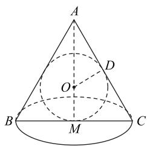

text_image

A
D
O
B
M
C

图20

$$
O D = r = \frac {C M \times O A}{C A} = \frac {1 \times (2 \sqrt {2} - r)}{3},
$$

所以 $r=\frac{\sqrt{2}}{2}, V=\frac{4}{3}\pi r^{3}=\frac{\sqrt{2}}{3}\pi.$

方法 2 如图 21 所示, 易知 BC=2, AB=AC=3, 且点 M 为 BC 边上的中点.

设内切圆的圆心为 O，由于 $AM = \sqrt{3^{2} - 1^{2}} = 2\sqrt{2}$ ，故 $S_{\triangle ABC}=\frac{1}{2}\times2\times2\sqrt{2}=2\sqrt{2}.$

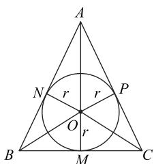

text_image

A
N r r P
O r
B M C

图21

设内切圆的半径为 r，则

$$
S _ {\triangle A B C} = S _ {\triangle A O B} + S _ {\triangle B O C} + S _ {\triangle A O C} =
$$

$$
\frac {1}{2} \times A B \times r + \frac {1}{2} \times B C \times r + \frac {1}{2} \times A C \times r =
$$

$$
\frac {r}{2} (3 + 3 + 2) = 2 \sqrt {2},
$$

解得 $r=\frac{\sqrt{2}}{2}$ ，故该圆锥内半径最大的球的体积为

$$
V = \frac {4}{3} \pi r ^ {3} = \frac {\sqrt {2}}{3} \pi .
$$

# 4 小结

本文通过类比学习得到空间球的 3 个重要几何性质,并根据性质的使用情况将空间几何体的外接球问题归纳为三种类型,并推导出解题方法和解题公式.通过学习,学生可以将所学的知识连成线,思维结成网,使所学知识系统化、模型化,提升自身的归纳与化归能力.

（本文系2022年广东省教育科学规划课题《智慧课堂下的高中数学“精准教学”模式的实践研究》（项目编号：2022YQJK036)的研究成果.)

(完)