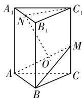
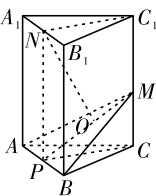
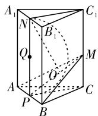
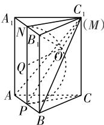
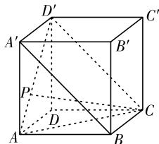
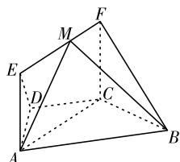
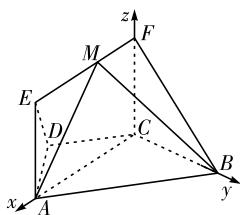

# 立体几何动点三类常见问题分析

浙江金华市外国语学校(321015) 蔡莎莎

[摘 要]立体几何动点问题是一个十分重要的高考考点,主要分为轨迹问题、最值问题和空间位置关系问题三大类.这类问题在高考中频繁出现,但学生得分率普遍偏低.文章通过典型例题分析,探讨相关问题的常见命题情境及解题方法,以帮助学生掌握解题方法,提升解题能力.

[关键词]立体几何;动点;常见问题

[中图分类号] G633.6 [文献标识码] A

[文章编号] 1674-6058(2025)08-0027-03

立体几何是高中数学的重要内容之一,历年高考数学试卷中频繁出现相关题目.其中,动点问题是主要命题方向,但是此类问题难度较大,既考验学生的计算能力,又考验学生的空间想象能力.为帮助学生掌握解题方法,笔者结合具体例题,对考试中常见的几类立体几何动点问题及其解法进行总结归纳.

# 一、轨迹问题

动点轨迹问题是高考立体几何问题的常见命题方向,主要考查点、线、面间的位置关系,探究符合一定条件的点的运动轨迹.轨迹问题通常分为两类:一是判断动点在三维空间的运动轨迹;二是计算动点的轨迹长度.无论是哪一类问题,解答时均需熟练掌握动点轨迹的判断方法.

在命题情境中,需根据轨迹特征判断轨迹类型,常见的轨迹类型有:球面轨迹(如给定一个点到固定点的距离不变求该点的轨迹)、平面轨迹(如给定一个点满足平面相关条件求该点的轨迹)、直线轨迹(如给定一个点满足直线相关条件求该点的轨迹)、圆锥曲线轨迹(在某些特殊情况下,动点的轨迹可能是椭圆、双曲线或抛物线)等.

动点轨迹问题的解题方法多样,没有固定模式.常用的解题方法可总结为以下几种.

定义法:根据题目条件,直接依据常见轨迹(如球面轨迹、圆柱面轨迹、圆锥曲线轨迹等)的定义来判断动点的轨迹.

几何性质法:利用空间几何的基本性质(如平行、垂直、距离等)和定理(如三垂线定理、线面垂直的判定定理等)来推导动点的轨迹.

代入法:假设动点满足某个方程(如球面方程、圆柱面方程等), 将动点的坐标代入方程, 验证方程是否恒成立, 从而确定轨迹.

参数法: 引入参数来表示动点的坐标, 根据题目条件建立参数方程, 然后消去参数得到动点的普通方程, 进而确定轨迹.

向量法: 不通过建系, 而是利用向量的线性运算、数量积、模等性质, 结合空间向量的基本定理, 通过向量计算推导动点的轨迹, 尤其在处理与角度、距离相关的问题时, 向量法能提供更简洁的解题思路.

坐标法:建立适当的空间直角坐标系,将空间中的点、线、面用坐标表示,将立体几何中的轨迹问题转化为坐标运算问题,再利用坐标运算和方程求解推导动点的轨迹,该方法在处理与距离、角度、平行、垂直等相关的立体几何问题时特别有效.

可以发现,各种解题方法适用的情境各不相同,因此学生需结合题目信息灵活选择解题方法.

[例1]如图1,在直三棱柱 $ABC-A_{1}B_{1}C_{1}$ 中，△ABC为边长是2的正三角形， $AA_{1}=3,N$ 为棱 $A_{1}B_{1}$ 上的中点，M为棱 $CC_{1}$ 上的动点，过N作平面ABM的垂线段，垂足为O，当点M从点C运动到 $C_{1}$ 时，点O的轨迹长度为多少？

解析: 取 AB 的中点 P, 连接 PC, $C_{1}N$ , PN, 如图 2,

因为 $PC \perp AB, PN \perp AB,$

且 $PN \cap PC = P$

所以 $AB \perp$ 平面 $PCC_{1}N$ ,

又 $AB \subset$ 平面ABM,

则平面 $ABM \perp$ 平面 $PCC_{1}N$ ，平面 $ABM \cap$ 平面

  
图1

  
图2

$$
P C C _ {1} N = P M,
$$

过N作 $NO \perp PM, NO \subset$ 平面 $PCC_{1}N,$

所以 $NO \perp$ 平面 ABM.

取 $PN$ 的中点 $Q$ , 当点 $M$ 从点 $C$ 运动到 $C_{1}$ 时, 点 $O$ 的运动轨迹为以 $PN$ 为直径的圆 $Q$ (部分), 如图3所示.

  
图3

如图 4, 当 M 运动到 $C_{1}$ 时, 点 O 到达最高点, 此时 $PC = \sqrt{3}$ , $CC_{1} = 3$ , $\angle CPC_{1} = \frac{\pi}{3}$ ,

  
图 4

所以 $\angle OPQ = \frac{\pi}{6}$ , 从而 $\angle OQP =$ 图4 $\frac{2\pi}{3}$ , 所以弧长 $l = \frac{2\pi}{3} \cdot \frac{3}{2} = \pi$ , 即点 $O$ 的轨迹长度为 $\pi$ .

评析:本题为动点轨迹长度问题,解答这类问题的难点在于准确判断出动点的运动轨迹,并结合几何图形的性质来解题.因此,解题时首先要仔细分析题目给出的所有条件,明确求解的是哪个动点的轨迹长度,确定动点的约束条件;接着根据题目条件,判断动点的轨迹是直线、圆、椭圆、抛物线还是其他更复杂的曲线;然后选择解题方法,若轨迹是直线或圆等简单图形,可以直接利用几何性质(如勾股定理、弧长公式等)计算长度;最后根据解题方法进行解题.

# 二、最值问题

最值问题是常见考题,频繁出现在高考试卷中.可将最值问题再细分为距离最值、角度最值、面积最值、体积最值等几类.其中,距离最值包括动点到点的距离最值、动点到直线的距离最值、动点到平面的距离最值、直线到直线的距离最值、直线到平面的距离最值等;角度最值包括异面直线所成角的最值、线面角的最值、二面角的最值等;面积最值包括三角形面积最值、四边形面积最值及截面面积最值等.

在最值问题中,常用的解题方法包括以下几种.

直接法:通过作辅助线、面等方式,将问题转化为更简单的几何问题,利用几何性质(如平行、垂直、距离等)直接求解.

向量法:建立空间直角坐标系,将几何问题转化为代数问题.先利用向量的点积、模长等求解距离、角度等相关量,再结合函数思想(如设定动点的坐标或参数),建立目标函数,利用函数性质求解最值.

几何与代数结合法:先用几何方法确定动点的轨迹或范围,再利用代数方法建立目标函数并求解最值.

特殊值法: 当动点或动线在特定位置时, 可能会取得最值, 此时可通过取特殊值来简化问题.

[例2]如图5,正方体ABCD-A'B'C'D'中,点P在线段AD'上运动,设异面直线CP与BA'所成角为θ,则cosθ的最小值为多少?

text_image

D'
A'
C'
B'
P
D
A
B
C

图5

解析: 在正方体 $ABCD - A'B'$ $C'D'$ 中,

$$
A ^ {\prime} D ^ {\prime} \mathbin {/ /} B C, A ^ {\prime} D ^ {\prime} = B C,
$$

所以四边形 $A^{\prime}D^{\prime}CB$ 是平行四边形，

则 $A^{\prime}B\parallel D^{\prime}C$ ,

所以 CP 与 $D^{\prime}C$ 所成角 $\angle D^{\prime}CP$ 或其补角为 CP 与 $A^{\prime}B$ 所成角 $\theta$ ,

连接AC,由正方体的特征可知 $\triangle AD^{\prime}C$ 为正三角形,

故当P与A重合时, $\theta=\frac{\pi}{3}$ ;当P与 $D'$ 重合时,

因为 $D^{\prime}C$ 与 $A^{\prime}B$ 平行,所以 $0<\theta\leqslant\frac{\pi}{3}$ ,

由余弦函数性质可知 $y = \cos \theta$ 在 $\left(0, \frac{\pi}{3}\right]$ 上单调递减，所以 $\cos \theta$ 的最小值为 $\cos \frac{\pi}{3} = \frac{1}{2}$ .

评析:本题为求异面直线所成角的余弦值的最小值问题.要求得余弦值的最值,需判断动点运动过程中所求角度的变化情况,再结合三角函数性质对其余弦值的最值进行判断.在解答角度最值问题时,首先要明晰题目中给出的所有条件,明确需要求解的是最大角还是最小角;接着通过辅助线或辅助面,建立动点与已知点、线、面之间的几何联系;然后利用平面几何或立体几何的性质与定理(如平行线性质、垂直线性质、三角形内角和定理、正弦定理、余弦定理等)进行推导;最后利用代数方法(如配方法、求导法、不等式性质等)求解角度的最值.

# 三、空间位置关系问题

在立体几何动点问题中,空间位置关系问题的命题情境及解题方法多样.常见的空间位置关系考查包括平行与垂直关系、距离与角度关系等问题,如判断动点轨迹与定直线、定平面的平行或垂直关系,求证动点轨迹与某直线、平面平行或垂直的条件,涉及距离之和、差、积等特定条件的问题等.

在解答此类问题时,常用的方法包括以下几种.

圆锥曲线定义法: 当动点运动过程中保持某些距离或角度一定条件不变时, 可联想解析几何中有关轨迹(如圆、椭圆、抛物线等)的定义, 从而转化条件求解.

空间向量法:利用空间向量的性质(如向量的点积、叉积等)来求解空间中的动点问题,这种方法可以降低思维难度,使解题思路程序化.

在解答这类问题时,要求学生具备较强的空间想象力,需要学生结合具体情况和所给条件灵活选择解题方法.

[例3]如图6,在梯形ABCD中, $AB\parallel CD,\angle BCD=\frac{2\pi}{3}$ ，四边形ACFE为矩形，且 $CF\perp$ 平面ABCD,AD=CD=BC=CF=1.

text_image

Geometric diagram of a polyhedron with labeled vertices and internal points, used for spatial geometry problems.

图6

(1)求证:平面EFCD⊥平面BCF;

(2) 点 M 在线段 EF 上运动, 求当点 M 在什么位置时, 平面 MAB 与平面 FCB 所成锐二面角余弦值为 $\frac{\sqrt{3}}{4}$ .

解析:(1)略;

(2)以 C 为坐标原点, CA, CB, CF 所在直线分别为 x 轴, y 轴, z 轴, 得到如图 7 所示的坐标系.

text_image

z
F
M
E
D
C
A
B
x
y

图7

因为 AD = CD = BC = CF = 1，则 AB = 2，

又 $AB \parallel CD, \angle BCD = \frac{2\pi}{3}$ , 所以 $\angle ABC = \frac{\pi}{3}$ . 由余弦定理有 $AC^2 = AB^2 + BC^2 - 2AB \cdot BC \cdot \cos \frac{\pi}{3} = 3$ ,

所以 $AC = \sqrt{3}$ ，则 $EF = AC = \sqrt{3}$

设 $FM = \lambda (0 \leqslant \lambda \leqslant \sqrt{3})$ ,

则 $C(0,0,0)$ , $A(\sqrt{3},0,0)$ , $B(0,1,0)$ , $M(\lambda,0,1)$ ,

所以 $\overrightarrow{AB} = (-\sqrt{3}, 1, 0), \overrightarrow{BM} = (\lambda, -1, 1)$ ,

设 $\vec{n}=(x,y,z)$ 为平面MAB的一个法向量，

则 $\left\{\begin{aligned}\vec{n}\cdot\overrightarrow{AB}&=-\sqrt{3}x+y=0,\\\vec{n}\cdot\overrightarrow{BM}&=\lambda x-y+z=0,\end{aligned}\right.$

令 $x = 1$ ，则 $\vec{n} = (1, \sqrt{3}, \sqrt{3} - \lambda)$

易知 $\vec{m} = (1,0,0)$ 为平面 $FCB$ 的一个法向量，

所以 $\left|\cos<\vec{m},\vec{n}>\right|=\frac{\left|\vec{m}\cdot\vec{n}\right|}{\left|\vec{m}\right|\cdot\left|\vec{n}\right|}$

$$
\begin{array}{l} = \frac {1}{1 \times \sqrt {1 + 3 + (\sqrt {3} - \lambda) ^ {2}}} \\ = \frac {\sqrt {3}}{4}, \\ \end{array}
$$

解得 $\lambda = \frac{5\sqrt{3}}{3}$ 或 $\frac{\sqrt{3}}{3}$ ,

而 $0 \leqslant \lambda \leqslant \sqrt{3}$ , 所以 $\lambda = \frac{\sqrt{3}}{3}$ , 所以 $\frac{FM}{EF} = \frac{1}{3}$ , 即 $M$ 在线段 $EF$ 靠近点 $F$ 的三等分点处时, 满足题意.

评析:本题为立体几何动态问题中关于点的确定问题,属于常见问题.本题主要借助向量法,即通过构建空间直角坐标系,得到两个平面的法向量,而后根据两个平面的二面角余弦值进行列式,从而得到动点的位置.

综上所述,高中立体几何动点常见的三类问题,分别为轨迹问题、最值问题、空间位置关系问题.这三类问题又可以细分为多个子问题,各问题对应不同的解题方法.这三类问题在每年的高考中都会有所涉及.本文归纳了几类问题的常见命题情境及解题方法,但由于命题情境灵活多变,学生需掌握不同情境下的解题方法,以确保在考试中能够快速准确解题.

# [参考文献]

[1] 郝以静. 立体几何中动点轨迹常见问题及解题策略 [J]. 数理天地 (高中版), 2024(5): 23-24.  
[2] 孙平. 巧用向量法解一类立体几何中的探索性问题 [J]. 中学生数理化 (高考数学), 2024(2): 34-37.  
[3] 李翼. 立体几何中的动态问题探析 [J]. 数理天地 (高中版), 2023(21): 6-7.

(责任编辑 黄春香)