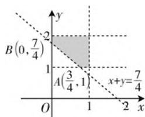

# 2021 年全国高考卷概率统计试题评析\*

# - 四川省内江师范学院数学与信息科学学院 包悦玲 赵思林

2021年高考概率统计试题坚持以数据分析、随机思想和统计思想立意，注重数据分析能力和概率统计素养的考查，落实了立德树人的根本任务。需要学生注重基础，回归教材，在着重理解知识本身内涵的同时，还要注意知识的灵活性与应用性。

# 一、2021年高考“概率与统计”试题的特点

# 1. 命题背景

概率与统计是高考数学中考查实际应用能力和数学建模能力的一个重要载体,也是考查必然与或然数学思想的重要内容.2021年高考数学概率与统计命题情境的选择自然合理,反映的问题具有代表性.如2021年新高考Ⅰ卷第18题,以学校组织“一带一路”知识竞赛为背景;2021年全国甲卷理科第2题以农村经济情况为背景,以此让学生了解农村的经济状况.

# 2. 知识能力考查

概率与统计部分主要考查抽样方法(以分层抽样为主)、统计图(表)的应用(识图、作图、用图)、系数的相关性(独立性检验思想、回归思想的运用)、随机事件(互斥事件、独立事件、独立重复试验、等可能事件)的概率、离散型随机变量的分布列、期望、方差、正态分布.重视学生分析、处理问题的能力,培养学生阅读理解、提取重要信息的能力,使学生在数学试题中感受数学美,在分析问题中运用数学思想方法.

# 3. 素养考查

随着社会的发展,素养的考查越来越受到教育者的重视.2017年,新修订的普通高中数学课程标准提出了六大核心素养,其中的数据分析,是指针对研究对象获取数据,运用数学方法对数据进行分析、整理和推断,形成关于研究对象知识的数学学科核心素养.概率与统计部分教学的主要目的是使学生体会随机思想和统计思想,分析、处理、评价数据,制定决策,培养学生“用数据说话”的意识.因此,概率与统计专题主要考查学生的数据分析素养,也包含数学运算、数学建模等素养.

# 二、2021年高考数学试题“概率与统计”试题评析

# 1. 抽样调查与随机事件

常见抽样方法有简单随机抽样、系统抽样以及分层抽样. 由于抽样方法灵活, 解决抽样问题的关键在于弄清总体个数与样本个数的关系, 从而根据具体情况采用不同的抽样方法.

例 1 （2021 年全国卷新高考 I 卷第 9 题）有一组样本数据 $x_{1}, x_{2}, \cdots, x_{n}$ ，由这组数据得到新样本数据 $y_{1}, y_{2}, \cdots, y_{n}$ ，其中 $y_{i} = x_{i} + c (i = 1, 2, \cdots, n)$ ，c 为非零常数，则（）.

A. 两组样本数据的样本平均数相同  
B. 两组样本数据的样本中位数相同  
C. 两组样本数据的样本标准差相同  
D. 两组样本数据的样本极差相同

解析：A选项， $E(y)=E(x+c)=E(x)+c$ 且 $c\neq0$ ，故平均数不相同，错误；B选项若第一组中位数为 $x_{i}$ ，则第二组的中位数为 $y_{i}=x_{i}+c$ ，显然不相同，错误；C选项 $D(y)=D(x)+D(c)=D(x)$ ，故方差相同，正确；D选项由极差的定义知，若第一组的极差为 $x_{max}-x_{min}$ ，则第二组的极差为 $y_{max}-y_{min}=(x_{max}+c)-(x_{min}+c)=x_{max}-x_{min}$ ，故极差相同，正确.

故选 CD.

评析: A, C 利用两组数据的线性关系有 $E(y) = E(x) + c$ , $D(y) = D(x)$ ，即可判断正误；根据中位数、极差的定义，结合已知线性关系可判断 B, D 的正误.

# 2. 概率模型与应用

事件的关系和运算、古典概型、几何概型、条件概率等都是高考数学考查的热点.

例 2 （2021 年全国乙卷理科第 8 题）在区间 (0, 1) 与 (1, 2) 中各随机取 1 个数，则两数之和大于 $\frac{7}{4}$ 的概率为（）.

A. $\frac{7}{9}$

B. $\frac{23}{32}$

C. $\frac{9}{32}$

D. $\frac{2}{9}$

text_image

B(0,7/4)
2
1
A(3/4,1)
x+y=7/4
O
1
2
x
y

图 1

解析: 如图 1 所示, 设从区间 $(0,1)$ , $(1,2)$ 中随机取出的数分别为 $x, y$ ，则实验的所有结果构成区域为 $\Omega = \{(x, y) \mid 0 < x < 1, 1 < y < 2\}$ ，其面积为 $S_{\Omega} = 1 \times 1 = 1$ .

设事件 A 表示两数之和大于 $\frac{7}{4}$ ，则构成的区域为 $A = \left\{(x, y) \mid 0 < x < 1, 1 < y < 2, x + y > \frac{7}{4}\right\}$ 即图中的阴影部分，其面积为 $S_{A}=1-\frac{1}{2}\times\frac{3}{4}\times\frac{3}{4}=\frac{23}{32}$ ，所以 $P(A)=\frac{S_{A}}{S_{Q}}=\frac{23}{32}$ .

故选 B.

评析:本题主要考查利用线性规划解决几何概型中的面积问题,解题关键是准确求出事件 $\Omega$ , A 对应的区域面积,再根据几何概型的的概率公式即可解出.

# 3. 概率分布与数字特征(期望、方差)

例 3 （2021 年全国卷新高考 I 卷第 18 题）某学校组织“一带一路”知识竞赛，有 A, B 两类问题，每位参加比赛的同学先在两类问题中选择一类并从中随机抽取一个问题回答，若回答错误则该同学比赛结束；若回答正确则从另一类问题中再随机抽取一个问题回答，无论回答正确与否，该同学比赛结束。A 类问题中的每个问题回答正确得 20 分，否则得 0 分；B 类问题中的每个问题回答正确得 80 分，否则得 0 分，已知小明能正确回答 A 类问题的概率为 0.8，能正确回答 B 类问题的概率为 0.6，且能正确回答问题的概率与回答次序无关。

(1) 若小明先回答 A 类问题, 记 X 为小明的累计得分, 求 X 的分布列;  
(2) 为使累计得分的期望最大, 小明应选择先回答哪类问题? 并说明理由.

解析:(1)由题可知,X的所有可能取值为0,20,

100, $P(X=0)=0.2$ , $P(X=20)=0.32$ , $P(X=100)=0.48$ . 所以 X 的分布列为

<table><tr><td>X</td><td>0</td><td>20</td><td>100</td></tr><tr><td>P</td><td>0.2</td><td>0.32</td><td>0.48</td></tr></table>

(2) 由(1)知, $E(X)=0\times0.2+20\times0.32+100\times0.48=54.4$ . 若小明先回答B问题,记Y为小明的累计得分,则Y的所有可能取值为0,80,100, $P(Y=0)=0.4,P(Y=80)=0.12,P(Y=100)=0.48$ . 所以 $E(Y)=57.6$ . 因为54.4<57.6,所以小明应选择先回答B类问题.

评析:(1)通过题意分析出小明累计得分X的所有可能取值,逐一求概率列分布列即可.(2)与(1)类似,找出先回答B类问题的数学期望,比较两个期望的大小即可.

# 4. 线性回归方程与 $2 \times 2$ 列联表

例 4 （2021 年全国甲卷文科第 17 题）甲、乙两台机床生产同种产品，产品按质量分为一级品和二级品，为了比较两台机床产品的质量，分别用两台机床各生产了 200 件产品，产品的质量情况统计如下表：

<table><tr><td></td><td>一级品</td><td>二级品</td><td>合计</td></tr><tr><td>甲机床</td><td>150</td><td>50</td><td>200</td></tr><tr><td>乙机床</td><td>120</td><td>80</td><td>200</td></tr><tr><td>合计</td><td>270</td><td>130</td><td>400</td></tr></table>

(1) 甲机床、乙机床生产的产品中一级品的频率分别是多少?  
(2) 能否有 99% 的把握认为甲机床的产品质量与乙机床的产品质量有差异?

附: $K^{2}=\frac{n(ad-bc)^{2}}{(a+b)(c+d)(a+c)(b+d)}$

<table><tr><td> $P\left( {{K}^{2} \geqslant k}\right)$ </td><td>0.050</td><td>0.010</td><td>0.001</td></tr><tr><td>k</td><td>3.841</td><td>6.635</td><td>10.828</td></tr></table>

解析:(1)甲机床生产的产品中的一级品的频率为 $\frac{150}{200}=75\%$ ,乙机床生产的产品中的一级品的频率为 $\frac{120}{200}=60\%$ .

(2) $K^{2}=\frac{400(150\times80-120\times50)^{2}}{270\times130\times200\times200}=\frac{400}{39}>10$ >6.635, 故能有 99% 的把握认为甲机床的产品与乙机床的产品质量有差异.

评析:本题考查频率统计和独立性检验,属基础题,根据给出公式计算即可.

# 三、教学建议

# 1. 重视基础知识与基本技能的教学

高考对教学具有明显的导向作用，“概率与统计”这一专题在高考试卷中所占的比重越来越重，许多概率试题设计新颖，构思巧妙，故意设置“陷阱”给学生，这就要求学生重视概念的理解与把握，重视对一些形同质异概念的辨识，深入理解题意，从而解决问题。另一方面，数学关键能力是数学学业质量评价的重要依据。因此，高考数学不仅重视基础知识的考查，还重视关键能力的考查，数学关键能力是具有数学基本特征的、适应学生个人终身发展和社会发展需要的品质。学生在学习“概率与统计”板块时逐步形成并完善数学关键能力，在培养学生的数学关键能力时，需要以数学基本思想为指引，以数学核心知识为载体，以数学理性思维为旨趣，以数学基本活动为途径，以数学核心素养为目标。

# 2. 重视数学思想方法的应用

数学思想是指人们对数学理论和内容的本质认识,数学方法是数学思想具体化,是数学解决问题的策略和程序,数学课程标准将数学思想方法列入数学目标之一,数学思想方法是数学的灵魂和精髓,是让数学“化繁为简”的钥匙,它蕴含于数学知识的发生、发展和应用过程中,它渗透在数学教学的全过程中.在概率统计这个板块中,主要包括随机思想、统计思想、模型思想,学会抓住数学思想方法,善于运用数学思想方法,能帮助我们提高解题能力.因此,在数学学习过程中要及时培养自己在解题中锻炼数学思想的习惯,要深入体会教材例题、习题中所体现的数学思想方法,逐渐培养用数学思想方法解决问题的意识.还应该系统性地总结数学思想方法,掌握它的本质与内涵,更好地将所学的知识融会贯通,解题时举一反三.

# 3. 重视核心素养的发展

在学习概率与统计时，应注重发展学生的数感、数据分析能力、运算能力和模型思想等，为了适应新时代发展对人才培养的需要，还要注重发展学生的应用意识与创新意识。核心素养是指学生应具备的适应终身发展和社会发展所需要的必备品格和关键能力，基于数学核心素养的数学教学，要求教师要转化观念，将“学生为本”的理念与教学实际有机结合，引导学生多去思考数学，体验数学，才能使数学核心素养得以有效体现与落实。在教学中要整体把握数学课程，从一节一节的课时中跳出来，尝试单元教学，将核心素养真正落实到课堂，落实到教学中。

# 4. 重视问题情境的创设

由经济合作与发展组织(OECD)牵头实施的“国际学生评估项目”(PISA)对数学素养的定义是“在各种各样情境中能够自觉产生和使用数学的意识，使用数学概念、程序、事实和工具来描述、解释说理甚至预测，能够运用数学理智进行判断和决策的能力”。学生的数学素养离不开情境，重视情境的创设，让学生在情境中理解并应用所学的概率与统计知识。《数学课程标准(2017年版)》明确指出：“让学生在现实情境中体验和理解数学。”创设一个良好的问题情境，有利于促进学生主动地、个性地、积极地学习，不断提升发现问题、提出问题、分析问题和解决问题的能力。

# 参考文献：

[1] 余小芬, 蒲霞露, 刘成龙. 2013～2018年高考数学全国卷“概率与统计”专题分析 [J]. 中学数学 (上), 2018(8). F

(上接第12页) 用符号语言表示并形成数学概念. 在这个过程中, 学生经历了从特殊到一般, 从零散到整体, 从表象到本质, 最终达成了用数学语言对共性进行表征并形成严谨的数学概念的数学抽象的一般过程. 概括归纳是探求共性的思维, 是从具体到抽象的必然过程.

# 3. 类比迁移是数学抽象的生长点

本节课的教学设计从形成学生统一的认知结构出发,从数学培养学生理性思维的功能出发,着眼为“迁移”而教(偶函数的概念迁移到奇函数的概念,奇偶性的研究迁移到函数其他性质的研究).学生在体验用数学定义解决问题的过程中,更要学会概念教学背后的数学抽象过程,并应用这种抽象思维去类比迁移探究新的概念,这正是数学抽象的意义所在.

# 参考文献：

[1] 何志明. 挖掘概念本质 发展核心素养——数学概念教学的几点体会 [J]. 中学数学教学参考, 2021(16).  
[2] 邓翰香, 吴立宝, 沈婕. 指向数学抽象素养的教材分析框架与案例剖析——以人教 A 版“函数单调性”为例 [J]. 数学通报, 2019(10). F