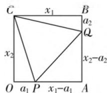
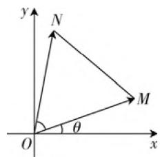
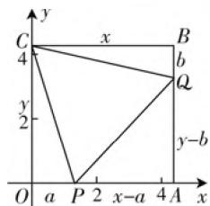

# “数”“形”转化,综合交汇,链接赛题

—— 一道最值题的探究

# ● 浙江省淳安中学 余建平

“数”与“形”是一对恒等对应关系，在解题过程中经常相互转化与应用，是近年高考数学试卷中比较常见的一种考查方式，此类问题背景新颖，综合交汇，能力性强，备受命题者青睐。特别碰到一些涉及“数”的抽象问题时，我们难以直接把握或处理，可以借助“形”的直观形象的优点，通过某一直观模型表达出具体的思维，起着解决问题的定性作用。我们经常把这种“数”的对应——“形”找出来，结合直观图形来分析解决问题。

# 一、问题呈现

问题 （2021 届浙江省宁波市宁海中学高三 10 月月考数学试卷·17）已知 $x_{1} \geqslant x_{2} > 0$ ，且存在实数 $a_{1}, a_{2}$ 满足 $\left\{ \begin{array}{l} a_{i}(x_{i} - a_{i}) \geqslant 0, \\ x_{i}^{2} + a_{3-i}^{2} = 2(a_{i}x_{i} + a_{3-i}x_{3-i}) \end{array} \right.$ （其中 $i = 1, 2$ ），则 $\frac{x_{1}}{x_{2}}$ 的取值范围是 \_\_\_\_。

此题以函数与不等式知识为问题背景,涉及多变量之间的关系,同时采用多种符号语言,在一定程度上增加了问题的难度.破解此题要充分理解题目的本质内涵,若单纯从代数视角入手,难度较大且比较难切入;而若从所给的表达式中的代数结构特征抽象出相应的数学模型,准确理解变量之间的关系,数形结合,构造平面几何图形或平面向量模型,把抽象问题具体化,“数”向“形”转化,从而为问题的破解奠定基础.

# 二、问题破解

解法 1:(平面几何构造法)
由题目条件可知，

$$
\left\{ \begin{array}{l} 0 \leqslant a _ {1} \leqslant x _ {1}, \\ 0 \leqslant a _ {2} \leqslant x _ {2} \\ (x _ {1} - a _ {1}) ^ {2} + (x _ {2} - a _ {2}) ^ {2} \\ = x _ {1} ^ {2} + a _ {2} ^ {2} = x _ {2} ^ {2} + a _ {1} ^ {2}. \end{array} \right.
$$

text_image

C
x₁
B
a₂
Q
x₂
x₂-a₂
O
a₁ P x₁-a₁ A

图1

如图1所示，作矩形OABC，其中 $|OA|=x_{1}$ ， $|AB|=x_{2}$ ，分别在边OA，AB上取点P,Q，使得 $|OP|=a_{1}$ ， $|BQ|=a_{2}$ ，结合条件 $(x_{1}-a_{1})^{2}+(x_{2}-a_{2})^{2}=x_{1}^{2}+$ $a_2^2 = x_2^2 + a_1^2$ ，利用勾股定理，可得 $|PQ|^2 = |CQ|^2 = |CP|^2$ ，则有 $|PQ| = |CQ| = |CP|$ ，即 $\triangle CPQ$ 是正三角形.

设 $\angle OCP = \theta \left(0\leqslant \theta \leqslant \frac{\pi}{6}\right)$ ，则 $\angle BCQ = \frac{\pi}{6} -\theta ,$

所以 $\frac{x_1}{x_2} = \frac{|BC|}{|OC|} = \frac{|BC|}{|CQ|}\cdot \frac{|CP|}{|OC|} = \frac{\cos\left(\frac{\pi}{6} - \theta\right)}{\cos\theta} =$

$$
\frac {\frac {\sqrt {3}}{2} \cos \theta + \frac {1}{2} \sin \theta}{\cos \theta} = \frac {\sqrt {3}}{2} + \frac {1}{2} \tan \theta \leqslant \frac {\sqrt {3}}{2} + \frac {1}{2} \tan \frac {\pi}{6} =
$$

$\frac{2\sqrt{3}}{3}$ ，当且仅当 $\theta = \frac{\pi}{6}$ 时，等号成立.

又 $x_{1} \geqslant x_{2} > 0$ ，则有 $\frac{x_1}{x_2} \geqslant 1$ ，所以 $\frac{x_1}{x_2}$ 的取值范围是 $\left[1, \frac{2\sqrt{3}}{3}\right]$ .

故填答案: $\left[1,\frac{2\sqrt{3}}{3}\right]$ .

点评:根据题目中的复杂条件进行等价转化,合理构造平面几何图形,通过矩形的直观图形,结合条件与勾股定理的应用确定相应三角形的形状,设出相应的角,结合线段的比值的转化,综合三角恒等变换以及三角函数的图象与性质确定其最大值,再综合条件确定线段的比值的最小值,从而得以确定相应的取值范围问题.

解法 2:(平面向量构造法)由题目条件可知,

$$
\begin{array}{l} \left\{a _ {1} (x _ {1} - a _ {1}) \geqslant 0, \right. \\ \left\lfloor x _ {1} ^ {2} + a _ {2} ^ {2} = 2 (a _ {1} x _ {1} + a _ {2} x _ {2}), \right. \end{array}
$$

且 $\left\{ \begin{array}{l} a_{2}(x_{2} - a_{2}) \geqslant 0, \\ x_{2}^{2} + a_{1}^{2} = 2(a_{2}x_{2} + a_{1}x_{1}). \end{array} \right.$

text_image

y
N
M
θ
O
x

图2

如图 2 所示, 在平面直角坐标系$xOy$ 中，构造平面向量 $\pmb {m} = (x_{1},a_{2}),\pmb {n} = (a_{1},x_{2})$ ，则有 $m^2 = 2m\cdot n,n^2 = 2m\cdot n$ ，且 $x_{1}\geqslant a_{1}\geqslant 0,x_{2}\geqslant a_{2}$ $\geqslant 0$ ，可得 $|\pmb {m}| = |\pmb {n}|$ ，且 $\cos \langle \pmb {m},\pmb {n}\rangle = \frac{1}{2}$ 则有 $\langle \pmb {m},\pmb {n}\rangle =$ $\frac{\pi}{3}$ .如图2所示，设 $\angle MOx = \theta \left(0\leqslant \theta \leqslant \frac{\pi}{6}\right)$ ，设 $|\pmb {m}| = |\pmb {n}| = r$ ，结合 $x_{1}\geqslant x_{2} > 0$ ，可得 $r\cos \theta \geqslant$ $r\sin \left(\frac{\pi}{3} +\theta\right)$ ，即 $(2 - \sqrt{3})\cos \theta -\sin \theta \geqslant 0$ ，则有 $\tan \frac{\pi}{12}$ ·cos $\theta -\sin \theta \geqslant 0$ ，即 $\sin \frac{\pi}{12}\cdot \cos \theta -\cos \frac{\pi}{12}\cdot \sin \theta \geqslant$ 0，亦即 $\sin \left(\frac{\pi}{12} -\theta\right)\geqslant 0$ ，可得 $0\leqslant \theta \leqslant \frac{\pi}{12}$ ，则有tanθ $\in [0,2 - \sqrt{3} ]$ ，所以 $\frac{x_1}{x_2} = \frac{r\cos\theta}{r\sin\left(\frac{\pi}{3} +\theta\right)} =$ $\frac{\cos\theta}{\frac{\sqrt{3}}{2}\cos\theta + \frac{1}{2}\sin\theta} = \frac{2}{\sqrt{3} + \tan\theta}\in \left[1,\frac{2\sqrt{3}}{3}\right]$ ，即 $\frac{x_1}{x_2}$ 的取值范围是 $\left[1,\frac{2\sqrt{3}}{3}\right]$

故填答案: $\left[1,\frac{2\sqrt{3}}{3}\right]$ .

点评:根据题目中的复杂条件加以分解,合理构造平面向量,通过平面向量的模与数量积公式加以转化,并通过数形结合来直观想象,确定对应向量的长度与夹角,综合三角恒等变换公式的应用与三角函数的图象与性质来确定夹角的取值范围,再利用比值的转化以及三角函数的图象与性质来确定其取值范围问题.

# 三、链接赛题

其实,以上问题的原型来自2017年全国高中数学联赛陕西赛区预赛试题第8题,是在该联赛赛题的基础上,符号抽象化,公式隐藏化,并在原来确定最值的基础上转化为确定取值范围问题,得以进一步拓展与变形.

联赛赛题（2017年全国高中数学联赛陕西赛区预赛试题·8）设 $x \geqslant y > 0$ ，若存在实数 $a, b$ 满足 $0 \leqslant a \leqslant x, 0 \leqslant b \leqslant y$ ，且 $(x - a)^2 + (y - b)^2 = x^2 + b^2 = y^2 + a^2$ ，则 $\frac{x}{y}$ 的最大值为（ ）.

A. $\frac{2\sqrt{3}}{3}$

B. $\sqrt{2}$

C. $\sqrt{6}$

D. 1

解析:如图3所示,在平面直角坐标系xOy中,作矩形OABC,使得 $A(x,0)$ , $B(x,y)$ , $C(0,y)(x\geqslant y$

$>0)$ ，分别在边 $OA,AB$ 上取点 $P,Q$ ，使得 $P(a,0),Q(x,y - b)$ ，结合条件 $(x - a)^2 +(y - b)^2 = x^2 +b^2 = y^2 +a^2$ ，利用两点间的距离公式，可得 $\left|PQ\right|^2 = \left|CQ\right|^2 = \left|CP\right|^2$ ，则有 $\left|PQ\right| = \left|CQ\right| = \left|CP\right|$ ，即 $\triangle CPQ$ 是正三角形.

text_image

y
C 4 x B
b
Q
y-b
y
2
O a P 2 x-a 4 A x

图3

设 $\angle OCP = \theta \left(0\leqslant \theta \leqslant \frac{\pi}{6}\right)$ ，则 $\angle BCQ = \frac{\pi}{6} -\theta ,$ 所以 $\frac{x}{y} = \frac{|BC|}{|OC|} = \frac{|BC|}{|CQ|}\cdot \frac{|CP|}{|OC|} = \frac{\cos\left(\frac{\pi}{6} - \theta\right)}{\cos\theta} =$ $\frac{\sqrt{3}}{2}\cos \theta +\frac{1}{2}\sin \theta$ $\frac{\cos\theta}{\cos\theta} = \frac{\sqrt{3}}{2} +\frac{1}{2}\tan \theta \leqslant \frac{\sqrt{3}}{2} +\frac{1}{2}\tan \frac{\pi}{6} =$ $\frac{2\sqrt{3}}{3}$ 当且仅当 $\theta = \frac{\pi}{6}$ 时，等号成立，即 $\frac{x}{y}$ 的最大值为 $\frac{2\sqrt{3}}{3}.$

故选A.

点评:根据题目条件,合理构造平面解析几何图形,通过矩形的直观图形与相应点的坐标的确定,结合条件与两点间的距离公式的应用确定相应三角形的形状,设出相应的角,结合线段的比值的转化,综合三角恒等变换以及三角函数的图象与性质确定其最大值.借助图形直观,回归解几运算本质,实现“数”向“形”,“形”向“数”的合理转化,是破解该题的一种基本技巧.

# 四、解后反思

“数”向“形”转化一般有以下几种基本途径：应用函数图象知识，应用平面几何知识，应用平面向量知识，应用立体几何知识以及应用解析几何知识等将相关的数量问题转化为对应的图形问题。因而我们要熟知一些基本“数”与“形”之间的特定关系或结构，学会对问题的结构进行分析与分解，能够从所给问题的情境中辨认出符合问题目标的某个熟悉的图形“模式”，找出它们之间的内在联系，对号入座，建立相应的图形模型，通过对相应的图形的直观性质、几何意义等的分析、推理、计算等方式来解决相应的数量问题。W