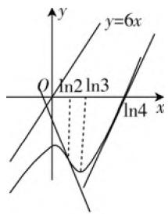

# 一道导数考题的多解探究

# 湖北省武汉市第二十三中 何红梅 金波

本文通过对 2021 年武汉 3 月调考第 12 题的多解探究,旨在激发学生的求知欲,开阔学生的解题思路,强化导数的基本解题方法和技巧,以便帮助学生整理常见解题方法,进一步提升学生分析问题、解决此类问题的能力,让学生的核心素养得以升华.

# 一、考题再现

题目（2021年武汉3调12题）设函数 $f(x) = \mathrm{e}^{2x} - 8\mathrm{e}^x +6x$ ，若曲线 $y = f(x)$ 在点 $P(x_0,f(x_0))$ 处切线与该曲线恰有一个公共点 $P$ ，则选项中满足条件的 $x_0$ 有（ ）.

A. $-\ln 2$

B. ln 2

C. ln 4

D. ln 5

# 二、题目剖析

本题是多选题, 这种题目的常规解法: 判断原函数和切线恰有一个公共点, 实质就是构造新函数, 判断函数当 $x_0$ 变化时是否有一根. 针对选择题的特点可以是代入检验法, 也可以是图象分析法, 也可以直接求解. 直接求解比较困难, 主要是说明函数有两个根困难.

# 三、解决问题

思维角度1:(代入法)求出切线方程,与曲线方程联立,构造新函数,把选项中的数字 $x_{0}$ 代入到函数中替换 $x_{0}$ ,判断新函数是否只有一个根,如果是一个根就满足条件,否则不符合条件.

解法1: 切线 $l: y - (\mathrm{e}^{2x_{0}} - 8\mathrm{e}^{x_{0}} + 6x_{0}) = (2\mathrm{e}^{2x_{0}} - 8\mathrm{e}^{x_{0}} + 6)(x - x_{0}), f(x) = \mathrm{e}^{2x} - 8\mathrm{e}^{x} + 6x,$

联立 l 与 $y=f(x)$ ,

可得 $\mathrm{e}^{2x} - 8\mathrm{e}^{x} - (2\mathrm{e}^{2x_0} - 8\mathrm{e}^{x_0})x = \mathrm{e}^{2x_0} - 8\mathrm{e}^{x_0} - (2\mathrm{e}^{2x_0} - 8\mathrm{e}^{x_0})x_0.$

① 当 $x_0 = \ln \frac{1}{2}$ 时， $\mathrm{e}^{2x} - 8\mathrm{e}^x + \frac{7}{2} x = M$ （常数），

其中 $M = \mathrm{e}^{2x_0} - 8\mathrm{e}^{x_0} - (2\mathrm{e}^{2x_0} - 8\mathrm{e}^{x_0})x_0,$

令 $g(x) = \mathrm{e}^{2x} - 8\mathrm{e}^x - (2\mathrm{e}^{2x_0} - 8\mathrm{e}^{x_0})x,$

因为 $\left(\mathrm{e}^{2x} - 8\mathrm{e}^x +\frac{7}{2} x\right)' = 2\mathrm{e}^{2x} - 8\mathrm{e}^x +\frac{7}{2} =$ $\frac{1}{2} (2\mathrm{e}^{x} - 1)(2\mathrm{e}^{x} - 7),$

所以 $y = \mathrm{e}^{2x} - 8\mathrm{e}^x + \frac{7}{2} x$ 在 $(- \infty, -\ln 2)$ , $\left(\ln \frac{7}{2}, +\infty\right)$ 上是增函数, 在 $\left(-\ln 2, \ln \frac{7}{2}\right)$ 上是减函数.

此时 $M = g\left(\ln \frac{1}{2}\right)$ ，发现不止一个交点，

所以 $x_{0}=\ln\frac{1}{2}$ (舍).

② 当 $x_0 = \ln 2$ 时，因为 $g(x) = \mathrm{e}^{2x} - 8\mathrm{e}^x + 8x$ ， $g'(x) = 2\mathrm{e}^{2x} - 8\mathrm{e}^x + 8 = 2(\mathrm{e}^x - 4)^2 \geqslant 0, g(x)$ 在 $\mathbf{R}$ 上增，所以此时 $M = g(\ln 2)$ 满足只有一个交点.  
③ 当 $x_0 = \ln 4$ 时， $g(x) = \mathrm{e}^{2x} - 8\mathrm{e}^x, g'(x) = 2\mathrm{e}^{2x} - 8\mathrm{e}^x, g(x)$ 在 $(- \infty, \ln 4)$ 上是减函数，在 $(\ln 4, + \infty)$ 上是增函数，此时 $M = g(\ln 4)$ 满足只有一个交点.  
④ 当 $x_0 = \ln 5$ 时， $g(x) = \mathrm{e}^{2x} - 8\mathrm{e}^x - 10x.$

因为 $g^{\prime}(x) = 2\mathrm{e}^{2x} - 8\mathrm{e}^{x} - 10 = 2(\mathrm{e}^{x} - 5)(\mathrm{e}^{x} + 1)$

$g(x)$ 在 $(-∞, \ln 5)$ 上是减函数，在 $(\ln 5, +∞)$ 上是增函数，此时 $M = g(\ln 5)$ ，只有一个交点.

所以选 BCD.

思维角度 2: (图象法) 分析 $f(x)$ 图象特征, 比较切线斜率的情况, 进行选择.

解法 2: $f'(x)=2e^{2x}-8e^{x}+6=2(e^{x}-1)(e^{x}-3)$ , $f''(x)=4e^{2x}-8e^{x}=4e^{x}(e^{x}-2)$ .

由 $f''(x) = 0$ 得 $x = \ln 2$ .

由 $f^{\prime}(x) = 0$ 得 $x = 0$ 或 $x = \ln 3$

因此， $f(x)$ 在 $(-\infty ,0),(\ln 3, + \infty)$ 上是增函数， $f(x)$ 在 $(0,\ln 3)$ 上是减函数.

当 $x \in (-\infty, \ln 2)$ 时， $f''(x) < 0, f'(x)$ 是减函数，且 $-2 < f'(x) < 6$ ；

当 $x \in (\ln 2, +\infty)$ 时， $f''(x) > 0, f'(x)$ 是增函数，且 $f'(x) > -2$ .

则 $y = f(x)$ 的草图如图1所示：

在拐点 $(\ln 2, f(\ln 2))$ 处切线和 $y = f(x)$ 只有一个交点，当 $x > \ln 2$ 时， $f(x)$ 的切线斜率大于等于左边切线斜率最大值6时，切线和 $f(x)$ 只有一个交点.

由 $f^{\prime}(x) = 2\mathrm{e}^{2x} - 8\mathrm{e}^{x} + 6\geqslant$ 6, 得 $x\geqslant \ln 4.$

text_image

y
y=6x
O
ln2 ln3
ln4
x

图1

故选 BCD.

思维角度 3: (直接法) 求出切线方程, 与曲线方程联立, 构造新函数, 解出新函数有一个零点时 $x_{0}$ 的范围.

解法 3: $f'(x)=2\mathrm{e}^{2x}-8\mathrm{e}^{x}+6$ , $f(x_{0})=\mathrm{e}^{2x_{0}}-8\mathrm{e}^{x_{0}}+6x_{0}$ , 故而 $f(x)$ 在点 $P(x_{0},f(x_{0}))$ 的切线方程是 $y-f(x_{0})=f'(x_{0})(x-x_{0})$ , 联立曲线和切线方程得 $f(x)-f(x_{0})=f'(x_{0})(x-x_{0})$ .

令 $H(x) = f(x) - f(x_0) - f'(x_0)(x - x_0) = \mathrm{e}^{2x} - 8\mathrm{e}^x +6x - (\mathrm{e}^{2x_0} - 8\mathrm{e}^{x_0} + 6x_0) - (2\mathrm{e}^{2x_0} - 8\mathrm{e}^{x_0} + 6)(x - x_0),$

$$
\begin{array}{r l} H ^ {\prime} (x) & = f ^ {\prime} (x) - f ^ {\prime} (x _ {0}) = 2 \mathrm{e} ^ {2 x} - 8 \mathrm{e} ^ {x} + 6 - \\ & (2 \mathrm{e} ^ {2 x _ {0}} - 8 \mathrm{e} ^ {x _ {0}} + 6 x _ {0}) = 2 (\mathrm{e} ^ {x} - \mathrm{e} ^ {x _ {0}}) (\mathrm{e} ^ {x} + \mathrm{e} ^ {x _ {0}} - 4), \end{array}
$$

显然 $x = x_0$ 是方程 $H^{\prime}(x) = 0$ 的根.

设 $b=\frac{8(x_{0}-1)}{\mathrm{e}^{x_{0}}}-2x_{0}+1,$

则 $H(x) = f(x) - f'(x_0)x - b\mathrm{e}^{2x_0}$ .

为了后续找点的方便,先讨论一下 b 的符号:

设 $\varphi (x) = \frac{8(x - 1)}{\mathrm{e}^x} -2x + 1,$

则 $\varphi'(x) = \frac{8(2 - x)}{\mathrm{e}^x} - 2, \varphi''(x) = \frac{8(x - 3)}{\mathrm{e}^x}$ ,

所以 $\varphi'(x)$ 在 $(- \infty, 3)$ 上单调递减，在 $(3, +\infty)$ 上单调递增，且 $\forall x \in [3, +\infty), \varphi'(x) < 0$

所以只需考虑 $\varphi'(x)$ 在 $(-∞,3)$ 上的零点情况.

因为 $\varphi'(1) = \frac{8}{\mathrm{e}} - 2 > 0, \varphi' \left( \frac{3}{2} \right) = \frac{4}{\mathrm{e}^{\frac{3}{2}}} - 2 < 0,$

所以 $\exists t_0\in \left(1,\frac{3}{2}\right),\varphi '(t_0) = 0,$

且当 $x \in (-\infty, t_0)$ 时， $\varphi'(x) > 0, \varphi(x)$ 单调递增；当 $x \in (t_0, +\infty)$ 时， $\varphi'(x) < 0, \varphi(x)$ 单调递减，且 $\mathrm{e}^{t_0} = 4(2 - t_0)$ ，

所以 $\varphi (x)_{\max} = \varphi (t_0) = \frac{8(t_0 - 1)}{\mathrm{e}^{t_0}} -2t_0 + 1 =$ $\frac{8(t_0 - 1)}{4(2 - t_0)} -2t_0 + 1 = \frac{t_0(2t_0 - 3)}{2 - t_0} < 0,$

所以 $\forall x_0\in R,b = \varphi (x_0) <   0.$

(1) 当 $\mathrm{e}^x - \mathrm{e}^{x_0} = \mathrm{e}^x + \mathrm{e}^{x_0} - 4$ 时，解得 $x_0 = \ln 2$ 此时 $H'(x) = 2(\mathrm{e}^x - 2)(\mathrm{e}^x - 2) \geqslant 0, H(x)$ 在 $\mathbf{R}$ 上单调递增，所以只有 $x_0$ 使得 $H(x) = 0$ ，故而此时曲线 $y = f(x)$ 在点 $P(x_0, y_0)$ 处切线与该曲线恰有一个公共点 $P$

(2) 当 $\mathrm{e}^{x_0} - 4 \geqslant 0$ 时, 方程 $H'(x) = 0$ 只有唯一根 $x = x_0 \geqslant \ln 4, H(x)$ 在 $(- \infty, x_0)$ 上单调递减, 在 $(x_0, +\infty)$ 上单调递增, 所以 $H(x) \geqslant H(x_0) = 0$ , 故而此时曲线 $y = f(x)$ 在点 $P(x_0, y_0)$ 处切线与该曲线恰有一个公共点 $P$ .

(3) 当 $2 < \mathrm{e}^{x_0} < 4$ 时, $H'(x) = 2(\mathrm{e}^x - \mathrm{e}^{x_0})(\mathrm{e}^x + \mathrm{e}^{x_0} - 4) = 0$ 有两根 $x_0$ 和 $\ln (4 - \mathrm{e}^{x_0})$ , 此时 $\ln 2 < x_0 < \ln 4$ , $H(x)$ 在 $(- \infty, \ln (4 - \mathrm{e}^{x_0}))$ 和 $(x_0, + \infty)$ 上单调递增, 在 $(\ln (4 - \mathrm{e}^{x_0}), x_0)$ 上单调递减; 当 $x \in (\ln (4 - \mathrm{e}^{x_0}), x_0) \cup (x_0 + \infty)$ 时, $H(x) > H(x_0) = 0$ , 当 $x \in (-\infty, \ln (4 - \mathrm{e}^{x_0}))$ 时, $f(x) = \mathrm{e}^x (\mathrm{e}^x - 8) + 6x < 6x$ , $H(x) = f(x) - f'(x_0)x - b\mathrm{e}^{2x_0} < (6 - f'(x_0))x - b\mathrm{e}^{2x_0}$ , 取 $n < \frac{b\mathrm{e}^{2x_0}}{6 - f'(x_0)}$ , 且 $n < \ln (4 - \mathrm{e}^{x_0})$ , 则必有 $H(n) < 0$ ; $\exists m \in (n, \ln (4 - \mathrm{e}^{x_0}), H(m) = 0$ , 此时方程 $H(x) = 0$ 有两个根 $m$ 和 $x_0$ , 不符合题意.

(4) 当 $e^{x_{0}} < 2$ 时， $H'(x) = 2(e^{x} - e^{x_{0}})(e^{x} + e^{x_{0}} - 4) = 0$ 有两根 $x_{0}$ 和 $\ln(4 - e^{x_{0}})$ ，此时 $x_{0} < \ln 2, \ln(4 - e^{x_{0}}) > \ln 2, H(x)$ 在 $(-∞, x_{0})$ 和 $(\ln(4 - e^{x_{0}}, +∞)$ 上单调递增， $H(x)$ 在 $(x_{0}, \ln(4 - e^{x_{0}}))$ 上单调递减；当 $x \in (-∞, x_{0}) \cup (x_{0} \ln(4 - e^{x_{0}}))$ 时， $H(x) < H(x_{0}) = 0, H(\ln 8) = f(\ln 8) - f'(x_{0}) \ln 8 - b e^{2x_{0}} = (6 - f'(x_{0})) \ln 8 - b e^{2x_{0}} > 0, ∃ m \in (\ln(4 - e^{x_{0}}), \ln 8), H(m) = 0$ ，此时方程 $H(x) = 0$ 有两个根 m 和 $x_{0}$ ，不符合题意.

综上所述， $x_0 = \ln 2$ 或 $x_0\geqslant \ln 4$ ，故选BCD.

# 四、反思总结

2021年武汉3月调考第12题,方程根的问题.作为一个小题、难题可以采用代入法,判断是否有一个交点.因为它是小题,所以可以通过图象进行判断,粗略地求出 $x_{0}$ 的范围;也可当大题一样精准求出 $x_{0}$ 的范围,这个对学生能力要求较高,需要很强的分析问题能力,知识面要求比较广,第三种方法的关键是找到当 $x_{0}<\ln4$ ,且 $x_{0}\neq\ln2$ 时方程有两个根,这个点要通过找点来判断另一个根.这也充分考查了学生的核心素养,尤其是对逻辑推理、数学建模、数学运算和数据分析等核心素养的考查,对学生的创新能力要求也越来越高.