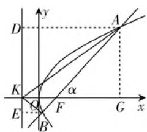

# 从“平几法切入”谈解析几何的备考策略

# ● 安徽省界首第一中学 赵 硕

在解析几何问题中,常用到平面几何的性质来处理问题.巧妙借助相关的平面几何性质,抓住题设中图形特征和数量关系,确定点、直线、角等的图形或方程,实现有效转化,得到简洁而巧妙的解法.

# 一、问题呈现

问题 （2021届广东省佛山市普通高中教学质量检测高三数学·15）已知抛物线 $C: y^{2} = 2px (p > 0)$ 的焦点为 F，准线交 x 轴于点 K，过 F 作倾斜角为 $\alpha$ 的直线与 C 交于 A, B 两点，若 $\angle AKB = 60^{\circ}$ ，则 $\sin \alpha =$ \_\_\_\_.

此题以抛物线为问题背景,结合抛物线的方程以及焦点、准线,通过过焦点的直线与抛物线的位置关系来合理设置,利用给出的已知角来求解相关直线的倾斜角的正弦值.问题简洁,内涵丰富,变化多端.

# 二、问题破解

解法1:(解析几何转化法)由于直线AB的斜率可能不存在但不会为0,则可设直线 $AB:x=my+\frac{p}{2}(m\in\mathbb{R}),A(x_{1},y_{1}),B(x_{2},y_{2})$ ,则 $x_{1}>0,x_{2}>0$ .

由 $\left\{\begin{aligned}x&=my+\frac{p}{2},\\ y^{2}&=2px,\end{aligned}\right.$ 可得 $y^{2}-2mpy-p^{2}=0,$

可知 $y_{1} + y_{2} = 2mp, y_{1}y_{2} = -p^{2}$ .

$$
\begin{array}{r l} & {\text {而} K \left(- \frac {p}{2}, 0\right), \text {则有} \overrightarrow {K A} = \left(x _ {1} + \frac {p}{2}, y _ {1}\right) = (m y _ {1}} \\ & {+ p, y _ {1}), \overrightarrow {K B} = \left(x _ {2} + \frac {p}{2}, y _ {2}\right) = (m y _ {2} + p, y _ {2}),} \end{array}
$$

可得 $\overrightarrow{KA} \cdot \overrightarrow{KB} = (my_1 + p)(my_2 + p) + y_1y_2 = (m^2 + 1)y_1y_2 + mp(y_1 + y_2) + p^2 = m^2p^2,$

$$
\begin{array}{r l} & {\mid \overrightarrow {K A} \mid^ {2} = (m y _ {1} + p) ^ {2} + y _ {1} ^ {2} = (m ^ {2} + 1) y _ {1} ^ {2} + 2 m p y _ {1}} \\ & {+ p ^ {2} = (m ^ {2} + 1) y _ {1} ^ {2} + (y _ {1} + y _ {2}) y _ {1} - y _ {1} y _ {2} = (m ^ {2} +} \\ & {2) y _ {1} ^ {2}.} \end{array}
$$

同理可得 $|\overrightarrow{KB}|^2 = (m^2 + 2)y_2^2$ ，所以 $|\overrightarrow{KA}|\cdot |\overrightarrow{KB}| = (m^2 + 2)|y_1y_2| = (m^2 + 2)p^2$ .

由于 $\overrightarrow{KA} \cdot \overrightarrow{KB} = |\overrightarrow{KA}| |\overrightarrow{KB}| \cos 60^\circ$ ,

可得 $m^2 p^2 = \frac{1}{2} (m^2 + 2)p^2$ ，解得 $m^2 = 2$

即 $\tan^2\alpha = \frac{1}{m^2} = \frac{1}{2}$ ，所以 $\sin \alpha = \sqrt{\sin^2\alpha} =$

$$
\sqrt {\frac {\sin^ {2} \alpha}{\sin^ {2} \alpha + \cos^ {2} \alpha}} = \sqrt {\frac {\tan^ {2} \alpha}{\tan^ {2} \alpha + 1}} = \sqrt {\frac {\frac {1}{2}}{\frac {1}{2} + 1}} = \frac {\sqrt {3}}{3}.
$$

故填答案: $\frac{\sqrt{3}}{3}$ .

点评:通过设出直线方程,再与抛物线方程联立,利用函数与方程思想的转化,结合韦达定理的应用,通过平面向量的数量积公式的转化与应用来确定相关参数的值,再利用三角函数的相关公式来转化与运算.

解法 2: (平面几何转化法) 如图1所示, 不妨设点A在第一象限, 过A, B分别作抛物线C的准线的垂线, 垂足分别为D, E, 此时倾斜角 $\alpha$ 为锐角, 过A作 $AG \perp x$ 轴, 垂足为G. 根据抛物线的定义, 可得$|AF|=|AD|$ , $|BF|=|BE|$ ，而 $\tan\angle AKF=\frac{|AG|}{|KG|}=\frac{|AG|}{|AD|}=\frac{|AF|\sin\alpha}{|AF|}=\sin\alpha$ 。同理可得 $\tan\angle BKF=\sin\alpha$ ，所以 $\tan\angle AKF=\tan\angle BKF=\sin\alpha$ ，即 $\angle AKF=\angle BKF=\frac{1}{2}\angle AKB=30^{\circ}$ ，所以 $\sin\alpha=\tan30^{\circ}=\frac{\sqrt{3}}{3}$ 。

text_image

y
D
A
K
α
E
Q
F
G
x
B

图1

故填答案: $\frac{\sqrt{3}}{3}$ .

点评:借助平面几何知识,利用几何直观,结合平面几何中相关辅助线的构造,通过抛物线的定义的转化,利用解直角三角形的相关知识加以转化,得到 $\tan\angle AKF=\sin\alpha$ 和两个角相等的结论,为进一步求值提供条件.平面几何方法研究解析几何问题,也为问题的进一步拓展与提升指明方向.

# 三、方法提炼

在解决一些与长度、角度等有关的解析几何问题时，可以充分挖掘点、线、角等的几何性质，借助平面几何性质，实现解析几何问题的直观化，多一些几何直观，少一些代数运算，“形”与“数”有机结合，从而可以迅速获得解题途径，减少解析几何问题的运算量，有效拓展解题思路，缩小思维步骤，优化解题过程，提升数学能力，培养核心素养.

# 四、探究结论

# 1. 解题总结

探究 1: 根据以上问题的平面几何转化法的破解过程, 归纳可得以下一般性的结论.

结论1: 已知抛物线 $C: y^{2} = 2px (p > 0)$ 的焦点为 F，准线交 x 轴于点 K，过 F 作倾斜角为 $\alpha$ 的直线与 C 交于 A, B 两点，则 $\sin \alpha = \tan \angle AKF = \tan \angle BKF$ .

# 2. 拓展提升

探究 2: 根据以上问题的破解过程, 对于在抛物线的对称轴上关于原点对称的点 F 与点 K, 有 $\angle AKF = \angle BKF$ 恒成立. 将问题进一步推广, 可得以下一般性的结论.

结论2:已知点 $M(a,0)$ , $N(-a,0)(a\neq0)$ 与抛物线 $C:y^{2}=2px(p>0)$ ，过点M作与x轴不平行的直线l交抛物线C于A,B两点，则直线MN平分 $\angle ANB$ ，即 $\angle MNA=\angle MNB$ .

证明:由于直线 l 的斜率可能不存在但不会为 0, 则可设直线 $l: x = my + a (m \in \mathbb{R}), A(x_{1}, y_{1}), B(x_{2}, y_{2})$ , 则 $x_{1} > 0, x_{2} > 0$ .

由 $\left\{ \begin{array}{l} x = my + a, \\ y^2 = 2px, \end{array} \right.$ 可得 $y^2 - 2mpy - 2ap = 0$

可知 $y_{1} + y_{2} = 2mp, y_{1}y_{2} = -2ap$ ，直线 $AN, BN$ 的斜率之和为

$$
\begin{array}{l} k _ {A N} + k _ {B N} = \frac {y _ {1}}{x _ {1} + a} + \frac {y _ {2}}{x _ {2} + a} \\ = \frac {x _ {2} y _ {1} + x _ {1} y _ {2} + a (y _ {1} + y _ {2})}{(x _ {1} + a) (x _ {2} + a)}. \tag {①} \\ \end{array}
$$

将 $x_{1} = my_{1} + a, x_{2} = my_{2} + a$ 及 $y_{1} + y_{2} = 2mp$ , $y_{1}y_{2} = -2ap$ 代入 ① 式分子，可得 $x_{2}y_{1} + x_{1}y_{2} + a(y_{1} + y_{2}) = 2my_{1}y_{2} + 2a(y_{1} + y_{2}) = 2m \cdot (-2ap) + 2a \cdot 2mp = 0,$

所以 $k_{AN} + k_{BN} = 0$ ，即 $\angle MNA = \angle MNB$ ，亦即直线 MN 平分 $\angle ANB$ 。

点评:利用该结论来求解以上问题,更加简单快

捷. 其实, 该结论的证明与应用也在高考中出现过.

链接高考:(2018年高考数学全国卷Ⅰ文科第20题)设抛物线 $C:y^{2}=2x$ ，点 $A(2,0)$ ， $B(-2,0)$ ，过点A的直线l与C交于M,N两点.

(1) 当 $l$ 与 $x$ 轴垂直时, 求直线 $BM$ 的方程;  
(2) 证明: $\angle ABM = \angle ABN$ .

探究 3: 对于结论 2, 改变圆锥曲线的类型, 在椭圆与双曲线问题中, 也有类似的直线平分角的结论.

结论3:已知点 $M(m,0)$ , $N(n,0)(mn=a^{2})$ 与椭圆 $C:\frac{x^{2}}{a^{2}}+\frac{y^{2}}{b^{2}}=1(a>b>0)$ ，过点M作与x轴不平行的直线l交椭圆C于A,B两点，则直线MN平分 $\angle ANB$ ，即 $\angle MNA=\angle MNB$ .

结论4:已知点 $M(m,0)$ , $N(n,0)(mn=a^{2})$ 与双曲线 $C:\frac{x^{2}}{a^{2}}-\frac{y^{2}}{b^{2}}=1(a>0,b>0)$ ，过点M作与x轴不平行的直线l交双曲线C于A,B两点，则直线MN平分 $\angle ANB$ ，即 $\angle MNA=\angle MNB$ .

以上两个结论的证明可以参考结论2的证明方法来处理,这里不再赘述.

# 五、备考策略

通过对一道抛物线模拟题的思路剖析、方法提炼以及探究结论，对高三高考备考教学提出以下几点建议：

# 1. 注重解析几何基础知识、基本方法的落实和基本思路方法的提炼

解析几何问题既有平面几何的内涵,又有直角坐标的实质,在破解解析几何的相关问题中,经常可以通过平面几何知识加以直观分析,也可以通过解析几何知识从坐标角度来转化与运算,都可以达到破解的目的.

合理归纳解析几何问题的破解方法,注意数学思想方法的提炼,才能将数学思想和数学问题相结合,合理应用数学思想指导数学解题,结合数学思想与数学情境,形成数学活动经验.

# 2. 加强备考中“一题多解”“一题多变”等方面的训练, 实现“一题多练”“一题多得”的效果

“一题多解”可以合理训练学生思维的发散性，“一题多变”可以合理培养学生的转向机智及思维的应变性，通过这方面的训练，没有仅仅停留在原有的解出题目的基础上，进一步深入拓展、提升，实现发散思维的变通性，数学知识与数学能力的综合应用，获得“一题多练”“一题多得”等良好效果。F