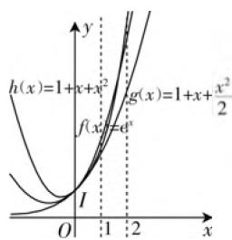

# 以导数为工具的不等式证明策略分析

——2020年高考数学浙江卷第22题赏析

● 浙江省宁波市鄞州中学 华婧

高考试题是按照课程标准,结合学生实际,符合高考的选拔性功能而命制的,新课标(2017年版)中强调数学教学的“四基”目标,对高考题目进行探讨、分析,逐步揭开问题的本质,能够帮助学生巩固基础知识,提高基本技能,体会基本思想并且经历数学过程,积累活动经验.

# 一、引言

导数是高考数学的重点和难点,往往会出现在对学生能力要求较高的压轴题中,2020年高考数学浙江卷第22题,延续往年的题型,考查了函数与导数的内容,题目设置了三小问,所涉及的知识点比较全面,层层递进,梯度明显,试题特点是入口易,出口难,既需要学生从宏观把握题目的结构,又需要学生具有微观处理各方面细节的能力,体现了对学生综合素养的考查.笔者重点分析第(2)问,第(1)问只做简要说明.

# 二、真题呈现

例 1 （2020 年高考数学浙江卷第 22 题）已知 $1 < a \leqslant 2$ ，函数 $f(x) = e^{x} - x - a$ ，其中 e = 2.71828…为自然对数的底数.

(1) 证明: 函数 $y = f(x)$ 在 $(0, +\infty)$ 上有唯一零点.  
(2) 记 $x_0$ 为函数 $y = f(x)$ 在 $(0, +\infty)$ 上的零点，证明：  
(i) $\sqrt{a - 1} \leqslant x_0 \leqslant \sqrt{2(a - 1)}$ ;   
(Ⅱ) $x_{0}f(e^{x_{0}})\geqslant(e-1)(a-1)a.$

# 三、审题破题

第(1)问是对零点存在性定理的典型应用,需结合单调性说明零点的个数,设问简洁直观,直指核心概念、定理,突出对学生的知识积累和基本素养的考查.同时也为第二问的证明打下基础.

第(2)问第(i)小题,在上一问中,能够得到0<

$x_0 < 2$ ，而这里要证明的 $\sqrt{a - 1} \leqslant x_0 \leqslant \sqrt{2(a - 1)}$ 中， $0 < \sqrt{a - 1} \leqslant 1, 0 < \sqrt{2(a - 1)} \leqslant \sqrt{2}$ ，所以要进一步来精确零点的范围，可以考虑的方向有：(1) 利用零点存在性定理和单调性，只要证明 $f(\sqrt{a - 1}) \leqslant 0, f[\sqrt{2(a - 1)}] \geqslant 0$ 即可；(2) 利用零点的定义， $f(x_0) = e^{x_0} - x_0 - a = 0$ ，通过消元转化成单变量的不等式证明问题.

第(2)问第(ii)小题,由前面两问我们得到函数 $y=f(x)$ 在 $(0,+\infty)$ 上有唯一零点 $x_{0}$ 且满足 $\sqrt{a-1}\leqslant x_{0}\leqslant\sqrt{2(a-1)}$ ,最后一问证明不等式 $x_{0}f(e^{x_{0}})\geqslant(e-1)(a-1)a$ ,即 $x_{0}(e^{x_{0}}-e^{x_{0}}-a)\geqslant(e-1)(a-1)a$ .

不等式的左边看起来非常复杂,利用零点所满足的等式 $e^{x_{0}} = x_{0} + a$ 可以把指数式换成一次式,简化运算.

# 四、解题优化

(1) 证明: $f'(x) = \mathrm{e}^x - 1$ , 当 $x > 0$ 时, $\mathrm{e}^x > 1$ , 所以 $f'(x) > 0$ , 故 $f(x)$ 在 $(0, +\infty)$ 上单调递增, $f(0) = 1 - a < 0$ . 又因为 $1 < a \leqslant 2$ , 得 $f(2) = \mathrm{e}^2 - 2 - a \geqslant \mathrm{e}^2 - 4 > 0$ , 所以由零点存在定理得 $f(x)$ 在 $(0, +\infty)$ 上有唯一零点.  
(2)(i) 证法1: 由第(1)问知, 函数 $f(x)$ 在 $(0, +\infty)$ 上单调递增, 只需证明 $f(\sqrt{a-1}) \leqslant 0$ , $f[\sqrt{2(a-1)}] \geqslant 0$ , $f(\sqrt{a-1}) = e^{\sqrt{a-1}} - \sqrt{a-1} - a$ , 设 $g(x) = e^{\sqrt{x-1}} - \sqrt{x-1} - x$ , $x \in (1,2]$ , $g'(x) = \frac{e^{\sqrt{x-1}} - 1 - 2\sqrt{x-1}}{2\sqrt{x-1}}$ . 设 $u(x) = e^{\sqrt{x-1}} - 1 - 2\sqrt{x-1}$ , $u(1) = 0$ , $u(2) = e - 3 < 0$ , $u'(x) = \frac{e^{\sqrt{x-1}} - 2}{2\sqrt{x-1}}$ , 从而 $u(x)$ 在 $(1, (\ln 2)^2 + 1)$ 内单调递减, 在 $((\ln 2)^2 + 1, 2]$ 内单调递增, 故 $u(x) < 0$ , 所以 $g(x)$ 在 $(1, 2]$ 内单调递减, 故 $g(x) < g(1) = 0$ , 所以

$$
f (\sqrt {a - 1}) <   0.
$$

另一方面， $f[\sqrt{2(a - 1)}] = \mathrm{e}^{\sqrt{2(a - 1)}} - \sqrt{2(a - 1)} - a$ ，设 $h(x) = \mathrm{e}^{\sqrt{2(x - 1)}} - \sqrt{2(x - 1)} - x, x \in (1,2]$ ， $h(1) = 0, h'(x) = \frac{\mathrm{e}^{\sqrt{2(x - 1)}} - 1 - \sqrt{2(x - 1)}}{\sqrt{2(x - 1)}}$ ，设 $v(x) = \mathrm{e}^{\sqrt{2(x - 1)}} - 1 - \sqrt{2(x - 1)}, v'(x) = \frac{\mathrm{e}^{\sqrt{2(x - 1)}} - 1}{\sqrt{2(x - 1)}}$ ，从而 $v(x)$ 在 $(1,2]$ 上单调递增，故 $v(x) > v(1) = 0$ ，所以 $h(x)$ 在 $(1,2]$ 上单调递增，故 $h(x) > h(1) = 0$ ，即 $f(\sqrt{2(a - 1)}) > 0$ ，结合第一问的单调性得 $\sqrt{a - 1} \leqslant x_0 \leqslant \sqrt{2(a - 1)}$ 。

反思: 构造函数, 证法1利用导数来证明不等式恒成立, 可是所构造的函数比较复杂, 把 $\sqrt{a-1}$ 和 $\sqrt{2(a-1)}$ 进行整体换元可以优化解题过程.

证法2:对于 $f(\sqrt{a-1})=\mathrm{e}^{\sqrt{a-1}}-\sqrt{a-1}-a$ 和 $f[\sqrt{2(a-1)}]=\mathrm{e}^{\sqrt{2(a-1)}}-\sqrt{2(a-1)}-a$ ，其中 $0<\sqrt{a-1}\leqslant1,0<\sqrt{2(a-1)}\leqslant\sqrt{2}$ 可整体处理.设 $g(x)=\mathrm{e}^{x}-x-x^{2}-1,x\in(0,1],h(x)=\mathrm{e}^{x}-x-\frac{x^{2}}{2}-1,x\in(0,\sqrt{2}]$ ，对于 $g(x)=\mathrm{e}^{x}-x-x^{2}-1,x\in(0,1],g'(x)=\mathrm{e}^{x}-1-2x,g''(x)=\mathrm{e}^{x}-2$ ，从而 $g'(x)$ 在 $(0,\ln2)$ 上单调递减，在 $(\ln2,1)$ 上单调递增， $g'(0)=0,g'(1)=\mathrm{e}-3$ ，故 $g'(x)<0$ ，所以 $g(x)$ 在 $(0,1]$ 上单调递减，故 $g(x)<g(0)=0$ ，所以 $f(\sqrt{a-1})=g(\sqrt{a-1})<0$ .

另一方面，对于 $h(x) = \mathrm{e}^{x} - x - \frac{x^{2}}{2} - 1, x \in (0, \sqrt{2}], h'(x) = \mathrm{e}^{x} - 1 - x > 0$ ，所以 $h(x)$ 在 $(0, \sqrt{2}]$ 上单调递增，故 $h(x) > h(0) = 0$ ，即 $h(\sqrt{2(a - 1)}) = f(\sqrt{2(a - 1)}) > 0.$

反思:两种思路最终都将归结于利用导数证明不等式,所构造的函数也是类似的.

(ii) 证明：由题意得 $\mathrm{e}^{x_0} = x_0 + a, x_0 f(\mathrm{e}^{x_0}) = x_0 f(x_0 + a) = x_0 (\mathrm{e}^{x_0 + a} - x_0 - 2a) = x_0[(\mathrm{e}^a - 1)x_0 + a(\mathrm{e}^a - 2)] \geqslant \sqrt{a - 1}[(\mathrm{e}^a - 1)\sqrt{a - 1} + a(\mathrm{e}^a - 2)] = (\mathrm{e}^a - 1)(a - 1) + a\sqrt{a - 1}(\mathrm{e}^a - 2)$ ，因此只需证明不等式 $(\mathrm{e}^a - 1)(a - 1) + a\sqrt{a - 1}(\mathrm{e}^a - 2) \geqslant (\mathrm{e} - 1)(a - 1)a$ 。这个关于 $a$ 的不等式，结构复杂，笔者提供以下两种处理办法。

方法1: 当 $1 < a \leqslant 2$ 时, $e^{a} > a + 1$ , 所以 $(e^{a} - 1)(a - 1) + a\sqrt{a - 1}(e^{a} - 2) > a(a - 1) + a\sqrt{a - 1}(e^{a} - 2)$ , 则只要证明不等式 $a(a - 1) +$

$a\sqrt{a - 1} (\mathrm{e}^a -2) > a(a - 1)(\mathrm{e} - 1)$ ，即 $\sqrt{a - 1} (\mathrm{e}^a -$ $2) > (a - 1)(\mathrm{e} - 2)$ ，由 $\sqrt{a - 1}\geqslant a - 1,\mathrm{e}^a >\mathrm{e}$ 得证.

反思：若进行如下放缩： $(\mathrm{e}^a -1)(a - 1) + a\sqrt{a - 1} (\mathrm{e}^a -2) > a(a - 1) + a\sqrt{a - 1} (a - 1)$ 无法得到要证明的结论，因此做出调整：只放缩第一个 $\mathbf{e}^{\alpha}$

方法2: 当 $1 < a \leqslant 2$ 时, $\sqrt{a - 1} \geqslant a - 1$ , 所以 $(e^{a} - 1)(a - 1) + a\sqrt{a - 1}(e^{a} - 2) \geqslant (e^{a} - 1)(a - 1) + a(a - 1)(e^{a} - 2) = (a - 1)[(e^{a} - 1) + a(e^{a} - 2)]$ , 只需证 $(e^{a} - 1) + a(e^{a} - 2) \geqslant (e - 1)a$ , 设 $u(a) = (e^{a} - 1)(1 + a) - ae, u'(a) = (e^{a} - 1) + (1 + a)e^{a} - e = (2 + a)e^{a} - e - 1 > 3e - e - 1 > 0$ , 所以 $u(a)$ 在 $a \in (1, 2]$ 内单调递增, 故 $u(a) > u(1) = e - 2 > 0$ , 即 $(e^{a} - 1) + a(e^{a} - 2) > (e - 1)a$ , 故原不等式成立.

# 五、反思挖掘

解后的反思不仅能有效地帮助学生巩固知识技能,而且对提高学生思维品质有特殊功效.第二问的两小问都是不等式的证明,其中第(i)题的两种思路都转化为证明两个不等式:

$$
\left\{ \begin{array}{l} \mathrm{e} ^ {x} - x ^ {2} - x - 1 \leqslant 0 (0 <   x <   1), \\ \mathrm{e} ^ {x} - \frac {x ^ {2}}{2} - x - 1 \geqslant 0 (0 <   x <   2). \end{array} \right.
$$

其本质其实是将函数 $y = \mathrm{e}^x$ 在一定范围内向两个方向分别放缩成二次函数 $y = x^2 + x + 1$ 和 $y = \frac{x^2}{2} + x + 1$ ，其中后者由 $\mathrm{e}^x$ 在 $x = 0$ 处的泰勒展开保留三项得到。三个函数的图象关系如下：

第(ii)题分别利用了当1 $<a\leqslant2$ 时, $e^{a}>a+1,e^{a}>ea,e^{a}>(e-1)a+1$ ,实则是利用了指数函数 $y=e^{x}$ 在x=0,x=1处的切线,以及经过两点(0,1)和点(1,e)的割线,它们之间的关系如图1所示,“以直代曲”就是在一段

text_image

h(x)=1+x+x²
f(x)=e^x
g(x)=1+x+\frac{x²}{2}
I
O
1
2
x
y

图 1

较小的范围内,用直线近似曲线是研究一些超越函数的重要方法.利用导数证明不等式的一般策略有:构造差函数,切线放缩,割线放缩,泰勒展开放缩等.

布鲁纳在《教育过程》的“结构的重要性”中谈到希望学生的学习从“特殊”迁移上升到“原理和态度”的迁移，在数学学习中，我们应该注重从“知识的积累”上升到“处理问题的一般方法”，挖掘背后蕴含的丰富思想，形成看问题的基本观点。F