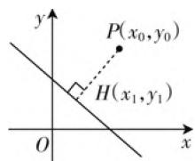
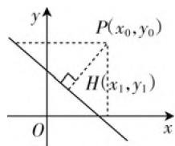

# 例谈优化高中数学例题教学的策略

# 江苏省灌云县第一中学 刘昌来

例题教学是教学基础知识和基本技能的核心要素, 是中学数学教学中至关重要的一种课型, 不仅可以起到夯实基础知识和点拨解题思维的效能, 还能指引学生学会思考、学会学习, 同时是学好数学的最重要的一环. 教师应从当前教学内容出发, 从学生的具体学情和教学要求出发, 设计行之有效的例题教学策略, 使得高中数学例题教学可以满足学生的学习需求, 推动高中数学教学水平的不断提升. 而当前教学中, 学生对例题掌握不牢、理解不透的不良现象比比皆是. 如何突破这一教学难点呢? 本文结合教学实践从“明确数学思想, 找准教学起点”“运用例题变式, 找对教学策略”两个方面进行阐述.

# 一、明确数学思想，找准教学起点

教学中仅仅关注表层知识的传授,而不注重数学思想方法渗透则无法拔高学生的知识水平和思维水平.反之,若找准例题教学的起点,将数学思想方法的渗透融入概念教学之中,则可以让例题教学更高效.因此,作为执教者,教师要善于挖掘例题的潜在功能,精心组织教学过程,让学生经历方法活动的过程,让思想与方法“珠联璧合”,并将创新思维与探究精神寓于教学之中,帮助学生领略深层知识的本质,获得深层次的体验,从而让例题教学卓有成效.

例 1 已知平面内的一点 $P(x_{0}, y_{0})$ 与一直线 l: Ax + By + C = 0，试求出点 P 到直线 l 的距离 d.

生1:如图1,过点P作直线l的垂线,并求出垂足H,再借助两点间的距离公式计算“d=PH”.

text_image

y
P(x₀,y₀)
H(x₁,y₁)
O
x

图1

师:其他同学认为此方法可行吗?操作起来感觉如何?

生 2: 非常烦琐! (不少学生附和)

师:你是如何感知到此方法的烦琐的?

生 2: 由课本例子得出的啊! (部分学生开始翻看课本, 也有一些学生不动声色, 由此可见, 大部分学生在课前预习环节中并没有真正意义上去动手实践, 而是走马观花般预习了一番)

师:在预习的过程中,你们已经感知到了此推导方式的烦琐和复杂.那就让我们一起来看一看到底有多烦琐?(教师以 PPT 的形式展示求解过程,同时予以解释)

根据定义，点 $P$ 到直线 $l$ 的距离就是点 $P$ 到直线 $l$ 的垂线段长度，设经过点 $P$ 的直线 $l$ 的垂线是 $l'$ ，垂足是 $H$ ，则 $l'$ 的方程为 $y - y_0 = \frac{B}{A} (x - x_0)$ ，与 $l$ 联立方程组，可解得交点坐标为 $H\left(\frac{B^2x_0 - ABy_0 - AC}{A^2 + B^2}, \frac{A^2y_0 - ABx_0 - BC}{A^2 + B^2}\right)$ .

$$
\begin{array}{l} \left(\frac {A ^ {2} y _ {0} - A B x _ {0} - B C}{A ^ {2} + B ^ {2}} - y _ {0}\right) ^ {2} \\ = \left(\frac {- A ^ {2} x _ {0} - A B y _ {0} - A C}{A ^ {2} + B ^ {2}}\right) ^ {2} + \left(\frac {- B ^ {2} y _ {0} - A B x _ {0} - B C}{A ^ {2} + B ^ {2}}\right) ^ {2} \\ = \frac {A ^ {2} (A x _ {0} + B y _ {0} + C) ^ {2}}{(A ^ {2} + B ^ {2}) ^ {2}} + \frac {B ^ {2} (A x _ {0} + B y _ {0} + C) ^ {2}}{(A ^ {2} + B ^ {2}) ^ {2}} \\ = \frac {(A x _ {0} + B y _ {0} + C) ^ {2}}{A ^ {2} + B ^ {2}}, \\ \end{array}
$$

所以 $|PH|^2 = \left(\frac{B^2 - ABy_0 - AC}{A^2 + B^2} - x_0\right)^2 +$

可得 $d = PH = \frac{|Ax_0 + By_0 + C|}{\sqrt{A^2 + B^2}}.$

师:以上方法的运算的确烦琐,那谁有求距离的更简洁方式呢?

生 3: 可以通过等积法求解.
(如图 2)

师:很好!看来大家的预习非常有效,那我们一起来推导一下.

text_image

y
P(x₀,y₀)
H(x₁,y₁)
O
x

图2

●●●●●●

（就这样，通过分类讨论，教师和学生一起完成了推导的过程）

设计意图:上例中,教师抛出例题,全体学生在课前的预习中对教材中的知识已经有了一定的认识,从而学生的回答也是在教师的预设之中.期间以学生的预习情况为导向,教师的主导地位和学生的主体地位交相辉映,牢牢抓住学生的思维火花不断渗透数学思想,学生共同体会到分类讨论、转化与化归和从特殊到一般的数学思想方法,获得成功的体验.同时,本例的教学还具有承上启下的效能,采用一系列的设问、启发和发现,逐步呈现知识的本质,并灵活运用多媒体来展示和交流,以此突破本课的教学难点,这样的教学策略是基于学生认知规律的,是学生更易接受的.

# 二、运用例题变式，找对教学策略

在例题教学中,营造一种生动、活泼、宽松的学习氛围,适当地为学生提供独立思考和质疑问难的时间和空间,可以为发散思维的培养创造良好的环境.笔者认为,合理而恰当的变式可以激发学生的情趣,让学生经历思维活动,开阔学生的视野,培养学生的探究精神和创新思维.

# 1. 一题多解, 助力学生创新思维的形成

数学教材中呈现的例题解法很多时候并非最优化的、最简洁的，而是一般性解题思路。倘若教师在例题教学中仅仅是“照本宣科”，则无法真正意义上训练学生的思维。因此，教学中教师应准确预估学生的认知结构和学习起点，在恰当时候为学生搭建适宜的思维平台，鼓励学生一题多解，助力学生逐步形成创新思维能力。

例 2 证明: $1^{2} + 2^{2} + 3^{2} + \cdots + n^{2} = \frac{n(n+1)(2n+1)}{6}$ .

抛出该例时,预设学生在思考的过程中,首先会慢慢在心理上感觉课本解法的“麻烦”,接着就会产生寻找最优解法的愿望和结果.事实上,在课堂上,刚刚进行解说,有一名学生直接说道:“这样的解法也太繁了吧!”这句话直接倒出了一题多解的魅力.

笔者认为，一题多解最好不是由教师直接发出来的“指令”，而是学生内心自发的需求。这是学生认可一题多解的好机会，把握好这一机会，需要教师为学生创造足够好的氛围。所以，笔者给足学生探究的时间，使其产生优化解法的愿望。于是，笔者又抛出以下问题进行思维点拨：“那我们试着来证明不等式： $1+\frac{1}{\sqrt{2}}+\frac{1}{\sqrt{3}}+\cdots+\frac{1}{\sqrt{n}}<2\sqrt{n}$ ”，从而为学生提供了开放的空间，学生很快得出“证明的关键在于证明不等式 $2\sqrt{k}+\frac{1}{\sqrt{k+1}}<2\sqrt{k+1}(k\in\mathbf{N}^{*})$ ”，就这样创造了回到具体的氛围，学生此时的回答让笔者甚是欣慰,诸如“利用比较法证明”“运用基本不等式法予以证明”“借助拼凑放缩法证明”等.

设计意图:对学生思维能力的培养要求极高,并非一节课就能形成.教师心中装载着“一般解法”和“简洁解法”的辩证关系,充分为学生提供体验的机会,使学生经历火热的思考,切实感到一题多解的魅力,并形成优化解法的思维升华,数学创新思维的培养便落地生根了.

# 2. 一题多变, 让学生“穿行”于各类习题之间

深入研究近年来的高考试卷, 不难发现, 不少试题都源于课本却高于课本, 相当一部分试题是从课本例习题变式而来的. 从而, 在例题教学中一题多变的训练不可或缺, 或变换题设条件, 或变换题目结论、或增减题中的条件等, 引导学生多角度和多层次的探究, 使其在“变”中比较, 在“变”中感悟不变的规律, 提升思维的创造性, 最终逐渐能在各类习题之间自如地“穿行”.

例 3 已知 $f(x)$ 为奇函数, 且在 $(0, +\infty)$ 上为增函数, 则 $f(x)$ 在 $(-∞, 0)$ 上为 \_\_\_\_.

本例的难度不大,学生解决起来较为轻松,很快得出“增函数”这一结论.进一步地,笔者进行如下变式:

变式1:已知 $f(x)$ 为奇函数,且在 $(0,+\infty)$ 上为减函数,则 $f(x)$ 在 $(-\infty,0)$ 上为\_\_\_\_.

变式2:已知 $f(x)$ 为偶函数,且在 $(0,+\infty)$ 上为增函数,则 $f(x)$ 在 $(-∞,0)$ 上为\_\_\_\_.

思考:综合以上问题和结论,可以得出什么规律?

设计意图:数学教学中,学生思维能力的培养方式是多渠道的,方法是多样化的,而例题变式是最便捷,也是最有效的方式之一.以上案例中,教师以一道题引出一组题,将学生的思维逐步引向深入,深化学生的理解,培养学生的解题能力.同时,一题多变的训练,还可以抑制“题海战术”,达到“以少胜多”的效能.

# 三、简要结语

数学教学中传授的数学知识相对固定,而教师传授的方法却是非固定的.它随着教师的预设目标的不同,教学经验的不同,对数学知识的理解不同,对学生认知的把握不同,存在着多种不同的选择余地.而不同的教学策略对于学生思维能力和创新能力发展的结构迥然有别.因此,例题教学中,教师需根据教学内容的具体特征,学生心理活动的特点,找准教学起点,找对教学策略,渗透数学思想,运用例题变式,形成优化的数学例题教学策略,全面而有效地提升学生的数学思维,真正意义上优化例题教学.