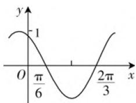

# 借助分类讨论,妙破三角函数

# ● 北京工业大学附属中学 肖志军

分类讨论思想是中学数学中最重要的解题思想方法之一,主要针对含参的数学问题,对参数进行必要的分类讨论,训练人的思维条理性和概括性,具有明显的逻辑性、综合性、探索性、创新性等.特别地,在三角函数问题中,由于三角函数值、参数问题、三角函数的图象与性质以及三角函数的综合交汇问题的特性,经常会涉及分类讨论思想,借助分类讨论思想来分析与破解相应的三角函数问题.

# 一、三角函数值的分类讨论

例1 已知 $\cos \theta = m, |m| \leqslant 1$ ，求 $\sin \theta, \tan \theta$ 的值.

分析: 涉及已知角的余弦值为字母时, 注意对字母是否为 0、±1 及分象限作分类讨论, 讨论标准要统一, 不要出现重复或遗漏.

解:(1) 当 m=0 时, $\theta=2k\pi\pm\frac{\pi}{2},k\in Z;$

当 $\theta = 2k\pi +\frac{\pi}{2}$ 时， $\sin \theta = 1,\tan \theta$ 不存在；

当 $\theta = 2k\pi -\frac{\pi}{2}$ 时， $\sin \theta = -1,\tan \theta$ 不存在.

(2) 当 m=1 时， $\theta=2k\pi, k\in Z, \sin\theta=\tan\theta=0;$ 当 m = -1 时， $\theta=2k\pi+\pi, k\in Z, \sin\theta=\tan\theta=0.$   
(3) 当 $\theta$ 在第一、二象限时， $\sin\theta=\sqrt{1-m^{2}}$ ， $\tan\theta=\frac{\sqrt{1-m^{2}}}{m}$ .  
(4) 当 $\theta$ 在第三、四象限时， $\sin\theta=-\sqrt{1-m^{2}}$ ， $\tan\theta=-\frac{\sqrt{1-m^{2}}}{m}.$

点评: 涉及三角函数值问题, 体现在三角函数值受角所在象限的影响, 在不同的象限有不同的三角函数值, 因此就应根据求值或求角的需要对角的范围或参数的范围展开有序的讨论.

# 二、参数问题的分类讨论

例2 设常数 $a \geqslant 0$ ，若函数 $f(x) = \cos^2 x - a\sin$ $x + b$ 的最大值与最小值分别为 $0, -4$ , 试求实数 $a$ 与 $b$ 的值, 并求出使函数 $f(x)$ 取得最大值与最小值时的自变量 $x$ 的值.

分析:通过相关三角函数的等式进行恒等变形,利用三角函数的取值范围以及参数的取值情况加以分类讨论,结合题目条件加以分类讨论,从而确定相应的参数值问题.

解：原函数恒等变形可得 $f(x) = -\left(\sin x + \frac{a}{2}\right)^2 + 1 + b + \frac{a^2}{4}$ ，由于 $-1 \leqslant \sin x \leqslant 1, a \geqslant 0$ ，则

(1) 当 $0 \leqslant a \leqslant 2$ 时, 当 $\sin x = -\frac{a}{2}$ 时,

$$
f (x) _ {\max} = 1 + b + \frac {a ^ {2}}{4} = 0, \quad ①
$$

当 $\sin x = 1$ 时， $f(x)_{\min} = -\left(1 + \frac{a}{2}\right)^2 + 1 + b + \frac{a^2}{4} = -a + b = -4.$ ②

联立 ①② 式解得 a=2, b=-2.

(2) 当 $a > 2$ 时, 当 $\sin x = -1$ 时,

$$
f (x) _ {\max} = a + b = 0, \quad ③
$$

当 $\sin x = 1$ 时， $f(x)_{\min} = -a + b = -4.$ ④

联立 ③④ 式解得 $a = 2$ (由于 $a > 2$ , 舍去), $b = -2$ .

综上分析,可得 a=2,b=-2.

此时函数 $f(x)$ 取得最大值与最小值时的自变量 $x$ 的值分别为 $x = 2k\pi - \frac{\pi}{2} (k \in \mathbf{Z})$ , $x = 2k\pi + \frac{\pi}{2} (k \in \mathbf{Z})$ .

点评:对于三角函数中的参数问题,必须结合题目的相关条件与三角函数相关公式加以分类讨论,通过参数值与最值问题的分析与解决,特别是对参数不确定时可采用分类讨论加以分析与判断.

# 三、三角函数性质的分类讨论

例3（2020年高考数学天津卷第8题）已知函数

$f(x) = \sin \left(x + \frac{\pi}{3}\right)$ . 给出下列结论：

① $f(x)$ 的最小正周期为 $2\pi$ ;

② $f\left(\frac{\pi}{2}\right)$ 是 $f(x)$ 的最大值；

③ 把函数 $y = \sin x$ 的图象上所有点向左平移 $\frac{\pi}{3}$ 个单位长度，可得到函数 $y = f(x)$ 的图象.

其中所有正确结论的序号是( ).

A. ①

B. ①③

C. ②③

D. ①②③

分析: 利用三角函数中正弦型函数的图象与性质, 包括函数的周期性、最值以及三角函数图象的平移变换等, 结合各选项所涉及的内容加以分类讨论, 从而得以逐一判断即可.

解:对于函数 $f(x)=\sin\left(x+\frac{\pi}{3}\right)$ ，其最小正周期为 $2\pi$ ，则①正确；

而 $f\left(\frac{\pi}{2}\right) = \sin \left(\frac{\pi}{2} +\frac{\pi}{3}\right) = \frac{1}{2}$ 不是 $f(x)$ 的最大值，则②错误；

把函数 $y = \sin x$ 的图象上所有点向左平移 $\frac{\pi}{3}$ 个单位长度，可得 $y = \sin \left(x + \frac{\pi}{3}\right)$ ，即为 $y = f(x)$ 的图象，则③正确.

点评:对于三角函数中的性质问题,包括周期性、奇偶性、最值等,经常综合三角函数的图象加以综合来分类讨论,特别是正弦型函数或余弦型函数的基本性质与应用等,都是高考考查的重点.

# 四、三角函数图象的分类讨论

例4（2020年高考数学新高考I卷(山东卷)第10题，新高考Ⅱ卷(海南卷)第11题)图1是函数 $y = \sin (\omega x + \varphi)$ 的部分图象，则 $\sin (\omega x + \varphi) =$ （ ）.

line

| x | y |
|---|---|
| 0 | -1 |
| π/6 | -1 |
| 2π/3 | -1 |

图1

A. $\sin \left(x + \frac{\pi}{3}\right)$

B. $\sin \left(\frac{\pi}{3} - 2x\right)$

C. $\cos \left(2x + \frac{\pi}{6}\right)$

D. $\cos \left(\frac{5\pi}{6} - 2x\right)$

分析:利用正弦型函数所对应的图象中给出的信息,结合分类讨论,结合三角函数的周期性、最值等性质来确定三角函数解析式中的相关参数,进而确定对应的解析式.

解:由函数图象可知, $\frac{T}{2}=\frac{2\pi}{3}-\frac{\pi}{6}=\frac{\pi}{2}$ ,

则 $\omega = \frac{2\pi}{T} = \frac{2\pi}{\pi} = 2$ ，所以排除选项A.

当 $x = \frac{\frac{2\pi}{3} + \frac{\pi}{6}}{2} = \frac{5\pi}{12}$ 时， $y = -1$

则 $2 \times \frac{5\pi}{12} + \varphi = \frac{3\pi}{2} + 2k\pi, k \in \mathbf{Z}$ ,

解得 $\varphi = \frac{2\pi}{3} + 2k\pi, k \in \mathbf{Z}$ ,

所以函数的解析式为

$$
y = \sin \left(2 x + \frac {2 \pi}{3} + 2 k \pi\right) = \sin \left(2 x - \frac {\pi}{3} + \pi\right)
$$

$$
= - \sin \left(2 x - \frac {\pi}{3}\right) = \sin \left(\frac {\pi}{3} - 2 x\right),
$$

或 $y = \sin \left(2x + \frac{2\pi}{3} + 2k\pi\right)$

$$
= \sin \left(2 x + \frac {\pi}{6} + \frac {\pi}{2}\right) = \cos \left(2 x + \frac {\pi}{6}\right);
$$

而 $\cos \left(2x + \frac{\pi}{6}\right) = \cos \left(2x - \frac{5\pi}{6} +\pi\right)$

$$
= - \cos \left(2 x - \frac {5 \pi}{6}\right) = - \cos \left(\frac {5 \pi}{6} - 2 x\right),
$$

排除选项 D.

故选 BC.

点评:根据三角函数图象的直观特征与数据信息,利用三角函数的图象与性质加以分析与转化,结合分类讨论,分别确定相应的周期、函数值等,并利用三角方程的求解来确定参数的取值情况,通过诱导公式加以合理转化,从而得以正确确定三角函数中相应的参数值,得以确定对应的三角函数的解析式.

在三角函数相关问题的求解中,我们要有意识地应用分类讨论的数学思想方法去分析问题和解决问题,巧妙用来解决三角函数的创新与应用问题,实现“化整为零,各个击破,再集零为整”的数学策略,实现分类讨论,形成数学能力,提升数学品质,培养数学核心素养,使自己具有数学头脑和眼光.