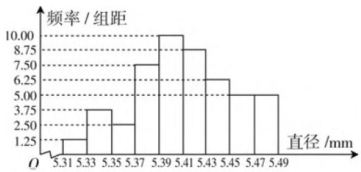

# 凸显基础 精准针对 命制多样

——谈高考数学多选题的命制研究

● 江苏省宜兴市丁蜀高级中学 赵平

2020年新高考数学试卷在题型上进行了创新性改革，引入了多选题这一创新性题型，给试卷带来了创新与多变的亮点。本文结合实例，就高考数学多选题的常见命制方式：相同知识块命题、不同知识块命题、一个数学对象属性以及相同条件下可推出的结论的多样性等角度加以剖析，给不同层次的学生提供了发挥空间，增加了得分机会，体现考试的区分与选拔等功能。

高考数学多选题的引入以及评分层次设置(全部选对的得5分,有选错的得0分,部分选对的得3分),给不同层次的学生提供了发挥空间,增加了得分机会,更精准地测试和区分了不同层次学生的数学基础和数学能力水平,更加精准地体现数学考试的区分与选拔等功能.下面结合高考数学多选题的常见命制方式,结合实例加以剖析.

# 一、相同知识块命题的多样性

相同知识块命题的多样性是高考数学多选题命制的基本方式,通过同一知识块在不同角度方面的体现与应用,考查对同一知识块的理解与掌握的全面性、系统性等.

例 1 （2021 届“决胜高考”高三新高考八省第一次模拟测试）从一批零件中抽取 80 个，测量其直径（单位：mm），将所得数据分为 9 组：[5.31,5.33)，[5.33,5.35)，…，[5.45,5.47)，[5.47,5.49]，并整理得到如图 1 所示的频率分布直方图，则在被抽取的零件中（ ）.

A. 直径落在区间[5.43, 5.47) 内的个数为 18  
B. 直径落在区间[5.39, 5.41) 内的概率是 0.2  
C. 直径的众数一定落在区间[5.39,5.41)  
D. 直径的中位数一定落在区间[5.39,5.41)

分析:通过识别频率分布直方图,结合统计中的相关知识分别计算各选项的值,即可判断正误.结合

histogram

| 直径 (mm) | 频率 / 组距 |
| :--- | :--- |
| 5.31 | 1.25 |
| 5.33 | 3.75 |
| 5.35 | 2.50 |
| 5.37 | 7.50 |
| 5.39 | 10.00 |
| 5.41 | 8.75 |
| 5.43 | 6.25 |
| 5.45 | 5.00 |
| 5.47 | 5.00 |
| 5.49 | 5.00 |

图1

相同的知识块加以命制,体现知识的多角度与多层面应用.

解析:对于选项 A, 直径落在区间 $[5.43, 5.47)$ 内的频率为 $(6.25 + 5) \times 0.02 = 0.225$ , 则该区间的个数为 $80 \times 0.225 = 18$ 个, 故选项 A 正确;

对于选项 B, 用频率估计概率可知, 直径落在区间 [5.39, 5.41) 内的概率是 $10 \times 0.02 = 0.2$ , 故选项 B 正确;

对于选项 C, 估计的众数在区间 [5.39, 5.41) 内, 但实际的众数不一定, 故选项 C 错误;

对于选项 D, 由频率分布直方图可知, 直径落在 [5.31, 5.41) 的频率为 $(1.25 + 3.75 + 2.5 + 7.5 + 10) \times 0.02 = 0.5$ , 则中位数可能落在 [5.39, 5.41), 也可能落在 [5.41, 5.43), 故选项 D 错误.

故选择答案: AB.

点评:根据频率分布直方图这一知识点,通过统计中的数据个数、概率、众数与中位数等概念,从不同角度考查对统计知识的理解与掌握,实现统计与概率的合理融合与交汇,考查数学知识与关键能力.

# 二、不同知识块命题的多样性

不同知识块命题的多样性是高考数学多选题命制的主要方向,这一命制方式恰好体现了高考在知识点的交汇处命题的精神,同时这种综合性也能更好考查学生的数学思想方法,以及灵活运用所学知识解决

数学问题的关键能力.

例 2 （2021 届广东省惠州市高三第二次调研考试）已知 $F_{1}, F_{2}$ 是双曲线 $C: \frac{y^{2}}{2} - x^{2} = 1$ 的上、下焦点，点 M 是该双曲线的一条渐近线上的一点，并且以线段 $F_{1}F_{2}$ 为直径的圆经过点 M，则下列说法正确的有（）.

A. 双曲线 $C$ 的渐近线方程为 $y = \pm \sqrt{2} x$   
B. 以 $F_{1}F_{2}$ 为直径的圆方程为 $x^{2} + y^{2} = 2$   
C. 点 $M$ 的横坐标为 $\pm \sqrt{2}$   
D. $\triangle MF_{1}F_{2}$ 的面积为 $\sqrt{3}$

分析:结合双曲线的方程以及相应的几何性质,合理把解析几何背景下双曲线的几何性质、圆的方程、点的坐标以及三角形的面积等不同知识块加以交汇,实现解析几何中不同知识点之间的融合与交汇.

解析: 双曲线 C 的渐近线方程为 $y = \pm \frac{a}{b} x = \pm \sqrt{2} x$ ，故选项 A 正确；

由题意知， $c=\sqrt{a^{2}+b^{2}}=\sqrt{3}$ ，则以 $F_{1}F_{2}$ 为直径的圆方程为 $x^{2}+y^{2}=3$ ，故选项B错误；

联立 $\left\{\begin{aligned}x^{2}+y^{2}=3,\\ y=\sqrt{2}x,\end{aligned}\right.$ 解得 $\left\{\begin{aligned}x=1,\\ y=\sqrt{2}\end{aligned}\right.$ 或 $\left\{\begin{aligned}x=-1,\\ y=-\sqrt{2}\end{aligned}\right.$ 由对称性知，点M的横坐标为±1，故选项C错误；

由于 $\triangle MF_{1}F_{2}$ 的面积为 $S = \frac{1}{2}|F_{1}F_{2}||x_{M}| = \frac{1}{2}\times 2\sqrt{3}\times 1 = \sqrt{3}$ ，故选项D正确.

故选择答案:AD.

点评:根据双曲线的方程与几何性质,把点、圆、三角形、圆锥曲线等不同知识点有机串联起来,实现不同知识块之间的链接与整合,实现解析几何中不同知识点、不同思想与方法等之间的沟通与联系,实现数学知识与数学能力的双检测.

# 三、一个数学对象属性的多样性

一个数学对象属性的多样性是高考数学多选题命制的热门选题,可以有效把同一数学对象在不同知识块中的属性加以有效联系,充分体现知识的链接与沟通.其实,一个数学对象可以是一个函数、一个方程、一个等式、一个不等式、一个平面图形、一个空间几何体等.

例3（2020年高考数学新高考I卷(山东卷)第11题，新高考Ⅱ卷(海南卷)第12题）已知 $a > 0, b > 0$ ，且 $a + b = 1$ ，则（ ）.

A. $a^2 + b^2 \geqslant \frac{1}{2}$

B. $2^{a - b} > \frac{1}{2}$

C. $\log_2a + \log_2b\geqslant -2$

D. $\sqrt{a} +\sqrt{b}\leqslant \sqrt{2}$

分析:结合两正数之和恒为定值1这一个等式,通过等式属性多样化加以展开,合理串联起二次函数、指数函数、对数函数,以及不等式性质、基本不等式等相关内容,有机组合,合理交汇.

解析: 因为 a > 0, b > 0, 且 $a + b = 1$ ,

对于选项 A, $a^{2} + b^{2} = a^{2} + (1 - a)^{2} = 2a^{2} - 2a + 1 = 2\left(a - \frac{1}{2}\right)^{2} + \frac{1}{2} \geqslant \frac{1}{2}$ ，当且仅当 $a = b = \frac{1}{2}$ 时，等号成立，故 A 正确； $\left(a^{2} + b^{2} \geqslant \frac{(a + b)^{2}}{2} = \frac{1}{2}\right.$ ，当且仅当 $a = b = \frac{1}{2}$ 时，等号成立，故 A 正确）

对于选项B,由于 $a - b = 2a - 1 > -1$ ，所以 $2^{a - b} > 2^{-1} = \frac{1}{2}$ 故B正确；

对于选项 $\mathrm{C},\log_2a + \log_2b = \log_2ab\leqslant$ $\log_2\left(\frac{a + b}{2}\right)^2 = \log_2\frac{1}{4} = -2$ ，当且仅当 $a = b = \frac{1}{2}$ 时，等号成立，故C不正确；

对于选项 D, 因为 $(\sqrt{a} + \sqrt{b})^{2} = 1 + 2\sqrt{ab} \leqslant 1 + a + b = 2$ , 所以 $\sqrt{a} + \sqrt{b} \leqslant \sqrt{2}$ , 当且仅当 $a = b = \frac{1}{2}$ 时, 等号成立, 故 D 正确.

故选择答案: ABD.

点评:根据题目条件中的一个等式,从等式的属性多样化的不同角度,结合不等式的性质、二次函数的图象与性质、基本不等式及其变形公式、指数函数的图象与性质、对数运算等相关知识来解决有关不等式的性质与判定问题,知识点交汇众多,能力性综合高,很好考查学生的数学知识与数学能力,以及判断多项选择题的技巧与方法.

对于高考数学多选题的引入与命制,不同方式与类型之间经常也是交叉与综合的,没有单纯性,相互之间没有本质的区别,涵盖多个数学对象或多个数学知识块,经常是多种命制方式的重叠与综合,实际求解时要合理综合,巧妙应用. $^{F}$