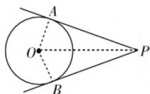

# 刍议如何提升学生的解题能力

# ● 江苏省苏州实验中学 严保静

数学素养是现代社会每个人应该具备的基本素养,数学学习的目的是“学以致用”.在高中阶段,要检验学生的“学”的结果,最直接的形式就是考查其解题能力.学生的解题能力高,解题的收获大是师生追求的现实目标之一.那么,如何提升学生的解题能力呢?笔者认为,教师要从关注“教师教”向关注“学生学”转变,以真学定真教.

# 一、提高解题能力的几个教学策略

高考对学生的数学运用能力和数学实践能力提出了更高的要求,其立意更趋向于能力和素养的考核.因此,要提高学生的解题能力,教师需结合班级学情,采取行之有效的教学策略,以此提升学生解题能力.

# 1. 重过程轻结论

数学本来魅力无限,可数学题目变化多端,令人望而生畏.如果老师只重视知识结论和套路,学生死记实施方案,机械模仿和重复,事倍功半,久之会生厌.现在的试卷更具有开放性,出题人和阅卷人都重视概念掌握和解决问题的方法,而并不过分侧重于考查学生的计算能力,更加强调过程性.这样的一种趋势,势必在今后的中学数学教学和高考数学题中进一步得到体现.

2019年全国卷第4题“断臂维纳斯”身高问题(题目略)，学生之所以感到有些困惑，并不是因为题目难，而是因为题目新，需要学生灵活地运用黄金分割点的知识来解决问题。这种发展趋势，反应到数学教学上，就要求教师更加注重对学生掌握基本概念和运用这些概念解决问题的方法的教学。这样的要求如果仅靠过去的题海战术是很难适应的。所以教师必须改变传统的教学观念，让数学更加贴合生活实际，让学生掌握数学方法，这远比只是完成大量的计算要困难得多，也重要得多。

# 2. 重思维轻技巧

例 1 已知圆 O 的半径为 1, PA, PB 为该圆的两条切线, A, B 为两切点, 那么 $\overrightarrow{PA} \cdot \overrightarrow{PB}$ 的最小值为 \_\_\_\_.

解法1:如图1,设 $\angle APB=2\theta,0<\theta<\frac{\pi}{2}$ ,则 $\overrightarrow{PA}$

  
图1

$$
\begin{array}{l} \cdot \overrightarrow {P B} = \overrightarrow {| P A |} \cdot \overrightarrow {| P B |} \cos 2 \theta = P A ^ {2} \cos 2 \theta = P A ^ {2} (1 - \\ 2 \sin^ {2} \theta) = (P O ^ {2} - 1) \left(1 - \frac {2}{P O ^ {2}}\right) = P O ^ {2} + \frac {2}{P O ^ {2}} - 3 \geqslant \\ 2 \sqrt {2} - 3. \\ \end{array}
$$

如果设 $PA = x(x > 0)$

$$
\begin{array}{l} \overrightarrow {P A} \cdot \overrightarrow {P B} = \overrightarrow {| P A |} \cdot \overrightarrow {| P B |} \cos 2 \theta = x ^ {2} (1 - 2 \sin^ {2} \theta) \\ = \frac {x ^ {2} (x ^ {2} - 1)}{x ^ {2} + 1} = \frac {x ^ {4} - x ^ {2}}{x ^ {2} + 1}. \\ \end{array}
$$

令 $t = 1 + x^2, \overrightarrow{PA} \cdot \overrightarrow{PB} = \frac{(t - 1)(t - 2)}{t} =$

$$
\frac {(t - 1) (t - 2)}{t} = t + \frac {2}{t} - 3 \geqslant 2 \sqrt {2} - 3.
$$

两种解法本质上一样！在 Rt△AOB 中，OA 是已知的，无论设 AP，OP 的长哪个为变量都可以！

解法2:设 $\angle APB = \theta, 0 < \theta < \pi$ , 则 $\overrightarrow{PA} \cdot \overrightarrow{PB} =$

$$
\overrightarrow {| P A |} \cdot \overrightarrow {| P B |} \cos \theta = \left(\frac {1}{\tan \frac {\theta}{2}}\right) ^ {2} \cos \theta = \frac {\cos^ {2} \frac {\theta}{2}}{\sin^ {2} \frac {\theta}{2}}.
$$

$$
\left(1 - 2 \sin^ {2} \frac {\theta}{2}\right) = \frac {\left(1 - \sin^ {2} \frac {\theta}{2}\right) \left(1 - 2 \sin^ {2} \frac {\theta}{2}\right)}{\sin^ {2} \frac {\theta}{2}}.
$$

令 $x = \sin^2\frac{\theta}{2}, 0 < x \leqslant 1$ ，则 $\overrightarrow{PA} \cdot \overrightarrow{PB} = \frac{(1 - x)(1 - 2x)}{x} = 2x + \frac{1}{x} - 3 \geqslant 2\sqrt{2} - 3.$

比较发现几种解法最后都归为基本不等式或者函数求最值. 这是求最值最基本最本质的方法. 前两种解法学生更容易接受, 更能想得到!

让学生从知晓“怎么做”拓展为“为什么做”，引导学生进行全方位的思考，提升透过现象看本质的能力，有效提高学生的数学思维能力。所选题目，最好是解法具有多样性. 这里的多样性不是越多越好, 有些突兀的解法形成不了能力, 还干扰思路, 打击积极性, 不足为取. 最能体现数学思想方法的解法, 才是能体现数学核心知识的方法, 更有利于注重学生数学思维能力的培养. 这样的解法, 学生越能容易想得到越好, 学生的数学素养培养的越深刻.

# 3. 重本质轻套路

例2 若不等式 $x^{2} - 2ax + 1 > 0$ 对 $\forall x\in [1,$ 2]时恒成立，求 $a$ 的取值范围.

学生板书两种解法.

解法 1: $f(x)=x^{2}-2ax+1$ , 对称轴 x=a.

若 $a < 1, f(x)_{\min} = f(1) > 0$ ，得 $a < 1$ ；

若 $a > 2, f(x)_{\min} = f(2) > 0$ ，得 $a > \frac{5}{4}$ ，舍去；

若 $1 \leqslant a \leqslant 2, f(x)_{\min} = f(a) > 0$ ，得 $-1 < a < 1$ ，舍去.

综上 $a < 1$ .

解法2:由不等式可得 $a<\frac{x^{2}+1}{2x}$ 在 $x\in[1,2]$ 上恒成立，只要 $a<\left(\frac{x^{2}+1}{2x}\right)_{\min}$ 即可，问题转化为求 $\frac{x^{2}+1}{2x}$ 的最小值.

师追问:你觉得哪种方法更简单?为什么?

生 1: 分离参数法不用分类讨论.

师点评:非常好! 两种解法都可以,都是解决恒成立问题常用的两种思路. 第一种函数最值法,只要能够求出最值即可解决. 第二种分离参数法,此题不用分类讨论,所以更加简单方便.

变式1:若不等式 $x^{2} - 2ax + 1 > 0$ 对 $\forall x\in [-1,2]$ 时恒成立，求 $a$ 的取值范围.

对于变式 1 学生也给出两种不同解法.

解法 1: 同上, 略.

解法2:对 $x\in(0,2]$ ，由不等式可得 $a<\frac{x^{2}+1}{2x}$ 在 $x\in(0,2]$ 上恒成立.

对 x=0，由不等式可得 1＞0 恒成立.

对 $x \in [-1,0)$ 由不等式可得 $a > \frac{x^2 + 1}{2x}$ 在 $x \in [-1,0)$ 上恒成立.

师追问:这时你选哪一种?为什么?

生 2: 都可以. 因为两种方法都要讨论. 我更趋向于第一种, 因为二次函数我更熟悉.

师追问:为什么变式的分离参数法要讨论了呢?

生 2: 不等式两边同时除以一个数时要注意它的正负, 还有 0.

师点评:非常好！对解题思路要进行预判,数学方法才能运用自如.

变式 2: 若不等式 $x^{2}-2ax+1<0$ 对 $\forall x\in[1,2]$ 时恒成立，求 a 的取值范围.

生 3: 解法同前面两种, 只要把“小于”改成“大于”.

师追问:还有其他解法吗?

生4:令 $f(x)=x^{2}-2ax+1$ ，由一元二次函数的图象得 $\left\{\begin{aligned}f(1)&<0,\\ f(2)&<0.\end{aligned}\right.$

师追问:此法漂亮!怎么想到这么解的?

生 4: 这是一个一元二次不等式, 想到和一元二次函数相互转化. 例 2 和变式 1 对应的图象情况比较多, 此法不太适合.

数学习题多变, 更改一个已知条件, 甚至有时只更换一个关键字就可能变成一个全新的题目. 最终用多个解法解这道题目. 多种方法中注意方法的优选与优化. 只有把握问题的一般原理的本质, 才能迅速、正确、高效地达成解题的目的.

# 二、提高解题能力的几个学习策略

在应试教育的影响下,学生学习长期处于被支配的状态,对教师产生过度的依赖,从而出现听得懂不会做的尴尬局面.为改变这一现状,教师要培养学生良好的审题、阅读习惯,引导学生在错误中反思,在反思中发现,在发现中改进,从而提升自主学习能力.

# 1. 培养审题能力

数学是思维的体操, 其文字、符号、图形更是一门语言. 学生接收信息、分析信息和加工信息也需要良好的阅读能力. 因此提升解题能力不能忽视学生阅读能力、审题能力的培养. 读出已知条件中的显性信息与隐性信息, 抓住问题的本质进行深入地分析, 自然找到正确的解题思路. 提高学生的解题能力, 审题是开始, 也是重中之重.

例3 设复数 $z_{1}$ 和 $z_{2}$ 满足关系式 $z_{1}\overline{z}_{2} + \overline{A} z_{1} + \overline{A} z_{2} = 0$ ，其中 $A$ 是非零的复数，证明：

(1) $\left|z_{1}+A\right|\cdot\left|z_{2}+A\right|=\left|A\right|^{2};$   
(2) $\frac{z_1 + A}{z_2 + A} = \left|\frac{z_1 + A}{z_2 + A}\right|$ .

本题难度较大, 很多学生不审题就直接进行推导, 进而推导时思维受阻. 要解本题需要对已知进行挖掘, 若可以找到隐含条件“ $\frac{z_{1}+A}{z_{2}+A}$ 必为正实数”, 由此证明问题也就迎刃而解了.

审题不仅要找到问题的关键词,也要重视隐含条件的挖掘, 只有找到问题本质, 才能将提取的信息进行有效关联, 进而形成解题思路, 突破难点.

# 2. 提升分析能力

在学习中经常出现这样的情况,上课听得懂,解题时却感觉无从下手,尤其对于已知条件较多的题目更是一头雾水.很多同学笼统地将问题归结为“题难”.

例 4 在 $\triangle ABC$ 中, 内角 A, B, C 的对边分别是 a, b, c, 如果 $a + b \geqslant 2c$ , 求证: $C \geqslant \frac{\pi}{3}$ .

如果注意到 $a + b \geqslant 2c$ 是关于边的关系，想到 $C$ 的余弦.

$$
\begin{array}{r l} & {\text {证法} 1: \cos C = \frac {a ^ {2} + b ^ {2} - c ^ {2}}{2 a b} \geqslant \frac {a ^ {2} + b ^ {2} - \left(\frac {a + b}{2}\right) ^ {2}}{2 a b} =} \\ & {\frac {\frac {3}{4} a ^ {2} + \frac {3}{4} b ^ {2} - \frac {1}{2} a b}{2 a b} \geqslant \frac {\frac {3}{2} a b - \frac {1}{2} a b}{2 a b} = \frac {1}{2}, \text {当且仅当} a} \\ & {= b \text {时取等号,所以} C \geqslant \frac {\pi}{3}.} \end{array}
$$

如果注意到 $a + b \geqslant 2c$ 可以改写成 $|\overrightarrow{BC}| + |\overrightarrow{AC}| \geqslant 2|\overrightarrow{AB}|$ ，想到向量的方法.

证法2:由 $|\overrightarrow{BC}|+|\overrightarrow{AC}|\geqslant2|\overrightarrow{AB}|$ ,

得 $|\overrightarrow{BC}| + |\overrightarrow{AC}| \geqslant 2|\overrightarrow{BC} - \overrightarrow{AC}|$ .

平方得 $3|\overrightarrow{BC}|^2 + 3|\overrightarrow{AC}|^2 - 8|\overrightarrow{BC}||\overrightarrow{AC}|\cos C - 2|\overrightarrow{BC}||\overrightarrow{AC}|\leqslant 0,$

$$
\begin{array}{l} \cos C \geqslant \frac {3 | \overrightarrow {B C} | ^ {2} + 3 | \overrightarrow {A C} | ^ {2} - 2 | \overrightarrow {B C} | | \overrightarrow {A C} |}{8 | \overrightarrow {B C} | | \overrightarrow {A C} |} \\ \geqslant \frac {6 | \overrightarrow {B C} | | \overrightarrow {A C} | - 2 | \overrightarrow {B C} | | \overrightarrow {A C} |}{8 | \overrightarrow {B C} | | \overrightarrow {A C} |} = \frac {1}{2}. \\ \end{array}
$$

# 3. 加强归纳能力

在解题后从几个方面进行总结: 命题者的意图; 此题的关键之处; 一题一小结, 厘清解题步骤和数学思想方法, 将零碎的知识结构化、系统化; 此题为什么这样做; 解题过程中暴露的知识弱点; 这个问题改变设问角度, 还会变成什么样的题目等等. 考完一次试后, 也要进行总结, 通过总结, 积累成功的经验、失败的教训. 并把平时练习和考试中做错的题目积累成集, 并且经常翻阅复习.

# 4. 深化反思能力

每个学生的学习习惯和解题习惯不同,失分点也不尽相同.失分原因可归结为以下几类:(1)基础知识不扎实,知识点混淆;(2)学习习惯差,审题不清;(3)知识体系碎片化,知识迁移能力差;(4)思维能力差,解题思路含糊不清;(5)数学语言应用不严谨、不规范, 解题过程不完整; (6) 基础计算能力差, 计算频频失分等. 教师要引导学生将失分原因进行分类, 通过对错误的分析、总结和反思, 实现有针对性的查缺补漏. 融会贯通, 解一题会一类, 关注知识的同化、顺应和平衡, 有益于学生总结经验, 吸取教训, 从而有助于学生认识自我, 增强自信, 提升质量.

例 5 现有 A, B, C 3 项任务, A 任务需要 2 人完成, B 和 C 任务各需 1 人完成, 若从 10 人中选派 4 人来完成这 3 项任务, 有多少种不同的选法?

错解 1: 第一步, 从 10 人中任意选 4 人, 则有 $C_{10}^{4}$ 种选法; 第二步, 从 4 人中选择 2 人完成 A 任务, 有 $A_{4}^{2}$ 种方法; 第三步, 剩下 2 人完成另外两项任务, 则有 $A_{2}^{2}$ 种方法, 则共有 $C_{10}^{4}A_{4}^{2}A_{2}^{2}$ 种不同的方法, 求解得 5040 种.

错因分析:本题的思路清晰,第一步和第三步的理解也没有问题,问题主要出现在第二步,完成A任务的两人与顺序没有关系,因此应为组合,而非排列,故需将 $A_{4}^{2}$ 改为 $C_{4}^{2}$ .出现此问题的根本原因是对“排列”和“组合”的概念理解不清,因概念混淆而造成了失分.

错解 2: 同样分三步完成, 然在第二步和第三步求解中都忽略顺序关系, 因此得出的答案 $C_{10}^{4}C_{4}^{2}C_{2}^{2}=1260$ 种.

错因分析: 错解 2 与错解 1 的错因相同, 都是因为对概念的理解不够深入而产生了错误.

解法 1: 根据对错因的分析, 可以得到选法为 $C_{10}^{4}C_{4}^{2}A_{2}^{2}=2520$ 种.

解法2:分两步完成,从10人中任意选2人完成A任务,则有 $C_{10}^{2}$ 种,B,C两项任务从8人中选两人,则为 $A_{8}^{2}$ ,故有 $C_{10}^{2}A_{8}^{2}=2520$ 种.

在解题中,很多同学容易将“排列”和“组合”混淆,概念混淆是主因.教师要带领学生分析错因,让学生进行自我反思,看问题的症结是概念理解问题还是审题问题,只有分清真正的错因,才能有效地查缺补漏,留给学生时间进行适时地反思,搞清问题的来龙去脉,再筛选最优化的方法,培养自主学习的能力,注重学生数学素养的提升.

总之,解题能力的提升是一个长期而复杂的过程.教学中要坚持以学生为主体,落实“四基”,培养“四能”,重视数学意识和数学素养的形成和培养,让学生在解题过程中学会分析、学会总结和思考,突破解题难关,提升解题能力,走向智慧深处,最终完成立德树人的任务.