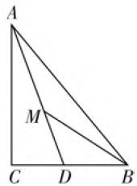

# 多思维展开,妙探究拓展

——以一道解三角形题的破解为例

● 新疆昌吉市第一中学 沙金城

三角形是中学数学中最基本的平面几何图形之一，有效集合了点、线段、角等几何的基本元素，交汇融合了平面几何、三角函数、解三角形等相关的知识，可以从点、线段、角等不同角度切入，利用解析几何、三角函数、解三角形等不同思维角度来构思与切入，有时还可以借助函数、导数、基本不等式等知识来分析与处理，从而得到不同的破解方法。此类问题一直是每年高考中的基本题型之一，也是考查的热点与重点之一，备受各方关注，特别受命题者的青睐。

# 一、问题呈现

问题: 如图 1, 在 $\triangle ABC$ 中, AC $\perp BC$ , D 为 BC 边上的点, M 为 AD 上的点, CD = 1, $\angle CAB = \angle MBD = \angle DMB$ , 则 AM = \_\_\_\_.

text_image

A
M
C D B

图1

此题以三角形为问题背景,题目简单易懂,通过点与线的关系,以及角的相等关系与线段的长度等信息来设置问题,看似初中平面几何的内容,实质上有效融合了平面几何、三角函数以及解三角形等相关知识,构建起初中平面几何与高中数学之间的和谐统一,从而合理设置,巧妙应用.在具体的破解过程中,可以借助三角恒等变换思维、解三角形思维以及参数思维等不同思维方式来审视,从而有效切入,正确破解.

# 二、问题破解

# 思维视角(一)三角恒等变换思维

解法1：（变角处理法）设 $\angle CAB = \angle MBD = \angle DMB = \theta$ ，则 $\angle ADC = 2\theta, MD = BD.$ 在 $\triangle ADC$ 中，由三角函数的定义可知， $\tan 2\theta = \frac{AC}{CD} = AC, AD = \frac{CD}{\cos 2\theta} = \frac{1}{\cos 2\theta}$ . 在 $\triangle ABC$ 中，由三角函数的定义可知， $BC = AC \cdot \tan \theta = \tan 2\theta \tan \theta$ ，所以 $AM = AD - MD = AD - BD = AD - (BC - CD) = AD - BC + 1 = \frac{1}{\cos 2\theta} -$

$$
\begin{array}{l} \tan 2 \theta \tan \theta + 1 = \frac {\cos \theta - \sin 2 \theta \sin \theta}{\cos 2 \theta \cos \theta} + 1 = \\ \frac {\cos (2 \theta - \theta) - \sin 2 \theta \sin \theta}{\cos 2 \theta \cos \theta} + 1 = \frac {\cos 2 \theta \cos \theta}{\cos 2 \theta \cos \theta} + 1 = 2. \\ \end{array}
$$

故填答案:2.

解法2：（万能公式法）以上部分同方法 $1,AM = \frac{1}{\cos 2\theta} -\tan 2\theta \tan \theta +1 = \frac{1 + \tan^2\theta}{1 - \tan^2\theta} -\frac{2\tan\theta}{1 - \tan^2\theta}\cdot \tan \theta$ $+1 = \frac{1 - \tan^2\theta}{1 - \tan^2\theta} +1 = 2.$

故填答案:2.

点评:从平面几何角度切入,通过三角函数的定义的转化,把目标线段表示出来,再通过三角恒等变换公式来化简,从而得以求解相应的线段长度.当然这里对目标线段所对应的三角关系式的变形还可以借助齐次式的转化,直接通分化简来完成,都起到化简三角关系式与求值的目的.

# 思维视角(二)解三角形思维

解法3:(正弦定理法1)设 $\angle CAB=\angle MBD=\angle DMB=\theta$ ，则 $\angle ADC=2\theta,\angle DAC=\frac{\pi}{2}-2\theta,\angle ABM=\frac{\pi}{2}-2\theta,\angle AMB=\pi-\theta.$ 在 $\triangle ABC$ 中，由三角函数的定义可知， $\cos\theta=\frac{AC}{AB}$ .在 $\triangle ADC$ 中，结合正弦定理，可得 $\frac{CD}{\sin\left(\frac{\pi}{2}-2\theta\right)}=\frac{AC}{\sin 2\theta}$ .在 $\triangle AMB$ 中，结合正弦定理，可得 $\frac{AM}{\sin\left(\frac{\pi}{2}-2\theta\right)}=\frac{AB}{\sin(\pi-\theta)}$ ，以上两式对应相除，可得 $\frac{CD}{AM}=\frac{AC\sin(\pi-\theta)}{AB\sin 2\theta}=\frac{AC\sin\theta}{2AB\sin\theta\cos\theta}=\frac{AC}{2AB\cos\theta}=\frac{1}{2}$ ，所以 $AM=2CD=2.$

故填答案:2.

解法4:(正弦定理法2)设 $\angle CAB=\angle MBD=\angle DMB=\theta$ ，则 $\angle ADC=2\theta,\angle ABM=\frac{\pi}{2}-2\theta,\angle AMB=\pi-\theta.$ 在 $\triangle AMB$ 中，结合正弦定理，可得 $\frac{AM}{\sin\left(\frac{\pi}{2}-2\theta\right)}=\frac{AB}{\sin(\pi-\theta)}$ ，即 $AM=\frac{AB\sin\left(\frac{\pi}{2}-2\theta\right)}{\sin(\pi-\theta)}=\frac{AB\cos 2\theta}{\sin\theta}$ .在 $\triangle ADC$ 中，由三角函数的定义可知， $\tan 2\theta=\frac{AC}{CD}=AC.$ 在 $\triangle ABC$ 中，由三角函数的定义可知， $AB=\frac{AC}{\cos \theta}=\frac{\tan 2\theta}{\cos \theta}$ ，所以 $AM=\frac{AB\cos 2\theta}{\sin \theta}=\frac{\tan 2\theta}{\cos \theta}\cdot\cos 2\theta/\sin \theta=\frac{\sin 2\theta}{\sin \theta\cos \theta}=2.$

故填答案:2.

点评:利用三角函数的定义的转化,结合正弦定理的应用,利用诱导公式的应用把目标线段表示出来,再结合三角恒等变换来化简,从而得以求解相应的线段长度.关键是变形时可以多次利用正弦定理或多次利用三角函数的定义来转化,都可以达到有效串联,合理构建,从而得以化简与求值.

# 思维视角(三) 参数思维

解法5：（边长转化法）设 $\angle CAB = \angle MBD =$ $\angle DMB = \theta$ ，则 $\angle ADC = 2\theta .$ 设 $MD = BD = x,AC =$ y.在Rt△ADC中，由三角函数的定义可知， $\tan 2\theta =$ $\frac{AC}{CD} = y.$ 在Rt△ABC中，由三角函数的定义可知， $\tan \theta$ $= \frac{BC}{AC} = \frac{x + 1}{y}$ 结合二倍角的正切公式，有 $\tan 2\theta =$ $\frac{2\tan\theta}{1 - \tan^2\theta} = \frac{2\cdot\frac{x + 1}{y}}{1 - \left(\frac{x + 1}{y}\right)^2} = y,$ 整理可得 $y^{2} = (x+$ 1)( $x + 3)$ .在Rt△ADC中，由三角函数的定义可知， $\cos 2\theta = \frac{CD}{AD} = \frac{1}{AM + x},$ 而 $\cos 2\theta = \frac{1 - \tan^2\theta}{1 + \tan^2\theta} =$ $\frac{1 - \left(\frac{x + 1}{y}\right)^2}{1 + \left(\frac{x + 1}{y}\right)^2} = \frac{1}{x + 2} = \frac{1}{AM + x},$ 所以 $AM = 2.$

故填答案:2.

点评:结合相应边长的参数的引入,利用三角函数的定义的转化,借助三角恒等变换公式架起桥梁,转化为涉及边长的关系式,结合代数的运算与化简,从而得以求解相应的线段长度. 破解的关键就是合理借助两个参数的穿针引线, 并合理借助三角恒等变换公式来转化, 进而得以化简与求值.

# 三、探究拓展

探究 1: 通过变换题目条件与所要求解的结论之间的位置, 保留其他相应的条件, 从而得以拓展, 得到以下相应的变式问题.

变式 1: 如图 1, 在 $\triangle ABC$ 中, $AC \perp BC$ , D 为 BC 边上的点, M 为 AD 上的点, AM = 2, $\angle CAB = \angle MBD = \angle DMB$ , 则 CD = \_\_\_\_.

解析:根据原问题的解析过程,结合条件“AM=2”的变化加以转化即可得以破解,可知 CD=1.

故填答案:1.

探究 2: 根据以上问题及其破解方法与过程, 对原问题可以加以合理推广, 得到以下一般性的结论.

结论 1: 如图 1, 在 $\triangle ABC$ 中, $AC \perp BC$ , D 为 BC 边上的点, M 为 AD 上的点, $\angle CAB = \angle MBD = \angle DMB$ , 则有 AM = 2CD.

证明：设 $\angle CAB = \angle MBD = \angle DMB = \theta$ ，则 $\angle ADC = 2\theta ,\angle DAC = \frac{\pi}{2} -2\theta ,\angle ABM = \frac{\pi}{2} -2\theta ,$ $\angle AMB = \pi -\theta .$ 在 $\triangle ABC$ 中，由三角函数的定义可知， $\cos \theta = \frac{AC}{AB}$ .在 $\triangle ADC$ 中，结合正弦定理，可得 $\frac{CD}{\sin\left(\frac{\pi}{2} - 2\theta\right)} = \frac{AC}{\sin 2\theta}$ .在 $\triangle AMB$ 中，结合正弦定理，可得 $\frac{AM}{\sin\left(\frac{\pi}{2} - 2\theta\right)} = \frac{AB}{\sin(\pi - \theta)}.$ 以上两式对应相除，可得 $\frac{CD}{AM} = \frac{AC\sin(\pi - \theta)}{AB\sin 2\theta} = \frac{AC\sin\theta}{2AB\sin\theta\cos\theta} = \frac{AC}{2AB\cos\theta}$ $= \frac{1}{2}$ ，所以 $AM = 2CD.$

点评:根据结论的证明过程可以看出,巧妙借助正弦定理,可以有效建立起AM与CD之间的数量关系式,得到一个边长之间的恒等关系式.利用该结论,可以直接得到原问题或变式1的相关求值问题.

利用三角形为背景设置与之相关的解三角形问题,可以有效融合多个不同的知识点,创新构建起交汇知识点之间的有机联系,借助不同知识点加以合理转化,充分体现中学数学整个知识体系之间的融会贯通,从而真正实现数学解题能力与数学应用能力的全面提升,达到掌握与拓展知识,发散数学思维,形成数学品质,提升数学能力,培养数学核心素养的目的.